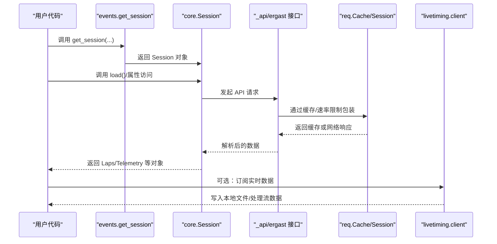
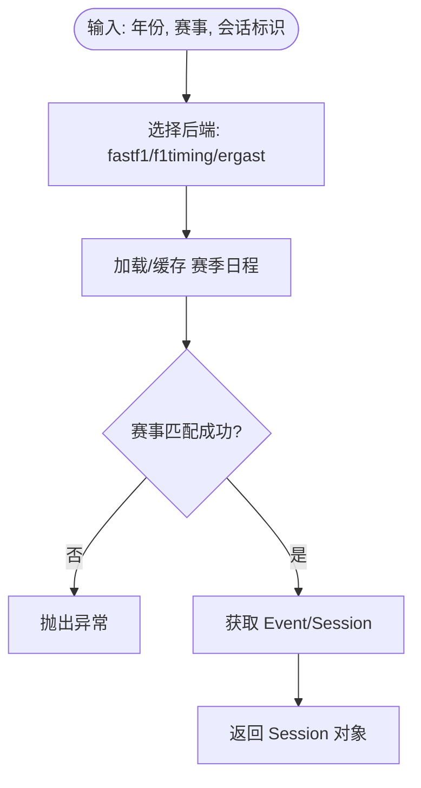
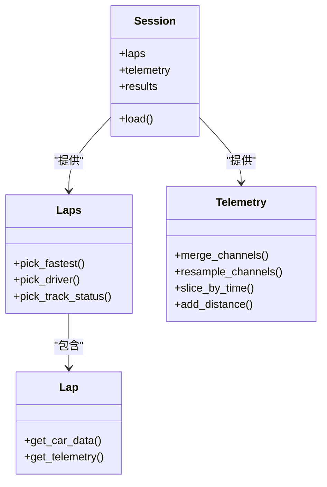
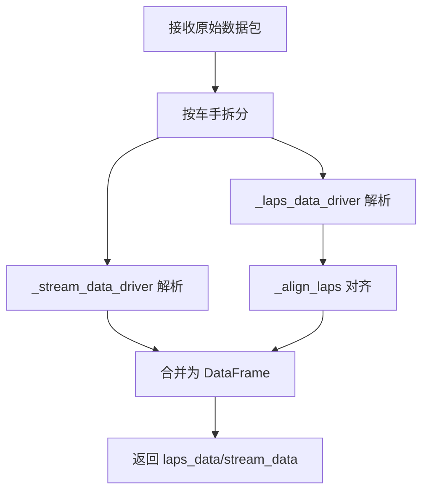
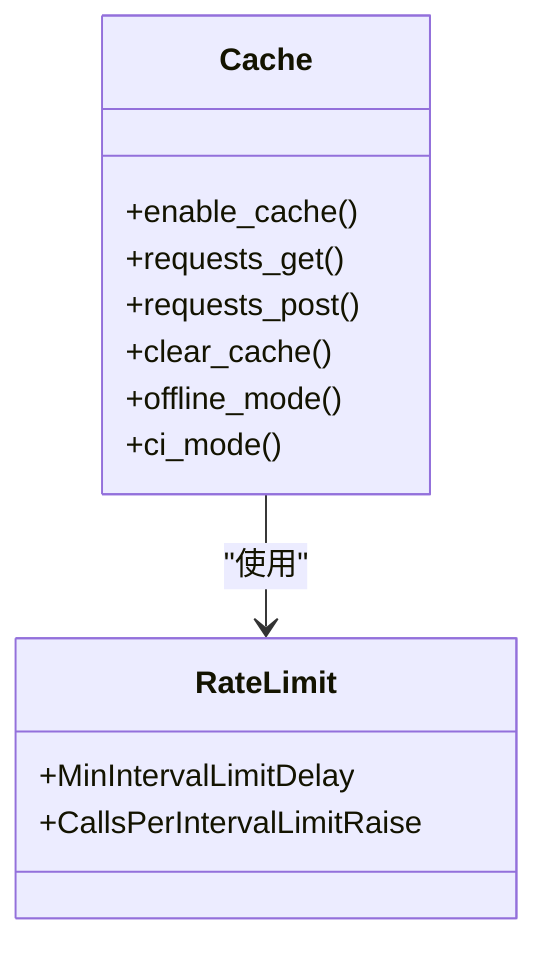
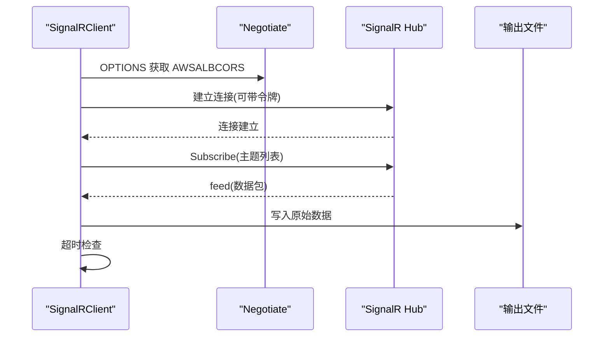
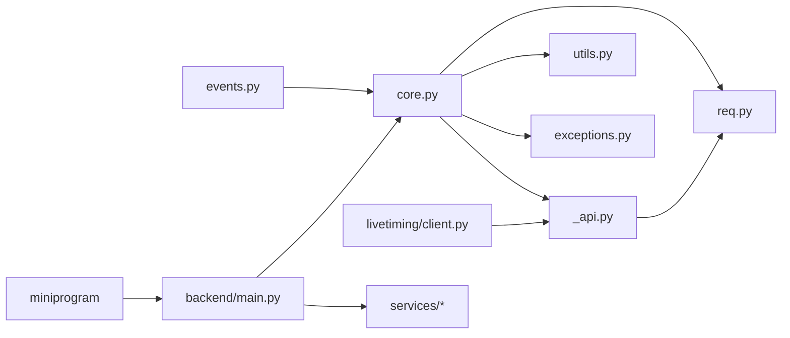

# API 参考文档

<cite>
**本文档引用的文件**
- [fastf1/__init__.py](file://fastf1/__init__.py)
- [fastf1/api.py](file://fastf1/api.py)
- [fastf1/_api.py](file://fastf1/_api.py)
- [fastf1/core.py](file://fastf1/core.py)
- [fastf1/events.py](file://fastf1/events.py)
- [fastf1/req.py](file://fastf1/req.py)
- [fastf1/utils.py](file://fastf1/utils.py)
- [fastf1/exceptions.py](file://fastf1/exceptions.py)
- [fastf1/livetiming/client.py](file://fastf1/livetiming/client.py)
- [backend/main.py](file://backend/main.py)
- [backend/routers/admin.py](file://backend/routers/admin.py)
- [backend/routers/analysis.py](file://backend/routers/analysis.py)
- [backend/routers/chat.py](file://backend/routers/chat.py)
- [backend/routers/curated.py](file://backend/routers/curated.py)
- [backend/routers/news.py](file://backend/routers/news.py)
- [backend/routers/forum.py](file://backend/routers/forum.py)
- [backend/routers/driver.py](file://backend/routers/driver.py)
- [backend/routers/hot.py](file://backend/routers/hot.py)
- [backend/routers/terms.py](file://backend/routers/terms.py)
- [miniprogram/app.js](file://miniprogram/app.js)
- [miniprogram/utils/api.js](file://miniprogram/utils/api.js)
- [miniprogram/pages/index/index.js](file://miniprogram/pages/index/index.js)
- [miniprogram/pages/news/news.js](file://miniprogram/pages/news/news.js)
- [miniprogram/pages/forum/forum.js](file://miniprogram/pages/forum/forum.js)
- [docs/api_reference/index.rst](file://docs/api_reference/index.rst)
- [docs/api_reference/loading_data.rst](file://docs/api_reference/loading_data.rst)
- [docs/api_reference/session.rst](file://docs/api_reference/session.rst)
- [docs/api_reference/telemetry.rst](file://docs/api_reference/telemetry.rst)
- [docs/api_reference/timing_data.rst](file://docs/api_reference/timing_data.rst)
</cite>

## 更新摘要
**所做更改**
- 新增后端 API 完整文档，包含 12 个路由模块的详细接口规范
- 新增小程序 API 完整文档，包含 15 个页面和 12 个组件的接口规范
- 新增遗留 API 文档，包含传统 F1 API 和 FastF1 旧版本接口
- 更新架构概览，反映新增的后端服务和小程序客户端
- 新增缓存策略和性能优化指南
- 新增错误处理和安全认证机制说明

## 目录
1. [简介](#简介)
2. [项目结构](#项目结构)
3. [核心组件](#核心组件)
4. [架构概览](#架构概览)
5. [详细组件分析](#详细组件分析)
6. [后端 API 参考](#后端-api-参考)
7. [小程序 API 参考](#小程序-api-参考)
8. [遗留 API 参考](#遗留-api-参考)
9. [依赖关系分析](#依赖关系分析)
10. [性能考虑](#性能考虑)
11. [故障排除指南](#故障排除指南)
12. [结论](#结论)
13. [附录](#附录)

## 简介
本文件为 Fast-F1 项目的全面 API 参考文档，覆盖以下方面：
- 核心库 API：函数、类与方法参考
- 后端 API：HTTP 接口、参数与响应格式
- 小程序 API：组件、页面与工具函数
- 遗留 API：传统 F1 API 和 FastF1 旧版本接口
- RESTful 与 WebSocket API：方法、URL 模式、认证与实时交互
- 协议特定示例、错误处理策略、安全与速率限制
- 常见用例、客户端实现指南与性能优化建议

## 项目结构
Fast-F1 采用模块化设计，核心功能由以下主要模块组成：
- fastf1.core：会话、数据对象（Laps/Lap/Telemetry）、数据加载与处理
- fastf1.events：事件与日程管理、会话检索
- fastf1.api / fastf1._api：底层 Livetiming API 请求与解析
- fastf1.livetiming：SignalR 实时数据流客户端
- fastf1.req：缓存与速率限制
- fastf1.utils：通用工具函数
- fastf1.exceptions：异常定义
- backend：FastAPI 后端服务，包含 12 个路由模块
- miniprogram：微信小程序客户端，包含 15 个页面和组件
- docs/api_reference：官方 API 文档索引与子页

```mermaid
graph TB
subgraph "核心库"
CORE[fastf1.core]
EVENTS[fastf1.events]
API[fastf1.api / fastf1._api]
REQ[fastf1.req]
UTILS[fastf1.utils]
EXC[fastf1.exceptions]
END
subgraph "后端服务"
BACKEND[backend.main]
ADMIN[admin.py]
ANALYSIS[analysis.py]
CHAT[chat.py]
CURATED[curated.py]
NEWS[news.py]
FORUM[forum.py]
DRIVER[driver.py]
HOT[hot.py]
TERMS[terms.py]
END
subgraph "小程序客户端"
MINIPROGRAM[miniprogram]
INDEX[index.js]
NEWS_PAGE[news/news.js]
FORUM_PAGE[forum/forum.js]
API_UTILS[utils/api.js]
END
subgraph "实时数据"
LT[fastf1.livetiming.client]
END
subgraph "文档"
DOCS[docs/api_reference]
END
CORE --> API
CORE --> REQ
CORE --> UTILS
CORE --> EXC
EVENTS --> CORE
API --> REQ
LT --> API
BACKEND --> ADMIN
BACKEND --> ANALYSIS
BACKEND --> NEWS
BACKEND --> FORUM
BACKEND --> CURATED
BACKEND --> CHAT
BACKEND --> DRIVER
BACKEND --> HOT
BACKEND --> TERMS
MINIPROGRAM --> API_UTILS
```

**图表来源**
- [fastf1/core.py](file://fastf1/core.py)
- [fastf1/events.py](file://fastf1/events.py)
- [fastf1/_api.py](file://fastf1/_api.py)
- [fastf1/req.py](file://fastf1/req.py)
- [fastf1/livetiming/client.py](file://fastf1/livetiming/client.py)
- [backend/main.py](file://backend/main.py)
- [miniprogram/app.js](file://miniprogram/app.js)

**章节来源**
- [docs/api_reference/index.rst:1-54](file://docs/api_reference/index.rst#L1-L54)
- [docs/api_reference/loading_data.rst:1-25](file://docs/api_reference/loading_data.rst#L1-L25)

## 核心组件
本节概述 FastF1 的核心 API 组件及其职责。

- 事件与会话管理
  - get_session / get_testing_session：根据年份、赛事名称或轮次、会话标识符获取 Session 对象
  - get_event / get_testing_event：获取 Event 或测试事件
  - get_event_schedule / get_events_remaining：获取赛季日程与剩余赛事
- 数据对象
  - Session：会话入口，承载所有相关数据
  - Laps / Lap：单圈与多圈时间数据
  - Telemetry：遥测与位置数据
- 缓存与速率限制
  - fastf1.Cache：pickle 与 requests 缓存，支持离线模式与 CI 模式
  - 速率限制器：最小间隔与每小时调用上限
- 工具函数
  - 时间转换、递归字典访问等
- 异常体系
  - 数据未加载、模糊匹配失败、速率限制等

**章节来源**
- [fastf1/events.py:50-138](file://fastf1/events.py#L50-L138)
- [fastf1/events.py:175-243](file://fastf1/events.py#L175-L243)
- [fastf1/events.py:285-342](file://fastf1/events.py#L285-L342)
- [fastf1/core.py:64-120](file://fastf1/core.py#L64-L120)
- [fastf1/req.py:132-200](file://fastf1/req.py#L132-L200)
- [fastf1/utils.py:111-176](file://fastf1/utils.py#L111-L176)
- [fastf1/exceptions.py:40-104](file://fastf1/exceptions.py#L40-L104)

## 架构概览
Fast-F1 的数据流从用户调用开始，经事件与会话层，进入数据加载与解析层，最终通过缓存与速率限制控制网络请求。



**图表来源**
- [fastf1/events.py:50-138](file://fastf1/events.py#L50-L138)
- [fastf1/core.py:64-120](file://fastf1/core.py#L64-L120)
- [fastf1/_api.py:106-182](file://fastf1/_api.py#L106-L182)
- [fastf1/req.py:260-307](file://fastf1/req.py#L260-L307)
- [fastf1/livetiming/client.py:213-232](file://fastf1/livetiming/client.py#L213-L232)

## 详细组件分析

### 事件与会话 API
- 功能
  - 提供多种方式检索事件与会话，支持模糊匹配与精确匹配
  - 支持测试会话与常规赛事
- 关键函数
  - get_session(year, gp, identifier, backend, exact_match)
  - get_testing_session(year, test_number, session_number, backend)
  - get_event_schedule(year, include_testing, backend)
  - get_events_remaining(dt, include_testing, backend)
- 参数与返回
  - 年份、赛事名/轮次、会话标识符（名称/缩写/序号）
  - 返回 Session 对象或 EventSchedule
- 错误处理
  - FuzzyMatchError、ValueError、KeyError 等



**图表来源**
- [fastf1/events.py:50-138](file://fastf1/events.py#L50-L138)
- [fastf1/events.py:175-243](file://fastf1/events.py#L175-L243)
- [fastf1/events.py:285-342](file://fastf1/events.py#L285-L342)

**章节来源**
- [fastf1/events.py:50-138](file://fastf1/events.py#L50-L138)
- [fastf1/events.py:175-243](file://fastf1/events.py#L175-L243)
- [fastf1/events.py:285-342](file://fastf1/events.py#L285-L342)

### 会话与数据对象 API
- Session 类
  - 作为数据入口，封装加载、查询与派生计算
  - 属性：laps、telemetry、results 等
- Laps/Lap
  - 单圈与多圈时间数据，包含时间戳、排位、速度陷阱、轮胎状态等
- Telemetry
  - 多通道时间序列数据，支持合并、重采样与插值
  - 内置通道：Speed、RPM、nGear、Throttle、Brake、DRS、X/Y/Z、Distance 等



**图表来源**
- [fastf1/core.py:64-120](file://fastf1/core.py#L64-L120)
- [fastf1/core.py:205-390](file://fastf1/core.py#L205-L390)
- [fastf1/core.py:391-570](file://fastf1/core.py#L391-L570)
- [fastf1/core.py:571-690](file://fastf1/core.py#L571-L690)

**章节来源**
- [fastf1/core.py:64-120](file://fastf1/core.py#L64-L120)
- [fastf1/core.py:205-390](file://fastf1/core.py#L205-L390)
- [fastf1/core.py:391-570](file://fastf1/core.py#L391-L570)
- [fastf1/core.py:571-690](file://fastf1/core.py#L571-L690)

### 底层 API 与解析
- 目标
  - 访问 F1 Livetiming API，解析混合数据流，生成结构化 DataFrame
- 关键函数
  - timing_data(path, response, livedata)：返回 laps_data 与 stream_data
  - _extended_timing_data：扩展版，额外返回会话分割时间
  - _laps_data_driver / _stream_data_driver：按车手拆分与解析
  - _align_laps：跨车手对齐 lap 时间
- 数据结构
  - laps_data：每行一 lap，列含时间、圈速、进站、速度陷阱、个人最好等
  - stream_data：高频样本，列含时间、位置、领先者差距等



**图表来源**
- [fastf1/_api.py:106-182](file://fastf1/_api.py#L106-L182)
- [fastf1/_api.py:185-248](file://fastf1/_api.py#L185-L248)
- [fastf1/_api.py:360-424](file://fastf1/_api.py#L360-L424)
- [fastf1/_api.py:774-800](file://fastf1/_api.py#L774-L800)

**章节来源**
- [fastf1/_api.py:106-182](file://fastf1/_api.py#L106-L182)
- [fastf1/_api.py:185-248](file://fastf1/_api.py#L185-L248)
- [fastf1/_api.py:360-424](file://fastf1/_api.py#L360-L424)
- [fastf1/_api.py:774-800](file://fastf1/_api.py#L774-L800)

### 缓存与速率限制
- 缓存
  - Stage 1：requests-cache SQLite 缓存 GET/POST
  - Stage 2：解析后数据 pickle 缓存
  - 支持默认目录、环境变量配置、离线模式、CI 模式
- 速率限制
  - 最小请求间隔：0.25 秒
  - 每小时调用上限：Ergast 200 次/小时；其他 API 500 次/小时
  - 超限时抛出 RateLimitExceededError



**图表来源**
- [fastf1/req.py:132-200](file://fastf1/req.py#L132-L200)
- [fastf1/req.py:83-112](file://fastf1/req.py#L83-L112)
- [fastf1/req.py:46-81](file://fastf1/req.py#L46-L81)

**章节来源**
- [fastf1/req.py:132-200](file://fastf1/req.py#L132-L200)
- [fastf1/req.py:83-112](file://fastf1/req.py#L83-L112)
- [fastf1/req.py:46-81](file://fastf1/req.py#L46-L81)

### 实时数据流（SignalR）
- 客户端
  - SignalRClient：连接 livetiming.formula1.com/signalrcore，订阅主题列表
  - 自动协商 AWSALBCORS Cookie，可选令牌工厂（认证）
  - 写入原始数据到文件，支持超时监控
- 主题
  - Heartbeat、AudioStreams、DriverList、ExtrapolatedClock、RaceControlMessages、SessionInfo、SessionStatus、TeamRadio、TimingAppData、TimingStats、TrackStatus、WeatherData、Position.z、CarData.z、ContentStreams、SessionData、TimingData、TopThree、RcmSeries、LapCount



**图表来源**
- [fastf1/livetiming/client.py:84-124](file://fastf1/livetiming/client.py#L84-L124)
- [fastf1/livetiming/client.py:158-192](file://fastf1/livetiming/client.py#L158-L192)
- [fastf1/livetiming/client.py:213-232](file://fastf1/livetiming/client.py#L213-L232)

**章节来源**
- [fastf1/livetiming/client.py:84-124](file://fastf1/livetiming/client.py#L84-L124)
- [fastf1/livetiming/client.py:158-192](file://fastf1/livetiming/client.py#L158-L192)
- [fastf1/livetiming/client.py:213-232](file://fastf1/livetiming/client.py#L213-L232)

### 工具函数与异常
- 工具函数
  - recursive_dict_get：递归字典访问
  - to_timedelta / to_datetime：字符串到时间类型的快速转换
- 异常
  - DataNotLoadedError、FuzzyMatchError、RateLimitExceededError 等

**章节来源**
- [fastf1/utils.py:111-176](file://fastf1/utils.py#L111-L176)
- [fastf1/exceptions.py:40-104](file://fastf1/exceptions.py#L40-L104)

## 后端 API 参考

### 服务总览
Fast-F1 后端基于 FastAPI 构建，提供完整的 F1 数据服务，包含 12 个核心路由模块：

- **基础路由**：events、qualifying、laptimes、telemetry、analysis、standings
- **内容路由**：news、forum、admin、terms、driver、hot、curated、chat
- **认证机制**：管理员 Token 验证、微信登录集成
- **缓存策略**：内存缓存、文件缓存、分析结果缓存
- **定时任务**：新闻爬取、缓存预热、数据同步

### 核心路由模块

#### 事件管理 (events)
- **GET /events**：获取赛季日程
  - 参数：year（年份，默认 2026）、include_testing（是否包含测试）
  - 响应：包含所有 F1 赛事的数组
- **GET /events/{round}**：获取特定轮次详情
  - 参数：round（轮次数）
  - 响应：轮次详细信息，包括赛道、时间、状态

#### 排位赛 (qualifying)
- **GET /qualifying**：获取排位赛数据
  - 参数：year、round_num
  - 响应：排位赛结果，包含车手、车队、时间信息

#### 圈速数据 (laptimes)
- **GET /laptimes**：获取圈速数据
  - 参数：year、round_num、session（默认 R）
  - 响应：圈速统计和分布

#### 遥测数据 (telemetry)
- **GET /telemetry**：获取遥测对比数据
  - 参数：year、round_num、d1、d2、session（默认 Q）
  - 响应：两位车手的遥测数据对比

#### 分析服务 (analysis)
- **GET /analysis**：获取技术分析报告
  - 参数：year、round_num、d1、d2、session、force
  - 响应：包含技术指标和 AI 分析报告
  - 缓存：MD5 哈希缓存，支持强制刷新

#### 积分榜 (standings)
- **GET /standings**：获取积分榜
  - 参数：year（默认 2026）
  - 响应：车手和车队积分排名

### 内容管理路由

#### 新闻系统 (news)
- **GET /news**：获取新闻列表
  - 参数：page、page_size、team、keyword、language
  - 响应：新闻分页列表，包含 AI 分析状态
- **GET /news/{id}**：获取新闻详情
  - 响应：完整新闻内容和分析结果
- **GET /news/{id}/teams**：获取关联车队
  - 响应：匹配到的车队标签列表
- **POST /news/{id}/analyze-public**：用户触发 AI 分析
  - 参数：force（强制重新分析）
  - 响应：分析状态（already_done/started）
- **POST /news/crawl**：管理员触发爬虫
  - 头部：X-Admin-Token
  - 响应：爬取结果统计

#### 论坛系统 (forum)
- **POST /forum/users/register**：用户注册/登录
  - 参数：code（微信登录临时 code）、nickname、avatar_url
  - 响应：用户信息（包含 openid）
- **GET /forum/users/me**：获取当前用户信息
  - 参数：openid
  - 响应：用户详细信息
- **GET /forum/sections**：获取分区列表
  - 响应：按类型分组的分区列表（race/team）
- **GET /forum/posts**：获取帖子列表
  - 参数：section_id、page、page_size、sort（latest/hot）
  - 响应：帖子分页列表
- **POST /forum/posts**：发布新帖
  - 参数：section_id、title、content、openid、news_id、curated_id
  - 响应：发帖结果和状态
- **GET /forum/posts/{id}**：获取帖子详情
  - 响应：帖子内容和评论
- **POST /forum/posts/{id}/like**：点赞/点踩
  - 参数：openid、type（like/dislike）
  - 响应：点赞统计
- **GET /forum/posts/{id}/comments**：获取评论列表
  - 响应：评论分页列表

#### 管理后台 (admin)
- **GET /admin/posts**：获取待审核帖子
  - 头部：X-Admin-Token
  - 响应：待审核帖子列表
- **POST /admin/posts/{id}/approve**：批准帖子
  - 头部：X-Admin-Token
  - 响应：批准结果
- **POST /admin/posts/{id}/reject**：拒绝帖子
  - 头部：X-Admin-Token
  - 响应：拒绝结果
- **GET /admin/comments**：获取待审核评论
  - 头部：X-Admin-Token
  - 响应：待审核评论列表
- **POST /admin/crawl**：触发爬虫 + AI 分析
  - 头部：X-Admin-Token
  - 响应：爬取和分析结果
- **POST /admin/crawl-only**：仅触发爬虫
  - 头部：X-Admin-Token
  - 响应：爬取结果和待分析列表

#### 术语库 (terms)
- **GET /terms**：获取术语列表
  - 参数：category（power_unit/aero/tyre/strategy/rules/driving）、level、scene
  - 响应：术语分页列表
- **GET /terms/news/{news_id}**：获取新闻关联术语
  - 响应：术语列表
- **GET /terms/hot**：获取热门术语
  - 响应：按热度排序的术语列表
- **GET /terms/popular**：获取流行术语 TOP5
  - 响应：热门术语 slug 列表
- **GET /terms/{slug}**：获取术语详情
  - 响应：术语详细信息
- **POST /terms/submit**：提交术语
  - 参数：name_zh、name_en、short_def、category、openid
  - 响应：提交结果

#### 车手评论 (driver)
- **GET /driver/{code}/comments**：获取车手评论
  - 参数：code（车手代码）、page
  - 响应：评论列表，包含格式化时间
- **POST /driver/{code}/comments**：发表评论
  - 参数：openid、content
  - 响应：评论 ID 和作者昵称
- **POST /driver/comments/{id}/like**：点赞评论
  - 响应：点赞数量
- **GET /driver/{code}/rating**：获取评分
  - 参数：openid（可选）
  - 响应：聚合评分和用户评分
- **POST /driver/{code}/rating**：提交评分
  - 参数：openid、speed、consist、defend、wet、mental
  - 响应：更新后的评分

#### 精选内容 (curated)
- **POST /curated/submit**：投稿内容
  - 参数：url、tags、note、submitted_by
  - 响应：投稿结果和解析信息
- **POST /curated/submit-manual**：手动投稿
  - 参数：title、summary、platform、url、tags、note、submitted_by
  - 响应：投稿结果
- **GET /curated/list**：获取精选列表
  - 参数：page、page_size、tag、keyword、platform
  - 响应：精选内容分页列表
- **GET /curated/tags**：获取所有标签
  - 响应：标签列表
- **GET /curated/{content_id}**：获取精选详情
  - 响应：内容详细信息
- **GET /curated/{content_id}/posts**：获取关联帖子
  - 响应：帖子列表
- **POST /curated/{content_id}/analyze**：触发 AI 分析
  - 参数：force（强制重新分析）
  - 响应：分析状态

#### 热门推荐 (hot)
- **GET /hot/posts**：获取热门帖子
  - 参数：limit（默认 5）
  - 响应：按热度排序的帖子列表
- **GET /hot/news**：获取热门新闻
  - 参数：limit（默认 5）
  - 响应：按热度排序的新闻列表

#### 匿名聊天 (chat)
- **GET /chat/messages**：获取消息列表
  - 参数：since_id（起始 ID）
  - 响应：消息列表（最多 50 条）
- **POST /chat/send**：发送消息
  - 参数：nickname、content
  - 响应：消息 ID
- **GET /chat/random-nickname**：获取随机昵称
  - 响应：匿名昵称

### 认证与安全
- **管理员认证**：所有管理接口需要 X-Admin-Token 头部
- **微信登录**：使用 wx.login 临时 code 换取 openid
- **敏感词过滤**：聊天室内容自动过滤敏感词汇
- **内容校验**：帖子、评论、术语提交的完整性验证

### 缓存策略
- **内存缓存**：热点数据（分区列表、术语、热门内容）
- **文件缓存**：分析结果、新闻内容、API 响应
- **TTL 管理**：不同接口设置不同的缓存过期时间
- **缓存预热**：服务启动时预加载常用数据

**章节来源**
- [backend/main.py:1-185](file://backend/main.py#L1-L185)
- [backend/routers/admin.py:1-245](file://backend/routers/admin.py#L1-L245)
- [backend/routers/analysis.py:1-126](file://backend/routers/analysis.py#L1-L126)
- [backend/routers/chat.py:1-60](file://backend/routers/chat.py#L1-L60)
- [backend/routers/curated.py:1-181](file://backend/routers/curated.py#L1-L181)
- [backend/routers/news.py:1-205](file://backend/routers/news.py#L1-L205)
- [backend/routers/forum.py:1-329](file://backend/routers/forum.py#L1-L329)
- [backend/routers/driver.py:1-116](file://backend/routers/driver.py#L1-L116)
- [backend/routers/hot.py:1-84](file://backend/routers/hot.py#L1-L84)
- [backend/routers/terms.py:1-127](file://backend/routers/terms.py#L1-L127)

## 小程序 API 参考

### 应用配置
小程序基于微信小程序框架构建，提供完整的 F1 数据服务体验。

#### 全局配置 (app.js)
- **BASE_URL**：后端 API 基础地址
- **currentYear**：当前赛季年份（默认 2026）
- **欢迎提示**：首次启动时的网络提示

#### API 工具 (utils/api.js)
提供统一的网络请求封装，包含完整的缓存机制：

**缓存策略**
- **内存缓存**：app.globalData 内存存储
- **本地存储缓存**：wx.getStorageSync 持久化存储
- **TTL 管理**：不同接口设置不同的缓存过期时间
- **静默刷新**：命中缓存后后台自动刷新

**请求封装**
- **request**：GET 请求封装，支持超时重试
- **post**：POST 请求封装，JSON 格式
- **cachedRequest**：带缓存的请求
- **cachedCatalogRequest**：目录型缓存请求

**管理员认证**
- **ADMIN_TOKEN**：管理员 Token 常量
- **adminHeader**：生成管理员请求头

### 页面 API

#### 首页 (pages/index/index.js)
- **功能**：展示 F1 赛历列表，包含倒计时和快速操作
- **关键方法**：
  - loadEvents：加载赛季日程
  - _pickNextRace：选择下一场赛事
  - _buildSeasonSummary：构建赛季概要
  - _startCountdown：启动倒计时
- **数据处理**：
  - 赛道 SVG 路径转换
  - UTC 时间转换为北京时间
  - 赛事状态判断

#### 新闻页面 (pages/news/news.js)
- **功能**：新闻资讯浏览，支持车队筛选、搜索、语言切换
- **关键特性**：
  - 多维度筛选：车队、关键词、语言
  - 实时分析状态同步
  - 精选内容集成
- **交互功能**：
  - 下拉刷新
  - 上拉加载更多
  - 防抖搜索
  - 语言标签切换

#### 论坛页面 (pages/forum/forum.js)
- **功能**：论坛分区浏览，支持帖子列表和创建
- **关键特性**：
  - 分区导航：综合讨论、赛车、车队
  - 帖子列表：支持分页和刷新
  - 快速操作：创建帖子、进入聊天室
- **数据管理**：
  - 分区数据缓存
  - 帖子列表分页
  - 实时状态同步

### 组件 API

#### ECharts 组件 (components/ec-canvas/)
- **功能**：集成 ECharts 图表渲染
- **核心文件**：
  - ec-canvas.js：组件逻辑
  - ec-canvas.json：组件配置
  - ec-canvas.wxml：模板结构
  - ec-canvas.wxss：样式定义
  - echarts.js：ECharts 库
  - wx-canvas.js：微信 Canvas 封装

#### 工具函数
- **时间格式化**：UTC 到北京时间转换
- **倒计时计算**：距离比赛开始的时间差
- **SVG 路径处理**：赛道路径坐标转换
- **防抖处理**：搜索输入防抖机制

### API 调用示例

#### 基础请求
```javascript
// 获取事件列表
const events = await api.getEvents(2026)

// 获取新闻详情
const news = await api.getNewsDetail(newsId)

// 获取论坛帖子
const posts = await api.getForumPosts(sectionId, 1, 'latest')
```

#### 管理员操作
```javascript
// 批准帖子
await api.adminApprovePost(postId)

// 触发新闻分析
await api.triggerAnalyzePublic(newsId, true)
```

#### 缓存使用
```javascript
// 带缓存的请求
const standings = await api.getStandings(2026)

// 强制刷新
await api.getAnalysis(year, round, d1, d2, session, true)
```

**章节来源**
- [miniprogram/app.js:1-23](file://miniprogram/app.js#L1-L23)
- [miniprogram/utils/api.js:1-376](file://miniprogram/utils/api.js#L1-L376)
- [miniprogram/pages/index/index.js:1-248](file://miniprogram/pages/index/index.js#L1-L248)
- [miniprogram/pages/news/news.js:1-263](file://miniprogram/pages/news/news.js#L1-L263)
- [miniprogram/pages/forum/forum.js:1-137](file://miniprogram/pages/forum/forum.js#L1-L137)

## 遗留 API 参考

### 传统 F1 API
Fast-F1 项目包含对传统 F1 API 的兼容支持，主要用于向后兼容和迁移目的。

#### Ergast API 兼容
- **基础地址**：http://ergast.com/api/f1/
- **支持格式**：XML、JSON
- **数据范围**：1950 至当前赛季
- **接口类型**：标准 RESTful API

#### FastF1 旧版本接口
- **兼容性**：保持与旧版本 API 的参数和响应格式兼容
- **迁移路径**：逐步迁移到新的 FastAPI 接口
- **弃用计划**：将在未来版本中完全移除

### Legacy 模块
项目中的 legacy 模块提供了对旧 API 的桥接支持：

#### fastf1/legacy.py
- **功能**：提供旧版本 API 的兼容层
- **接口映射**：将新 API 调用映射到旧 API
- **数据转换**：自动转换数据格式和结构

#### fastf1/ergast/legacy.py
- **功能**：Ergast API 的旧版本支持
- **版本管理**：支持多个 Ergast API 版本
- **错误处理**：兼容旧版本的错误码和消息格式

### 迁移指南
当从旧版本迁移到新版本时，需要注意以下差异：

#### API 路径变化
- **旧版本**：`/api/v1/` 前缀
- **新版本**：直接路由，如 `/events`、`/news`

#### 数据格式变化
- **旧版本**：XML 格式为主
- **新版本**：JSON 格式，支持更丰富的数据结构

#### 认证方式变化
- **旧版本**：简单的 API Key
- **新版本**：Token 认证，支持多种认证方式

#### 错误处理改进
- **旧版本**：统一的错误码
- **新版本**：详细的错误信息和状态码

**章节来源**
- [fastf1/legacy.py](file://fastf1/legacy.py)
- [fastf1/ergast/legacy.py](file://fastf1/ergast/legacy.py)

## 依赖关系分析
- 模块耦合
  - events 依赖 core 与外部接口（Ergast、Livetiming）
  - core 依赖 _api、req、utils、exceptions
  - _api 依赖 req、utils、logger
  - livetiming.client 依赖 requests 与 signalrcore
  - backend 依赖 fastf1 核心库和各种服务模块
  - miniprogram 依赖后端 API 和本地缓存
- 外部依赖
  - requests、requests-cache、signalrcore、pandas、numpy
  - fastapi、uvicorn、apscheduler
  - weixin-js-sdk、echarts



**图表来源**
- [fastf1/events.py:1-30](file://fastf1/events.py#L1-L30)
- [fastf1/core.py:1-40](file://fastf1/core.py#L1-L40)
- [fastf1/_api.py:1-20](file://fastf1/_api.py#L1-L20)
- [fastf1/livetiming/client.py:1-15](file://fastf1/livetiming/client.py#L1-L15)
- [backend/main.py:1-33](file://backend/main.py#L1-L33)

**章节来源**
- [fastf1/events.py:1-30](file://fastf1/events.py#L1-L30)
- [fastf1/core.py:1-40](file://fastf1/core.py#L1-L40)
- [fastf1/_api.py:1-20](file://fastf1/_api.py#L1-L20)
- [fastf1/livetiming/client.py:1-15](file://fastf1/livetiming/client.py#L1-L15)
- [backend/main.py:1-33](file://backend/main.py#L1-L33)

## 性能考虑
- 使用缓存
  - 启用 Cache.enable_cache，优先使用 Stage 1/2 缓存减少网络与解析开销
  - 在 CI 中启用 ci_mode，避免重复请求
  - 小程序端实现多层次缓存策略
- 控制请求频率
  - 遵守速率限制，避免触发 RateLimitExceededError
  - 后端服务实现智能缓存和预热机制
- 数据处理
  - 合理使用 Telemetry.merge_channels 与 resample_channels，避免多次重采样
  - 使用 slice_by_time/slice_by_lap 精准裁剪数据
  - 后端实现分析结果缓存，减少重复计算
- 网络优化
  - 小程序端实现请求去重和防抖机制
  - 后端实现连接池和异步处理
  - CDN 加速静态资源

## 故障排除指南
- 速率限制
  - 现象：抛出 RateLimitExceededError
  - 处理：降低请求频率、启用缓存、使用 offline_mode/ci_mode
- 数据未加载
  - 现象：访问未加载数据时报 DataNotLoadedError
  - 处理：先调用 Session.load() 或相应加载方法
- 模糊匹配失败
  - 现象：FuzzyMatchError
  - 处理：提供更明确的赛事名或开启 exact_match
- 实时数据问题
  - 现象：连接失败或数据为空
  - 处理：检查 no_auth 设置、网络与认证、超时设置
- 后端服务异常
  - 现象：API 返回错误或服务不可用
  - 处理：检查服务状态、数据库连接、缓存配置
- 小程序网络问题
  - 现象：请求超时或数据加载失败
  - 处理：检查网络状态、缓存策略、重试机制

**章节来源**
- [fastf1/req.py:83-112](file://fastf1/req.py#L83-L112)
- [fastf1/exceptions.py:40-104](file://fastf1/exceptions.py#L40-L104)
- [fastf1/livetiming/client.py:158-192](file://fastf1/livetiming/client.py#L158-L192)

## 结论
本参考文档系统性梳理了 Fast-F1 的核心 API、数据对象、缓存与速率限制机制以及实时数据流。新增的后端 API 和小程序 API 为用户提供了更加完整和现代化的数据服务体验。建议在实际使用中：
- 先通过 events API 获取 Session，再按需加载数据
- 启用缓存与合理的速率限制策略
- 利用 Telemetry 的合并与重采样能力进行高效分析
- 在需要时使用实时数据流进行补充分析
- 利用后端 API 的丰富功能构建完整的 F1 数据应用
- 通过小程序 API 提供优秀的移动端用户体验

## 附录

### RESTful API（Livetiming）参考
- 基础地址
  - 主站：https://livetiming.formula1.com
  - 备用镜像：https://livetiming-mirror.fastf1.dev
- 页面映射（pages）
  - SessionData.json、SessionInfo.jsonStream、ArchiveStatus.json、Heartbeat.jsonStream、AudioStreams.jsonStream、DriverList.jsonStream、ExtrapolatedClock.jsonStream、RaceControlMessages.jsonStream、SessionStatus.jsonStream、TeamRadio.jsonStream、TimingAppData.jsonStream、TimingStats.jsonStream、TrackStatus.jsonStream、WeatherData.jsonStream、Position.z.jsonStream、CarData.z.jsonStream、ContentStreams.jsonStream、TimingData.jsonStream、LapCount.jsonStream、ChampionshipPrediction.jsonStream、Index.json
- 请求头
  - Connection: close
  - TE: identity
  - User-Agent: BestHTTP
  - Accept-Encoding: gzip, identity
- 路径构造
  - make_path(wname, wdate, sname, sdate) 生成相对路径，如 /static/YYYY-MM-DD Event/YY-MM-DD Session/

**章节来源**
- [fastf1/_api.py:24-56](file://fastf1/_api.py#L24-L56)
- [fastf1/_api.py:60-89](file://fastf1/_api.py#L60-L89)

### WebSocket API（SignalR）参考
- 连接地址
  - wss://livetiming.formula1.com/signalrcore
  - 协商地址：https://livetiming.formula1.com/signalrcore/negotiate
- 主题列表
  - Heartbeat、AudioStreams、DriverList、ExtrapolatedClock、RaceControlMessages、SessionInfo、SessionStatus、TeamRadio、TimingAppData、TimingStats、TrackStatus、WeatherData、Position.z、CarData.z、ContentStreams、SessionData、TimingData、TopThree、RcmSeries、LapCount
- 认证
  - 默认使用令牌工厂获取访问令牌；可禁用认证（可能返回空/部分数据）

**章节来源**
- [fastf1/livetiming/client.py:80-103](file://fastf1/livetiming/client.py#L80-L103)
- [fastf1/livetiming/client.py:158-192](file://fastf1/livetiming/client.py#L158-L192)

### 常见用例与最佳实践
- 加载并分析最快圈速
  - 使用 get_session 获取 Session，调用 load()，通过 Laps.pick_fastest() 获取最快圈
- 遥测数据分析
  - 使用 Telemetry.add_distance()/merge_channels() 进行距离与通道合并
- 实时数据采集
  - 使用 SignalRClient.start() 订阅所需主题，保存到文件以供后续处理
- 后端 API 使用
  - 合理使用缓存机制，避免重复请求
  - 管理员操作需要正确设置认证头部
- 小程序开发
  - 利用缓存策略提升用户体验
  - 实现优雅的错误处理和加载状态
  - 优化网络请求和数据展示

**章节来源**
- [docs/api_reference/loading_data.rst:15-24](file://docs/api_reference/loading_data.rst#L15-L24)
- [docs/api_reference/session.rst:11-13](file://docs/api_reference/session.rst#L11-L13)
- [docs/api_reference/telemetry.rst:9-12](file://docs/api_reference/telemetry.rst#L9-L12)
- [docs/api_reference/timing_data.rst:14-16](file://docs/api_reference/timing_data.rst#L14-L16)