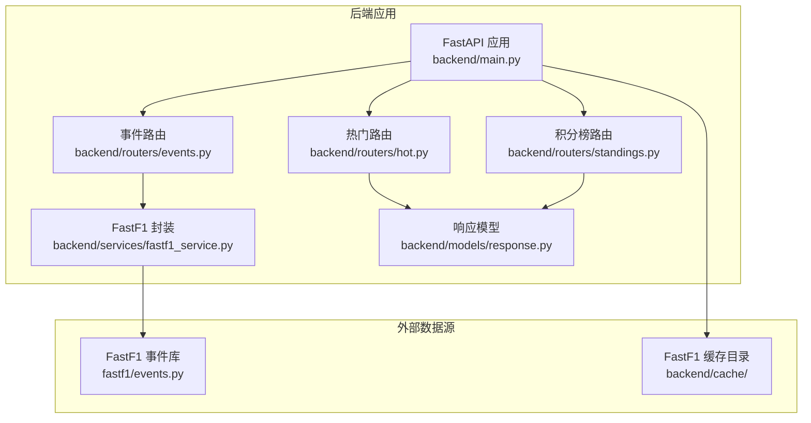
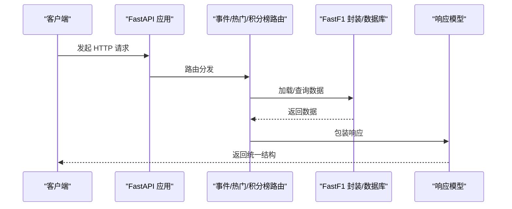
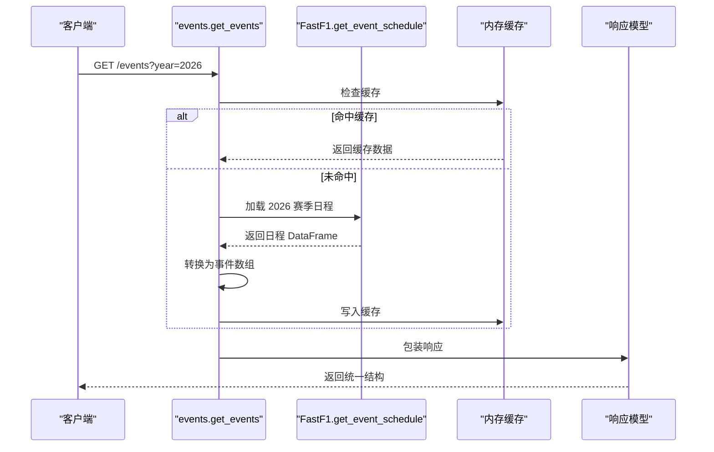
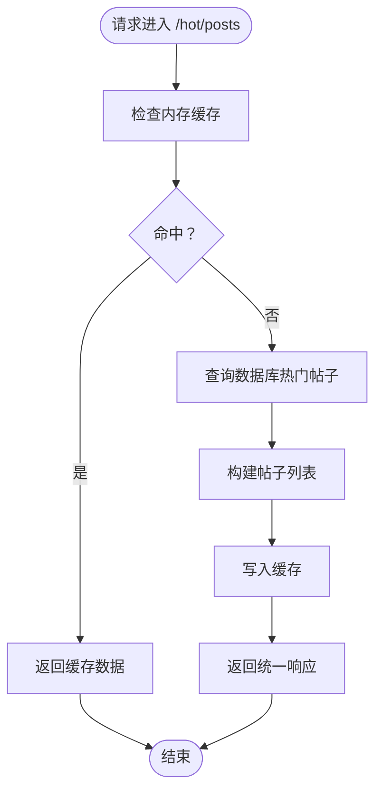
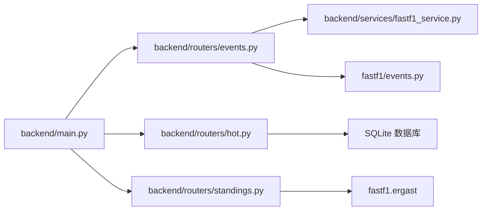

# 事件 API

<cite>
**本文档引用的文件**
- [backend/routers/events.py](file://backend/routers/events.py)
- [backend/routers/hot.py](file://backend/routers/hot.py)
- [backend/routers/standings.py](file://backend/routers/standings.py)
- [backend/services/fastf1_service.py](file://backend/services/fastf1_service.py)
- [backend/models/response.py](file://backend/models/response.py)
- [backend/main.py](file://backend/main.py)
- [fastf1/events.py](file://fastf1/events.py)
- [docs/api_reference/events.rst](file://docs/api_reference/events.rst)
</cite>

## 目录
1. [简介](#简介)
2. [项目结构](#项目结构)
3. [核心组件](#核心组件)
4. [架构总览](#架构总览)
5. [详细组件分析](#详细组件分析)
6. [依赖关系分析](#依赖关系分析)
7. [性能考量](#性能考量)
8. [故障排查指南](#故障排查指南)
9. [结论](#结论)
10. [附录](#附录)

## 简介
本文件面向事件相关 API 的使用者与维护者，系统化梳理赛事与事件查询接口，覆盖当前赛季、历史赛事、比赛日程、热点头条等能力。文档详细说明每个端点的请求参数、响应格式、数据结构与使用示例，并给出缓存策略、性能优化建议、错误处理与常见问题解决方案。

## 项目结构
事件 API 主要位于后端 FastAPI 应用中，核心路由集中在 `backend/routers/events.py`，配套的热门推荐接口位于 `backend/routers/hot.py`，积分榜接口位于 `backend/routers/standings.py`。事件数据通过 FastF1 库加载，统一的服务封装位于 `backend/services/fastf1_service.py`。响应模型定义在 `backend/models/response.py`，应用入口与缓存配置在 `backend/main.py`。

图表来源
- [backend/main.py:18-41](file://backend/main.py#L18-L41)
- [backend/routers/events.py:1-506](file://backend/routers/events.py#L1-L506)
- [backend/routers/hot.py:1-84](file://backend/routers/hot.py#L1-L84)
- [backend/routers/standings.py:1-145](file://backend/routers/standings.py#L1-L145)
- [backend/services/fastf1_service.py:1-64](file://backend/services/fastf1_service.py#L1-L64)
- [fastf1/events.py:285-342](file://fastf1/events.py#L285-L342)

章节来源
- [backend/main.py:18-41](file://backend/main.py#L18-L41)
- [backend/routers/events.py:1-506](file://backend/routers/events.py#L1-L506)
- [backend/routers/hot.py:1-84](file://backend/routers/hot.py#L1-L84)
- [backend/routers/standings.py:1-145](file://backend/routers/standings.py#L1-L145)
- [backend/services/fastf1_service.py:1-64](file://backend/services/fastf1_service.py#L1-L64)
- [fastf1/events.py:285-342](file://fastf1/events.py#L285-L342)

## 核心组件
- 事件路由（events）：提供赛季日程查询、分站赛道信息查询等。
- 热门路由（hot）：提供热门帖子与热门资讯的 Top N 查询。
- 积分榜路由（standings）：提供车手与车队积分榜及趋势数据。
- FastF1 封装（fastf1_service）：统一加载与缓存 Session 数据，提供通用格式化工具。
- 响应模型（response）：统一返回结构，包含状态、数据与备注。

章节来源
- [backend/routers/events.py:21-53](file://backend/routers/events.py#L21-L53)
- [backend/routers/hot.py:32-83](file://backend/routers/hot.py#L32-L83)
- [backend/routers/standings.py:64-144](file://backend/routers/standings.py#L64-L144)
- [backend/services/fastf1_service.py:14-64](file://backend/services/fastf1_service.py#L14-L64)
- [backend/models/response.py:4-14](file://backend/models/response.py#L4-L14)

## 架构总览
事件 API 的调用链路如下：
- 客户端请求 → FastAPI 路由 → 业务逻辑（事件/热门/积分榜）→ 数据源（FastF1/数据库）→ 统一响应模型返回。

图表来源
- [backend/main.py:28-41](file://backend/main.py#L28-L41)
- [backend/routers/events.py:21-53](file://backend/routers/events.py#L21-L53)
- [backend/routers/hot.py:32-83](file://backend/routers/hot.py#L32-L83)
- [backend/routers/standings.py:64-144](file://backend/routers/standings.py#L64-L144)
- [backend/models/response.py:9-14](file://backend/models/response.py#L9-L14)

## 详细组件分析

### 事件路由（/events）
- 路由前缀：/events
- 功能：提供当前赛季或指定年份的赛事日程，以及分站赛道的静态信息。

#### 端点一览
- GET /events
  - 功能：获取指定年份的赛事日程
  - 请求参数：
    - year: int，默认 2026
  - 响应数据：
    - events: list
      - round: int，轮次编号
      - name: string，赛事名称
      - country: string，国家
      - location: string，地点
      - date: string，事件日期（YYYY-MM-DD）
      - format: string，事件格式（conventional/sprint/sprint_shootout/sprint_qualifying/testing）
      - race_time_utc: string|null，比赛时间（UTC ISO 8601），若不可用则为 null
  - 缓存策略：内存缓存，TTL 6 小时
  - 错误处理：异常时返回统一错误结构

- GET /events/{round_num}/circuit
  - 功能：获取指定轮次的赛道静态信息
  - 请求参数：
    - year: int，默认 2026
    - round_num: int，轮次编号
  - 响应数据：
    - location: string，地点
    - country: string，国家
    - event_name: string，赛事名称
    - detail: object|null，包含赛道中文名、国家、城市、长度、圈数、单圈记录、首次举办年份、弯角数量、DRS 区域、类型、方向、特点、亮点、轮胎策略、天气等字段
  - 缓存策略：内存缓存，TTL 6 小时
  - 错误处理：异常或找不到轮次时返回统一错误结构

图表来源
- [backend/routers/events.py:21-53](file://backend/routers/events.py#L21-L53)
- [fastf1/events.py:285-342](file://fastf1/events.py#L285-L342)

章节来源
- [backend/routers/events.py:21-53](file://backend/routers/events.py#L21-L53)
- [backend/routers/events.py:480-505](file://backend/routers/events.py#L480-L505)
- [fastf1/events.py:285-342](file://fastf1/events.py#L285-L342)

#### 数据结构说明
- 事件对象（GET /events 返回项）
  - round: int
  - name: string
  - country: string
  - location: string
  - date: string
  - format: string
  - race_time_utc: string|null

- 赛道详情对象（GET /events/{round_num}/circuit 返回项）
  - location: string
  - country: string
  - event_name: string
  - detail: object|null
    - name_cn: string，中文名
    - country: string，国家
    - city: string，城市
    - length_km: number，赛道长度（公里）
    - laps: number，总圈数
    - lap_record: string，单圈记录
    - lap_record_holder: string，记录保持者
    - lap_record_year: number，记录年份
    - first_gp: number，首次举办年份
    - turns: number，弯角数量
    - drs_zones: number，DRS 区域数量
    - type: string，赛道类型
    - direction: string，方向
    - characteristics: string[]，特点
    - highlights: string[]，亮点
    - tyre_strategy: string，轮胎策略
    - weather: string，天气特征

章节来源
- [backend/routers/events.py:41-49](file://backend/routers/events.py#L41-L49)
- [backend/routers/events.py:496-501](file://backend/routers/events.py#L496-L501)

### 热门推荐路由（/hot）
- 路由前缀：/hot
- 功能：提供热门帖子与热门资讯的 Top N 查询。

#### 端点一览
- GET /hot/posts
  - 功能：热门帖子 Top N（默认 5）
  - 请求参数：
    - limit: int，默认 5
  - 响应数据：
    - posts: list
      - id: int
      - title: string
      - author_name: string
      - comment_count: int
      - view_count: int
      - created_at: int（Unix 时间戳）
      - section_name: string
  - 缓存策略：内存缓存，TTL 10 分钟

- GET /hot/news
  - 功能：热门资讯 Top N（默认 5），有 AI 解读的优先，再按发布时间倒序
  - 请求参数：
    - limit: int，默认 5
  - 响应数据：
    - news: list
      - id: int
      - title: string
      - source: string
      - has_analysis: boolean，是否有 AI 解读
      - published_at: int（Unix 时间戳）
  - 缓存策略：内存缓存，TTL 10 分钟

图表来源
- [backend/routers/hot.py:32-57](file://backend/routers/hot.py#L32-L57)

章节来源
- [backend/routers/hot.py:32-57](file://backend/routers/hot.py#L32-L57)
- [backend/routers/hot.py:60-83](file://backend/routers/hot.py#L60-L83)

### 积分榜路由（/standings）
- 路由前缀：/standings
- 功能：提供车手积分榜、车队积分榜及前五名车手的累计积分趋势。

#### 端点一览
- GET /standings
  - 功能：获取指定年份的积分榜与趋势
  - 请求参数：
    - year: int，默认 2026
  - 响应数据：
    - year: int
    - drivers: list
      - position: int
      - driver: string（代码或缩写）
      - name: string（全名）
      - team: string
      - points: number
      - wins: int
      - color: string（车队颜色）
    - constructors: list
      - position: int
      - team: string
      - points: number
      - wins: int
      - color: string（车队颜色）
    - driver_trend: list（可选）
      - code: string
      - color: string
      - series: list[[round, cumulative_points], ...]
  - 缓存策略：内存缓存，TTL 2 小时

章节来源
- [backend/routers/standings.py:64-144](file://backend/routers/standings.py#L64-L144)

### FastF1 数据封装（/sessions）
- 统一加载与缓存：同一进程内对相同年份、轮次、会话类型的 Session 只加载一次，后续请求直接复用。
- 工具函数：
  - fmt_time：将 timedelta 格式化为“分:秒.毫秒”字符串
  - get_corner_distances：根据赛道信息获取弯角距离列表（NaN 时等间距回退）
  - get_corner_labels：生成弯角标签列表
  - telemetry_to_dict：将遥测 DataFrame 转为可序列化字典（处理 NaN）

章节来源
- [backend/services/fastf1_service.py:14-64](file://backend/services/fastf1_service.py#L14-L64)

## 依赖关系分析
- 应用入口与路由注册：在 `backend/main.py` 中注册事件、热门、积分榜等路由，并启用 CORS 与 FastF1 缓存目录。
- 事件数据来源：通过 `fastf1.events.get_event_schedule` 获取赛季日程，内部支持多种后端（FastF1 自有、F1 官方 API、Ergast）。
- 响应模型：统一返回结构，便于前端解析与错误处理。

图表来源
- [backend/main.py:28-41](file://backend/main.py#L28-L41)
- [backend/routers/events.py:1-506](file://backend/routers/events.py#L1-L506)
- [backend/routers/hot.py:1-84](file://backend/routers/hot.py#L1-L84)
- [backend/routers/standings.py:1-145](file://backend/routers/standings.py#L1-L145)
- [fastf1/events.py:285-342](file://fastf1/events.py#L285-L342)

章节来源
- [backend/main.py:28-41](file://backend/main.py#L28-L41)
- [fastf1/events.py:285-342](file://fastf1/events.py#L285-L342)

## 性能考量
- 内存缓存
  - 事件与分站赛道信息：TTL 6 小时
  - 热门帖子/资讯：TTL 10 分钟
  - 积分榜：TTL 2 小时
- FastF1 缓存
  - 启用本地缓存目录，减少网络请求与重复解析
- 后台预热
  - 启动后预热事件与积分榜缓存，以及常用 Session 数据，降低首请求延迟
- 并行拉取
  - 积分榜接口并发拉取车手、车队与比赛结果，缩短响应时间

章节来源
- [backend/routers/events.py:12-19](file://backend/routers/events.py#L12-L19)
- [backend/routers/hot.py:15-29](file://backend/routers/hot.py#L15-L29)
- [backend/routers/standings.py:27-42](file://backend/routers/standings.py#L27-L42)
- [backend/main.py:14-16](file://backend/main.py#L14-L16)
- [backend/main.py:55-97](file://backend/main.py#L55-L97)
- [backend/main.py:100-114](file://backend/main.py#L100-L114)
- [backend/routers/standings.py:52-61](file://backend/routers/standings.py#L52-L61)

## 故障排查指南
- 常见错误响应
  - 统一结构：status（ok/error）、data（数据或空）、note（错误信息）
- 事件接口
  - 找不到轮次：返回错误提示（轮次不存在）
  - 数据加载异常：捕获异常并返回错误结构
- 热门接口
  - 数据库查询异常：捕获异常并返回错误结构
- 积分榜接口
  - Ergast 接口拉取失败：捕获异常并返回错误结构
- 缓存问题
  - 缓存未命中：检查 TTL 是否过期或缓存键是否正确
  - 内存缓存未生效：确认路由中缓存逻辑是否执行
- 启动预热
  - 预热失败：查看后台线程日志，确认缓存目录与数据是否存在

章节来源
- [backend/models/response.py:9-14](file://backend/models/response.py#L9-L14)
- [backend/routers/events.py:489-490](file://backend/routers/events.py#L489-L490)
- [backend/routers/hot.py:56-83](file://backend/routers/hot.py#L56-L83)
- [backend/routers/standings.py:143-144](file://backend/routers/standings.py#L143-L144)
- [backend/main.py:117-136](file://backend/main.py#L117-L136)

## 结论
事件 API 提供了完整的赛事日程与分站信息查询能力，并通过内存缓存与 FastF1 本地缓存显著提升了性能。热门推荐与积分榜接口进一步增强了内容生态与数据可视化支持。建议在生产环境中结合缓存 TTL 与后台预热策略，确保高并发下的稳定与低延迟。

## 附录

### API 端点汇总
- GET /events
  - 参数：year:int=2026
  - 返回：events 数组
- GET /events/{round_num}/circuit
  - 参数：year:int=2026, round_num:int
  - 返回：location/country/event_name/detail
- GET /hot/posts
  - 参数：limit:int=5
  - 返回：posts 数组
- GET /hot/news
  - 参数：limit:int=5
  - 返回：news 数组
- GET /standings
  - 参数：year:int=2026
  - 返回：drivers/constructors/driver_trend

章节来源
- [backend/routers/events.py:21-53](file://backend/routers/events.py#L21-L53)
- [backend/routers/events.py:480-505](file://backend/routers/events.py#L480-L505)
- [backend/routers/hot.py:32-57](file://backend/routers/hot.py#L32-L57)
- [backend/routers/hot.py:60-83](file://backend/routers/hot.py#L60-L83)
- [backend/routers/standings.py:64-144](file://backend/routers/standings.py#L64-L144)