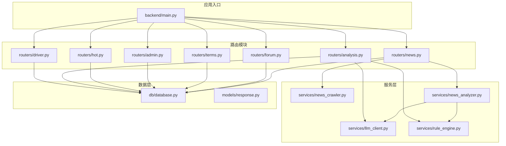
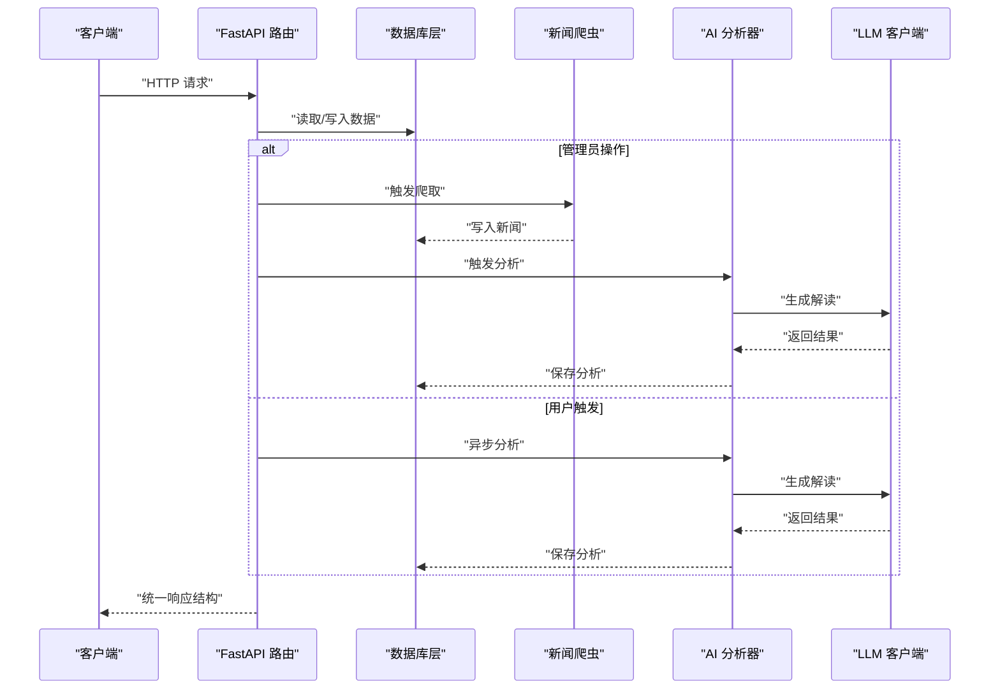
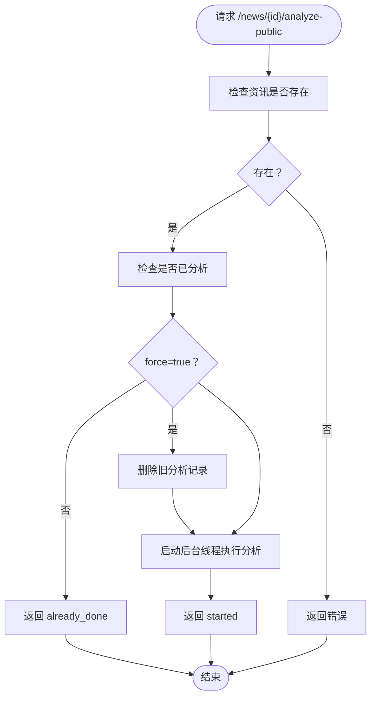
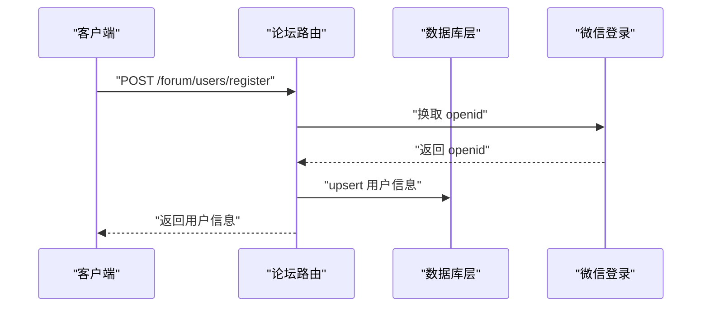
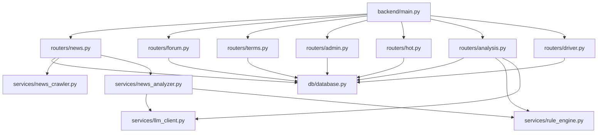

# 内容管理 API

<cite>
**本文档引用的文件**
- [backend/main.py](file://backend/main.py)
- [backend/db/database.py](file://backend/db/database.py)
- [backend/models/response.py](file://backend/models/response.py)
- [backend/routers/news.py](file://backend/routers/news.py)
- [backend/routers/forum.py](file://backend/routers/forum.py)
- [backend/routers/terms.py](file://backend/routers/terms.py)
- [backend/routers/admin.py](file://backend/routers/admin.py)
- [backend/routers/hot.py](file://backend/routers/hot.py)
- [backend/routers/analysis.py](file://backend/routers/analysis.py)
- [backend/routers/driver.py](file://backend/routers/driver.py)
- [backend/services/news_analyzer.py](file://backend/services/news_analyzer.py)
- [backend/services/news_crawler.py](file://backend/services/news_crawler.py)
- [backend/services/llm_client.py](file://backend/services/llm_client.py)
- [backend/services/rule_engine.py](file://backend/services/rule_engine.py)
- [backend/requirements.txt](file://backend/requirements.txt)
</cite>

## 目录
1. [简介](#简介)
2. [项目结构](#项目结构)
3. [核心组件](#核心组件)
4. [架构总览](#架构总览)
5. [详细组件分析](#详细组件分析)
6. [依赖关系分析](#依赖关系分析)
7. [性能考量](#性能考量)
8. [故障排除指南](#故障排除指南)
9. [结论](#结论)
10. [附录](#附录)

## 简介
本文件为内容管理 API 的完整技术文档，覆盖新闻资讯、论坛社区、条款管理等模块的接口定义、数据模型、权限控制、审核流程与缓存策略。内容包含：
- 新闻资讯：列表检索、详情查看、AI 分析触发、爬虫管理
- 论坛社区：用户注册与认证、分区管理、帖子与评论、点赞与热度
- 条款管理：术语查询、提交与审核
- 管理员接口：审核、爬虫与分析调度
- 热门推荐：基于交互数据的热点内容
- 驱动程序：车手评论与评分
- 安全与权限：管理员令牌、用户认证（微信）、内容审核
- 缓存与性能：内存缓存、数据库索引、定时任务

## 项目结构
后端采用 FastAPI 架构，路由按功能模块划分，数据库层封装 SQLite 操作，服务层提供 AI 分析与爬虫能力。

图表来源
- [backend/main.py:27-41](file://backend/main.py#L27-L41)
- [backend/routers/news.py:12-20](file://backend/routers/news.py#L12-L20)
- [backend/routers/forum.py:21-33](file://backend/routers/forum.py#L21-L33)
- [backend/routers/terms.py:1-6](file://backend/routers/terms.py#L1-L6)
- [backend/routers/admin.py:15-25](file://backend/routers/admin.py#L15-L25)
- [backend/routers/hot.py:8-13](file://backend/routers/hot.py#L8-L13)
- [backend/routers/analysis.py:1-10](file://backend/routers/analysis.py#L1-L10)
- [backend/routers/driver.py:10-21](file://backend/routers/driver.py#L10-L21)
- [backend/services/news_crawler.py:1-5](file://backend/services/news_crawler.py#L1-L5)
- [backend/services/news_analyzer.py:1-6](file://backend/services/news_analyzer.py#L1-L6)
- [backend/services/llm_client.py:1-6](file://backend/services/llm_client.py#L1-L6)
- [backend/services/rule_engine.py:1-4](file://backend/services/rule_engine.py#L1-L4)
- [backend/db/database.py:1-4](file://backend/db/database.py#L1-L4)
- [backend/models/response.py:1-7](file://backend/models/response.py#L1-L7)

章节来源
- [backend/main.py:18-41](file://backend/main.py#L18-L41)
- [backend/requirements.txt:1-15](file://backend/requirements.txt#L1-L15)

## 核心组件
- 应用入口与路由注册：集中注册新闻、论坛、术语、管理员、热门、分析、驱动等路由，启用 CORS 支持。
- 数据库层：统一建表、CRUD 封装、索引优化、默认分区初始化。
- 模型响应：统一的 API 响应结构，简化错误与成功返回。
- 服务层：RSS 爬虫、AI 分析（LLM）、规则引擎（遥测指标）、微信登录换取 openid。

章节来源
- [backend/main.py:1-157](file://backend/main.py#L1-L157)
- [backend/db/database.py:1-160](file://backend/db/database.py#L1-L160)
- [backend/models/response.py:1-14](file://backend/models/response.py#L1-L14)
- [backend/services/news_crawler.py:1-148](file://backend/services/news_crawler.py#L1-L148)
- [backend/services/news_analyzer.py:1-298](file://backend/services/news_analyzer.py#L1-L298)
- [backend/services/llm_client.py:1-136](file://backend/services/llm_client.py#L1-L136)
- [backend/services/rule_engine.py:1-146](file://backend/services/rule_engine.py#L1-L146)

## 架构总览
内容管理 API 的整体交互流程如下：

图表来源
- [backend/routers/news.py:127-190](file://backend/routers/news.py#L127-L190)
- [backend/services/news_crawler.py:119-148](file://backend/services/news_crawler.py#L119-L148)
- [backend/services/news_analyzer.py:220-298](file://backend/services/news_analyzer.py#L220-L298)
- [backend/services/llm_client.py:13-21](file://backend/services/llm_client.py#L13-L21)

## 详细组件分析

### 新闻资讯模块（/news）
- 功能概览
  - 列表分页与关键词搜索
  - 按车队关键词过滤
  - 详情查询（含 AI 三段式解读）
  - 车队标签识别与缓存
  - 关联帖子查询
  - AI 分析触发（管理员/公开）
  - 爬虫手动触发（管理员）

- 关键接口
  - GET /news：分页列表，支持 team 与 keyword 参数
  - GET /news/{id}：详情（含 analyzed 标记）
  - GET /news/{id}/teams：基于标题与摘要的车队标签识别（内存缓存）
  - GET /news/{id}/posts：关联帖子列表
  - POST /news/{id}/analyze-public：任意用户触发 AI 分析（异步）
  - POST /news/crawl：管理员手动触发爬虫
  - POST /news/{id}/analyze：管理员手动触发单条分析

- 数据模型与字段
  - 资讯表（news）：id、title、summary、url、source、published_at、created_at
  - AI 分析表（news_analysis）：id、news_id、tech_points、plain_explain、race_impact、raw_report、created_at
  - 关联字段：posts.news_id → news.id

- 权限控制
  - 爬虫与单条分析：X-Admin-Token 头校验
  - 公开分析：无需登录，结果全局共享

- 缓存策略
  - 车队标签缓存：按 news_id 内存缓存，TTL=10 分钟
  - AI 分析结果：数据库 INSERT OR REPLACE，前端轮询更新

- 审核流程
  - 帖子与评论：status=pending，管理员审核通过后生效
  - 术语提交：status=pending，管理员审批

- 推荐算法
  - 热门资讯：有 AI 解读优先，再按发布时间倒序

图表来源
- [backend/routers/news.py:127-156](file://backend/routers/news.py#L127-L156)
- [backend/services/news_analyzer.py:220-256](file://backend/services/news_analyzer.py#L220-L256)

章节来源
- [backend/routers/news.py:1-190](file://backend/routers/news.py#L1-L190)
- [backend/db/database.py:26-47](file://backend/db/database.py#L26-L47)
- [backend/db/database.py:289-325](file://backend/db/database.py#L289-L325)

### 论坛社区模块（/forum）
- 功能概览
  - 用户注册与认证：微信 code 换取 openid，昵称校验
  - 分区管理：按 race/team 分组，内存缓存 TTL=1h
  - 帖子管理：列表（支持 latest/hot）、详情、发帖、删帖（仅作者）
  - 评论管理：列表、发评论（status=pending，等待审核）
  - 点赞/点踩：去重、切换类型、统计

- 关键接口
  - POST /forum/users/register：注册或更新昵称
  - GET /forum/users/me：获取用户信息
  - GET /forum/sections：分区列表
  - GET /forum/posts：帖子列表（支持 sort=latest/hot）
  - GET /forum/posts/{id}：帖子详情（审核状态校验）
  - POST /forum/posts：发帖
  - DELETE /forum/posts/{id}：删帖（仅作者）
  - POST /forum/posts/{id}/like：点赞/点踩
  - GET /forum/posts/{id}/like：获取点赞数据
  - GET /forum/posts/{id}/comments：评论列表
  - POST /forum/posts/{id}/comments：发评论

- 数据模型与字段
  - 用户表（users）：openid、nickname、avatar_url、created_at
  - 分区表（sections）：id、type、name、slug、sort_order
  - 帖子表（posts）：id、section_id、news_id、title、content、author_openid、author_nickname、status、is_seeded、view_count、comment_count、created_at、updated_at
  - 评论表（comments）：id、post_id、content、author_openid、author_nickname、status、created_at
  - 点赞表（post_likes）：id、post_id、openid、type、created_at

- 权限控制
  - 注册：微信 code 换取 openid，避免暴露 AppSecret
  - 发帖/评论：需先注册昵称
  - 删帖：仅作者本人
  - 管理员审核：通过 Header X-Admin-Token

- 缓存策略
  - 分区列表：内存缓存，TTL=1h
  - 热度排序：先获取更多候选项再分页

图表来源
- [backend/routers/forum.py:57-118](file://backend/routers/forum.py#L57-L118)
- [backend/db/database.py:344-364](file://backend/db/database.py#L344-L364)

章节来源
- [backend/routers/forum.py:1-327](file://backend/routers/forum.py#L1-L327)
- [backend/db/database.py:58-158](file://backend/db/database.py#L58-L158)

### 条款管理模块（/terms）
- 功能概览
  - 查询术语：支持分类与难度筛选
  - 按新闻查询术语：按 news_id 缓存
  - 单个术语详情
  - 用户提交术语：status=pending，等待管理员审核

- 关键接口
  - GET /terms：术语列表（支持 category、level）
  - GET /terms/news/{news_id}：按新闻关联术语（内存缓存）
  - GET /terms/{slug}：术语详情
  - POST /terms/submit：提交术语

- 数据模型与字段
  - 术语表（terms）：id、slug、name_zh、name_en、aliases、short_def、full_def、example、category、level、related_slugs、spec_year、status、submitted_by、created_at

- 缓存策略
  - 术语列表按 key 缓存，TTL=10 分钟
  - 按新闻查询术语按 news_id 缓存，TTL=10 分钟

章节来源
- [backend/routers/terms.py:1-92](file://backend/routers/terms.py#L1-L92)
- [backend/db/database.py:111-131](file://backend/db/database.py#L111-L131)

### 管理员模块（/admin）
- 功能概览
  - 帖子审核：待审核列表、通过/拒绝
  - 评论审核：待审核列表、通过/拒绝
  - 爬虫与分析：一键爬取+分析、仅爬取、单条分析、清空分析
  - 术语审核：待审核列表、通过/拒绝

- 关键接口
  - GET /admin/posts：待审核帖子列表
  - POST /admin/posts/{id}/approve：通过
  - POST /admin/posts/{id}/reject：拒绝
  - GET /admin/comments：待审核评论列表
  - POST /admin/comments/{id}/approve：通过（同步更新评论数）
  - POST /admin/comments/{id}/reject：拒绝
  - POST /admin/crawl：爬取+分析
  - POST /admin/crawl-only：仅爬取
  - POST /admin/analyze-one/{news_id}：单条分析
  - DELETE /admin/analyses：清空所有分析
  - GET /admin/terms：待审核术语列表
  - POST /admin/terms/{term_id}/approve：通过
  - POST /admin/terms/{term_id}/reject：拒绝

- 权限控制
  - 所有接口需 Header X-Admin-Token 校验

章节来源
- [backend/routers/admin.py:1-245](file://backend/routers/admin.py#L1-L245)
- [backend/db/database.py:446-458](file://backend/db/database.py#L446-L458)
- [backend/db/database.py:493-521](file://backend/db/database.py#L493-L521)
- [backend/db/database.py:1249-1256](file://backend/db/database.py#L1249-L1256)

### 热门推荐模块（/hot）
- 功能概览
  - 热门帖子：基于评论数、浏览数与发布时间的热度分
  - 热门资讯：有 AI 解读优先，再按发布时间倒序

- 关键接口
  - GET /hot/posts：热门帖子 Top N（默认 5）
  - GET /hot/news：热门资讯 Top N（默认 5）

- 缓存策略
  - 内存缓存，TTL=10 分钟

章节来源
- [backend/routers/hot.py:1-84](file://backend/routers/hot.py#L1-L84)
- [backend/db/database.py:535-566](file://backend/db/database.py#L535-L566)

### 分析模块（/analysis）
- 功能概览
  - 基于遥测数据的结构化指标计算
  - LLM 生成专业分析报告
  - 结果缓存（MD5 key + JSON 文件）

- 关键接口
  - GET /analysis：获取分析报告（支持 force 缓存穿透）

- 数据处理流程
  - 获取会话与最快圈数据
  - 计算弯角、赛段、直线、轮胎稳定性等指标
  - 生成报告并缓存

章节来源
- [backend/routers/analysis.py:1-121](file://backend/routers/analysis.py#L1-L121)
- [backend/services/rule_engine.py:1-146](file://backend/services/rule_engine.py#L1-L146)
- [backend/services/llm_client.py:77-135](file://backend/services/llm_client.py#L77-L135)

### 驱动程序模块（/driver）
- 功能概览
  - 车手评论：列表、发评论、点赞
  - 车手评分：聚合评分、个人评分

- 关键接口
  - GET /driver/{code}/comments：评论列表
  - POST /driver/{code}/comments：发评论
  - POST /driver/comments/{id}/like：点赞
  - GET /driver/{code}/rating：聚合评分 + 个人评分
  - POST /driver/{code}/rating：提交/更新评分

- 数据模型与字段
  - 车手评论表（driver_comments）：id、driver_code、content、author_openid、author_nickname、likes、created_at
  - 车手评分表（driver_ratings）：id、driver_code、openid、speed、consist、defend、wet、mental、created_at

章节来源
- [backend/routers/driver.py:1-116](file://backend/routers/driver.py#L1-L116)
- [backend/db/database.py:1335-1414](file://backend/db/database.py#L1335-L1414)

## 依赖关系分析

图表来源
- [backend/main.py:27-41](file://backend/main.py#L27-L41)
- [backend/routers/news.py:12-19](file://backend/routers/news.py#L12-L19)
- [backend/routers/forum.py:21-31](file://backend/routers/forum.py#L21-L31)
- [backend/routers/terms.py:1-6](file://backend/routers/terms.py#L1-L6)
- [backend/routers/admin.py:15-23](file://backend/routers/admin.py#L15-L23)
- [backend/routers/hot.py:8-11](file://backend/routers/hot.py#L8-L11)
- [backend/routers/analysis.py:1-7](file://backend/routers/analysis.py#L1-L7)
- [backend/routers/driver.py:10-19](file://backend/routers/driver.py#L10-L19)
- [backend/services/news_crawler.py:1-5](file://backend/services/news_crawler.py#L1-L5)
- [backend/services/news_analyzer.py:1-6](file://backend/services/news_analyzer.py#L1-L6)
- [backend/services/llm_client.py:1-6](file://backend/services/llm_client.py#L1-L6)
- [backend/services/rule_engine.py:1-4](file://backend/services/rule_engine.py#L1-L4)

章节来源
- [backend/requirements.txt:1-15](file://backend/requirements.txt#L1-L15)

## 性能考量
- 数据库优化
  - 为 news、posts、comments、terms、post_likes 等表建立索引，提升查询性能
  - WAL 模式提升并发写入稳定性
- 缓存策略
  - 内存缓存：分区列表（1h）、热门内容（10min）、术语列表（10min）、按新闻术语（10min）、车队标签（10min）
  - 文件缓存：分析报告（MD5 key + JSON）
- 异步处理
  - AI 分析通过后台线程执行，避免阻塞请求
- 爬虫与定时任务
  - 启动时后台预热 session 与 API 缓存
  - 定时任务：每小时自动爬取新闻，每两小时刷新 events/standings 缓存

章节来源
- [backend/db/database.py:94-146](file://backend/db/database.py#L94-L146)
- [backend/main.py:99-136](file://backend/main.py#L99-L136)
- [backend/routers/news.py:24-35](file://backend/routers/news.py#L24-L35)
- [backend/routers/hot.py:15-30](file://backend/routers/hot.py#L15-L30)
- [backend/routers/terms.py:10-32](file://backend/routers/terms.py#L10-L32)
- [backend/routers/forum.py:35-45](file://backend/routers/forum.py#L35-L45)

## 故障排除指南
- 常见错误与定位
  - 403 无权限：检查 X-Admin-Token 是否正确
  - 资讯不存在：确认 news_id 是否有效
  - 用户不存在：先完成微信注册
  - 微信登录失败：检查 WX_APPID/WX_SECRET 环境变量
  - AI 分析失败：查看服务端日志，确认 DEEPSEEK_API_KEY 配置
- 日志与监控
  - 爬虫与分析过程均有日志输出，便于排查异常
  - 定时任务异常不影响主服务运行

章节来源
- [backend/routers/admin.py:30-34](file://backend/routers/admin.py#L30-L34)
- [backend/routers/news.py:127-156](file://backend/routers/news.py#L127-L156)
- [backend/routers/forum.py:57-72](file://backend/routers/forum.py#L57-L72)
- [backend/services/llm_client.py:13-20](file://backend/services/llm_client.py#L13-L20)

## 结论
本内容管理 API 通过清晰的模块划分与完善的缓存策略，实现了新闻资讯、论坛社区、条款管理等核心功能。管理员令牌与用户认证机制保障了内容安全，审核流程与权限控制确保平台内容质量。AI 分析与遥测分析进一步提升了用户体验与内容价值。

## 附录
- 统一响应结构
  - 成功：{"status": "ok", "data": ..., "note": null}
  - 失败：{"status": "error", "data": null, "note": "错误信息"}

章节来源
- [backend/models/response.py:4-14](file://backend/models/response.py#L4-L14)