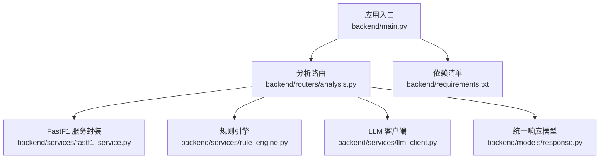
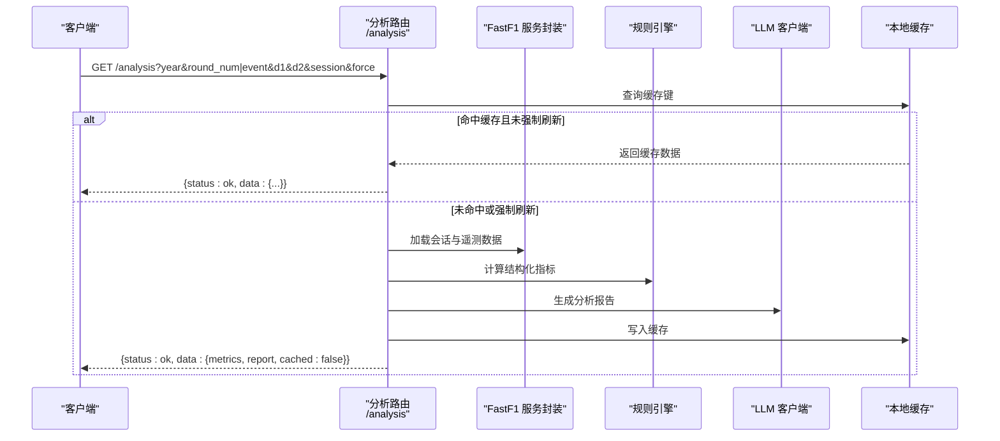
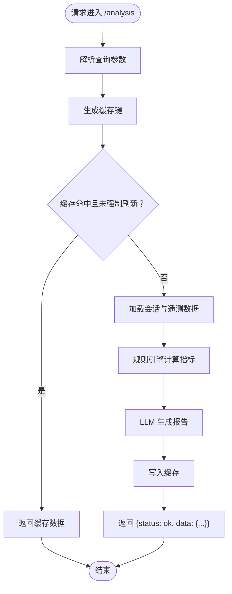
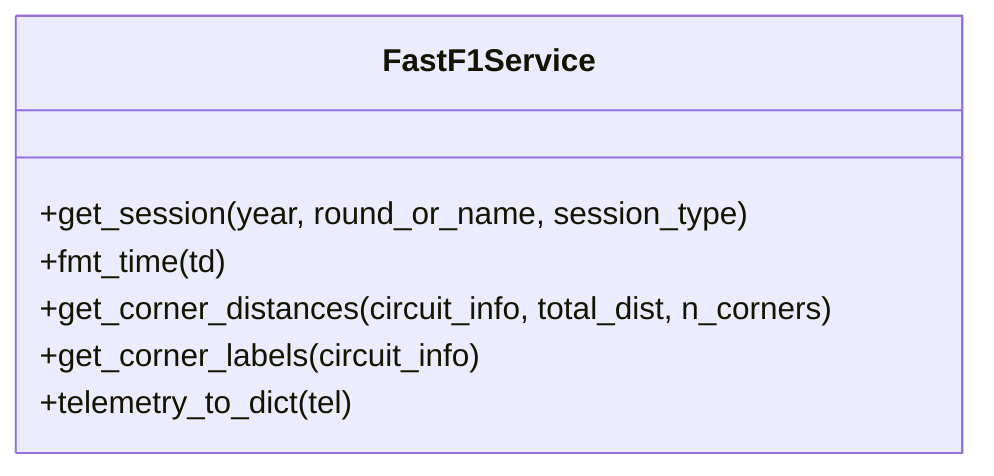
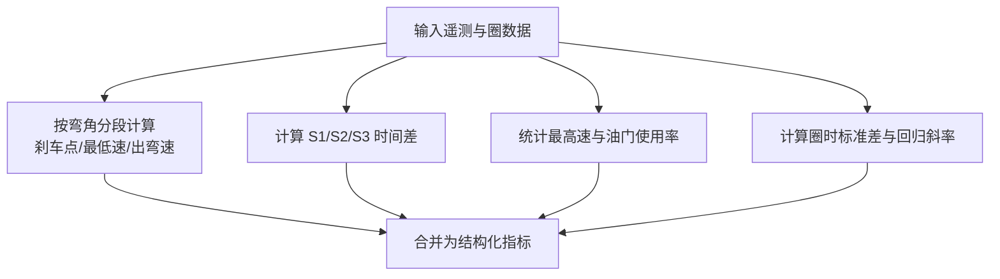
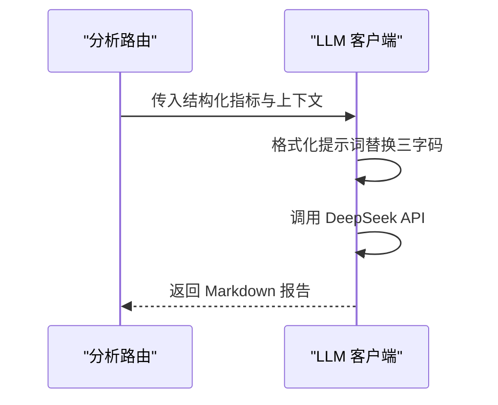
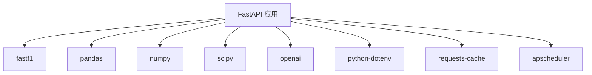

# 分析 API

<cite>
**本文档引用的文件**
- [backend/main.py](file://backend/main.py)
- [backend/routers/analysis.py](file://backend/routers/analysis.py)
- [backend/services/fastf1_service.py](file://backend/services/fastf1_service.py)
- [backend/services/rule_engine.py](file://backend/services/rule_engine.py)
- [backend/services/llm_client.py](file://backend/services/llm_client.py)
- [backend/models/response.py](file://backend/models/response.py)
- [backend/requirements.txt](file://backend/requirements.txt)
</cite>

## 目录
1. [简介](#简介)
2. [项目结构](#项目结构)
3. [核心组件](#核心组件)
4. [架构总览](#架构总览)
5. [详细组件分析](#详细组件分析)
6. [依赖分析](#依赖分析)
7. [性能考虑](#性能考虑)
8. [故障排查指南](#故障排查指南)
9. [结论](#结论)
10. [附录](#附录)

## 简介
本文件面向数据分析 API 的使用者与维护者，系统性梳理“分析”相关能力，包括：
- HTTP 接口：提供基于 FastAPI 的分析服务端点
- 分析内容：AI 分析报告、策略分析、圈时分析、驾驶行为分析
- 参数配置：查询参数、缓存策略、强制刷新
- 规则引擎：从遥测数据计算结构化指标
- LLM 集成：DeepSeek API 生成中文分析报告
- 结果格式：结构化指标 + Markdown 报告
- 流程：数据预处理、算法选择、自定义规则、结果验证与缓存

## 项目结构
后端采用 FastAPI 应用，通过路由模块组织功能，分析相关的核心文件如下：
- 应用入口与路由注册：backend/main.py
- 分析路由：backend/routers/analysis.py
- 数据服务封装：backend/services/fastf1_service.py
- 规则引擎：backend/services/rule_engine.py
- LLM 客户端：backend/services/llm_client.py
- 统一响应模型：backend/models/response.py
- 依赖清单：backend/requirements.txt

图表来源
- [backend/main.py:18-41](file://backend/main.py#L18-L41)
- [backend/routers/analysis.py:10-121](file://backend/routers/analysis.py#L10-L121)
- [backend/services/fastf1_service.py:14-64](file://backend/services/fastf1_service.py#L14-L64)
- [backend/services/rule_engine.py:136-146](file://backend/services/rule_engine.py#L136-L146)
- [backend/services/llm_client.py:77-136](file://backend/services/llm_client.py#L77-L136)
- [backend/models/response.py:4-14](file://backend/models/response.py#L4-L14)
- [backend/requirements.txt:1-15](file://backend/requirements.txt#L1-L15)

章节来源
- [backend/main.py:18-41](file://backend/main.py#L18-L41)
- [backend/requirements.txt:1-15](file://backend/requirements.txt#L1-L15)

## 核心组件
- 分析路由（/analysis）：提供 GET 接口，聚合 FastF1 数据、规则引擎指标与 LLM 报告生成，并支持本地缓存。
- FastF1 服务封装：统一会话加载、时间格式化、弯角距离与标签计算、遥测序列化。
- 规则引擎：按弯角、赛段、直线、轮胎稳定性四个维度计算结构化指标。
- LLM 客户端：基于 DeepSeek Chat 的提示词模板生成中文分析报告。
- 统一响应模型：标准化返回结构，便于前端消费。

章节来源
- [backend/routers/analysis.py:35-121](file://backend/routers/analysis.py#L35-L121)
- [backend/services/fastf1_service.py:14-64](file://backend/services/fastf1_service.py#L14-L64)
- [backend/services/rule_engine.py:10-146](file://backend/services/rule_engine.py#L10-L146)
- [backend/services/llm_client.py:77-136](file://backend/services/llm_client.py#L77-L136)
- [backend/models/response.py:4-14](file://backend/models/response.py#L4-L14)

## 架构总览
下图展示分析请求从 HTTP 到结果返回的关键路径与组件交互。

图表来源
- [backend/routers/analysis.py:35-121](file://backend/routers/analysis.py#L35-L121)
- [backend/services/fastf1_service.py:14-64](file://backend/services/fastf1_service.py#L14-L64)
- [backend/services/rule_engine.py:136-146](file://backend/services/rule_engine.py#L136-L146)
- [backend/services/llm_client.py:77-136](file://backend/services/llm_client.py#L77-L136)

## 详细组件分析

### HTTP 接口：GET /analysis
- 路径：/analysis
- 方法：GET
- 功能：对比两位车手的最快圈时、圈时分段、驾驶行为与轮胎稳定性，并生成 AI 分析报告。
- 查询参数
  - year: 年份，默认 2026
  - round_num: 轮次编号（可选）
  - event: 赛事名称（可选，与 round_num 二选一）
  - d1, d2: 两位车手三字码（默认 ALB vs ALO）
  - session: 会话类型（Q/R/S/FP1/FP2/FP3，默认 Q）
  - force: 是否强制刷新缓存（布尔，默认 False）
- 返回结构
  - status: ok 或 error
  - data.metrics: 结构化指标（见“规则引擎”）
  - data.report: LLM 生成的 Markdown 分析报告
  - data.cached: 是否来自缓存
  - note: 备注（错误时返回）

图表来源
- [backend/routers/analysis.py:35-121](file://backend/routers/analysis.py#L35-L121)

章节来源
- [backend/routers/analysis.py:35-121](file://backend/routers/analysis.py#L35-L121)

### 数据服务封装：FastF1 服务
- 会话缓存：进程内缓存同一会话，避免重复加载
- 时间格式化：将 timedelta 转换为“分:秒.毫秒”的字符串
- 弯角信息：当电路信息中的弯角距离为空时，按总距离等间距回退
- 遥测序列化：将 DataFrame 转为可序列化的字典，处理 NaN

图表来源
- [backend/services/fastf1_service.py:14-64](file://backend/services/fastf1_service.py#L14-L64)

章节来源
- [backend/services/fastf1_service.py:14-64](file://backend/services/fastf1_service.py#L14-L64)

### 规则引擎：结构化指标
- 弯角分析（analyze_corners）
  - 窗口：弯角前后各一定距离
  - 指标：刹车点差异、最低速差异、出弯速差异
- 赛段分析（analyze_sectors）
  - 指标：S1/S2/S3 时间差与更快车手
- 直线分析（analyze_straights）
  - 指标：最高速、油门全开比例
- 轮胎稳定性（analyze_tyre_stability）
  - 指标：圈时标准差、每圈衰退速率（回归斜率）
- 指标汇总（build_metrics）
  - 输出：corners、sectors、straights、tyre 四个维度

图表来源
- [backend/services/rule_engine.py:10-146](file://backend/services/rule_engine.py#L10-L146)

章节来源
- [backend/services/rule_engine.py:10-146](file://backend/services/rule_engine.py#L10-L146)

### LLM 客户端：AI 分析报告
- 模型：DeepSeek Chat
- 提示词模板：包含车手身份、比赛信息、对比数据与计算指标
- 文本处理：将三字码替换为“全名(三字码)”以避免混淆
- 输出：Markdown 格式的中文分析报告

图表来源
- [backend/services/llm_client.py:77-136](file://backend/services/llm_client.py#L77-L136)

章节来源
- [backend/services/llm_client.py:77-136](file://backend/services/llm_client.py#L77-L136)

### 统一响应模型
- APIResponse：包含状态、数据与备注
- ok()/err()：构造统一响应结构

章节来源
- [backend/models/response.py:4-14](file://backend/models/response.py#L4-L14)

## 依赖分析
- 应用层：FastAPI、CORS 中间件、APScheduler 定时任务
- 数据层：fastf1、pandas、numpy、scipy
- 通信层：openai（兼容 OpenAI SDK）、python-dotenv、requests-cache
- 其他：apscheduler、feedparser、trafilatura

图表来源
- [backend/requirements.txt:1-15](file://backend/requirements.txt#L1-L15)
- [backend/main.py:18-41](file://backend/main.py#L18-L41)

章节来源
- [backend/requirements.txt:1-15](file://backend/requirements.txt#L1-L15)
- [backend/main.py:18-41](file://backend/main.py#L18-L41)

## 性能考虑
- 会话缓存：进程内复用会话对象，减少网络与解析开销
- 本地缓存：分析结果按参数生成哈希键，避免重复计算
- 遥测序列化：仅保留必要字段并处理 NaN，降低传输体积
- 预热策略：启动时预加载已有会话与常用 API 缓存，缩短首次响应时间
- 算法复杂度：规则引擎主要为 O(n) 窗口扫描与统计，适合实时计算

章节来源
- [backend/services/fastf1_service.py:14-21](file://backend/services/fastf1_service.py#L14-L21)
- [backend/routers/analysis.py:16-33](file://backend/routers/analysis.py#L16-L33)
- [backend/main.py:55-115](file://backend/main.py#L55-L115)

## 故障排查指南
- 常见错误
  - 参数缺失或冲突：确保 round_num 与 event 二选一，d1/d2 为有效三字码
  - 会话加载失败：检查赛事年份、轮次或名称是否正确
  - LLM 调用异常：确认 DEEPSEEK_API_KEY 环境变量配置
  - 缓存读写失败：检查缓存目录权限与磁盘空间
- 响应结构
  - 成功：status=ok，data 包含 metrics 与 report
  - 失败：status=error，note 为错误描述
- 日志与监控
  - 启动日志包含定时任务与预热信息
  - 建议在生产环境开启应用日志与错误追踪

章节来源
- [backend/routers/analysis.py:119-121](file://backend/routers/analysis.py#L119-L121)
- [backend/models/response.py:9-14](file://backend/models/response.py#L9-L14)
- [backend/main.py:117-136](file://backend/main.py#L117-L136)

## 结论
本分析 API 将 FastF1 数据、规则引擎与 LLM 报告生成有机结合，提供统一的对比分析能力。通过本地缓存与会话预热，兼顾准确性与性能。建议在生产环境中完善环境变量与缓存策略，并持续评估规则引擎与提示词模板的可扩展性。

## 附录

### 接口定义与参数
- 路径：/analysis
- 方法：GET
- 查询参数
  - year: int，默认 2026
  - round_num: int（可选）
  - event: str（可选）
  - d1: str，默认 ALB
  - d2: str，默认 ALO
  - session: str，默认 Q（可选值：Q/R/S/FP1/FP2/FP3）
  - force: bool，默认 False
- 返回
  - status: "ok" 或 "error"
  - data.metrics: 结构化指标（见“规则引擎”）
  - data.report: Markdown 分析报告
  - data.cached: 是否来自缓存
  - note: 错误信息（错误时）

章节来源
- [backend/routers/analysis.py:35-121](file://backend/routers/analysis.py#L35-L121)

### 结果格式说明
- metrics
  - corners: 弯角差异列表（刹车点、最低速、出弯速）
  - sectors: S1/S2/S3 时间差与更快车手
  - straights: 最高速与油门使用率
  - tyre: 圈时标准差与回归斜率
- report: Markdown 文本，包含总体结论、赛段分析、弯道攻略、直线与油门效率、轮胎管理等板块

章节来源
- [backend/services/rule_engine.py:10-146](file://backend/services/rule_engine.py#L10-L146)
- [backend/services/llm_client.py:23-67](file://backend/services/llm_client.py#L23-L67)