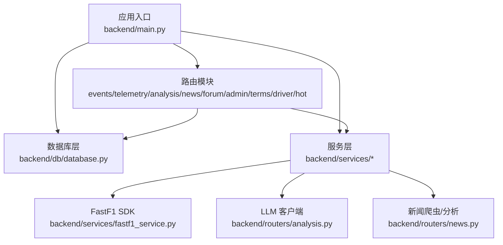
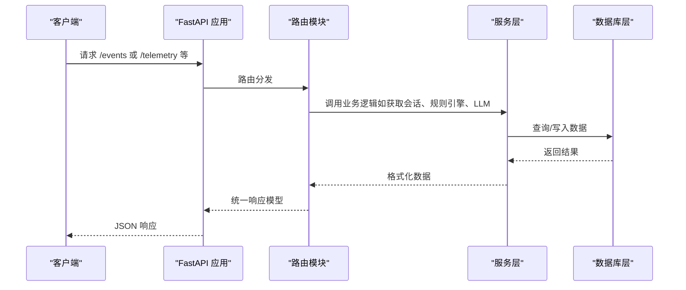
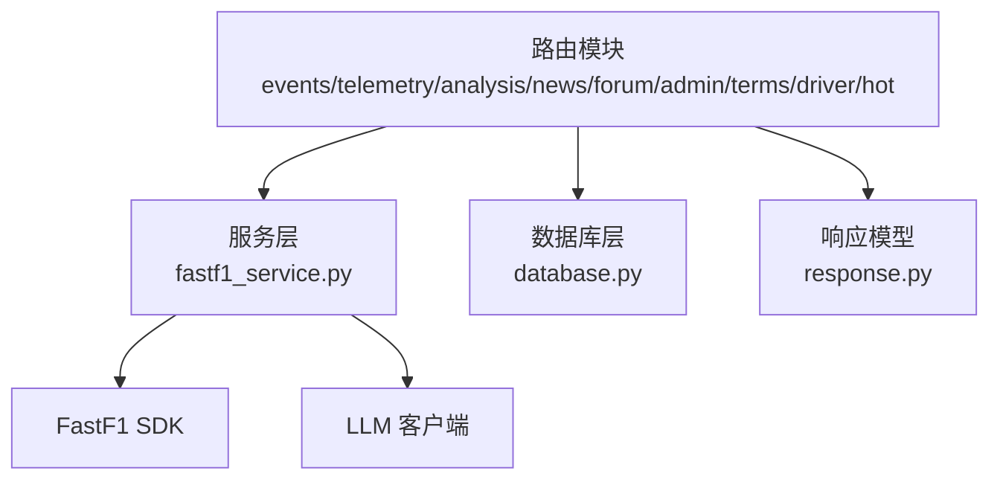

# 后端 API

<cite>
**本文引用的文件**
- [backend/main.py](file://backend/main.py)
- [backend/requirements.txt](file://backend/requirements.txt)
- [backend/start.sh](file://backend/start.sh)
- [backend/models/response.py](file://backend/models/response.py)
- [backend/db/database.py](file://backend/db/database.py)
- [backend/services/fastf1_service.py](file://backend/services/fastf1_service.py)
- [backend/routers/events.py](file://backend/routers/events.py)
- [backend/routers/telemetry.py](file://backend/routers/telemetry.py)
- [backend/routers/analysis.py](file://backend/routers/analysis.py)
- [backend/routers/news.py](file://backend/routers/news.py)
- [backend/routers/forum.py](file://backend/routers/forum.py)
- [backend/routers/admin.py](file://backend/routers/admin.py)
- [backend/routers/terms.py](file://backend/routers/terms.py)
- [backend/routers/driver.py](file://backend/routers/driver.py)
- [backend/routers/hot.py](file://backend/routers/hot.py)
</cite>

## 目录
1. [简介](#简介)
2. [项目结构](#项目结构)
3. [核心组件](#核心组件)
4. [架构总览](#架构总览)
5. [详细组件分析](#详细组件分析)
6. [依赖关系分析](#依赖关系分析)
7. [性能考量](#性能考量)
8. [故障排查指南](#故障排查指南)
9. [结论](#结论)
10. [附录](#附录)

## 简介
本文件为 Fast-F1 后端服务的完整 API 参考文档，覆盖所有 HTTP 接口的端点、请求方法、URL 模式、请求参数、响应格式与错误处理。文档还记录了认证机制、缓存策略、速率限制现状、版本管理与向后兼容性建议，并对事件查询、遥测数据获取、分析服务、内容管理等模块进行深入解析。

## 项目结构
后端基于 FastAPI 构建，采用“路由模块 + 服务层 + 数据库层”的分层架构：
- 应用入口与中间件：在应用启动时启用 CORS、初始化数据库、配置定时任务与后台预热。
- 路由模块：按功能域划分，如 events、telemetry、analysis、news、forum、admin、terms、driver、hot 等。
- 服务层：封装对 FastF1 的调用、LLM 分析、爬虫与规则引擎等。
- 数据库层：基于 SQLite，提供资讯、论坛、术语、车手评分等表的 CRUD 与聚合查询。
- 响应模型：统一返回结构，便于客户端处理。

图表来源
- [backend/main.py:18-41](file://backend/main.py#L18-L41)
- [backend/routers/events.py:1-10](file://backend/routers/events.py#L1-L10)
- [backend/routers/telemetry.py:1-9](file://backend/routers/telemetry.py#L1-L9)
- [backend/routers/analysis.py:1-10](file://backend/routers/analysis.py#L1-L10)
- [backend/routers/news.py:1-20](file://backend/routers/news.py#L1-L20)
- [backend/routers/forum.py:1-33](file://backend/routers/forum.py#L1-L33)
- [backend/routers/admin.py:1-25](file://backend/routers/admin.py#L1-L25)
- [backend/routers/terms.py:1-6](file://backend/routers/terms.py#L1-L6)
- [backend/routers/driver.py:1-21](file://backend/routers/driver.py#L1-L21)
- [backend/routers/hot.py:1-13](file://backend/routers/hot.py#L1-L13)
- [backend/db/database.py:1-10](file://backend/db/database.py#L1-L10)
- [backend/services/fastf1_service.py:1-8](file://backend/services/fastf1_service.py#L1-L8)

章节来源
- [backend/main.py:1-157](file://backend/main.py#L1-L157)
- [backend/requirements.txt:1-15](file://backend/requirements.txt#L1-L15)
- [backend/start.sh:1-25](file://backend/start.sh#L1-L25)

## 核心组件
- 应用与中间件
  - CORS：允许任意源、方法与头。
  - 根路径与重定向：根路径返回运行状态与版本；提供微信 WebView 跳转中转。
- 数据库初始化与定时任务
  - 启动时初始化 SQLite 表结构与默认分区；后台线程预热事件与积分榜缓存；定时任务每小时爬取新闻。
- 统一响应模型
  - 所有接口返回统一结构，包含 status、data、note 字段，便于前端一致处理。

章节来源
- [backend/main.py:18-41](file://backend/main.py#L18-L41)
- [backend/main.py:117-136](file://backend/main.py#L117-L136)
- [backend/models/response.py:1-14](file://backend/models/response.py#L1-L14)

## 架构总览
后端通过 APIRouter 将各功能模块挂载到统一的应用实例上，服务层封装外部依赖（FastF1、LLM、爬虫），数据库层提供持久化与查询能力。整体流程如下：

图表来源
- [backend/main.py:27-41](file://backend/main.py#L27-L41)
- [backend/routers/telemetry.py:11-78](file://backend/routers/telemetry.py#L11-L78)
- [backend/routers/analysis.py:35-120](file://backend/routers/analysis.py#L35-L120)
- [backend/db/database.py:204-214](file://backend/db/database.py#L204-L214)

## 详细组件分析

### 通用响应与错误处理
- 统一响应结构
  - 字段：status（字符串，"ok"/"error"）、data（任意）、note（可选说明）。
- 错误处理
  - 路由层捕获异常并返回统一错误响应；部分接口对非法输入进行显式校验并返回错误。

章节来源
- [backend/models/response.py:1-14](file://backend/models/response.py#L1-L14)
- [backend/routers/news.py:62-64](file://backend/routers/news.py#L62-L64)
- [backend/routers/forum.py:75-82](file://backend/routers/forum.py#L75-L82)

### 事件查询模块（/events）
- 功能
  - 获取赛季赛历；按轮次获取赛道静态信息。
- 端点
  - GET /events
    - 参数：year（默认 2026）
    - 响应：包含轮次、国家、地点、日期、赛程格式、UTC 赛事时间等字段的数组
    - 缓存：内存缓存，TTL 6 小时
  - GET /events/{round_num}/circuit
    - 参数：round_num（轮次）、year（默认 2026）
    - 响应：包含位置、国家、赛事名称与静态信息字典
    - 缓存：内存缓存，TTL 6 小时
- 说明
  - 赛事时间转换为 UTC ISO 时间字符串；静态信息来自内置映射表。

章节来源
- [backend/routers/events.py:21-53](file://backend/routers/events.py#L21-L53)
- [backend/routers/events.py:480-505](file://backend/routers/events.py#L480-L505)

### 遥测数据模块（/telemetry）
- 功能
  - 对比两位车手的最快圈遥测数据，返回车手信息、圈速差、弯角标注与遥测曲线。
- 端点
  - GET /telemetry
    - 参数：year（默认 2026）、round_num（二选一：轮次或 event 名称）、d1/d2（车手代码，默认 ALB/ALO）、session（默认 Q）
    - 响应：包含车手 A/B 的代码、队伍、颜色、圈速；gap 差值；corner_labels 与 corner_distances；telemetry 为两位车手的遥测字典
    - 数据质量：若任一车手遥测缺失超过阈值，返回 note 提示数据截断
- 说明
  - 会话加载与缓存由服务层统一处理；遥测数据序列化为可 JSON 序列化的结构。

章节来源
- [backend/routers/telemetry.py:11-78](file://backend/routers/telemetry.py#L11-L78)
- [backend/services/fastf1_service.py:14-21](file://backend/services/fastf1_service.py#L14-L21)

### 分析服务模块（/analysis）
- 功能
  - 基于规则引擎与 LLM 生成对比分析报告；支持缓存与强制刷新。
- 端点
  - GET /analysis
    - 参数：year（默认 2026）、round_num（二选一：轮次或 event 名称）、d1/d2（车手代码，默认 ALB/ALO）、session（默认 Q）、force（是否强制刷新）
    - 响应：包含 metrics（规则引擎指标）、report（LLM 报告）、cached（是否命中缓存）
    - 缓存：按参数生成 MD5 文件名缓存于 backend/cache/analysis，命中则直接返回
- 说明
  - LLM 输入包含事件名、会话类型、车手全名、圈速差等；规则引擎计算多类指标。

章节来源
- [backend/routers/analysis.py:35-120](file://backend/routers/analysis.py#L35-L120)

### 资讯模块（/news）
- 功能
  - 资讯列表、详情、关联帖子、车队标签、AI 分析触发与爬虫控制。
- 端点
  - GET /news
    - 参数：page/page_size、team（车队 slug）、keyword（模糊搜索）
    - 响应：分页列表，包含 analyzed 标记
  - GET /news/{id}
    - 响应：资讯详情，若已分析则包含技术要点、通俗解释、赛况影响
  - GET /news/{id}/teams
    - 响应：匹配到的车队列表（内存缓存，TTL 10 分钟）
  - GET /news/{id}/posts
    - 响应：关联帖子列表
  - POST /news/{id}/analyze-public
    - 参数：force（是否强制重新分析）
    - 响应：already_done/started 状态；后台线程异步分析
  - POST /news/crawl（管理员）
    - 响应：爬取结果统计
  - POST /news/{id}/analyze（管理员）
    - 响应：分析完成或失败提示
- 认证
  - 管理员接口需在请求头携带 X-Admin-Token（默认 f1admin2026）
- 说明
  - 车队关键词映射与模糊匹配；AI 分析结果全局共享，避免重复计算。

章节来源
- [backend/routers/news.py:67-82](file://backend/routers/news.py#L67-L82)
- [backend/routers/news.py:104-114](file://backend/routers/news.py#L104-L114)
- [backend/routers/news.py:117-124](file://backend/routers/news.py#L117-L124)
- [backend/routers/news.py:127-156](file://backend/routers/news.py#L127-L156)
- [backend/routers/news.py:159-168](file://backend/routers/news.py#L159-L168)
- [backend/routers/news.py:171-189](file://backend/routers/news.py#L171-L189)
- [backend/routers/admin.py:30-33](file://backend/routers/admin.py#L30-L33)

### 论坛模块（/forum）
- 功能
  - 用户注册/信息查询、分区列表、帖子与评论管理、点赞、热门推荐。
- 端点
  - POST /forum/users/register
    - 请求体：code（微信登录临时 code）、nickname、avatar_url
    - 响应：用户信息（昵称长度与字符校验）
  - GET /forum/users/me
    - 参数：openid
    - 响应：用户信息
  - GET /forum/sections
    - 响应：按类型分组的分区列表（内存缓存，TTL 1 小时）
  - GET /forum/posts
    - 参数：section_id、page/page_size、sort（latest/hot）
    - 响应：帖子列表（只返回 approved）
  - GET /forum/posts/{id}
    - 响应：帖子详情（浏览数自动 +1）
  - POST /forum/posts
    - 请求体：section_id、title、content、openid、news_id（可选）
    - 响应：发帖成功消息与 post_id
  - DELETE /forum/posts/{post_id}
    - 请求体：openid
    - 响应：删除成功或权限错误
  - POST /forum/posts/{post_id}/like
    - 请求体：openid、type（like/dislike）
    - 响应：点赞/点踩统计与我的投票
  - GET /forum/posts/{post_id}/like
    - 参数：openid（可选）
    - 响应：点赞统计与我的投票
  - GET /forum/posts/{post_id}/comments
    - 响应：评论列表（只返回 approved）
  - POST /forum/posts/{id}/comments
    - 请求体：content、openid
    - 响应：评论提交与审核提示
- 认证
  - 用户注册通过微信 code 换取 openid；管理员接口需 X-Admin-Token。
- 说明
  - 帖子与评论默认状态为 pending，需管理员审核；点赞支持切换与取消。

章节来源
- [backend/routers/forum.py:95-119](file://backend/routers/forum.py#L95-L119)
- [backend/routers/forum.py:125-138](file://backend/routers/forum.py#L125-L138)
- [backend/routers/forum.py:153-178](file://backend/routers/forum.py#L153-L178)
- [backend/routers/forum.py:181-192](file://backend/routers/forum.py#L181-L192)
- [backend/routers/forum.py:195-229](file://backend/routers/forum.py#L195-L229)
- [backend/routers/forum.py:237-246](file://backend/routers/forum.py#L237-L246)
- [backend/routers/forum.py:255-273](file://backend/routers/forum.py#L255-L273)
- [backend/routers/forum.py:285-292](file://backend/routers/forum.py#L285-L292)
- [backend/routers/forum.py:295-326](file://backend/routers/forum.py#L295-L326)

### 管理员模块（/admin）
- 功能
  - 帖子与评论审核、爬虫与分析触发、术语审核。
- 端点
  - GET /admin/posts
    - 参数：page/page_size
    - 响应：待审核帖子列表
  - POST /admin/posts/{id}/approve
  - POST /admin/posts/{id}/reject
  - GET /admin/comments
    - 参数：page/page_size
    - 响应：待审核评论列表
  - POST /admin/comments/{id}/approve
  - POST /admin/comments/{id}/reject
  - POST /admin/crawl
    - 响应：爬取 + 批量分析结果
  - POST /admin/crawl-only
    - 响应：仅爬取结果与待分析列表
  - POST /admin/analyze-one/{news_id}?force=bool
    - 响应：分析结果或跳过提示
  - DELETE /admin/analyses
    - 响应：清空所有分析记录
  - GET /admin/terms
    - 响应：待审核术语列表
  - POST /admin/terms/{term_id}/approve
  - POST /admin/terms/{term_id}/reject
- 认证
  - 需 X-Admin-Token（默认 f1admin2026）

章节来源
- [backend/routers/admin.py:40-80](file://backend/routers/admin.py#L40-L80)
- [backend/routers/admin.py:87-127](file://backend/routers/admin.py#L87-L127)
- [backend/routers/admin.py:134-164](file://backend/routers/admin.py#L134-L164)
- [backend/routers/admin.py:167-191](file://backend/routers/admin.py#L167-L191)
- [backend/routers/admin.py:194-207](file://backend/routers/admin.py#L194-L207)
- [backend/routers/admin.py:214-244](file://backend/routers/admin.py#L214-L244)

### 术语模块（/terms）
- 功能
  - 术语查询、按新闻筛选、提交术语。
- 端点
  - GET /terms?category&level
    - 响应：术语列表（按分类与等级过滤，内存缓存 TTL 10 分钟）
  - GET /terms/news/{news_id}
    - 响应：与新闻相关的术语列表（内存缓存 TTL 10 分钟）
  - GET /terms/{slug}
    - 响应：术语详情（不存在返回 404）
  - POST /terms/submit
    - 请求体：中文名、英文名、简述、分类、openid（可选）
    - 响应：提交成功与术语 ID
- 说明
  - 分类限定集合；提交内容校验。

章节来源
- [backend/routers/terms.py:35-48](file://backend/routers/terms.py#L35-L48)
- [backend/routers/terms.py:52-59](file://backend/routers/terms.py#L52-L59)
- [backend/routers/terms.py:62-67](file://backend/routers/terms.py#L62-L67)
- [backend/routers/terms.py:78-91](file://backend/routers/terms.py#L78-L91)

### 车手模块（/driver）
- 功能
  - 车手评论列表与点赞、评分聚合与个人评分。
- 端点
  - GET /driver/{code}/comments?page
    - 响应：评论列表（格式化时间字符串）
  - POST /driver/{code}/comments
    - 请求体：openid、content
    - 响应：评论 ID 与昵称
  - POST /driver/comments/{comment_id}/like
    - 响应：点赞数
  - GET /driver/{code}/rating?openid
    - 响应：聚合评分与我的评分
  - POST /driver/{code}/rating
    - 请求体：openid 与五项评分（1-5）
    - 响应：聚合评分与我的评分
- 说明
  - 车手代码白名单校验；评分唯一性（同一 openid 同一车手）。

章节来源
- [backend/routers/driver.py:44-62](file://backend/routers/driver.py#L44-L62)
- [backend/routers/driver.py:65-82](file://backend/routers/driver.py#L65-L82)
- [backend/routers/driver.py:85-88](file://backend/routers/driver.py#L85-L88)
- [backend/routers/driver.py:91-98](file://backend/routers/driver.py#L91-L98)
- [backend/routers/driver.py:101-115](file://backend/routers/driver.py#L101-L115)

### 热门推荐模块（/hot）
- 功能
  - 热门帖子与热门资讯 Top N。
- 端点
  - GET /hot/posts?limit
    - 响应：按热度公式排序的帖子列表（内存缓存 TTL 10 分钟）
  - GET /hot/news?limit
    - 响应：有 AI 解读优先、按发布时间倒序的资讯列表（内存缓存 TTL 10 分钟）
- 说明
  - 热度公式：(评论数×0.5 + 浏览数×0.3) / (小时数/24 + 1)。

章节来源
- [backend/routers/hot.py:32-57](file://backend/routers/hot.py#L32-L57)
- [backend/routers/hot.py:60-83](file://backend/routers/hot.py#L60-L83)

### 认证机制
- 管理员认证
  - 所有 /admin 接口需在请求头携带 X-Admin-Token，值为环境变量 ADMIN_TOKEN（默认 f1admin2026）。
- 微信登录
  - /forum/users/register 使用 wx.login 临时 code 换取 openid；开发模式下可用 code 当 openid。
- 用户态
  - 论坛与车手模块通过 openid 标识用户，注册后方可发帖/评论/评分。

章节来源
- [backend/routers/admin.py:27-33](file://backend/routers/admin.py#L27-L33)
- [backend/routers/forum.py:57-72](file://backend/routers/forum.py#L57-L72)
- [backend/routers/forum.py:95-109](file://backend/routers/forum.py#L95-L109)

### 缓存策略
- 内存缓存
  - /events、/events/{round}/circuit：TTL 6 小时
  - /forum/sections：TTL 1 小时
  - /news/{id}/teams：TTL 10 分钟
  - /hot/posts、/hot/news：TTL 10 分钟
- 进程级会话缓存
  - /telemetry 与 /analysis 使用服务层缓存同一进程内的会话对象，避免重复加载。
- 文件缓存
  - /analysis 的分析结果按参数生成文件缓存于 backend/cache/analysis。

章节来源
- [backend/routers/events.py:12-19](file://backend/routers/events.py#L12-L19)
- [backend/routers/forum.py:35-45](file://backend/routers/forum.py#L35-L45)
- [backend/routers/news.py:24-34](file://backend/routers/news.py#L24-L34)
- [backend/routers/hot.py:15-29](file://backend/routers/hot.py#L15-L29)
- [backend/services/fastf1_service.py:11-21](file://backend/services/fastf1_service.py#L11-L21)
- [backend/routers/analysis.py:12-33](file://backend/routers/analysis.py#L12-L33)

### 速率限制
- 当前未实现全局速率限制；建议在网关或反向代理层按 IP/Token 实施限流，或在路由层增加令牌桶/漏桶算法。

[本节为通用建议，不直接分析具体文件]

### API 版本管理与向后兼容
- 应用版本
  - 应用标题与版本在应用初始化时定义（版本号 1.0.0）。
- 向后兼容
  - 当前路由未显式使用 URL 版本前缀；建议后续在路由前缀添加 /v1、/v2 等，以保证变更不影响现有客户端。
- 建议
  - 引入 OpenAPI 文档自动生成与版本化；对破坏性变更提供迁移指南。

章节来源
- [backend/main.py:18](file://backend/main.py#L18)
- [backend/main.py:148-150](file://backend/main.py#L148-L150)

## 依赖关系分析
- 外部依赖
  - FastAPI、uvicorn、fastf1、pandas、numpy、openai、requests-cache、apscheduler、feedparser、trafilatura 等。
- 内部依赖
  - 路由模块依赖服务层与数据库层；服务层依赖 FastF1 SDK 与 LLM 客户端；数据库层提供统一 CRUD 与聚合查询。

图表来源
- [backend/requirements.txt:1-15](file://backend/requirements.txt#L1-L15)
- [backend/services/fastf1_service.py:1-8](file://backend/services/fastf1_service.py#L1-L8)
- [backend/db/database.py:1-10](file://backend/db/database.py#L1-L10)
- [backend/models/response.py:1-14](file://backend/models/response.py#L1-L14)

章节来源
- [backend/requirements.txt:1-15](file://backend/requirements.txt#L1-L15)

## 性能考量
- 缓存优化
  - 内存缓存与文件缓存相结合，显著降低重复请求的响应时间。
  - 会话缓存避免重复加载相同会话数据。
- I/O 与并发
  - SQLite 使用 WAL 模式与外键约束，适合中小规模并发写入。
- 算法与数据结构
  - 遥测数据序列化时对 NaN 进行填充与舍入，保证前后端传输稳定性。
- 建议
  - 在高并发场景下考虑引入 Redis 缓存与数据库连接池；对热点接口增加限流与熔断。

[本节为通用建议，不直接分析具体文件]

## 故障排查指南
- 常见错误
  - 403 无权限：管理员接口未提供正确 X-Admin-Token。
  - 404 术语不存在：访问 /terms/{slug} 时 slug 不正确。
  - 资讯/帖子/评论不存在：访问详情时资源已被删除或状态不为 approved。
- 日志与调试
  - 启动脚本输出定时任务与预热状态；异常统一返回错误响应，note 字段包含错误描述。
- 建议
  - 前端轮询 /news/{id}/analyze-public 的结果；对网络波动与 LLM 调用失败进行重试。

章节来源
- [backend/routers/admin.py:30-33](file://backend/routers/admin.py#L30-L33)
- [backend/routers/terms.py:62-67](file://backend/routers/terms.py#L62-L67)
- [backend/routers/news.py:127-156](file://backend/routers/news.py#L127-L156)
- [backend/start.sh:22-24](file://backend/start.sh#L22-L24)

## 结论
本 API 参考文档系统性梳理了 Fast-F1 后端服务的路由、认证、缓存与性能策略。通过模块化设计与多层缓存，系统在数据获取与展示方面具备良好扩展性。建议后续引入版本化路由、速率限制与更完善的监控体系，以支撑更大规模的业务增长。

## 附录
- 启动与部署
  - 使用 start.sh 启动服务，监听 0.0.0.0:8000；自动创建 cache 目录并加载 .env 环境变量。
- 数据库初始化
  - 启动时自动建表与插入默认分区；术语种子数据初始化。

章节来源
- [backend/start.sh:1-25](file://backend/start.sh#L1-L25)
- [backend/db/database.py:204-214](file://backend/db/database.py#L204-L214)