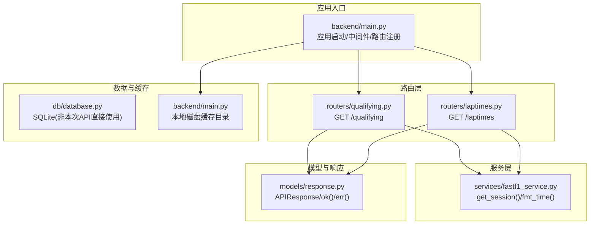
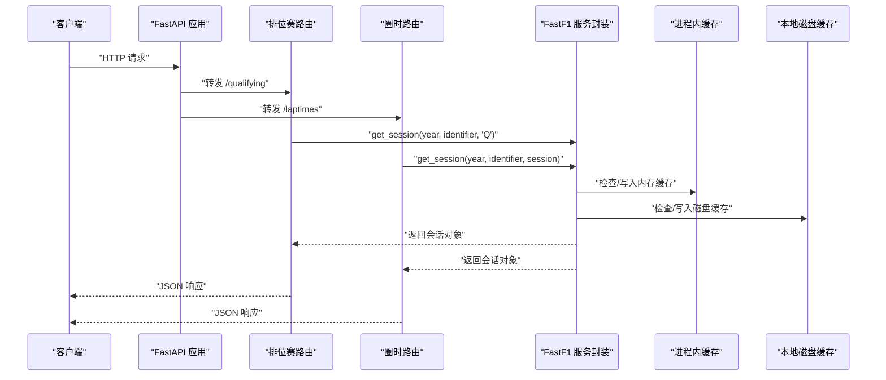
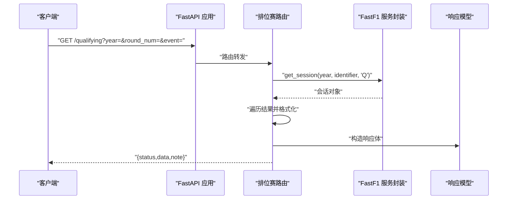
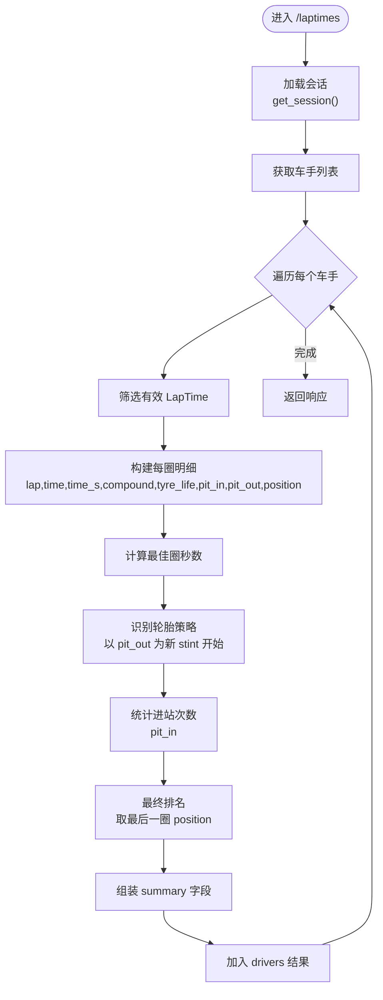
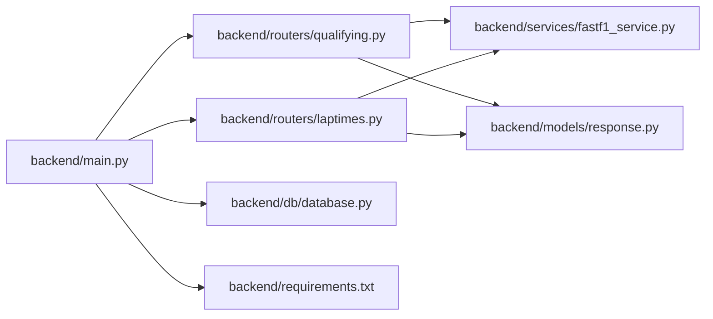

# 排位赛和圈时 API

<cite>
**本文引用的文件**   
- [backend/main.py](file://backend/main.py)
- [backend/routers/qualifying.py](file://backend/routers/qualifying.py)
- [backend/routers/laptimes.py](file://backend/routers/laptimes.py)
- [backend/services/fastf1_service.py](file://backend/services/fastf1_service.py)
- [backend/models/response.py](file://backend/models/response.py)
- [backend/db/database.py](file://backend/db/database.py)
- [backend/requirements.txt](file://backend/requirements.txt)
- [docs/data_reference/time_explanation.rst](file://docs/data_reference/time_explanation.rst)
- [memory/architecture.md](file://memory/architecture.md)
</cite>

## 目录
1. [简介](#简介)
2. [项目结构](#项目结构)
3. [核心组件](#核心组件)
4. [架构总览](#架构总览)
5. [详细组件分析](#详细组件分析)
6. [依赖分析](#依赖分析)
7. [性能考虑](#性能考虑)
8. [故障排查指南](#故障排查指南)
9. [结论](#结论)
10. [附录](#附录)

## 简介
本文件面向“排位赛和圈时数据 API”的使用者与维护者，系统化梳理以下能力：
- 排位赛结果查询：提供 Q1/Q2/Q3 时间与车手/车队信息
- 最佳圈时获取：按车手维度汇总最佳单圈及统计摘要
- 圈时分析：按圈次拆解、轮胎策略识别、进站次数统计、最终排名等
- 数据结构与时间格式：统一的时间表示、时间戳来源与换算
- 数据获取方式、缓存策略与性能优化：进程内内存缓存、本地磁盘缓存、预热机制
- 请求参数、响应格式与数据验证规则

## 项目结构
后端基于 FastAPI 构建，路由按功能模块划分，服务层统一封装数据获取与格式化，模型层统一响应结构。

**图表来源**
- [backend/main.py:18-41](file://backend/main.py#L18-L41)
- [backend/routers/qualifying.py:1-30](file://backend/routers/qualifying.py#L1-L30)
- [backend/routers/laptimes.py:1-121](file://backend/routers/laptimes.py#L1-L121)
- [backend/services/fastf1_service.py:11-35](file://backend/services/fastf1_service.py#L11-L35)
- [backend/models/response.py:1-14](file://backend/models/response.py#L1-L14)

**章节来源**
- [backend/main.py:18-41](file://backend/main.py#L18-L41)
- [backend/routers/qualifying.py:1-30](file://backend/routers/qualifying.py#L1-L30)
- [backend/routers/laptimes.py:1-121](file://backend/routers/laptimes.py#L1-L121)
- [backend/services/fastf1_service.py:11-35](file://backend/services/fastf1_service.py#L11-L35)
- [backend/models/response.py:1-14](file://backend/models/response.py#L1-L14)

## 核心组件
- 应用入口与路由注册：在应用启动时启用 CORS，注册 qualifying 与 laptimes 路由，并设置本地磁盘缓存目录与预热策略。
- 排位赛路由：接收年份、轮次号或事件名称，加载排位赛会话，遍历结果生成标准化响应。
- 圈时路由：按车手聚合圈次数据，计算最佳圈、轮胎策略、进站次数与最终排名，输出结构化结果。
- 服务封装：统一的会话加载与时间格式化工具，提供进程内内存缓存与本地磁盘缓存。
- 统一响应模型：统一的响应体结构，便于前端与客户端消费。

**章节来源**
- [backend/main.py:14-41](file://backend/main.py#L14-L41)
- [backend/routers/qualifying.py:7-29](file://backend/routers/qualifying.py#L7-L29)
- [backend/routers/laptimes.py:38-110](file://backend/routers/laptimes.py#L38-L110)
- [backend/services/fastf1_service.py:14-35](file://backend/services/fastf1_service.py#L14-L35)
- [backend/models/response.py:4-14](file://backend/models/response.py#L4-L14)

## 架构总览
下图展示从客户端到数据源的整体调用链与缓存路径：

**图表来源**
- [backend/main.py:14-16](file://backend/main.py#L14-L16)
- [backend/services/fastf1_service.py:14-21](file://backend/services/fastf1_service.py#L14-L21)
- [backend/routers/qualifying.py:10-11](file://backend/routers/qualifying.py#L10-L11)
- [backend/routers/laptimes.py:41-42](file://backend/routers/laptimes.py#L41-L42)

## 详细组件分析

### 排位赛结果查询 API
- 路径：GET /qualifying
- 功能：返回指定年份与轮次/事件的排位赛结果，包含每名车手的 Q1/Q2/Q3 时间与车手/车队信息。
- 请求参数
  - year: 整数，年份，默认 2026
  - round_num: 整数，轮次号（可选）
  - event: 字符串，事件名称（可选）
  - 参数约束：round_num 与 event 至少提供其一，二者同时提供时优先使用 round_num
- 数据来源与处理
  - 通过服务封装加载排位赛会话
  - 遍历会话结果，提取 Position、Abbreviation、TeamName、Q1/Q2/Q3
  - 对 Q1/Q2/Q3 使用统一时间格式化函数
- 响应结构
  - 包含 event、year、results 数组
  - results 中每项包含 position、driver、team、q1、q2、q3
- 错误处理
  - 异常捕获并返回统一错误响应

**图表来源**
- [backend/routers/qualifying.py:7-29](file://backend/routers/qualifying.py#L7-L29)
- [backend/services/fastf1_service.py:24-34](file://backend/services/fastf1_service.py#L24-L34)
- [backend/models/response.py:9-13](file://backend/models/response.py#L9-L13)

**章节来源**
- [backend/routers/qualifying.py:7-29](file://backend/routers/qualifying.py#L7-L29)
- [backend/services/fastf1_service.py:24-34](file://backend/services/fastf1_service.py#L24-L34)
- [backend/models/response.py:9-13](file://backend/models/response.py#L9-L13)

### 圈时分析 API
- 路径：GET /laptimes
- 功能：按车手维度返回圈时明细、最佳圈、轮胎策略、进站次数与最终排名等统计摘要。
- 请求参数
  - year: 整数，年份，默认 2026
  - round_num: 整数，轮次号（可选）
  - event: 字符串，事件名称（可选）
  - session: 字符串，会话类型，默认 "R"（正赛），可选 "R"/"Q"/"S"
- 数据来源与处理
  - 加载指定会话，去重获取所有车手
  - 针对每个车手：筛选有效 LapTime，构建每圈数据
  - 计算最佳圈（秒级）、统计总圈数、进站次数
  - 轮胎策略识别：以 PitOutTime 作为新 stint 开始标志，合并连续相同 Compound 的圈数
  - 最终排名：取最后一圈 Position
- 响应结构
  - 包含 event、year、session、drivers 字典
  - drivers 中键为车号/车手标识，值包含 team、laps（每圈明细）、summary（统计摘要）
- 时间格式
  - fmt_time：将 timedelta 转为 "m:ss.mmm" 字符串
  - fmt_time_s：将秒数转为 "m:ss.mmm" 字符串

**图表来源**
- [backend/routers/laptimes.py:38-110](file://backend/routers/laptimes.py#L38-L110)
- [backend/services/fastf1_service.py:24-34](file://backend/services/fastf1_service.py#L24-L34)

**章节来源**
- [backend/routers/laptimes.py:38-110](file://backend/routers/laptimes.py#L38-L110)
- [backend/services/fastf1_service.py:24-34](file://backend/services/fastf1_service.py#L24-L34)

### 数据结构与时间格式
- 排位赛结果字段
  - position: 整数或 null
  - driver: 字符串（缩写）
  - team: 字符串
  - q1/q2/q3: 字符串（格式化后的 "m:ss.mmm"，缺失为 "N/A"）
- 圈时明细字段
  - lap: 圈号
  - time: 格式化时间字符串 "m:ss.mmm"
  - time_s: 秒数（保留毫秒精度）
  - compound: 轮胎 Compound 名称或空字符串
  - tyre_life: 轮胎寿命（整数）
  - pit_in/pit_out: 是否进/出维修区（布尔）
  - position: 当圈位置（整数）
- 统计摘要字段
  - final_position: 最终排名
  - best_lap_s: 最佳圈秒数
  - best_lap_fmt: 最佳圈格式化字符串
  - pit_count: 进站次数
  - total_laps: 总圈数
  - stints: 轮胎策略数组，元素包含 compound 与 laps

**章节来源**
- [backend/routers/qualifying.py:13-22](file://backend/routers/qualifying.py#L13-L22)
- [backend/routers/laptimes.py:51-107](file://backend/routers/laptimes.py#L51-L107)
- [docs/data_reference/time_explanation.rst:139-152](file://docs/data_reference/time_explanation.rst#L139-L152)

### 时间比较与统计方法
- 最佳圈时比较
  - 以秒数为基准进行最小值比较，缺失或无效值跳过
- 轮胎策略识别
  - 以 PitOutTime 作为新 stint 开始标志，合并连续相同 Compound 的圈数
  - 若 Compound 为空或未知，按 "UNKNOWN" 处理
- 进站次数统计
  - 以 PitInTime 是否存在为依据计数
- 最终排名
  - 取最后一圈的 Position 作为最终排名

**章节来源**
- [backend/routers/laptimes.py:66-94](file://backend/routers/laptimes.py#L66-L94)
- [docs/data_reference/time_explanation.rst:139-152](file://docs/data_reference/time_explanation.rst#L139-L152)

## 依赖分析
- 外部依赖
  - fastapi、uvicorn：Web 框架与 ASGI 服务器
  - fastf1：F1 数据获取与缓存
  - pandas/numpy/scipy：数据处理
  - requests-cache：HTTP 缓存（由 fastf1 使用）
  - APScheduler：定时任务
- 内部依赖
  - 路由依赖服务封装的 get_session 与时间格式化
  - 统一响应模型用于标准化返回

**图表来源**
- [backend/main.py:18-41](file://backend/main.py#L18-L41)
- [backend/routers/qualifying.py:1-3](file://backend/routers/qualifying.py#L1-L3)
- [backend/routers/laptimes.py:1-3](file://backend/routers/laptimes.py#L1-L3)
- [backend/services/fastf1_service.py:5-8](file://backend/services/fastf1_service.py#L5-L8)
- [backend/models/response.py:1-2](file://backend/models/response.py#L1-L2)
- [backend/db/database.py:1-4](file://backend/db/database.py#L1-L4)
- [backend/requirements.txt:1-15](file://backend/requirements.txt#L1-L15)

**章节来源**
- [backend/requirements.txt:1-15](file://backend/requirements.txt#L1-L15)
- [backend/main.py:18-41](file://backend/main.py#L18-L41)

## 性能考虑
- 进程内内存缓存
  - 通过进程级字典缓存同一会话对象，避免重复加载
- 本地磁盘缓存
  - 启用 fastf1 缓存目录，减少网络请求与解析时间
- 启动预热
  - 后台线程扫描已有缓存目录，预加载会话对象到内存
  - 启动后预热 events 与 standings 接口缓存
- 前端缓存策略
  - 小程序前端采用 stale-while-revalidate 模式，提升重复访问体验
  - 不同接口设置不同 TTL，降低请求频率

**章节来源**
- [backend/services/fastf1_service.py:11-21](file://backend/services/fastf1_service.py#L11-L21)
- [backend/main.py:14-16](file://backend/main.py#L14-L16)
- [backend/main.py:55-126](file://backend/main.py#L55-L126)
- [memory/architecture.md:115-129](file://memory/architecture.md#L115-L129)

## 故障排查指南
- 常见错误
  - 会话加载失败：检查 year、round_num/event 是否正确，确认对应缓存是否存在
  - 时间格式异常："N/A" 表示缺失或不可解析
  - 空结果：某些车手可能没有有效 LapTime，需检查筛选条件
- 排查步骤
  - 查看统一错误响应中的 note 字段
  - 检查本地缓存目录是否存在对应年份/赛事文件夹
  - 观察启动日志中的预热提示
- 建议
  - 首次访问后观察缓存命中率
  - 对高频接口结合前端缓存策略使用

**章节来源**
- [backend/routers/qualifying.py:28-29](file://backend/routers/qualifying.py#L28-L29)
- [backend/routers/laptimes.py:109-110](file://backend/routers/laptimes.py#L109-L110)
- [backend/main.py:117-136](file://backend/main.py#L117-L136)

## 结论
本 API 提供了排位赛与圈时数据的标准化查询与分析能力，具备完善的缓存与预热机制，能够满足实时与历史数据的快速访问需求。通过统一的响应模型与清晰的数据结构，便于前端与移动端集成与二次开发。

## 附录

### 请求与响应规范

- 排位赛查询
  - 方法：GET
  - 路径：/qualifying
  - 查询参数
    - year: 整数，年份，默认 2026
    - round_num: 整数，轮次号（可选）
    - event: 字符串，事件名称（可选）
  - 响应
    - data.event: 事件名称
    - data.year: 年份
    - data.results: 数组，每项包含 position、driver、team、q1、q2、q3

- 圈时查询
  - 方法：GET
  - 路径：/laptimes
  - 查询参数
    - year: 整数，年份，默认 2026
    - round_num: 整数，轮次号（可选）
    - event: 字符串，事件名称（可选）
    - session: 字符串，会话类型，默认 "R"
  - 响应
    - data.event: 事件名称
    - data.year: 年份
    - data.session: 会话类型
    - data.drivers: 对象，键为车手标识，值包含 team、laps、summary
    - summary 包含 final_position、best_lap_s、best_lap_fmt、pit_count、total_laps、stints

**章节来源**
- [backend/routers/qualifying.py:7-29](file://backend/routers/qualifying.py#L7-L29)
- [backend/routers/laptimes.py:38-110](file://backend/routers/laptimes.py#L38-L110)