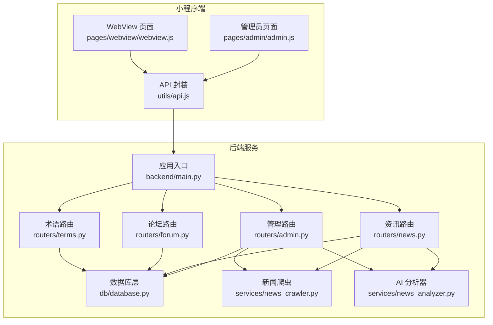
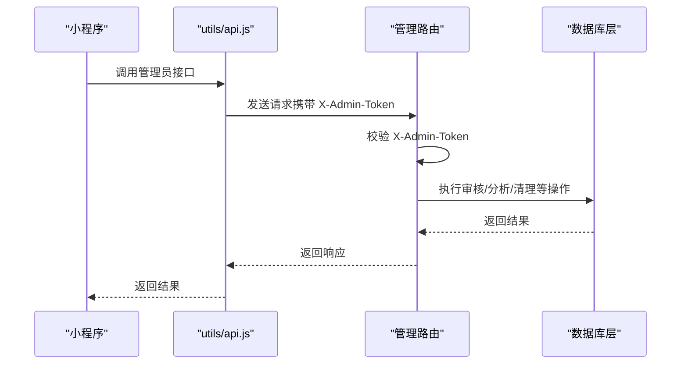
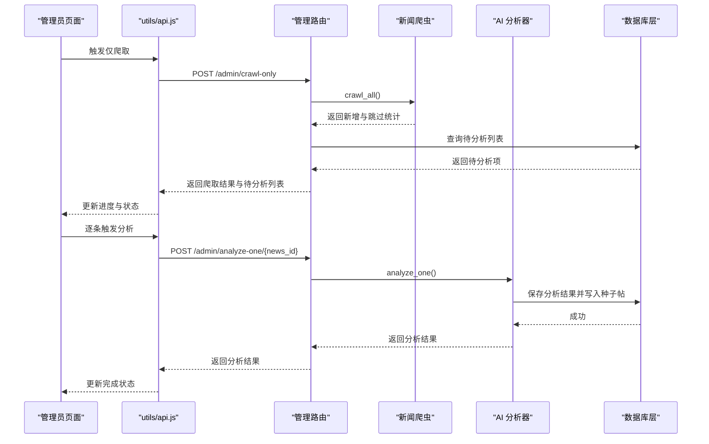
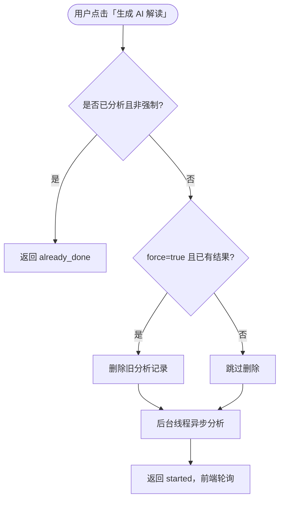
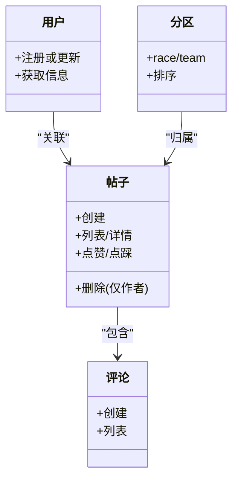
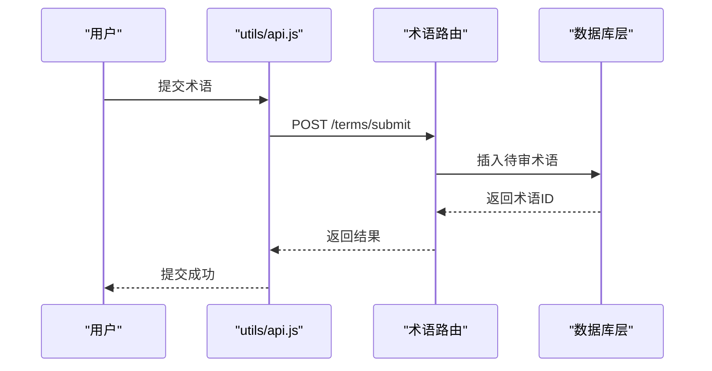
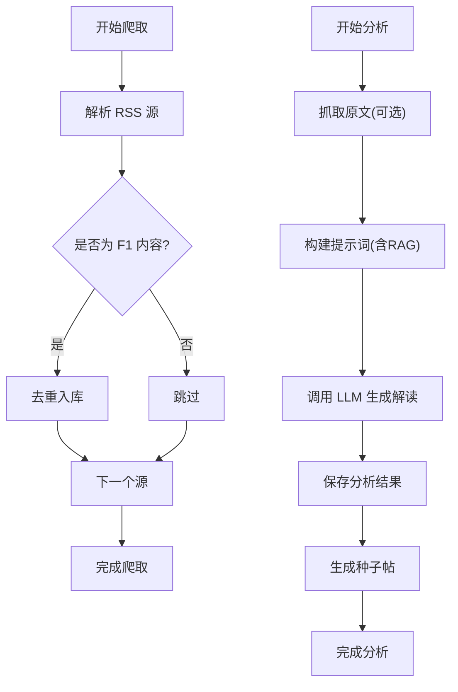
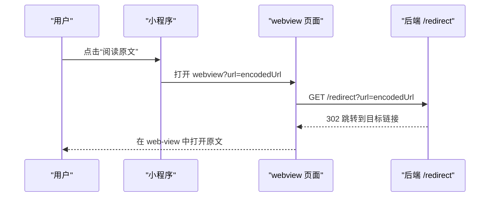
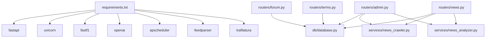

# 管理员和 WebView API

<cite>
**本文档引用的文件**
- [backend/main.py](file://backend/main.py)
- [backend/routers/admin.py](file://backend/routers/admin.py)
- [backend/routers/news.py](file://backend/routers/news.py)
- [backend/routers/forum.py](file://backend/routers/forum.py)
- [backend/routers/terms.py](file://backend/routers/terms.py)
- [backend/db/database.py](file://backend/db/database.py)
- [backend/models/response.py](file://backend/models/response.py)
- [backend/services/news_crawler.py](file://backend/services/news_crawler.py)
- [backend/services/news_analyzer.py](file://backend/services/news_analyzer.py)
- [miniprogram/utils/api.js](file://miniprogram/utils/api.js)
- [miniprogram/pages/admin/admin.js](file://miniprogram/pages/admin/admin.js)
- [miniprogram/pages/webview/webview.js](file://miniprogram/pages/webview/webview.js)
- [miniprogram/pages/webview/webview.wxml](file://miniprogram/pages/webview/webview.wxml)
- [miniprogram/app.json](file://miniprogram/app.json)
- [backend/requirements.txt](file://backend/requirements.txt)
</cite>

## 目录
1. [简介](#简介)
2. [项目结构](#项目结构)
3. [核心组件](#核心组件)
4. [架构总览](#架构总览)
5. [详细组件分析](#详细组件分析)
6. [依赖关系分析](#依赖关系分析)
7. [性能考虑](#性能考虑)
8. [故障排查指南](#故障排查指南)
9. [结论](#结论)
10. [附录](#附录)

## 简介
本文件面向管理员与 WebView 集成场景，系统性梳理后端管理接口、内容审核、用户管理、系统配置、爬虫与 AI 分析、术语审核、跨域与安全防护、以及小程序 WebView 的集成方式。文档覆盖权限验证、批量操作、系统监控与数据导出能力，并提供完整的管理操作流程、权限控制与审计日志建议。

## 项目结构
后端基于 FastAPI 提供 REST API，路由按功能模块划分，数据库采用 SQLite，服务层包含新闻爬虫与 AI 分析器。小程序端提供管理员后台与 WebView 页面，统一通过公共 API 层实现数据交互。



**图表来源**
- [backend/main.py:18-41](file://backend/main.py#L18-L41)
- [backend/routers/admin.py:25](file://backend/routers/admin.py#L25)
- [backend/routers/news.py:20](file://backend/routers/news.py#L20)
- [backend/routers/forum.py:33](file://backend/routers/forum.py#L33)
- [backend/routers/terms.py:6](file://backend/routers/terms.py#L6)
- [backend/db/database.py:10](file://backend/db/database.py#L10)
- [backend/services/news_crawler.py:14](file://backend/services/news_crawler.py#L14)
- [backend/services/news_analyzer.py:8](file://backend/services/news_analyzer.py#L8)

**章节来源**
- [backend/main.py:18-41](file://backend/main.py#L18-L41)
- [miniprogram/app.json:1-72](file://miniprogram/app.json#L1-L72)

## 核心组件
- 管理员路由：提供帖子/评论/术语审核、爬虫触发、AI 分析控制等管理能力，统一通过请求头 X-Admin-Token 进行鉴权。
- 资讯路由：提供新闻列表、详情、团队标签、关联帖子、AI 分析触发等接口，支持管理员手动分析与用户触发分析。
- 论坛路由：提供用户注册、分区、帖子、评论、点赞等接口，支持内容审核与权限控制。
- 术语路由：提供术语查询、提交、按新闻筛选等接口，支持管理员审核。
- 数据库层：统一建表、CRUD、索引与默认分区初始化，支撑内容审核与统计。
- 服务层：新闻爬虫与 AI 分析器，支持 RSS 源采集、全文抓取、RAG 上下文注入与种子帖生成。
- 小程序 API：统一封装 GET/POST 请求、缓存策略、管理员鉴权头、WebView 跳转中转。

**章节来源**
- [backend/routers/admin.py:1-245](file://backend/routers/admin.py#L1-L245)
- [backend/routers/news.py:1-190](file://backend/routers/news.py#L1-L190)
- [backend/routers/forum.py:1-327](file://backend/routers/forum.py#L1-L327)
- [backend/routers/terms.py:1-92](file://backend/routers/terms.py#L1-L92)
- [backend/db/database.py:26-214](file://backend/db/database.py#L26-L214)
- [backend/services/news_crawler.py:14-148](file://backend/services/news_crawler.py#L14-L148)
- [backend/services/news_analyzer.py:8-298](file://backend/services/news_analyzer.py#L8-L298)
- [miniprogram/utils/api.js:87-299](file://miniprogram/utils/api.js#L87-L299)

## 架构总览
后端通过 FastAPI 提供统一 API，启用 CORS 放通跨域；管理员接口通过 X-Admin-Token 进行鉴权；定时任务负责新闻爬取与缓存预热；数据库层提供事务与并发写入优化；服务层负责外部数据采集与 AI 分析；小程序端通过 utils/api.js 统一调用后端接口，管理员页面与 WebView 页面分别承载管理与内容展示。



**图表来源**
- [backend/routers/admin.py:30-34](file://backend/routers/admin.py#L30-L34)
- [miniprogram/utils/api.js:226-279](file://miniprogram/utils/api.js#L226-L279)

**章节来源**
- [backend/main.py:20-25](file://backend/main.py#L20-L25)
- [backend/main.py:117-136](file://backend/main.py#L117-L136)

## 详细组件分析

### 管理员接口（/admin）
- 鉴权机制：请求头 X-Admin-Token，后端从环境变量读取默认值，失败返回 403。
- 帖子审核：获取待审列表、通过/拒绝单个帖子。
- 评论审核：获取待审列表、通过/拒绝单个评论。
- 爬虫与分析：触发爬取、仅爬取（返回新增与待分析列表）、单条分析（支持强制重算）、清空所有分析记录。
- 术语审核：获取待审术语列表、通过/拒绝单个术语。



**图表来源**
- [backend/routers/admin.py:148-207](file://backend/routers/admin.py#L148-L207)
- [backend/services/news_crawler.py:119-148](file://backend/services/news_crawler.py#L119-L148)
- [backend/services/news_analyzer.py:220-257](file://backend/services/news_analyzer.py#L220-L257)
- [backend/db/database.py:302-325](file://backend/db/database.py#L302-L325)

**章节来源**
- [backend/routers/admin.py:1-245](file://backend/routers/admin.py#L1-L245)
- [miniprogram/pages/admin/admin.js:132-198](file://miniprogram/pages/admin/admin.js#L132-L198)
- [miniprogram/utils/api.js:248-279](file://miniprogram/utils/api.js#L248-L279)

### 资讯接口（/news）
- 列表/详情/团队标签/关联帖子：支持分页、关键词过滤、缓存。
- 用户触发 AI 分析：支持强制重算，异步执行并返回状态。
- 管理员手动触发：爬取、单条分析、强制重算。



**图表来源**
- [backend/routers/news.py:127-157](file://backend/routers/news.py#L127-L157)
- [backend/db/database.py:302-325](file://backend/db/database.py#L302-L325)

**章节来源**
- [backend/routers/news.py:1-190](file://backend/routers/news.py#L1-L190)

### 论坛接口（/forum）
- 用户注册：通过 wx.login code 换取 openid，校验昵称合法性。
- 分区列表：按类型分组返回，带内存缓存。
- 帖子/评论：支持列表、详情、创建、删除（仅作者）、点赞/点踩。
- 审核策略：当前版本直接发布（approved），后续可改为 pending。



**图表来源**
- [backend/routers/forum.py:89-118](file://backend/routers/forum.py#L89-L118)
- [backend/routers/forum.py:125-138](file://backend/routers/forum.py#L125-L138)
- [backend/routers/forum.py:145-229](file://backend/routers/forum.py#L145-L229)
- [backend/routers/forum.py:280-327](file://backend/routers/forum.py#L280-L327)

**章节来源**
- [backend/routers/forum.py:1-327](file://backend/routers/forum.py#L1-L327)

### 术语接口（/terms）
- 查询：支持按分类与等级过滤，带缓存。
- 按新闻筛选：返回与新闻相关的术语集合。
- 提交：用户提交术语，管理员审核。



**图表来源**
- [backend/routers/terms.py:78-92](file://backend/routers/terms.py#L78-L92)
- [backend/db/database.py:112-128](file://backend/db/database.py#L112-L128)

**章节来源**
- [backend/routers/terms.py:1-92](file://backend/routers/terms.py#L1-L92)

### 数据库层（SQLite）
- DDL：新闻、分析、分区、用户、帖子、评论、点赞、术语、车手评分与评论等表。
- 索引：按查询热点建立索引，提升分页与过滤效率。
- 初始化：幂等建表与默认分区插入，术语种子数据初始化。

```mermaid
erDiagram
NEWS {
int id PK
text title
text summary
text url UK
text source
int published_at
int created_at
}
NEWS_ANALYSIS {
int id PK
int news_id UK FK
text tech_points
text plain_explain
text race_impact
text raw_report
int created_at
}
SECTIONS {
int id PK
text type
text name
text slug UK
int sort_order
}
USERS {
text openid PK
text nickname
text avatar_url
int created_at
}
POSTS {
int id PK
int section_id FK
int news_id FK
text title
text content
text author_openid
text author_nickname
text status
int is_seeded
int view_count
int comment_count
int created_at
int updated_at
}
COMMENTS {
int id PK
int post_id FK
text content
text author_openid
text author_nickname
text status
int created_at
}
TERMS {
int id PK
text slug UK
text name_zh
text name_en
text short_def
text category
int level
text status
int created_at
}
NEWS ||--|| NEWS_ANALYSIS : "1:1"
SECTIONS ||--o{ POSTS : "包含"
USERS ||--o{ POSTS : "作者"
POSTS ||--o{ COMMENTS : "包含"
TERMS ||--o{ POSTS : "关联(种子)"
```

**图表来源**
- [backend/db/database.py:26-159](file://backend/db/database.py#L26-L159)

**章节来源**
- [backend/db/database.py:26-214](file://backend/db/database.py#L26-L214)

### 服务层（爬虫与 AI 分析）
- 新闻爬虫：多源 RSS 采集，过滤非 F1 内容，去重入库。
- AI 分析器：RAG 注入 2026 赛季积分上下文，三段式解读，失败降级与缓存复用，分析完成后写入种子帖。



**图表来源**
- [backend/services/news_crawler.py:90-148](file://backend/services/news_crawler.py#L90-L148)
- [backend/services/news_analyzer.py:20-80](file://backend/services/news_analyzer.py#L20-L80)
- [backend/services/news_analyzer.py:220-298](file://backend/services/news_analyzer.py#L220-L298)

**章节来源**
- [backend/services/news_crawler.py:1-148](file://backend/services/news_crawler.py#L1-L148)
- [backend/services/news_analyzer.py:1-298](file://backend/services/news_analyzer.py#L1-L298)

### 小程序 WebView 集成
- 页面：webview 页面接收 url 参数并渲染 web-view 组件。
- 跳转中转：后端提供 /redirect 302 跳转，便于微信业务域名配置。
- 应用清单：app.json 中声明页面与导航栏样式。



**图表来源**
- [miniprogram/pages/webview/webview.js:4-8](file://miniprogram/pages/webview/webview.js#L4-L8)
- [miniprogram/pages/webview/webview.wxml:1-1](file://miniprogram/pages/webview/webview.wxml#L1-L1)
- [backend/main.py:153-157](file://backend/main.py#L153-L157)

**章节来源**
- [miniprogram/pages/webview/webview.js:1-10](file://miniprogram/pages/webview/webview.js#L1-L10)
- [miniprogram/pages/webview/webview.wxml:1-1](file://miniprogram/pages/webview/webview.wxml#L1-L1)
- [miniprogram/app.json:1-72](file://miniprogram/app.json#L1-L72)
- [backend/main.py:153-157](file://backend/main.py#L153-L157)

## 依赖关系分析
- 外部依赖：FastAPI、uvicorn、fastf1、openai、apscheduler、feedparser、trafilatura 等。
- 内部耦合：管理路由依赖数据库层与服务层；资讯路由依赖爬虫与分析器；论坛与术语路由依赖数据库层。



**图表来源**
- [backend/requirements.txt:1-15](file://backend/requirements.txt#L1-L15)
- [backend/routers/admin.py:16-25](file://backend/routers/admin.py#L16-L25)
- [backend/routers/news.py:12-20](file://backend/routers/news.py#L12-L20)
- [backend/routers/forum.py:17-31](file://backend/routers/forum.py#L17-L31)
- [backend/routers/terms.py:1-6](file://backend/routers/terms.py#L1-L6)

**章节来源**
- [backend/requirements.txt:1-15](file://backend/requirements.txt#L1-L15)

## 性能考虑
- 缓存策略：小程序端对常用接口设置本地缓存与 TTL；后端对分区列表、术语查询、团队标签等设置内存缓存与 TTL。
- 并发写入：SQLite 采用 WAL 模式与外键约束，提升并发写入稳定性。
- 异步分析：用户触发分析采用后台线程异步执行，避免阻塞请求。
- 爬取与预热：启动时后台线程预热 session 数据与 API 缓存，定时任务周期性执行爬取与刷新。

**章节来源**
- [miniprogram/utils/api.js:4-15](file://miniprogram/utils/api.js#L4-L15)
- [backend/db/database.py:17-19](file://backend/db/database.py#L17-L19)
- [backend/main.py:99-115](file://backend/main.py#L99-L115)
- [backend/routers/news.py:148-154](file://backend/routers/news.py#L148-L154)

## 故障排查指南
- 管理员鉴权失败：检查 X-Admin-Token 是否正确传递，确认后端 ADMIN_TOKEN 环境变量配置。
- 爬取失败：检查 RSS 源可用性与网络连通性，查看服务端日志中的异常信息。
- AI 分析失败：确认 LLM 客户端可用性与网络连通性，查看分析器日志；必要时使用强制重算。
- 数据库异常：检查 SQLite 文件权限与磁盘空间，确认 WAL 模式与索引是否存在。
- 跨域问题：确认 CORS 配置允许来源、方法与头部，必要时调整放通范围。
- WebView 无法打开：确认 /redirect 跳转链路与微信业务域名配置，检查 URL 编码与解码逻辑。

**章节来源**
- [backend/routers/admin.py:30-34](file://backend/routers/admin.py#L30-L34)
- [backend/services/news_crawler.py:90-117](file://backend/services/news_crawler.py#L90-L117)
- [backend/services/news_analyzer.py:220-257](file://backend/services/news_analyzer.py#L220-L257)
- [backend/db/database.py:10](file://backend/db/database.py#L10)
- [backend/main.py:20-25](file://backend/main.py#L20-L25)
- [backend/main.py:153-157](file://backend/main.py#L153-L157)

## 结论
本项目通过清晰的模块划分与统一的鉴权机制，实现了管理员对内容审核、爬虫与 AI 分析的集中管控；通过小程序 API 封装与 WebView 集成，提供了良好的用户体验。建议在生产环境中进一步完善权限审计、日志追踪与安全加固，并持续优化缓存与异步处理策略以提升整体性能与稳定性。

## 附录

### 管理操作流程（管理员）
- 登录管理员页面：长按 Logo 输入管理密码解锁。
- 加载待审内容：同时请求帖子、评论、术语待审列表。
- 审核操作：对帖子/评论/术语执行通过或拒绝。
- 批量分析：仅爬取后逐条触发 AI 分析，观察进度与结果。
- 清理分析：必要时清空所有 AI 分析记录以便重新生成。

**章节来源**
- [miniprogram/pages/admin/admin.js:24-62](file://miniprogram/pages/admin/admin.js#L24-L62)
- [miniprogram/pages/admin/admin.js:64-130](file://miniprogram/pages/admin/admin.js#L64-L130)
- [miniprogram/pages/admin/admin.js:132-198](file://miniprogram/pages/admin/admin.js#L132-L198)
- [miniprogram/utils/api.js:226-279](file://miniprogram/utils/api.js#L226-L279)

### 权限控制与安全
- 管理员鉴权：X-Admin-Token，后端严格校验。
- 跨域处理：CORS 允许所有来源/方法/头部，建议在生产环境限定来源。
- 微信登录：后端换取 openid，避免 AppSecret 暴露。
- WebView 跳转：/redirect 302 中转，便于域名配置。

**章节来源**
- [backend/routers/admin.py:27](file://backend/routers/admin.py#L27)
- [backend/main.py:20-25](file://backend/main.py#L20-L25)
- [backend/routers/forum.py:49-72](file://backend/routers/forum.py#L49-L72)
- [backend/main.py:153-157](file://backend/main.py#L153-L157)

### 审计日志建议
- 记录管理员操作：审核通过/拒绝、爬取/分析触发、分析记录清理等。
- 记录异常事件：鉴权失败、爬取失败、分析失败、数据库异常等。
- 记录用户行为：用户触发分析、点赞/点踩、发帖/评论等（可选）。

[本节为通用建议，不直接分析具体文件]