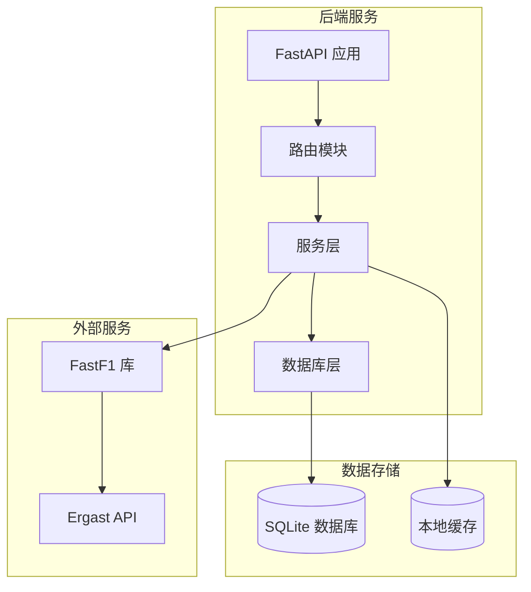
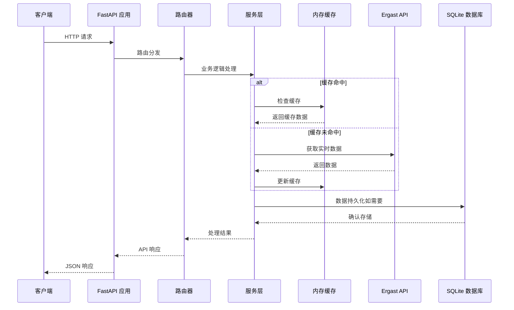
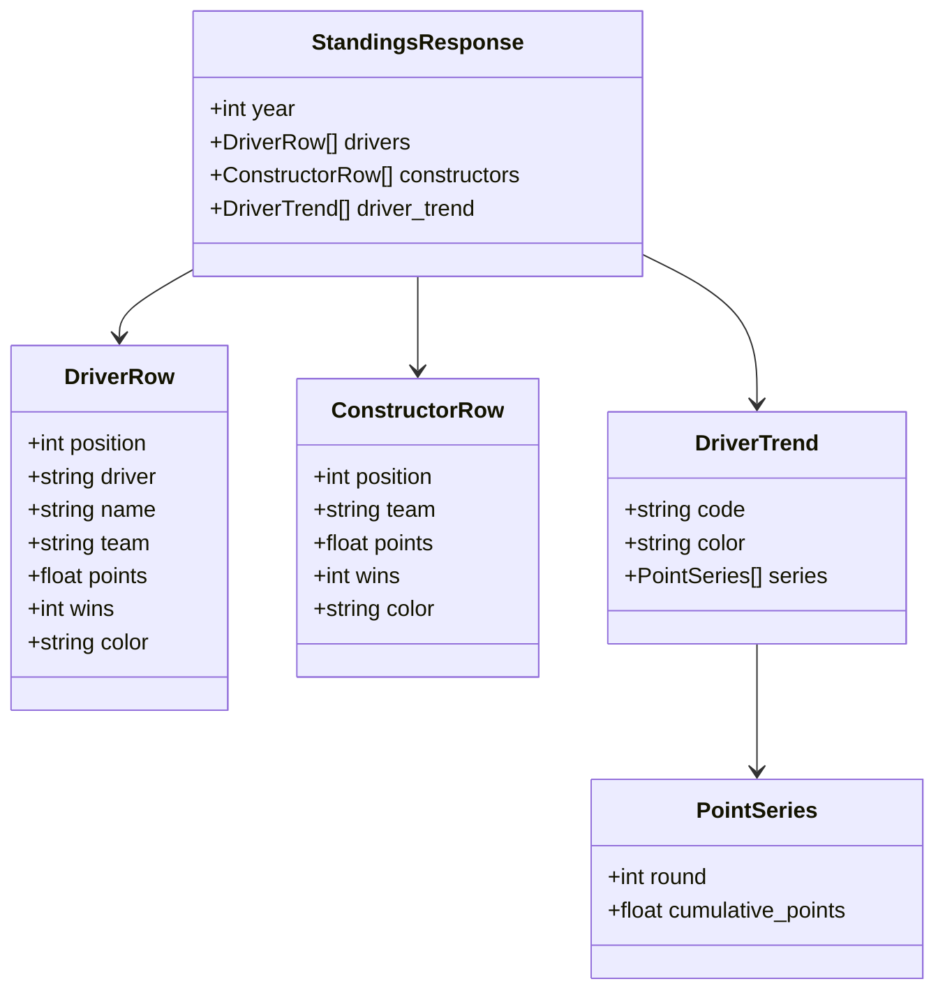
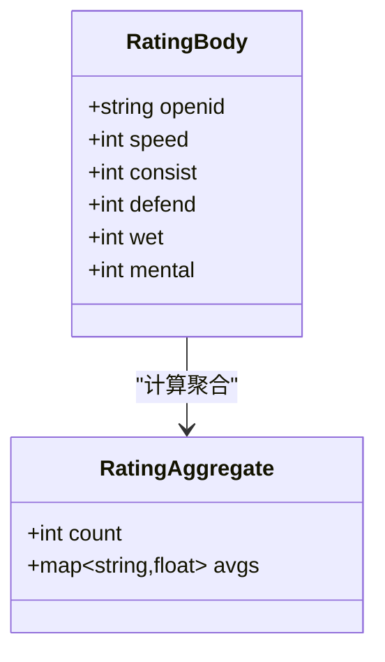
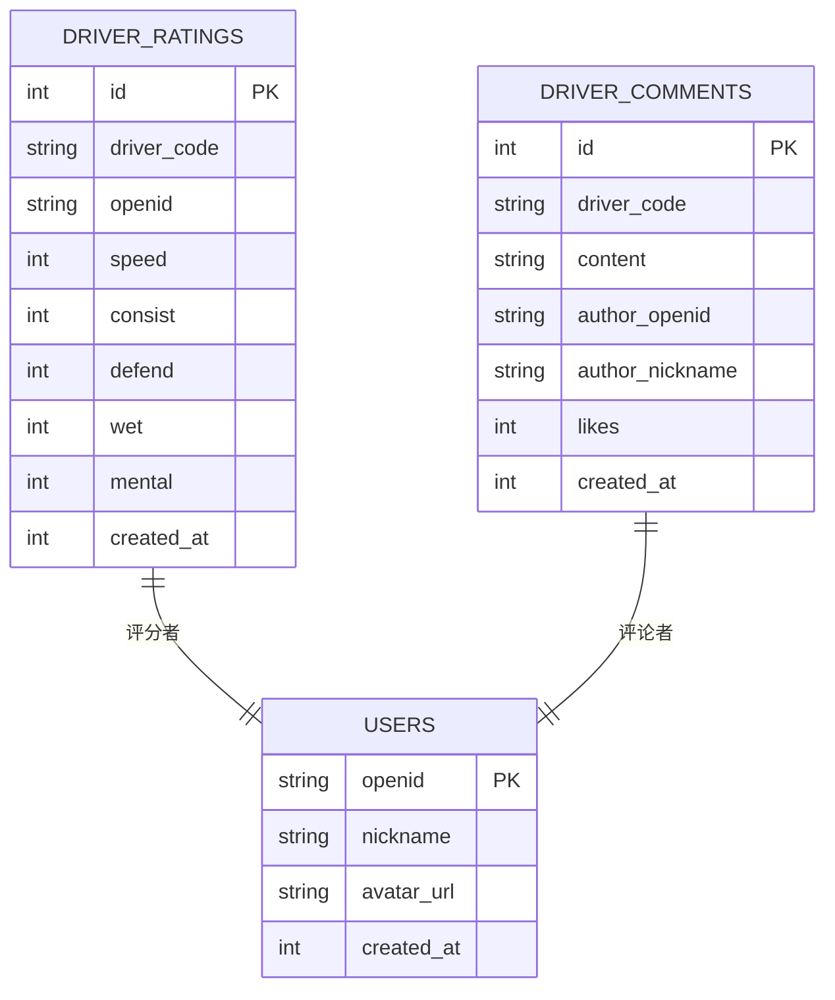
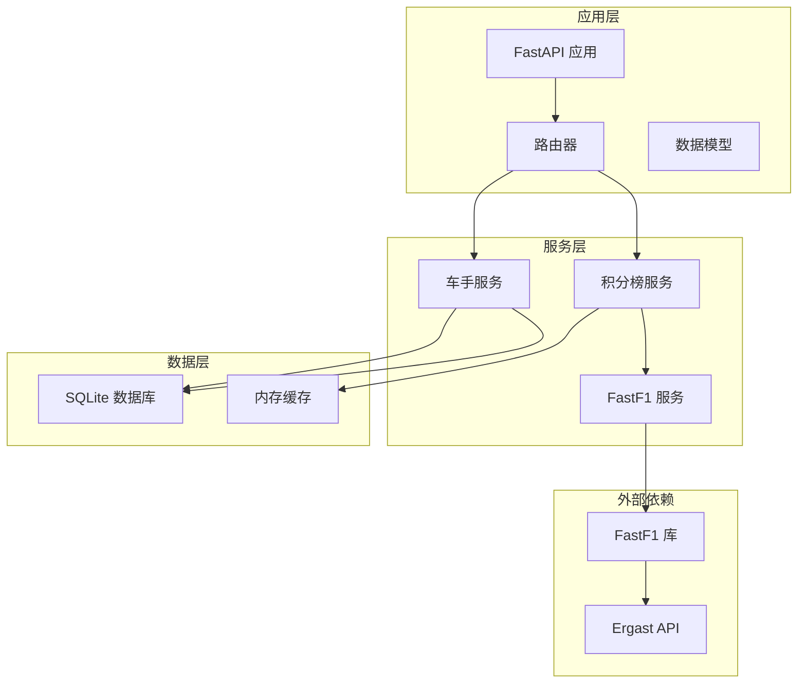

# 车手积分 API

<cite>
**本文档引用的文件**
- [backend/routers/standings.py](file://backend/routers/standings.py)
- [backend/routers/driver.py](file://backend/routers/driver.py)
- [backend/db/database.py](file://backend/db/database.py)
- [backend/main.py](file://backend/main.py)
- [fastf1/ergast/interface.py](file://fastf1/ergast/interface.py)
- [fastf1/ergast/structure.py](file://fastf1/ergast/structure.py)
- [backend/models/response.py](file://backend/models/response.py)
</cite>

## 目录
1. [简介](#简介)
2. [项目结构](#项目结构)
3. [核心组件](#核心组件)
4. [架构概览](#架构概览)
5. [详细组件分析](#详细组件分析)
6. [依赖关系分析](#依赖关系分析)
7. [性能考虑](#性能考虑)
8. [故障排除指南](#故障排除指南)
9. [结论](#结论)

## 简介

本文档详细记录了 Fast-F1 项目中的车手和积分榜 API 接口。该系统提供了完整的车手信息查询、积分榜计算、排名统计等功能，包括：

- **车手积分榜查询**：实时获取车手积分榜和车队积分榜
- **积分趋势分析**：前5名车手的积分累计趋势
- **车手社区功能**：车手评分和评论系统
- **历史数据查询**：基于 Ergast API 的历史数据获取

系统采用 FastAPI 构建，集成了 FastF1 库进行数据获取，并使用 SQLite 数据库存储社区功能数据。

## 项目结构

后端采用模块化设计，主要包含以下组件：

**图表来源**
- [backend/main.py:18-41](file://backend/main.py#L18-L41)
- [backend/routers/standings.py:1-145](file://backend/routers/standings.py#L1-L145)

**章节来源**
- [backend/main.py:18-41](file://backend/main.py#L18-L41)
- [backend/routers/standings.py:1-145](file://backend/routers/standings.py#L1-L145)

## 核心组件

### 积分榜服务 (Standings Service)

积分榜服务是系统的核心组件，负责从 Ergast API 获取实时 F1 数据并进行处理：

- **并行数据获取**：同时获取车手积分榜、车队积分榜和比赛结果
- **内存缓存**：2小时TTL的内存缓存机制
- **积分趋势计算**：为前5名车手计算每轮累计积分
- **颜色映射**：为车队分配官方配色

### 车手社区服务 (Driver Community Service)

提供车手相关的社区功能：

- **评分系统**：支持5个维度的评分（单圈速度、稳定性、防守、雨战、心理素质）
- **评论系统**：用户评论和点赞功能
- **数据持久化**：使用 SQLite 存储评分和评论数据

### API 响应模型

统一的响应格式，确保 API 的一致性和可预测性。

**章节来源**
- [backend/routers/standings.py:51-145](file://backend/routers/standings.py#L51-L145)
- [backend/routers/driver.py:1-116](file://backend/routers/driver.py#L1-L116)
- [backend/db/database.py:1320-1416](file://backend/db/database.py#L1320-L1416)
- [backend/models/response.py:1-14](file://backend/models/response.py#L1-L14)

## 架构概览

系统采用分层架构设计，确保关注点分离和代码可维护性：

**图表来源**
- [backend/main.py:117-136](file://backend/main.py#L117-L136)
- [backend/routers/standings.py:64-145](file://backend/routers/standings.py#L64-L145)
- [backend/db/database.py:13-19](file://backend/db/database.py#L13-L19)

**章节来源**
- [backend/main.py:117-136](file://backend/main.py#L117-L136)
- [backend/routers/standings.py:32-42](file://backend/routers/standings.py#L32-L42)

## 详细组件分析

### 积分榜 API 组件

#### 接口定义

| 方法 | 路径 | 功能描述 |
|------|------|----------|
| GET | `/standings` | 获取指定年份的积分榜数据 |
| GET | `/standings/{year}` | 获取指定年份的积分榜数据 |

#### 数据结构

积分榜响应包含以下主要字段：

**图表来源**
- [backend/routers/standings.py:74-139](file://backend/routers/standings.py#L74-L139)

#### 积分计算规则

系统使用 Ergast API 提供的原始积分数据，遵循标准 F1 积分规则：

- **车手积分榜**：基于车手在整个赛季中的累计积分
- **车队积分榜**：基于车队两辆赛车积分的总和
- **排名规则**：积分多者排名靠前，积分相同时按获胜次数排序

**章节来源**
- [backend/routers/standings.py:64-145](file://backend/routers/standings.py#L64-L145)

### 车手社区 API 组件

#### 评分系统

| 方法 | 路径 | 功能描述 |
|------|------|----------|
| GET | `/driver/{code}/rating` | 获取车手评分聚合和用户个人评分 |
| POST | `/driver/{code}/rating` | 提交或更新车手评分 |

评分维度定义：

**图表来源**
- [backend/routers/driver.py:35-42](file://backend/routers/driver.py#L35-L42)
- [backend/db/database.py:1396-1414](file://backend/db/database.py#L1396-L1414)

#### 评论系统

| 方法 | 路径 | 功能描述 |
|------|------|----------|
| GET | `/driver/{code}/comments` | 获取车手评论列表（支持分页） |
| POST | `/driver/{code}/comments` | 为车手发表评论 |
| POST | `/driver/comments/{comment_id}/like` | 为评论点赞 |

**章节来源**
- [backend/routers/driver.py:44-116](file://backend/routers/driver.py#L44-L116)
- [backend/db/database.py:1323-1361](file://backend/db/database.py#L1323-L1361)

### 数据库设计

#### 评分表结构

**图表来源**
- [backend/db/database.py:134-158](file://backend/db/database.py#L134-L158)

**章节来源**
- [backend/db/database.py:134-158](file://backend/db/database.py#L134-L158)

## 依赖关系分析

系统依赖关系清晰，遵循单一职责原则：

**图表来源**
- [backend/main.py:1-157](file://backend/main.py#L1-L157)
- [backend/routers/standings.py:1-9](file://backend/routers/standings.py#L1-L9)
- [backend/routers/driver.py:1-19](file://backend/routers/driver.py#L1-L19)

**章节来源**
- [backend/main.py:1-157](file://backend/main.py#L1-L157)
- [fastf1/ergast/interface.py:401-430](file://fastf1/ergast/interface.py#L401-L430)

## 性能考虑

### 缓存策略

系统实现了多层次的缓存机制：

1. **内存缓存**：积分榜数据缓存2小时（7200秒）
2. **进程级缓存**：FastF1 Session 数据缓存
3. **数据库连接池**：SQLite WAL 模式提高并发性能

### 异步处理

- **并行数据获取**：使用 ThreadPoolExecutor 同时获取多个 Ergast API 数据
- **后台预热**：启动时预加载常用数据

### 数据库优化

- **索引优化**：为常用查询字段建立索引
- **WAL 模式**：提高并发写入性能
- **事务管理**：合理使用事务确保数据一致性

**章节来源**
- [backend/routers/standings.py:27-42](file://backend/routers/standings.py#L27-L42)
- [backend/db/database.py:13-19](file://backend/db/database.py#L13-L19)

## 故障排除指南

### 常见问题及解决方案

#### 1. 数据获取失败

**症状**：API 返回错误信息
**原因**：Ergast API 临时不可用或网络问题
**解决方案**：
- 检查网络连接
- 查看服务端日志
- 系统会自动重试和缓存机制

#### 2. 评分提交失败

**症状**：评分提交返回错误
**原因**：评分值超出范围或用户未注册
**解决方案**：
- 确保评分值在1-5范围内
- 先在论坛注册昵称
- 检查 openid 是否正确

#### 3. 缓存数据陈旧

**症状**：显示的积分数据不是最新
**原因**：缓存TTL为2小时
**解决方案**：
- 等待缓存自动刷新
- 重启服务触发缓存更新

**章节来源**
- [backend/routers/standings.py:143-145](file://backend/routers/standings.py#L143-L145)
- [backend/routers/driver.py:106-108](file://backend/routers/driver.py#L106-L108)

## 结论

Fast-F1 的车手和积分榜 API 系统提供了完整、高效的 F1 数据服务。系统具有以下特点：

1. **高性能**：多层缓存和并行处理机制
2. **可扩展**：模块化设计便于功能扩展
3. **可靠**：完善的错误处理和数据验证
4. **易用**：标准化的 API 接口和响应格式

该系统为 F1 赛事数据的实时获取和展示提供了坚实的技术基础，支持各种应用场景的需求。