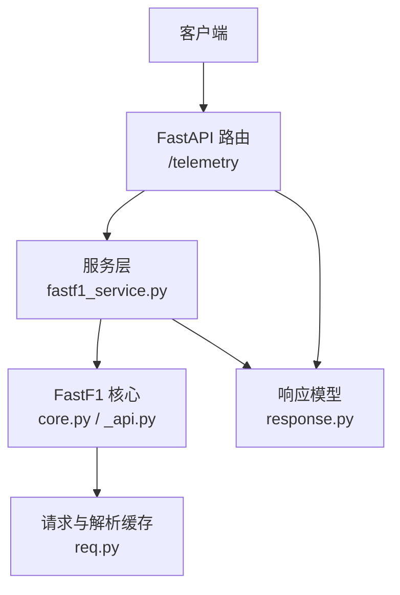
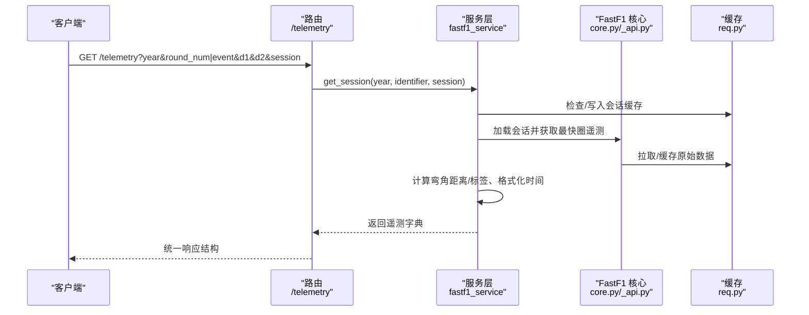
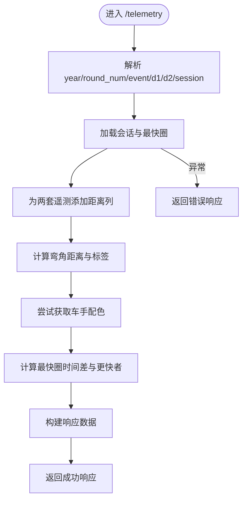
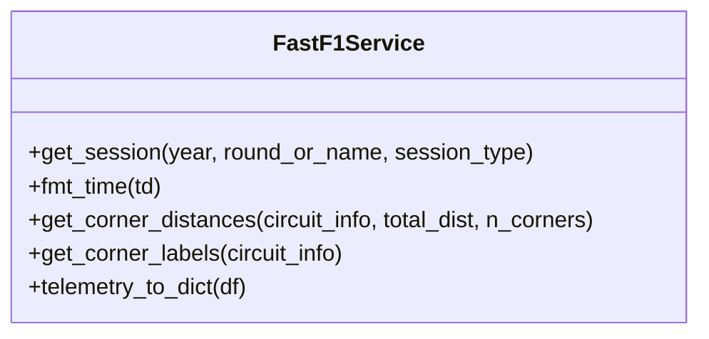
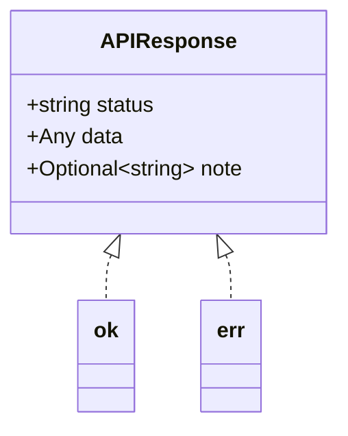
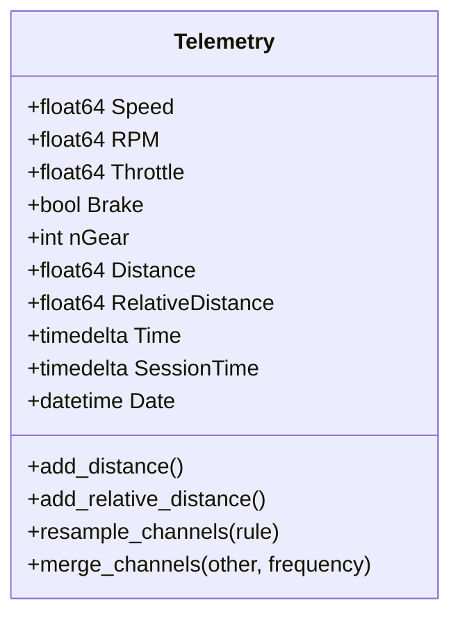
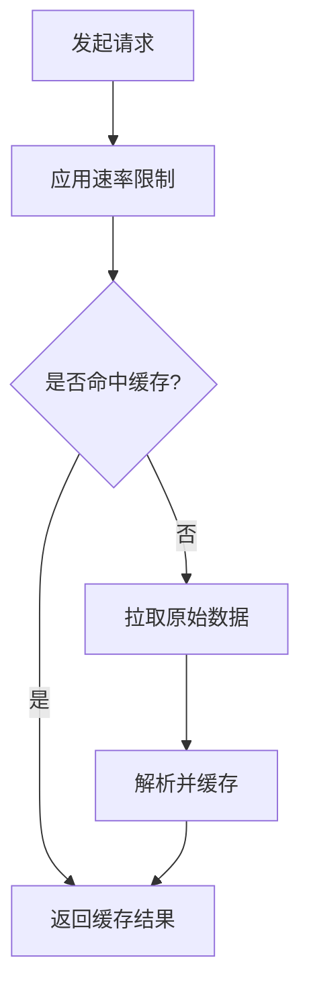
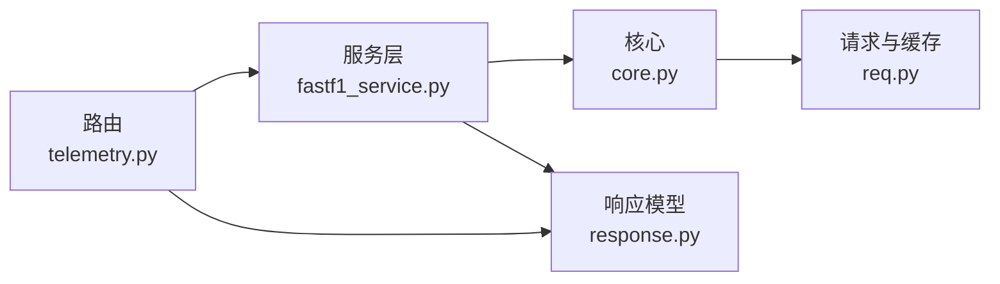

# 遥测 API

<cite>
**本文引用的文件**   
- [backend/routers/telemetry.py](file://backend/routers/telemetry.py)
- [backend/services/fastf1_service.py](file://backend/services/fastf1_service.py)
- [backend/models/response.py](file://backend/models/response.py)
- [fastf1/core.py](file://fastf1/core.py)
- [fastf1/_api.py](file://fastf1/_api.py)
- [fastf1/req.py](file://fastf1/req.py)
- [examples/telemetry/plot_speed_traces.py](file://examples/telemetry/plot_speed_traces.py)
- [examples/telemetry/plot_annotate_speed_trace.py](file://examples/telemetry/plot_annotate_speed_trace.py)
- [docs/api_reference/telemetry.rst](file://docs/api_reference/telemetry.rst)
- [fastf1/tests/test_telemetry.py](file://fastf1/tests/test_telemetry.py)
</cite>

## 目录
1. [简介](#简介)
2. [项目结构](#项目结构)
3. [核心组件](#核心组件)
4. [架构总览](#架构总览)
5. [详细组件分析](#详细组件分析)
6. [依赖分析](#依赖分析)
7. [性能考量](#性能考量)
8. [故障排查指南](#故障排查指南)
9. [结论](#结论)
10. [附录](#附录)

## 简介
本文件为“遥测数据 API”的权威文档，聚焦于后端 FastAPI 路由与服务层如何对接 FastF1 库，提供以下能力：
- 实时/历史遥测：获取指定车手最快圈的遥测数据（含速度、档位、油门、刹车等）
- 车手对比：在同一张图上叠加两位车手的最快圈速度曲线
- 速度分析：基于弯角标注的速度轨迹可视化
- 数据格式：以可序列化的字典形式返回，包含距离、速度、油门、刹车、档位等字段
- 时间范围与采样频率：原始频率或按固定采样率重采样；支持添加相对/绝对距离列
- 缓存与性能：进程内会话缓存、请求级缓存与速率限制，降低重复请求与外部 API 压力

## 项目结构
与遥测 API 直接相关的模块分布如下：
- 后端路由层：定义 HTTP 接口与请求参数解析
- 服务层：封装 FastF1 会话加载、遥测转换与辅助计算
- 模型层：统一响应结构体
- FastF1 核心：遥测对象、数据类型、重采样与距离列计算
- 请求与缓存：速率限制、请求缓存与解析缓存
- 示例与测试：展示典型用法与验证遥测数据结构

**图表来源**
- [backend/routers/telemetry.py:1-79](file://backend/routers/telemetry.py#L1-L79)
- [backend/services/fastf1_service.py:1-64](file://backend/services/fastf1_service.py#L1-L64)
- [backend/models/response.py:1-14](file://backend/models/response.py#L1-L14)
- [fastf1/core.py:64-200](file://fastf1/core.py#L64-L200)
- [fastf1/_api.py:1-120](file://fastf1/_api.py#L1-L120)
- [fastf1/req.py:132-200](file://fastf1/req.py#L132-L200)

**章节来源**
- [backend/routers/telemetry.py:1-79](file://backend/routers/telemetry.py#L1-L79)
- [backend/services/fastf1_service.py:1-64](file://backend/services/fastf1_service.py#L1-L64)
- [backend/models/response.py:1-14](file://backend/models/response.py#L1-L14)
- [fastf1/core.py:64-200](file://fastf1/core.py#L64-L200)
- [fastf1/_api.py:1-120](file://fastf1/_api.py#L1-L120)
- [fastf1/req.py:132-200](file://fastf1/req.py#L132-L200)

## 核心组件
- 路由器（/telemetry）：提供 GET 接口，接收年份、轮次或事件名、车手代号与会话类型，返回对比遥测与弯角信息
- 服务层：封装会话加载（进程内缓存）、时间格式化、弯角距离与标签计算、遥测到字典的序列化
- 响应模型：统一返回结构（状态、数据、备注），便于前端消费
- FastF1 遥测对象：提供多通道时间序列数据、重采样、距离列计算等能力
- 请求与缓存：速率限制与缓存策略，提升性能并避免外部 API 限流

**章节来源**
- [backend/routers/telemetry.py:11-79](file://backend/routers/telemetry.py#L11-L79)
- [backend/services/fastf1_service.py:14-64](file://backend/services/fastf1_service.py#L14-L64)
- [backend/models/response.py:4-14](file://backend/models/response.py#L4-L14)
- [fastf1/core.py:64-200](file://fastf1/core.py#L64-L200)
- [fastf1/req.py:132-200](file://fastf1/req.py#L132-L200)

## 架构总览
下图展示了从客户端到 FastF1 的完整调用链路，以及关键数据在各层之间的流转。

**图表来源**
- [backend/routers/telemetry.py:11-79](file://backend/routers/telemetry.py#L11-L79)
- [backend/services/fastf1_service.py:14-21](file://backend/services/fastf1_service.py#L14-L21)
- [fastf1/core.py:64-200](file://fastf1/core.py#L64-L200)
- [fastf1/_api.py:185-248](file://fastf1/_api.py#L185-L248)
- [fastf1/req.py:115-130](file://fastf1/req.py#L115-L130)

## 详细组件分析

### 路由：GET /telemetry
- 功能：获取两位车手在指定会话中的最快圈遥测，并返回对比信息、弯角标注与遥测数据
- 请求参数
  - year：整数，年份，默认 2026
  - round_num：整数，轮次数（可选）
  - event：字符串，事件名称（可选，与轮次二选一）
  - d1/d2：字符串，两位车手代号，默认 ALB vs ALO
  - session：字符串，会话类型，默认 Q（排位赛）
- 处理流程要点
  - 选择轮次或事件标识符，加载会话并获取两位车手的最快圈
  - 读取车手数据并添加距离列，用于横向对比
  - 计算弯角距离与标签，用于速度图注释
  - 尝试获取车手配色，若失败则回退默认颜色
  - 计算两位车手最快圈时间差，生成“更快者”提示
  - 返回统一响应结构，包含车手信息、差距、弯角信息与遥测字典
- 错误处理：捕获异常并返回错误响应

**图表来源**
- [backend/routers/telemetry.py:11-79](file://backend/routers/telemetry.py#L11-L79)

**章节来源**
- [backend/routers/telemetry.py:11-79](file://backend/routers/telemetry.py#L11-L79)

### 服务层：会话加载与遥测转换
- 会话缓存：进程内字典缓存，避免重复加载同一会话
- 时间格式化：将 timedelta 转换为“分:秒.毫秒”字符串
- 弯角计算：当电路信息中弯角距离不可用时，按总距离等间距回退
- 遥测序列化：将 DataFrame 转为字典，处理 NaN（速度/油门填充 0，档位转整数，刹车布尔）

**图表来源**
- [backend/services/fastf1_service.py:14-64](file://backend/services/fastf1_service.py#L14-L64)

**章节来源**
- [backend/services/fastf1_service.py:14-64](file://backend/services/fastf1_service.py#L14-L64)

### 响应模型：统一结构
- 字段：status（ok/error）、data（任意结构）、note（可选提示）
- 工具函数：ok() 与 err() 快速构造响应

**图表来源**
- [backend/models/response.py:4-14](file://backend/models/response.py#L4-L14)

**章节来源**
- [backend/models/response.py:4-14](file://backend/models/response.py#L4-L14)

### FastF1 遥测对象与数据结构
- Telemetry 类：多通道时间序列数据，支持合并、重采样、添加距离/相对距离等
- 通道类型：连续/离散，不同插值方法
- 时间相关列：Time、SessionTime、Date；Distance、RelativeDistance 等派生列
- 频率：原生频率或指定采样率（如 10Hz）

**图表来源**
- [fastf1/core.py:64-200](file://fastf1/core.py#L64-L200)

**章节来源**
- [fastf1/core.py:64-200](file://fastf1/core.py#L64-L200)
- [docs/api_reference/telemetry.rst:1-13](file://docs/api_reference/telemetry.rst#L1-L13)

### 请求与缓存：速率限制与缓存策略
- 速率限制：最小请求间隔与每小时调用上限，防止触发外部 API 限流
- 缓存：两阶段缓存（原始请求缓存 + 解析后数据缓存），显著减少重复请求与解析开销
- 缓存目录：可通过环境变量或显式配置设置

**图表来源**
- [fastf1/req.py:83-130](file://fastf1/req.py#L83-L130)
- [fastf1/req.py:132-200](file://fastf1/req.py#L132-L200)

**章节来源**
- [fastf1/req.py:83-130](file://fastf1/req.py#L83-L130)
- [fastf1/req.py:132-200](file://fastf1/req.py#L132-L200)

### 示例与用法参考
- 速度叠加对比：展示两位车手最快圈速度曲线叠加
- 弯角标注：在速度曲线上标注弯角位置与编号
- 测试覆盖：验证遥测对象的切片、重采样、合并、距离列等行为

**章节来源**
- [examples/telemetry/plot_speed_traces.py:1-53](file://examples/telemetry/plot_speed_traces.py#L1-L53)
- [examples/telemetry/plot_annotate_speed_trace.py:1-69](file://examples/telemetry/plot_annotate_speed_trace.py#L1-L69)
- [fastf1/tests/test_telemetry.py:66-221](file://fastf1/tests/test_telemetry.py#L66-L221)

## 依赖分析
- 路由依赖服务层：通过 get_session、telemetry_to_dict 等函数完成数据准备
- 服务层依赖 FastF1 核心：会话加载、遥测对象、数据类型与重采样
- FastF1 核心依赖请求与缓存：原始数据拉取与缓存管理
- 响应模型被路由与服务层共同使用，保证输出一致性

**图表来源**
- [backend/routers/telemetry.py:1-79](file://backend/routers/telemetry.py#L1-L79)
- [backend/services/fastf1_service.py:1-64](file://backend/services/fastf1_service.py#L1-L64)
- [fastf1/core.py:64-200](file://fastf1/core.py#L64-L200)
- [fastf1/req.py:132-200](file://fastf1/req.py#L132-L200)
- [backend/models/response.py:1-14](file://backend/models/response.py#L1-L14)

**章节来源**
- [backend/routers/telemetry.py:1-79](file://backend/routers/telemetry.py#L1-L79)
- [backend/services/fastf1_service.py:1-64](file://backend/services/fastf1_service.py#L1-L64)
- [fastf1/core.py:64-200](file://fastf1/core.py#L64-L200)
- [fastf1/req.py:132-200](file://fastf1/req.py#L132-L200)
- [backend/models/response.py:1-14](file://backend/models/response.py#L1-L14)

## 性能考量
- 进程内会话缓存：同一进程内对相同会话只加载一次，避免重复 IO
- 请求级缓存：原始数据与解析后数据双缓存，显著降低网络与解析成本
- 速率限制：控制请求频率，避免触发外部 API 限流
- 重采样与派生列：按需进行重采样与距离列计算，避免不必要的高分辨率数据传输
- 建议
  - 合理设置采样率（如 10Hz），平衡精度与体积
  - 对历史数据优先使用缓存，减少实时请求
  - 批量请求时注意速率限制，避免集中访问

[本节为通用指导，无需特定文件来源]

## 故障排查指南
- 会话不可用：当外部 API 无数据或会话尚未开始时，抛出会话不可用异常
- 数据截断提示：若某车手遥测末尾距离明显小于总距离，返回“遥测截断”备注
- 配色获取失败：无法获取车手配色时回退默认颜色
- 响应结构：统一使用 status/data/note 结构，错误时 note 中包含异常信息

**章节来源**
- [backend/routers/telemetry.py:36-79](file://backend/routers/telemetry.py#L36-L79)
- [backend/models/response.py:9-14](file://backend/models/response.py#L9-L14)

## 结论
该遥测 API 通过清晰的路由、稳健的服务层与完善的缓存/限流机制，提供了稳定高效的遥测数据获取能力。其输出结构统一、扩展性强，既满足实时分析需求，也兼顾历史数据的高效复用。

[本节为总结性内容，无需特定文件来源]

## 附录

### 接口定义与示例
- 端点：GET /telemetry
- 查询参数
  - year：整数，年份（默认 2026）
  - round_num：整数，轮次数（可选）
  - event：字符串，事件名称（可选）
  - d1/d2：字符串，两位车手代号（默认 ALB/ALO）
  - session：字符串，会话类型（默认 Q）
- 成功响应字段
  - driver_a/driver_b：包含 code、team、color、lap_time
  - gap：字符串，表示两位车手最快圈时间差与更快者
  - corner_labels：弯角编号列表（如 T1、T2…）
  - corner_distances：对应弯角距离列表（米）
  - telemetry：以车手代号为键的遥测字典，包含 distance、speed、throttle、brake、gear
- 错误响应
  - status：error
  - data：null
  - note：错误信息字符串

**章节来源**
- [backend/routers/telemetry.py:11-79](file://backend/routers/telemetry.py#L11-L79)
- [backend/models/response.py:9-14](file://backend/models/response.py#L9-L14)

### 数据结构说明
- 遥测通道（示例）
  - distance：浮点数组，单位米
  - speed：浮点数组，单位 km/h
  - throttle：浮点数组，百分比
  - brake：布尔数组
  - gear：整型数组
- 时间列
  - Time：样本时间偏移（起始为 0）
  - SessionTime：会话起始时间偏移
  - Date：样本采集时间戳
- 派生列
  - Distance：累计行驶距离
  - RelativeDistance：相对距离（0~1）

**章节来源**
- [fastf1/core.py:64-200](file://fastf1/core.py#L64-L200)
- [fastf1/tests/test_telemetry.py:350-401](file://fastf1/tests/test_telemetry.py#L350-L401)

### 采样频率与时间范围
- 原始频率：保留原始采样率，适合高保真分析
- 固定采样率：如 10Hz，适合网络传输与可视化
- 时间范围：以会话时间与最快圈时间为准，支持按时间切片与重采样

**章节来源**
- [fastf1/core.py:150-153](file://fastf1/core.py#L150-L153)
- [fastf1/tests/test_telemetry.py:195-221](file://fastf1/tests/test_telemetry.py#L195-L221)

### 缓存与性能优化建议
- 启用并配置缓存目录，优先使用本地缓存
- 对相同查询进行去重与合并，减少重复请求
- 使用固定采样率与必要的数据清洗（如填充 NaN）降低体积
- 在批量场景中合理安排请求节奏，遵守速率限制

**章节来源**
- [fastf1/req.py:132-200](file://fastf1/req.py#L132-L200)