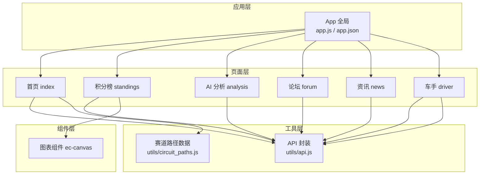
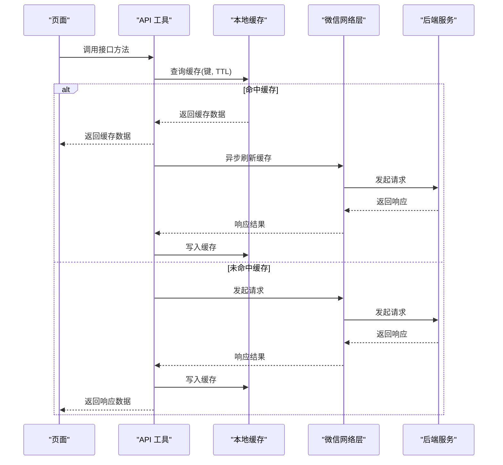
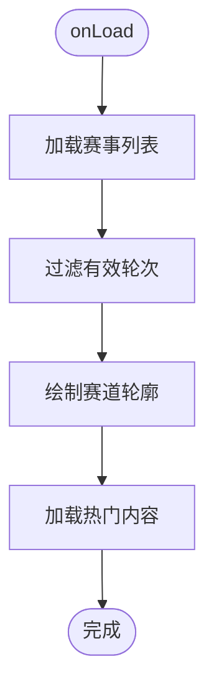
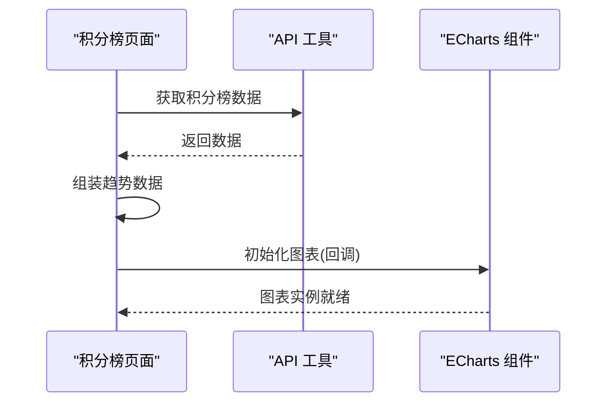
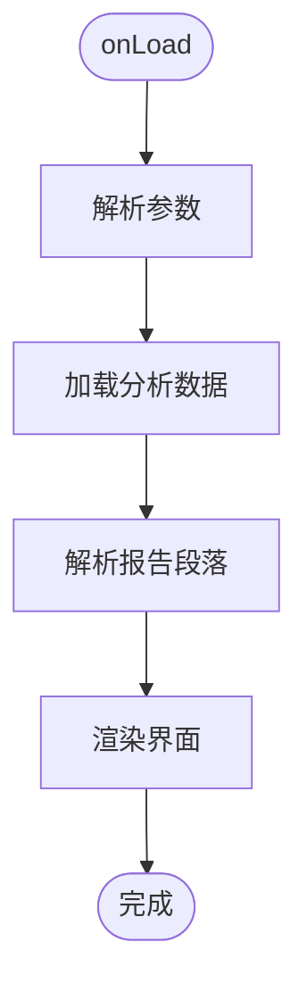
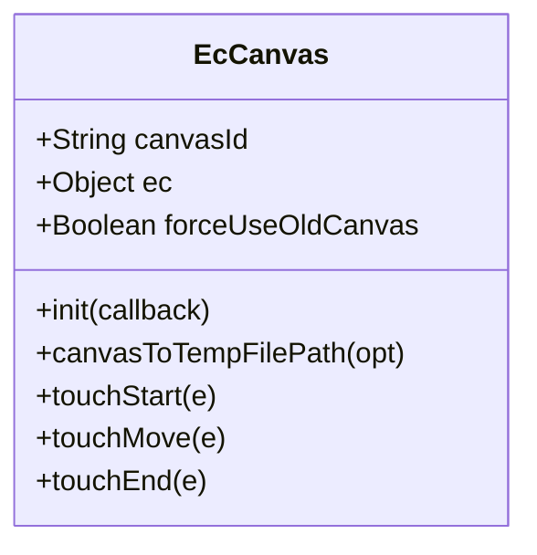
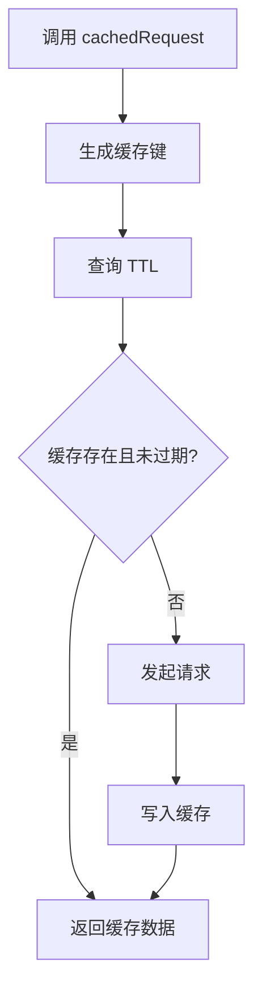
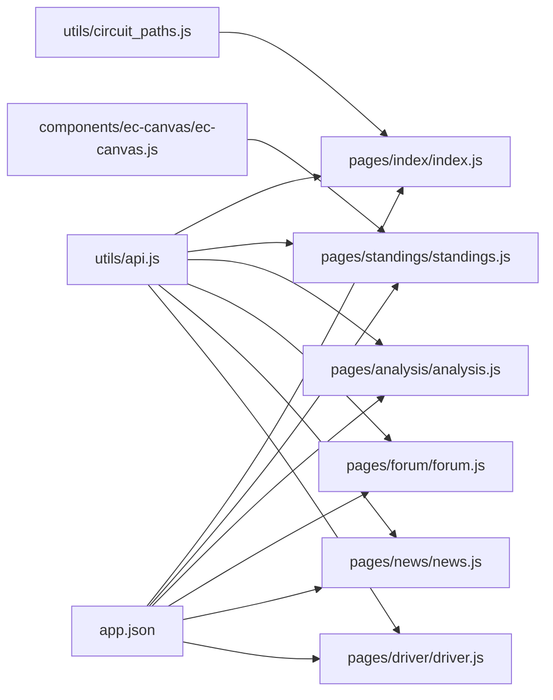

# 小程序 API

<cite>
**本文引用的文件**
- [miniprogram/app.js](file://miniprogram/app.js)
- [miniprogram/app.json](file://miniprogram/app.json)
- [miniprogram/utils/api.js](file://miniprogram/utils/api.js)
- [miniprogram/utils/circuit_paths.js](file://miniprogram/utils/circuit_paths.js)
- [miniprogram/components/ec-canvas/ec-canvas.js](file://miniprogram/components/ec-canvas/ec-canvas.js)
- [miniprogram/components/ec-canvas/ec-canvas.json](file://miniprogram/components/ec-canvas/ec-canvas.json)
- [miniprogram/pages/index/index.js](file://miniprogram/pages/index/index.js)
- [miniprogram/pages/standings/standings.js](file://miniprogram/pages/standings/standings.js)
- [miniprogram/pages/analysis/analysis.js](file://miniprogram/pages/analysis/analysis.js)
- [miniprogram/pages/forum/forum.js](file://miniprogram/pages/forum/forum.js)
- [miniprogram/pages/news/news.js](file://miniprogram/pages/news/news.js)
- [miniprogram/pages/driver/driver.js](file://miniprogram/pages/driver/driver.js)
- [miniprogram/project.config.json](file://miniprogram/project.config.json)
</cite>

## 目录
1. [简介](#简介)
2. [项目结构](#项目结构)
3. [核心组件](#核心组件)
4. [架构总览](#架构总览)
5. [详细组件分析](#详细组件分析)
6. [依赖关系分析](#依赖关系分析)
7. [性能考量](#性能考量)
8. [故障排查指南](#故障排查指南)
9. [结论](#结论)
10. [附录](#附录)

## 简介
本文件为 Fast-F1 微信小程序的 API 参考文档，覆盖页面 API、组件 API 与工具函数的完整接口规范。内容包括：
- 页面生命周期、数据绑定、事件处理与页面跳转
- 组件属性、事件与渲染机制
- 网络请求封装、缓存策略与错误处理
- 导航栏配置、tabBar 设置与样式定制
- 小程序特有能力与限制说明

## 项目结构
小程序采用按页面与功能模块划分的组织方式，核心目录如下：
- miniprogram/pages：页面级逻辑与视图
- miniprogram/utils：通用工具与 API 封装
- miniprogram/components：自定义组件（图表组件 ec-canvas）
- miniprogram/app.js、app.json：全局入口与应用配置
- project.config.json：项目构建与编译设置

**图表来源**
- [miniprogram/app.js:1-23](file://miniprogram/app.js#L1-L23)
- [miniprogram/app.json:1-72](file://miniprogram/app.json#L1-L72)
- [miniprogram/utils/api.js:1-299](file://miniprogram/utils/api.js#L1-L299)
- [miniprogram/utils/circuit_paths.js:1-119](file://miniprogram/utils/circuit_paths.js#L1-L119)
- [miniprogram/components/ec-canvas/ec-canvas.js:1-292](file://miniprogram/components/ec-canvas/ec-canvas.js#L1-L292)

**章节来源**
- [miniprogram/app.js:1-23](file://miniprogram/app.js#L1-L23)
- [miniprogram/app.json:1-72](file://miniprogram/app.json#L1-L72)
- [miniprogram/project.config.json:1-40](file://miniprogram/project.config.json#L1-L40)

## 核心组件
本节梳理小程序的关键组件与工具，明确其职责与对外接口。

- 应用全局
  - App 全局数据与生命周期：全局基础地址、当前年份；启动时欢迎提示与本地存储标记。
  - 应用配置：页面列表、窗口样式、导航栏、tabBar、深色模式、sitemap、懒加载等。

- API 工具
  - 请求封装：统一 GET/POST，超时控制、失败重试、响应校验。
  - 本地缓存：TTL 策略、键生成、读写封装。
  - 接口聚合：赛事、排位、单圈、遥测、积分榜、AI 分析、资讯、论坛、术语、管理员后台、车手评分与评论等。

- 图表组件 ec-canvas
  - 属性：canvasId、ec、forceUseOldCanvas
  - 方法：init、canvasToTempFilePath、触摸事件桥接
  - 行为：兼容新旧 Canvas 版本、动态选择渲染路径、事件透传

- 赛道路径数据
  - 提供各赛道 SVG 路径与 viewBox，供首页绘制赛道轮廓

**章节来源**
- [miniprogram/app.js:1-23](file://miniprogram/app.js#L1-L23)
- [miniprogram/app.json:1-72](file://miniprogram/app.json#L1-L72)
- [miniprogram/utils/api.js:1-299](file://miniprogram/utils/api.js#L1-L299)
- [miniprogram/utils/circuit_paths.js:1-119](file://miniprogram/utils/circuit_paths.js#L1-L119)
- [miniprogram/components/ec-canvas/ec-canvas.js:1-292](file://miniprogram/components/ec-canvas/ec-canvas.js#L1-L292)
- [miniprogram/components/ec-canvas/ec-canvas.json:1-4](file://miniprogram/components/ec-canvas/ec-canvas.json#L1-L4)

## 架构总览
小程序整体采用“页面 + 工具 + 组件”的分层架构：
- 页面负责业务流程与交互，通过 utils/api.js 调用后端接口
- 组件（如 ec-canvas）封装复杂渲染与事件处理
- 全局配置集中管理导航栏、tabBar、样式与权限

**图表来源**
- [miniprogram/utils/api.js:26-120](file://miniprogram/utils/api.js#L26-L120)

**章节来源**
- [miniprogram/utils/api.js:42-120](file://miniprogram/utils/api.js#L42-L120)

## 详细组件分析

### 页面 API 规范

#### 首页 index
- 生命周期
  - onLoad：加载年份数据、获取赛事列表、加载热门内容
  - onShow/onHide/onUnload：启动/停止倒计时
- 数据绑定
  - 年份、赛事列表、加载状态、错误信息、下一场赛事倒计时、热门帖子/新闻
- 事件处理
  - 赛事项点击：跳转至 event 页面
  - 资讯/帖子项点击：跳转详情页
  - 导航切换：跳转至论坛/资讯 tab
- 关键方法
  - loadEvents：获取赛事列表并绘制赛道轮廓
  - loadHotData：并发获取热门帖子与新闻
  - _drawAllCircuits：基于 utils/circuit_paths.js 的 SVG 路径绘制

**图表来源**
- [miniprogram/pages/index/index.js:125-136](file://miniprogram/pages/index/index.js#L125-L136)
- [miniprogram/pages/index/index.js:214-227](file://miniprogram/pages/index/index.js#L214-L227)
- [miniprogram/pages/index/index.js:175-212](file://miniprogram/pages/index/index.js#L175-L212)

**章节来源**
- [miniprogram/pages/index/index.js:92-255](file://miniprogram/pages/index/index.js#L92-L255)
- [miniprogram/utils/circuit_paths.js:6-119](file://miniprogram/utils/circuit_paths.js#L6-L119)

#### 积分榜 standings
- 生命周期
  - onLoad：接收年份参数，加载积分榜与趋势数据
- 数据绑定
  - 年份、驱动/车队列表、驱动趋势、趋势图初始化回调
- 事件处理
  - 标签切换：驱动/车队
  - 驱动项点击：跳转至 driver 页面
- 关键方法
  - loadStandings：获取积分榜与趋势
  - _initTrendChart：初始化 ECharts 图表

**图表来源**
- [miniprogram/pages/standings/standings.js:74-90](file://miniprogram/pages/standings/standings.js#L74-L90)
- [miniprogram/pages/standings/standings.js:103-122](file://miniprogram/pages/standings/standings.js#L103-L122)

**章节来源**
- [miniprogram/pages/standings/standings.js:54-123](file://miniprogram/pages/standings/standings.js#L54-L123)

#### AI 分析 analysis
- 生命周期
  - onLoad：接收年份、轮次、车手、会话参数，加载分析报告
- 数据绑定
  - 年份、轮次、车手、会话、加载状态、错误信息、报告内容、指标、缓存标志、折叠状态
- 事件处理
  - 折叠/展开报告段落
  - 刷新按钮：强制刷新分析
- 关键方法
  - loadAnalysis：支持强制刷新
  - parseReport：按标题拆分报告段落

**图表来源**
- [miniprogram/pages/analysis/analysis.js:25-54](file://miniprogram/pages/analysis/analysis.js#L25-L54)
- [miniprogram/pages/analysis/analysis.js:56-72](file://miniprogram/pages/analysis/analysis.js#L56-L72)

**章节来源**
- [miniprogram/pages/analysis/analysis.js:3-85](file://miniprogram/pages/analysis/analysis.js#L3-L85)

#### 论坛 forum
- 生命周期
  - onLoad：加载分区列表
  - onShow：返回时刷新综合讨论列表
- 数据绑定
  - 加载状态、错误信息、分区列表、综合讨论帖子、分页与更多标志
- 事件处理
  - 标签切换：综合/车系/车队
  - 加载更多：滚动到底部触发
  - 跳转：发帖、分区详情、帖子详情
- 关键方法
  - loadSections：获取分区并分离综合讨论
  - loadGeneralPosts/loadGeneralMore：分页加载综合讨论

**章节来源**
- [miniprogram/pages/forum/forum.js:4-125](file://miniprogram/pages/forum/forum.js#L4-L125)

#### 资讯 news
- 生命周期
  - onLoad：支持按车队筛选与标题参数，设置导航栏标题
  - onShow：非筛选状态下同步分析状态
- 数据绑定
  - 加载状态、加载更多状态、错误信息、列表、页码、更多标志、搜索关键词、车队筛选
- 事件处理
  - 下拉刷新、上拉加载更多
  - 搜索输入（防抖 300ms）、确认、清空
  - 跳转：术语词典、详情页、返回
- 关键方法
  - loadNews/loadMore：分页加载
  - onSearchInput：防抖触发搜索

**章节来源**
- [miniprogram/pages/news/news.js:4-163](file://miniprogram/pages/news/news.js#L4-L163)

#### 车手 driver
- 生命周期
  - onLoad：接收车号、颜色、车队、积分等参数，设置导航栏标题，加载趋势、评分、评论
  - onShow：刷新用户登录状态
- 数据绑定
  - 车号、颜色、基础信息、赛季数据、评分维度、社区平均与我的评分、评论列表、分页与更多标志、草稿
- 事件处理
  - 评分星标选择、提交评分
  - 评论输入、发送、点赞
  - 加载更多评论、跳转注册页
- 关键方法
  - _loadRating/_renderCommunity：评分加载与渲染
  - _loadComments/_loadComments：评论加载与分页
  - _initUser：初始化用户态

**章节来源**
- [miniprogram/pages/driver/driver.js:273-469](file://miniprogram/pages/driver/driver.js#L273-L469)

### 组件 API 规范

#### ec-canvas 组件
- 属性
  - canvasId：画布 ID，默认值
  - ec：图表配置对象
  - forceUseOldCanvas：是否强制使用旧版 Canvas
- 方法
  - init：初始化图表，兼容新旧 Canvas 版本
  - canvasToTempFilePath：导出图片
  - 触摸事件桥接：touchStart/touchMove/touchEnd
- 行为
  - 自动检测基础库版本，选择渲染路径
  - 注册预处理器禁用渐进渲染
  - 事件透传至 ECharts ZRender

**图表来源**
- [miniprogram/components/ec-canvas/ec-canvas.js:31-282](file://miniprogram/components/ec-canvas/ec-canvas.js#L31-L282)

**章节来源**
- [miniprogram/components/ec-canvas/ec-canvas.js:1-292](file://miniprogram/components/ec-canvas/ec-canvas.js#L1-L292)
- [miniprogram/components/ec-canvas/ec-canvas.json:1-4](file://miniprogram/components/ec-canvas/ec-canvas.json#L1-L4)

### 工具函数 API 规范

#### API 工具（utils/api.js）
- 缓存策略
  - TTL：不同接口设定不同缓存时长
  - 键生成：路径 + 参数排序拼接
  - 读取/写入：带时间戳的结构化存储
- 请求封装
  - _doRequest：统一 wx.request，超时 20s，失败重试一次
  - request/post：GET/POST 封装，自动重试
- 接口聚合
  - 赛事、排位、单圈、遥测、积分榜、AI 分析、资讯、论坛、术语、管理员后台、车手评分与评论等
  - cachedRequest：带缓存与后台刷新的请求
  - 强制刷新：移除缓存键后直连后端

**图表来源**
- [miniprogram/utils/api.js:98-120](file://miniprogram/utils/api.js#L98-L120)
- [miniprogram/utils/api.js:122-299](file://miniprogram/utils/api.js#L122-L299)

**章节来源**
- [miniprogram/utils/api.js:1-299](file://miniprogram/utils/api.js#L1-L299)

## 依赖关系分析
- 页面对工具的依赖：所有页面均通过 require 引入 utils/api.js
- 页面对组件的依赖：积分榜页面使用 ec-canvas 组件
- 页面对数据的依赖：首页依赖 utils/circuit_paths.js 进行 SVG 绘制
- 全局配置对页面的依赖：app.json 中声明页面列表与 tabBar

**图表来源**
- [miniprogram/utils/api.js:1-299](file://miniprogram/utils/api.js#L1-L299)
- [miniprogram/pages/index/index.js:1-255](file://miniprogram/pages/index/index.js#L1-L255)
- [miniprogram/pages/standings/standings.js:1-123](file://miniprogram/pages/standings/standings.js#L1-L123)
- [miniprogram/pages/analysis/analysis.js:1-85](file://miniprogram/pages/analysis/analysis.js#L1-L85)
- [miniprogram/pages/forum/forum.js:1-125](file://miniprogram/pages/forum/forum.js#L1-L125)
- [miniprogram/pages/news/news.js:1-163](file://miniprogram/pages/news/news.js#L1-L163)
- [miniprogram/pages/driver/driver.js:1-469](file://miniprogram/pages/driver/driver.js#L1-L469)
- [miniprogram/app.json:1-72](file://miniprogram/app.json#L1-L72)

**章节来源**
- [miniprogram/app.json:1-72](file://miniprogram/app.json#L1-L72)

## 性能考量
- 缓存策略
  - 不同接口设置不同 TTL，平衡实时性与性能
  - 命中缓存后异步刷新，保证首屏速度
- 网络请求
  - 统一超时与失败重试，提升稳定性
  - GET/POST 统一封装，减少重复代码
- 图表渲染
  - ec-canvas 自动选择新旧 Canvas 渲染路径，避免兼容问题
  - 禁用渐进渲染，降低复杂场景下的开销
- 页面绘制
  - 首页 SVG 路径绘制在下一帧执行，避免阻塞主线程

[本节为通用指导，无需特定文件来源]

## 故障排查指南
- 网络请求失败
  - 检查 BASE_URL 是否可达，确认后端服务状态
  - 查看请求日志与错误信息，确认重试机制是否生效
- 缓存异常
  - 检查缓存键生成规则与 TTL 设置
  - 必要时手动清理对应缓存键
- 图表渲染问题
  - 确认基础库版本满足要求
  - 检查 ec-canvas 初始化回调是否正确传入
- 页面跳转与参数传递
  - 确保参数编码/解码一致，避免中文乱码
  - 检查 app.json 中页面路径是否正确

**章节来源**
- [miniprogram/utils/api.js:42-85](file://miniprogram/utils/api.js#L42-L85)
- [miniprogram/components/ec-canvas/ec-canvas.js:80-111](file://miniprogram/components/ec-canvas/ec-canvas.js#L80-L111)

## 结论
本文件系统性梳理了 Fast-F1 小程序的页面、组件与工具函数 API，明确了生命周期、数据绑定、事件处理与网络请求封装机制，并提供了缓存策略与性能优化建议。开发者可据此快速集成与扩展功能，同时遵循小程序的限制与最佳实践。

[本节为总结性内容，无需特定文件来源]

## 附录

### 页面生命周期与事件映射
- 页面生命周期
  - onLoad：页面初始化
  - onShow：页面显示
  - onHide：页面隐藏
  - onUnload：页面卸载
- 事件处理
  - 用户点击：tap/click
  - 滚动事件：scroll-view 的滚动到底部
  - 下拉刷新：onPullDownRefresh
  - 上拉加载：onReachBottom

**章节来源**
- [miniprogram/pages/index/index.js:92-124](file://miniprogram/pages/index/index.js#L92-L124)
- [miniprogram/pages/news/news.js:49-56](file://miniprogram/pages/news/news.js#L49-L56)

### 导航栏与 tabBar 配置
- 导航栏
  - 导航栏背景色、文字色、标题文本
- tabBar
  - 颜色、选中色、背景色、边框样式
  - 列表项：pagePath、text、图标路径、选中图标路径

**章节来源**
- [miniprogram/app.json:22-66](file://miniprogram/app.json#L22-L66)

### 小程序特有能力与限制
- 基础库版本
  - 组件对基础库版本有最低要求，需满足 Canvas 与相关 API
- 构建与编译
  - 项目配置启用压缩、最小化与源码映射，便于调试与发布

**章节来源**
- [miniprogram/components/ec-canvas/ec-canvas.js:80-111](file://miniprogram/components/ec-canvas/ec-canvas.js#L80-L111)
- [miniprogram/project.config.json:1-40](file://miniprogram/project.config.json#L1-L40)