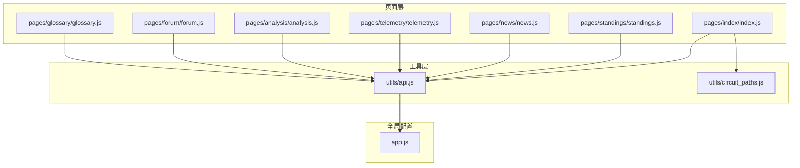
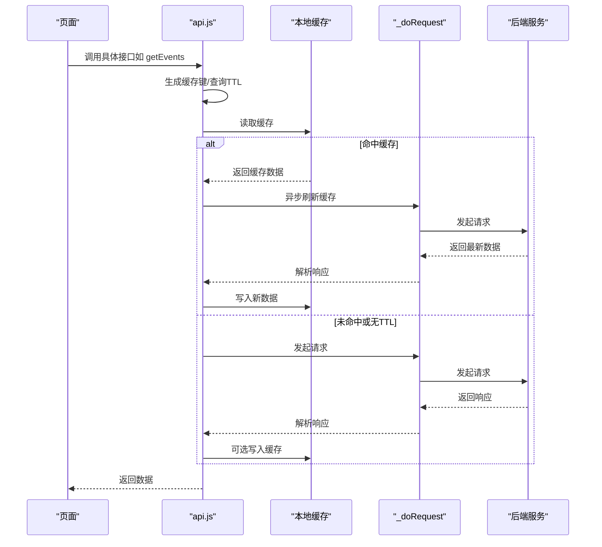
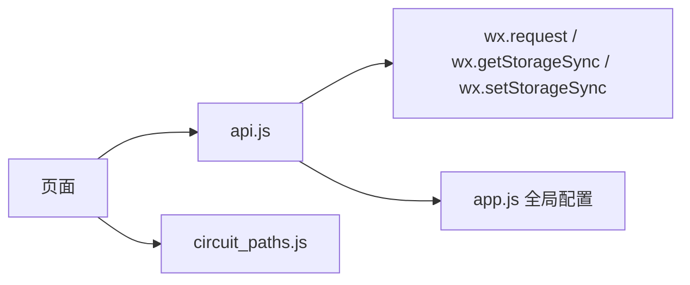
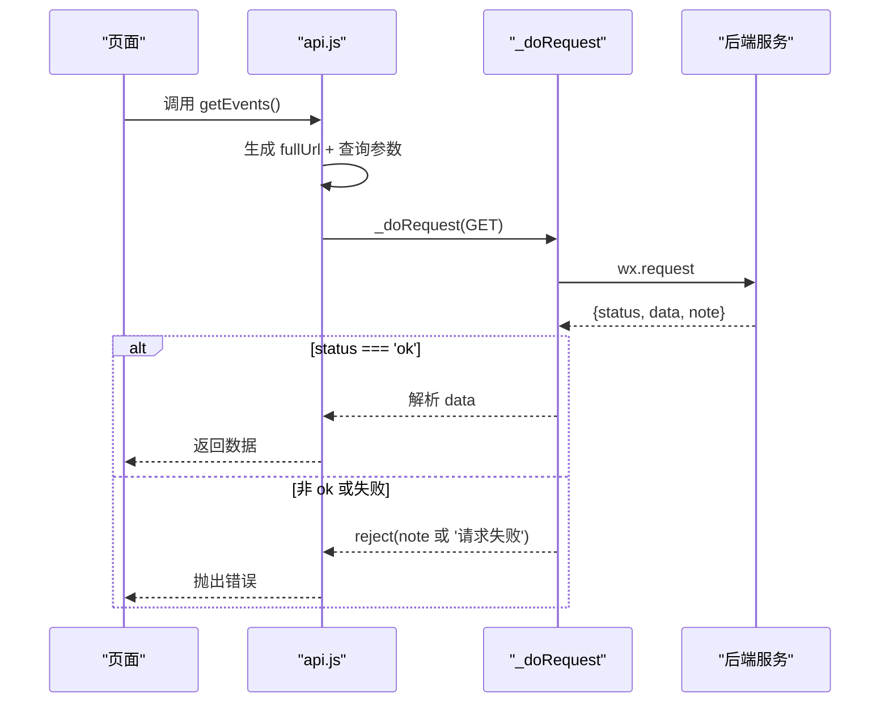
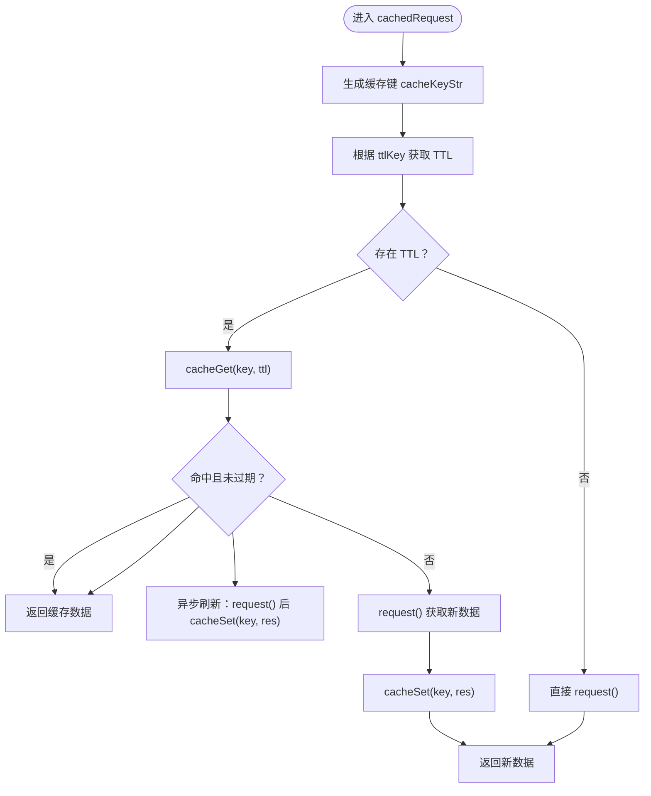

# 工具函数 API

<cite>
**本文档引用的文件**
- [miniprogram/utils/api.js](file://miniprogram/utils/api.js)
- [miniprogram/utils/circuit_paths.js](file://miniprogram/utils/circuit_paths.js)
- [miniprogram/app.js](file://miniprogram/app.js)
- [miniprogram/pages/index/index.js](file://miniprogram/pages/index/index.js)
- [miniprogram/pages/standings/standings.js](file://miniprogram/pages/standings/standings.js)
- [miniprogram/pages/news/news.js](file://miniprogram/pages/news/news.js)
- [miniprogram/pages/telemetry/telemetry.js](file://miniprogram/pages/telemetry/telemetry.js)
- [miniprogram/pages/analysis/analysis.js](file://miniprogram/pages/analysis/analysis.js)
- [miniprogram/pages/forum/forum.js](file://miniprogram/pages/forum/forum.js)
- [miniprogram/pages/glossary/glossary.js](file://miniprogram/pages/glossary/glossary.js)
</cite>

## 目录
1. [简介](#简介)
2. [项目结构](#项目结构)
3. [核心组件](#核心组件)
4. [架构总览](#架构总览)
5. [详细组件分析](#详细组件分析)
6. [依赖关系分析](#依赖关系分析)
7. [性能考量](#性能考量)
8. [故障排查指南](#故障排查指南)
9. [结论](#结论)
10. [附录](#附录)

## 简介
本文件面向 Fast-F1 微信小程序的前端开发者，系统性梳理并文档化工具函数 API，涵盖以下方面：
- API 请求封装与缓存策略
- 数据格式化与时间处理
- 字符串与路径处理
- 电路路径数据与可视化
- 错误处理与性能优化建议
- 常见使用场景与最佳实践

该工具函数位于 miniprogram/utils 目录，主要通过统一的请求模块与全局配置，为各页面提供稳定的数据获取能力。

## 项目结构
小程序采用分层结构：页面层负责交互与展示；工具层提供通用 API 与数据处理；全局配置提供基础环境变量。

图表来源
- [miniprogram/pages/index/index.js:1-255](file://miniprogram/pages/index/index.js#L1-L255)
- [miniprogram/pages/standings/standings.js:1-123](file://miniprogram/pages/standings/standings.js#L1-L123)
- [miniprogram/pages/news/news.js:1-163](file://miniprogram/pages/news/news.js#L1-L163)
- [miniprogram/pages/telemetry/telemetry.js:1-156](file://miniprogram/pages/telemetry/telemetry.js#L1-L156)
- [miniprogram/pages/analysis/analysis.js:1-85](file://miniprogram/pages/analysis/analysis.js#L1-L85)
- [miniprogram/pages/forum/forum.js:1-125](file://miniprogram/pages/forum/forum.js#L1-L125)
- [miniprogram/pages/glossary/glossary.js:1-147](file://miniprogram/pages/glossary/glossary.js#L1-L147)
- [miniprogram/utils/api.js:1-299](file://miniprogram/utils/api.js#L1-L299)
- [miniprogram/utils/circuit_paths.js:1-119](file://miniprogram/utils/circuit_paths.js#L1-L119)
- [miniprogram/app.js:1-23](file://miniprogram/app.js#L1-L23)

章节来源
- [miniprogram/utils/api.js:1-299](file://miniprogram/utils/api.js#L1-L299)
- [miniprogram/utils/circuit_paths.js:1-119](file://miniprogram/utils/circuit_paths.js#L1-L119)
- [miniprogram/app.js:1-23](file://miniprogram/app.js#L1-L23)

## 核心组件
本节聚焦工具函数 API 的核心能力与接口规范，包括请求封装、缓存策略、数据格式化与时间处理、字符串与路径处理、电路路径数据等。

- 请求封装与缓存
  - 统一请求方法：支持 GET/POST，内置超时与失败重试逻辑
  - 本地缓存：基于 TTL 的缓存键生成与读写，支持“命中即返回、后台静默刷新”
  - 管理员鉴权：统一管理员 Token 头部注入
- 数据格式化与时间处理
  - UTC 时间转北京时间显示
  - 距离目标时间的倒计时字符串
  - Markdown 报告按标题拆分
- 字符串与路径处理
  - SVG 路径解析：将 d 字符串解析为点序列
  - 图形缩放与平移：将点集适配到画布尺寸
- 电路路径数据
  - 提供多条 F1 电路的 SVG 路径与 viewBox
  - 页面侧用于绘制电路图

章节来源
- [miniprogram/utils/api.js:1-299](file://miniprogram/utils/api.js#L1-L299)
- [miniprogram/pages/index/index.js:32-90](file://miniprogram/pages/index/index.js#L32-L90)
- [miniprogram/utils/circuit_paths.js:1-119](file://miniprogram/utils/circuit_paths.js#L1-L119)

## 架构总览
工具函数 API 的调用链路如下：页面通过 require 引入 api 对象，调用具体接口；api 内部组合全局 BASE_URL、缓存键、TTL、请求头等，最终通过封装的 _doRequest 发起网络请求，并对响应进行统一校验与返回。

图表来源
- [miniprogram/utils/api.js:17-120](file://miniprogram/utils/api.js#L17-L120)

章节来源
- [miniprogram/utils/api.js:1-299](file://miniprogram/utils/api.js#L1-L299)

## 详细组件分析

### API 请求封装与缓存
- 统一请求方法
  - _doRequest(fullUrl, method, data, headers): Promise 化 wx.request，设置超时与失败重试
  - request(path, params, headers): GET 请求封装，自动拼接 BASE_URL 与查询参数
  - post(path, data, headers): POST 请求封装，自动注入 JSON Content-Type
- 缓存策略
  - CACHE_TTL: 配置各接口缓存 TTL（毫秒）
  - cacheKey(path, params): 生成稳定缓存键（过滤空值、排序、编码）
  - cacheGet/cacheSet: 基于本地存储的缓存读写
  - cachedRequest(cacheKeyStr, ttlKey, path, params): 带缓存的请求，命中即返回并静默刷新
- 管理员鉴权
  - ADMIN_TOKEN: 管理员 Token
  - adminHeader(): 注入 X-Admin-Token 头部

接口清单与参数说明
- getEvents(year=2026)
  - 功能：获取赛历列表
  - 参数：year 年份
  - 返回：Promise，解析后返回 { data: [...] }
- getQualifying(year, round_num)
  - 功能：获取排位赛数据
  - 参数：year 年份，round_num 轮次
  - 返回：Promise
- getLaptimes(year, round_num, session='R')
  - 功能：获取单圈时间数据
  - 参数：year, round_num, session（默认 R）
  - 返回：Promise
- getTelemetry(year, round_num, d1, d2, session='Q')
  - 功能：获取遥测对比数据
  - 参数：year, round_num, d1, d2, session（默认 Q）
  - 返回：Promise
- getStandings(year=2026)
  - 功能：获取积分榜数据
  - 参数：year
  - 返回：Promise
- getAnalysis(year, round_num, d1, d2, session='Q', force=false)
  - 功能：获取 AI 分析报告
  - 参数：year, round_num, d1, d2, session（默认 Q），force 是否强制刷新
  - 返回：Promise
- getCircuit(year, round_num)
  - 功能：获取电路信息
  - 参数：year, round_num
  - 返回：Promise
- getNews(page=1, team=null, keyword=null)
  - 功能：资讯列表
  - 参数：page 页码，team 车队过滤，keyword 关键词
  - 返回：Promise
- getNewsDetail(id)
  - 功能：资讯详情
  - 参数：id
  - 返回：Promise
- getTeamsByNews(news_id)
  - 功能：资讯关联车队
  - 参数：news_id
  - 返回：Promise
- getHotPosts(limit=5)
  - 功能：热门帖子
  - 参数：limit
  - 返回：Promise
- getHotNews(limit=3)
  - 功能：热门资讯
  - 参数：limit
  - 返回：Promise
- registerUser(code, nickname)
  - 功能：注册用户
  - 参数：code, nickname
  - 返回：Promise
- getMe(openid)
  - 功能：获取当前用户信息
  - 参数：openid
  - 返回：Promise
- getForumSections()
  - 功能：论坛分区
  - 返回：Promise
- getForumPosts(section_id, page=1, sort='latest')
  - 功能：分区帖子列表
  - 参数：section_id, page, sort
  - 返回：Promise
- getForumPost(id)
  - 功能：帖子详情
  - 参数：id
  - 返回：Promise
- createPost(section_id, title, content, openid, news_id=null)
  - 功能：创建帖子
  - 参数：section_id, title, content, openid, news_id（可选）
  - 返回：Promise
- deletePost(post_id, openid)
  - 功能：删除帖子
  - 参数：post_id, openid
  - 返回：Promise
- likePost(post_id, openid, type)
  - 功能：点赞/取消点赞
  - 参数：post_id, openid, type
  - 返回：Promise
- getLike(post_id, openid)
  - 功能：查询是否已点赞
  - 参数：post_id, openid
  - 返回：Promise
- getNewsPosts(news_id)
  - 功能：资讯相关帖子
  - 参数：news_id
  - 返回：Promise
- triggerAnalyzePublic(news_id, force=false)
  - 功能：触发公开分析
  - 参数：news_id, force
  - 返回：Promise
- getForumComments(post_id)
  - 功能：帖子评论
  - 参数：post_id
  - 返回：Promise
- createComment(post_id, content, openid)
  - 功能：发表评论
  - 参数：post_id, content, openid
  - 返回：Promise
- adminGetPosts()
  - 功能：管理后台-帖子列表
  - 返回：Promise
- adminApprovePost(id)
  - 功能：管理后台-审核通过
  - 参数：id
  - 返回：Promise
- adminRejectPost(id)
  - 功能：管理后台-审核拒绝
  - 参数：id
  - 返回：Promise
- adminGetComments()
  - 功能：管理后台-评论列表
  - 返回：Promise
- adminApproveComment(id)
  - 功能：管理后台-评论审核通过
  - 参数：id
  - 返回：Promise
- adminRejectComment(id)
  - 功能：管理后台-评论审核拒绝
  - 参数：id
  - 返回：Promise
- adminCrawl()
  - 功能：管理后台-抓取
  - 返回：Promise
- adminCrawlOnly()
  - 功能：管理后台-仅抓取
  - 返回：Promise
- adminAnalyzeOne(news_id)
  - 功能：管理后台-分析单条资讯
  - 参数：news_id
  - 返回：Promise
- triggerAnalyze(news_id)
  - 功能：触发分析（内部）
  - 参数：news_id
  - 返回：Promise
- getTerms(category, level)
  - 功能：术语库列表
  - 参数：category, level
  - 返回：Promise
- getTerm(slug)
  - 功能：术语详情
  - 参数：slug
  - 返回：Promise
- getTermsByNews(news_id)
  - 功能：资讯关联术语
  - 参数：news_id
  - 返回：Promise
- submitTerm(body)
  - 功能：提交术语
  - 参数：body
  - 返回：Promise
- adminGetTerms()
  - 功能：管理后台-术语列表
  - 返回：Promise
- adminApproveTerm(id)
  - 功能：管理后台-术语审核通过
  - 参数：id
  - 返回：Promise
- adminRejectTerm(id)
  - 功能：管理后台-术语审核拒绝
  - 参数：id
  - 返回：Promise
- getDriverComments(code, page=1)
  - 功能：车手评论
  - 参数：code, page
  - 返回：Promise
- postDriverComment(code, openid, content)
  - 功能：发表车手评论
  - 参数：code, openid, content
  - 返回：Promise
- likeDriverComment(id)
  - 功能：点赞车手评论
  - 参数：id
  - 返回：Promise
- getDriverRating(code, openid='')
  - 功能：车手评分
  - 参数：code, openid
  - 返回：Promise
- postDriverRating(code, openid, scores)
  - 功能：提交车手评分
  - 参数：code, openid, scores
  - 返回：Promise

章节来源
- [miniprogram/utils/api.js:42-299](file://miniprogram/utils/api.js#L42-L299)
- [miniprogram/app.js:1-7](file://miniprogram/app.js#L1-L7)

### 数据格式化与时间处理
- UTC 时间转北京时间显示
  - 函数 toBeijingStr(utcIso): 将 UTC ISO 字符串转换为“M月D日 HH:MM”格式
- 距离目标时间的倒计时字符串
  - 函数 calcCountdown(utcIso): 计算距离目标时间的倒计时，超过则返回“发车！”
- Markdown 报告按标题拆分
  - 方法 parseReport(text): 将以“## 标题”分隔的文本拆分为段落数组，便于页面渲染

章节来源
- [miniprogram/pages/index/index.js:67-90](file://miniprogram/pages/index/index.js#L67-L90)
- [miniprogram/pages/analysis/analysis.js:57-72](file://miniprogram/pages/analysis/analysis.js#L57-L72)

### 字符串与路径处理
- SVG 路径解析
  - 函数 parsePath(d): 将 SVG d 字符串解析为点序列（仅处理 M/L/Z 指令）
- 图形缩放与平移
  - 函数 fitPoints(points, w, h, pad): 将点集按画布尺寸缩放并居中平移，保留边距
- 电路路径数据
  - 模块导出 CIRCUIT_PATHS：包含多条 F1 电路的 viewBox 与 d 路径
  - 页面通过 LOCATION_TO_CIRCUIT 映射 location 到电路名称，再绘制 SVG

章节来源
- [miniprogram/pages/index/index.js:32-64](file://miniprogram/pages/index/index.js#L32-L64)
- [miniprogram/utils/circuit_paths.js:1-119](file://miniprogram/utils/circuit_paths.js#L1-L119)

### API 使用示例与最佳实践
- 页面调用方式
  - 在页面顶部引入 api：const { api } = require('../../utils/api')
  - 在生命周期或事件回调中调用对应接口，await 或 .then 处理结果
  - 成功后 setData 更新视图，失败时设置 error 并提示
- 最佳实践
  - 使用 cachedRequest 时优先传入稳定的 cacheKeyStr 与 ttlKey，避免重复请求
  - 对于需要实时性的接口（如分析报告），可传入 force=true 强制刷新
  - 对于列表类接口，结合分页参数与 hasMore 控制加载状态
  - 对搜索类接口，使用防抖定时器减少频繁请求
  - 对管理员接口，统一使用 adminHeader 注入鉴权头

章节来源
- [miniprogram/pages/news/news.js:121-138](file://miniprogram/pages/news/news.js#L121-L138)
- [miniprogram/pages/analysis/analysis.js:36-54](file://miniprogram/pages/analysis/analysis.js#L36-L54)
- [miniprogram/pages/standings/standings.js:74-90](file://miniprogram/pages/standings/standings.js#L74-L90)
- [miniprogram/pages/telemetry/telemetry.js:98-120](file://miniprogram/pages/telemetry/telemetry.js#L98-L120)
- [miniprogram/pages/forum/forum.js:68-82](file://miniprogram/pages/forum/forum.js#L68-L82)
- [miniprogram/pages/glossary/glossary.js:50-64](file://miniprogram/pages/glossary/glossary.js#L50-L64)

## 依赖关系分析
- 页面与工具层
  - 各页面均通过 require 引入 api，形成单点依赖
  - 电路绘制依赖 circuit_paths.js
- 工具层与全局配置
  - api.js 依赖 app.globalData.BASE_URL
- 请求流程依赖
  - _doRequest 依赖 wx.request
  - 缓存依赖 wx.getStorageSync/setStorageSync

图表来源
- [miniprogram/utils/api.js:1-299](file://miniprogram/utils/api.js#L1-L299)
- [miniprogram/app.js:1-23](file://miniprogram/app.js#L1-L23)
- [miniprogram/utils/circuit_paths.js:1-119](file://miniprogram/utils/circuit_paths.js#L1-L119)

章节来源
- [miniprogram/utils/api.js:1-299](file://miniprogram/utils/api.js#L1-L299)
- [miniprogram/app.js:1-23](file://miniprogram/app.js#L1-L23)

## 性能考量
- 缓存策略
  - 为高频接口配置合理 TTL，减少网络请求与后端压力
  - cachedRequest 支持“命中即返回、后台静默刷新”，兼顾用户体验与数据新鲜度
- 请求优化
  - 统一超时与失败重试，提升弱网环境下的成功率
  - GET 请求自动过滤空参数，避免无效查询
- 数据处理
  - parsePath 与 fitPoints 仅在渲染前执行，避免重复计算
  - 列表分页与防抖搜索降低不必要的请求
- 可视化
  - ECharts 初始化在数据就绪后再触发，避免空渲染

[本节为通用指导，无需特定文件引用]

## 故障排查指南
- 常见错误类型
  - 网络错误：_doRequest 中 fail 分支会返回 errMsg
  - 业务错误：当响应 status 非 ok 时，reject note 或“请求失败”
  - 缓存异常：cacheGet/ cacheSet 使用 try/catch 包裹，静默失败不影响主流程
- 排查步骤
  - 检查 BASE_URL 与网络连通性
  - 查看控制台错误信息与页面 error 字段
  - 对于列表类接口，确认 page、hasMore 与分页参数
  - 对于管理员接口，确认 X-Admin-Token 是否正确
- 建议
  - 在页面中捕获 Promise 拒绝并友好提示
  - 对于关键接口，必要时使用 force=true 强制刷新

章节来源
- [miniprogram/utils/api.js:45-85](file://miniprogram/utils/api.js#L45-L85)
- [miniprogram/pages/news/news.js:67-68](file://miniprogram/pages/news/news.js#L67-L68)

## 结论
工具函数 API 通过统一的请求封装、缓存策略与数据处理能力，为小程序提供了稳定可靠的数据访问层。配合页面层的分页、搜索、防抖与可视化渲染，能够满足 F1 数据应用的常见需求。建议在后续迭代中持续优化缓存命中率、增强错误提示与监控埋点，进一步提升用户体验与系统稳定性。

[本节为总结性内容，无需特定文件引用]

## 附录

### API 请求流程（代码级）

图表来源
- [miniprogram/utils/api.js:45-76](file://miniprogram/utils/api.js#L45-L76)

### 缓存流程（代码级）

图表来源
- [miniprogram/utils/api.js:98-120](file://miniprogram/utils/api.js#L98-L120)