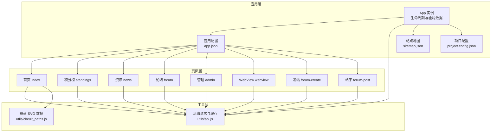
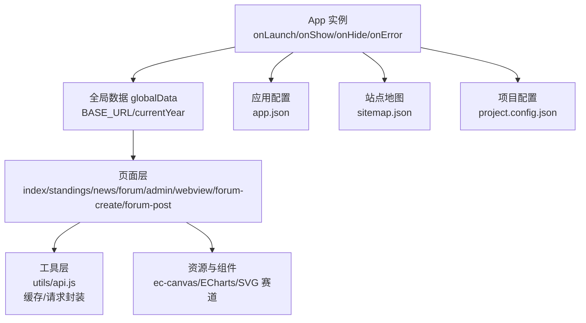
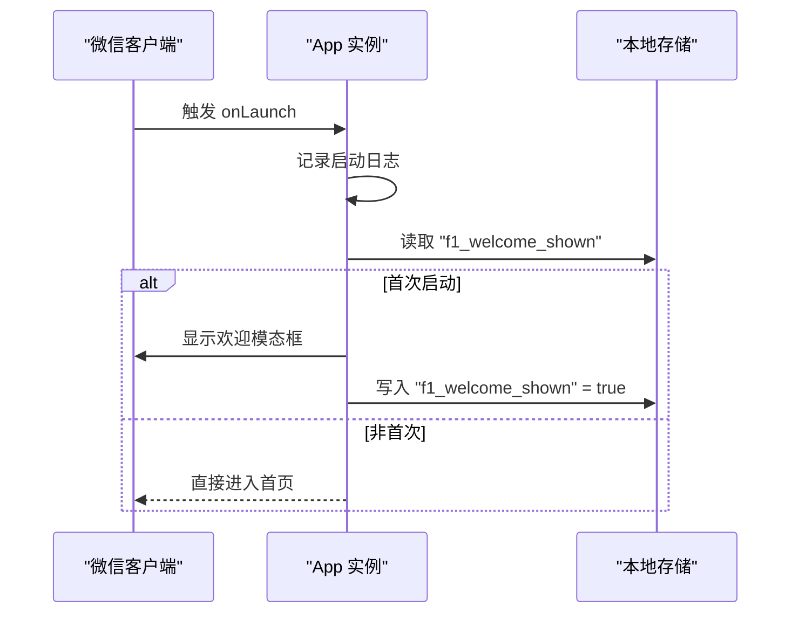
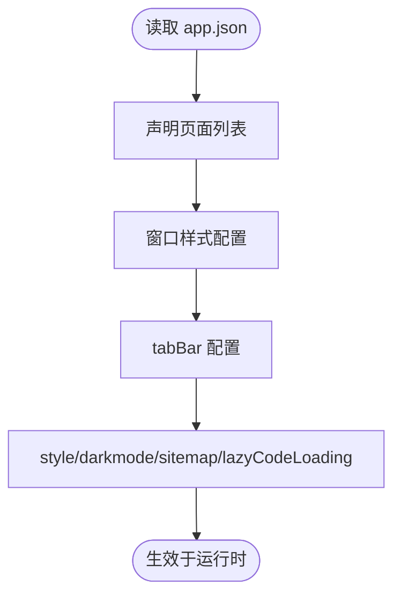
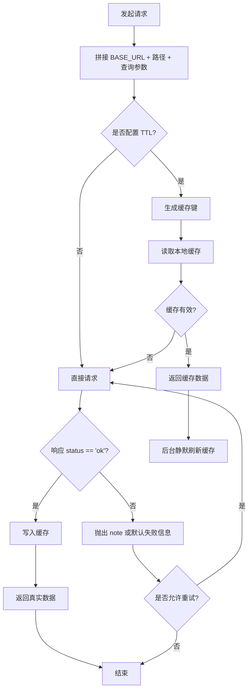
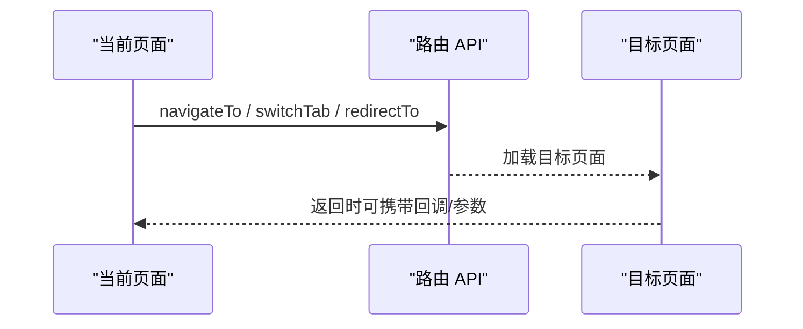
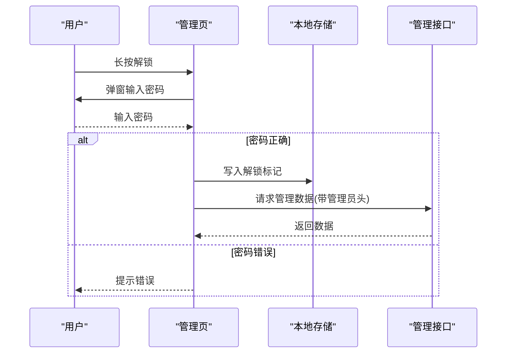
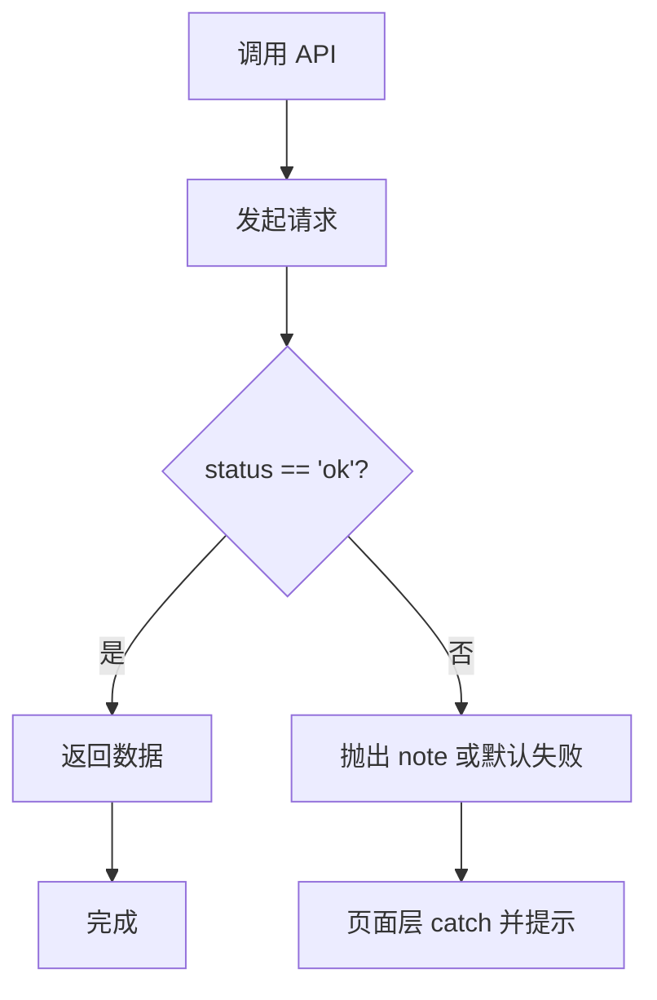
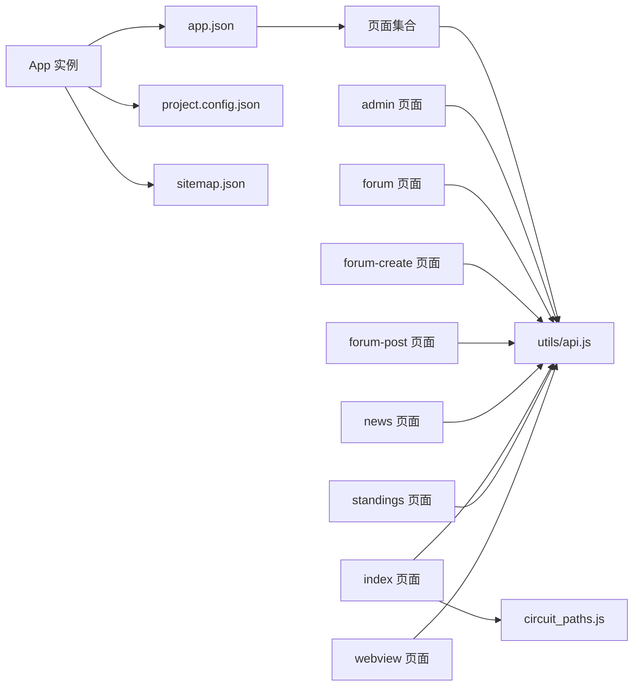

# 应用级 API

<cite>
**本文引用的文件**
- [app.js](file://miniprogram/app.js)
- [app.json](file://miniprogram/app.json)
- [project.config.json](file://miniprogram/project.config.json)
- [sitemap.json](file://miniprogram/sitemap.json)
- [api.js](file://miniprogram/utils/api.js)
- [index.js](file://miniprogram/pages/index/index.js)
- [standings.js](file://miniprogram/pages/standings/standings.js)
- [news.js](file://miniprogram/pages/news/news.js)
- [forum.js](file://miniprogram/pages/forum/forum.js)
- [admin.js](file://miniprogram/pages/admin/admin.js)
- [webview.js](file://miniprogram/pages/webview/webview.js)
- [forum-create.js](file://miniprogram/pages/forum-create/forum-create.js)
- [forum-post.js](file://miniprogram/pages/forum-post/forum-post.js)
- [circuit_paths.js](file://miniprogram/utils/circuit_paths.js)
</cite>

## 目录
1. [简介](#简介)
2. [项目结构](#项目结构)
3. [核心组件](#核心组件)
4. [架构总览](#架构总览)
5. [详细组件分析](#详细组件分析)
6. [依赖关系分析](#依赖关系分析)
7. [性能考虑](#性能考虑)
8. [故障排查指南](#故障排查指南)
9. [结论](#结论)
10. [附录](#附录)

## 简介
本文件系统性梳理 Fast-F1 微信小程序的应用级 API 与整体架构，覆盖 App 实例生命周期、全局数据管理、应用配置、窗口与导航栏配置、网络请求封装与缓存策略、路由与页面管理、权限控制与鉴权、错误处理与性能优化建议，并对小程序框架提供的全局 API 与扩展方法进行文档化说明。目标是帮助开发者快速理解并高效维护该小程序。

## 项目结构
小程序采用标准分层组织：应用层（App）、页面层（Pages）、组件层（Components）、工具层（Utils）。应用配置集中在 app.json 中统一声明页面、窗口样式、tabBar、深色模式、懒加载等；网络请求与缓存逻辑集中在 utils/api.js；各页面负责业务交互与路由跳转。

**图表来源**
- [app.js:1-23](file://miniprogram/app.js#L1-L23)
- [app.json:1-72](file://miniprogram/app.json#L1-L72)
- [sitemap.json:1-5](file://miniprogram/sitemap.json#L1-L5)
- [project.config.json:1-40](file://miniprogram/project.config.json#L1-L40)
- [api.js:1-299](file://miniprogram/utils/api.js#L1-L299)
- [circuit_paths.js:1-119](file://miniprogram/utils/circuit_paths.js#L1-L119)

**章节来源**
- [app.js:1-23](file://miniprogram/app.js#L1-L23)
- [app.json:1-72](file://miniprogram/app.json#L1-L72)
- [project.config.json:1-40](file://miniprogram/project.config.json#L1-L40)
- [sitemap.json:1-5](file://miniprogram/sitemap.json#L1-L5)

## 核心组件
- App 实例与生命周期
  - onLaunch：应用启动时初始化，首次启动弹窗提示与本地存储标记。
  - 全局数据 globalData：包含基础域名与当前年份等。
- 应用配置
  - 页面列表、窗口样式、导航栏、tabBar、深色模式、懒加载策略、sitemapLocation。
- 网络请求与缓存
  - 统一封装 wx.request，支持 GET/POST、超时 20 秒、失败自动重试一次。
  - 基于本地缓存的 TTL 策略，不同接口设置不同缓存时长。
- 路由与页面
  - 通过 app.json 声明页面路径，页面内部通过 wx.navigateTo、wx.switchTab 等进行跳转。
- 权限与鉴权
  - 管理后台使用固定令牌头进行鉴权；论坛相关操作需用户登录态（openid）。
- 错误处理
  - 统一捕获请求失败与网络错误，页面层进行友好提示或降级处理。
- 性能优化
  - 懒加载 requiredComponents、ECharts 图表按需初始化、SVG 赛道绘制缩放适配。

**章节来源**
- [app.js:1-23](file://miniprogram/app.js#L1-L23)
- [app.json:1-72](file://miniprogram/app.json#L1-L72)
- [api.js:1-299](file://miniprogram/utils/api.js#L1-L299)

## 架构总览
应用采用“配置驱动 + 工具封装 + 页面业务”的分层架构。App 实例集中管理全局状态与启动流程；utils/api.js 提供统一网络访问能力；页面通过 Page 对象承载业务逻辑与 UI 交互；sitemap 与项目配置保障 SEO 与构建行为。

**图表来源**
- [app.js:1-23](file://miniprogram/app.js#L1-L23)
- [app.json:1-72](file://miniprogram/app.json#L1-L72)
- [sitemap.json:1-5](file://miniprogram/sitemap.json#L1-L5)
- [project.config.json:1-40](file://miniprogram/project.config.json#L1-L40)
- [api.js:1-299](file://miniprogram/utils/api.js#L1-L299)

## 详细组件分析

### 应用实例与生命周期
- 生命周期函数
  - onLaunch：打印启动日志、首次启动弹窗提示、写入本地存储标记。
  - onShow/onHide：页面显示/隐藏时可做计时器启停等资源管理（部分页面如首页在 Page 层使用）。
  - onError：未在 App 中显式定义，可在 Page 层通过全局错误监听或页面级 onError 处理。
- 全局数据
  - BASE_URL：后端服务地址。
  - currentYear：默认年份，用于事件与积分榜等查询。

**图表来源**
- [app.js:9-21](file://miniprogram/app.js#L9-L21)

**章节来源**
- [app.js:1-23](file://miniprogram/app.js#L1-L23)

### 应用配置与窗口样式
- 页面声明：pages 数组列出所有页面路径。
- 窗口样式：背景文案风格、导航栏颜色、标题文本、背景色。
- tabBar：颜色、选中色、背景色、边框、图标与文本映射。
- 其他：style v2、darkmode 关闭、sitemapLocation、lazyCodeLoading。

**图表来源**
- [app.json:1-72](file://miniprogram/app.json#L1-L72)

**章节来源**
- [app.json:1-72](file://miniprogram/app.json#L1-L72)

### 网络请求与缓存策略
- 请求封装
  - GET/POST 统一封装，自动拼接查询参数与 JSON Content-Type。
  - 超时 20 秒，失败自动重试一次，统一返回 data.status === 'ok' 的数据体。
- 缓存策略
  - 不同接口设置不同 TTL（分钟级），键值包含路径与查询参数排序后的组合。
  - 命中缓存先返回本地数据，同时后台静默刷新并更新缓存。
- 管理员接口
  - 通过固定令牌头进行鉴权，用于后台审核与分析任务。

**图表来源**
- [api.js:45-85](file://miniprogram/utils/api.js#L45-L85)
- [api.js:98-120](file://miniprogram/utils/api.js#L98-L120)

**章节来源**
- [api.js:1-299](file://miniprogram/utils/api.js#L1-L299)

### 路由管理与页面跳转
- 首页 index：支持跳转至赛事详情、资讯详情、切换至论坛/资讯 tab。
- 积分榜 standings：支持跳转至车手详情。
- 资讯 news：支持下拉刷新、触底加载、搜索防抖、跳转至新闻详情。
- 论坛 forum：支持分区跳转、创建帖子、加载综合讨论列表。
- 管理 admin：长按解锁、批量审核、爬取与分析进度展示。
- WebView webview：接收外部链接并在 web-view 中打开。
- 发帖 forum-create：预填标题/引用、校验输入、提交后返回。
- 帖子 forum-post：加载帖子与评论、点赞/点踩、删帖、评论提交。

**图表来源**
- [index.js:229-253](file://miniprogram/pages/index/index.js#L229-L253)
- [standings.js:96-101](file://miniprogram/pages/standings/standings.js#L96-L101)
- [news.js:94-104](file://miniprogram/pages/news/news.js#L94-L104)
- [forum.js:118-123](file://miniprogram/pages/forum/forum.js#L118-L123)
- [admin.js:24-38](file://miniprogram/pages/admin/admin.js#L24-L38)
- [webview.js:4-8](file://miniprogram/pages/webview/webview.js#L4-L8)
- [forum-create.js:69-84](file://miniprogram/pages/forum-create/forum-create.js#L69-L84)
- [forum-post.js:87-105](file://miniprogram/pages/forum-post/forum-post.js#L87-L105)

**章节来源**
- [index.js:1-255](file://miniprogram/pages/index/index.js#L1-L255)
- [standings.js:1-123](file://miniprogram/pages/standings/standings.js#L1-L123)
- [news.js:1-163](file://miniprogram/pages/news/news.js#L1-L163)
- [forum.js:1-125](file://miniprogram/pages/forum/forum.js#L1-L125)
- [admin.js:1-199](file://miniprogram/pages/admin/admin.js#L1-L199)
- [webview.js:1-10](file://miniprogram/pages/webview/webview.js#L1-L10)
- [forum-create.js:1-86](file://miniprogram/pages/forum-create/forum-create.js#L1-L86)
- [forum-post.js:1-160](file://miniprogram/pages/forum-post/forum-post.js#L1-L160)

### 权限控制与鉴权
- 管理后台
  - 通过长按触发密码输入弹窗，正确密码写入本地存储后解锁管理面板。
  - 管理员接口统一添加 X-Admin-Token 头部进行鉴权。
- 论坛功能
  - 发帖/评论/点赞/删帖均需用户 openid，未登录时引导跳转注册页。
  - 注册页支持返回事件回调，将 openid 回传给发帖页。

**图表来源**
- [admin.js:24-62](file://miniprogram/pages/admin/admin.js#L24-L62)
- [api.js:87-89](file://miniprogram/utils/api.js#L87-L89)

**章节来源**
- [admin.js:1-199](file://miniprogram/pages/admin/admin.js#L1-L199)
- [forum-create.js:37-50](file://miniprogram/pages/forum-create/forum-create.js#L37-L50)
- [forum-post.js:67-84](file://miniprogram/pages/forum-post/forum-post.js#L67-L84)
- [api.js:1-299](file://miniprogram/utils/api.js#L1-L299)

### 错误处理与用户体验
- 请求层
  - 统一捕获 wx.request 的 success/fail，校验 status 字段，失败时抛出 note 或默认信息。
  - GET/POST 请求均支持一次自动重试。
- 页面层
  - 首页加载失败时设置 error 字段并提示；资讯页加载失败时降级为字符串错误信息。
  - 管理页加载失败时以 Toast 提示；发帖/评论失败时回退状态并提示。
- 计时器与资源释放
  - 首页在 onShow/onHide/onUnload 中启停倒计时，避免后台持续占用。

**图表来源**
- [api.js:53-64](file://miniprogram/utils/api.js#L53-L64)
- [index.js:133-135](file://miniprogram/pages/index/index.js#L133-L135)
- [news.js:67-69](file://miniprogram/pages/news/news.js#L67-L69)

**章节来源**
- [api.js:1-299](file://miniprogram/utils/api.js#L1-L299)
- [index.js:1-255](file://miniprogram/pages/index/index.js#L1-L255)
- [news.js:1-163](file://miniprogram/pages/news/news.js#L1-L163)

### 性能监控与优化建议
- 懒加载：启用 lazyCodeLoading requiredComponents，减少首屏包体。
- 图表渲染：ECharts 按需初始化，避免不必要的初始化开销。
- 缓存策略：合理设置 TTL，降低重复请求与后端压力。
- 资源适配：SVG 赛道绘制前进行缩放与平移计算，保证多分辨率一致性。
- 网络超时：统一 20 秒超时，结合自动重试提升稳定性。

**章节来源**
- [app.json:67-71](file://miniprogram/app.json#L67-L71)
- [standings.js:103-121](file://miniprogram/pages/standings/standings.js#L103-L121)
- [api.js:45-85](file://miniprogram/utils/api.js#L45-L85)
- [circuit_paths.js:1-119](file://miniprogram/utils/circuit_paths.js#L1-L119)

## 依赖关系分析
- App 依赖全局数据与配置文件；页面依赖工具层 API；页面间通过路由 API 互相跳转。
- 管理后台依赖固定令牌头；论坛功能依赖用户 openid；WebView 依赖外部链接参数。
- 项目配置与站点地图影响构建与 SEO 行为。

**图表来源**
- [app.js:1-23](file://miniprogram/app.js#L1-L23)
- [app.json:1-72](file://miniprogram/app.json#L1-L72)
- [project.config.json:1-40](file://miniprogram/project.config.json#L1-L40)
- [sitemap.json:1-5](file://miniprogram/sitemap.json#L1-L5)
- [api.js:1-299](file://miniprogram/utils/api.js#L1-L299)
- [circuit_paths.js:1-119](file://miniprogram/utils/circuit_paths.js#L1-L119)

**章节来源**
- [app.js:1-23](file://miniprogram/app.js#L1-L23)
- [app.json:1-72](file://miniprogram/app.json#L1-L72)
- [api.js:1-299](file://miniprogram/utils/api.js#L1-L299)

## 性能考虑
- 构建与加载
  - 使用 lazyCodeLoading 减少首屏体积，提升冷启动速度。
- 网络层
  - 统一超时与重试策略，避免长时间阻塞 UI。
  - 接口级 TTL 缓存显著降低重复请求。
- 渲染层
  - ECharts 按需初始化，仅在需要时创建实例。
  - SVG 赛道绘制前进行缩放与平移，避免多次重复计算。
- 存储层
  - 本地缓存键值规范化，避免无效缓存导致的数据不一致。

[本节为通用指导，无需特定文件引用]

## 故障排查指南
- 首次启动无提示
  - 检查本地存储键 "f1_welcome_shown" 是否被清理或覆盖。
- 管理后台无法解锁
  - 确认输入密码与固定令牌一致，检查本地存储解锁标记。
- 论坛功能异常
  - 检查 openid 是否存在，未登录时应跳转注册页。
- 请求失败
  - 查看控制台错误信息与 note 字段，确认 status 是否为 'ok'。
- 缓存未更新
  - 检查对应接口的 TTL 设置与缓存键生成规则。

**章节来源**
- [app.js:11-20](file://miniprogram/app.js#L11-L20)
- [admin.js:24-38](file://miniprogram/pages/admin/admin.js#L24-L38)
- [forum-create.js:37-50](file://miniprogram/pages/forum-create/forum-create.js#L37-L50)
- [api.js:53-64](file://miniprogram/utils/api.js#L53-L64)

## 结论
Fast-F1 小程序通过清晰的分层架构与完善的工具封装，实现了稳定、可维护的应用级 API。App 实例负责全局状态与启动流程，utils/api.js 提供统一网络与缓存能力，页面层聚焦业务交互与路由跳转。配合合理的性能优化与错误处理策略，整体具备良好的用户体验与可扩展性。

[本节为总结，无需特定文件引用]

## 附录
- 小程序框架全局 API 与扩展方法
  - App 实例：onLaunch/onShow/onHide/onError/globalData。
  - Page 实例：onLoad/onShow/onHide/onUnload/data。
  - 路由 API：navigateTo/redirectTo/switchTab/navigateBack。
  - 存储 API：getStorageSync/setStorageSync/removeStorageSync。
  - 界面 API：setNavigationBarTitle/setTabBarItem/setStorageSync。
  - 网络 API：wx.request（封装于 utils/api.js）。
  - 设备 API：getWindowInfo/pixelRatio 用于画布适配。
  - 组件 API：自定义组件与 ec-canvas 初始化回调。

**章节来源**
- [index.js:108-123](file://miniprogram/pages/index/index.js#L108-L123)
- [standings.js:68-72](file://miniprogram/pages/standings/standings.js#L68-L72)
- [news.js:49-56](file://miniprogram/pages/news/news.js#L49-L56)
- [api.js:45-85](file://miniprogram/utils/api.js#L45-L85)
- [circuit_paths.js:189-194](file://miniprogram/utils/circuit_paths.js#L189-L194)