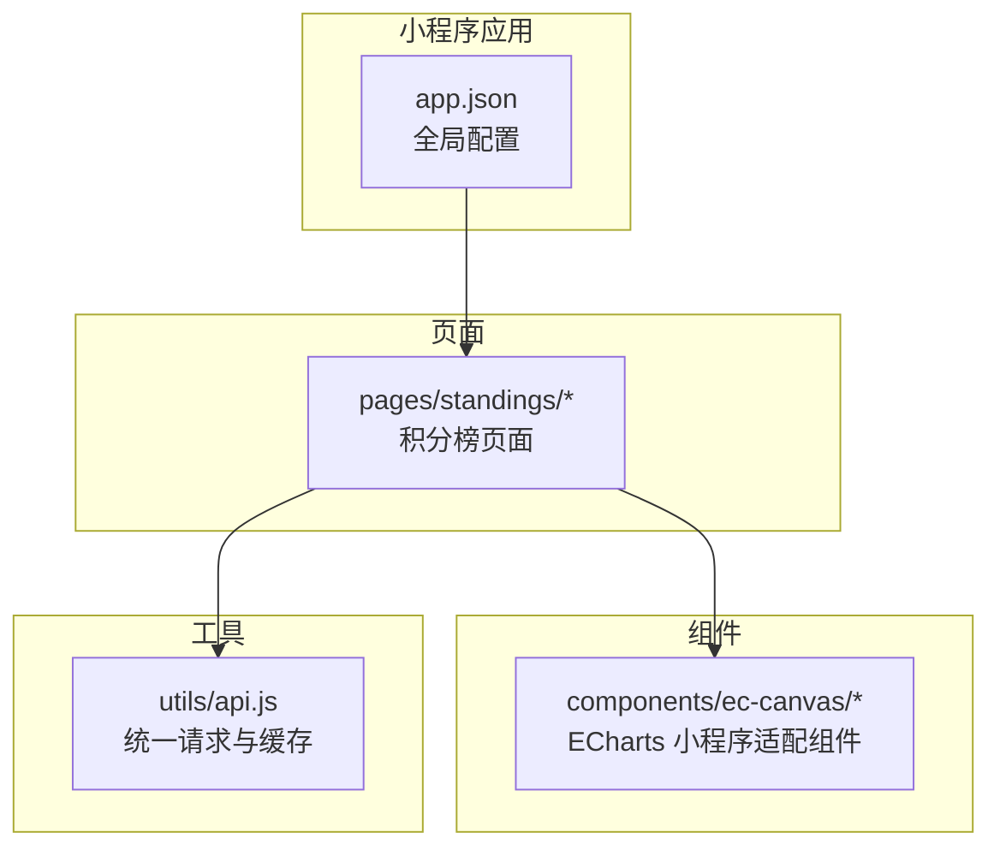
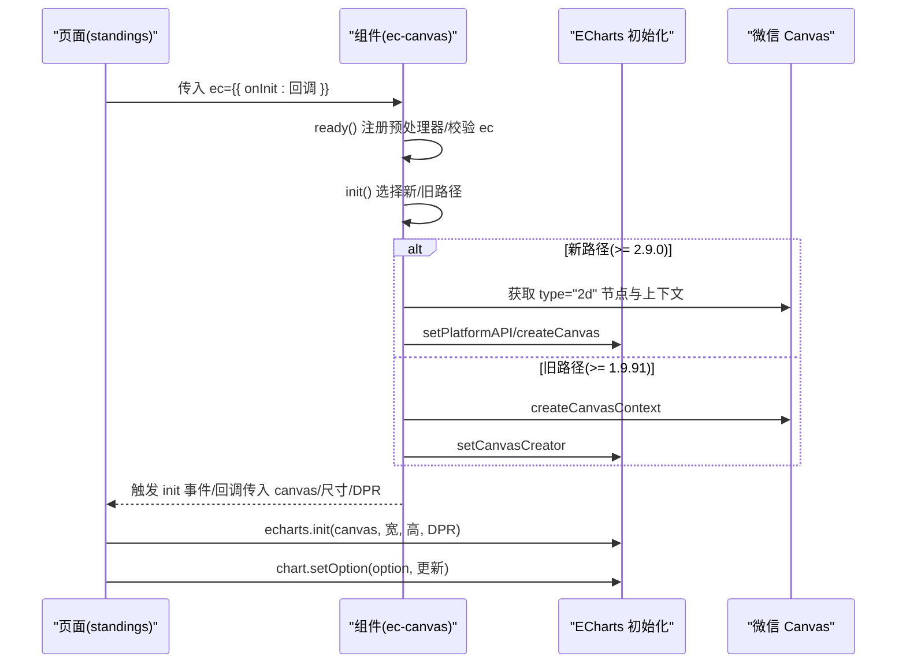
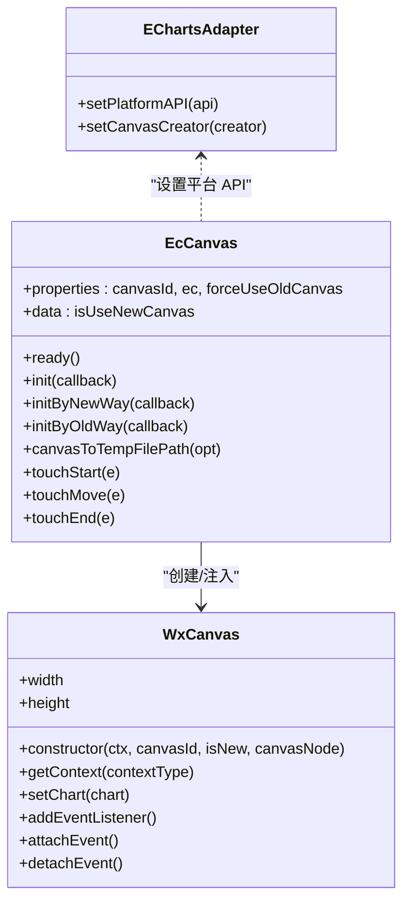
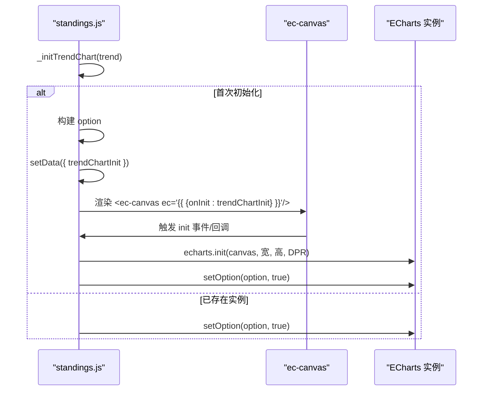
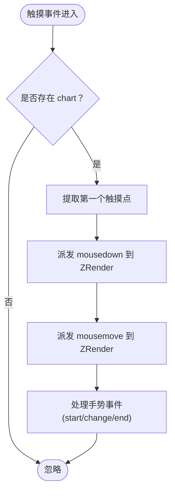
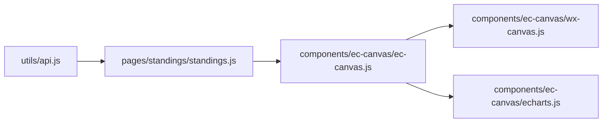

# 组件 API

<cite>
**本文引用的文件**
- [miniprogram/components/ec-canvas/ec-canvas.js](file://miniprogram/components/ec-canvas/ec-canvas.js)
- [miniprogram/components/ec-canvas/ec-canvas.json](file://miniprogram/components/ec-canvas/ec-canvas.json)
- [miniprogram/components/ec-canvas/ec-canvas.wxml](file://miniprogram/components/ec-canvas/ec-canvas.wxml)
- [miniprogram/components/ec-canvas/ec-canvas.wxss](file://miniprogram/components/ec-canvas/ec-canvas.wxss)
- [miniprogram/components/ec-canvas/echarts.js](file://miniprogram/components/ec-canvas/echarts.js)
- [miniprogram/components/ec-canvas/wx-canvas.js](file://miniprogram/components/ec-canvas/wx-canvas.js)
- [miniprogram/pages/standings/standings.js](file://miniprogram/pages/standings/standings.js)
- [miniprogram/pages/standings/standings.wxml](file://miniprogram/pages/standings/standings.wxml)
- [miniprogram/utils/api.js](file://miniprogram/utils/api.js)
- [miniprogram/app.json](file://miniprogram/app.json)
</cite>

## 目录
1. [简介](#简介)
2. [项目结构](#项目结构)
3. [核心组件](#核心组件)
4. [架构总览](#架构总览)
5. [详细组件分析](#详细组件分析)
6. [依赖关系分析](#依赖关系分析)
7. [性能考量](#性能考量)
8. [故障排查指南](#故障排查指南)
9. [结论](#结论)
10. [附录](#附录)

## 简介
本文件面向 Fast-F1 微信小程序中的自定义组件与 ECharts 图表组件，系统性梳理其属性定义、数据传递、事件处理、生命周期、模板结构、样式与行为控制，并给出组件复用、组合使用与性能优化的最佳实践。重点覆盖：
- 自定义组件 ec-canvas 的属性、事件与生命周期
- ECharts 在小程序中的初始化、数据绑定与交互
- 页面与组件之间的数据通信机制
- 组件在页面中的典型使用模式与注意事项

## 项目结构
本项目采用“页面 + 组件”分层组织，图表组件以自定义组件形式提供，页面通过数据绑定驱动组件初始化与更新。

**图表来源**
- [miniprogram/app.json:1-72](file://miniprogram/app.json#L1-L72)
- [miniprogram/pages/standings/standings.js:1-123](file://miniprogram/pages/standings/standings.js#L1-L123)
- [miniprogram/utils/api.js:1-299](file://miniprogram/utils/api.js#L1-L299)

**章节来源**
- [miniprogram/app.json:1-72](file://miniprogram/app.json#L1-L72)

## 核心组件
本节聚焦 ec-canvas 自定义组件及其与 ECharts 的集成方式，明确组件属性、数据流、事件与生命周期。

- 组件属性
  - canvasId: 字符串，默认值为 ec-canvas，用于指定画布 ID
  - ec: 对象，必填；包含初始化回调或配置项
  - forceUseOldCanvas: 布尔值，默认 false；是否强制使用旧版 Canvas 初始化路径

- 组件数据
  - isUseNewCanvas: 布尔值，内部状态，指示当前使用的 Canvas 初始化方式

- 生命周期与初始化流程
  - ready: 注册预处理器禁用渐进式绘制；校验 ec 是否存在；若未延迟加载则立即初始化
  - init: 根据基础库版本选择新旧两种初始化路径
    - 新路径（>= 2.9.0）：使用 type="2d" 的节点，创建 Canvas 并注入平台 API
    - 旧路径（>= 1.9.91 且 < 2.9.0）：使用 wx.createCanvasContext，注入兼容的 Canvas 实现
  - 触摸事件：touchStart/touchMove/touchEnd 将触摸事件映射到 ECharts 的 ZRender 事件

- 数据绑定与事件
  - 页面通过 ec 属性传入初始化回调（onInit），组件在 ready 时触发 init
  - 组件通过 triggerEvent 或直接回调将 canvas、尺寸、像素比等信息回传给页面
  - 支持导出图片：canvasToTempFilePath

- 模板与样式
  - 模板根据 isUseNewCanvas 条件渲染 type="2d" 的 canvas 或普通 canvas
  - 样式类 ec-canvas 占满容器宽高

- 与 ECharts 的桥接
  - 通过 setPlatformAPI 或 setCanvasCreator 注入平台 Canvas 实现
  - 提供 WxCanvas 包装类，支持 getContext('2d')、addEventListener、width/height 访问器等

**章节来源**
- [miniprogram/components/ec-canvas/ec-canvas.js:31-282](file://miniprogram/components/ec-canvas/ec-canvas.js#L31-L282)
- [miniprogram/components/ec-canvas/ec-canvas.json:1-4](file://miniprogram/components/ec-canvas/ec-canvas.json#L1-L4)
- [miniprogram/components/ec-canvas/ec-canvas.wxml:1-5](file://miniprogram/components/ec-canvas/ec-canvas.wxml#L1-L5)
- [miniprogram/components/ec-canvas/ec-canvas.wxss:1-5](file://miniprogram/components/ec-canvas/ec-canvas.wxss#L1-L5)
- [miniprogram/components/ec-canvas/wx-canvas.js:1-112](file://miniprogram/components/ec-canvas/wx-canvas.js#L1-L112)
- [miniprogram/components/ec-canvas/echarts.js:1-46](file://miniprogram/components/ec-canvas/echarts.js#L1-L46)

## 架构总览
下图展示页面、组件与 ECharts 的交互关系，以及数据流向。

**图表来源**
- [miniprogram/pages/standings/standings.js:103-121](file://miniprogram/pages/standings/standings.js#L103-L121)
- [miniprogram/components/ec-canvas/ec-canvas.js:52-198](file://miniprogram/components/ec-canvas/ec-canvas.js#L52-L198)
- [miniprogram/components/ec-canvas/wx-canvas.js:19-92](file://miniprogram/components/ec-canvas/wx-canvas.js#L19-L92)

## 详细组件分析

### 组件类关系图（代码级）

**图表来源**
- [miniprogram/components/ec-canvas/wx-canvas.js:1-112](file://miniprogram/components/ec-canvas/wx-canvas.js#L1-L112)
- [miniprogram/components/ec-canvas/echarts.js:1-46](file://miniprogram/components/ec-canvas/echarts.js#L1-L46)
- [miniprogram/components/ec-canvas/ec-canvas.js:31-282](file://miniprogram/components/ec-canvas/ec-canvas.js#L31-L282)

### 页面到组件的调用序列（积分榜趋势图）

**图表来源**
- [miniprogram/pages/standings/standings.js:103-121](file://miniprogram/pages/standings/standings.js#L103-L121)
- [miniprogram/pages/standings/standings.wxml:24-27](file://miniprogram/pages/standings/standings.wxml#L24-L27)

### 触摸事件处理流程

**图表来源**
- [miniprogram/components/ec-canvas/ec-canvas.js:223-280](file://miniprogram/components/ec-canvas/ec-canvas.js#L223-L280)

### 组件属性与数据绑定
- 属性
  - canvasId: 画布标识，影响选择器查询与事件绑定
  - ec: 必填对象，通常包含 onInit 回调；也可包含 disableTouch 等扩展字段
  - forceUseOldCanvas: 控制是否强制走旧版 Canvas 初始化路径
- 数据
  - isUseNewCanvas: 内部状态，决定模板渲染与初始化分支
- 模板
  - 条件渲染 type="2d" 画布或普通画布
  - 绑定触摸事件与 init 事件
- 样式
  - ec-canvas 类占满容器宽高，便于自适应布局

**章节来源**
- [miniprogram/components/ec-canvas/ec-canvas.js:31-77](file://miniprogram/components/ec-canvas/ec-canvas.js#L31-L77)
- [miniprogram/components/ec-canvas/ec-canvas.wxml:1-5](file://miniprogram/components/ec-canvas/ec-canvas.wxml#L1-L5)
- [miniprogram/components/ec-canvas/ec-canvas.wxss:1-5](file://miniprogram/components/ec-canvas/ec-canvas.wxss#L1-L5)

### 页面数据通信与最佳实践
- 页面通过 ec.onInit 传入初始化逻辑，组件仅负责创建 Canvas 与注入平台 API
- 页面侧构建 ECharts option，首次初始化时调用 echarts.init，后续更新使用 setOption
- 使用 setData 驱动组件渲染，避免直接操作 DOM
- 对于复杂图表，建议在页面侧进行 option 构建与缓存，减少重复计算

**章节来源**
- [miniprogram/pages/standings/standings.js:103-121](file://miniprogram/pages/standings/standings.js#L103-L121)
- [miniprogram/pages/standings/standings.wxml:24-27](file://miniprogram/pages/standings/standings.wxml#L24-L27)

## 依赖关系分析
- 组件依赖
  - ec-canvas 依赖微信 Canvas 上下文与节点能力
  - 通过 setPlatformAPI/setCanvasCreator 注入平台 Canvas 实现
  - 依赖 WxCanvas 包装类提供 getContext('2d') 与事件桥接
- 页面依赖
  - standings 页面依赖 utils/api.js 提供的缓存与请求封装
  - 页面通过 ec-canvas 组件渲染 ECharts 图表
- 外部依赖
  - ECharts 小程序版本打包在组件内，版本信息位于 echarts.js 注释中

**图表来源**
- [miniprogram/utils/api.js:1-299](file://miniprogram/utils/api.js#L1-L299)
- [miniprogram/pages/standings/standings.js:1-123](file://miniprogram/pages/standings/standings.js#L1-L123)
- [miniprogram/components/ec-canvas/ec-canvas.js:1-2](file://miniprogram/components/ec-canvas/ec-canvas.js#L1-L2)
- [miniprogram/components/ec-canvas/wx-canvas.js:1-112](file://miniprogram/components/ec-canvas/wx-canvas.js#L1-L112)
- [miniprogram/components/ec-canvas/echarts.js:1-46](file://miniprogram/components/ec-canvas/echarts.js#L1-L46)

**章节来源**
- [miniprogram/utils/api.js:1-299](file://miniprogram/utils/api.js#L1-L299)
- [miniprogram/pages/standings/standings.js:1-123](file://miniprogram/pages/standings/standings.js#L1-L123)

## 性能考量
- 渐进式绘制禁用
  - 组件在 ready 中注册预处理器，将 series.progressive 设为 0，避免 drawImage 不支持 DOM 导致的问题
- Canvas 版本选择
  - 基础库 >= 2.9.0 时优先使用 type="2d" 节点，具备更好的性能与能力
  - 基础库 < 1.9.91 会报错；建议升级基础库
- 图表更新策略
  - 首次初始化使用 echarts.init，后续更新使用 setOption(true) 进行增量更新
  - option 中关闭动画可减少首屏渲染开销
- 缓存与网络
  - 页面通过 utils/api.js 提供的缓存机制降低重复请求与渲染成本

**章节来源**
- [miniprogram/components/ec-canvas/ec-canvas.js:52-66](file://miniprogram/components/ec-canvas/ec-canvas.js#L52-L66)
- [miniprogram/pages/standings/standings.js:103-121](file://miniprogram/pages/standings/standings.js#L103-L121)
- [miniprogram/utils/api.js:1-299](file://miniprogram/utils/api.js#L1-L299)

## 故障排查指南
- 组件未绑定 ec
  - 现象：控制台警告，组件不初始化
  - 处理：确保在页面中通过 ec="{{ {onInit: 回调} }}" 传入初始化回调
- 基础库版本过低
  - 现象：初始化失败或性能警告
  - 处理：升级微信基础库至 >= 1.9.91；建议 >= 2.9.0 以启用新路径
- 无法导出图片
  - 现象：canvasToTempFilePath 调用无响应
  - 处理：确认 isUseNewCanvas 分支已正确获取 canvasNode；旧路径需在 ctx.draw(true) 后再调用
- 触摸事件无效
  - 现象：图表不可缩放/拖拽
  - 处理：检查 ec.disableTouch 是否被设置；确认组件已绑定触摸事件

**章节来源**
- [miniprogram/components/ec-canvas/ec-canvas.js:68-77](file://miniprogram/components/ec-canvas/ec-canvas.js#L68-L77)
- [miniprogram/components/ec-canvas/ec-canvas.js:98-106](file://miniprogram/components/ec-canvas/ec-canvas.js#L98-L106)
- [miniprogram/components/ec-canvas/ec-canvas.js:200-221](file://miniprogram/components/ec-canvas/ec-canvas.js#L200-L221)
- [miniprogram/components/ec-canvas/ec-canvas.wxml:2-4](file://miniprogram/components/ec-canvas/ec-canvas.wxml#L2-L4)

## 结论
- ec-canvas 组件通过统一的属性与事件接口，屏蔽了微信基础库差异，使页面侧以最小成本接入 ECharts
- 页面侧负责数据与 option 构建，组件侧负责 Canvas 初始化与事件桥接，职责清晰
- 建议在页面层进行 option 缓存与增量更新，结合缓存请求提升整体性能
- 如遇问题，优先检查 ec 绑定、基础库版本与触摸事件开关

## 附录

### 组件属性与事件速查
- 属性
  - canvasId: 字符串
  - ec: 对象（必填，通常含 onInit）
  - forceUseOldCanvas: 布尔
- 事件
  - init: 组件初始化完成，回传 canvas、width、height、dpr 或 oldCanvas、width、height、canvasDpr
  - touchStart/touchMove/touchEnd: 触摸事件映射到 ECharts ZRender

**章节来源**
- [miniprogram/components/ec-canvas/ec-canvas.js:31-77](file://miniprogram/components/ec-canvas/ec-canvas.js#L31-L77)
- [miniprogram/components/ec-canvas/ec-canvas.js:113-198](file://miniprogram/components/ec-canvas/ec-canvas.js#L113-L198)
- [miniprogram/components/ec-canvas/ec-canvas.js:223-280](file://miniprogram/components/ec-canvas/ec-canvas.js#L223-L280)