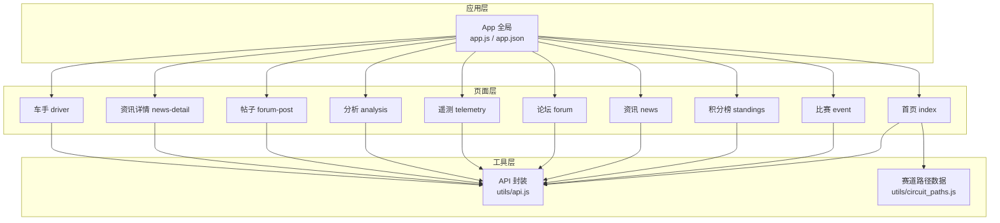
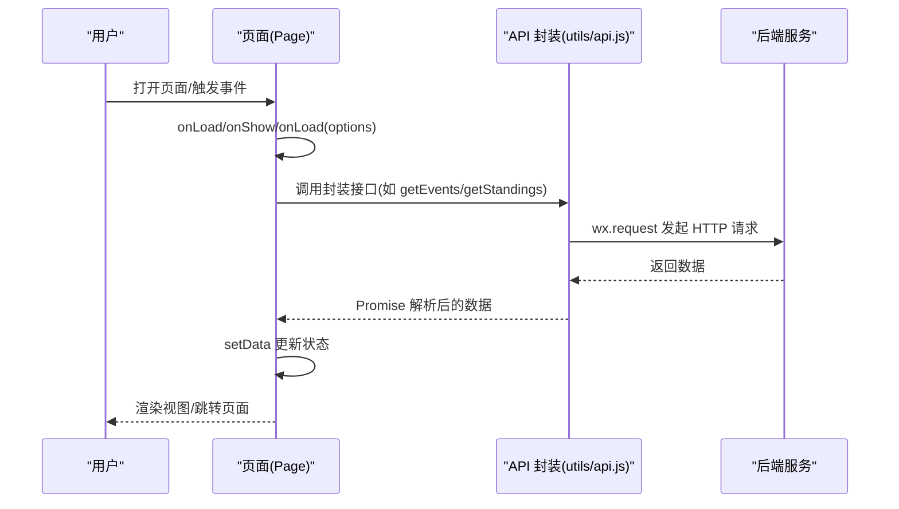
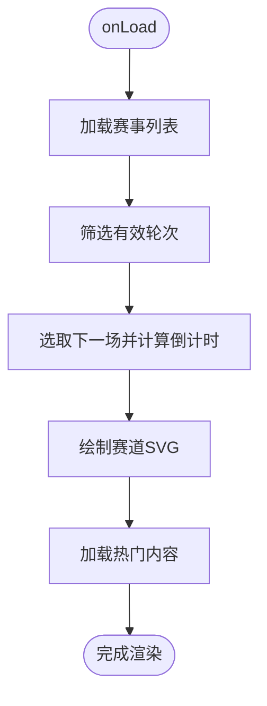
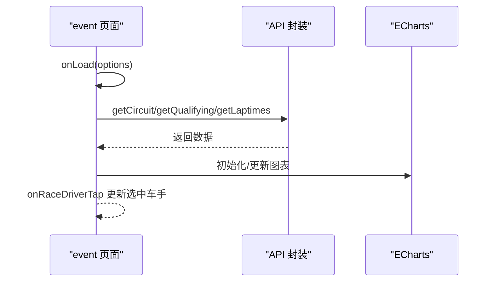
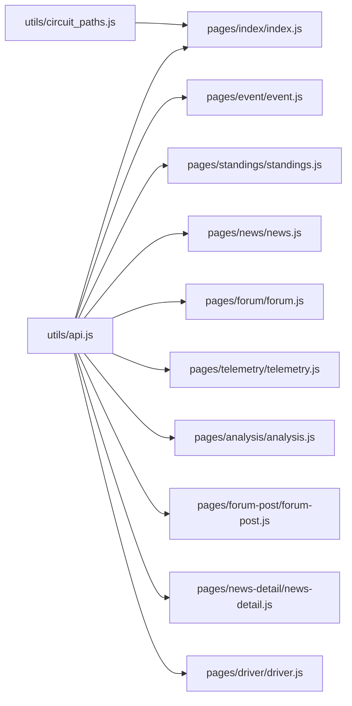

# 页面 API

<cite>
**本文档引用的文件**
- [miniprogram/app.js](file://miniprogram/app.js)
- [miniprogram/app.json](file://miniprogram/app.json)
- [miniprogram/utils/api.js](file://miniprogram/utils/api.js)
- [miniprogram/utils/circuit_paths.js](file://miniprogram/utils/circuit_paths.js)
- [miniprogram/pages/index/index.js](file://miniprogram/pages/index/index.js)
- [miniprogram/pages/index/index.json](file://miniprogram/pages/index/index.json)
- [miniprogram/pages/event/event.js](file://miniprogram/pages/event/event.js)
- [miniprogram/pages/standings/standings.js](file://miniprogram/pages/standings/standings.js)
- [miniprogram/pages/news/news.js](file://miniprogram/pages/news/news.js)
- [miniprogram/pages/forum/forum.js](file://miniprogram/pages/forum/forum.js)
- [miniprogram/pages/telemetry/telemetry.js](file://miniprogram/pages/telemetry/telemetry.js)
- [miniprogram/pages/analysis/analysis.js](file://miniprogram/pages/analysis/analysis.js)
- [miniprogram/pages/forum-post/forum-post.js](file://miniprogram/pages/forum-post/forum-post.js)
- [miniprogram/pages/news-detail/news-detail.js](file://miniprogram/pages/news-detail/news-detail.js)
- [miniprogram/pages/driver/driver.js](file://miniprogram/pages/driver/driver.js)
</cite>

## 目录
1. [简介](#简介)
2. [项目结构](#项目结构)
3. [核心组件](#核心组件)
4. [架构总览](#架构总览)
5. [详细组件分析](#详细组件分析)
6. [依赖关系分析](#依赖关系分析)
7. [性能考虑](#性能考虑)
8. [故障排查指南](#故障排查指南)
9. [结论](#结论)
10. [附录](#附录)

## 简介
本文件系统性梳理 Fast-F1 微信小程序的页面 API，覆盖以下方面：
- 页面生命周期函数：onLoad、onShow、onReady、onHide、onUnload
- 页面配置项：导航栏标题、背景色、字体色等
- 页面方法：数据加载、图表渲染、页面跳转、事件处理
- 页面间数据传递与参数接收
- 页面状态管理、数据绑定与事件处理示例
- 样式配置、导航栏设置与用户体验优化最佳实践

## 项目结构
小程序采用按页面组织的目录结构，每个页面包含 JS、JSON、WXML、WXSS 四类文件；公共逻辑集中在 utils 中，应用级全局配置在 app.js 与 app.json。

**图表来源**
- [miniprogram/app.js:1-23](file://miniprogram/app.js#L1-L23)
- [miniprogram/app.json:1-72](file://miniprogram/app.json#L1-L72)
- [miniprogram/utils/api.js:1-299](file://miniprogram/utils/api.js#L1-L299)
- [miniprogram/utils/circuit_paths.js:1-119](file://miniprogram/utils/circuit_paths.js#L1-L119)
- [miniprogram/pages/index/index.js:1-255](file://miniprogram/pages/index/index.js#L1-L255)
- [miniprogram/pages/event/event.js:1-381](file://miniprogram/pages/event/event.js#L1-L381)
- [miniprogram/pages/standings/standings.js:1-123](file://miniprogram/pages/standings/standings.js#L1-L123)
- [miniprogram/pages/news/news.js:1-163](file://miniprogram/pages/news/news.js#L1-L163)
- [miniprogram/pages/forum/forum.js:1-125](file://miniprogram/pages/forum/forum.js#L1-L125)
- [miniprogram/pages/telemetry/telemetry.js:1-156](file://miniprogram/pages/telemetry/telemetry.js#L1-L156)
- [miniprogram/pages/analysis/analysis.js:1-85](file://miniprogram/pages/analysis/analysis.js#L1-L85)
- [miniprogram/pages/forum-post/forum-post.js:1-160](file://miniprogram/pages/forum-post/forum-post.js#L1-L160)
- [miniprogram/pages/news-detail/news-detail.js:1-305](file://miniprogram/pages/news-detail/news-detail.js#L1-L305)
- [miniprogram/pages/driver/driver.js:1-469](file://miniprogram/pages/driver/driver.js#L1-L469)

**章节来源**
- [miniprogram/app.js:1-23](file://miniprogram/app.js#L1-L23)
- [miniprogram/app.json:1-72](file://miniprogram/app.json#L1-L72)

## 核心组件
- 应用入口与全局配置：定义全局数据、启动逻辑、窗口样式与 tabBar。
- API 封装：统一请求、缓存、重试、错误处理与接口聚合。
- 页面：按功能划分，包含生命周期、状态管理、事件处理与页面跳转。

**章节来源**
- [miniprogram/app.js:1-23](file://miniprogram/app.js#L1-L23)
- [miniprogram/app.json:1-72](file://miniprogram/app.json#L1-L72)
- [miniprogram/utils/api.js:1-299](file://miniprogram/utils/api.js#L1-L299)

## 架构总览
页面通过 Page 构造器注册，内部通过 setData 管理状态，使用 wx 对象进行页面跳转、存储与系统交互；数据通过 utils/api.js 统一访问后端服务；部分页面使用 ECharts 进行可视化渲染。

**图表来源**
- [miniprogram/utils/api.js:45-85](file://miniprogram/utils/api.js#L45-L85)
- [miniprogram/pages/index/index.js:125-136](file://miniprogram/pages/index/index.js#L125-L136)
- [miniprogram/pages/standings/standings.js:74-90](file://miniprogram/pages/standings/standings.js#L74-L90)

## 详细组件分析

### 首页 index
- 生命周期
  - onLoad：加载年份数据、热门内容与赛历；启动倒计时。
  - onShow：启动倒计时。
  - onHide/onUnload：停止倒计时，释放定时器。
- 页面配置：导航栏标题“F1 2026 赛历”。
- 方法
  - loadEvents：获取赛事列表，筛选有效轮次，计算下一场比赛倒计时，绘制赛道 SVG。
  - loadHotData：并发获取热门帖子与新闻。
  - onEventTap/onPostTap/onNewsTap/goToForum/goToNews：页面跳转。
- 数据绑定与事件
  - 使用 data 存储 events、loading、error、countdown、hotPosts、hotNews。
  - 使用 wx.createSelectorQuery + Canvas 绘制 SVG 赛道轮廓。
- 参数接收与传递
  - 通过 onEventTap 传递 round、name、year、race_time_utc。
  - 通过 goToForum/goToNews 切换 tab。

**图表来源**
- [miniprogram/pages/index/index.js:125-153](file://miniprogram/pages/index/index.js#L125-L153)
- [miniprogram/pages/index/index.js:175-212](file://miniprogram/pages/index/index.js#L175-L212)

**章节来源**
- [miniprogram/pages/index/index.js:92-123](file://miniprogram/pages/index/index.js#L92-L123)
- [miniprogram/pages/index/index.js:125-254](file://miniprogram/pages/index/index.js#L125-L254)
- [miniprogram/pages/index/index.json:1-4](file://miniprogram/pages/index/index.json#L1-L4)

### 比赛 event
- 生命周期
  - onLoad：接收 round/name/year/race_time_utc，设置导航栏标题，加载赛道信息。
  - onTabChange：切换标签页时懒加载数据（排位、正赛）。
- 方法
  - loadCircuit/loadQualifying/loadLaptimes：异步加载数据并初始化图表。
  - onRaceDriverTap：多车手选择与卡片更新。
  - onGoTelemetry/onGoAnalysis：跳转到遥测/分析页面。
- 参数接收与传递
  - 从上个页面传入 year、round、name、race_time_utc。
  - 跳转遥测/分析时携带 year、round、d1、d2、session。

**图表来源**
- [miniprogram/pages/event/event.js:229-247](file://miniprogram/pages/event/event.js#L229-L247)
- [miniprogram/pages/event/event.js:249-299](file://miniprogram/pages/event/event.js#L249-L299)

**章节来源**
- [miniprogram/pages/event/event.js:193-247](file://miniprogram/pages/event/event.js#L193-L247)
- [miniprogram/pages/event/event.js:249-380](file://miniprogram/pages/event/event.js#L249-L380)

### 积分榜 standings
- 生命周期
  - onLoad：接收 year，加载积分榜与趋势图数据。
  - onShow：首次加载时初始化图表。
- 方法
  - loadStandings：获取 driver/constructor 数据与 driver_trend。
  - onDriverTap：跳转到车手详情页。
  - _initTrendChart：初始化趋势图。
- 参数接收与传递
  - 从上个页面传入 year。
  - 跳转车手详情时携带 code、color、team、points、position、wins。

**章节来源**
- [miniprogram/pages/standings/standings.js:54-122](file://miniprogram/pages/standings/standings.js#L54-L122)

### 资讯 news
- 生命周期
  - onLoad：接收 team/teamName，设置导航栏标题，加载资讯列表。
  - onShow：非车队筛选模式下同步分析状态。
- 方法
  - loadNews/loadMore：分页加载资讯。
  - onPullDownRefresh/onReachBottom：下拉刷新与触底加载。
  - onSearchInput/onSearchConfirm/onSearchClear：搜索防抖。
  - onTapNews：跳转到资讯详情，支持预览参数。
- 参数接收与传递
  - 通过 team/teamName 过滤；通过 preview 传递预览数据。

**章节来源**
- [miniprogram/pages/news/news.js:4-161](file://miniprogram/pages/news/news.js#L4-L161)

### 论坛 forum
- 生命周期
  - onLoad：加载分区与综合讨论帖子。
  - onShow：返回后刷新综合讨论列表。
- 方法
  - loadSections/loadGeneralPosts/loadGeneralMore：加载分区与帖子。
  - onTapPost/onCreateGeneral/onTapSection：跳转到帖子/发帖/分区。

**章节来源**
- [miniprogram/pages/forum/forum.js:4-124](file://miniprogram/pages/forum/forum.js#L4-L124)

### 遥测 telemetry
- 生命周期
  - onLoad：接收 year、round、d1、d2、session，加载遥测数据。
- 方法
  - loadTelemetry：获取遥测数据并初始化图表。
  - _initChart/_drawChart：手动初始化 ECharts 并绘制指定通道。
  - onChartTabChange：切换图表通道。
  - onGoAnalysis：跳转到分析页面。

**章节来源**
- [miniprogram/pages/telemetry/telemetry.js:71-155](file://miniprogram/pages/telemetry/telemetry.js#L71-L155)

### 分析 analysis
- 生命周期
  - onLoad：接收 year、round、d1、d2、session，加载 AI 分析报告。
- 方法
  - loadAnalysis：获取分析报告与指标，解析 Markdown 为段落。
  - onSectionToggle：展开/收起报告段落。
  - onRefresh：强制刷新分析结果。

**章节来源**
- [miniprogram/pages/analysis/analysis.js:3-84](file://miniprogram/pages/analysis/analysis.js#L3-L84)

### 帖子详情 forum-post
- 生命周期
  - onLoad：接收 id，读取 openid/nickname，加载帖子与点赞状态。
  - onShow：动态同步 openid/nickname。
- 方法
  - loadPost/loadComments：加载帖子与评论。
  - onLike：点赞/点踩。
  - onDeletePost：删除自己的帖子。
  - onSubmitComment：提交评论。
  - onGoNews：跳转到相关资讯。

**章节来源**
- [miniprogram/pages/forum-post/forum-post.js:4-159](file://miniprogram/pages/forum-post/forum-post.js#L4-L159)

### 资讯详情 news-detail
- 生命周期
  - onLoad：接收 id，支持 preview 预览；加载详情、相关帖子、术语标签、车队标签。
  - onShow：刷新相关帖子。
  - onUnload：停止轮询。
- 方法
  - loadDetail：并发加载详情、帖子、术语、车队标签。
  - onTeamTap/onTermTap/onCloseTermCard/onGoTermDetail/onGoForumFromTerm：团队/术语交互。
  - onTriggerAnalyze/onReanalyze：触发/重新分析解读。
  - onQuote/onGoForum：引用内容发帖。
  - onViewAllPosts/onGoPost：查看全部帖子/跳转帖子。
  - onOpenUrl：复制原文链接。

**章节来源**
- [miniprogram/pages/news-detail/news-detail.js:25-303](file://miniprogram/pages/news-detail/news-detail.js#L25-L303)

### 车手 driver
- 生命周期
  - onLoad：接收 code/color/team/points/position/wins，设置导航栏标题，加载趋势、评分与评论。
  - onShow：刷新用户登录状态。
- 方法
  - loadTrend：获取车手积分趋势。
  - 评分：匿名 ID 生成、加载/提交评分、渲染社区均分。
  - 评论：分页加载、点赞、发送评论。
  - onGoRegister：跳转注册页。

**章节来源**
- [miniprogram/pages/driver/driver.js:273-468](file://miniprogram/pages/driver/driver.js#L273-L468)

## 依赖关系分析

**图表来源**
- [miniprogram/utils/api.js:1-299](file://miniprogram/utils/api.js#L1-L299)
- [miniprogram/utils/circuit_paths.js:1-119](file://miniprogram/utils/circuit_paths.js#L1-L119)
- [miniprogram/pages/index/index.js:1-5](file://miniprogram/pages/index/index.js#L1-L5)
- [miniprogram/pages/event/event.js:1-3](file://miniprogram/pages/event/event.js#L1-L3)
- [miniprogram/pages/standings/standings.js:1-3](file://miniprogram/pages/standings/standings.js#L1-L3)
- [miniprogram/pages/news/news.js:1-3](file://miniprogram/pages/news/news.js#L1-L3)
- [miniprogram/pages/forum/forum.js:1-3](file://miniprogram/pages/forum/forum.js#L1-L3)
- [miniprogram/pages/telemetry/telemetry.js:1-3](file://miniprogram/pages/telemetry/telemetry.js#L1-L3)
- [miniprogram/pages/analysis/analysis.js:1-2](file://miniprogram/pages/analysis/analysis.js#L1-L2)
- [miniprogram/pages/forum-post/forum-post.js:1-3](file://miniprogram/pages/forum-post/forum-post.js#L1-L3)
- [miniprogram/pages/news-detail/news-detail.js:1-3](file://miniprogram/pages/news-detail/news-detail.js#L1-L3)
- [miniprogram/pages/driver/driver.js:1-2](file://miniprogram/pages/driver/driver.js#L1-L2)

**章节来源**
- [miniprogram/utils/api.js:1-299](file://miniprogram/utils/api.js#L1-L299)
- [miniprogram/utils/circuit_paths.js:1-119](file://miniprogram/utils/circuit_paths.js#L1-L119)

## 性能考虑
- 请求缓存：API 封装内置缓存与 TTL，优先返回缓存并静默刷新，减少重复请求。
- 并发加载：首页并发获取热门帖子与新闻；资讯详情并发加载详情、帖子、术语、车队标签。
- 图表懒加载：遥测页面使用 ec-canvas 的 lazyLoad，数据就绪后再初始化，避免初始化时机问题。
- 防抖搜索：资讯列表搜索输入使用 300ms 防抖，降低频繁请求。
- 定时器管理：首页倒计时在 onShow/onHide/onUnload 中正确启停，避免内存泄漏。

**章节来源**
- [miniprogram/utils/api.js:4-120](file://miniprogram/utils/api.js#L4-L120)
- [miniprogram/pages/index/index.js:214-227](file://miniprogram/pages/index/index.js#L214-L227)
- [miniprogram/pages/news/news.js:120-138](file://miniprogram/pages/news/news.js#L120-L138)
- [miniprogram/pages/telemetry/telemetry.js:122-133](file://miniprogram/pages/telemetry/telemetry.js#L122-L133)

## 故障排查指南
- 网络请求失败
  - 现象：页面显示“加载失败/数据加载失败”。
  - 处理：检查 API 封装中的错误提示与 catch 分支；确认 BASE_URL 与网络权限。
- 图表初始化异常
  - 现象：ECharts 未渲染或空白。
  - 处理：确保在数据就绪后调用 _initChart；使用 wx.nextTick 等待 DOM 渲染。
- 定时器泄漏
  - 现象：页面切换后倒计时仍在运行。
  - 处理：在 onHide/onUnload 中清理定时器。
- 缓存命中与刷新
  - 现象：数据长时间未更新。
  - 处理：使用分析页面的“强制刷新”或删除对应缓存键。

**章节来源**
- [miniprogram/utils/api.js:45-85](file://miniprogram/utils/api.js#L45-L85)
- [miniprogram/pages/telemetry/telemetry.js:122-133](file://miniprogram/pages/telemetry/telemetry.js#L122-L133)
- [miniprogram/pages/index/index.js:117-123](file://miniprogram/pages/index/index.js#L117-L123)
- [miniprogram/pages/analysis/analysis.js:81-83](file://miniprogram/pages/analysis/analysis.js#L81-L83)

## 结论
Fast-F1 小程序页面 API 设计清晰，遵循微信小程序 Page 构造器规范，结合 utils/api.js 提供统一的数据访问与缓存策略。页面间通过参数传递与 wx 导航 API 实现无缝跳转，配合生命周期钩子与状态管理实现良好的用户体验。建议在后续迭代中进一步完善错误边界与加载态提示，增强可维护性与可扩展性。

## 附录

### 页面生命周期与配置速查
- 首页 index
  - 生命周期：onLoad/onShow/onHide/onUnload
  - 配置：navigationBarTitleText
- 比赛 event
  - 生命周期：onLoad/onTabChange
  - 配置：动态设置导航栏标题
- 积分榜 standings
  - 生命周期：onLoad/onShow
  - 配置：无额外页面配置
- 资讯 news
  - 生命周期：onLoad/onShow
  - 配置：无额外页面配置
- 论坛 forum
  - 生命周期：onLoad/onShow
  - 配置：无额外页面配置
- 遥测 telemetry
  - 生命周期：onLoad
  - 配置：无额外页面配置
- 分析 analysis
  - 生命周期：onLoad
  - 配置：无额外页面配置
- 帖子详情 forum-post
  - 生命周期：onLoad/onShow
  - 配置：无额外页面配置
- 资讯详情 news-detail
  - 生命周期：onLoad/onShow/onUnload
  - 配置：无额外页面配置
- 车手 driver
  - 生命周期：onLoad/onShow
  - 配置：无额外页面配置

**章节来源**
- [miniprogram/pages/index/index.json:1-4](file://miniprogram/pages/index/index.json#L1-L4)
- [miniprogram/pages/event/event.js:229-238](file://miniprogram/pages/event/event.js#L229-L238)
- [miniprogram/pages/news/news.js:23-29](file://miniprogram/pages/news/news.js#L23-L29)
- [miniprogram/pages/news-detail/news-detail.js:51-65](file://miniprogram/pages/news-detail/news-detail.js#L51-L65)