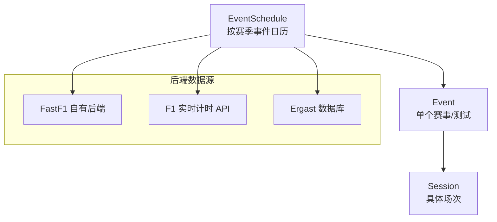
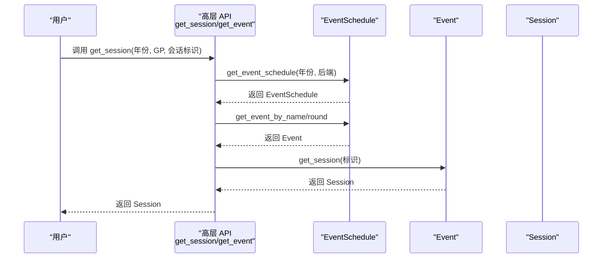
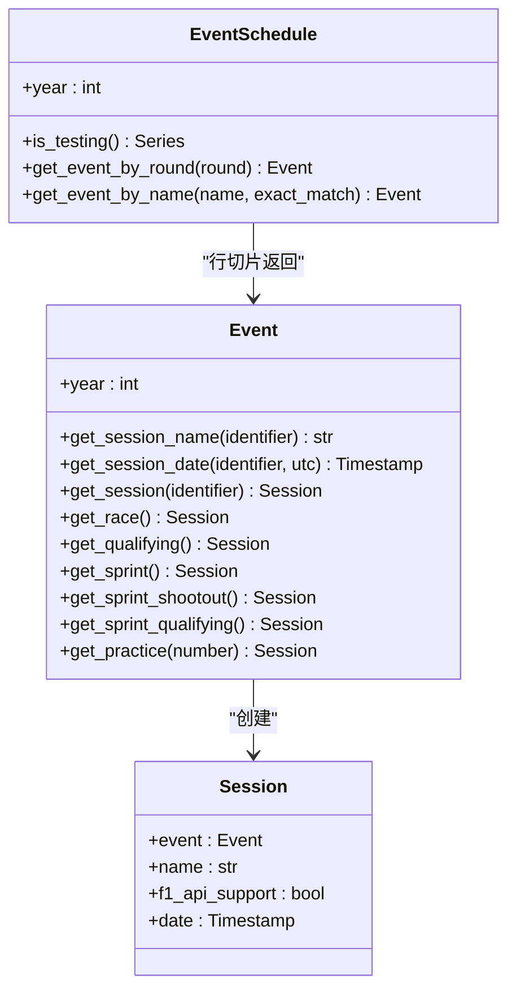

# 事件管理 API

<cite>
**本文引用的文件**
- [fastf1/events.py](file://fastf1/events.py)
- [fastf1/core.py](file://fastf1/core.py)
- [docs/api_reference/events.rst](file://docs/api_reference/events.rst)
- [docs/api_reference/loading_data.rst](file://docs/api_reference/loading_data.rst)
- [fastf1/tests/test_events.py](file://fastf1/tests/test_events.py)
- [docs/getting_started/basics.rst](file://docs/getting_started/basics.rst)
</cite>

## 目录
1. [简介](#简介)
2. [项目结构](#项目结构)
3. [核心组件](#核心组件)
4. [架构总览](#架构总览)
5. [详细组件分析](#详细组件分析)
6. [依赖分析](#依赖分析)
7. [性能考虑](#性能考虑)
8. [故障排查指南](#故障排查指南)
9. [结论](#结论)
10. [附录](#附录)

## 简介
本文件为 Fast-F1 项目中的事件管理 API 提供完整的参考与使用说明，覆盖 Event 与 EventSchedule 的创建、查询与管理接口，以及围绕赛事日历、轮次信息、比赛时间等事件相关数据的访问方式。重点解释 get_event()、get_session()、get_round() 等核心方法的参数类型、返回值、异常行为与典型用法，并给出筛选、排序与过滤的实践建议与示例路径。

## 项目结构
事件管理功能主要位于 fastf1/events.py 中，围绕以下核心对象展开：
- EventSchedule：按赛季构建的事件日历（基于 pandas DataFrame），提供按轮次或名称检索事件的能力。
- Event：单个赛事周末或测试活动，封装会话（Practice/Q/Sprint/Race）的访问与时间信息。
- Session：具体某一场次的数据入口（Race/Qualifying/Sprint 等），由 Event.get_session(...) 获取。

图表来源
- [fastf1/events.py:285-342](file://fastf1/events.py#L285-L342)
- [fastf1/events.py:640-698](file://fastf1/events.py#L640-L698)
- [fastf1/events.py:832-856](file://fastf1/events.py#L832-L856)
- [fastf1/core.py:1152-1173](file://fastf1/core.py#L1152-L1173)

章节来源
- [fastf1/events.py:285-342](file://fastf1/events.py#L285-L342)
- [fastf1/events.py:640-698](file://fastf1/events.py#L640-L698)
- [fastf1/events.py:832-856](file://fastf1/events.py#L832-L856)
- [fastf1/core.py:1152-1173](file://fastf1/core.py#L1152-L1173)

## 核心组件
- EventSchedule
  - 作用：承载一个赛季的所有事件，提供按轮次/名称检索、测试事件识别、以及事件列字段访问。
  - 关键字段（节选）：RoundNumber、Country、Location、OfficialEventName、EventName、EventFormat、Session1–5、Session1–5Date、Session1–5DateUtc、F1ApiSupport。
  - 常用方法：is_testing()、get_event_by_round(round)、get_event_by_name(name, exact_match=False)。
- Event
  - 作用：代表单个赛事周末或测试活动，提供会话名称解析、会话时间查询、以及获取具体 Session 对象。
  - 常用方法：get_session_name(identifier)、get_session_date(identifier, utc=False)、get_session(identifier)、get_race()/get_qualifying()/get_sprint()/get_sprint_shootout()/get_sprint_qualifying()/get_practice(number)。
- Session
  - 作用：具体场次对象，作为后续加载数据的入口；包含事件引用、名称、是否支持官方 API、以及 UTC 日期等元信息。

章节来源
- [docs/api_reference/events.rst:31-79](file://docs/api_reference/events.rst#L31-L79)
- [fastf1/events.py:640-698](file://fastf1/events.py#L640-L698)
- [fastf1/events.py:832-1011](file://fastf1/events.py#L832-L1011)
- [fastf1/core.py:1152-1173](file://fastf1/core.py#L1152-L1173)

## 架构总览
事件管理 API 的调用链从高层函数开始，逐步定位到 EventSchedule，再根据用户输入选择 Event，最后生成 Session 对象用于数据加载。

图表来源
- [fastf1/events.py:50-138](file://fastf1/events.py#L50-L138)
- [fastf1/events.py:285-342](file://fastf1/events.py#L285-L342)
- [fastf1/events.py:699-830](file://fastf1/events.py#L699-L830)
- [fastf1/events.py:951-983](file://fastf1/events.py#L951-L983)

## 详细组件分析

### EventSchedule：按赛季事件日历
- 初始化与元数据
  - 年份 year 保存在 _metadata 中，便于序列化与切片保留。
- 核心能力
  - is_testing()：判断每个事件是否为测试事件。
  - get_event_by_round(round)：按轮次检索，轮次 0 专用于测试事件，不接受通过轮次查询测试事件。
  - get_event_by_name(name, exact_match=False)：模糊匹配或严格匹配事件名，内部对“Formula 1/Grand Prix”等常见词进行清洗，要求唯一性片段至少 4 字符。
- 数据列与类型
  - 包含 RoundNumber、Country、Location、OfficialEventName、EventName、EventDate、EventFormat、Session1–5、Session1–5Date、Session1–5DateUtc、F1ApiSupport 等。
- 后端选择
  - 支持 fastf1、f1timing、ergast 三种后端；默认优先 fastf1，随后回退；2018 年前强制 ergast；测试事件不支持 ergast。

章节来源
- [fastf1/events.py:640-698](file://fastf1/events.py#L640-L698)
- [fastf1/events.py:699-830](file://fastf1/events.py#L699-L830)
- [docs/api_reference/events.rst:31-79](file://docs/api_reference/events.rst#L31-L79)

### Event：单个赛事/测试事件
- 会话名称解析
  - get_session_name(identifier)：支持缩写（如 FP1/FP2/FP3/Q/S/SS/SQ/R）、全名（大小写无关）、数字（1–5）。对特定年份的“Sprint Qualifying”兼容旧称“Sprint”。
- 会话时间查询
  - get_session_date(identifier, utc=False)：返回本地时间（tz-aware）或 UTC 时间（非时区感知）。当使用 ergast 后端且未提供本地时间时抛出错误。
- 会话对象获取
  - get_session(identifier)：返回 Session 对象；内部校验会话存在性与有效性。
- 快捷方法
  - get_race()/get_qualifying()/get_sprint()/get_sprint_shootout()/get_sprint_qualifying()/get_practice(number)：按固定语义获取常用会话。

章节来源
- [fastf1/events.py:832-1011](file://fastf1/events.py#L832-L1011)
- [docs/api_reference/events.rst:140-166](file://docs/api_reference/events.rst#L140-L166)

### Session：具体场次
- 元信息
  - event：关联的 Event 对象。
  - name：会话名称（Race/Qualifying/Sprint 等）。
  - f1_api_support：是否支持官方 API（影响可加载数据范围）。
  - date：UTC 时间戳（通过 Event.get_session_date(...) 初始化）。
- 用途
  - 作为后续加载数据（计时、遥测、天气等）的入口。

章节来源
- [fastf1/core.py:1152-1173](file://fastf1/core.py#L1152-L1173)

### 高层 API：get_event/get_session/get_testing_event/get_testing_session/get_event_schedule/get_events_remaining
- get_event(year, gp, backend=None, exact_match=False) → Event
  - 通过 EventSchedule 定位 Event；gp 支持字符串（模糊/精确）或整数轮次。
- get_session(year, gp, identifier, backend=None, exact_match=False) → Session
  - 直接返回 Session；内部先获取 Event 再调用其 get_session。
- get_testing_event(year, test_number, backend=None) → Event
  - 仅支持 fastf1/f1timing，ergast 不支持测试事件。
- get_testing_session(year, test_number, session_number, backend=None) → Session
  - 获取测试事件内的练习会话。
- get_event_schedule(year, include_testing=True, backend=None) → EventSchedule
  - 按年份构建事件日历，可选择是否包含测试事件。
- get_events_remaining(dt=None, include_testing=True, backend=None) → EventSchedule
  - 返回指定时间点之后的事件集合（过滤掉已结束的事件）。

章节来源
- [fastf1/events.py:50-138](file://fastf1/events.py#L50-L138)
- [fastf1/events.py:246-283](file://fastf1/events.py#L246-L283)
- [fastf1/events.py:285-342](file://fastf1/events.py#L285-L342)
- [fastf1/events.py:345-402](file://fastf1/events.py#L345-L402)

## 依赖分析
- 组件耦合
  - EventSchedule 与 Event 通过 pandas 切片机制建立“横向切片”关系（EventSchedule 行切片返回 Event）。
  - Event 与 Session 通过构造函数建立“纵向依赖”，Session 持有 Event 引用与会话名称。
- 外部依赖
  - 后端数据源：FastF1 自有后端、F1 实时计时 API、Ergast。
  - 工具库：pandas、dateutil、缓存与请求模块等。

图表来源
- [fastf1/events.py:640-698](file://fastf1/events.py#L640-L698)
- [fastf1/events.py:832-1011](file://fastf1/events.py#L832-L1011)
- [fastf1/core.py:1152-1173](file://fastf1/core.py#L1152-L1173)

## 性能考虑
- 后端选择与回退策略
  - 默认优先 fastf1，随后尝试 f1timing，最后 ergast；合理设置 backend 可减少失败重试与网络开销。
- 事件日历缓存
  - EventSchedule 构建后可复用，避免重复拉取；结合 get_events_remaining 可按需筛选未来事件，降低后续处理量。
- 会话时间查询
  - get_session_date 在本地时间不可用时会抛出异常，提前检查 F1ApiSupport 与后端类型可避免无效查询。

## 故障排查指南
- 常见异常与原因
  - 事件名模糊匹配置信度过低：触发 FuzzyMatchError，建议提高输入唯一性或启用 exact_match。
  - 输入事件名唯一片段过短：触发 ValueError，要求至少 4 字符（已去除常见词）。
  - 无效轮次：触发 ValueError，轮次 0 不能用于测试事件。
  - 无效会话标识：触发 ValueError，检查缩写、全名或数字是否在有效范围内。
  - 本地时间不可用：当使用 ergast 后端且未提供本地时间戳时，get_session_date(utc=False) 将抛出错误。
- 单元测试参考
  - 测试覆盖了 get_session、get_event、get_testing_session、get_events_remaining、get_event_schedule 等函数的行为边界与异常场景。

章节来源
- [fastf1/tests/test_events.py:189-211](file://fastf1/tests/test_events.py#L189-L211)
- [fastf1/tests/test_events.py:328-337](file://fastf1/tests/test_events.py#L328-L337)

## 结论
Fast-F1 的事件管理 API 以 EventSchedule 为核心，提供灵活的事件检索与会话访问能力。通过 get_event/get_session 等高层函数，用户可以快速定位到目标场次并加载所需数据。在实际使用中，建议明确后端选择、合理利用 get_events_remaining 进行筛选，并注意不同后端在时间与可用性方面的差异。

## 附录

### API 参考速查表
- get_event_schedule(year, include_testing=True, backend=None) → EventSchedule
  - 用途：获取赛季事件日历
  - 参数：year、include_testing、backend
  - 返回：EventSchedule
- get_event(year, gp, backend=None, exact_match=False) → Event
  - 用途：获取单个事件
  - 参数：year、gp（字符串/整数）、backend、exact_match
  - 返回：Event
- get_session(year, gp, identifier, backend=None, exact_match=False) → Session
  - 用途：直接获取会话对象
  - 参数：year、gp、identifier（缩写/全名/数字）、backend、exact_match
  - 返回：Session
- get_testing_event(year, test_number, backend=None) → Event
  - 用途：获取测试事件
  - 参数：year、test_number、backend
  - 返回：Event
- get_testing_session(year, test_number, session_number, backend=None) → Session
  - 用途：获取测试事件内的练习会话
  - 参数：year、test_number、session_number、backend
  - 返回：Session
- get_events_remaining(dt=None, include_testing=True, backend=None) → EventSchedule
  - 用途：获取指定时间点之后的事件集合
  - 参数：dt、include_testing、backend
  - 返回：EventSchedule

章节来源
- [fastf1/events.py:50-138](file://fastf1/events.py#L50-L138)
- [fastf1/events.py:246-283](file://fastf1/events.py#L246-L283)
- [fastf1/events.py:285-342](file://fastf1/events.py#L285-L342)
- [fastf1/events.py:345-402](file://fastf1/events.py#L345-L402)

### 事件数据字段说明（节选）
- RoundNumber：锦标赛轮次（测试事件统一为 0）
- Country/Location：国家与地点
- OfficialEventName/EventName：官方与简称
- EventFormat：事件格式（conventional/sprint/sprint_shootout/sprint_qualifying/testing）
- Session1–5：各会话名称
- Session1–5Date：本地时间（tz-aware，部分后端不可用）
- Session1–5DateUtc：UTC 时间
- F1ApiSupport：是否受官方 API 支持

章节来源
- [docs/api_reference/events.rst:31-79](file://docs/api_reference/events.rst#L31-L79)

### 使用示例路径（不含代码内容）
- 获取会话并查看名称
  - 示例路径：[docs/getting_started/basics.rst:108-110](file://docs/getting_started/basics.rst#L108-L110)
- 事件日历字段概览
  - 示例路径：[docs/api_reference/events.rst:39-79](file://docs/api_reference/events.rst#L39-L79)
- 事件检索与筛选
  - 示例路径：[fastf1/tests/test_events.py:11-18](file://fastf1/tests/test_events.py#L11-L18)
  - 示例路径：[fastf1/tests/test_events.py:54-59](file://fastf1/tests/test_events.py#L54-L59)
- 未来事件筛选
  - 示例路径：[fastf1/tests/test_events.py:35-52](file://fastf1/tests/test_events.py#L35-L52)