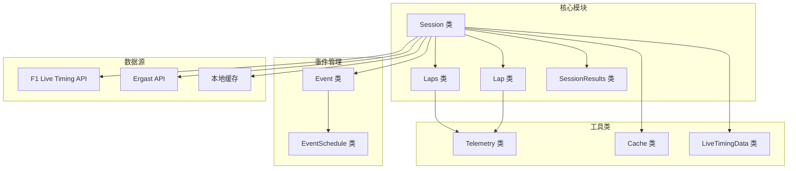
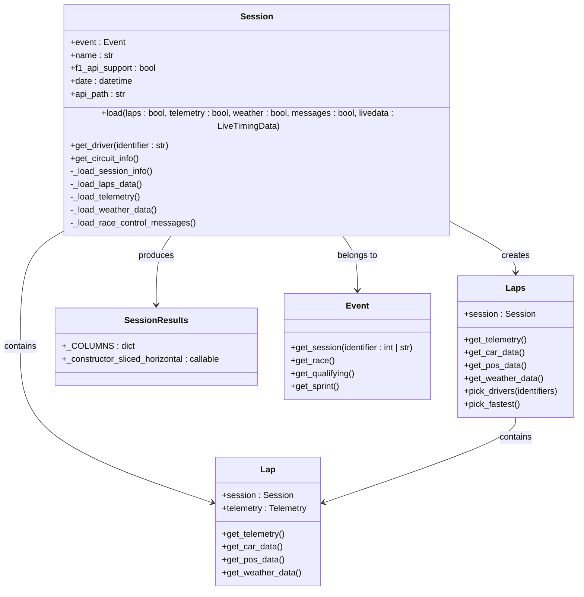
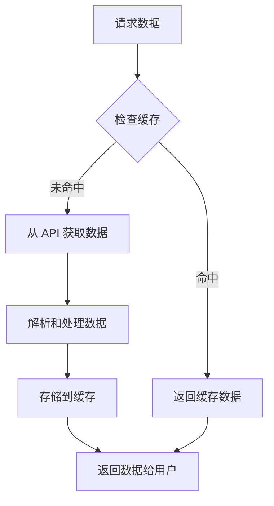
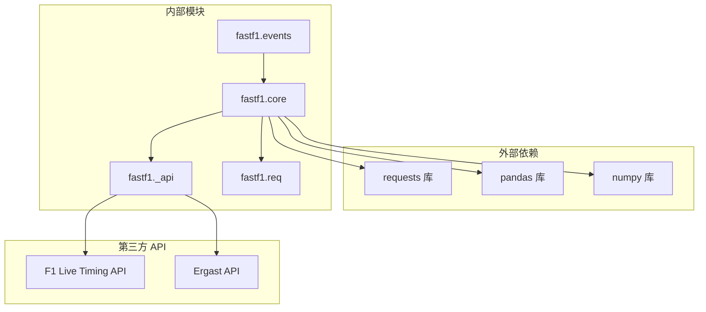

# 会话管理 API

<cite>
**本文档引用的文件**
- [core.py](file://fastf1/core.py)
- [events.py](file://fastf1/events.py)
- [session.rst](file://docs/api_reference/session.rst)
- [_api.py](file://fastf1/_api.py)
</cite>

## 目录
1. [简介](#简介)
2. [项目结构](#项目结构)
3. [核心组件](#核心组件)
4. [架构概览](#架构概览)
5. [详细组件分析](#详细组件分析)
6. [依赖关系分析](#依赖关系分析)
7. [性能考虑](#性能考虑)
8. [故障排除指南](#故障排除指南)
9. [结论](#结论)

## 简介

Fast-F1 是一个用于访问和处理一级方程式（F1）数据的 Python 库。Session 类是该库的核心组件之一，代表特定的比赛、排位赛、冲刺赛或其他 F1 会话及其相关数据。

本文件提供了 Session 类的详细 API 参考文档，包括：
- Session 类的所有公共方法、属性和构造函数的完整参考信息
- 会话对象的创建、配置和数据访问接口
- 核心方法如 get_session()、get_driver()、get_laps() 等的参数类型、返回值和使用示例
- 会话状态管理、数据加载机制和缓存策略的实现细节
- 实际代码示例展示如何正确使用会话 API 进行数据获取和操作

## 项目结构

Fast-F1 项目的整体架构围绕 Session 类构建，主要组件包括：



**图表来源**
- [core.py:1151-1225](file://fastf1/core.py#L1151-L1225)
- [events.py:950-1011](file://fastf1/events.py#L950-L1011)

**章节来源**
- [core.py:1151-1225](file://fastf1/core.py#L1151-L1225)
- [events.py:50-140](file://fastf1/events.py#L50-L140)

## 核心组件

### Session 类概述

Session 类是 Fast-F1 的核心类，代表一个具体的 F1 会话（比赛、排位赛、练习赛等）。它提供了访问会话特定数据的各种方法和属性。

#### 主要特性
- **数据加载**: 支持从多个数据源加载会话数据
- **状态管理**: 维护会话的状态信息和时间戳
- **结果计算**: 自动计算排位赛和比赛结果
- **缓存支持**: 集成缓存机制以提高性能
- **错误处理**: 提供软异常处理机制

#### 关键属性
- `event`: 关联的 Event 对象引用
- `name`: 会话名称（如 'Qualifying', 'Race', 'FP1'）
- `f1_api_support`: 是否支持官方 F1 API
- `date`: 会话日期
- `api_path`: API 基础路径
- `_session_info`: 会话信息字典

**章节来源**
- [core.py:1151-1225](file://fastf1/core.py#L1151-L1225)

## 架构概览

Session 类的架构设计体现了以下关键原则：



**图表来源**
- [core.py:1151-1225](file://fastf1/core.py#L1151-L1225)
- [core.py:2730-2832](file://fastf1/core.py#L2730-L2832)
- [core.py:3487-3502](file://fastf1/core.py#L3487-L3502)
- [core.py:3664-3780](file://fastf1/core.py#L3664-L3780)
- [events.py:950-1011](file://fastf1/events.py#L950-L1011)

## 详细组件分析

### Session 类详细参考

#### 构造函数
```python
def __init__(self, event, session_name, f1_api_support=False):
```

**参数说明:**
- `event`: Event 对象，关联的赛事对象
- `session_name`: str，会话名称（如 'Qualifying', 'Race'）
- `f1_api_support`: bool，是否支持官方 F1 API

**初始化过程:**
1. 设置事件引用和会话名称
2. 计算会话日期和 API 路径
3. 初始化内部数据结构（结果、laps、遥测数据等）
4. 设置会话类型常量（race-like 和 quali-like）

**章节来源**
- [core.py:1162-1225](file://fastf1/core.py#L1162-L1225)

#### 数据加载方法

##### load() 方法
```python
def load(self, *, laps: bool = True, telemetry: bool = True,
         weather: bool = True, messages: bool = True,
         livedata: LiveTimingData = None):
```

**功能:** 加载会话数据从支持的 API

**参数:**
- `laps`: bool，是否加载 laps 和会话状态数据
- `telemetry`: bool，是否加载遥测数据
- `weather`: bool，是否加载天气数据
- `messages`: bool，是否加载赛车控制消息
- `livedata`: LiveTimingData，本地保存的实时数据源

**加载流程:**
1. 加载会话信息和驱动程序结果
2. 根据 API 支持情况加载不同数据
3. 执行数据验证和修正
4. 计算会话结果

**章节来源**
- [core.py:1358-1445](file://fastf1/core.py#L1358-L1445)

##### 私有加载方法
- `_load_session_info()`: 加载会话信息
- `_load_laps_data()`: 加载 laps 数据
- `_load_telemetry()`: 加载遥测数据
- `_load_weather_data()`: 加载天气数据
- `_load_race_control_messages()`: 加载赛车控制消息

**章节来源**
- [core.py:1446-1445](file://fastf1/core.py#L1446-L1445)

#### 数据访问属性

##### 会话信息属性
```python
@property
def session_info(self) -> dict:
    """会话信息包括会议、会话、国家和赛道名称及 ID 键"""
    return self._get_property_warn_not_loaded('_session_info')
```

##### 驱动程序列表
```python
@property
def drivers(self):
    """所有参加此会话的驱动程序列表"""
    return list(self.results['DriverNumber'].unique())
```

##### 结果数据
```python
@property
def results(self) -> "SessionResults":
    """会话结果与驱动程序信息"""
    return self._get_property_warn_not_loaded('_results')
```

##### laps 数据
```python
@property
def laps(self) -> "Laps":
    """此会话中所有驱动程序完成的所有 laps"""
    return self._get_property_warn_not_loaded('_laps')
```

##### 天气数据
```python
@property
def weather_data(self):
    """会话的天气数据"""
    return self._get_property_warn_not_loaded('_weather_data')
```

##### 遥测数据
```python
@property
def car_data(self) -> "Telemetry":
    """按驱动程序编号分组的车辆遥测数据"""
    return self._get_property_warn_not_loaded('_car_data')

@property
def pos_data(self) -> "Telemetry":
    """按驱动程序编号分组的位置遥测数据"""
    return self._get_property_warn_not_loaded('_pos_data')
```

**章节来源**
- [core.py:1235-1356](file://fastf1/core.py#L1235-L1356)

#### 数据获取方法

##### get_driver() 方法
```python
def get_driver(self, identifier) -> "DriverResult":
    """
    获取包含驱动程序额外信息的驱动程序对象
    
    参数:
        identifier: str，驱动程序的三字母标识符或字符串格式的号码
    
    返回:
        DriverResult 实例
    """
```

**使用示例:**
```python
session = fastf1.get_session(2021, 'Monaco', 'Race')
session.load()
driver = session.get_driver('VER')  # 按缩写获取
driver = session.get_driver('44')   # 按号码获取
```

**章节来源**
- [core.py:2651-2667](file://fastf1/core.py#L2651-L2667)

##### get_circuit_info() 方法
```python
def get_circuit_info(self) -> CircuitInfo | None:
    """返回举办此赛事的赛道的额外信息"""
```

**章节来源**
- [core.py:2669-2692](file://fastf1/core.py#L2669-L2692)

### Laps 类详细参考

Laps 类继承自 BaseDataFrame，提供了对多 laps 数据的访问和操作功能。

#### 主要功能
- **数据筛选**: 按驱动程序、团队、轮胎化合物等筛选 laps
- **数据获取**: 获取特定 laps 的遥测数据
- **统计分析**: 快速 laps、准确 laps 等统计功能

#### 关键方法

##### get_telemetry() 方法
```python
def get_telemetry(self, *, frequency: int | Literal['original'] | None = None) -> Telemetry:
    """获取所有 laps 的遥测数据"""
```

##### get_car_data() 方法
```python
def get_car_data(self, **kwargs) -> Telemetry:
    """获取所有 laps 的车辆数据"""
```

##### get_pos_data() 方法
```python
def get_pos_data(self, **kwargs) -> Telemetry:
    """获取所有 laps 的位置数据"""
```

##### pick_drivers() 方法
```python
def pick_drivers(self, identifiers: int | str | Iterable[int | str]) -> "Laps":
    """根据驱动程序的三字母标识符或号码返回指定的 laps"""
```

##### pick_fastest() 方法
```python
def pick_fastest(self, only_by_time: bool = False) -> Optional["Lap"]:
    """返回最快 laps"""
```

**章节来源**
- [core.py:2862-3061](file://fastf1/core.py#L2862-L3061)
- [core.py:3133-3156](file://fastf1/core.py#L3133-L3156)
- [core.py:3198-3236](file://fastf1/core.py#L3198-L3236)

### 事件管理 API

#### get_session() 函数
```python
def get_session(year: int, gp: str | int, identifier: int | str | None = None,
               *, backend: Literal['fastf1', 'f1timing', 'ergast'] | None = None,
               exact_match: bool = False) -> Session:
```

**功能:** 基于年份、赛事名称和会话标识符创建 Session 对象

**参数说明:**
- `year`: int，锦标赛年份
- `gp`: str | int，赛事名称或轮数编号
- `identifier`: int | str | None，会话名称、缩写或编号
- `backend`: 选择特定的后端作为数据源
- `exact_match`: 精确匹配查询

**使用示例:**
```python
# 获取 2021 年第一场比赛的 FP2
session = fastf1.get_session(2021, 1, 'FP2')

# 获取 2020 年奥地利大奖赛的排位赛
session = fastf1.get_session(2020, 'Austria', 'Qualifying')

# 获取 2021 年第五场大奖赛的第三会话
session = fastf1.get_session(2021, 5, 3)
```

**章节来源**
- [events.py:50-138](file://fastf1/events.py#L50-L138)

#### get_testing_session() 函数
```python
def get_testing_session(year: int, test_number: int, session_number: int,
                       *, backend: Literal['fastf1', 'f1timing'] | None = None) -> Session:
```

**功能:** 基于年份、测试赛事编号和会话编号创建测试会话的 Session 对象

**章节来源**
- [events.py:141-172](file://fastf1/events.py#L141-L172)

### 数据加载机制

#### 缓存策略
Session 类集成了缓存机制来提高数据加载性能：



**图表来源**
- [core.py:1358-1445](file://fastf1/core.py#L1358-L1445)

#### 错误处理机制
Session 类使用软异常处理机制来确保数据加载的健壮性：

- `_get_property_warn_not_loaded()`: 当数据未加载时抛出 DataNotLoadedError
- 各种 `_load_*()` 方法使用 `@soft_exceptions` 装饰器进行异常处理
- 提供降级方案和警告信息

**章节来源**
- [core.py:1227-1233](file://fastf1/core.py#L1227-L1233)
- [core.py:1446-1448](file://fastf1/core.py#L1446-L1448)

## 依赖关系分析



**图表来源**
- [core.py:1-50](file://fastf1/core.py#L1-L50)
- [events.py:1-30](file://fastf1/events.py#L1-L30)
- [_api.py:1-30](file://fastf1/_api.py#L1-L30)

**章节来源**
- [core.py:1-50](file://fastf1/core.py#L1-L50)
- [events.py:1-30](file://fastf1/events.py#L1-L30)

## 性能考虑

### 数据加载优化
1. **延迟加载**: Session 对象创建时不立即加载所有数据，只有在需要时才加载
2. **缓存机制**: 使用缓存减少重复 API 请求
3. **批量处理**: 合并多个数据源的数据以提高准确性

### 内存管理
1. **分块处理**: 大型数据集按块处理以减少内存占用
2. **类型优化**: 使用适当的 pandas 数据类型以节省内存
3. **及时释放**: 不必要的中间变量及时清理

### 网络优化
1. **连接复用**: 复用 HTTP 连接以减少建立连接的开销
2. **压缩传输**: 支持 gzip 压缩以减少传输数据量
3. **超时设置**: 合理设置网络请求超时时间

## 故障排除指南

### 常见问题和解决方案

#### 数据未加载错误
**问题:** 尝试访问尚未加载的数据时出现错误
**解决方案:** 先调用 `session.load()` 方法加载所需数据

#### API 访问失败
**问题:** 无法从 F1 API 或 Ergast API 获取数据
**解决方案:** 
1. 检查网络连接
2. 验证 API 密钥（如果需要）
3. 尝试使用不同的后端
4. 检查 API 限制和配额

#### 数据不一致
**问题:** 不同数据源返回的数据存在差异
**解决方案:**
1. 检查数据合并逻辑
2. 验证数据完整性检查
3. 使用备用数据源

**章节来源**
- [core.py:1227-1233](file://fastf1/core.py#L1227-L1233)
- [core.py:2220-2318](file://fastf1/core.py#L2220-L2318)

## 结论

Session 类为 Fast-F1 提供了强大而灵活的会话数据管理能力。通过其丰富的 API 接口、智能的数据加载机制和完善的错误处理，开发者可以轻松地访问和分析 F1 会话数据。

### 主要优势
1. **模块化设计**: 清晰的类层次结构和职责分离
2. **灵活性**: 支持多种数据源和加载选项
3. **性能优化**: 缓存机制和延迟加载策略
4. **错误处理**: 健壮的异常处理和降级机制
5. **扩展性**: 易于添加新的数据源和功能

### 最佳实践建议
1. **按需加载**: 只加载需要的数据以提高性能
2. **错误处理**: 始终处理可能的数据加载异常
3. **缓存利用**: 合理使用缓存机制减少 API 调用
4. **数据验证**: 在使用数据前进行基本的完整性检查
5. **资源管理**: 及时释放不需要的大数据对象

通过遵循这些指导原则，开发者可以充分利用 Session 类的功能来构建高效、可靠的 F1 数据分析应用。