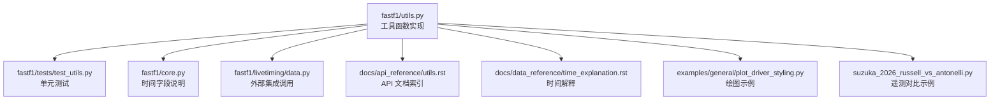
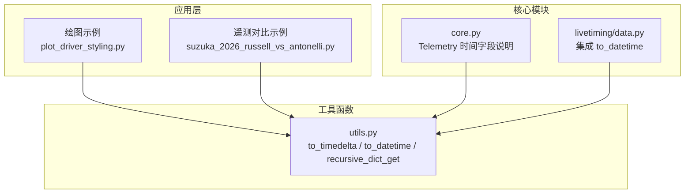
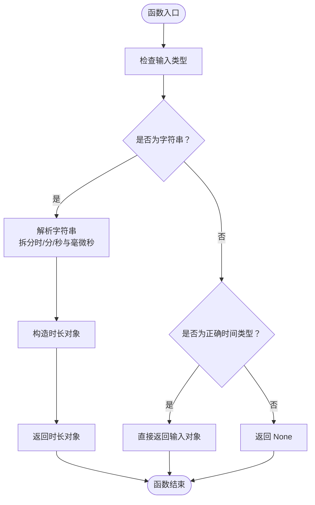
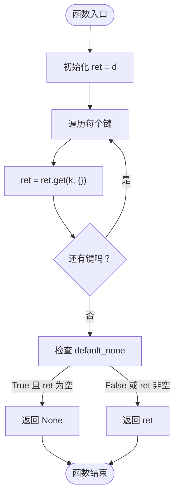
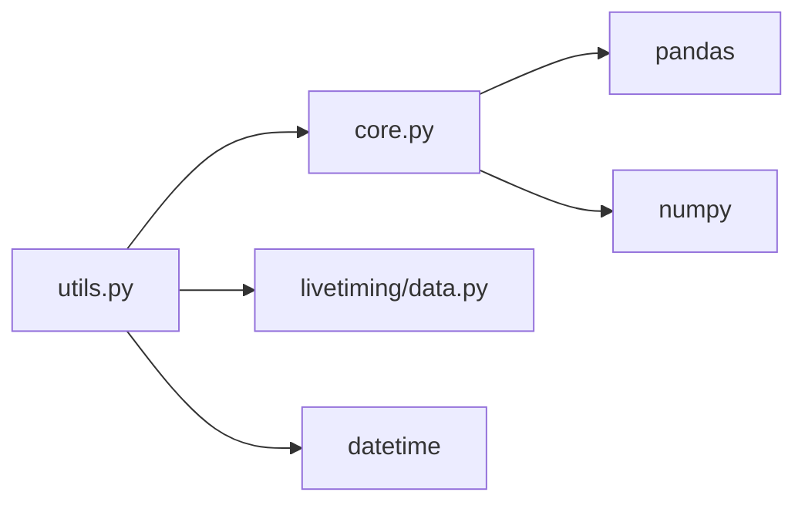

# 实用工具函数 API

<cite>
**本文引用的文件**
- [fastf1/utils.py](file://fastf1/utils.py)
- [fastf1/tests/test_utils.py](file://fastf1/tests/test_utils.py)
- [fastf1/core.py](file://fastf1/core.py)
- [docs/api_reference/utils.rst](file://docs/api_reference/utils.rst)
- [docs/data_reference/time_explanation.rst](file://docs/data_reference/time_explanation.rst)
- [examples/general/plot_driver_styling.py](file://examples/general/plot_driver_styling.py)
- [suzuka_2026_russell_vs_antonelli.py](file://suzuka_2026_russell_vs_antonelli.py)
- [fastf1/livetiming/data.py](file://fastf1/livetiming/data.py)
</cite>

## 目录
1. [简介](#简介)
2. [项目结构](#项目结构)
3. [核心组件](#核心组件)
4. [架构总览](#架构总览)
5. [详细组件分析](#详细组件分析)
6. [依赖分析](#依赖分析)
7. [性能考虑](#性能考虑)
8. [故障排查指南](#故障排查指南)
9. [结论](#结论)
10. [附录](#附录)

## 简介
本文件为 FastF1 项目中“实用工具函数”的 API 参考与使用指南，聚焦于数据处理、格式转换、时间转换与解析、字典递归访问等常用工具能力。内容覆盖：
- 时间与日期解析：将字符串快速转换为标准时间对象或时长对象
- 字典递归访问：安全地按层级键链取值
- 数据预处理与格式标准化：结合示例展示如何在数据加载、绘图与分析中使用这些工具

## 项目结构
与实用工具函数相关的关键位置如下：
- 工具函数实现：fastf1/utils.py
- 单元测试：fastf1/tests/test_utils.py
- 核心类型与时间概念：fastf1/core.py（包含 Telemetry 的时间字段说明）
- 文档索引与说明：docs/api_reference/utils.rst、docs/data_reference/time_explanation.rst
- 使用示例：examples/general/plot_driver_styling.py、suzuka_2026_russell_vs_antonelli.py
- 外部集成点：fastf1/livetiming/data.py 中对 to_datetime 的调用

图表来源
- [fastf1/utils.py:1-229](file://fastf1/utils.py#L1-L229)
- [fastf1/tests/test_utils.py:1-51](file://fastf1/tests/test_utils.py#L1-L51)
- [fastf1/core.py:64-200](file://fastf1/core.py#L64-L200)
- [fastf1/livetiming/data.py:193-228](file://fastf1/livetiming/data.py#L193-L228)
- [docs/api_reference/utils.rst:1-7](file://docs/api_reference/utils.rst#L1-L7)
- [docs/data_reference/time_explanation.rst:1-51](file://docs/data_reference/time_explanation.rst#L1-L51)
- [examples/general/plot_driver_styling.py:1-108](file://examples/general/plot_driver_styling.py#L1-L108)
- [suzuka_2026_russell_vs_antonelli.py:1-130](file://suzuka_2026_russell_vs_antonelli.py#L1-L130)

章节来源
- [fastf1/utils.py:1-229](file://fastf1/utils.py#L1-L229)
- [fastf1/tests/test_utils.py:1-51](file://fastf1/tests/test_utils.py#L1-L51)
- [fastf1/core.py:64-200](file://fastf1/core.py#L64-L200)
- [docs/api_reference/utils.rst:1-7](file://docs/api_reference/utils.rst#L1-L7)
- [docs/data_reference/time_explanation.rst:1-51](file://docs/data_reference/time_explanation.rst#L1-L51)
- [examples/general/plot_driver_styling.py:1-108](file://examples/general/plot_driver_styling.py#L1-L108)
- [suzuka_2026_russell_vs_antonelli.py:1-130](file://suzuka_2026_russell_vs_antonelli.py#L1-L130)

## 核心组件
本节概述工具函数模块提供的公共接口及其职责。

- 时间与日期解析
  - to_timedelta：从字符串或已有时长对象解析为标准时长对象；支持多种格式（秒、分秒、时分秒及毫微秒精度）
  - to_datetime：从字符串或已有时钟对象解析为标准日期时间对象；支持带/不带尾缀 Z 的 ISO 格式及毫微秒精度
- 字典递归访问
  - recursive_dict_get：按任意数量的键链安全取值，遇缺失键可返回空字典或 None

章节来源
- [fastf1/utils.py:111-229](file://fastf1/utils.py#L111-L229)

## 架构总览
工具函数在系统中的角色与交互如下：

图表来源
- [fastf1/utils.py:111-229](file://fastf1/utils.py#L111-L229)
- [fastf1/core.py:64-200](file://fastf1/core.py#L64-L200)
- [fastf1/livetiming/data.py:193-228](file://fastf1/livetiming/data.py#L193-L228)
- [examples/general/plot_driver_styling.py:1-108](file://examples/general/plot_driver_styling.py#L1-L108)
- [suzuka_2026_russell_vs_antonelli.py:1-130](file://suzuka_2026_russell_vs_antonelli.py#L1-L130)

## 详细组件分析

### 组件一：时间与日期解析（to_timedelta / to_datetime）

- 函数概览
  - to_timedelta：将字符串或已有时长对象解析为标准时长对象；当输入为字符串时，支持多种格式（含可选小时/分钟/秒、毫秒/微秒，且微秒位数可变）
  - to_datetime：将字符串或已有时钟对象解析为标准日期时间对象；支持 ISO 日期时间格式，可选尾缀 Z，以及毫秒/微秒精度

- 参数与返回
  - to_timedelta
    - 参数：x（字符串或 datetime.timedelta）
    - 返回：datetime.timedelta 或 None（解析失败时）
  - to_datetime
    - 参数：x（字符串或 datetime.datetime）
    - 返回：datetime.datetime 或 None（解析失败时）

- 典型用法场景
  - 将字符串形式的持续时间转换为时长对象，便于后续计算与比较
  - 解析来自外部数据源的时间戳字符串，统一为标准时间对象

- 错误处理
  - 输入非字符串且非对应时间类型时，返回 None
  - 解析异常会被记录日志并返回 None

- 性能与复杂度
  - 字符串解析为 O(n)，n 为字符串长度；整体为线性复杂度
  - 与 pandas 的字符串解析相比，采用手工拆分与构造，避免额外开销

- 使用示例（路径）
  - 绘图示例中对 timedelta 的使用：[plot_driver_styling.py:13-15](file://examples/general/plot_driver_styling.py#L13-L15)
  - 遥测对比示例中对时间差的计算：[suzuka_2026_russell_vs_antonelli.py:35-54](file://suzuka_2026_russell_vs_antonelli.py#L35-L54)

- 测试覆盖
  - 单元测试覆盖了多种输入格式与期望输出，确保解析正确性：[test_utils.py:9-50](file://fastf1/tests/test_utils.py#L9-L50)

图表来源
- [fastf1/utils.py:121-177](file://fastf1/utils.py#L121-L177)

章节来源
- [fastf1/utils.py:121-177](file://fastf1/utils.py#L121-L177)
- [fastf1/tests/test_utils.py:9-50](file://fastf1/tests/test_utils.py#L9-L50)
- [examples/general/plot_driver_styling.py:13-15](file://examples/general/plot_driver_styling.py#L13-L15)
- [suzuka_2026_russell_vs_antonelli.py:35-54](file://suzuka_2026_russell_vs_antonelli.py#L35-L54)

### 组件二：字典递归访问（recursive_dict_get）

- 函数概览
  - 支持传入任意数量的键，按顺序逐层取值；若某一层不存在，则返回空字典或 None（取决于参数）

- 参数与返回
  - 参数：d（字典）、*keys（键序列）、default_none（布尔，控制缺失时返回 None）
  - 返回：目标值、空字典或 None

- 典型用法场景
  - 从嵌套结构的数据中安全取值，避免 KeyError
  - 在外部数据接入（如直播数据）中，对可能缺失的字段进行容错处理

- 使用示例（路径）
  - 直播数据中对状态字段的取值：[livetiming/data.py:196-215](file://fastf1/livetiming/data.py#L196-L215)

图表来源
- [fastf1/utils.py:111-118](file://fastf1/utils.py#L111-L118)

章节来源
- [fastf1/utils.py:111-118](file://fastf1/utils.py#L111-L118)
- [fastf1/livetiming/data.py:196-215](file://fastf1/livetiming/data.py#L196-L215)

### 组件三：时间字段与 Telemetry（辅助理解 API 使用）

- Telemetry 的时间字段
  - Date：绝对 UTC 时间戳
  - Time：相对当前数据集第一个样本的时间
  - SessionTime：自会话开始起的相对时间
  - 这些字段在绘图与数据分析中常用于坐标轴与标注

- 使用建议
  - 绘图前启用 timedelta 支持，确保时间类数据正确显示
  - 对于跨数据集的时间对齐，优先使用 SessionTime 或 Date

章节来源
- [fastf1/core.py:64-200](file://fastf1/core.py#L64-L200)
- [docs/data_reference/time_explanation.rst:12-38](file://docs/data_reference/time_explanation.rst#L12-L38)
- [examples/general/plot_driver_styling.py:13-15](file://examples/general/plot_driver_styling.py#L13-L15)

## 依赖分析
- 内部依赖
  - 工具函数被核心模块与外部集成模块使用
  - 核心模块（Telemetry）依赖 to_timedelta 进行时间相关计算
  - 直播数据模块（LiveTimingData）依赖 to_datetime 设置会话起始时间

- 外部依赖
  - NumPy、Pandas、Python 标准库 datetime

图表来源
- [fastf1/utils.py:1-229](file://fastf1/utils.py#L1-L229)
- [fastf1/core.py:16-38](file://fastf1/core.py#L16-L38)
- [fastf1/livetiming/data.py:193-228](file://fastf1/livetiming/data.py#L193-L228)

章节来源
- [fastf1/utils.py:1-229](file://fastf1/utils.py#L1-L229)
- [fastf1/core.py:16-38](file://fastf1/core.py#L16-L38)
- [fastf1/livetiming/data.py:193-228](file://fastf1/livetiming/data.py#L193-L228)

## 性能考虑
- to_timedelta/to_datetime
  - 手工解析字符串，避免额外的 Pandas 解析开销，适合高频调用
  - 字符串解析为线性复杂度，输入规模较大时仍具备良好性能
- recursive_dict_get
  - 通过 reduce 与字典 get 实现，时间复杂度与键链长度成正比，适合一般嵌套结构的取值

## 故障排查指南
- 解析失败返回 None
  - to_timedelta/to_datetime 在解析异常时会记录日志并返回 None，需在外层进行判空处理
- Series 上调用 total_seconds
  - 示例中展示了对 Series 的取值与 total_seconds 的使用方式，注意先取标量再调用方法
- 时间字段差异
  - Telemetry 的 Date、Time、SessionTime 含义不同，绘图与对齐时应根据需求选择合适字段

章节来源
- [fastf1/utils.py:167-170](file://fastf1/utils.py#L167-L170)
- [draft/报错.txt:18-30](file://draft/报错.txt#L18-L30)
- [docs/data_reference/time_explanation.rst:12-38](file://docs/data_reference/time_explanation.rst#L12-L38)

## 结论
- 工具函数模块提供了高效、稳定的字符串到时间/时长解析能力，并支持安全的嵌套字典取值
- 建议在数据预处理阶段统一时间格式，在绘图与分析中充分利用 Telemetry 的时间字段语义
- 对于外部数据接入，优先使用 recursive_dict_get 与 to_datetime 进行容错处理

## 附录

### API 参考速览
- to_timedelta(x: str | timedelta) -> timedelta | None
  - 用途：将字符串或已有时长对象解析为标准时长对象
  - 返回：解析成功则返回时长对象，否则返回 None
  - 示例路径：[test_utils.py:9-29](file://fastf1/tests/test_utils.py#L9-L29)
- to_datetime(x: str | datetime) -> datetime | None
  - 用途：将字符串或已有时钟对象解析为标准日期时间对象
  - 返回：解析成功则返回日期时间对象，否则返回 None
  - 示例路径：[test_utils.py:32-50](file://fastf1/tests/test_utils.py#L32-L50)
- recursive_dict_get(d: dict, *keys: str, default_none: bool = False) -> dict | any | None
  - 用途：按键链安全取值，遇缺失可返回空字典或 None
  - 示例路径：[livetiming/data.py:196-215](file://fastf1/livetiming/data.py#L196-L215)

### 使用示例路径
- 绘图中启用 timedelta 支持与绘制：[plot_driver_styling.py:13-15](file://examples/general/plot_driver_styling.py#L13-L15)
- 遥测对比与时间差计算：[suzuka_2026_russell_vs_antonelli.py:35-54](file://suzuka_2026_russell_vs_antonelli.py#L35-L54)