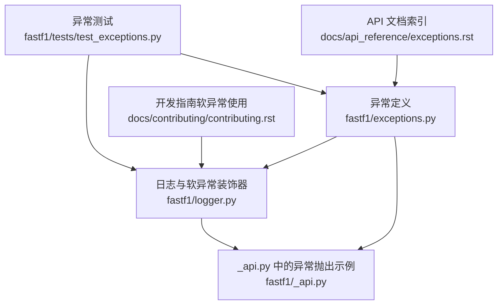
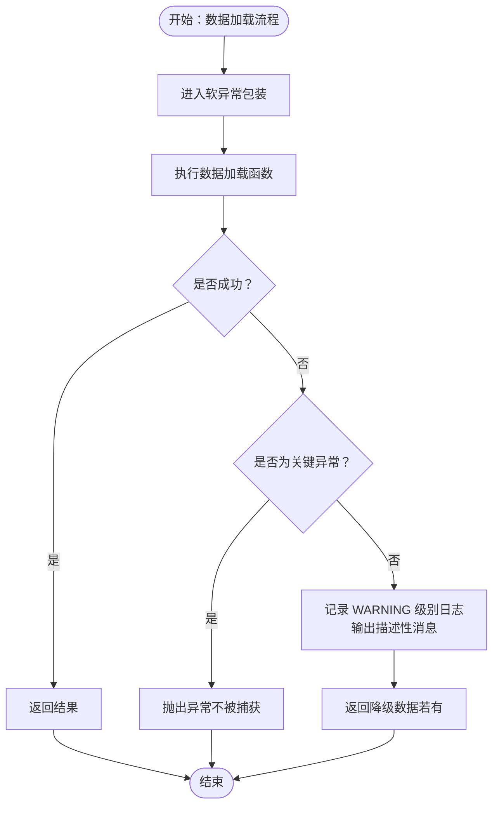
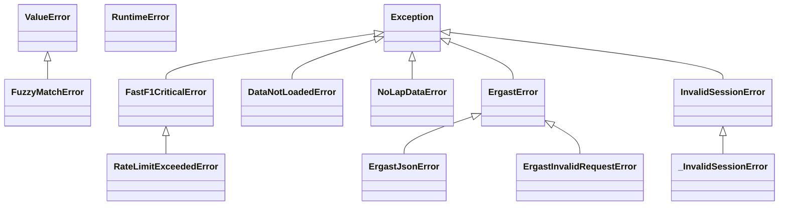
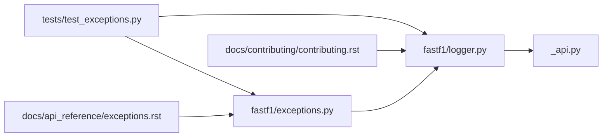

# 异常处理 API

<cite>
**本文引用的文件**
- [fastf1/exceptions.py](file://fastf1/exceptions.py)
- [fastf1/logger.py](file://fastf1/logger.py)
- [fastf1/_api.py](file://fastf1/_api.py)
- [fastf1/tests/test_exceptions.py](file://fastf1/tests/test_exceptions.py)
- [docs/api_reference/exceptions.rst](file://docs/api_reference/exceptions.rst)
- [docs/contributing/contributing.rst](file://docs/contributing/contributing.rst)
</cite>

## 目录
1. [简介](#简介)
2. [项目结构](#项目结构)
3. [核心组件](#核心组件)
4. [架构总览](#架构总览)
5. [详细组件分析](#详细组件分析)
6. [依赖关系分析](#依赖关系分析)
7. [性能考量](#性能考量)
8. [故障排查指南](#故障排查指南)
9. [结论](#结论)
10. [附录](#附录)

## 简介
本文件为 Fast-F1 的异常处理机制提供完整的 API 参考与实践指南。重点覆盖以下内容：
- 自定义异常类的分类、触发条件与处理建议
- 异常捕获、错误信息获取与异常链传递
- 常见错误的诊断方法与解决方案
- 实际代码示例路径（以源码路径代替具体代码片段）

## 项目结构
异常处理相关的核心模块与文档如下：
- 异常定义：fastf1/exceptions.py
- 日志与软异常装饰器：fastf1/logger.py
- API 层异常抛出示例：fastf1/_api.py
- 测试用例：fastf1/tests/test_exceptions.py
- 文档索引：docs/api_reference/exceptions.rst
- 开发指南（含软异常使用说明）：docs/contributing/contributing.rst

图表来源
- [fastf1/exceptions.py:1-104](file://fastf1/exceptions.py#L1-L104)
- [fastf1/logger.py:1-125](file://fastf1/logger.py#L1-L125)
- [fastf1/_api.py:1825-1836](file://fastf1/_api.py#L1825-L1836)
- [fastf1/tests/test_exceptions.py:1-127](file://fastf1/tests/test_exceptions.py#L1-L127)
- [docs/api_reference/exceptions.rst:1-50](file://docs/api_reference/exceptions.rst#L1-L50)
- [docs/contributing/contributing.rst:383-431](file://docs/contributing/contributing.rst#L383-L431)

章节来源
- [fastf1/exceptions.py:1-104](file://fastf1/exceptions.py#L1-L104)
- [fastf1/logger.py:1-125](file://fastf1/logger.py#L1-L125)
- [fastf1/_api.py:1825-1836](file://fastf1/_api.py#L1825-L1836)
- [fastf1/tests/test_exceptions.py:1-127](file://fastf1/tests/test_exceptions.py#L1-L127)
- [docs/api_reference/exceptions.rst:1-50](file://docs/api_reference/exceptions.rst#L1-L50)
- [docs/contributing/contributing.rst:383-431](file://docs/contributing/contributing.rst#L383-L431)

## 核心组件
- 异常基类与分类
  - 非关键异常（可被软异常捕获并转为警告）
  - 关键异常（不可恢复，总是向上抛出）
- 软异常装饰器：在数据加载等可选流程中统一捕获异常并记录日志
- 典型异常类
  - 数据未加载：DataNotLoadedError
  - 模糊匹配失败：FuzzyMatchError
  - 无可用 lap 数据：NoLapDataError
  - Jolpica-F1（Ergast）相关：ErgastError、ErgastJsonError、ErgastInvalidRequestError
  - 关键异常：FastF1CriticalError、RateLimitExceededError
  - 已弃用异常：InvalidSessionError（保留兼容性）

章节来源
- [fastf1/exceptions.py:40-86](file://fastf1/exceptions.py#L40-L86)
- [fastf1/exceptions.py:88-104](file://fastf1/exceptions.py#L88-L104)
- [fastf1/logger.py:86-125](file://fastf1/logger.py#L86-L125)

## 架构总览
异常处理分层策略：
- 接口层：短时、有限作用域的操作；异常直接暴露给用户
- 数据处理层：长流程、多步骤的数据加载与处理；采用“软异常”策略，将非关键错误转换为警告并返回降级数据
- 关键异常：硬限制（如速率限制）或不可恢复错误，绕过软异常捕获，直接向上抛出

图表来源
- [fastf1/logger.py:86-125](file://fastf1/logger.py#L86-L125)
- [fastf1/exceptions.py:75-86](file://fastf1/exceptions.py#L75-L86)

## 详细组件分析

### 异常类参考与使用场景

- DataNotLoadedError
  - 触发条件：尝试访问尚未加载的数据
  - 处理建议：先调用加载流程（如 Session.load），再访问数据
  - 参考路径：[fastf1/exceptions.py:40-43](file://fastf1/exceptions.py#L40-L43)

- FuzzyMatchError
  - 触发条件：模糊匹配无法找到足够置信度的结果
  - 处理建议：提供更明确的输入参数或检查候选列表
  - 参考路径：[fastf1/exceptions.py:67-71](file://fastf1/exceptions.py#L67-L71)

- NoLapDataError
  - 触发条件：请求成功但处理后无可用 lap 数据
  - 处理建议：确认会话状态、数据可用性，必要时改用其他数据源
  - 参考路径：[fastf1/exceptions.py:57-65](file://fastf1/exceptions.py#L57-L65)

- ErgastError/ErgastJsonError/ErgastInvalidRequestError
  - 触发条件：与 Jolpica-F1（Ergast）接口交互时的错误
  - 处理建议：检查请求格式、网络连通性与响应解析
  - 参考路径：[fastf1/exceptions.py:45-55](file://fastf1/exceptions.py#L45-L55)

- FastF1CriticalError/RateLimitExceededError
  - 触发条件：内部数据处理不可恢复错误或硬性速率限制超限
  - 处理建议：停止继续请求、等待冷却时间或调整请求策略
  - 参考路径：[fastf1/exceptions.py:75-86](file://fastf1/exceptions.py#L75-L86)

- InvalidSessionError（已弃用）
  - 触发条件：历史遗留逻辑（当前版本不再使用）
  - 处理建议：避免依赖该异常；使用新接口
  - 参考路径：[fastf1/exceptions.py:91-104](file://fastf1/exceptions.py#L91-L104)

章节来源
- [fastf1/exceptions.py:40-104](file://fastf1/exceptions.py#L40-L104)

### 软异常装饰器与异常捕获流程

- 功能概述
  - 将任意函数包裹在统一的异常捕获中
  - 默认行为：捕获所有异常并记录 WARNING 日志，保留降级可用数据
  - 关键异常：FastF1CriticalError 子类强制上抛
  - 调试模式：通过环境变量或标志位禁用自动捕获，便于调试

- 关键参数
  - descr_name：描述性名称，用于日志上下文
  - msg：向用户显示的简要错误消息
  - logger：当前模块的日志器实例

- 行为验证（测试）
  - 非关键异常被捕获并记录警告
  - 关键异常（FastF1CriticalError 子类）仍被抛出且不记录警告

参考路径
- [fastf1/logger.py:86-125](file://fastf1/logger.py#L86-L125)
- [fastf1/tests/test_exceptions.py:85-127](file://fastf1/tests/test_exceptions.py#L85-L127)
- [docs/contributing/contributing.rst:405-431](file://docs/contributing/contributing.rst#L405-L431)

章节来源
- [fastf1/logger.py:86-125](file://fastf1/logger.py#L86-L125)
- [fastf1/tests/test_exceptions.py:85-127](file://fastf1/tests/test_exceptions.py#L85-L127)
- [docs/contributing/contributing.rst:405-431](file://docs/contributing/contributing.rst#L405-L431)

### API 层异常抛出示例

- SessionNotAvailableError
  - 抛出位置：当 Livetiming API 返回空数据时
  - 处理建议：检查会话是否存在、是否已取消或尚未开始
  - 参考路径：[fastf1/_api.py:1825-1836](file://fastf1/_api.py#L1825-L1836)

章节来源
- [fastf1/_api.py:1825-1836](file://fastf1/_api.py#L1825-L1836)

### 异常链与错误信息获取

- 异常链传递
  - 软异常装饰器对捕获到的异常进行重新抛出，保持原始异常链
  - 关键异常（FastF1CriticalError 子类）直接上抛，不被包装

- 错误信息获取
  - 使用日志器记录 WARNING 级别的消息与 DEBUG 级别的堆栈追踪
  - 堆栈追踪前缀包含“失败的描述性名称”，便于定位问题来源

参考路径
- [fastf1/logger.py:110-120](file://fastf1/logger.py#L110-L120)

章节来源
- [fastf1/logger.py:110-120](file://fastf1/logger.py#L110-L120)

### 类图：异常层次结构

图表来源
- [fastf1/exceptions.py:40-104](file://fastf1/exceptions.py#L40-L104)

## 依赖关系分析

图表来源
- [fastf1/exceptions.py:1-104](file://fastf1/exceptions.py#L1-L104)
- [fastf1/logger.py:1-125](file://fastf1/logger.py#L1-L125)
- [fastf1/_api.py:1-200](file://fastf1/_api.py#L1-L200)
- [fastf1/tests/test_exceptions.py:1-127](file://fastf1/tests/test_exceptions.py#L1-L127)
- [docs/api_reference/exceptions.rst:1-50](file://docs/api_reference/exceptions.rst#L1-L50)
- [docs/contributing/contributing.rst:383-431](file://docs/contributing/contributing.rst#L383-L431)

章节来源
- [fastf1/exceptions.py:1-104](file://fastf1/exceptions.py#L1-L104)
- [fastf1/logger.py:1-125](file://fastf1/logger.py#L1-L125)
- [fastf1/_api.py:1-200](file://fastf1/_api.py#L1-L200)
- [fastf1/tests/test_exceptions.py:1-127](file://fastf1/tests/test_exceptions.py#L1-L127)
- [docs/api_reference/exceptions.rst:1-50](file://docs/api_reference/exceptions.rst#L1-L50)
- [docs/contributing/contributing.rst:383-431](file://docs/contributing/contributing.rst#L383-L431)

## 性能考量
- 软异常捕获会增加少量异常处理开销，但换来更好的健壮性与用户体验
- 在高频数据加载场景中，建议合理设置日志级别，避免过多 DEBUG 级日志影响性能
- 对于关键异常（如速率限制），应立即终止后续请求，避免浪费资源

## 故障排查指南

- 如何启用/禁用软异常捕获
  - 环境变量：设置 FASTF1_DEBUG=1 后，调试模式开启，软异常装饰器不会捕获异常
  - 参考路径：[fastf1/logger.py:57-62](file://fastf1/logger.py#L57-L62)

- 如何获取错误详情
  - 查看 WARNING 级别的错误消息与 DEBUG 级别的堆栈追踪
  - 参考路径：[fastf1/logger.py:116-119](file://fastf1/logger.py#L116-L119)

- 常见错误与处理建议
  - 会话无数据：检查会话状态与 API 返回，必要时重试或切换数据源
    - 参考路径：[fastf1/_api.py:1825-1836](file://fastf1/_api.py#L1825-L1836)
  - 速率限制：暂停请求，等待冷却或降低频率
    - 参考路径：[fastf1/exceptions.py:84-86](file://fastf1/exceptions.py#L84-L86)
  - 模糊匹配失败：提供更精确的输入或检查候选集
    - 参考路径：[fastf1/exceptions.py:67-71](file://fastf1/exceptions.py#L67-L71)

章节来源
- [fastf1/logger.py:57-62](file://fastf1/logger.py#L57-L62)
- [fastf1/logger.py:116-119](file://fastf1/logger.py#L116-L119)
- [fastf1/_api.py:1825-1836](file://fastf1/_api.py#L1825-L1836)
- [fastf1/exceptions.py:84-86](file://fastf1/exceptions.py#L84-L86)
- [fastf1/exceptions.py:67-71](file://fastf1/exceptions.py#L67-L71)

## 结论
Fast-F1 的异常处理体系通过“非关键异常软捕获 + 关键异常硬抛出”的双轨策略，在保证功能可用性的同时，确保不可恢复错误能够及时暴露。配合日志系统与软异常装饰器，开发者可以快速定位问题并采取相应措施。

## 附录

### API 使用示例（以路径代替代码）
- 使用软异常装饰器包装可选数据处理流程
  - 示例路径：[docs/contributing/contributing.rst:405-431](file://docs/contributing/contributing.rst#L405-L431)
- 断言软异常捕获并记录警告
  - 示例路径：[fastf1/tests/test_exceptions.py:85-103](file://fastf1/tests/test_exceptions.py#L85-L103)
- 断言关键异常绕过软异常捕获
  - 示例路径：[fastf1/tests/test_exceptions.py:105-127](file://fastf1/tests/test_exceptions.py#L105-L127)