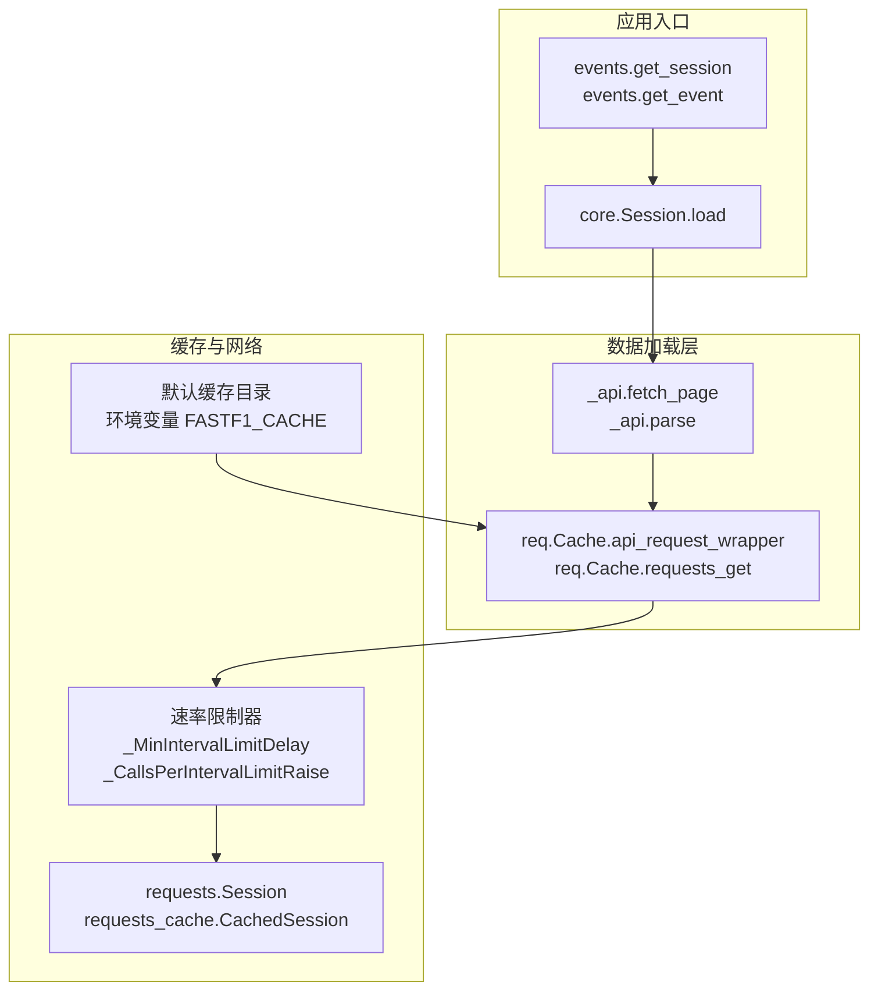
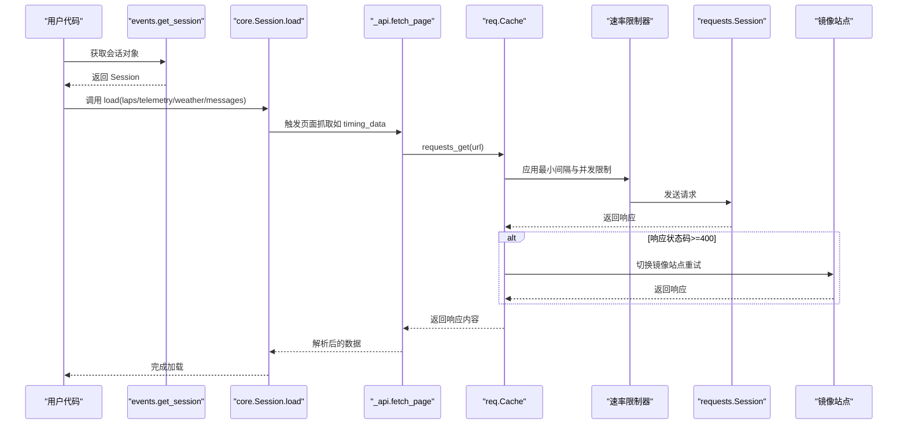
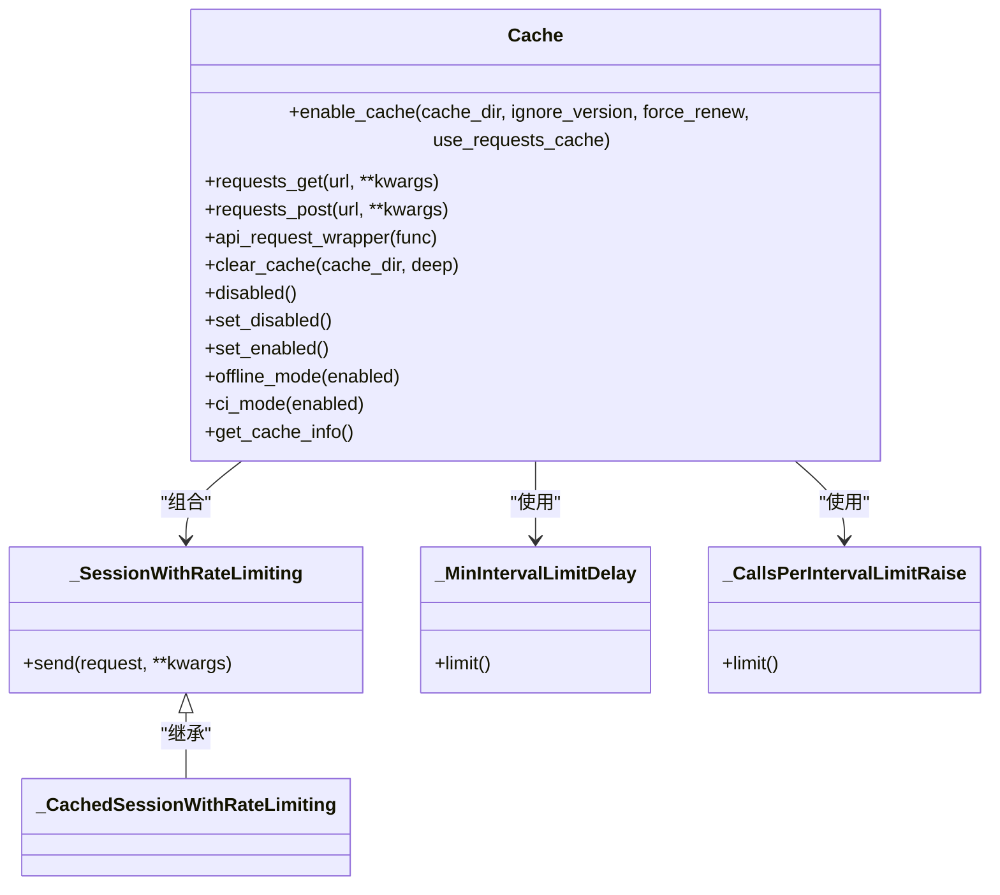
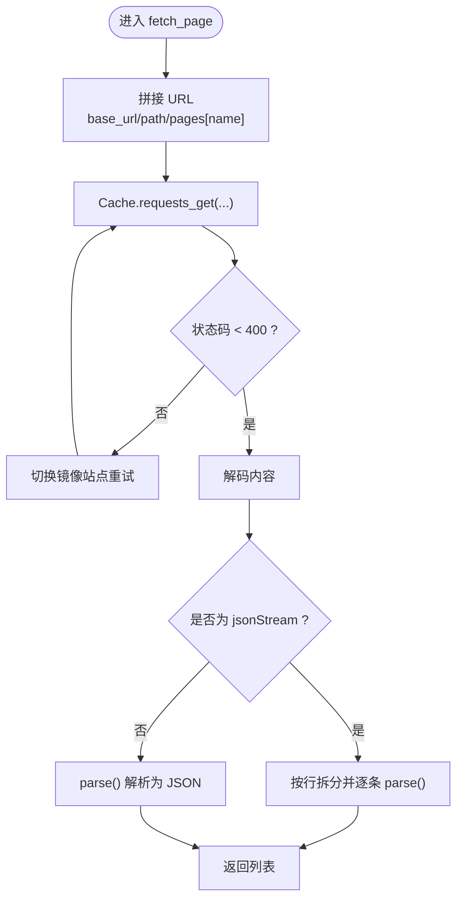
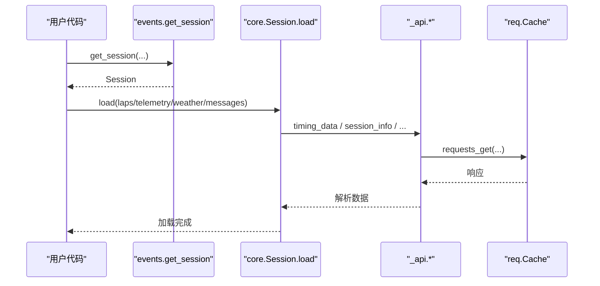
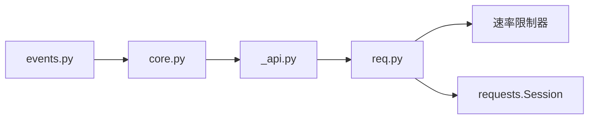

# 数据加载 API

<cite>
**本文引用的文件**
- [fastf1/req.py](file://fastf1/req.py)
- [fastf1/_api.py](file://fastf1/_api.py)
- [fastf1/api.py](file://fastf1/api.py)
- [fastf1/events.py](file://fastf1/events.py)
- [fastf1/core.py](file://fastf1/core.py)
- [fastf1/utils.py](file://fastf1/utils.py)
- [docs/api_reference/loading_data.rst](file://docs/api_reference/loading_data.rst)
</cite>

## 目录
1. [简介](#简介)
2. [项目结构](#项目结构)
3. [核心组件](#核心组件)
4. [架构总览](#架构总览)
5. [详细组件分析](#详细组件分析)
6. [依赖分析](#依赖分析)
7. [性能考量](#性能考量)
8. [故障排查指南](#故障排查指南)
9. [结论](#结论)
10. [附录](#附录)

## 简介
本文件面向数据加载与网络请求功能，提供完整的 API 参考与使用说明。重点覆盖以下方面：
- 数据获取：requests.get() 包装器、缓存包装器、页面数据抓取与解析流程
- 缓存策略：阶段一（HTTP 请求缓存）、阶段二（解析后数据缓存）、离线模式、CI 模式
- 网络请求：速率限制、最小间隔、并发限制、镜像回退
- 异步与批量：通过缓存与批处理提升效率；结合会话加载接口进行批量数据获取
- 错误重试与超时：镜像回退、异常捕获、软异常装饰器、速率限制异常

## 项目结构
围绕数据加载与网络请求的关键模块如下：
- 缓存与网络层：fastf1/req.py（缓存、速率限制、HTTP 包装）
- API 页面抓取与解析：fastf1/_api.py（页面枚举、fetch_page、parse）
- 公共 API 导出：fastf1/api.py（向外部暴露 API 函数）
- 事件与会话入口：fastf1/events.py（get_session 等）
- 会话加载主流程：fastf1/core.py（Session.load）
- 工具函数：fastf1/utils.py（时间转换等）

图表来源
- [fastf1/events.py:50-139](file://fastf1/events.py#L50-L139)
- [fastf1/core.py:1358-1444](file://fastf1/core.py#L1358-L1444)
- [fastf1/_api.py:106-1837](file://fastf1/_api.py#L106-L1837)
- [fastf1/req.py:83-113](file://fastf1/req.py#L83-L113)
- [fastf1/req.py:260-332](file://fastf1/req.py#L260-L332)

章节来源
- [fastf1/events.py:50-139](file://fastf1/events.py#L50-L139)
- [fastf1/core.py:1358-1444](file://fastf1/core.py#L1358-L1444)
- [fastf1/_api.py:106-1837](file://fastf1/_api.py#L106-L1837)
- [fastf1/req.py:83-113](file://fastf1/req.py#L83-L113)
- [fastf1/req.py:260-332](file://fastf1/req.py#L260-L332)

## 核心组件
- Cache.requests_get(url, **kwargs)
  - 功能：统一的 GET 请求入口，支持缓存与速率限制
  - 参数：url（字符串）、kwargs（传递给 requests 的参数）
  - 返回：requests.Response 或被缓存响应
  - 特性：默认启用缓存；CI 模式下可仅复用已缓存；镜像回退
- Cache.requests_post(url, **kwargs)
  - 功能：统一的 POST 请求入口，支持缓存与速率限制
  - 参数：url（字符串）、kwargs（传递给 requests 的参数）
  - 返回：requests.Response 或被缓存响应
- Cache.api_request_wrapper(func)
  - 功能：为 API 函数添加“阶段二”缓存（解析后数据缓存）
  - 行为：若缓存存在且有效则直接返回；否则下载并写入缓存
- fetch_page(path, name, response=None, livedata=None)
  - 功能：根据页面名从主站或镜像抓取数据，并按需解压解析
  - 参数：path（API 路径）、name（页面标识）、response/livedata（可选）
  - 返回：JSON 对象或 JSON 流列表（含时间戳）
  - 特性：自动镜像回退；流式数据特殊处理；压缩数据自动解码
- parse(text, zipped=False)
  - 功能：解析单条文本消息（JSON 或压缩文本）
  - 参数：text（字符串）、zipped（是否压缩）
  - 返回：字典或字符串
- Session.load(laps=True, telemetry=True, weather=True, messages=True, livedata=None)
  - 功能：按需加载会话数据（圈数据、遥测、天气、消息）
  - 行为：内部调用 API 函数并进行数据融合与修复

章节来源
- [fastf1/req.py:260-332](file://fastf1/req.py#L260-L332)
- [fastf1/req.py:396-469](file://fastf1/req.py#L396-L469)
- [fastf1/_api.py:106-1837](file://fastf1/_api.py#L106-L1837)
- [fastf1/core.py:1358-1444](file://fastf1/core.py#L1358-L1444)

## 架构总览
数据加载路径从事件/会话入口开始，经由会话加载主流程，最终落到页面抓取与解析层。缓存贯穿 HTTP 层与解析层，速率限制器保障请求节奏。

图表来源
- [fastf1/events.py:50-139](file://fastf1/events.py#L50-L139)
- [fastf1/core.py:1358-1444](file://fastf1/core.py#L1358-L1444)
- [fastf1/_api.py:1750-1790](file://fastf1/_api.py#L1750-L1790)
- [fastf1/req.py:83-113](file://fastf1/req.py#L83-L113)
- [fastf1/req.py:260-332](file://fastf1/req.py#L260-L332)

## 详细组件分析

### Cache 类与速率限制
- 速率限制器
  - 最小请求间隔：_MinIntervalLimitDelay(interval)
  - 每固定时间窗口最大请求数：_CallsPerIntervalLimitRaise(calls, interval, info)
- 会话级封装
  - _SessionWithRateLimiting：对 requests.Session.send 进行拦截，按 URL 模式匹配并应用限流
  - _CachedSessionWithRateLimiting：基于 requests_cache 的缓存会话
- 缓存策略
  - 阶段一：HTTP 请求缓存（sqlite，过期控制，stale-if-error）
  - 阶段二：解析后数据缓存（pickle，版本校验）
  - 离线模式：仅使用缓存，不发送真实请求
  - CI 模式：缓存复用但禁用解析缓存，确保测试一致性

图表来源
- [fastf1/req.py:83-113](file://fastf1/req.py#L83-L113)
- [fastf1/req.py:115-119](file://fastf1/req.py#L115-L119)
- [fastf1/req.py:46-80](file://fastf1/req.py#L46-L80)
- [fastf1/req.py:132-695](file://fastf1/req.py#L132-L695)

章节来源
- [fastf1/req.py:46-80](file://fastf1/req.py#L46-L80)
- [fastf1/req.py:83-113](file://fastf1/req.py#L83-L113)
- [fastf1/req.py:115-119](file://fastf1/req.py#L115-L119)
- [fastf1/req.py:132-695](file://fastf1/req.py#L132-L695)

### 页面抓取与解析流程
- 页面枚举与基础配置
  - base_url/base_url_mirror、headers、pages 映射
- fetch_page
  - 依据 pages[name] 拼接 URL，优先主站，失败则镜像回退
  - 流式数据（jsonStream）按行拆分并逐条解析
  - 压缩数据（.z）自动解压后再解析
- parse
  - 单条消息解析，支持压缩与 JSON 字符串

图表来源
- [fastf1/_api.py:1750-1790](file://fastf1/_api.py#L1750-L1790)
- [fastf1/_api.py:1793-1822](file://fastf1/_api.py#L1793-L1822)
- [fastf1/req.py:260-332](file://fastf1/req.py#L260-L332)

章节来源
- [fastf1/_api.py:1750-1790](file://fastf1/_api.py#L1750-L1790)
- [fastf1/_api.py:1793-1822](file://fastf1/_api.py#L1793-L1822)
- [fastf1/req.py:260-332](file://fastf1/req.py#L260-L332)

### 会话加载与数据获取
- 事件与会话入口
  - get_session/get_event/get_testing_session 提供会话对象
- 会话加载主流程
  - Session.load 根据参数选择性加载：圈数据、遥测、天气、消息
  - 内部调用 API 函数（如 timing_data、session_info、timing_app_data 等）
  - 数据融合与修复（如轮胎信息、首个计时圈修正等）

图表来源
- [fastf1/events.py:50-139](file://fastf1/events.py#L50-L139)
- [fastf1/core.py:1358-1444](file://fastf1/core.py#L1358-L1444)
- [fastf1/_api.py:106-1837](file://fastf1/_api.py#L106-L1837)
- [fastf1/req.py:260-332](file://fastf1/req.py#L260-L332)

章节来源
- [fastf1/events.py:50-139](file://fastf1/events.py#L50-L139)
- [fastf1/core.py:1358-1444](file://fastf1/core.py#L1358-L1444)
- [fastf1/_api.py:106-1837](file://fastf1/_api.py#L106-L1837)
- [fastf1/req.py:260-332](file://fastf1/req.py#L260-L332)

## 依赖分析
- 事件与会话入口依赖会话加载主流程
- 会话加载主流程依赖 API 页面抓取与解析
- API 页面抓取与解析依赖缓存与网络层
- 缓存与网络层依赖速率限制器与 requests/session

图表来源
- [fastf1/events.py:50-139](file://fastf1/events.py#L50-L139)
- [fastf1/core.py:1358-1444](file://fastf1/core.py#L1358-L1444)
- [fastf1/_api.py:106-1837](file://fastf1/_api.py#L106-L1837)
- [fastf1/req.py:83-113](file://fastf1/req.py#L83-L113)

章节来源
- [fastf1/events.py:50-139](file://fastf1/events.py#L50-L139)
- [fastf1/core.py:1358-1444](file://fastf1/core.py#L1358-L1444)
- [fastf1/_api.py:106-1837](file://fastf1/_api.py#L106-L1837)
- [fastf1/req.py:83-113](file://fastf1/req.py#L83-L113)

## 性能考量
- 缓存优先：启用缓存可显著降低网络请求与解析成本
- 速率限制：最小间隔与每小时上限避免触发服务端限流
- 镜像回退：在网络不稳定时自动切换镜像站点
- CI 模式：测试场景下复用缓存，保证稳定性与可重复性
- 离线模式：在弱网或断网环境下仅使用缓存数据

## 故障排查指南
- 速率限制异常
  - 现象：抛出 RateLimitExceededError
  - 排查：检查请求频率与时间窗口；适当增加间隔或减少并发
- 镜像回退
  - 现象：状态码 ≥ 400 自动切换镜像站点
  - 排查：确认主站可用性；必要时固定镜像站点
- 缓存版本不匹配
  - 现象：解析缓存失败并退出
  - 排查：清理缓存或使用 ignore_version=True（不推荐）
- 解析异常
  - 现象：parse 失败或流式消息解码错误
  - 排查：检查数据格式与压缩标志；确认网络传输完整性

章节来源
- [fastf1/req.py:46-80](file://fastf1/req.py#L46-L80)
- [fastf1/_api.py:1750-1790](file://fastf1/_api.py#L1750-L1790)
- [fastf1/_api.py:1793-1822](file://fastf1/_api.py#L1793-L1822)
- [fastf1/req.py:443-450](file://fastf1/req.py#L443-L450)

## 结论
本数据加载 API 以缓存与速率限制为核心设计，结合镜像回退与解析优化，实现了稳定高效的 F1 数据获取能力。通过 Session.load 与 API 页面抓取函数，用户可以灵活地按需加载数据，并在复杂网络环境中保持可靠性与性能。

## 附录
- 快速上手
  - 获取会话：使用 events.get_session 并调用 Session.load
  - 批量数据：通过缓存与离线模式减少重复请求
  - 测试场景：启用 CI 模式以复用缓存并保证一致性
- 相关文档入口
  - 加载数据 API 文档索引：参见 docs/api_reference/loading_data.rst

章节来源
- [docs/api_reference/loading_data.rst:1-25](file://docs/api_reference/loading_data.rst#L1-L25)