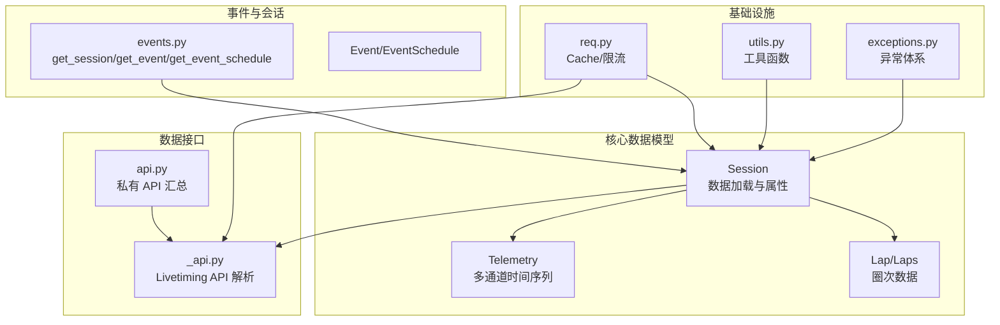
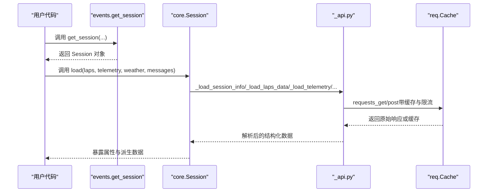
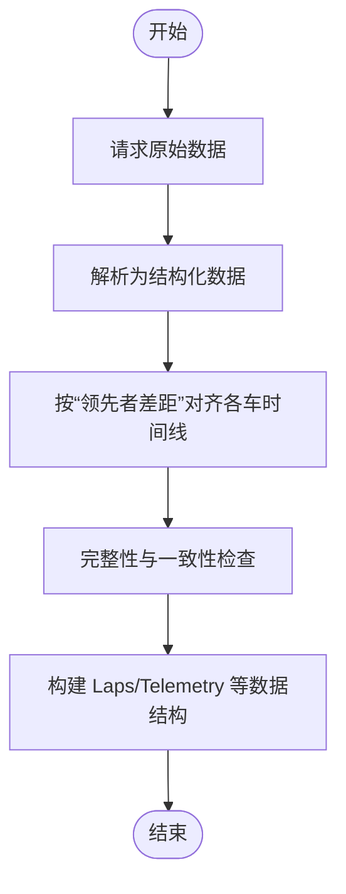
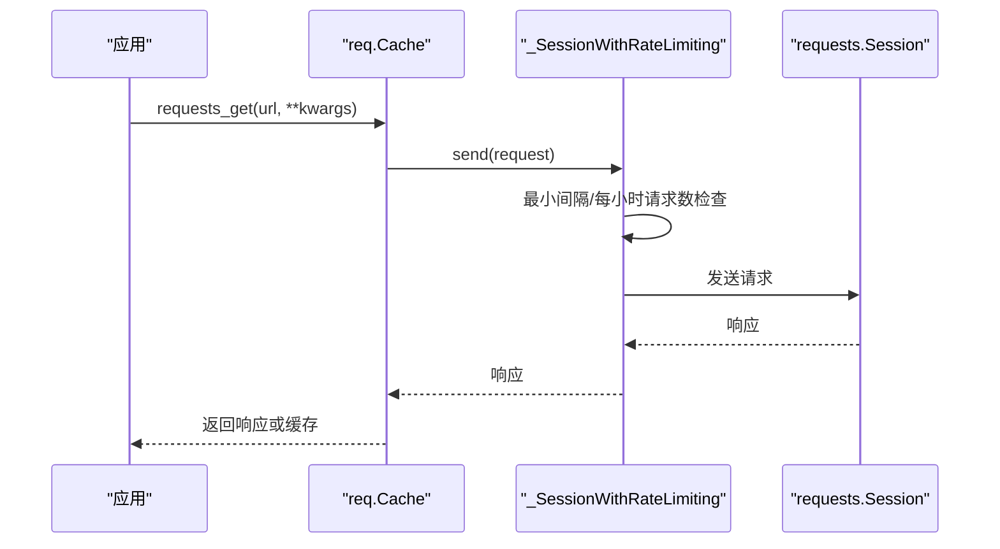
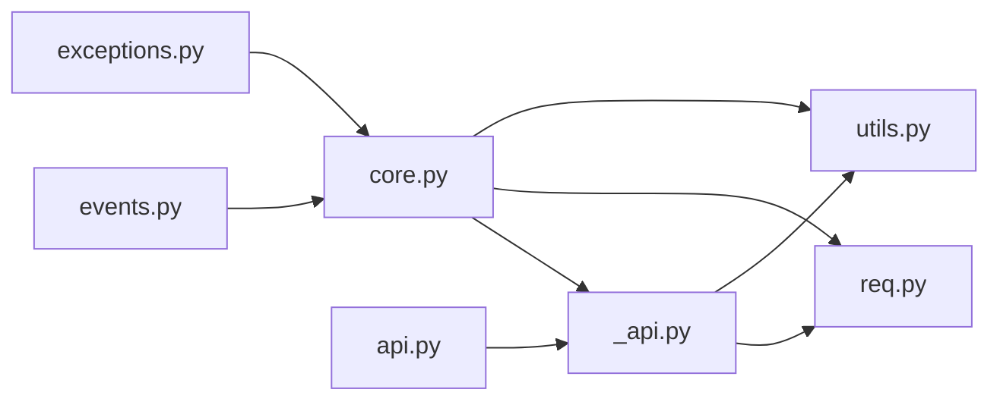

# 核心库 API

<cite>
**本文引用的文件**
- [fastf1/__init__.py](file://fastf1/__init__.py)
- [fastf1/core.py](file://fastf1/core.py)
- [fastf1/events.py](file://fastf1/events.py)
- [fastf1/utils.py](file://fastf1/utils.py)
- [fastf1/api.py](file://fastf1/api.py)
- [fastf1/_api.py](file://fastf1/_api.py)
- [fastf1/req.py](file://fastf1/req.py)
- [fastf1/exceptions.py](file://fastf1/exceptions.py)
</cite>

## 目录
1. [简介](#简介)
2. [项目结构](#项目结构)
3. [核心组件](#核心组件)
4. [架构总览](#架构总览)
5. [详细组件分析](#详细组件分析)
6. [依赖分析](#依赖分析)
7. [性能考量](#性能考量)
8. [故障排查指南](#故障排查指南)
9. [结论](#结论)
10. [附录](#附录)

## 简介
本文件为 Fast-F1 核心库的详细 API 参考文档，覆盖公共函数、类与方法的完整接口说明，包括参数类型、返回值、异常处理与使用示例。重点涵盖以下核心数据模型与接口：
- 会话与事件：Session、Event、EventSchedule
- 数据模型：Telemetry（遥测）、Lap/Laps（圈次）
- 数据加载接口：get_session、get_event、get_event_schedule、get_testing_session、get_events_remaining
- 实用工具：to_timedelta、to_datetime、recursive_dict_get
- 缓存与限流：Cache
- 异常体系：DataNotLoadedError、NoLapDataError、RateLimitExceededError 等

## 项目结构
Fast-F1 核心库采用模块化设计，围绕“事件-会话-数据”三层结构组织：
- events.py：事件与会话查询、调度表管理
- core.py：核心数据模型（Session、Telemetry、Lap/Laps）与数据加载流程
- _api.py：底层 Livetiming API 请求与解析
- api.py：对外暴露的私有 API 汇总（未来将移除）
- req.py：缓存与请求级限流封装
- utils.py：通用工具函数
- exceptions.py：异常体系定义

图表来源
- [fastf1/events.py:50-138](file://fastf1/events.py#L50-L138)
- [fastf1/core.py:1152-1357](file://fastf1/core.py#L1152-L1357)
- [fastf1/_api.py:106-182](file://fastf1/_api.py#L106-L182)
- [fastf1/api.py:1-34](file://fastf1/api.py#L1-L34)
- [fastf1/req.py:132-686](file://fastf1/req.py#L132-L686)
- [fastf1/utils.py:1-229](file://fastf1/utils.py#L1-L229)
- [fastf1/exceptions.py:1-104](file://fastf1/exceptions.py#L1-L104)

章节来源
- [fastf1/events.py:1-1011](file://fastf1/events.py#L1-L1011)
- [fastf1/core.py:1-3841](file://fastf1/core.py#L1-L3841)
- [fastf1/_api.py:1-1837](file://fastf1/_api.py#L1-L1837)
- [fastf1/api.py:1-34](file://fastf1/api.py#L1-L34)
- [fastf1/req.py:1-695](file://fastf1/req.py#L1-L695)
- [fastf1/utils.py:1-229](file://fastf1/utils.py#L1-L229)
- [fastf1/exceptions.py:1-104](file://fastf1/exceptions.py#L1-L104)

## 核心组件

### 会话与事件接口
- get_session(year, gp, identifier=None, backend=None, exact_match=False) -> Session
  - 功能：根据年份、赛事名称或轮次、会话标识创建 Session 对象；不自动加载具体数据，需调用 Session.load
  - 参数：
    - year: 年份
    - gp: 赛事名字符串或轮次数整数
    - identifier: 会话名称、缩写或编号
    - backend: 'fastf1'|'f1timing'|'ergast'
    - exact_match: 是否精确匹配
  - 返回：Session
  - 异常：FuzzyMatchError、ValueError、KeyError
  - 示例：参见源码注释中的示例
- get_event(year, gp, backend=None, exact_match=False) -> Event
- get_event_schedule(year, include_testing=True, backend=None) -> EventSchedule
- get_testing_session(year, test_number, session_number, backend=None) -> Session
- get_testing_event(year, test_number, backend=None) -> Event
- get_events_remaining(dt=None, include_testing=True, backend=None) -> EventSchedule

章节来源
- [fastf1/events.py:50-138](file://fastf1/events.py#L50-L138)
- [fastf1/events.py:141-173](file://fastf1/events.py#L141-L173)
- [fastf1/events.py:175-243](file://fastf1/events.py#L175-L243)
- [fastf1/events.py:246-283](file://fastf1/events.py#L246-L283)
- [fastf1/events.py:285-342](file://fastf1/events.py#L285-L342)
- [fastf1/events.py:345-401](file://fastf1/events.py#L345-L401)

### 会话 Session
- 属性与只读数据
  - session_info: 会话信息字典
  - drivers: 参赛车手列表
  - results: 会话结果（SessionResults）
  - laps: 所有车手圈次（Laps）
  - total_laps: 原计划总圈数（仅竞速类会话）
  - weather_data: 天气数据
  - car_data/pos_data: 遥测数据（按车号分组）
  - session_status/track_status/race_control_messages: 状态与消息
  - session_start_time/t0_date: 会话起始时间与数据零时刻
- 加载方法
  - load(laps=True, telemetry=True, weather=True, messages=True, livedata=None)
    - 支持选择性加载，内部混合多源数据以修正误差
    - 支持使用本地 livetiming 数据作为数据源
- 私有加载流程
  - _load_session_info/_load_drivers_results/_load_laps_data/_load_telemetry/_load_weather_data/_load_race_control_messages/_load_track_status_data/_load_session_status_data
  - _fix_missing_laps_retired_on_track/_set_laps_deleted_from_rcm/_calculate_quali_like_session_results/_calculate_race_like_session_results
  - _add_first_lap_time_from_ergast/_check_lap_accuracy/_add_track_status_to_laps
- 遥测便捷方法
  - get_car_data/get_pos_data/get_combined_telemetry（内部实现）

章节来源
- [fastf1/core.py:1152-1357](file://fastf1/core.py#L1152-L1357)
- [fastf1/core.py:1358-1444](file://fastf1/core.py#L1358-L1444)
- [fastf1/core.py:1446-1667](file://fastf1/core.py#L1446-L1667)
- [fastf1/core.py:2580-2879](file://fastf1/core.py#L2580-L2879)
- [fastf1/core.py:2880-3554](file://fastf1/core.py#L2880-L3554)

### 遥测 Telemetry
- 定义：多通道时间序列数据对象，支持合并不同通道、重采样与插值
- 关键属性
  - TELEMETRY_FREQUENCY: 默认频率（'original' 或整数 Hz）
  - _CHANNELS/_COLUMNS: 已知通道及其类型与插值策略
  - session/driver: 关联会话与车号元数据
- 核心方法
  - slice_by_mask/slice_by_lap/slice_by_time: 基于掩码/圈次/时间切片
  - merge_channels: 合并不同通道并按默认或指定频率重采样
  - resample_channels: 按规则或自定义时间索引重采样
  - fill_missing: 插补缺失值（连续/离散信号）
  - register_new_channel: 注册自定义通道
  - add_differential_distance/add_distance/add_relative_distance/add_driver_ahead/add_track_status: 计算与添加派生通道
  - calculate_differential_distance/integrate_distance/calculate_driver_ahead: 内部计算
- 时间列与来源
  - Date/Time/SessionTime：基于 t0_date 计算
  - Source：采样来源标记（car/pos/interpolated）

章节来源
- [fastf1/core.py:64-570](file://fastf1/core.py#L64-L570)
- [fastf1/core.py:571-827](file://fastf1/core.py#L571-L827)
- [fastf1/core.py:828-1149](file://fastf1/core.py#L828-L1149)

### 圈次数据模型
- Lap/Laps：围绕单圈或多圈的结构化数据，包含时间、位置、轮胎状态、进站等信息
- 与 Session.laps 的关系：由 Session._load_laps_data 构建，包含准确性标记与轨迹状态

章节来源
- [fastf1/core.py:1600-1667](file://fastf1/core.py#L1600-L1667)

### 底层 API 与数据解析
- _api.py 提供对 Livetiming API 的请求与解析，如：
  - timing_data/_extended_timing_data：混合流解析为 laps/stream，并进行对齐与完整性校验
  - car_data/position_data：遥测数据解析
  - track_status_data/session_status_data/weather_data 等
- api.py 为私有模块，未来将移除，当前通过 fastf1._api 导入

章节来源
- [fastf1/_api.py:106-248](file://fastf1/_api.py#L106-L248)
- [fastf1/_api.py:963-994](file://fastf1/_api.py#L963-L994)
- [fastf1/api.py:1-34](file://fastf1/api.py#L1-L34)

### 缓存与限流
- Cache
  - enable_cache(cache_dir, ignore_version=False, force_renew=False, use_requests_cache=True)
  - requests_get/requests_post：带缓存的请求封装
  - clear_cache：清理缓存（可选清理请求缓存）
  - disabled/set_disabled/set_enabled/offline_mode/ci_mode：缓存控制
  - get_cache_info：获取缓存路径与大小
- 限流策略
  - _SessionWithRateLimiting：最小间隔与每小时请求数限制
  - 针对 ergast.com 与其他 API 的差异化限流

章节来源
- [fastf1/req.py:132-686](file://fastf1/req.py#L132-L686)

### 实用工具
- to_timedelta/to_datetime：高性能时间/时间差解析
- recursive_dict_get：递归字典取值
- utils.delta_time（已弃用）：基于距离轴的圈次差值计算（不稳定，不推荐使用）

章节来源
- [fastf1/utils.py:16-229](file://fastf1/utils.py#L16-L229)

### 异常体系
- DataNotLoadedError：尝试访问未加载数据
- NoLapDataError：API 返回但无可用数据
- FuzzyMatchError：模糊匹配失败
- RateLimitExceededError：超出硬性速率限制
- FastF1CriticalError：不可恢复错误基类

章节来源
- [fastf1/exceptions.py:1-104](file://fastf1/exceptions.py#L1-L104)
- [fastf1/core.py:1227-1233](file://fastf1/core.py#L1227-L1233)

## 架构总览
下图展示从用户调用到数据加载与解析的关键流程。

图表来源
- [fastf1/events.py:50-138](file://fastf1/events.py#L50-L138)
- [fastf1/core.py:1358-1444](file://fastf1/core.py#L1358-L1444)
- [fastf1/_api.py:106-182](file://fastf1/_api.py#L106-L182)
- [fastf1/req.py:260-307](file://fastf1/req.py#L260-L307)

## 详细组件分析

### Session 类 API
- 初始化与属性
  - __init__(event, session_name, f1_api_support)
  - session_info/drivers/results/laps/total_laps/weather_data/car_data/pos_data/session_status/track_status/race_control_messages/session_start_time/t0_date
- 数据加载
  - load(laps=True, telemetry=True, weather=True, messages=True, livedata=None)
  - 私有加载方法：_load_session_info/_load_drivers_results/_load_laps_data/_load_telemetry/_load_weather_data/_load_race_control_messages/_load_track_status_data/_load_session_status_data
  - 辅助流程：_fix_missing_laps_retired_on_track/_set_laps_deleted_from_rcm/_calculate_quali_like_session_results/_calculate_race_like_session_results/_add_first_lap_time_from_ergast/_check_lap_accuracy/_add_track_status_to_laps
- 遥测便捷方法
  - get_car_data/get_pos_data/get_combined_telemetry（内部实现）

章节来源
- [fastf1/core.py:1152-1357](file://fastf1/core.py#L1152-L1357)
- [fastf1/core.py:1358-1444](file://fastf1/core.py#L1358-L1444)
- [fastf1/core.py:1446-2399](file://fastf1/core.py#L1446-L2399)
- [fastf1/core.py:2580-3554](file://fastf1/core.py#L2580-L3554)

### Telemetry 类 API
- 初始化与元数据
  - __init__(*args, session=None, driver=None, drop_unknown_channels=False, **kwargs)
  - _metadata = ['session','driver']
- 切片与合并
  - slice_by_mask/slice_by_lap/slice_by_time
  - merge_channels(resample)/resample_channels
  - fill_missing
- 派生通道
  - add_differential_distance/add_distance/add_relative_distance/add_driver_ahead/add_track_status/register_new_channel
- 计算方法
  - calculate_differential_distance/integrate_distance/calculate_driver_ahead

章节来源
- [fastf1/core.py:64-570](file://fastf1/core.py#L64-L570)
- [fastf1/core.py:571-1149](file://fastf1/core.py#L571-L1149)

### 事件与调度 API
- get_session/get_testing_session：创建 Session
- get_event/get_testing_event：创建 Event
- get_event_schedule：获取 EventSchedule（含测试日程）
- get_events_remaining：获取剩余赛事（可选包含测试）
- Event/EventSchedule：事件与日期解析、会话名称/编号映射、测试日识别

章节来源
- [fastf1/events.py:50-138](file://fastf1/events.py#L50-L138)
- [fastf1/events.py:141-173](file://fastf1/events.py#L141-L173)
- [fastf1/events.py:175-243](file://fastf1/events.py#L175-L243)
- [fastf1/events.py:246-283](file://fastf1/events.py#L246-L283)
- [fastf1/events.py:285-401](file://fastf1/events.py#L285-L401)
- [fastf1/events.py:832-1011](file://fastf1/events.py#L832-L1011)

### 底层 API 解析流程
- timing_data/_extended_timing_data：混合流解析、对齐、完整性检查
- car_data/position_data：遥测数据解析与时间戳重建
- 其他：track_status_data/session_status_data/weather_data 等

图表来源
- [fastf1/_api.py:185-248](file://fastf1/_api.py#L185-L248)
- [fastf1/_api.py:251-351](file://fastf1/_api.py#L251-L351)

章节来源
- [fastf1/_api.py:106-248](file://fastf1/_api.py#L106-L248)
- [fastf1/_api.py:251-351](file://fastf1/_api.py#L251-L351)

### 缓存与限流工作流

图表来源
- [fastf1/req.py:83-113](file://fastf1/req.py#L83-L113)
- [fastf1/req.py:260-307](file://fastf1/req.py#L260-L307)

章节来源
- [fastf1/req.py:132-686](file://fastf1/req.py#L132-L686)

## 依赖分析
- 模块耦合
  - events.py 依赖 core.Session 与 utils（日期/时间转换）
  - core.py 依赖 _api.py（数据解析）、req.Cache（缓存/限流）、utils（to_timedelta/to_datetime）
  - _api.py 依赖 req.Cache、utils、logger
  - api.py 为私有汇总，导入 _api
- 外部依赖
  - requests、requests-cache、pandas、numpy、dateutil、zlib/base64（用于压缩/解压）

图表来源
- [fastf1/events.py:1-27](file://fastf1/events.py#L1-L27)
- [fastf1/core.py:1-38](file://fastf1/core.py#L1-L38)
- [fastf1/_api.py:1-19](file://fastf1/_api.py#L1-L19)
- [fastf1/api.py:27-29](file://fastf1/api.py#L27-L29)

章节来源
- [fastf1/events.py:1-27](file://fastf1/events.py#L1-L27)
- [fastf1/core.py:1-38](file://fastf1/core.py#L1-L38)
- [fastf1/_api.py:1-19](file://fastf1/_api.py#L1-L19)
- [fastf1/api.py:27-29](file://fastf1/api.py#L27-L29)

## 性能考量
- 缓存优先：启用 Cache.enable_cache 可显著减少重复下载与解析开销
- 选择性加载：Session.load 支持仅加载所需数据，避免不必要的网络与解析
- 遥测重采样：默认保持 'original' 频率以减少插值误差；仅在必要时指定整数频率
- 批量操作：合并/重采样多次会降低精度，尽量基于原始数据进行一次重采样
- 限流优化：合理安排请求节奏，避免触发硬性速率限制

## 故障排查指南
- 未加载数据
  - 症状：访问 Session 属性时报 DataNotLoadedError
  - 处理：先调用 Session.load，或确保使用 get_session 后再加载
- 无可用数据
  - 症状：NoLapDataError 或底层 SessionNotAvailableError
  - 处理：稍后重试或切换 backend；确认会话是否已完成
- 速率限制
  - 症状：RateLimitExceededError
  - 处理：降低请求频率、启用缓存、避免并发滥用
- 模糊匹配失败
  - 症状：FuzzyMatchError
  - 处理：提高输入描述度或开启 exact_match
- 缓存问题
  - 症状：缓存版本不兼容或损坏
  - 处理：使用 Cache.clear_cache 清理；必要时启用 force_renew 或 ignore_version

章节来源
- [fastf1/core.py:1227-1233](file://fastf1/core.py#L1227-L1233)
- [fastf1/_api.py:193-202](file://fastf1/_api.py#L193-L202)
- [fastf1/exceptions.py:40-86](file://fastf1/exceptions.py#L40-L86)
- [fastf1/req.py:396-469](file://fastf1/req.py#L396-L469)

## 结论
Fast-F1 核心库通过清晰的事件-会话-数据层次与完善的缓存/限流机制，提供了稳定且高性能的数据访问能力。建议在生产环境中：
- 明确启用缓存并合理配置
- 使用 Session.load 的选择性加载
- 在需要高精度时避免多次重采样
- 正确处理异常与边界情况

## 附录
- 版本与入口
  - fastf1.__init__ 暴露 get_session、get_event、get_event_schedule、get_events_remaining、get_testing_event、get_testing_session、set_log_level、Cache
- 私有 API 注意
  - fastf1.api 将在未来版本中移除，请直接使用 _api 中的功能

章节来源
- [fastf1/__init__.py:17-26](file://fastf1/__init__.py#L17-L26)
- [fastf1/api.py:1-34](file://fastf1/api.py#L1-L34)