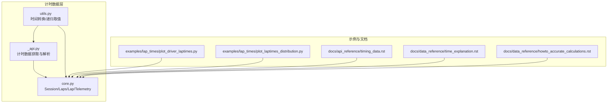
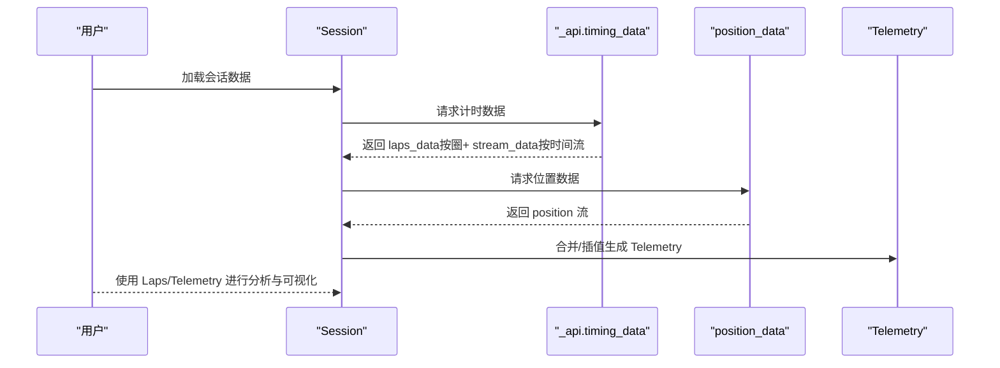
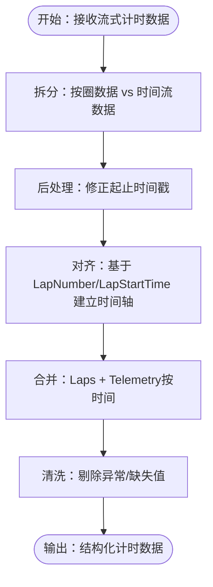
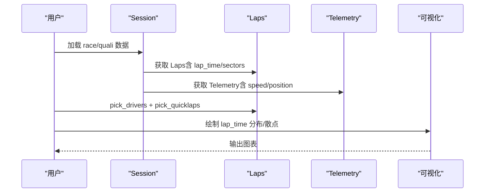
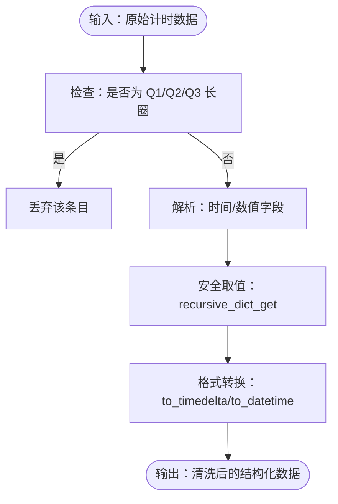
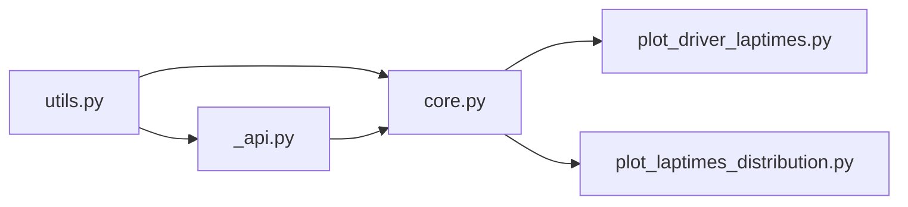

# 计时数据 API

<cite>
**本文引用的文件**
- [fastf1/_api.py](file://fastf1/_api.py)
- [fastf1/core.py](file://fastf1/core.py)
- [fastf1/utils.py](file://fastf1/utils.py)
- [examples/lap_times/plot_driver_laptimes.py](file://examples/lap_times/plot_driver_laptimes.py)
- [examples/lap_times/plot_laptimes_distribution.py](file://examples/lap_times/plot_laptimes_distribution.py)
- [docs/api_reference/timing_data.rst](file://docs/api_reference/timing_data.rst)
- [docs/data_reference/time_explanation.rst](file://docs/data_reference/time_explanation.rst)
- [docs/data_reference/howto_accurate_calculations.rst](file://docs/data_reference/howto_accurate_calculations.rst)
</cite>

## 目录
1. [简介](#简介)
2. [项目结构](#项目结构)
3. [核心组件](#核心组件)
4. [架构总览](#架构总览)
5. [详细组件分析](#详细组件分析)
6. [依赖关系分析](#依赖关系分析)
7. [性能考量](#性能考量)
8. [故障排查指南](#故障排查指南)
9. [结论](#结论)
10. [附录](#附录)

## 简介
本文件为计时数据相关类与功能的详细 API 参考，覆盖以下主题：
- 计时数据获取：lap_time、interval_to_driver、position 等字段的含义与使用方式
- 数据解析与对齐：从流式计时数据中提取“按圈”和“按时间流”的结构化数据
- 统计与分析：基于 lap_time 的分布可视化、对比分析与清洗策略
- 数据清洗与异常处理：缺失值、错误标签、速度陷阱与进站标记的处理
- 格式转换：时间字符串到 Timedelta/Timestamp 的转换工具
- 实战示例：如何用计时数据进行分析与可视化

## 项目结构
围绕计时数据的关键模块与文件如下：
- 计时数据获取与解析：fastf1/_api.py
- 会话与数据对象：fastf1/core.py（Session、Laps、Lap、Telemetry）
- 工具函数：fastf1/utils.py（时间转换、递归字典取值等）
- 示例与文档：examples/lap_times/* 与 docs/api_reference/timing_data.rst、docs/data_reference/time_explanation.rst、docs/data_reference/howto_accurate_calculations.rst

**图表来源**
- [fastf1/_api.py:106-182](file://fastf1/_api.py#L106-L182)
- [fastf1/core.py:1152-1200](file://fastf1/core.py#L1152-L1200)
- [fastf1/utils.py:111-229](file://fastf1/utils.py#L111-L229)
- [examples/lap_times/plot_driver_laptimes.py:1-66](file://examples/lap_times/plot_driver_laptimes.py#L1-L66)
- [examples/lap_times/plot_laptimes_distribution.py:1-81](file://examples/lap_times/plot_laptimes_distribution.py#L1-L81)
- [docs/api_reference/timing_data.rst:1-136](file://docs/api_reference/timing_data.rst#L1-L136)
- [docs/data_reference/time_explanation.rst:139-152](file://docs/data_reference/time_explanation.rst#L139-L152)
- [docs/data_reference/howto_accurate_calculations.rst:38-61](file://docs/data_reference/howto_accurate_calculations.rst#L38-L61)

**章节来源**
- [fastf1/_api.py:106-182](file://fastf1/_api.py#L106-L182)
- [fastf1/core.py:1152-1200](file://fastf1/core.py#L1152-L1200)
- [fastf1/utils.py:111-229](file://fastf1/utils.py#L111-L229)
- [examples/lap_times/plot_driver_laptimes.py:1-66](file://examples/lap_times/plot_driver_laptimes.py#L1-L66)
- [examples/lap_times/plot_laptimes_distribution.py:1-81](file://examples/lap_times/plot_laptimes_distribution.py#L1-L81)
- [docs/api_reference/timing_data.rst:1-136](file://docs/api_reference/timing_data.rst#L1-L136)
- [docs/data_reference/time_explanation.rst:139-152](file://docs/data_reference/time_explanation.rst#L139-L152)
- [docs/data_reference/howto_accurate_calculations.rst:38-61](file://docs/data_reference/howto_accurate_calculations.rst#L38-L61)

## 核心组件
- 计时数据获取与解析
  - timing_data：返回“按圈”数据与“按时间流”数据；按圈数据包含 lap_time、sector 时间、pit 入出站时间、速度陷阱等；按时间流数据包含 position、gap_to_leader、interval_to_position_ahead 等高频采样指标。
  - position_data：位置数据流，包含 X/Y/Z、状态、时间戳等。
  - timing_app_data：轮胎与进站信息等。
- 会话与数据对象
  - Session：会话入口，负责加载与组织数据。
  - Laps/Lap：按圈数据容器，提供筛选、统计与派生列（如 LapStartTime、LapNumber 等）。
  - Telemetry：车号/位置/速度等多通道时间序列，支持按圈/按时间切片、合并与插值。
- 工具函数
  - to_timedelta/to_datetime：字符串到时间类型的快速转换。
  - recursive_dict_get：嵌套字典安全取值。

**章节来源**
- [fastf1/_api.py:106-182](file://fastf1/_api.py#L106-L182)
- [fastf1/_api.py:185-1150](file://fastf1/_api.py#L185-L1150)
- [fastf1/core.py:1152-1200](file://fastf1/core.py#L1152-L1200)
- [fastf1/utils.py:111-229](file://fastf1/utils.py#L111-L229)

## 架构总览
计时数据从 API 流式数据解析为两类结构：
- 按圈数据（Laps）：以“完成一圈”为事件点，记录 lap_time、sector 时间、pit 入出站、速度陷阱等。
- 按时间流数据（Stream）：以高频率采样记录 position、gap_to_leader、interval_to_position_ahead 等。

**图表来源**
- [fastf1/_api.py:106-182](file://fastf1/_api.py#L106-L182)
- [fastf1/_api.py:1125-1150](file://fastf1/_api.py#L1125-L1150)
- [fastf1/core.py:64-200](file://fastf1/core.py#L64-L200)

**章节来源**
- [fastf1/_api.py:106-182](file://fastf1/_api.py#L106-L182)
- [fastf1/_api.py:1125-1150](file://fastf1/_api.py#L1125-L1150)
- [fastf1/core.py:64-200](file://fastf1/core.py#L64-L200)

## 详细组件分析

### 计时数据字段与含义
- 按圈数据（Laps）
  - lap_time：完成一圈的时间（Timedelta），用于分析圈速稳定性与趋势
  - sector1/2/3_time：各节时间（Timedelta），用于分析节间节奏
  - pit_in/out_time：入弯/出弯时间（Timedelta），用于识别进站窗口
  - speed_i1/i2/fl/st：速度陷阱（km/h），受红旗影响可能缺失
  - compound、tyre_life、fresh_tyre：轮胎状态，用于策略分析
  - position：每圈结束时的排位（FP/Q 不适用）
  - deleted/deleted_reason：被裁决删除的圈及其原因
  - is_personal_best：官方个人最佳圈标志
  - lap_start_time/start_date：该圈开始时间（SessionTime/Timestamp）
  - is_accurate：基本准确性检查通过的标记
- 按时间流数据（Stream）
  - position：实时排位
  - gap_to_leader：与领先者的差距（秒）
  - interval_to_position_ahead：与前车的间隔（秒）

以上字段的完整列表与说明可参见 API 文档索引。

**章节来源**
- [docs/api_reference/timing_data.rst:19-136](file://docs/api_reference/timing_data.rst#L19-L136)

### 字段解析与对齐流程
- 解析流程
  - 将混合流式数据按“完成一圈”事件映射到按圈表，并对时间戳进行后处理修正
  - 对高频 position/gap/interval 等数据单独抽取为时间流表
- 对齐策略
  - 使用 LapStartTime/LapNumber/Time 等列在 Laps 与 Telemetry 之间建立时间对齐
  - 在合并/插值时保留 Source/Date/SessionTime 等关键时间列，避免二次重采样引入误差

**图表来源**
- [fastf1/_api.py:185-480](file://fastf1/_api.py#L185-L480)
- [fastf1/_api.py:787-820](file://fastf1/_api.py#L787-L820)
- [fastf1/core.py:291-390](file://fastf1/core.py#L291-L390)

**章节来源**
- [fastf1/_api.py:185-480](file://fastf1/_api.py#L185-L480)
- [fastf1/_api.py:787-820](file://fastf1/_api.py#L787-L820)
- [fastf1/core.py:291-390](file://fastf1/core.py#L291-L390)

### 数据合并、对齐与统计分析
- 合并与插值
  - Telemetry.merge_channels 支持不同时间基的多通道合并，并在必要时进行插值
  - 频率参数可选择“原始频率”或指定采样频率；建议优先使用“原始频率”以减少误差
- 统计分析
  - 基于 lap_time 的分布可视化：示例展示了按圈号散点与按车手小提琴图
  - 通过 pick_drivers/pick_quicklaps 等筛选稳健圈速，避免黄旗/进站等异常干扰

**图表来源**
- [examples/lap_times/plot_driver_laptimes.py:22-47](file://examples/lap_times/plot_driver_laptimes.py#L22-L47)
- [examples/lap_times/plot_laptimes_distribution.py:21-69](file://examples/lap_times/plot_laptimes_distribution.py#L21-L69)
- [fastf1/core.py:291-390](file://fastf1/core.py#L291-L390)

**章节来源**
- [examples/lap_times/plot_driver_laptimes.py:1-66](file://examples/lap_times/plot_driver_laptimes.py#L1-L66)
- [examples/lap_times/plot_laptimes_distribution.py:1-81](file://examples/lap_times/plot_laptimes_distribution.py#L1-L81)
- [fastf1/core.py:291-390](file://fastf1/core.py#L291-L390)

### 数据清洗、异常处理与格式转换
- 异常处理
  - 对于长圈（通常出现在 Q1/Q2/Q3 切割场景）进行过滤，避免错误时间戳关联到错误圈
  - 对缺失的速度陷阱值（如红旗期间）进行标记与跳过
- 格式转换
  - to_timedelta/to_datetime 提供字符串到时间类型的快速转换，支持多种格式
  - recursive_dict_get 提供嵌套字典安全取值，避免 KeyError

**图表来源**
- [fastf1/_api.py:468-488](file://fastf1/_api.py#L468-L488)
- [fastf1/_api.py:1117-1150](file://fastf1/_api.py#L1117-L1150)
- [fastf1/utils.py:111-229](file://fastf1/utils.py#L111-L229)

**章节来源**
- [fastf1/_api.py:468-488](file://fastf1/_api.py#L468-L488)
- [fastf1/_api.py:1117-1150](file://fastf1/_api.py#L1117-L1150)
- [fastf1/utils.py:111-229](file://fastf1/utils.py#L111-L229)

### lap_time、interval_to_driver、position 的使用
- lap_time
  - 含义：完成一圈所用时间，单位为 Timedelta；用于圈速分析、趋势拟合与分布统计
  - 使用：在 Laps 中直接访问 LapTime 列；结合 pick_quicklaps 过滤异常圈
- interval_to_position_ahead
  - 含义：与前车的间隔时间（秒），用于分析超车机会与跟车稳定性
  - 使用：在 Stream 中获取，按时间流观察其变化
- position
  - 含义：每圈结束时的排位；在自由练习与排位赛中可能不可用
  - 使用：在 Laps 或 Stream 中均可查看，注意数据可用性

**章节来源**
- [docs/api_reference/timing_data.rst:19-136](file://docs/api_reference/timing_data.rst#L19-L136)
- [fastf1/_api.py:166-174](file://fastf1/_api.py#L166-L174)
- [fastf1/_api.py:787-820](file://fastf1/_api.py#L787-L820)

## 依赖关系分析
- 模块耦合
  - _api.py 依赖 utils.to_timedelta/recursive_dict_get 进行数据解析
  - core.py 的 Session/Laps/Telemetry 依赖 _api.py 提供的数据结构
  - 示例脚本依赖 core 与 plotting 工具进行可视化
- 外部依赖
  - pandas/numpy 用于数据结构与计算
  - matplotlib/seaborn 用于可视化

**图表来源**
- [fastf1/utils.py:111-229](file://fastf1/utils.py#L111-L229)
- [fastf1/_api.py:106-182](file://fastf1/_api.py#L106-L182)
- [fastf1/core.py:1152-1200](file://fastf1/core.py#L1152-L1200)
- [examples/lap_times/plot_driver_laptimes.py:1-66](file://examples/lap_times/plot_driver_laptimes.py#L1-L66)
- [examples/lap_times/plot_laptimes_distribution.py:1-81](file://examples/lap_times/plot_laptimes_distribution.py#L1-L81)

**章节来源**
- [fastf1/utils.py:111-229](file://fastf1/utils.py#L111-L229)
- [fastf1/_api.py:106-182](file://fastf1/_api.py#L106-L182)
- [fastf1/core.py:1152-1200](file://fastf1/core.py#L1152-L1200)
- [examples/lap_times/plot_driver_laptimes.py:1-66](file://examples/lap_times/plot_driver_laptimes.py#L1-L66)
- [examples/lap_times/plot_laptimes_distribution.py:1-81](file://examples/lap_times/plot_laptimes_distribution.py#L1-L81)

## 性能考量
- 避免对输入数据进行多次重采样，推荐先在结果上再采样
- 积分（如距离）存在误差累积，应限制在单圈或少数圈范围内
- 合并多源数据时优先使用“原始频率”，减少插值误差

**章节来源**
- [docs/data_reference/howto_accurate_calculations.rst:38-61](file://docs/data_reference/howto_accurate_calculations.rst#L38-L61)
- [fastf1/core.py:571-623](file://fastf1/core.py#L571-L623)

## 故障排查指南
- 无会话数据
  - 现象：抛出“会话不可用”错误
  - 排查：确认会话已加载、API 可用、时间戳未过期
- 速度陷阱缺失
  - 现象：speed_i1/i2/fl/st 缺失
  - 排查：检查是否处于红旗/进站/首圈等场景
- 位置/间隔异常
  - 现象：position/gap/interval 波动大
  - 排查：确认使用“原始频率”合并，避免重复重采样；检查是否存在 Q1/Q2/Q3 切割导致的时间戳错误

**章节来源**
- [fastf1/_api.py:196-202](file://fastf1/_api.py#L196-L202)
- [fastf1/_api.py:468-488](file://fastf1/_api.py#L468-L488)
- [fastf1/_api.py:1125-1150](file://fastf1/_api.py#L1125-L1150)

## 结论
本参考文档系统梳理了计时数据的获取、解析、清洗与分析流程，明确了 lap_time、interval_to_position_ahead、position 等关键字段的含义与使用方式，并提供了基于示例的实战路径。遵循“不重采样输入、谨慎积分、先清洗后合并”的原则，可获得更准确的分析结果。

## 附录
- 时间解释与命名约定
  - Time：会话时间（与 LapStartTime/LapEndDate 关联）
  - Sector*SessionTime：各节时间对应的会话时间
  - PitIn/PitOut：进/出站的会话时间
- 相关 API 文档索引
  - 计时数据字段定义与筛选方法
  - 时间解释与命名约定
  - 准确计算指南

**章节来源**
- [docs/data_reference/time_explanation.rst:139-152](file://docs/data_reference/time_explanation.rst#L139-L152)
- [docs/api_reference/timing_data.rst:1-136](file://docs/api_reference/timing_data.rst#L1-L136)
- [docs/data_reference/howto_accurate_calculations.rst:38-61](file://docs/data_reference/howto_accurate_calculations.rst#L38-L61)