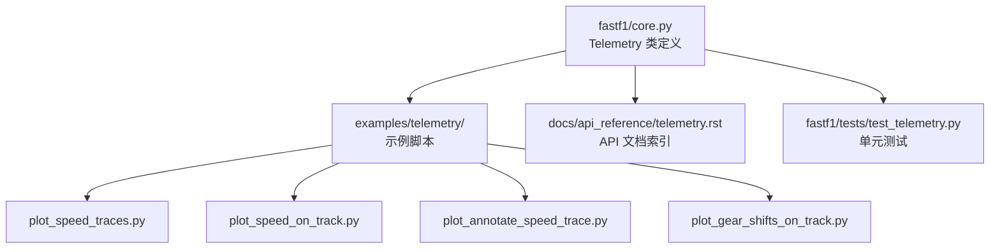
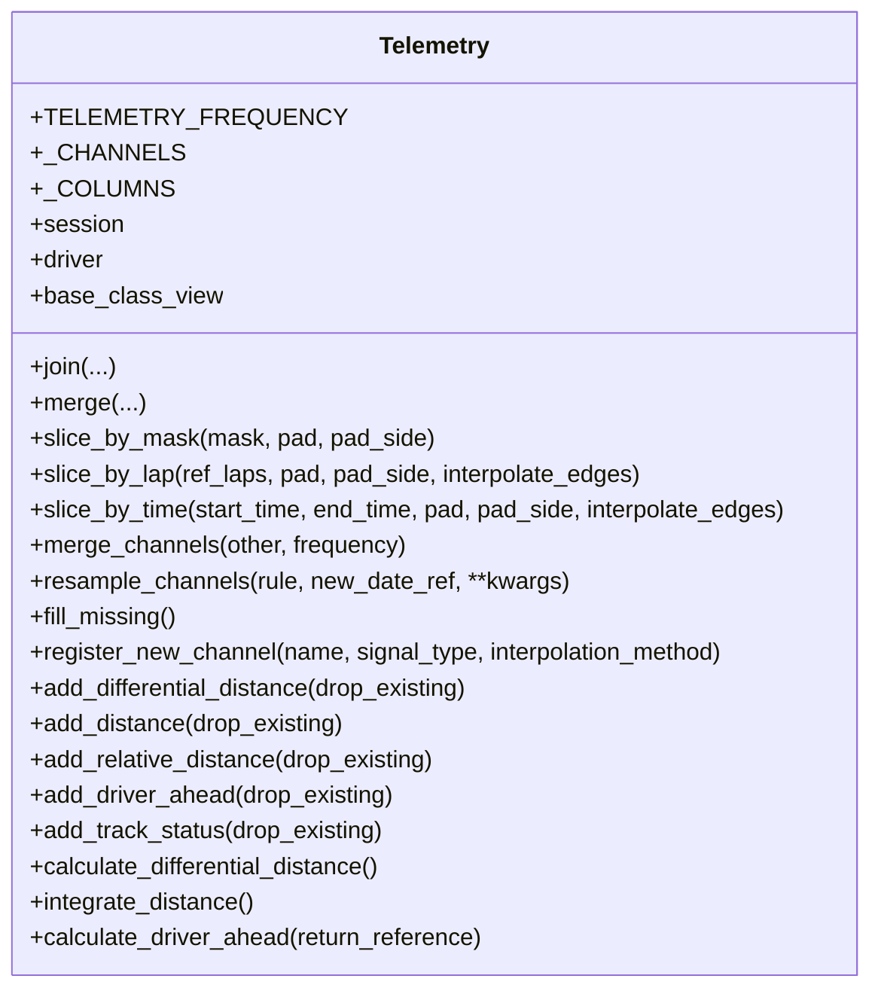
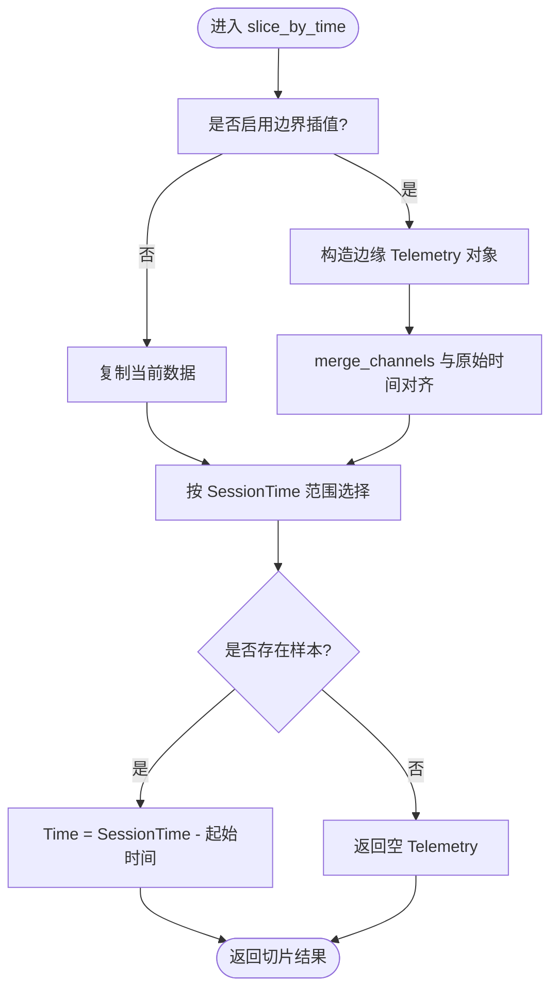
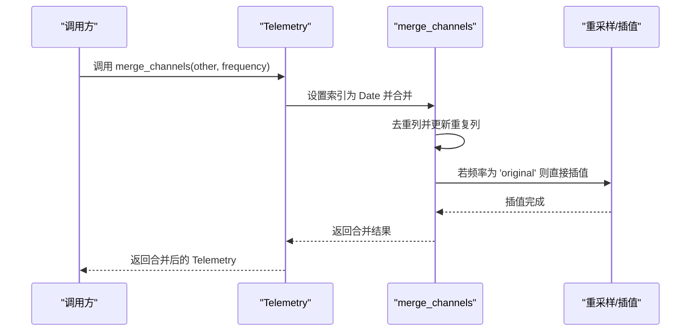
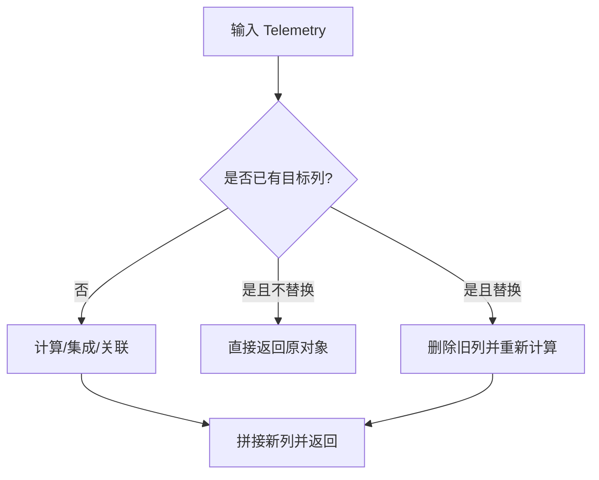
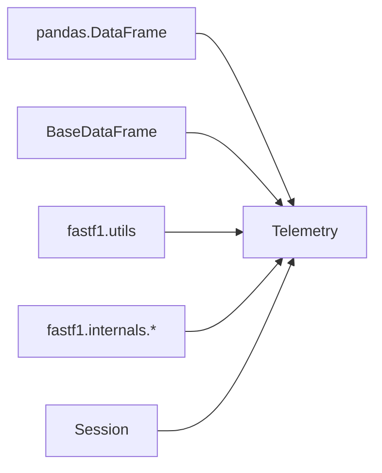

# 遥测数据 API

<cite>
**本文引用的文件**
- [fastf1/core.py](file://fastf1/core.py)
- [examples/telemetry/plot_speed_traces.py](file://examples/telemetry/plot_speed_traces.py)
- [examples/telemetry/plot_speed_on_track.py](file://examples/telemetry/plot_speed_on_track.py)
- [examples/telemetry/plot_annotate_speed_trace.py](file://examples/telemetry/plot_annotate_speed_trace.py)
- [examples/telemetry/plot_gear_shifts_on_track.py](file://examples/telemetry/plot_gear_shifts_on_track.py)
- [docs/api_reference/telemetry.rst](file://docs/api_reference/telemetry.rst)
- [fastf1/tests/test_telemetry.py](file://fastf1/tests/test_telemetry.py)
</cite>

## 目录
1. [简介](#简介)
2. [项目结构](#项目结构)
3. [核心组件](#核心组件)
4. [架构总览](#架构总览)
5. [详细组件分析](#详细组件分析)
6. [依赖关系分析](#依赖关系分析)
7. [性能考量](#性能考量)
8. [故障排查指南](#故障排查指南)
9. [结论](#结论)
10. [附录](#附录)

## 简介
本文件为 Telemetry 类的详细 API 参考文档，覆盖其公共方法、属性与数据处理接口，重点说明遥测数据的获取、解析与分析流程，并对 speed、n_gear、throttle、brake 等关键字段进行语义解释与使用建议。同时涵盖数据过滤（按掩码、按时间、按圈）、插值与重采样、统计与派生特征（距离、相对距离、车距）等高级功能，并通过示例路径展示如何提取与可视化遥测数据。

## 项目结构
与遥测 API 相关的核心位置如下：
- 核心类定义：fastf1/core.py 中的 Telemetry 类
- 示例与用法：examples/telemetry/ 下的速度轨迹、地图着色、齿轮可视化等示例
- 文档索引：docs/api_reference/telemetry.rst
- 单元测试：fastf1/tests/test_telemetry.py，验证切片、合并、重采样、派生特征等行为

**图表来源**
- [fastf1/core.py:64-200](file://fastf1/core.py#L64-L200)
- [docs/api_reference/telemetry.rst:1-13](file://docs/api_reference/telemetry.rst#L1-L13)
- [fastf1/tests/test_telemetry.py:1-401](file://fastf1/tests/test_telemetry.py#L1-L401)

**章节来源**
- [fastf1/core.py:64-200](file://fastf1/core.py#L64-L200)
- [docs/api_reference/telemetry.rst:1-13](file://docs/api_reference/telemetry.rst#L1-L13)
- [fastf1/tests/test_telemetry.py:1-401](file://fastf1/tests/test_telemetry.py#L1-L401)

## 核心组件
- Telemetry 类：继承自内部基类，承载多通道时间序列遥测数据；支持切片、合并、重采样、缺失值填充与派生特征计算。
- 关键字段与类型：
  - 速度 speed：连续型，单位 km/h
  - 发动机转速 rpm：连续型
  - 档位 ngear：离散型（整数）
  - 加速踏板 throttle：连续型（百分比），注意 104 常用于表示错误或不可用
  - 制动 brake：离散型（布尔）
  - DRS：离散型（整数）
  - 位置坐标 x/y/z：连续型（1/10 米）
  - 状态 status：离散型（OnTrack/OffTrack）
  - 时间相关：time（lap 内时间，从 0 开始）、session_time（会话起始累计时间）、date（采样时间戳）
  - Source：采样来源标记（car/pos/interpolated）

- 公共属性
  - TELEMETRY_FREQUENCY：默认重采样频率策略（'original' 或整数 Hz）
  - _CHANNELS：已知通道及其信号类型与插值方法映射
  - _COLUMNS：各通道的数据类型定义
  - session、driver：元数据，随切片与合并传播

- 公共方法概览（详见下节“详细组件分析”）
  - 切片：slice_by_mask、slice_by_lap、slice_by_time
  - 合并与重采样：merge_channels、resample_channels、fill_missing
  - 派生特征：add_differential_distance、add_distance、add_relative_distance、add_driver_ahead、add_track_status
  - 工具：join、merge、base_class_view、register_new_channel

**章节来源**
- [fastf1/core.py:64-200](file://fastf1/core.py#L64-L200)
- [fastf1/core.py:154-200](file://fastf1/core.py#L154-L200)
- [fastf1/tests/test_telemetry.py:223-241](file://fastf1/tests/test_telemetry.py#L223-L241)

## 架构总览
Telemetry 的核心职责是统一管理来自不同源（车数据、位置数据）的时间序列遥测，提供一致的切片、合并与派生能力。其设计遵循以下原则：
- 数据通道类型化：根据连续/离散/排除三类信号选择不同的插值/填充策略
- 时间基准统一：以 date 作为索引，自动维护 time 与 session_time
- 元数据传播：切片、合并、join 等操作保持 session 与 driver 等元数据一致性
- 可扩展性：通过 register_new_channel 注册自定义通道并参与插值/重采样

**图表来源**
- [fastf1/core.py:64-200](file://fastf1/core.py#L64-L200)
- [fastf1/core.py:263-390](file://fastf1/core.py#L263-L390)
- [fastf1/core.py:391-570](file://fastf1/core.py#L391-L570)
- [fastf1/core.py:571-623](file://fastf1/core.py#L571-L623)
- [fastf1/core.py:624-690](file://fastf1/core.py#L624-L690)
- [fastf1/core.py:692-737](file://fastf1/core.py#L692-L737)
- [fastf1/core.py:738-940](file://fastf1/core.py#L738-L940)
- [fastf1/core.py:941-994](file://fastf1/core.py#L941-L994)

## 详细组件分析

### 字段与语义说明
- speed（连续型，km/h）：车辆瞬时速度，常用于速度轨迹绘制与统计分析
- rpm（连续型）：发动机转速
- ngear（离散型，整数）：当前档位
- throttle（连续型，百分比，注意 104 表示异常/不可用）
- brake（离散型，布尔）：是否制动
- DRS（离散型，整数）：DRS 状态
- x/y/z（连续型，1/10 米）：世界坐标系位置
- status（离散型）：OnTrack/OffTrack
- time（时间增量，ns）：当前片段起始时间归零后的增量
- session_time（时间增量，ns）：自会话开始的累计时间
- date（时间戳）：采样时间点
- source（标记）：car/pos/interpolated

这些字段在 _CHANNELS 与 _COLUMNS 中有明确类型与插值策略定义，确保在合并与重采样时正确处理。

**章节来源**
- [fastf1/core.py:75-105](file://fastf1/core.py#L75-L105)
- [fastf1/core.py:154-200](file://fastf1/core.py#L154-L200)

### 切片与筛选
- slice_by_mask：基于布尔掩码切片，支持前后填充 pad
- slice_by_lap：按单圈或多圈切片，支持填充与边界插值
- slice_by_time：按会话时间窗切片，支持边界插值与时间偏移

**图表来源**
- [fastf1/core.py:342-390](file://fastf1/core.py#L342-L390)

**章节来源**
- [fastf1/core.py:263-390](file://fastf1/core.py#L263-L390)
- [fastf1/tests/test_telemetry.py:104-123](file://fastf1/tests/test_telemetry.py#L104-L123)
- [fastf1/tests/test_telemetry.py:125-163](file://fastf1/tests/test_telemetry.py#L125-L163)

### 合并与重采样
- merge_channels：将两个对象按时间合并，自动插值缺失值；可选择 'original' 或指定 Hz 重采样
- resample_channels：基于规则或自定义日期序列进行重采样
- fill_missing：对已知通道执行插值/前向/后向填充

**图表来源**
- [fastf1/core.py:391-570](file://fastf1/core.py#L391-L570)

**章节来源**
- [fastf1/core.py:391-570](file://fastf1/core.py#L391-L570)
- [fastf1/tests/test_telemetry.py:166-193](file://fastf1/tests/test_telemetry.py#L166-L193)
- [fastf1/tests/test_telemetry.py:195-221](file://fastf1/tests/test_telemetry.py#L195-L221)
- [fastf1/tests/test_telemetry.py:244-283](file://fastf1/tests/test_telemetry.py#L244-L283)

### 派生特征与统计
- add_differential_distance：相邻采样间距离（米）
- add_distance：累积距离（米），建议仅用于单圈或少量圈
- add_relative_distance：0~1 的相对距离
- add_driver_ahead：与前车的距离（米）与前车号码
- add_track_status：赛道状态编号

**图表来源**
- [fastf1/core.py:738-940](file://fastf1/core.py#L738-L940)

**章节来源**
- [fastf1/core.py:738-940](file://fastf1/core.py#L738-L940)
- [fastf1/tests/test_telemetry.py:350-368](file://fastf1/tests/test_telemetry.py#L350-L368)
- [fastf1/tests/test_telemetry.py:370-401](file://fastf1/tests/test_telemetry.py#L370-L401)
- [fastf1/tests/test_telemetry.py:290-313](file://fastf1/tests/test_telemetry.py#L290-L313)
- [fastf1/tests/test_telemetry.py:315-328](file://fastf1/tests/test_telemetry.py#L315-L328)

### 自定义通道注册
- register_new_channel：注册自定义通道，声明信号类型与插值方法，使其参与合并/重采样插值流程

**章节来源**
- [fastf1/core.py:692-737](file://fastf1/core.py#L692-L737)

### 实际用法与示例
- 速度叠加对比（按距离轴对齐）
  - 示例路径：[examples/telemetry/plot_speed_traces.py](file://examples/telemetry/plot_speed_traces.py)
- 轨迹地图着色（按速度着色）
  - 示例路径：[examples/telemetry/plot_speed_on_track.py](file://examples/telemetry/plot_speed_on_track.py)
- 速度轨迹标注弯角
  - 示例路径：[examples/telemetry/plot_annotate_speed_trace.py](file://examples/telemetry/plot_annotate_speed_trace.py)
- 轨迹上齿轮可视化
  - 示例路径：[examples/telemetry/plot_gear_shifts_on_track.py](file://examples/telemetry/plot_gear_shifts_on_track.py)

**章节来源**
- [examples/telemetry/plot_speed_traces.py:1-53](file://examples/telemetry/plot_speed_traces.py#L1-L53)
- [examples/telemetry/plot_speed_on_track.py:1-84](file://examples/telemetry/plot_speed_on_track.py#L1-L84)
- [examples/telemetry/plot_annotate_speed_trace.py:1-69](file://examples/telemetry/plot_annotate_speed_trace.py#L1-L69)
- [examples/telemetry/plot_gear_shifts_on_track.py:1-71](file://examples/telemetry/plot_gear_shifts_on_track.py#L1-L71)

## 依赖关系分析
- Telemetry 依赖 pandas DataFrame 的切片、合并、重采样与插值能力
- 依赖内部基类 BaseDataFrame 提供的通用结构
- 依赖会话对象 session 提供时间基准与附加数据（如赛道状态）
- 依赖 fastf1.utils、internals 等模块提供的工具函数

**图表来源**
- [fastf1/core.py:19-39](file://fastf1/core.py#L19-L39)
- [fastf1/core.py:205-214](file://fastf1/core.py#L205-L214)

**章节来源**
- [fastf1/core.py:19-39](file://fastf1/core.py#L19-L39)
- [fastf1/core.py:205-214](file://fastf1/core.py#L205-L214)

## 性能考量
- 合并与重采样可能引入插值误差，建议尽量基于原始高频率数据进行一次性重采样
- 累积距离（add_distance/integrate_distance）存在积分误差累积，适用于单圈或少量圈；长片段应分段计算再拼接
- add_driver_ahead 在长距离上会产生积分误差，推荐按圈计算后合并
- 大数据量切片与合并时，优先使用按时间切片（slice_by_time）以减少不必要的插值

[本节为通用指导，无需特定文件来源]

## 故障排查指南
- 合并多驱动数据时报错：merge_channels 会拒绝合并多个驱动的数据，请确保只合并同一驱动
- 缺失数据类型恢复失败：fill_missing/merge_channels 在恢复类型时可能发出警告，检查列的 dtype 与插值结果
- 重采样多次导致精度下降：避免对已重采样的数据再次重采样，始终基于原始数据进行
- 边界插值与时间偏移：slice_by_time 的 interpolate_edges 会在时间窗外插入插值样本，注意对分析窗口的影响

**章节来源**
- [fastf1/core.py:470-472](file://fastf1/core.py#L470-L472)
- [fastf1/core.py:562-568](file://fastf1/core.py#L562-L568)
- [fastf1/tests/test_telemetry.py:166-193](file://fastf1/tests/test_telemetry.py#L166-L193)

## 结论
Telemetry 类提供了完整的遥测数据生命周期管理：从多源数据的合并与重采样，到派生特征的计算与统计，再到面向可视化的数据准备。通过明确的通道类型与插值策略，以及丰富的切片与筛选接口，用户可以高效地完成从原始遥测到分析与可视化的全流程工作。

[本节为总结，无需特定文件来源]

## 附录

### API 参考索引
- 官方文档索引：[docs/api_reference/telemetry.rst](file://docs/api_reference/telemetry.rst)

**章节来源**
- [docs/api_reference/telemetry.rst:1-13](file://docs/api_reference/telemetry.rst#L1-L13)