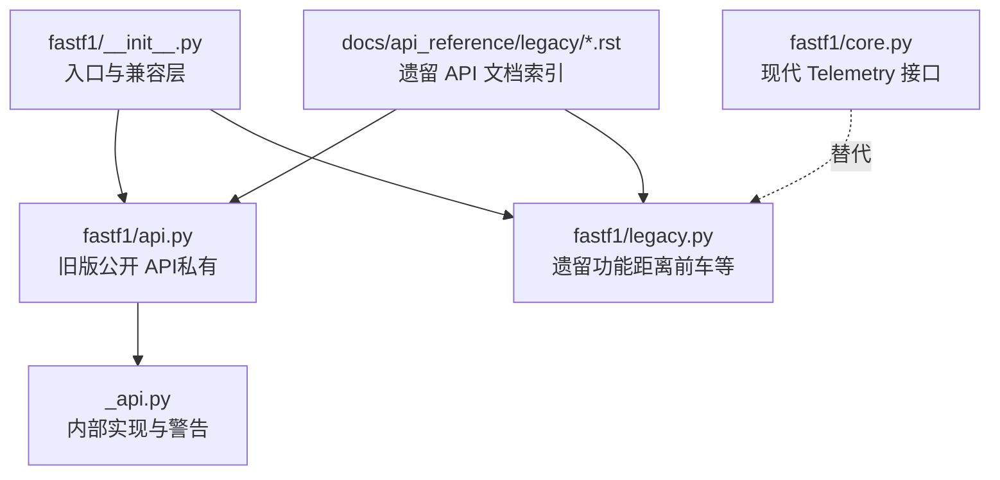
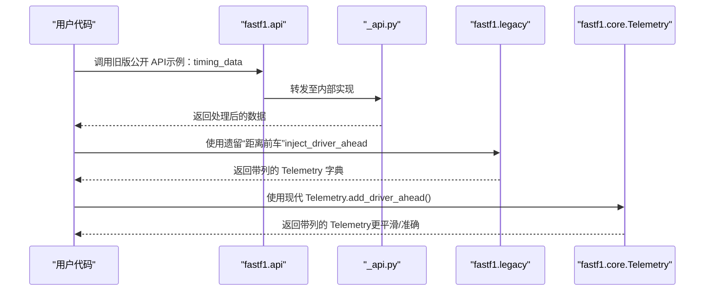
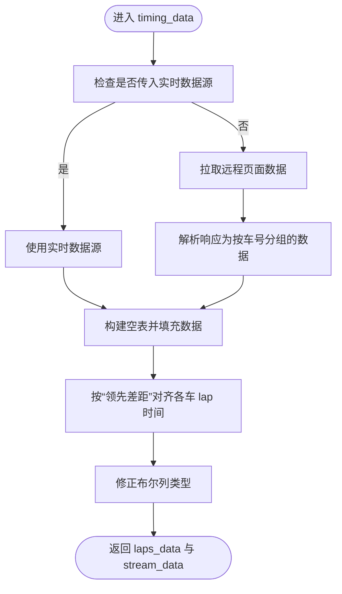
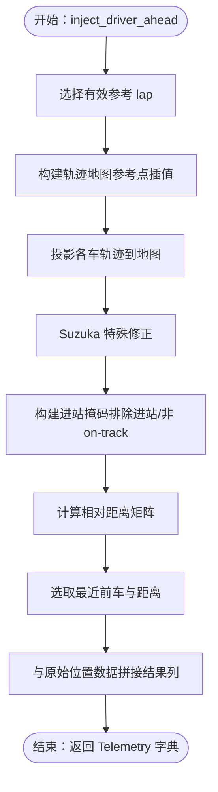
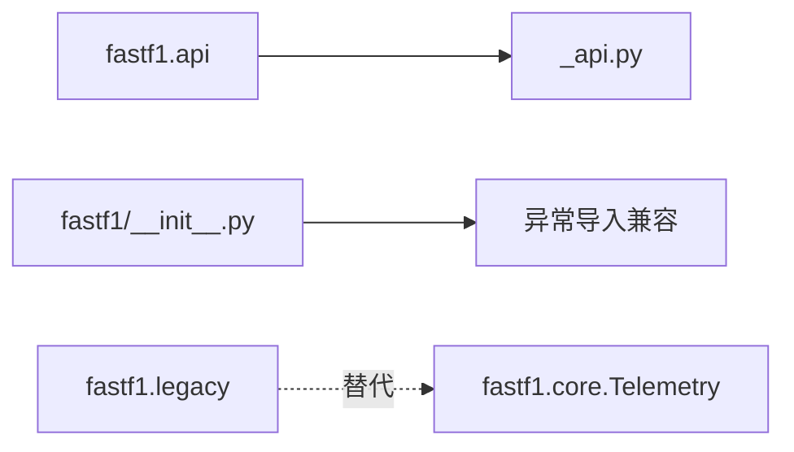

# 遗留 API

<cite>
**本文引用的文件**
- [fastf1/legacy.py](file://fastf1/legacy.py)
- [fastf1/api.py](file://fastf1/api.py)
- [fastf1/_api.py](file://fastf1/_api.py)
- [fastf1/core.py](file://fastf1/core.py)
- [docs/api_reference/legacy/f1_api.rst](file://docs/api_reference/legacy/f1_api.rst)
- [docs/api_reference/legacy/legacy.rst](file://docs/api_reference/legacy/legacy.rst)
- [docs/api_reference/deprecated_legacy.rst](file://docs/api_reference/deprecated_legacy.rst)
- [docs/changelog/v2.3.0.rst](file://docs/changelog/v2.3.0.rst)
- [docs/changelog/v3.0.x.rst](file://docs/changelog/v3.0.x.rst)
- [docs/changelog/current.rst](file://docs/changelog/current.rst)
- [fastf1/__init__.py](file://fastf1/__init__.py)
</cite>

## 目录
1. [引言](#引言)
2. [项目结构](#项目结构)
3. [核心组件](#核心组件)
4. [架构总览](#架构总览)
5. [详细组件分析](#详细组件分析)
6. [依赖分析](#依赖分析)
7. [性能考量](#性能考量)
8. [故障排查指南](#故障排查指南)
9. [结论](#结论)
10. [附录](#附录)

## 引言
本文件为 Fast-F1 遗留 API 的权威参考与迁移指南。内容覆盖已弃用或过时的接口（如旧版 F1 实时数据 API 与“车头距离”遗留计算），并提供版本历史、废弃原因、现代替代方案、迁移步骤与兼容性策略。目标是帮助用户在不破坏既有工作流的前提下，平滑过渡到新的现代化 API。

## 项目结构
Fast-F1 将遗留功能集中于两个模块：
- fastf1.api：旧版公开 API（标记为私有，未来可能移除）
- fastf1.legacy：遗留算法实现（例如“距离前车”计算）

图表来源
- [fastf1/__init__.py:1-40](file://fastf1/__init__.py#L1-L40)
- [fastf1/api.py:1-34](file://fastf1/api.py#L1-L34)
- [fastf1/_api.py:1-120](file://fastf1/_api.py#L1-L120)
- [fastf1/legacy.py:1-274](file://fastf1/legacy.py#L1-L274)
- [fastf1/core.py:877-902](file://fastf1/core.py#L877-L902)

章节来源
- [fastf1/__init__.py:1-40](file://fastf1/__init__.py#L1-L40)
- [docs/api_reference/legacy/f1_api.rst:1-11](file://docs/api_reference/legacy/f1_api.rst#L1-L11)
- [docs/api_reference/legacy/legacy.rst:1-7](file://docs/api_reference/legacy/legacy.rst#L1-L7)

## 核心组件
- 旧版公开 API（fastf1.api）
  - 作用：提供对 F1 实时数据的直接访问（如计时数据、位置数据、天气等）
  - 状态：被标记为“私有”，未来可能移除；当前仍可使用但不建议
  - 关键函数：timing_data、car_data、position_data、weather_data 等
- 遗留功能（fastf1.legacy）
  - 作用：提供“距离前车”等遗留计算逻辑
  - 现状：已被 modern Telemetry 接口替代，但仍保留以保证兼容
- 现代替代（fastf1.core.Telemetry）
  - 作用：提供更平滑、更准确的“距离前车”计算，并支持任意片段应用
  - 建议：优先使用，多 laps 场景建议逐 lap 应用后再合并

章节来源
- [fastf1/api.py:1-34](file://fastf1/api.py#L1-L34)
- [fastf1/_api.py:106-183](file://fastf1/_api.py#L106-L183)
- [fastf1/legacy.py:253-274](file://fastf1/legacy.py#L253-L274)
- [fastf1/core.py:877-902](file://fastf1/core.py#L877-L902)

## 架构总览
遗留 API 的调用路径与现代替代方案如下：

图表来源
- [fastf1/api.py:27-34](file://fastf1/api.py#L27-L34)
- [fastf1/_api.py:106-183](file://fastf1/_api.py#L106-L183)
- [fastf1/legacy.py:253-274](file://fastf1/legacy.py#L253-L274)
- [fastf1/core.py:877-902](file://fastf1/core.py#L877-L902)

## 详细组件分析

### 组件一：旧版公开 API（fastf1.api）
- 设计要点
  - 模块顶部声明“未来将被视为私有，可能移除或变更”
  - 导出常用数据接口：timing_data、car_data、position_data、weather_data 等
  - 内部实现位于 _api.py，包含数据解析、对齐与错误处理
- 典型流程（以计时数据为例）
  - 输入：会话路径、可选响应体、可选实时数据源
  - 处理：按车号拆分响应、构建空表、填充数据、对齐各车 lap 时间
  - 输出：lap 级数据与流式数据（位置、领先差距等）

图表来源
- [fastf1/_api.py:106-183](file://fastf1/_api.py#L106-L183)
- [fastf1/_api.py:185-248](file://fastf1/_api.py#L185-L248)
- [fastf1/_api.py:251-351](file://fastf1/_api.py#L251-L351)

章节来源
- [fastf1/api.py:1-34](file://fastf1/api.py#L1-L34)
- [fastf1/_api.py:106-183](file://fastf1/_api.py#L106-L183)
- [docs/api_reference/legacy/f1_api.rst:1-11](file://docs/api_reference/legacy/f1_api.rst#L1-L11)

### 组件二：遗留“距离前车”（fastf1.legacy）
- 设计要点
  - 通过参考 lap 构建轨迹地图，投影各车位置，计算相对距离
  - 对 Suzuka 特殊交叉点进行修正，避免桥下/桥上误判
  - 提供全局“距离前车”与“前车号码”列
- 现代替代
  - fastf1.core.Telemetry.add_driver_ahead 提供更平滑与准确的结果
  - 建议逐 lap 应用再合并，避免多 laps 积分误差

图表来源
- [fastf1/legacy.py:69-82](file://fastf1/legacy.py#L69-L82)
- [fastf1/legacy.py:85-250](file://fastf1/legacy.py#L85-L250)

章节来源
- [fastf1/legacy.py:1-274](file://fastf1/legacy.py#L1-L274)
- [fastf1/core.py:877-902](file://fastf1/core.py#L877-L902)

### 组件三：现代 Telemetry 替代方案
- Telemetry.add_driver_ahead
  - 支持任意片段数据（如单 lap 或少量 laps）
  - 多 laps 场景建议逐 lap 计算后合并，减少积分误差
  - 与遗留实现对比：更平滑、更准确，但遗留实现无积分误差
- 迁移建议
  - 优先使用现代接口
  - 若必须使用遗留行为（如整场数据），请明确风险并在文档中记录

章节来源
- [fastf1/core.py:877-902](file://fastf1/core.py#L877-L902)

## 依赖分析
- fastf1.api 依赖 fastf1._api 的内部实现，并发出“私有”警告
- fastf1.legacy 与 fastf1.core.Telemetry 互为替代关系，前者为后者的历史实现
- fastf1.__init__ 提供部分兼容层（如异常导入警告），确保旧代码在短期内仍可运行

图表来源
- [fastf1/api.py:27-34](file://fastf1/api.py#L27-L34)
- [fastf1/__init__.py:29-40](file://fastf1/__init__.py#L29-L40)
- [fastf1/core.py:877-902](file://fastf1/core.py#L877-L902)

章节来源
- [fastf1/api.py:1-34](file://fastf1/api.py#L1-L34)
- [fastf1/__init__.py:1-40](file://fastf1/__init__.py#L1-L40)

## 性能考量
- 旧版公开 API（fastf1.api）
  - 解析混合流式数据，涉及多次对齐与修复，开销较高
  - 建议仅在必要时使用，优先采用现代接口
- 遗留“距离前车”（fastf1.legacy）
  - 计算更平滑，但多 laps 场景存在积分误差
  - 现代 Telemetry（fastf1.core.Telemetry）更准确，建议优先使用
- 现代 Telemetry（fastf1.core.Telemetry）
  - 支持任意片段应用，逐 lap 计算后合并可降低误差
  - 在大数据量场景下建议分段处理与缓存中间结果

## 故障排查指南
- 旧版公开 API（fastf1.api）
  - 常见问题：会话无数据、时间戳不一致、lap 对齐失败
  - 处理建议：检查网络与会话可用性；确认实时数据源状态；查看日志警告
- 遗留“距离前车”（fastf1.legacy）
  - 常见问题：无有效遥测数据导致抛出异常
  - 处理建议：确保会话已加载且包含有效遥测；必要时回退到现代 Telemetry
- 现代 Telemetry（fastf1.core.Telemetry）
  - 常见问题：多 laps 场景出现积分误差
  - 处理建议：逐 lap 计算后合并；检查数据片段长度与频率

章节来源
- [fastf1/_api.py:196-203](file://fastf1/_api.py#L196-L203)
- [fastf1/legacy.py:265-273](file://fastf1/legacy.py#L265-L273)
- [fastf1/core.py:877-902](file://fastf1/core.py#L877-L902)

## 结论
- fastf1.api 已被标记为私有，未来可能移除；建议尽快迁移到现代接口
- fastf1.legacy 提供遗留行为，便于短期兼容；长期应转向 fastf1.core.Telemetry
- 迁移策略：优先使用现代 Telemetry，必要时逐 lap 合并；对旧版公开 API 逐步替换

## 附录

### 版本历史与废弃政策
- fastf1.api：自 v3.0 起被标记为私有，未来可能移除
- fastf1.legacy.inject_driver_ahead：在 v2.3 中引入修复，v3.0 起进一步完善现代替代
- 废弃政策：弃用 API 一般保留两个小版本周期，期间保持完全功能，同时提供替代方案

章节来源
- [docs/changelog/v3.0.x.rst:330-334](file://docs/changelog/v3.0.x.rst#L330-L334)
- [docs/changelog/v2.3.0.rst:32-34](file://docs/changelog/v2.3.0.rst#L32-L34)
- [docs/changelog/current.rst:94](file://docs/changelog/current.rst#L94)

### 迁移步骤与示例（以“距离前车”为例）
- 旧版（遗留）方式
  - 步骤：加载会话 → 调用遗留注入函数 → 获取指定车号的 Telemetry → 取片段 lap
  - 示例路径：[fastf1/legacy.py:19-50](file://fastf1/legacy.py#L19-L50)
- 现代方式
  - 步骤：加载会话 → 选择最快 lap → 获取车速数据 → 调用现代 Telemetry.add_driver_ahead → 取片段 lap
  - 示例路径：[fastf1/core.py:877-902](file://fastf1/core.py#L877-L902)

章节来源
- [fastf1/legacy.py:253-274](file://fastf1/legacy.py#L253-L274)
- [fastf1/core.py:877-902](file://fastf1/core.py#L877-L902)

### 兼容性与向后兼容性支持政策
- 弃用 API 在弃用周期内保持完全功能，但会发出警告
- 建议导入异常类从 fastf1.exceptions 获取，而非从其他子模块导入
- 旧版公开 API 的导入警告与兼容层由 fastf1.__init__ 提供

章节来源
- [fastf1/api.py:32-33](file://fastf1/api.py#L32-L33)
- [fastf1/__init__.py:29-40](file://fastf1/__init__.py#L29-L40)
- [docs/changelog/current.rst:84-91](file://docs/changelog/current.rst#L84-L91)