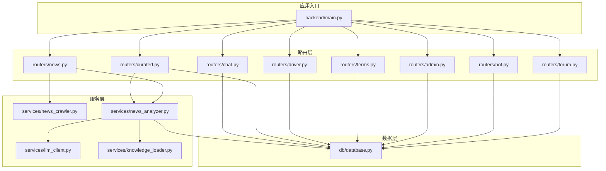
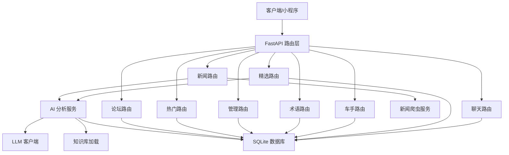
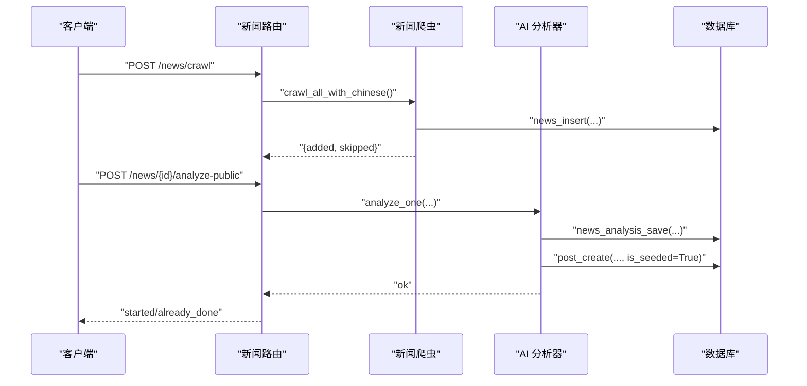
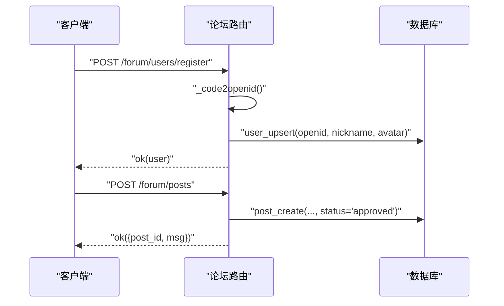
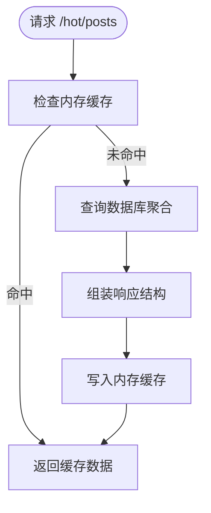
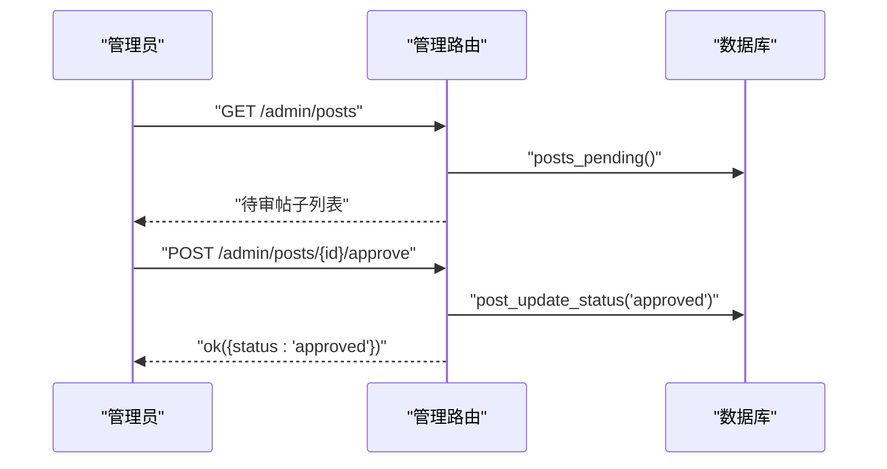
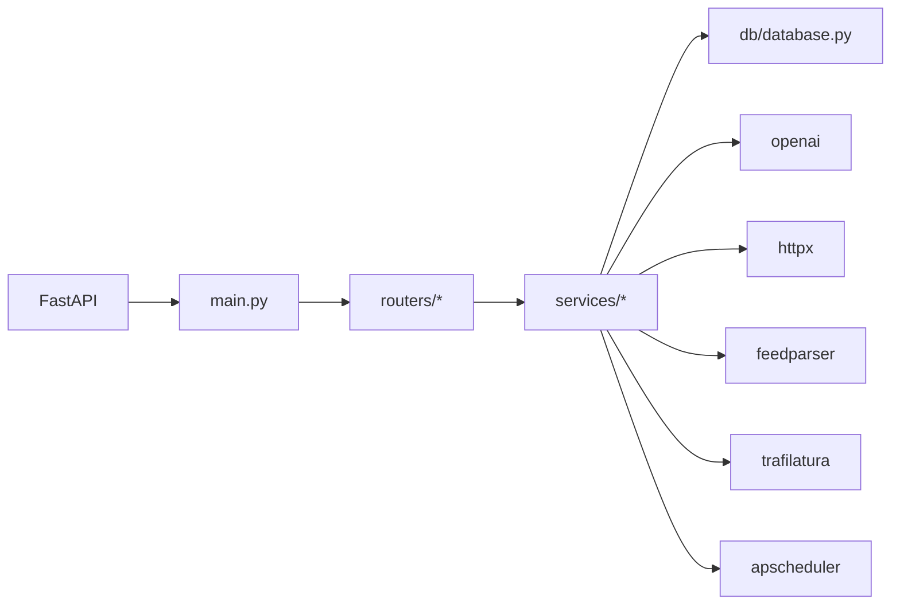

# 内容管理系统

<cite>
**本文档引用的文件**
- [backend/main.py](file://backend/main.py)
- [backend/db/database.py](file://backend/db/database.py)
- [backend/routers/news.py](file://backend/routers/news.py)
- [backend/routers/forum.py](file://backend/routers/forum.py)
- [backend/routers/hot.py](file://backend/routers/hot.py)
- [backend/routers/admin.py](file://backend/routers/admin.py)
- [backend/routers/terms.py](file://backend/routers/terms.py)
- [backend/routers/driver.py](file://backend/routers/driver.py)
- [backend/routers/curated.py](file://backend/routers/curated.py)
- [backend/routers/chat.py](file://backend/routers/chat.py)
- [backend/services/news_crawler.py](file://backend/services/news_crawler.py)
- [backend/services/news_analyzer.py](file://backend/services/news_analyzer.py)
- [backend/services/llm_client.py](file://backend/services/llm_client.py)
- [backend/services/knowledge_loader.py](file://backend/services/knowledge_loader.py)
- [backend/models/response.py](file://backend/models/response.py)
- [backend/requirements.txt](file://backend/requirements.txt)
</cite>

## 目录
1. [简介](#简介)
2. [项目结构](#项目结构)
3. [核心组件](#核心组件)
4. [架构总览](#架构总览)
5. [详细组件分析](#详细组件分析)
6. [依赖关系分析](#依赖关系分析)
7. [性能考量](#性能考量)
8. [故障排查指南](#故障排查指南)
9. [结论](#结论)
10. [附录](#附录)

## 简介
本项目为 Fast-F1 内容管理系统，围绕"新闻 + 论坛 + 热门内容 + 精选内容 + 聊天室"五大模块构建，提供：
- 新闻爬取与 AI 分析，支持手动触发与定时任务
- 论坛用户体系、分区、帖子与评论管理，内置审核与权限控制
- 热门内容推荐，基于数据库聚合与内存缓存
- 术语词典与术语审核
- 车手评分与评论系统
- 精选内容投稿与 AI 分析
- 匿名聊天室
- 与数据分析功能的深度集成（遥测指标抽取与 LLM 报告生成）

系统采用 FastAPI + SQLite + APScheduler 的组合，兼顾开发效率与运行时性能。

## 项目结构
后端采用按功能分层的组织方式：
- backend/main.py：应用入口，路由挂载、定时任务、CORS、缓存目录初始化
- backend/db/database.py：SQLite 数据层，定义表结构、索引与 CRUD 方法
- backend/routers/*：API 路由层，暴露 REST 接口
- backend/services/*：业务服务层，包含新闻爬虫、AI 分析、LLM 客户端、知识库加载
- backend/models/response.py：统一响应模型
- backend/requirements.txt：依赖清单



图表来源
- [backend/main.py:50-58](file://backend/main.py#L50-L58)
- [backend/routers/news.py:20](file://backend/routers/news.py#L20)
- [backend/routers/forum.py:33](file://backend/routers/forum.py#L33)
- [backend/routers/hot.py:13](file://backend/routers/hot.py#L13)
- [backend/routers/admin.py:25](file://backend/routers/admin.py#L25)
- [backend/routers/terms.py:6](file://backend/routers/terms.py#L6)
- [backend/routers/driver.py:21](file://backend/routers/driver.py#L21)
- [backend/routers/curated.py:15](file://backend/routers/curated.py#L15)
- [backend/routers/chat.py:14](file://backend/routers/chat.py#L14)
- [backend/services/news_crawler.py:10](file://backend/services/news_crawler.py#L10)
- [backend/services/news_analyzer.py:16](file://backend/services/news_analyzer.py#L16)
- [backend/services/llm_client.py:6](file://backend/services/llm_client.py#L6)
- [backend/services/knowledge_loader.py:10](file://backend/services/knowledge_loader.py#L10)
- [backend/db/database.py:10](file://backend/db/database.py#L10)

章节来源
- [backend/main.py:50-58](file://backend/main.py#L50-L58)
- [backend/requirements.txt:1-18](file://backend/requirements.txt#L1-L18)

## 核心组件
- 应用入口与调度
  - 初始化数据库、CORS、FastF1 缓存目录
  - 启动定时任务：新闻自动爬取、API 缓存预热
- 数据库层
  - 新闻、AI 分析、论坛分区、用户、帖子、评论、点赞、术语、车手评分/评论、精选内容、聊天室等表
  - 索引优化、WAL 模式、外键启用
- 路由层
  - 新闻：列表、详情、分析触发、爬虫触发、关联帖子
  - 论坛：用户注册/登录、分区、帖子、评论、点赞、删帖
  - 热门：帖子与新闻 Top N
  - 管理：待审列表、审核通过/拒绝、爬虫/分析触发、术语审核
  - 术语：查询、按新闻关联、提交
  - 车手：评论、评分
  - 精选：投稿、列表、分析、关联帖子
  - 聊天室：消息获取、发送、随机昵称
- 服务层
  - 新闻爬虫：RSS 源解析、去重、过滤非 F1 内容
  - AI 分析：RAG 上下文注入、Prompt 模板、三段式解读、自动转种籽帖
  - LLM 客户端：DeepSeek API 封装
  - 知识库加载：动态加载赛道、轮胎、策略等知识

章节来源
- [backend/main.py:141-161](file://backend/main.py#L141-L161)
- [backend/db/database.py:250-309](file://backend/db/database.py#L250-L309)
- [backend/routers/news.py:68-205](file://backend/routers/news.py#L68-L205)
- [backend/routers/forum.py:95-329](file://backend/routers/forum.py#L95-L329)
- [backend/routers/hot.py:32-84](file://backend/routers/hot.py#L32-L84)
- [backend/routers/admin.py:40-245](file://backend/routers/admin.py#L40-L245)
- [backend/routers/terms.py:47-127](file://backend/routers/terms.py#L47-L127)
- [backend/routers/driver.py:44-116](file://backend/routers/driver.py#L44-L116)
- [backend/routers/curated.py:25-181](file://backend/routers/curated.py#L25-L181)
- [backend/routers/chat.py:26-60](file://backend/routers/chat.py#L26-L60)
- [backend/services/news_crawler.py:133-250](file://backend/services/news_crawler.py#L133-L250)
- [backend/services/news_analyzer.py:401-586](file://backend/services/news_analyzer.py#L401-L586)
- [backend/services/llm_client.py:21-325](file://backend/services/llm_client.py#L21-L325)
- [backend/services/knowledge_loader.py:432-483](file://backend/services/knowledge_loader.py#L432-L483)

## 架构总览
系统采用"路由层-服务层-数据层"的清晰分层，配合内存缓存与定时任务，实现高性能与可维护性。



图表来源
- [backend/routers/news.py:20](file://backend/routers/news.py#L20)
- [backend/routers/forum.py:33](file://backend/routers/forum.py#L33)
- [backend/routers/hot.py:13](file://backend/routers/hot.py#L13)
- [backend/routers/admin.py:25](file://backend/routers/admin.py#L25)
- [backend/routers/terms.py:6](file://backend/routers/terms.py#L6)
- [backend/routers/driver.py:21](file://backend/routers/driver.py#L21)
- [backend/routers/curated.py:15](file://backend/routers/curated.py#L15)
- [backend/routers/chat.py:14](file://backend/routers/chat.py#L14)
- [backend/services/news_crawler.py:10](file://backend/services/news_crawler.py#L10)
- [backend/services/news_analyzer.py:16](file://backend/services/news_analyzer.py#L16)
- [backend/services/llm_client.py:6](file://backend/services/llm_client.py#L6)
- [backend/services/knowledge_loader.py:10](file://backend/services/knowledge_loader.py#L10)
- [backend/db/database.py:10](file://backend/db/database.py#L10)

## 详细组件分析

### 新闻系统
- 爬取流程
  - 支持多个 RSS 源，解析标题、摘要、链接、发布时间
  - 过滤非 F1 关键词，清理 HTML 与截断词，摘要长度限制
  - 去重（URL 唯一）、入库（news_insert）
- 分析流程
  - 用户可触发公共分析；管理员可手动分析或一键爬取+分析
  - AI 分析前注入积分榜上下文（RAG），三段式输出（技术要点/通俗解释/赛况影响）
  - 自动将分析结果转为论坛"种子帖"，按标题关键词归类到相应分区
- 推荐机制
  - 热门资讯：有 AI 解读优先，再按发布时间倒序
  - 车队标签：基于关键词匹配，内存缓存 10 分钟



图表来源
- [backend/routers/news.py:164-173](file://backend/routers/news.py#L164-L173)
- [backend/routers/news.py:132-161](file://backend/routers/news.py#L132-L161)
- [backend/services/news_crawler.py:224-232](file://backend/services/news_crawler.py#L224-L232)
- [backend/services/news_analyzer.py:401-449](file://backend/services/news_analyzer.py#L401-L449)
- [backend/db/database.py:409-420](file://backend/db/database.py#L409-L420)

章节来源
- [backend/services/news_crawler.py:133-250](file://backend/services/news_crawler.py#L133-L250)
- [backend/services/news_analyzer.py:26-102](file://backend/services/news_analyzer.py#L26-L102)
- [backend/services/news_analyzer.py:401-449](file://backend/services/news_analyzer.py#L401-L449)
- [backend/routers/news.py:68-106](file://backend/routers/news.py#L68-L106)
- [backend/routers/news.py:108-131](file://backend/routers/news.py#L108-L131)
- [backend/routers/news.py:132-161](file://backend/routers/news.py#L132-L161)
- [backend/routers/news.py:164-173](file://backend/routers/news.py#L164-L173)
- [backend/routers/news.py:176-194](file://backend/routers/news.py#L176-L194)

### 论坛系统
- 用户认证与权限
  - 微信 code 换 openid（生产环境调用官方接口，开发环境使用 code 作为 openid）
  - 昵称校验（2-12 字，不含特殊字符）
  - 管理员鉴权：X-Admin-Token
- 帖子与评论
  - 发帖/删帖：作者仅可删帖；内容长度与状态校验
  - 评论：直接发布模式（approved），自动更新评论计数
  - 点赞/点踩：同一帖子同一用户再点同类型取消，切换类型直接替换
- 分区与导航
  - 分区按 type 分组（race/team），内存缓存 1 小时
- 热度排序
  - 热门帖子：(评论数×0.5 + 浏观数×0.3) / (小时数+1)，内存缓存 10 分钟



图表来源
- [backend/routers/forum.py:95-119](file://backend/routers/forum.py#L95-L119)
- [backend/routers/forum.py:196-232](file://backend/routers/forum.py#L196-L232)
- [backend/db/database.py:456-469](file://backend/db/database.py#L456-L469)

章节来源
- [backend/routers/forum.py:57-73](file://backend/routers/forum.py#L57-L73)
- [backend/routers/forum.py:75-83](file://backend/routers/forum.py#L75-L83)
- [backend/routers/forum.py:125-139](file://backend/routers/forum.py#L125-L139)
- [backend/routers/forum.py:154-179](file://backend/routers/forum.py#L154-L179)
- [backend/routers/forum.py:182-194](file://backend/routers/forum.py#L182-L194)
- [backend/routers/forum.py:239-249](file://backend/routers/forum.py#L239-L249)
- [backend/routers/forum.py:257-276](file://backend/routers/forum.py#L257-L276)
- [backend/routers/forum.py:287-329](file://backend/routers/forum.py#L287-L329)
- [backend/db/database.py:475-491](file://backend/db/database.py#L475-L491)

### 热门内容功能
- 热门帖子 Top N：基于评论数、浏览数与发布时间的加权分数
- 热门资讯 Top N：有 AI 解读优先，再按发布时间倒序
- 缓存策略：内存缓存 TTL=10 分钟，命中直接返回



图表来源
- [backend/routers/hot.py:32-57](file://backend/routers/hot.py#L32-L57)
- [backend/db/database.py:655-677](file://backend/db/database.py#L655-L677)

章节来源
- [backend/routers/hot.py:32-84](file://backend/routers/hot.py#L32-L84)
- [backend/db/database.py:655-692](file://backend/db/database.py#L655-L692)

### 数据库设计与数据模型
- 表结构概览
  - news：新闻原文，含标题、摘要、URL、来源、发布时间
  - news_analysis：AI 分析结果（技术要点、通俗解释、赛况影响、原始输出）
  - sections：论坛分区（race/team）
  - users：微信 openid、昵称、头像
  - posts：帖子（分区、作者、状态、视图/评论计数、关联新闻）
  - comments：评论（作者、状态）
  - post_likes：点赞/点踩
  - terms：术语词典（含分类、级别、相关术语）
  - driver_ratings / driver_comments：车手评分与评论
  - curated_content：精选内容（URL、标题、摘要、平台、标签等）
  - chat_messages：聊天室消息
- 索引与约束
  - 多处复合索引优化查询
  - 外键约束保证数据一致性
  - WAL 模式提升并发写入稳定性

```mermaid
erDiagram
NEWS {
int id PK
text title
text summary
text url UK
text source
text language
int published_at
int created_at
}
NEWS_ANALYSIS {
int id PK
int news_id UK FK
text tech_points
text plain_explain
text race_impact
text raw_report
int created_at
}
SECTIONS {
int id PK
text type
text name
text slug UK
int sort_order
}
USERS {
text openid PK
text nickname
text avatar_url
int created_at
}
POSTS {
int id PK
int section_id FK
int news_id FK
int curated_id FK
text title
text content
text author_openid
text author_nickname
text status
int is_seeded
int view_count
int comment_count
int created_at
int updated_at
}
COMMENTS {
int id PK
int post_id FK
text content
text author_openid
text author_nickname
text status
int created_at
}
POST_LIKES {
int id PK
int post_id FK
text openid
text type
int created_at
}
TERMS {
int id PK
text slug UK
text name_zh
text name_en
text aliases
text short_def
text full_def
text example
text category
int level
text related_slugs
int spec_year
text scene_tags
text why_important
text data_ref
text status
text submitted_by
int created_at
}
CURATED_CONTENT {
int id PK
text url UK
text title
text summary
text cover_image
text platform
text content_type
text tags
text note
text submitted_by
text archived_html
text snapshot_image
int published_at
int created_at
int analyzed
text tech_points
text plain_explain
text race_impact
text analyzed_at
}
CHAT_MESSAGES {
int id PK
text nickname
text content
timestamp created_at
}
NEWS ||--|| NEWS_ANALYSIS : "1:1"
SECTIONS ||--o{ POSTS : "contains"
POSTS ||--o{ COMMENTS : "has"
POSTS ||--o{ POST_LIKES : "has"
USERS ||--o{ POSTS : "writes"
USERS ||--o{ COMMENTS : "writes"
POSTS ||--o{ CURATED_CONTENT : "references"
```

图表来源
- [backend/db/database.py:30-191](file://backend/db/database.py#L30-L191)

章节来源
- [backend/db/database.py:30-191](file://backend/db/database.py#L30-L191)

### 内容审核与管理流程
- 帖子审核
  - 管理员获取待审列表，支持通过/拒绝
  - 通过时帖子对所有用户可见，拒绝时不展示
- 评论审核
  - 通过时同步更新帖子评论计数
- 术语审核
  - 管理员获取待审术语列表，支持通过/拒绝
- 爬虫与分析
  - 管理员可触发一键爬取+分析，或仅爬取并查看待分析列表
  - 支持强制重新分析与清空所有分析记录



图表来源
- [backend/routers/admin.py:40-81](file://backend/routers/admin.py#L40-L81)
- [backend/db/database.py:565-572](file://backend/db/database.py#L565-L572)

章节来源
- [backend/routers/admin.py:40-128](file://backend/routers/admin.py#L40-L128)
- [backend/routers/admin.py:134-208](file://backend/routers/admin.py#L134-L208)
- [backend/db/database.py:565-572](file://backend/db/database.py#L565-L572)
- [backend/db/database.py:612-628](file://backend/db/database.py#L612-L628)

### API 端点文档与使用示例
- 新闻
  - GET /news?page&page_size&team&keyword&language
  - GET /news/{id}
  - GET /news/{id}/teams
  - GET /news/{id}/posts
  - POST /news/{id}/analyze-public?force
  - POST /news/crawl（管理员）
  - POST /news/{id}/analyze（管理员）
  - DELETE /news/{id}（管理员）
- 论坛
  - POST /forum/users/register
  - GET /forum/users/me?openid
  - GET /forum/sections
  - GET /forum/posts?section_id&page&sort=latest|hot
  - GET /forum/posts/{id}
  - POST /forum/posts
  - DELETE /forum/posts/{id}
  - POST /forum/posts/{post_id}/like
  - GET /forum/posts/{post_id}/like?openid
  - GET /forum/posts/{post_id}/comments
  - POST /forum/posts/{post_id}/comments
- 热门
  - GET /hot/posts?limit
  - GET /hot/news?limit
- 管理
  - GET /admin/posts
  - POST /admin/posts/{id}/approve
  - POST /admin/posts/{id}/reject
  - GET /admin/comments
  - POST /admin/comments/{id}/approve
  - POST /admin/comments/{id}/reject
  - POST /admin/crawl
  - POST /admin/crawl-only
  - POST /admin/analyze-one/{id}?force
  - DELETE /admin/analyses
  - GET /admin/terms
  - POST /admin/terms/{term_id}/approve
  - POST /admin/terms/{term_id}/reject
- 术语
  - GET /terms?category&level&scene
  - GET /terms/news/{news_id}
  - GET /terms/hot
  - GET /terms/popular
  - GET /terms/{slug}
  - POST /terms/submit
- 车手
  - GET /driver/{code}/comments?page
  - POST /driver/{code}/comments
  - POST /driver/comments/{comment_id}/like
  - GET /driver/{code}/rating?openid
  - POST /driver/{code}/rating
- 精选
  - POST /curated/submit
  - POST /curated/submit-manual
  - GET /curated/list?page&page_size&tag&keyword&platform
  - GET /curated/tags
  - GET /curated/{content_id}
  - GET /curated/{content_id}/posts
  - POST /curated/{content_id}/analyze?force
- 聊天室
  - GET /chat/messages?since_id
  - POST /chat/send
  - GET /chat/random-nickname

章节来源
- [backend/routers/news.py:68-205](file://backend/routers/news.py#L68-L205)
- [backend/routers/forum.py:95-329](file://backend/routers/forum.py#L95-L329)
- [backend/routers/hot.py:32-84](file://backend/routers/hot.py#L32-L84)
- [backend/routers/admin.py:40-245](file://backend/routers/admin.py#L40-L245)
- [backend/routers/terms.py:47-127](file://backend/routers/terms.py#L47-L127)
- [backend/routers/driver.py:44-116](file://backend/routers/driver.py#L44-L116)
- [backend/routers/curated.py:25-181](file://backend/routers/curated.py#L25-L181)
- [backend/routers/chat.py:26-60](file://backend/routers/chat.py#L26-L60)

### 内容发布与更新工作流程
- 自动化
  - 启动后定时任务每小时执行新闻爬取
  - 启动后定时任务每两小时刷新 events/standings 缓存
- 手动干预
  - 管理员触发一键爬取+分析或仅爬取
  - 用户点击"生成 AI 解读"触发异步分析，结果全局共享

章节来源
- [backend/main.py:151-161](file://backend/main.py#L151-L161)
- [backend/services/news_crawler.py:224-250](file://backend/services/news_crawler.py#L224-L250)
- [backend/routers/news.py:132-161](file://backend/routers/news.py#L132-L161)

### 与数据分析功能的集成
- 规则引擎
  - 基于遥测数据计算结构化指标：弯角刹车点/最低速/出弯速、赛段时间差、直线最高速/油门占比、轮胎稳定性（标准差/衰退斜率）
- LLM 报告生成
  - 将指标转换为提示词，调用 DeepSeek 生成专业中文分析报告
- RAG 上下文
  - 新闻分析时按需注入 2026 赛季积分榜上下文，避免无关 token 消耗
- 知识库加载
  - 动态加载赛道特性、轮胎参考、策略规则等知识，增强分析准确性

章节来源
- [backend/services/news_analyzer.py:26-102](file://backend/services/news_analyzer.py#L26-L102)
- [backend/services/llm_client.py:235-325](file://backend/services/llm_client.py#L235-L325)
- [backend/services/knowledge_loader.py:432-483](file://backend/services/knowledge_loader.py#L432-L483)

## 依赖关系分析
- 外部依赖
  - FastAPI、Uvicorn、fastf1、feedparser、trafilatura、apscheduler、httpx、openai、pandas/numpy/scipy 等
- 内部依赖
  - 路由层依赖数据库层与服务层
  - 服务层依赖 LLM 客户端与外部 API（微信、Ergast）
  - 数据库层提供统一 CRUD 与聚合查询



图表来源
- [backend/requirements.txt:1-18](file://backend/requirements.txt#L1-L18)
- [backend/main.py:1-161](file://backend/main.py#L1-L161)

章节来源
- [backend/requirements.txt:1-18](file://backend/requirements.txt#L1-L18)

## 性能考量
- 缓存策略
  - 新闻爬取结果按新闻 ID 缓存车队标签（TTL=10 分钟）
  - 热门内容与分区列表使用内存缓存（TTL=10 分钟/1 小时）
  - 启动后预热 events/standings 缓存，减少首次请求延迟
- 数据库优化
  - WAL 模式、外键启用、多处索引
  - 聚合查询使用原生 SQL，避免 ORM 层开销
- 异步与并发
  - AI 分析与爬取使用线程异步执行，不阻塞主线程
  - 定时任务独立调度，避免与请求路径耦合

章节来源
- [backend/routers/news.py:24-35](file://backend/routers/news.py#L24-L35)
- [backend/routers/hot.py:15-30](file://backend/routers/hot.py#L15-L30)
- [backend/main.py:116-132](file://backend/main.py#L116-L132)
- [backend/db/database.py:17-23](file://backend/db/database.py#L17-L23)
- [backend/db/database.py:100-142](file://backend/db/database.py#L100-L142)

## 故障排查指南
- 启动失败
  - 检查 .env 是否正确加载（DEEPSEEK_API_KEY、WX_APPID/WX_SECRET、ADMIN_TOKEN）
  - 查看启动脚本输出与日志
- 爬虫异常
  - RSS 源不可用或解析异常，查看日志 warning/error
  - 非 F1 内容被过滤，确认关键词
- AI 分析失败
  - LLM 客户端认证失败或网络异常
  - RAG 上下文获取失败（Ergast API），检查 season 参数
- 审核接口 403
  - 确认 X-Admin-Token 头是否正确传递
- 微信登录失败
  - 生产环境需正确配置 WX_SECRET；开发环境可用 code 作为 openid

章节来源
- [backend/main.py:163-170](file://backend/main.py#L163-L170)
- [backend/services/news_crawler.py:104-131](file://backend/services/news_crawler.py#L104-L131)
- [backend/services/news_analyzer.py:401-449](file://backend/services/news_analyzer.py#L401-L449)
- [backend/routers/admin.py:30-34](file://backend/routers/admin.py#L30-L34)
- [backend/routers/forum.py:57-73](file://backend/routers/forum.py#L57-L73)

## 结论
本内容管理系统以清晰的分层架构、完善的缓存与定时任务机制，实现了新闻自动化采集与智能分析、论坛用户与内容治理、热门内容推荐与术语词典的统一管理。通过与数据分析功能的深度集成，系统能够为用户提供高质量、可追溯、可扩展的内容体验。

## 附录
- 启动方式
  - 使用 python main.py 启动 Uvicorn 服务，监听 0.0.0.0:8000
- 环境变量
  - DEEPSEEK_API_KEY、WX_APPID、WX_SECRET、ADMIN_TOKEN
- 依赖安装
  - pip install -r backend/requirements.txt

章节来源
- [backend/main.py:172-185](file://backend/main.py#L172-L185)
- [backend/requirements.txt:1-18](file://backend/requirements.txt#L1-L18)