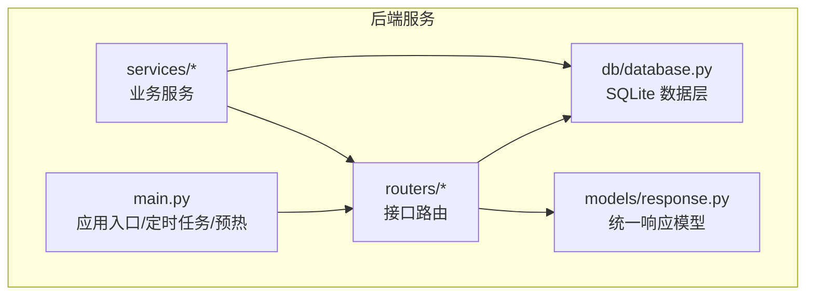
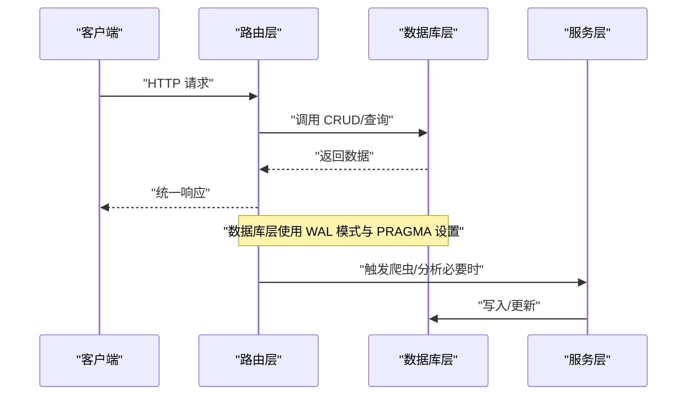
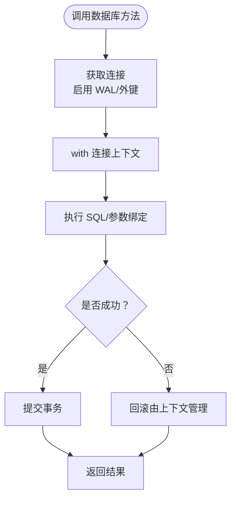
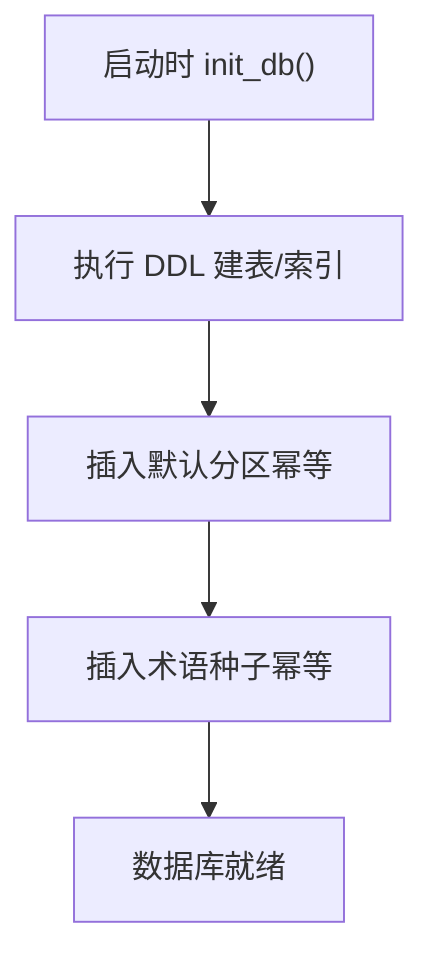
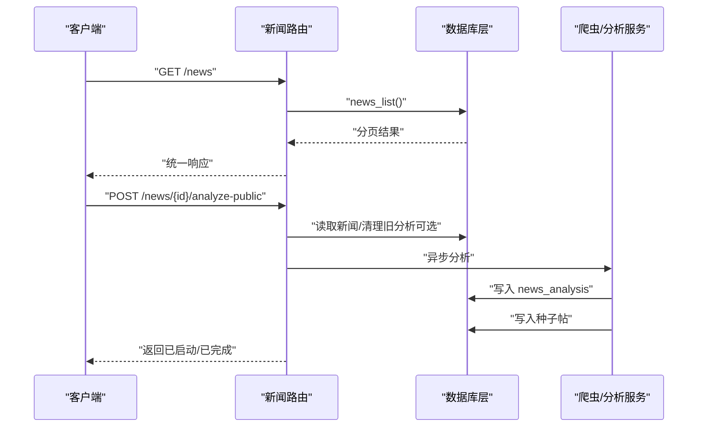
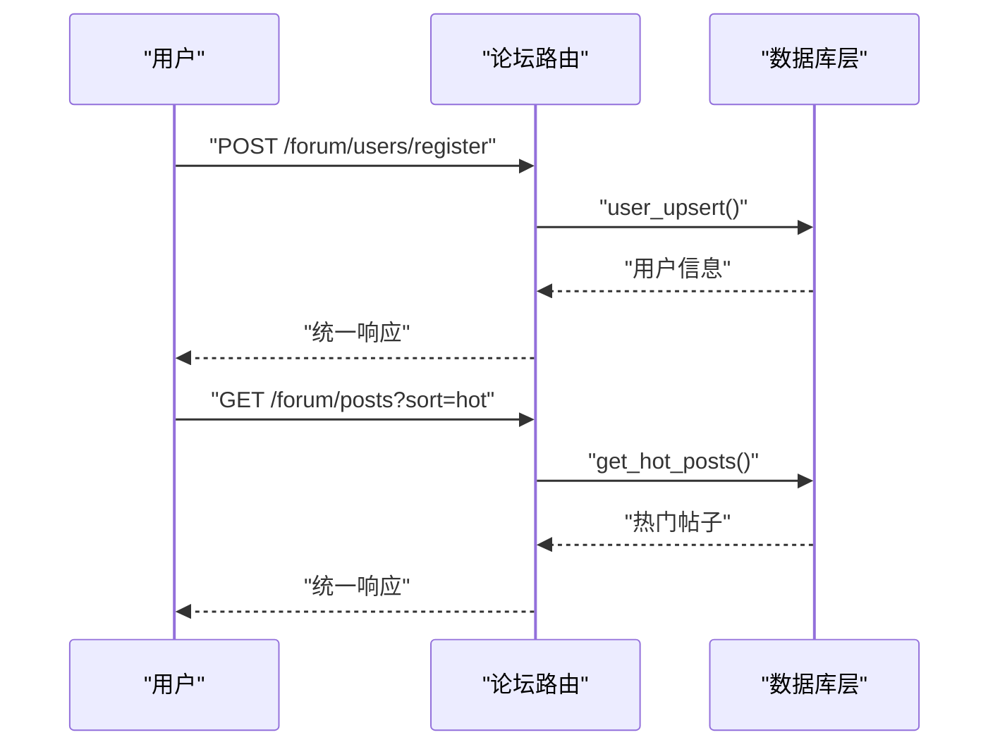
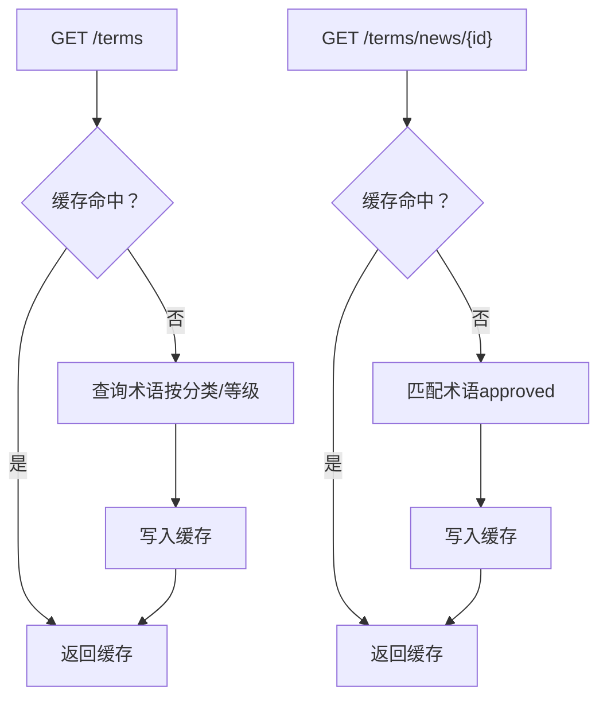
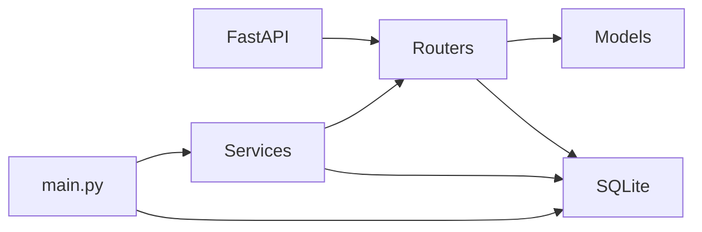

# 数据库设计

<cite>
**本文引用的文件**
- [backend/db/database.py](file://backend/db/database.py)
- [backend/main.py](file://backend/main.py)
- [backend/routers/news.py](file://backend/routers/news.py)
- [backend/routers/forum.py](file://backend/routers/forum.py)
- [backend/routers/terms.py](file://backend/routers/terms.py)
- [backend/services/news_crawler.py](file://backend/services/news_crawler.py)
- [backend/services/news_analyzer.py](file://backend/services/news_analyzer.py)
- [backend/models/response.py](file://backend/models/response.py)
- [backend/requirements.txt](file://backend/requirements.txt)
</cite>

## 目录
1. [简介](#简介)
2. [项目结构](#项目结构)
3. [核心组件](#核心组件)
4. [架构总览](#架构总览)
5. [详细组件分析](#详细组件分析)
6. [依赖分析](#依赖分析)
7. [性能考虑](#性能考虑)
8. [故障排查指南](#故障排查指南)
9. [结论](#结论)
10. [附录](#附录)

## 简介
本文件面向 Fast-F1 项目的数据库设计，围绕 SQLite 数据层进行系统化梳理，重点覆盖以下方面：
- 数据库架构与表结构设计：用户、帖子、新闻、术语、车手评分与评论等
- 数据模型关系：主外键约束、索引策略与关联查询优化
- 数据访问层实现：连接获取、事务处理与错误处理
- 数据迁移与版本管理：建表脚本、种子数据与幂等写入
- 配置与部署：连接字符串、性能调优与监控建议
- 安全与权限：管理员令牌、微信登录与内容审核
- 缓存与数据库同步：内存缓存与热点数据一致性

## 项目结构
后端数据库与业务逻辑集中在 backend 目录，数据库层位于 db/database.py，业务路由位于 routers/*，服务层位于 services/*，响应模型位于 models/response.py。



图表来源
- [backend/main.py:117-136](file://backend/main.py#L117-L136)
- [backend/routers/news.py:12-22](file://backend/routers/news.py#L12-L22)
- [backend/routers/forum.py:24-31](file://backend/routers/forum.py#L24-L31)
- [backend/routers/terms.py:3-6](file://backend/routers/terms.py#L3-L6)
- [backend/services/news_crawler.py:10-11](file://backend/services/news_crawler.py#L10-L11)
- [backend/services/news_analyzer.py:13-16](file://backend/services/news_analyzer.py#L13-L16)
- [backend/db/database.py:13-19](file://backend/db/database.py#L13-L19)

章节来源
- [backend/main.py:117-136](file://backend/main.py#L117-L136)
- [backend/db/database.py:13-19](file://backend/db/database.py#L13-L19)

## 核心组件
- 数据库层：提供连接获取、建表初始化、CRUD 方法与热点查询封装
- 业务路由：新闻、论坛、术语等接口，调用数据库层与服务层
- 服务层：爬虫与 AI 分析，负责数据采集与内容增强
- 响应模型：统一返回结构，便于前端消费

章节来源
- [backend/db/database.py:204-214](file://backend/db/database.py#L204-L214)
- [backend/routers/news.py:12-22](file://backend/routers/news.py#L12-L22)
- [backend/routers/forum.py:24-31](file://backend/routers/forum.py#L24-L31)
- [backend/routers/terms.py:3-6](file://backend/routers/terms.py#L3-L6)
- [backend/models/response.py:4-14](file://backend/models/response.py#L4-L14)

## 架构总览
数据库层采用 SQLite，通过 WAL 模式提升并发写入安全性；路由层通过依赖注入调用数据库方法；服务层负责外部数据采集与 AI 增强；应用启动时初始化数据库并启动定时任务。



图表来源
- [backend/main.py:117-136](file://backend/main.py#L117-L136)
- [backend/routers/news.py:12-22](file://backend/routers/news.py#L12-L22)
- [backend/routers/forum.py:24-31](file://backend/routers/forum.py#L24-L31)
- [backend/routers/terms.py:3-6](file://backend/routers/terms.py#L3-L6)
- [backend/db/database.py:13-19](file://backend/db/database.py#L13-L19)

## 详细组件分析

### 数据库层与表结构设计
- 数据库路径：SQLite 文件位于 db/f1.db
- 初始化：建表脚本包含新闻、AI 分析、分区、用户、帖子、评论、点赞、术语、车手评分与评论等表
- 索引：为高频查询建立索引，如新闻发布时间、帖子分区+状态+时间、评论帖子+状态+时间、术语分类/等级/状态等
- 默认分区：初始化时插入 2026 赛季主要赛事与车队分区

```mermaid
erDiagram
NEWS {
integer id PK
text title
text summary
text url UK
text source
integer published_at
integer created_at
}
NEWS_ANALYSIS {
integer id PK
integer news_id UK FK
text tech_points
text plain_explain
text race_impact
text raw_report
integer created_at
}
SECTIONS {
integer id PK
text type
text name
text slug UK
integer sort_order
}
USERS {
text openid PK
text nickname
text avatar_url
integer created_at
}
POSTS {
integer id PK
integer section_id FK
integer news_id FK
text title
text content
text author_openid
text author_nickname
text status
integer is_seeded
integer view_count
integer comment_count
integer created_at
integer updated_at
}
COMMENTS {
integer id PK
integer post_id FK
text content
text author_openid
text author_nickname
text status
integer created_at
}
POST_LIKES {
integer id PK
integer post_id FK
text openid
text type
integer created_at
unique(post_id, openid)
}
TERMS {
integer id PK
text slug UK
text name_zh
text name_en
text aliases
text short_def
text full_def
text example
text category
integer level
text related_slugs
integer spec_year
text status
text submitted_by
integer created_at
}
DRIVER_RATINGS {
integer id PK
text driver_code
text openid
integer speed
integer consist
integer defend
integer wet
integer mental
integer created_at
unique(driver_code, openid)
}
DRIVER_COMMENTS {
integer id PK
text driver_code
text content
text author_openid
text author_nickname
integer likes
integer created_at
}
NEWS ||--o| NEWS_ANALYSIS : "一对一"
SECTIONS ||--o{ POSTS : "拥有"
USERS ||--o{ POSTS : "作者"
USERS ||--o{ COMMENTS : "作者"
POSTS ||--o{ COMMENTS : "拥有"
POSTS ||--o{ POST_LIKES : "拥有"
TERMS ||--o{ DRIVER_RATINGS : "被评分"
```

图表来源
- [backend/db/database.py:26-159](file://backend/db/database.py#L26-L159)

章节来源
- [backend/db/database.py:10-19](file://backend/db/database.py#L10-L19)
- [backend/db/database.py:26-159](file://backend/db/database.py#L26-L159)
- [backend/db/database.py:204-214](file://backend/db/database.py#L204-L214)

### 数据访问层实现
- 连接获取：get_conn 返回 row_factory=sqlite3.Row 的连接，启用 WAL 与外键检查
- 事务处理：所有 CRUD 在 with 上下文中执行，保证自动提交
- 错误处理：路由层捕获异常并返回统一错误响应



图表来源
- [backend/db/database.py:13-19](file://backend/db/database.py#L13-L19)
- [backend/routers/news.py:80-82](file://backend/routers/news.py#L80-L82)
- [backend/routers/forum.py:177-179](file://backend/routers/forum.py#L177-L179)
- [backend/routers/terms.py:45-48](file://backend/routers/terms.py#L45-L48)

章节来源
- [backend/db/database.py:13-19](file://backend/db/database.py#L13-L19)
- [backend/models/response.py:9-14](file://backend/models/response.py#L9-L14)

### 数据迁移与版本管理
- 建表脚本：DDL 脚本包含建表与索引，幂等初始化
- 默认数据：初始化时插入默认分区，幂等插入
- 种子术语：terms_seed 幂等写入术语种子数据
- 版本演进：通过新增表/索引/约束实现，保持现有查询兼容



图表来源
- [backend/db/database.py:204-214](file://backend/db/database.py#L204-L214)
- [backend/db/database.py:1192-1202](file://backend/db/database.py#L1192-L1202)

章节来源
- [backend/db/database.py:204-214](file://backend/db/database.py#L204-L214)
- [backend/db/database.py:1192-1202](file://backend/db/database.py#L1192-L1202)

### 数据模型关系与查询优化
- 主外键约束：帖子引用分区与新闻；评论引用帖子；点赞引用帖子；用户与内容关联
- 索引策略：
  - 新闻：按发布时间倒序
  - 帖子：分区+状态+时间、状态+时间
  - 评论：帖子+状态+时间
  - 术语：分类/等级/状态
  - 车手评分：按车手代码
- 关联查询优化：路由层通过 JOIN 减少往返次数，如帖子详情联分区与新闻；热门计算在数据库侧完成

章节来源
- [backend/db/database.py:94-159](file://backend/db/database.py#L94-L159)
- [backend/routers/news.py:105-114](file://backend/routers/news.py#L105-L114)
- [backend/routers/forum.py:181-192](file://backend/routers/forum.py#L181-L192)

### 数据安全与权限控制
- 管理员令牌：新闻路由中通过请求头校验 ADMIN_TOKEN
- 微信登录：论坛路由通过 wx.login code 换取 openid，避免暴露 AppSecret
- 内容审核：帖子/评论默认状态为 pending，管理员可审核

章节来源
- [backend/routers/news.py:22-65](file://backend/routers/news.py#L22-L65)
- [backend/routers/forum.py:48-83](file://backend/routers/forum.py#L48-L83)

### 缓存与数据库同步
- 内存缓存：新闻路由对“新闻匹配车队”与“术语列表/按新闻”做 TTL 缓存
- 预热：启动时加载已有会话缓存与 API 缓存
- 同步策略：缓存 TTL 控制，热点数据优先命中内存，数据库作为最终一致性来源

章节来源
- [backend/routers/news.py:24-35](file://backend/routers/news.py#L24-L35)
- [backend/routers/terms.py:10-33](file://backend/routers/terms.py#L10-L33)
- [backend/main.py:55-115](file://backend/main.py#L55-L115)

### 数据访问层与业务流程

#### 新闻模块
- 爬虫：RSS 源采集，去重入库
- AI 分析：按需触发，结果写入 news_analysis，并生成论坛种子帖
- 接口：列表、详情、按车队过滤、关联帖子、触发分析



图表来源
- [backend/routers/news.py:68-83](file://backend/routers/news.py#L68-L83)
- [backend/routers/news.py:105-114](file://backend/routers/news.py#L105-L114)
- [backend/routers/news.py:128-157](file://backend/routers/news.py#L128-L157)
- [backend/services/news_crawler.py:119-129](file://backend/services/news_crawler.py#L119-L129)
- [backend/services/news_analyzer.py:220-257](file://backend/services/news_analyzer.py#L220-L257)

章节来源
- [backend/routers/news.py:68-157](file://backend/routers/news.py#L68-L157)
- [backend/services/news_crawler.py:119-147](file://backend/services/news_crawler.py#L119-L147)
- [backend/services/news_analyzer.py:220-298](file://backend/services/news_analyzer.py#L220-L298)

#### 论坛模块
- 用户：注册/登录（微信 code → openid）、获取个人信息
- 帖子：列表（支持热度/最新）、详情、发帖、删帖（仅作者）、点赞/点踩
- 评论：列表、发评论（审核）



图表来源
- [backend/routers/forum.py:95-119](file://backend/routers/forum.py#L95-L119)
- [backend/routers/forum.py:153-179](file://backend/routers/forum.py#L153-L179)
- [backend/routers/forum.py:255-274](file://backend/routers/forum.py#L255-L274)

章节来源
- [backend/routers/forum.py:95-327](file://backend/routers/forum.py#L95-L327)

#### 术语模块
- 查询：支持按分类/等级过滤，缓存术语列表与按新闻匹配结果
- 提交：用户提交术语，状态 pending，管理员审核



图表来源
- [backend/routers/terms.py:35-68](file://backend/routers/terms.py#L35-L68)
- [backend/db/database.py:1205-1221](file://backend/db/database.py#L1205-L1221)
- [backend/db/database.py:1268-1317](file://backend/db/database.py#L1268-L1317)

章节来源
- [backend/routers/terms.py:35-92](file://backend/routers/terms.py#L35-L92)
- [backend/db/database.py:1205-1317](file://backend/db/database.py#L1205-L1317)

## 依赖分析
- 应用依赖：FastAPI、Uvicorn、fastf1、pandas、numpy、OpenAI、APScheduler、feedparser、trafilatura 等
- 数据库依赖：SQLite（内置）
- 外部集成：RSS 源、微信登录、LLM 客户端



图表来源
- [backend/requirements.txt:1-15](file://backend/requirements.txt#L1-L15)
- [backend/main.py:18-41](file://backend/main.py#L18-L41)

章节来源
- [backend/requirements.txt:1-15](file://backend/requirements.txt#L1-L15)
- [backend/main.py:18-41](file://backend/main.py#L18-L41)

## 性能考虑
- 连接与并发：启用 WAL 模式，提升并发写入安全性
- 索引优化：为高频查询字段建立索引，减少排序与过滤成本
- 查询优化：路由层合并 JOIN，减少往返；热点数据内存缓存
- IO 优化：RSS 抓取与 AI 分析异步化，避免阻塞请求
- 数据库大小：SQLite 适合中小规模数据，建议定期备份与监控磁盘空间

## 故障排查指南
- 启动失败：检查 init_db 是否执行成功，确认 f1.db 创建与权限
- 查询异常：检查路由层异常捕获与统一响应返回
- 爬虫失败：检查 RSS 源可用性与网络代理，关注解析异常
- AI 分析失败：检查 LLM 客户端配置与 token，查看日志输出
- 缓存失效：检查 TTL 设置与内存占用，必要时缩短缓存时间

章节来源
- [backend/main.py:117-136](file://backend/main.py#L117-L136)
- [backend/routers/news.py:155-157](file://backend/routers/news.py#L155-L157)
- [backend/services/news_crawler.py:90-117](file://backend/services/news_crawler.py#L90-L117)
- [backend/services/news_analyzer.py:254-256](file://backend/services/news_analyzer.py#L254-L256)

## 结论
本数据库设计以 SQLite 为核心，结合合理的索引与缓存策略，满足新闻、论坛、术语与车手相关内容的业务需求。通过幂等初始化与种子数据，保障系统可重复部署与快速上线。路由层与服务层清晰分离，便于扩展与维护。

## 附录

### 数据库配置与部署
- 连接字符串：SQLite 文件路径为 db/f1.db
- 启动初始化：应用启动时自动执行 init_db
- 环境变量：管理员令牌、微信 AppID/Secret（路由中读取）
- 备份与恢复：建议定期复制 f1.db 文件进行备份；恢复时停止服务后替换文件并重启

章节来源
- [backend/db/database.py:10](file://backend/db/database.py#L10)
- [backend/main.py:117-120](file://backend/main.py#L117-L120)
- [backend/routers/news.py:22](file://backend/routers/news.py#L22)
- [backend/routers/forum.py:49-50](file://backend/routers/forum.py#L49-L50)