# 新闻系统

<cite>
**本文档引用的文件**
- [backend/main.py](file://backend/main.py)
- [backend/routers/news.py](file://backend/routers/news.py)
- [backend/routers/admin.py](file://backend/routers/admin.py)
- [backend/services/news_crawler.py](file://backend/services/news_crawler.py)
- [backend/services/news_analyzer.py](file://backend/services/news_analyzer.py)
- [backend/services/llm_client.py](file://backend/services/llm_client.py)
- [backend/db/database.py](file://backend/db/database.py)
- [backend/models/response.py](file://backend/models/response.py)
- [backend/requirements.txt](file://backend/requirements.txt)
- [miniprogram/pages/news/news.wxml](file://miniprogram/pages/news/news.wxml)
- [miniprogram/pages/news/news.wxss](file://miniprogram/pages/news/news.wxss)
- [miniprogram/pages/news/news.js](file://miniprogram/pages/news/news.js)
- [miniprogram/pages/news-detail/news-detail.wxml](file://miniprogram/pages/news-detail/news-detail.wxml)
- [miniprogram/pages/news-detail/news-detail.wxss](file://miniprogram/pages/news-detail/news-detail.wxss)
- [miniprogram/pages/news-detail/news-detail.js](file://miniprogram/pages/news-detail/news-detail.js)
- [miniprogram/pages/news-team/news-team.wxml](file://miniprogram/pages/news-team/news-team.wxml)
- [miniprogram/pages/news-team/news-team.wxss](file://miniprogram/pages/news-team/news-team.wxss)
- [miniprogram/pages/news-team/news-team.js](file://miniprogram/pages/news-team/news-team.js)
- [miniprogram/pages/forum/forum.wxml](file://miniprogram/pages/forum/forum.wxml)
- [miniprogram/pages/forum/forum.wxss](file://miniprogram/pages/forum/forum.wxss)
- [miniprogram/pages/index/index.wxml](file://miniprogram/pages/index/index.wxml)
- [miniprogram/pages/index/index.wxss](file://miniprogram/pages/index/index.wxss)
- [miniprogram/pages/standings/standings.wxml](file://miniprogram/pages/standings/standings.wxml)
- [miniprogram/pages/standings/standings.wxss](file://miniprogram/pages/standings/standings.wxss)
- [miniprogram/pages/glossary/glossary.wxml](file://miniprogram/pages/glossary/glossary.wxml)
- [miniprogram/pages/glossary/glossary.wxss](file://miniprogram/pages/glossary/glossary.wxss)
- [miniprogram/utils/api.js](file://miniprogram/utils/api.js)
- [miniprogram/app.wxss](file://miniprogram/app.wxss)
</cite>

## 更新摘要
**所做更改**
- 新增淡入过渡动画系统章节，详细说明统一的页面切换体验
- 更新前端骨架屏与交互反馈机制，增加淡入动画实现细节
- 扩展页面动画效果说明，涵盖所有主要页面的动画实现
- 增加动画性能优化和用户体验改进相关内容

## 目录
1. [简介](#简介)
2. [项目结构](#项目结构)
3. [核心组件](#核心组件)
4. [架构总览](#架构总览)
5. [详细组件分析](#详细组件分析)
6. [依赖分析](#依赖分析)
7. [性能考虑](#性能考虑)
8. [故障排查指南](#故障排查指南)
9. [结论](#结论)
10. [附录](#附录)

## 简介
本文件面向 Fast-F1 新闻系统，系统提供：
- 新闻爬取与入库：从多家 RSS 源抓取 F1 资讯，去重入库，定时自动爬取。
- 新闻分析：基于 LLM 的三段式解读（技术要点/通俗解释/赛况影响），并自动同步为论坛种子帖。
- 新闻接口：列表分页、关键词搜索、按车队过滤、详情、关联帖子、AI 分析触发。
- 车队标签匹配：基于关键词映射与正则匹配，带内存缓存。
- 管理员权限：基于 Header 的管理员令牌校验，支持手动触发爬虫与分析。
- 数据模型：SQLite 存储，包含新闻、分析结果、论坛分区、帖子、评论、用户等。
- **新增**：统一的淡入过渡动画系统，提供流畅的页面切换体验，增强用户交互感受。

## 项目结构
后端采用 FastAPI + SQLite 架构，模块划分清晰：
- 路由层：/news、/admin、/forum、/analysis 等
- 服务层：爬虫、AI 分析、LLM 客户端、规则引擎
- 数据层：SQLite DDL、CRUD 方法、索引与默认分区
- 应用入口：FastAPI 应用、CORS、定时任务、缓存目录
- **前端层**：小程序页面组件，包含新闻列表、详情、车队页面，支持骨架屏、交互反馈和淡入动画

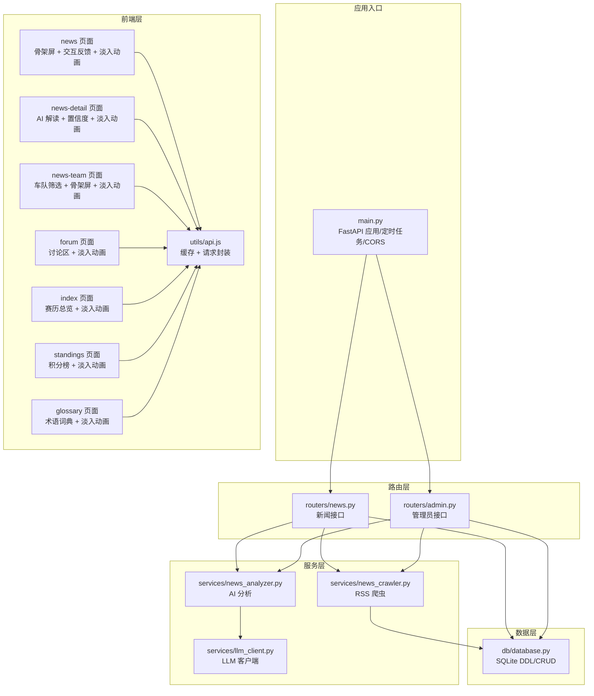

**图表来源**
- [backend/main.py:18-41](file://backend/main.py#L18-L41)
- [backend/routers/news.py:20-190](file://backend/routers/news.py#L20-L190)
- [backend/routers/admin.py:25-245](file://backend/routers/admin.py#L25-L245)
- [backend/services/news_crawler.py:14-148](file://backend/services/news_crawler.py#L14-L148)
- [backend/services/news_analyzer.py:1-298](file://backend/services/news_analyzer.py#L1-L298)
- [backend/services/llm_client.py:1-136](file://backend/services/llm_client.py#L1-L136)
- [backend/db/database.py:26-159](file://backend/db/database.py#L26-L159)
- [miniprogram/pages/news/news.wxml:1-265](file://miniprogram/pages/news/news.wxml#L1-L265)
- [miniprogram/pages/news-detail/news-detail.wxml:1-376](file://miniprogram/pages/news-detail/news-detail.wxml#L1-L376)
- [miniprogram/pages/news-team/news-team.wxml:1-66](file://miniprogram/pages/news-team/news-team.wxml#L1-L66)
- [miniprogram/pages/forum/forum.wxml:1-118](file://miniprogram/pages/forum/forum.wxml#L1-L118)
- [miniprogram/pages/index/index.wxml:1-107](file://miniprogram/pages/index/index.wxml#L1-L107)
- [miniprogram/pages/standings/standings.wxml:1-84](file://miniprogram/pages/standings/standings.wxml#L1-L84)
- [miniprogram/pages/glossary/glossary.wxml:1-200](file://miniprogram/pages/glossary/glossary.wxml#L1-L200)
- [miniprogram/utils/api.js:1-376](file://miniprogram/utils/api.js#L1-L376)

**章节来源**
- [backend/main.py:18-41](file://backend/main.py#L18-L41)
- [backend/requirements.txt:1-15](file://backend/requirements.txt#L1-L15)

## 核心组件
- 爬虫服务：RSS 源配置、条目解析、去重入库、定时任务触发。
- AI 分析器：全文抓取降级、RAG 上下文注入、Prompt 模板、三段式解析、种子帖同步。
- 新闻接口：列表/详情/按车队标签/关联帖子、公共触发分析、管理员触发爬虫/分析。
- 车队标签匹配：关键词映射 + 正则匹配 + 10 分钟内存缓存。
- 管理员权限：Header 校验，支持爬虫/分析/审核等操作。
- 数据模型：news、news_analysis、posts、sections、users、comments 等。
- **新增**：统一的淡入过渡动画系统，提供流畅的页面切换体验，增强用户交互感受。

**章节来源**
- [backend/services/news_crawler.py:14-148](file://backend/services/news_crawler.py#L14-L148)
- [backend/services/news_analyzer.py:20-298](file://backend/services/news_analyzer.py#L20-L298)
- [backend/routers/news.py:22-190](file://backend/routers/news.py#L22-L190)
- [backend/routers/admin.py:27-245](file://backend/routers/admin.py#L27-L245)
- [backend/db/database.py:26-159](file://backend/db/database.py#L26-L159)
- [miniprogram/pages/news/news.wxml:76-83](file://miniprogram/pages/news/news.wxml#L76-L83)
- [miniprogram/pages/news-detail/news-detail.js:274-313](file://miniprogram/pages/news-detail/news-detail.js#L274-L313)

## 架构总览
系统采用"路由层-服务层-数据层"的分层架构，定时任务与后台线程保证数据新鲜度与分析触发的异步化。**新增**前端采用统一的淡入过渡动画系统，提供流畅的页面切换体验，结合骨架屏与交互反馈机制，显著提升用户体验。

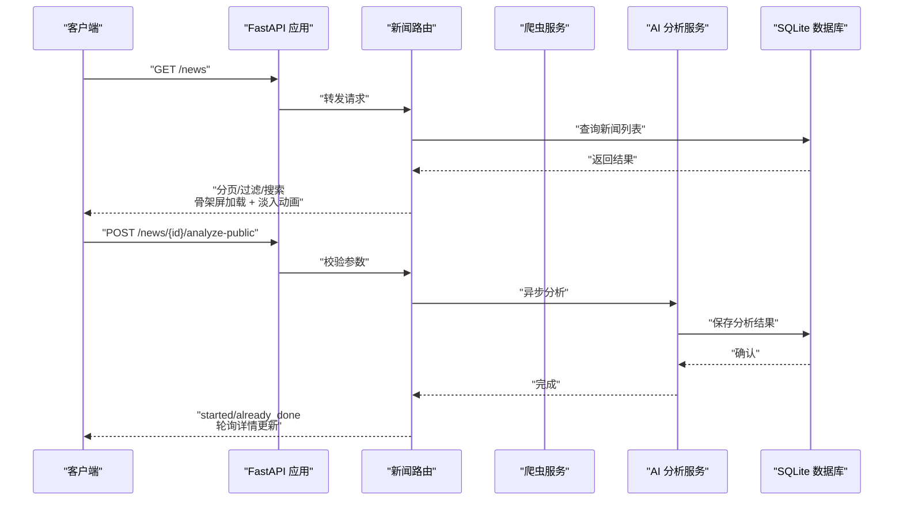

**图表来源**
- [backend/main.py:44-52](file://backend/main.py#L44-L52)
- [backend/routers/news.py:127-156](file://backend/routers/news.py#L127-L156)
- [backend/services/news_analyzer.py:220-256](file://backend/services/news_analyzer.py#L220-L256)
- [backend/db/database.py:289-324](file://backend/db/database.py#L289-L324)
- [miniprogram/pages/news/news.js:95-127](file://miniprogram/pages/news/news.js#L95-L127)
- [miniprogram/pages/news-detail/news-detail.js:208-242](file://miniprogram/pages/news-detail/news-detail.js#L208-L242)

## 详细组件分析

### 爬虫服务（RSS 新闻采集）
- 数据源配置：包含多家 F1 资讯源，统一 slug 与名称。
- 条目解析：标题/链接/摘要/发布时间标准化，过滤非 F1 内容，清理 HTML 与截断词。
- 去重入库：URL 唯一键，避免重复写入。
- 爬取策略：定时任务每小时执行，支持手动触发与批量分析联动。

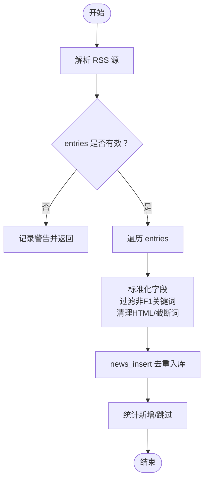

**图表来源**
- [backend/services/news_crawler.py:90-129](file://backend/services/news_crawler.py#L90-L129)
- [backend/services/news_crawler.py:39-87](file://backend/services/news_crawler.py#L39-L87)
- [backend/db/database.py:221-231](file://backend/db/database.py#L221-L231)

**章节来源**
- [backend/services/news_crawler.py:14-148](file://backend/services/news_crawler.py#L14-L148)
- [backend/db/database.py:221-231](file://backend/db/database.py#L221-L231)

### AI 分析器（三段式解读）
- RAG 上下文：仅在涉及积分/排名/冠军时注入 2026 赛季积分数据，30 分钟 TTL 缓存。
- Prompt 模板：限定时间认知、禁止历史赛季表述，强调 2026 赛季事实。
- 全文抓取：优先抓取原文正文（最多 2000 字），失败降级为 RSS 摘要。
- 结果解析：按三段式分节解析，必要时回退为纯文本。
- 种子帖同步：自动创建论坛种子帖，按标题关键词分类到分区。

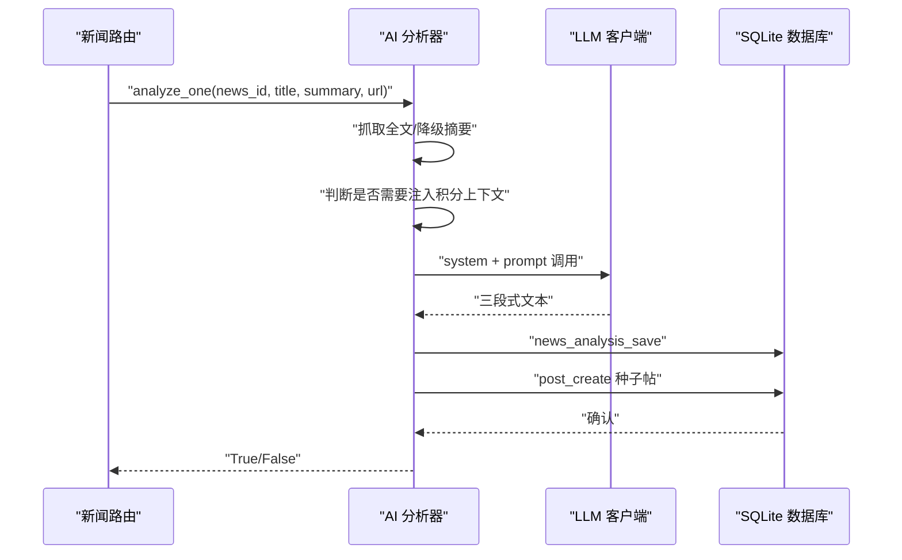

**图表来源**
- [backend/services/news_analyzer.py:220-256](file://backend/services/news_analyzer.py#L220-L256)
- [backend/services/llm_client.py:13-20](file://backend/services/llm_client.py#L13-L20)
- [backend/db/database.py:314-324](file://backend/db/database.py#L314-L324)
- [backend/db/database.py:371-385](file://backend/db/database.py#L371-L385)

**章节来源**
- [backend/services/news_analyzer.py:20-298](file://backend/services/news_analyzer.py#L20-L298)
- [backend/services/llm_client.py:1-136](file://backend/services/llm_client.py#L1-L136)
- [backend/db/database.py:314-324](file://backend/db/database.py#L314-L324)

### 新闻接口（列表/详情/分析/标签）
- 列表：支持分页、关键词搜索、按车队关键词过滤。
- 详情：返回新闻及 AI 分析字段。
- 车队标签：基于标题/摘要的关键词正则匹配，10 分钟内存缓存。
- 关联帖子：查询某条新闻关联的论坛帖子。
- 公共触发分析：任意用户可触发，支持强制重算。
- 管理员触发：手动爬虫、手动分析、清空分析记录。

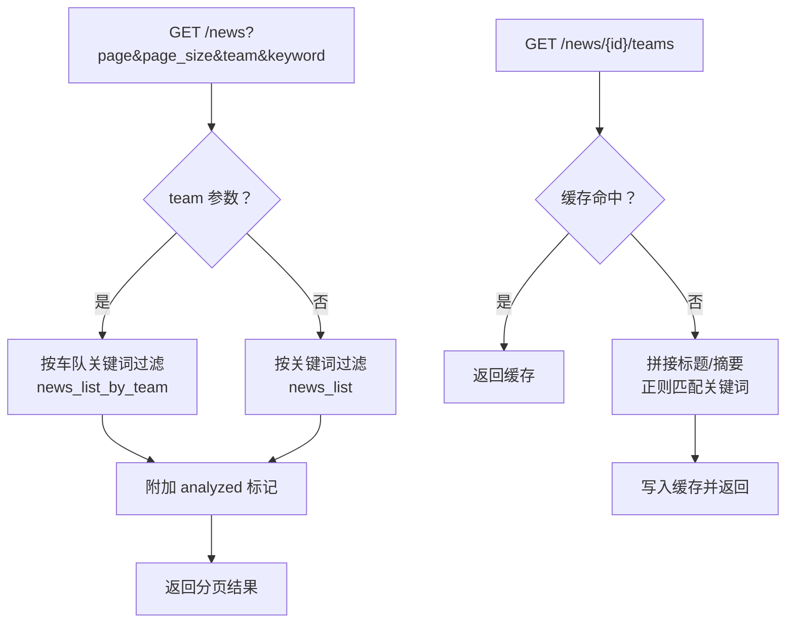

**图表来源**
- [backend/routers/news.py:68-82](file://backend/routers/news.py#L68-L82)
- [backend/routers/news.py:86-101](file://backend/routers/news.py#L86-L101)
- [backend/routers/news.py:27-34](file://backend/routers/news.py#L27-L34)
- [backend/db/database.py:234-259](file://backend/db/database.py#L234-L259)
- [backend/db/database.py:262-286](file://backend/db/database.py#L262-L286)

**章节来源**
- [backend/routers/news.py:22-190](file://backend/routers/news.py#L22-L190)
- [backend/db/database.py:234-286](file://backend/db/database.py#L234-L286)

### 管理员权限与手动触发
- Header 校验：X-Admin-Token，缺省值来自环境变量。
- 爬虫触发：手动触发爬取，返回各源新增/跳过统计。
- 单条分析：管理员可对未分析新闻进行分析，支持强制重算。
- 清空分析：删除所有分析记录，便于重新触发。

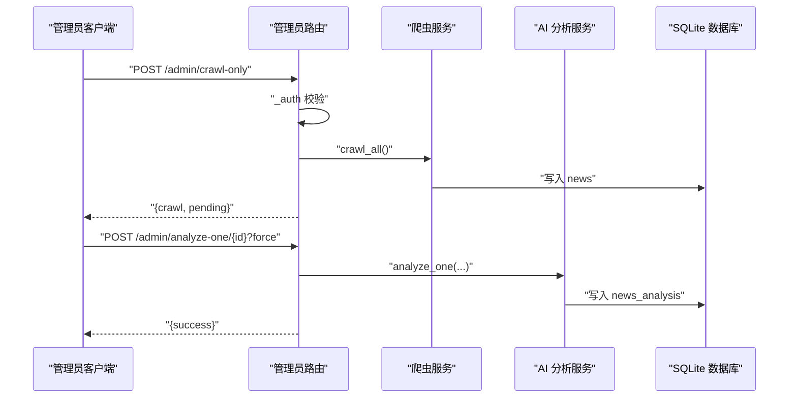

**图表来源**
- [backend/routers/admin.py:148-164](file://backend/routers/admin.py#L148-L164)
- [backend/routers/admin.py:167-191](file://backend/routers/admin.py#L167-L191)
- [backend/routers/admin.py:30-33](file://backend/routers/admin.py#L30-L33)

**章节来源**
- [backend/routers/admin.py:27-245](file://backend/routers/admin.py#L27-L245)

### 数据模型与数据库结构
- 新闻表（news）：标题、摘要、URL（唯一）、来源、发布时间。
- 分析表（news_analysis）：与新闻一对一，存储三段式分析与原始输出。
- 分区表（sections）：赛事/车队分区，slug 唯一。
- 帖子表（posts）：关联新闻与分区，状态、是否种子、浏览/评论计数。
- 用户表（users）：微信 openid 标识。
- 评论表（comments）：与帖子关联，状态管理。
- 索引：新闻发布时间、帖子分区/状态/创建时间、评论帖子/状态等。

```mermaid
erDiagram
NEWS {
int id PK
text title
text summary
text url UK
text source
int published_at
int created_at
}
NEWS_ANALYSIS {
int id PK
int news_id UK FK
text tech_points
text plain_explain
text race_impact
text raw_report
int created_at
}
SECTIONS {
int id PK
text type
text name
text slug UK
int sort_order
}
USERS {
text openid PK
text nickname
text avatar_url
int created_at
}
POSTS {
int id PK
int section_id FK
int news_id FK
text title
text content
text author_openid
text author_nickname
text status
int is_seeded
int view_count
int comment_count
int created_at
int updated_at
}
COMMENTS {
int id PK
int post_id FK
text content
text author_openid
text author_nickname
text status
int created_at
}
NEWS_ANALYSIS }o--|| NEWS : "一对一"
POSTS }o--|| SECTIONS : "属于"
POSTS }o--|| NEWS : "关联"
COMMENTS }o--|| POSTS : "属于"
```

**图表来源**
- [backend/db/database.py:26-159](file://backend/db/database.py#L26-L159)

**章节来源**
- [backend/db/database.py:26-159](file://backend/db/database.py#L26-L159)

### **新增** 淡入过渡动画系统

#### 统一动画架构
Fast-F1 新闻系统实现了统一的淡入过渡动画系统，为所有页面提供流畅的切换体验：

- **全局动画定义**：在 `app.wxss` 中定义了标准的页面入场动画 `pageEnter`
- **动画时序**：0.28秒持续时间，使用 `cubic-bezier(0.25, 0.46, 0.45, 0.94)` 缓动函数
- **动画效果**：从透明度 0 开始，轻微向下位移 22rpx，最终完全不透明
- **统一类名**：所有页面都使用 `.container` 容器和 `{{fadeIn ? 'fade-in' : ''}}` 绑定

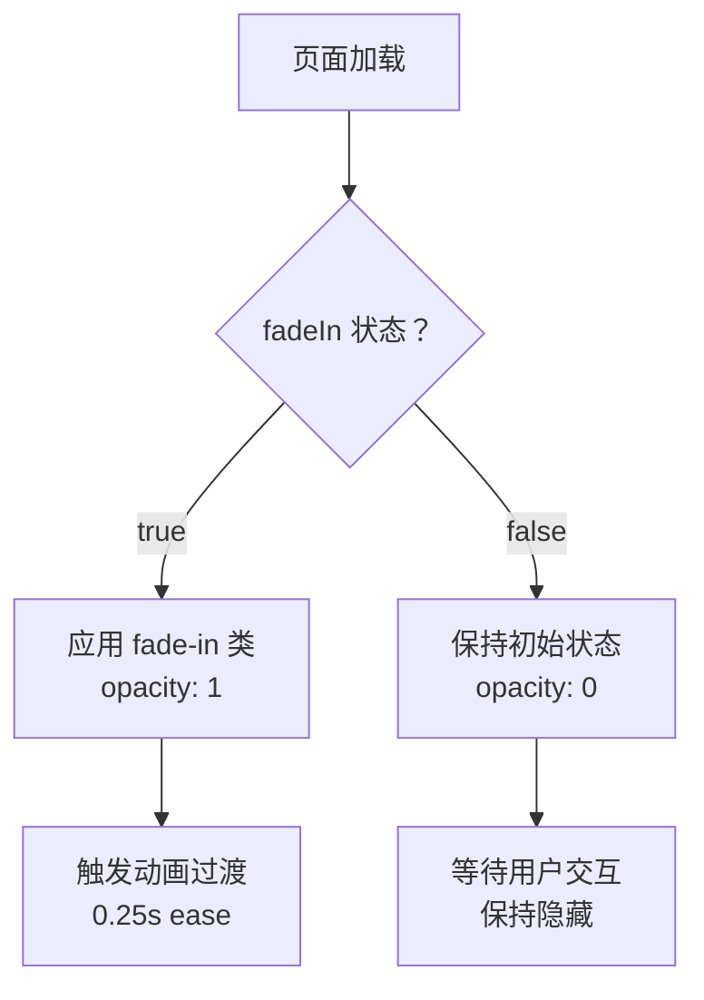

**图表来源**
- [miniprogram/app.wxss:8-16](file://miniprogram/app.wxss#L8-L16)
- [miniprogram/pages/news/news.wxml:4](file://miniprogram/pages/news/news.wxml#L4)
- [miniprogram/pages/forum/forum.wxml:3](file://miniprogram/pages/forum/forum.wxml#L3)

#### 页面动画实现细节

**新闻页面（news）**
- **容器结构**：`<view class="container {{fadeIn ? 'fade-in' : ''}}">`
- **初始状态**：`opacity: 0`，确保页面加载时不闪现
- **动画类**：`.container.fade-in { opacity: 1 }`
- **过渡时间**：0.25秒，平滑显示内容

**论坛页面（forum）**
- **统一实现**：与新闻页面相同的动画机制
- **容器样式**：`.container { opacity: 0; transition: opacity 0.25s ease; }`
- **激活类**：`.container.fade-in { opacity: 1 }`

**首页（index）**
- **完整实现**：包含倒计时、赛历、积分等复杂内容
- **动画集成**：所有子组件共享相同的淡入动画效果
- **性能优化**：使用 CSS 过渡而非 JavaScript 动画

**积分榜页面（standings）**
- **数据密集型**：包含图表和表格的复杂布局
- **动画适配**：确保图表渲染完成后才触发动画
- **响应式设计**：动画在不同屏幕尺寸下表现一致

**术语词典页面（glossary）**
- **搜索功能**：包含输入框和联想面板
- **动画兼容**：搜索面板弹出不影响主内容动画
- **交互反馈**：动画与用户输入响应完美结合

#### 动画触发机制

页面动画通过以下机制实现：

1. **生命周期钩子**：在 `onShow()` 方法中触发动画
2. **状态管理**：通过 `fadeIn` 数据属性控制动画状态
3. **异步处理**：使用 `wx.nextTick()` 确保 DOM 更新后再触发动画
4. **性能优化**：避免动画与数据加载冲突

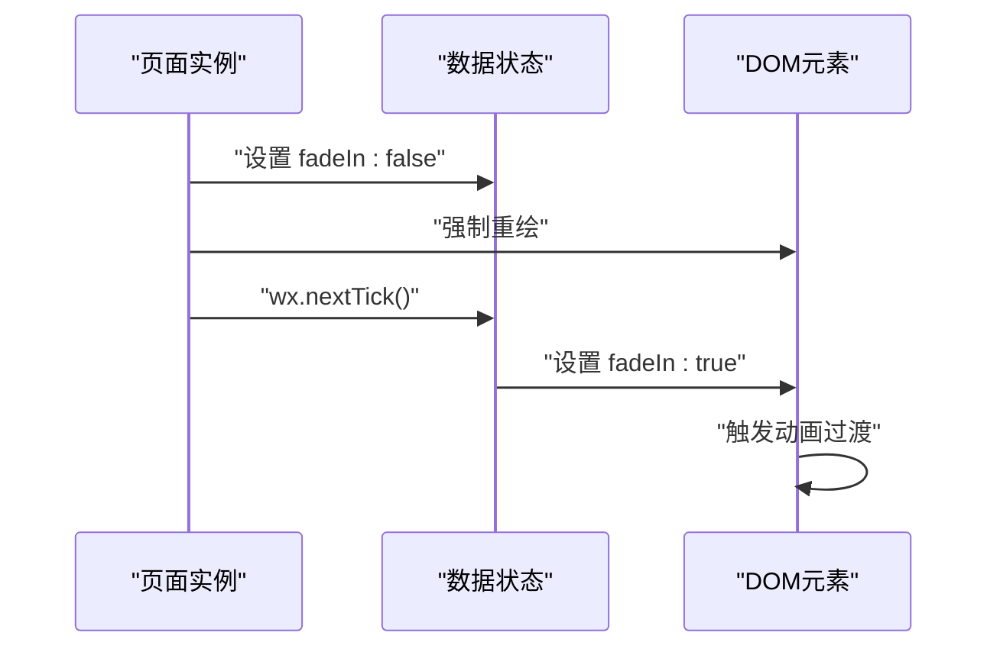

**图表来源**
- [miniprogram/pages/news/news.js:50-57](file://miniprogram/pages/news/news.js#L50-L57)
- [miniprogram/pages/index/index.js:132-140](file://miniprogram/pages/index/index.js#L132-L140)

#### 动画性能优化

- **硬件加速**：使用 `transform` 属性触发动画，启用 GPU 加速
- **最小化重绘**：只改变 `opacity` 属性，避免复杂的布局计算
- **缓动函数**：使用精心调优的贝塞尔曲线，提供自然的视觉感受
- **过渡时间**：0.25秒的时长平衡了流畅性和响应性

**章节来源**
- [miniprogram/app.wxss:8-16](file://miniprogram/app.wxss#L8-L16)
- [miniprogram/pages/news/news.wxml:4](file://miniprogram/pages/news/news.wxml#L4)
- [miniprogram/pages/news/news.wxss:3-14](file://miniprogram/pages/news/news.wxss#L3-L14)
- [miniprogram/pages/forum/forum.wxml:3](file://miniprogram/pages/forum/forum.wxml#L3)
- [miniprogram/pages/forum/forum.wxss:2-4](file://miniprogram/pages/forum/forum.wxss#L2-L4)
- [miniprogram/pages/index/index.wxml:1](file://miniprogram/pages/index/index.wxml#L1)
- [miniprogram/pages/index/index.wxss:1-12](file://miniprogram/pages/index/index.wxss#L1-L12)
- [miniprogram/pages/standings/standings.wxml:1](file://miniprogram/pages/standings/standings.wxml#L1)
- [miniprogram/pages/standings/standings.wxss:1-8](file://miniprogram/pages/standings/standings.wxss#L1-L8)
- [miniprogram/pages/glossary/glossary.wxml:2](file://miniprogram/pages/glossary/glossary.wxml#L2)
- [miniprogram/pages/glossary/glossary.wxss:3-14](file://miniprogram/pages/glossary/glossary.wxss#L3-L14)
- [miniprogram/pages/news/news.js:50-57](file://miniprogram/pages/news/news.js#L50-L57)
- [miniprogram/pages/index/index.js:132-140](file://miniprogram/pages/index/index.js#L132-L140)

### **新增** 前端骨架屏与交互反馈机制

#### 新闻列表页面骨架屏
- **骨架屏实现**：使用 `.skeleton-card` 和 `.sk-line` 类构建加载状态
- **动画效果**：采用 `shimmer` 关键帧动画，模拟加载中的闪烁效果
- **布局结构**：5个并排的骨架卡片，每个包含短/中/长三种不同宽度的线条
- **状态切换**：loading 为 true 时显示骨架屏，错误时显示错误状态，正常时显示真实内容

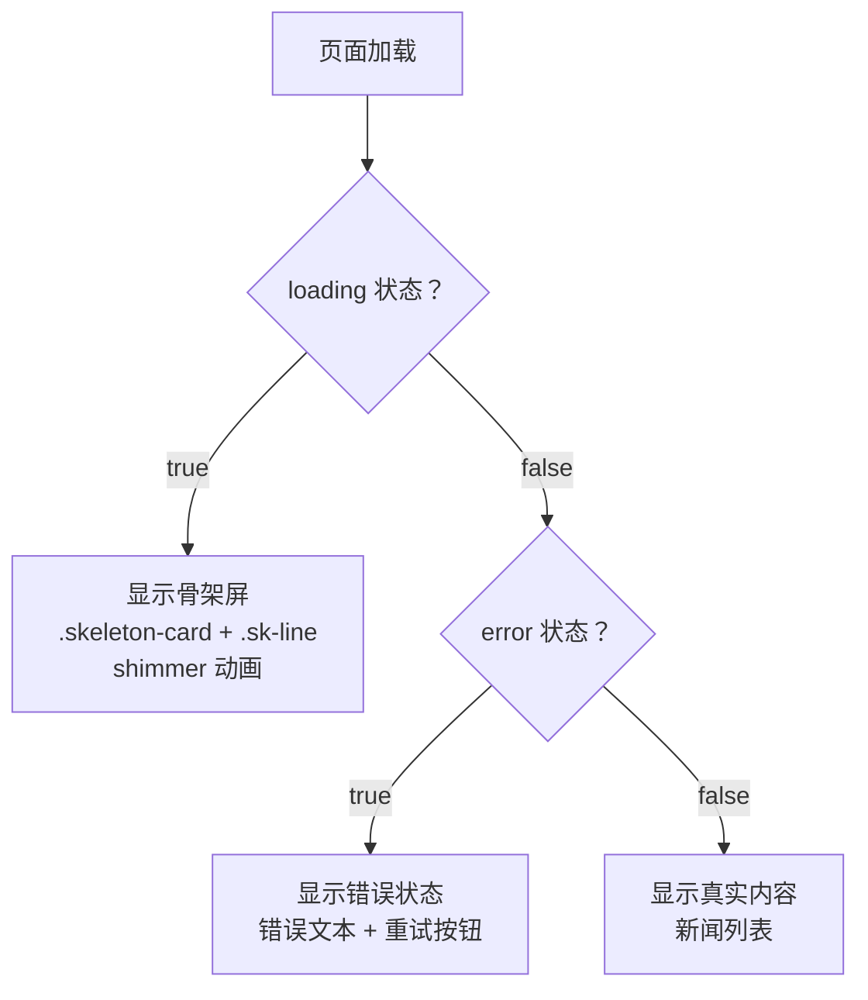

**图表来源**
- [miniprogram/pages/news/news.wxml:76-83](file://miniprogram/pages/news/news.wxml#L76-L83)
- [miniprogram/pages/news/news.wxss:145-169](file://miniprogram/pages/news/news.wxss#L145-L169)

#### 新闻详情页面交互反馈
- **AI 分析流程**：包含三个阶段的步骤条动画（全文提取 → 上下文匹配 → 递进式推理）
- **轮询机制**：每3秒轮询一次，最多轮询12次，显示加载状态
- **置信度解析**：自动识别 `[高置信度]/[中置信度]/[低置信度]` 标记并显示相应标签
- **重新分析**：支持强制重新生成，带确认对话框和加载状态
- **术语标签联动**：分析完成后自动拉取术语标签并显示

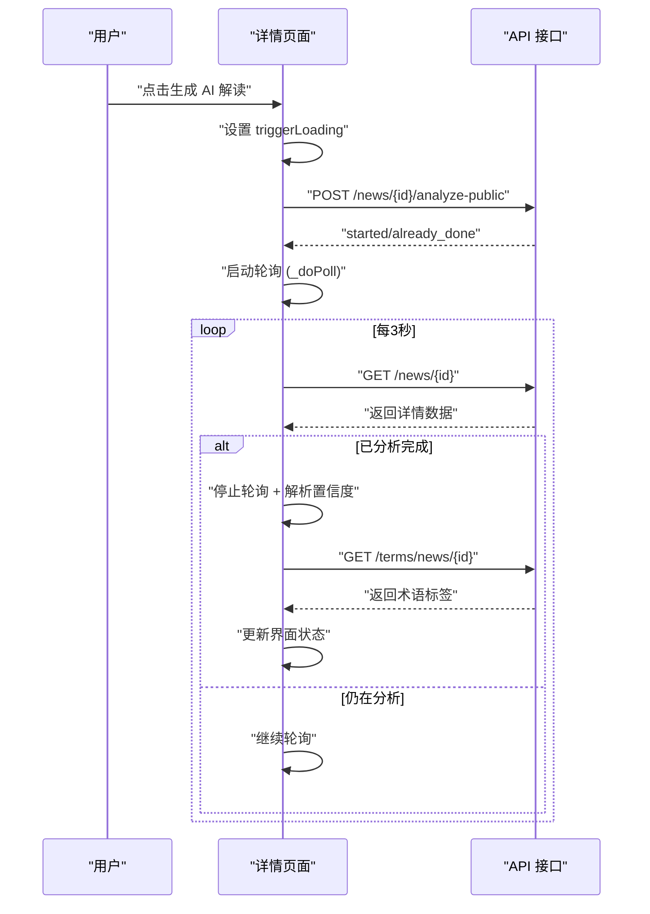

**图表来源**
- [miniprogram/pages/news-detail/news-detail.js:208-242](file://miniprogram/pages/news-detail/news-detail.js#L208-L242)
- [miniprogram/pages/news-detail/news-detail.js:274-313](file://miniprogram/pages/news-detail/news-detail.js#L274-L313)
- [miniprogram/pages/news-detail/news-detail.wxml:77-93](file://miniprogram/pages/news-detail/news-detail.wxml#L77-L93)

#### 车队页面骨架屏
- **简化实现**：相比新闻列表页面，车队页面使用更简洁的骨架屏结构
- **状态处理**：同样支持 loading、error、空结果三种状态
- **加载更多**：支持无限滚动加载更多内容

**章节来源**
- [miniprogram/pages/news/news.wxml:76-83](file://miniprogram/pages/news/news.wxml#L76-L83)
- [miniprogram/pages/news/news.wxss:145-169](file://miniprogram/pages/news/news.wxss#L145-L169)
- [miniprogram/pages/news-detail/news-detail.wxml:262-270](file://miniprogram/pages/news-detail/news-detail.wxml#L262-L270)
- [miniprogram/pages/news-detail/news-detail.js:252-271](file://miniprogram/pages/news-detail/news-detail.js#L252-L271)
- [miniprogram/pages/news-team/news-team.wxml:12-19](file://miniprogram/pages/news-team/news-team.wxml#L12-L19)

### **新增** 前端缓存与请求优化
- **本地缓存策略**：使用 `f1cache:` 前缀的本地存储，支持不同接口的 TTL
- **内存缓存**：全局内存缓存配合本地存储，提升访问速度
- **请求重试**：网络请求失败时自动重试一次，提升稳定性
- **SWR 缓存**：采用 stale-while-revalidate 策略，首屏秒出旧数据

**章节来源**
- [miniprogram/utils/api.js:4-15](file://miniprogram/utils/api.js#L4-L15)
- [miniprogram/utils/api.js:106-128](file://miniprogram/utils/api.js#L106-L128)
- [miniprogram/utils/api.js:130-153](file://miniprogram/utils/api.js#L130-L153)

## 依赖分析
- 外部依赖：FastAPI、feedparser、trafilatura、openai、apscheduler、fastf1、sqlite3。
- 组件耦合：路由层依赖数据库层；爬虫与分析服务依赖数据库层；分析服务依赖 LLM 客户端。
- 循环依赖：通过延迟导入规避（如分析服务调用数据库时）。
- **新增**：前端依赖小程序基础库，使用 wx.request 进行网络请求，支持缓存与重试机制。**新增**淡入动画系统依赖 CSS 过渡和 JavaScript 状态管理。

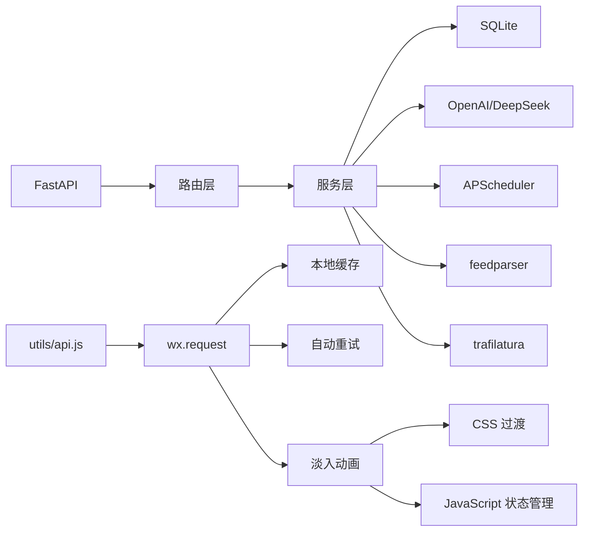

**图表来源**
- [backend/requirements.txt:1-15](file://backend/requirements.txt#L1-L15)
- [backend/services/news_crawler.py:7-8](file://backend/services/news_crawler.py#L7-L8)
- [backend/services/news_analyzer.py:8-16](file://backend/services/news_analyzer.py#L8-L16)
- [miniprogram/utils/api.js:53-84](file://miniprogram/utils/api.js#L53-L84)
- [miniprogram/app.wxss:8-16](file://miniprogram/app.wxss#L8-L16)

**章节来源**
- [backend/requirements.txt:1-15](file://backend/requirements.txt#L1-L15)

## 性能考虑
- 爬取频率：定时任务每小时执行，避免频繁抓取造成源站压力。
- 缓存策略：RAG 积分上下文 30 分钟缓存；车队标签 10 分钟缓存；**新增**前端接口缓存 5 分钟；**新增**淡入动画使用 CSS 过渡，避免 JavaScript 动画的性能开销。
- 数据库：WAL 模式提升并发写入稳定性；索引覆盖常用查询字段。
- 异步分析：公共触发分析使用后台线程，避免阻塞请求。
- 文本抓取：限制全文长度（2000 字），降低 LLM 成本与耗时。
- **新增**：骨架屏减少白屏时间，提升用户体验；轮询机制避免长时间阻塞；缓存策略提升响应速度；**新增**淡入动画提供流畅的页面切换体验，增强用户交互感受。

## 故障排查指南
- 爬取失败：检查 RSS 源可用性与 feedparser 解析异常日志。
- 分析失败：查看 LLM 客户端初始化与 API Key 配置，关注分析日志。
- 权限错误：确认 X-Admin-Token 与环境变量 ADMIN_TOKEN 设置。
- 数据库异常：检查 WAL 模式与索引是否存在，必要时重建索引。
- 前端轮询：公共触发分析返回 started 后，前端应持续轮询详情接口直至 analyzed 字段可用。
- **新增**：骨架屏不显示：检查 loading 状态绑定和样式类名；轮询失败：检查轮询定时器和网络请求；置信度不显示：检查 AI 输出格式和正则匹配；**新增**淡入动画不生效：检查 `fadeIn` 状态管理和 CSS 类名绑定。
- **新增**：动画性能问题：检查 CSS 过渡属性和硬件加速设置；页面切换卡顿：确认动画时长和缓动函数配置。

**章节来源**
- [backend/services/news_crawler.py:96-115](file://backend/services/news_crawler.py#L96-L115)
- [backend/services/news_analyzer.py:254-256](file://backend/services/news_analyzer.py#L254-L256)
- [backend/routers/admin.py:30-33](file://backend/routers/admin.py#L30-L33)
- [backend/db/database.py:17-18](file://backend/db/database.py#L17-L18)
- [miniprogram/pages/news-detail/news-detail.js:208-242](file://miniprogram/pages/news-detail/news-detail.js#L208-L242)
- [miniprogram/pages/news/news.js:50-57](file://miniprogram/pages/news/news.js#L50-L57)

## 结论
Fast-F1 新闻系统通过清晰的分层架构实现了"自动爬取 + AI 分析 + 管理员可控"的完整闭环。**最新更新**增强了前端用户体验，通过统一的淡入过渡动画系统提供流畅的页面切换体验，结合骨架屏实现快速加载、交互反馈机制提供清晰的状态指示、置信度解析帮助用户理解分析质量、术语标签联动提升内容关联性。系统在数据质量（去重、过滤）、分析准确性（RAG 上下文、Prompt 约束）、用户体验（分页/搜索/标签/异步分析/骨架屏/淡入动画）等方面均有良好设计。**新增**的淡入动画系统采用 CSS 过渡和 JavaScript 状态管理相结合的方式，确保动画性能和用户体验的双重优化。建议后续可扩展：术语标签匹配、更细粒度的权限控制、分析结果的可视化展示、动画效果的个性化定制等。

## 附录

### API 使用示例（管理员）
- 触发爬虫：POST /admin/crawl-only（Header: X-Admin-Token）
- 单条分析：POST /admin/analyze-one/{id}?force=true（Header: X-Admin-Token）
- 清空分析：DELETE /admin/analyses（Header: X-Admin-Token）

**章节来源**
- [backend/routers/admin.py:148-164](file://backend/routers/admin.py#L148-L164)
- [backend/routers/admin.py:167-191](file://backend/routers/admin.py#L167-L191)
- [backend/routers/admin.py:194-207](file://backend/routers/admin.py#L194-L207)

### 管理员权限校验流程
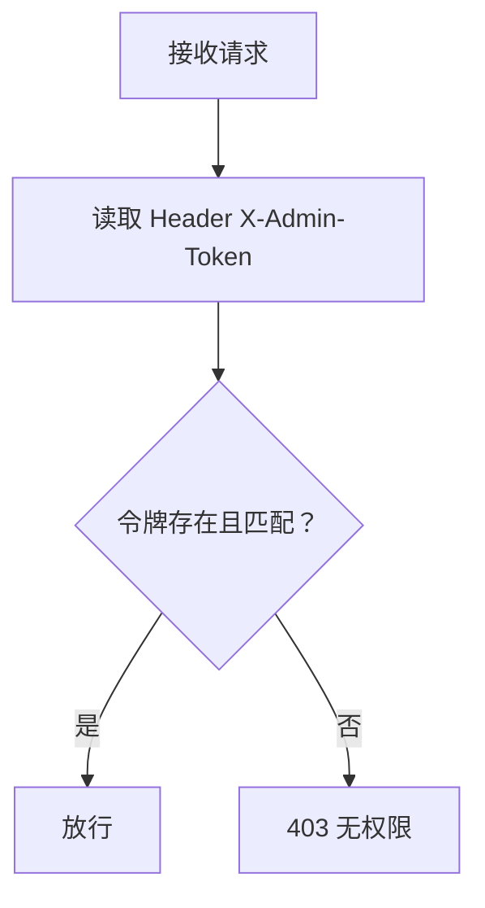

**图表来源**
- [backend/routers/admin.py:30-33](file://backend/routers/admin.py#L30-L33)
- [backend/routers/news.py:62-64](file://backend/routers/news.py#L62-L64)

### **新增** 前端淡入动画使用指南
- **动画触发**：在页面 `onShow()` 生命周期中设置 `fadeIn: false`，然后使用 `wx.nextTick()` 设置 `fadeIn: true`
- **状态管理**：通过 `{{fadeIn ? 'fade-in' : ''}}` 绑定动态类名控制动画
- **性能优化**：使用 CSS 过渡而非 JavaScript 动画，确保硬件加速
- **动画时序**：0.25秒过渡时间，使用 `ease` 缓动函数
- **兼容性**：所有页面共享相同的动画实现，确保一致的用户体验

**章节来源**
- [miniprogram/pages/news/news.js:50-57](file://miniprogram/pages/news/news.js#L50-L57)
- [miniprogram/pages/index/index.js:132-140](file://miniprogram/pages/index/index.js#L132-L140)
- [miniprogram/pages/news/news.wxml:4](file://miniprogram/pages/news/news.wxml#L4)
- [miniprogram/pages/forum/forum.wxml:3](file://miniprogram/pages/forum/forum.wxml#L3)
- [miniprogram/app.wxss:8-16](file://miniprogram/app.wxss#L8-L16)

### **新增** 前端骨架屏使用指南
- **加载状态**：在数据加载时设置 `loading: true`，自动显示骨架屏
- **错误处理**：设置 `error` 字符串，显示错误状态和重试按钮
- **空结果**：当 `items.length === 0` 且非 loading 时显示空状态
- **样式定制**：可通过修改 `.skeleton-card` 和 `.sk-line` 类调整外观
- **动画效果**：基于 CSS 动画实现，无需额外 JavaScript 处理

**章节来源**
- [miniprogram/pages/news/news.wxml:76-83](file://miniprogram/pages/news/news.wxml#L76-L83)
- [miniprogram/pages/news/news.wxss:145-169](file://miniprogram/pages/news/news.wxss#L145-L169)
- [miniprogram/pages/news-team/news-team.wxml:12-19](file://miniprogram/pages/news-team/news-team.wxml#L12-L19)