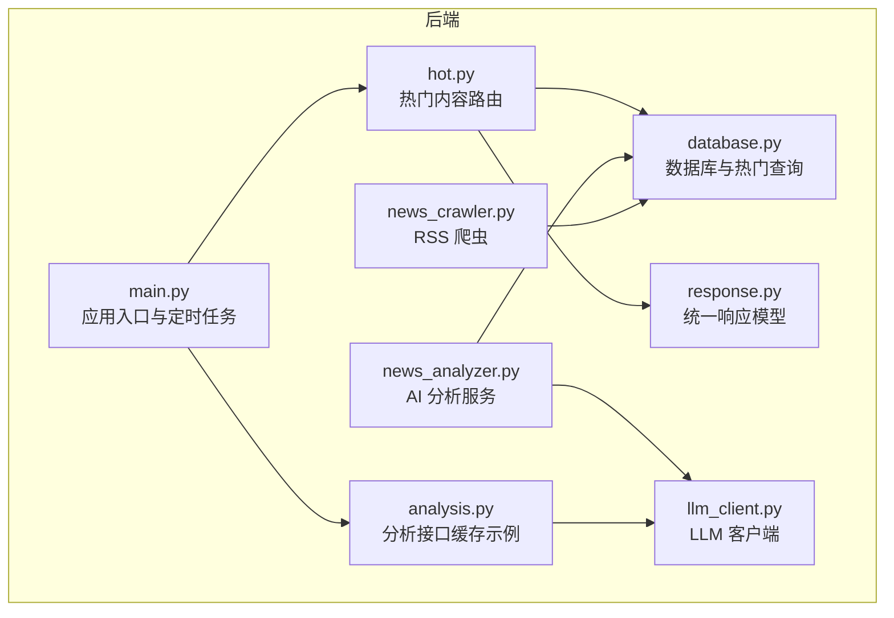
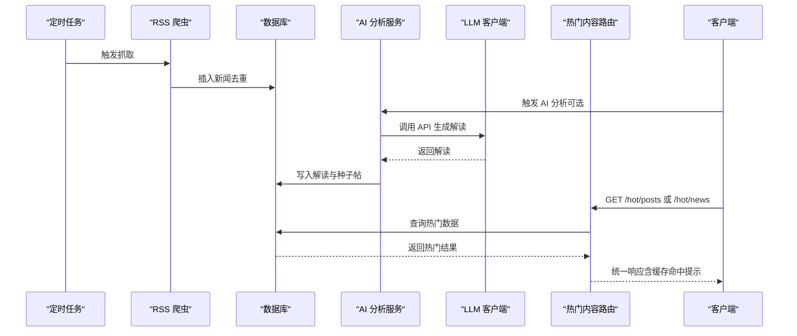
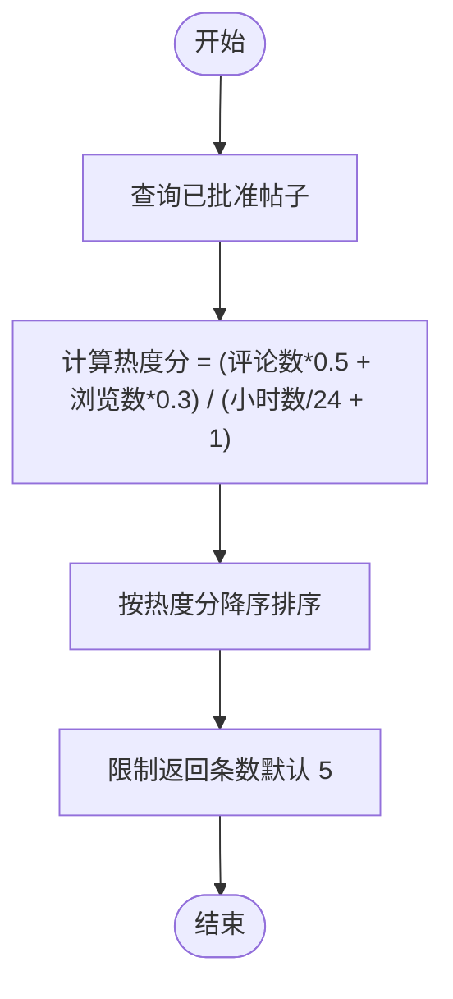
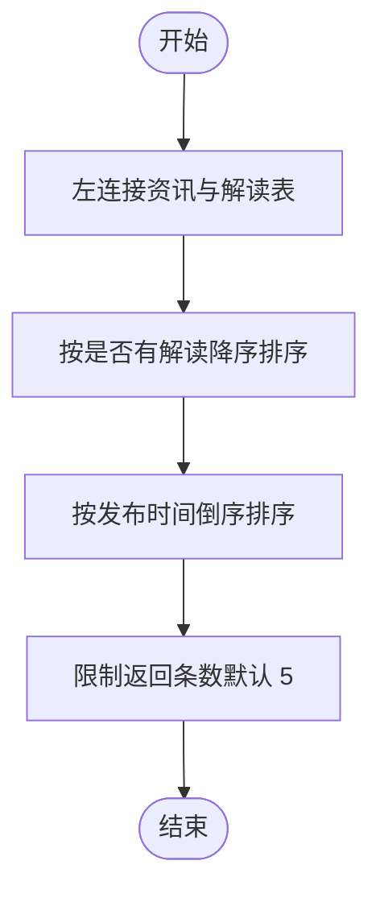
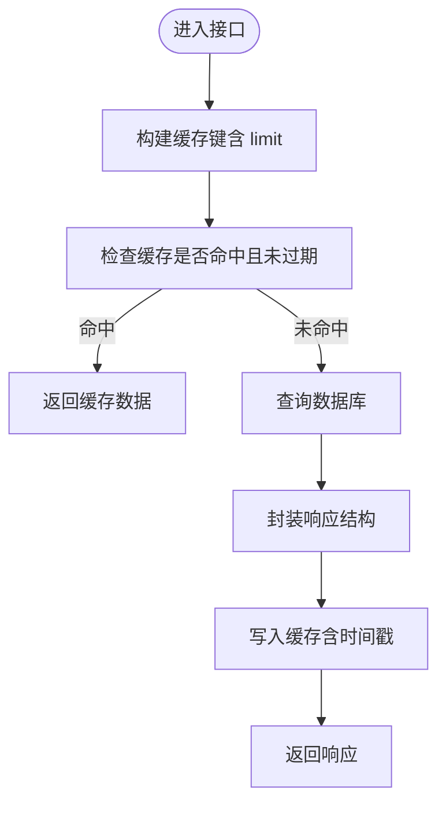
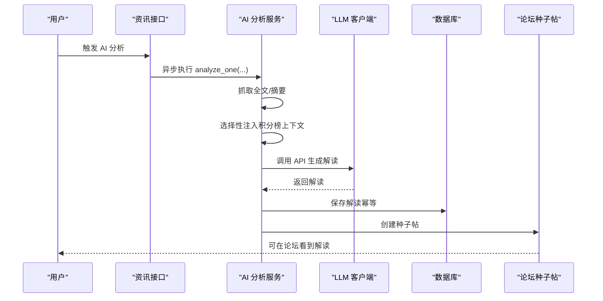
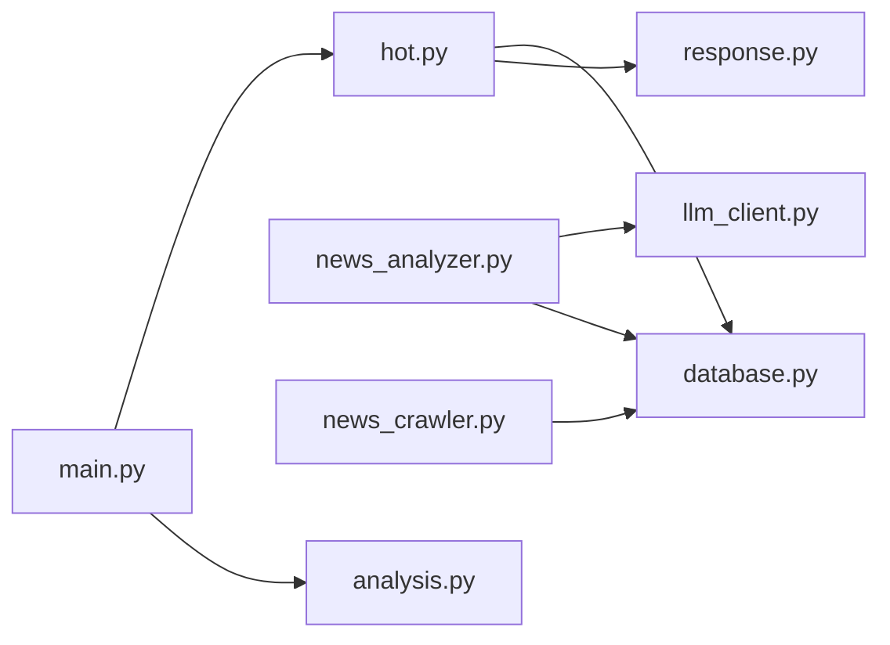

# 热门内容

<cite>
**本文引用的文件**
- [backend/routers/hot.py](file://backend/routers/hot.py)
- [backend/db/database.py](file://backend/db/database.py)
- [backend/models/response.py](file://backend/models/response.py)
- [backend/main.py](file://backend/main.py)
- [backend/services/news_analyzer.py](file://backend/services/news_analyzer.py)
- [backend/services/news_crawler.py](file://backend/services/news_crawler.py)
- [backend/services/llm_client.py](file://backend/services/llm_client.py)
- [backend/routers/analysis.py](file://backend/routers/analysis.py)
- [memory/architecture.md](file://memory/architecture.md)
</cite>

## 目录
1. [简介](#简介)
2. [项目结构](#项目结构)
3. [核心组件](#核心组件)
4. [架构总览](#架构总览)
5. [详细组件分析](#详细组件分析)
6. [依赖关系分析](#依赖关系分析)
7. [性能考量](#性能考量)
8. [故障排查指南](#故障排查指南)
9. [结论](#结论)
10. [附录](#附录)

## 简介
本文件面向 Fast-F1 热门内容功能，系统化阐述“热门帖子”和“热门资讯”的热度计算与推荐机制、缓存策略与性能优化、数据模型与统计指标，以及与数据分析功能的集成方式。文档同时提供热门内容 API 的接口定义与使用说明，帮助开发者与运营人员快速理解与维护该能力。

## 项目结构
热门内容相关模块位于后端目录，核心文件如下：
- 路由层：/backend/routers/hot.py 提供热门帖子与热门资讯接口
- 数据层：/backend/db/database.py 提供热门内容查询与数据库建表、索引
- 响应模型：/backend/models/response.py 提供统一响应结构
- 主入口：/backend/main.py 注册路由与定时任务
- AI 分析：/backend/services/news_analyzer.py 负责资讯 AI 解读与种子帖生成
- 爬虫：/backend/services/news_crawler.py 负责 RSS 新闻采集
- LLM 客户端：/backend/services/llm_client.py 负责调用 DeepSeek API
- 分析接口：/backend/routers/analysis.py 展示了缓存与性能优化实践
- 架构文档：/memory/architecture.md 提供整体性能优化思路与缓存策略

图表来源
- [backend/routers/hot.py:1-84](file://backend/routers/hot.py#L1-L84)
- [backend/db/database.py:536-566](file://backend/db/database.py#L536-L566)
- [backend/models/response.py:1-14](file://backend/models/response.py#L1-L14)
- [backend/main.py:1-157](file://backend/main.py#L1-L157)
- [backend/services/news_analyzer.py:1-298](file://backend/services/news_analyzer.py#L1-L298)
- [backend/services/news_crawler.py:1-148](file://backend/services/news_crawler.py#L1-L148)
- [backend/services/llm_client.py:1-136](file://backend/services/llm_client.py#L1-L136)
- [backend/routers/analysis.py:1-121](file://backend/routers/analysis.py#L1-L121)

章节来源
- [backend/routers/hot.py:1-84](file://backend/routers/hot.py#L1-L84)
- [backend/db/database.py:536-566](file://backend/db/database.py#L536-L566)
- [backend/models/response.py:1-14](file://backend/models/response.py#L1-L14)
- [backend/main.py:1-157](file://backend/main.py#L1-L157)

## 核心组件
- 热门帖子算法：基于评论数、浏览数与发布时间的加权评分，采用时间衰减项控制新鲜度。
- 热门资讯算法：优先展示已有 AI 解读的资讯，其次按发布时间倒序。
- 内存缓存：热门接口采用内存缓存（TTL=10分钟），命中后响应时间极低。
- AI 分析与种子帖：资讯经 AI 解读后写入数据库，并自动同步为论坛种子帖，增强社区热度。
- 爬虫与数据源：RSS 源采集，入库去重，支持定时任务自动抓取。

章节来源
- [backend/routers/hot.py:32-83](file://backend/routers/hot.py#L32-L83)
- [backend/db/database.py:536-566](file://backend/db/database.py#L536-L566)
- [backend/services/news_analyzer.py:220-298](file://backend/services/news_analyzer.py#L220-L298)
- [backend/services/news_crawler.py:119-148](file://backend/services/news_crawler.py#L119-L148)

## 架构总览
热门内容功能的端到端流程如下：
- 爬虫定时抓取 RSS 新闻，去重入库
- 用户触发 AI 分析，LLM 生成解读并写入数据库，同时生成种子帖
- 热门接口从数据库聚合热门帖子与资讯，返回统一响应
- 热门接口启用内存缓存，命中后快速返回

图表来源
- [backend/main.py:44-53](file://backend/main.py#L44-L53)
- [backend/services/news_crawler.py:119-148](file://backend/services/news_crawler.py#L119-L148)
- [backend/services/news_analyzer.py:220-298](file://backend/services/news_analyzer.py#L220-L298)
- [backend/services/llm_client.py:13-21](file://backend/services/llm_client.py#L13-L21)
- [backend/routers/hot.py:32-83](file://backend/routers/hot.py#L32-L83)
- [backend/db/database.py:536-566](file://backend/db/database.py#L536-L566)

## 详细组件分析

### 热门帖子算法与时间衰减
- 权重因子
  - 评论数权重：0.5
  - 浏览数权重：0.3
- 时间衰减
  - 分母为：(小时数/24 + 1)，即以天为单位的时间衰减，越新越热
- 排序与限制
  - 仅统计状态为“已批准”的帖子
  - 结果按热度分降序，限制条数（默认 5）

图表来源
- [backend/db/database.py:536-551](file://backend/db/database.py#L536-L551)

章节来源
- [backend/db/database.py:536-551](file://backend/db/database.py#L536-L551)

### 热门资讯算法与优先级
- 优先级规则
  - 已有 AI 解读的资讯优先
  - 之后按发布时间倒序
- 返回字段
  - 标题、来源、发布时间、是否有解读标记

图表来源
- [backend/db/database.py:554-566](file://backend/db/database.py#L554-L566)

章节来源
- [backend/db/database.py:554-566](file://backend/db/database.py#L554-L566)

### 内存缓存与 TTL
- 缓存结构
  - 字典存储：键为接口标识+limit，值为(数据, 时间戳)
- TTL 设置
  - 10 分钟（600 秒）
- 命中策略
  - 命中直接返回，未命中查询数据库并写入缓存
- 影响范围
  - 热门帖子与热门资讯接口均启用该缓存

图表来源
- [backend/routers/hot.py:15-30](file://backend/routers/hot.py#L15-L30)
- [backend/routers/hot.py:32-83](file://backend/routers/hot.py#L32-L83)

章节来源
- [backend/routers/hot.py:15-30](file://backend/routers/hot.py#L15-L30)
- [backend/routers/hot.py:32-83](file://backend/routers/hot.py#L32-L83)

### AI 分析与种子帖生成
- 触发方式
  - 用户点击“生成 AI 解读”，或管理员/运营强制重新分析
  - 后台线程异步执行，立即返回“已启动”
- 内容生成
  - 优先抓取原文全文（最多 2000 字），失败则降级使用摘要
  - 选择性注入积分榜上下文（仅涉及积分/排名/冠军争夺时）
  - LLM 输出三段式解读（技术要点/通俗解释/赛况影响）
- 数据落库
  - 写入解读表（幂等）
  - 自动同步为论坛种子帖，归属相应分区

图表来源
- [backend/routers/news.py:127-156](file://backend/routers/news.py#L127-L156)
- [backend/services/news_analyzer.py:220-298](file://backend/services/news_analyzer.py#L220-L298)
- [backend/services/llm_client.py:13-21](file://backend/services/llm_client.py#L13-L21)

章节来源
- [backend/routers/news.py:127-156](file://backend/routers/news.py#L127-L156)
- [backend/services/news_analyzer.py:220-298](file://backend/services/news_analyzer.py#L220-L298)
- [backend/services/llm_client.py:13-21](file://backend/services/llm_client.py#L13-L21)

### 爬虫与数据源
- 数据源
  - The Race、Motorsport.com、Crash.net、F1i.com
- 过滤策略
  - 过滤非 F1 内容关键词
- 去重与入库
  - URL 唯一键，避免重复
- 定时任务
  - 每小时自动抓取，不自动分析（分析由用户触发）

章节来源
- [backend/services/news_crawler.py:14-36](file://backend/services/news_crawler.py#L14-L36)
- [backend/services/news_crawler.py:90-148](file://backend/services/news_crawler.py#L90-L148)
- [backend/main.py:44-53](file://backend/main.py#L44-L53)

### 热门内容 API 接口文档
- 基础路径
  - /hot
- 热门帖子
  - 方法：GET
  - 路径：/hot/posts
  - 参数
    - limit：返回条数，默认 5
  - 响应
    - data.posts：数组，元素包含
      - id、title、author_name、comment_count、view_count、created_at、section_name
- 热门资讯
  - 方法：GET
  - 路径：/hot/news
  - 参数
    - limit：返回条数，默认 5
  - 响应
    - data.news：数组，元素包含
      - id、title、source、has_analysis、published_at

章节来源
- [backend/routers/hot.py:32-83](file://backend/routers/hot.py#L32-L83)
- [backend/models/response.py:1-14](file://backend/models/response.py#L1-L14)

### 数据模型与统计指标
- 数据库表
  - posts：帖子表，包含评论数、浏览数、分区、状态等
  - news：资讯表，包含标题、摘要、来源、发布时间等
  - news_analysis：资讯解读表，包含技术要点、通俗解释、赛况影响等
  - sections：分区表，用于资讯/帖子分类
- 热度指标
  - 热门帖子：热度分 = (评论数×0.5 + 浏览数×0.3) / (小时数/24 + 1)
  - 热门资讯：优先有解读，其次按发布时间倒序
- 统计口径
  - 仅统计状态为“已批准”的帖子
  - 仅统计已发布的资讯

章节来源
- [backend/db/database.py:26-159](file://backend/db/database.py#L26-L159)
- [backend/db/database.py:536-566](file://backend/db/database.py#L536-L566)

### 与数据分析功能的集成
- 分析接口缓存实践
  - 分析接口采用文件系统缓存（MD5 作为键），并提供统一响应结构
  - 与热门内容的内存缓存相辅相成，分别覆盖不同场景
- LLM 客户端
  - 统一的 LLM 客户端封装，便于在分析与热门内容相关模块复用
- 术语与上下文
  - 分析接口中对术语与上下文的处理经验可用于热门资讯的解读质量提升

章节来源
- [backend/routers/analysis.py:16-33](file://backend/routers/analysis.py#L16-L33)
- [backend/services/llm_client.py:13-21](file://backend/services/llm_client.py#L13-L21)
- [memory/architecture.md:131-176](file://memory/architecture.md#L131-L176)

## 依赖关系分析
- 热门内容路由依赖数据库层的热门查询函数
- 热门内容路由依赖统一响应模型
- AI 分析服务依赖 LLM 客户端与数据库层
- 爬虫依赖数据库层的新闻入库
- 主入口注册路由并启动定时任务

图表来源
- [backend/routers/hot.py:1-13](file://backend/routers/hot.py#L1-L13)
- [backend/db/database.py:536-566](file://backend/db/database.py#L536-L566)
- [backend/models/response.py:1-14](file://backend/models/response.py#L1-L14)
- [backend/services/news_analyzer.py:1-20](file://backend/services/news_analyzer.py#L1-L20)
- [backend/services/news_crawler.py:1-12](file://backend/services/news_crawler.py#L1-L12)
- [backend/services/llm_client.py:1-12](file://backend/services/llm_client.py#L1-L12)
- [backend/main.py:40-41](file://backend/main.py#L40-L41)

章节来源
- [backend/routers/hot.py:1-13](file://backend/routers/hot.py#L1-L13)
- [backend/db/database.py:536-566](file://backend/db/database.py#L536-L566)
- [backend/models/response.py:1-14](file://backend/models/response.py#L1-L14)
- [backend/services/news_analyzer.py:1-20](file://backend/services/news_analyzer.py#L1-L20)
- [backend/services/news_crawler.py:1-12](file://backend/services/news_crawler.py#L1-L12)
- [backend/services/llm_client.py:1-12](file://backend/services/llm_client.py#L1-L12)
- [backend/main.py:40-41](file://backend/main.py#L40-L41)

## 性能考量
- 服务端内存缓存（TTL=10分钟）
  - 热门接口命中后响应时间极低，适合对实时性要求不高的内容
- 前端缓存策略（小程序）
  - stale-while-revalidate 模式，命中缓存立即返回，后台静默刷新
  - 不同接口设置不同 TTL，如 analysis=30min、events=1h、telemetry=10min
- 并行与批处理
  - 分析接口展示了并行调用外部 API 的实践，可借鉴到热门内容的上游数据准备阶段
- I/O 优化
  - SQLite WAL 模式提升并发写入稳定性
  - 适当索引（如 posts/status、news/published_at）有助于热门查询性能

章节来源
- [backend/routers/hot.py:15-30](file://backend/routers/hot.py#L15-L30)
- [memory/architecture.md:115-129](file://memory/architecture.md#L115-L129)
- [memory/architecture.md:131-176](file://memory/architecture.md#L131-L176)
- [backend/db/database.py:94-99](file://backend/db/database.py#L94-L99)

## 故障排查指南
- 热门接口返回错误
  - 检查数据库连接与表结构是否初始化完成
  - 查看统一响应的错误返回，定位具体异常
- AI 分析未生效
  - 确认 LLM 客户端可用且 API Key 配置正确
  - 检查是否触发了“强制重新分析”，或解读表是否已存在
- 爬虫未抓取到新内容
  - 检查 RSS 源是否可访问，关键词过滤是否误伤
  - 查看定时任务是否正常运行

章节来源
- [backend/models/response.py:12-14](file://backend/models/response.py#L12-L14)
- [backend/services/llm_client.py:13-21](file://backend/services/llm_client.py#L13-L21)
- [backend/main.py:44-53](file://backend/main.py#L44-L53)
- [backend/services/news_crawler.py:90-148](file://backend/services/news_crawler.py#L90-L148)

## 结论
热门内容功能通过“热度分算法 + 时间衰减 + 内存缓存”的组合，实现了稳定高效的热门帖子与资讯展示。AI 分析与种子帖机制进一步提升了内容质量与社区活跃度。建议在现有基础上：
- 对热门帖子算法进行 A/B 实验，微调权重因子
- 扩展热门资讯的分类标签体系，支持实时热点与历史热门的区分
- 引入协同过滤或内容相似度策略，增强个性化推荐
- 完善缓存失效与预热机制，提升冷启动与突发流量下的稳定性

## 附录
- 术语与上下文注入
  - AI 分析服务会根据关键词判断是否注入积分榜上下文，避免不必要的 token 消耗
- 服务端缓存与前端缓存
  - 服务端内存缓存与小程序前端缓存共同作用，最大化响应速度与用户体验

章节来源
- [backend/services/news_analyzer.py:25-80](file://backend/services/news_analyzer.py#L25-L80)
- [memory/architecture.md:115-129](file://memory/architecture.md#L115-L129)