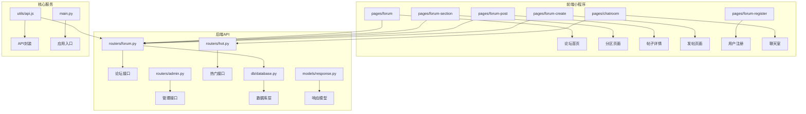
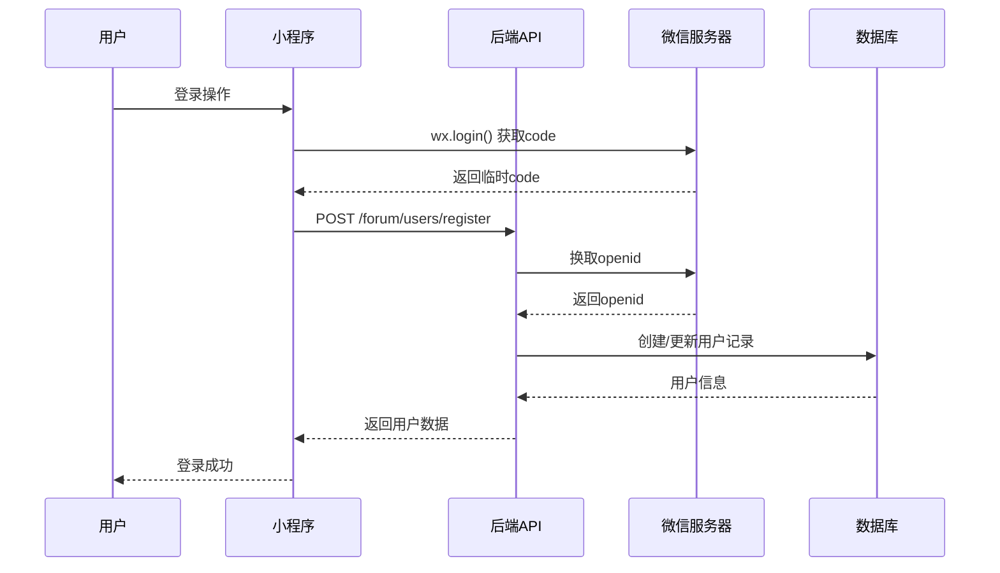
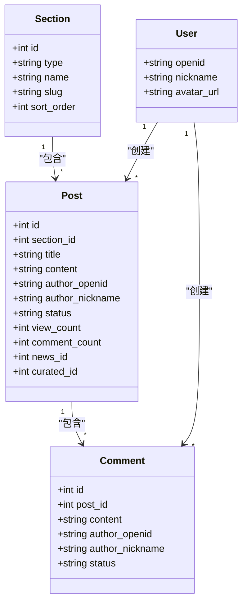
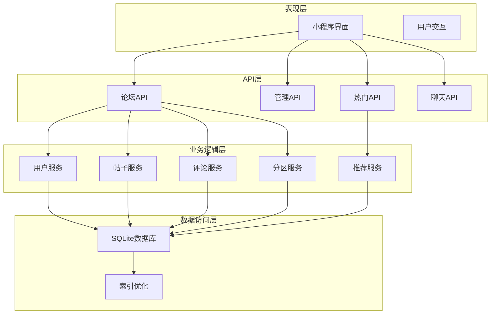
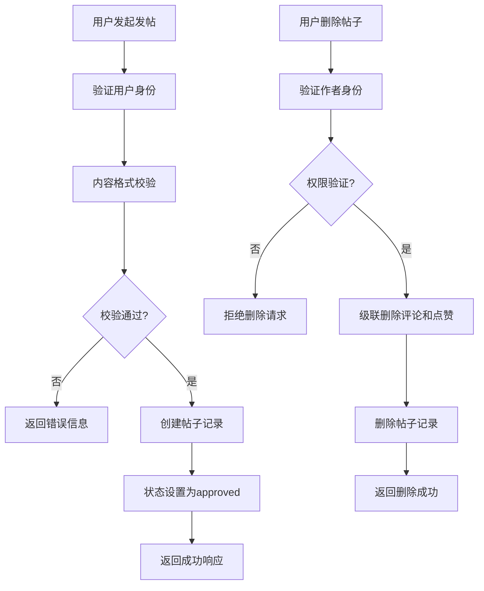
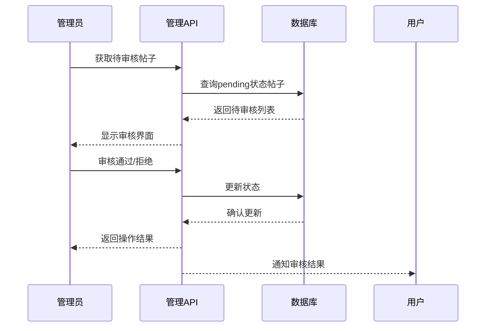
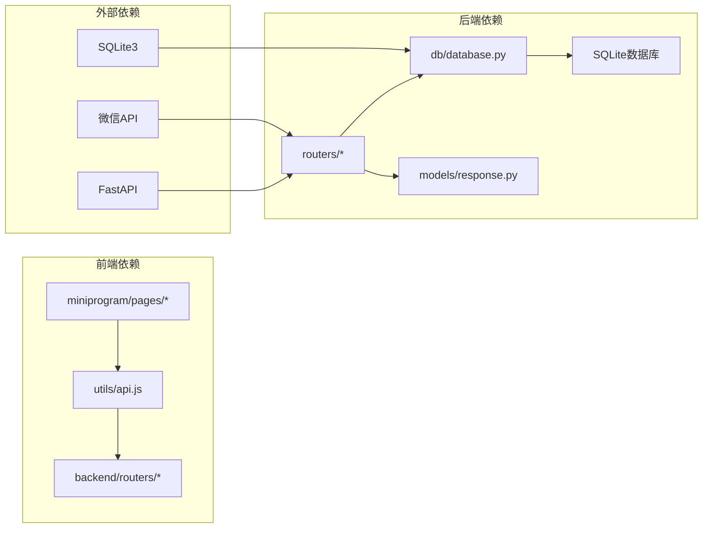
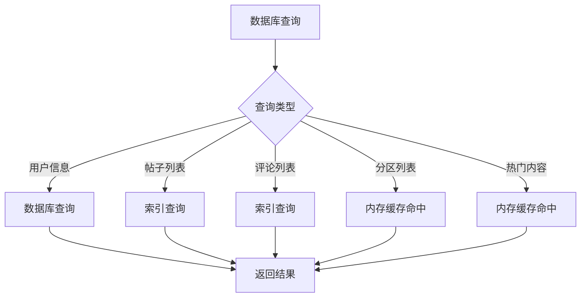

# 社区功能

<cite>
**本文档引用的文件**
- [forum.py](file://backend/routers/forum.py)
- [response.py](file://backend/models/response.py)
- [database.py](file://backend/db/database.py)
- [api.js](file://miniprogram/utils/api.js)
- [forum.js](file://miniprogram/pages/forum/forum.js)
- [forum-create.js](file://miniprogram/pages/forum-create/forum-create.js)
- [forum-post.js](file://miniprogram/pages/forum-post/forum-post.js)
- [forum-section.js](file://miniprogram/pages/forum-section/forum-section.js)
- [forum-register.js](file://miniprogram/pages/forum-register/forum-register.js)
- [chatroom.js](file://miniprogram/pages/chatroom/chatroom.js)
- [admin.py](file://backend/routers/admin.py)
- [hot.py](file://backend/routers/hot.py)
- [main.py](file://backend/main.py)
</cite>

## 目录
1. [简介](#简介)
2. [项目结构](#项目结构)
3. [核心组件](#核心组件)
4. [架构概览](#架构概览)
5. [详细组件分析](#详细组件分析)
6. [依赖关系分析](#依赖关系分析)
7. [性能考虑](#性能考虑)
8. [故障排除指南](#故障排除指南)
9. [结论](#结论)

## 简介

Fast-F1 项目包含一个完整的社区功能模块，为用户提供论坛、评论、点赞、热门推荐和匿名聊天等社交互动功能。该系统采用前后端分离架构，后端基于 FastAPI 提供 RESTful API，前端使用微信小程序实现用户界面。

社区功能的主要特点包括：
- 基于微信生态的用户认证系统
- 分区化的论坛结构（赛事分区和车队分区）
- 实时的社交互动功能
- 管理员审核机制
- 热门内容推荐算法
- 匿名聊天室功能

## 项目结构

社区功能分布在三个主要层次：

**图表来源**
- [forum.py:1-329](file://backend/routers/forum.py#L1-L329)
- [database.py:1-800](file://backend/db/database.py#L1-L800)
- [api.js:1-376](file://miniprogram/utils/api.js#L1-L376)

**章节来源**
- [forum.py:1-329](file://backend/routers/forum.py#L1-L329)
- [database.py:1-800](file://backend/db/database.py#L1-L800)
- [api.js:1-376](file://miniprogram/utils/api.js#L1-L376)

## 核心组件

### 用户认证系统

社区功能采用微信授权登录机制，确保用户身份的安全性和可靠性：

**图表来源**
- [forum-register.js:26-52](file://miniprogram/pages/forum-register/forum-register.js#L26-L52)
- [forum.py:95-118](file://backend/routers/forum.py#L95-L118)

### 论坛分区系统

系统支持两种类型的分区：赛事分区和车队分区，以及综合讨论分区：

**图表来源**
- [database.py:54-98](file://backend/db/database.py#L54-L98)
- [forum.py:145-152](file://backend/routers/forum.py#L145-L152)

**章节来源**
- [database.py:54-98](file://backend/db/database.py#L54-L98)
- [forum.py:125-139](file://backend/routers/forum.py#L125-L139)

### 热门内容推荐

系统实现了智能的热门内容推荐算法，综合考虑内容的互动度和时效性：

**章节来源**
- [hot.py:32-57](file://backend/routers/hot.py#L32-L57)
- [database.py:655-676](file://backend/db/database.py#L655-L676)

## 架构概览

社区功能采用分层架构设计，确保各组件职责清晰、耦合度低：

**图表来源**
- [main.py:50-58](file://backend/main.py#L50-L58)
- [forum.py:33-33](file://backend/routers/forum.py#L33-L33)
- [admin.py:25-23](file://backend/routers/admin.py#L25-L23)

## 详细组件分析

### 论坛核心功能

#### 帖子管理系统

帖子系统支持完整的生命周期管理，从创建到删除的全流程控制：

**图表来源**
- [forum.py:196-231](file://backend/routers/forum.py#L196-L231)
- [database.py:475-515](file://backend/db/database.py#L475-L515)

#### 评论系统

评论系统提供实时的互动功能，支持内容审核和管理：

**章节来源**
- [forum.py:287-328](file://backend/routers/forum.py#L287-L328)
- [database.py:583-627](file://backend/db/database.py#L583-L627)

### 用户界面组件

#### 论坛首页

论坛首页集成了分区导航、热门内容展示和快捷操作功能：

**章节来源**
- [forum.js:4-142](file://miniprogram/pages/forum/forum.js#L4-L142)
- [api.js:212-213](file://miniprogram/utils/api.js#L212-L213)

#### 帖子详情页

帖子详情页提供完整的内容展示和互动功能：

**章节来源**
- [forum-post.js:18-159](file://miniprogram/pages/forum-post/forum-post.js#L18-L159)
- [api.js:219-244](file://miniprogram/utils/api.js#L219-L244)

#### 发帖页面

发帖页面支持富文本编辑和内容预览功能：

**章节来源**
- [forum-create.js:20-88](file://miniprogram/pages/forum-create/forum-create.js#L20-L88)
- [api.js:222-223](file://miniprogram/utils/api.js#L222-L223)

### 管理员功能

管理员系统提供了完善的审核和管理功能：

**图表来源**
- [admin.py:40-81](file://backend/routers/admin.py#L40-L81)
- [database.py:565-576](file://backend/db/database.py#L565-L576)

**章节来源**
- [admin.py:1-245](file://backend/routers/admin.py#L1-L245)
- [database.py:565-627](file://backend/db/database.py#L565-L627)

### 匿名聊天室

聊天室功能提供实时的匿名交流体验：

**章节来源**
- [chatroom.js:13-139](file://miniprogram/pages/chatroom/chatroom.js#L13-L139)
- [api.js:365-372](file://miniprogram/utils/api.js#L365-L372)

## 依赖关系分析

社区功能的依赖关系体现了清晰的分层架构：

**图表来源**
- [main.py:6-11](file://backend/main.py#L6-L11)
- [api.js:1-376](file://miniprogram/utils/api.js#L1-L376)

**章节来源**
- [main.py:1-185](file://backend/main.py#L1-L185)
- [api.js:1-376](file://miniprogram/utils/api.js#L1-L376)

## 性能考虑

### 缓存策略

系统采用了多层缓存机制来提升性能：

1. **内存缓存**：分区数据缓存1小时
2. **热点内容缓存**：热门帖子缓存10分钟
3. **本地存储缓存**：API请求结果缓存
4. **数据库索引优化**：关键查询字段建立索引

### 数据库优化

**图表来源**
- [forum.py:35-45](file://backend/routers/forum.py#L35-L45)
- [hot.py:15-30](file://backend/routers/hot.py#L15-L30)

**章节来源**
- [forum.py:35-45](file://backend/routers/forum.py#L35-L45)
- [hot.py:15-30](file://backend/routers/hot.py#L15-L30)
- [database.py:100-106](file://backend/db/database.py#L100-L106)

## 故障排除指南

### 常见问题及解决方案

#### 用户认证问题

**问题现象**：用户登录失败或昵称设置异常

**可能原因**：
1. 微信授权失败
2. 网络请求超时
3. 用户昵称不符合规范

**解决步骤**：
1. 检查微信授权配置
2. 验证网络连接稳定性
3. 确认昵称长度和字符限制

#### 帖子发布失败

**问题现象**：发帖后无响应或显示错误

**排查步骤**：
1. 检查用户是否已登录
2. 验证帖子内容格式
3. 确认分区权限

#### 数据加载缓慢

**优化建议**：
1. 检查缓存配置
2. 优化数据库查询
3. 减少不必要的请求

**章节来源**
- [forum-register.js:16-52](file://miniprogram/pages/forum-register/forum-register.js#L16-L52)
- [forum-create.js:71-87](file://miniprogram/pages/forum-create/forum-create.js#L71-L87)
- [api.js:53-93](file://miniprogram/utils/api.js#L53-L93)

## 结论

Fast-F1 的社区功能模块展现了优秀的软件工程实践，具有以下特点：

### 设计优势
- **模块化架构**：清晰的分层设计便于维护和扩展
- **用户体验友好**：简洁直观的界面设计
- **性能优化到位**：多层缓存和索引优化
- **安全性考虑**：完善的用户认证和权限控制

### 技术亮点
- 基于微信生态的无缝集成
- 智能的热门内容推荐算法
- 实时的社交互动功能
- 完善的管理员审核体系

### 改进建议
1. 可以考虑引入更细粒度的权限控制
2. 增加内容举报和屏蔽功能
3. 优化移动端的图片和多媒体支持
4. 添加内容搜索和标签功能

该社区功能模块为 Fast-F1 项目提供了坚实的用户互动基础，为后续的功能扩展奠定了良好的技术基础。