# 论坛系统

<cite>
**本文引用的文件**
- [backend/main.py](file://backend/main.py)
- [backend/routers/forum.py](file://backend/routers/forum.py)
- [backend/routers/admin.py](file://backend/routers/admin.py)
- [backend/routers/news.py](file://backend/routers/news.py)
- [backend/routers/terms.py](file://backend/routers/terms.py)
- [backend/db/database.py](file://backend/db/database.py)
- [backend/models/response.py](file://backend/models/response.py)
- [backend/services/news_crawler.py](file://backend/services/news_crawler.py)
- [backend/services/news_analyzer.py](file://backend/services/news_analyzer.py)
- [miniprogram/utils/api.js](file://miniprogram/utils/api.js)
- [miniprogram/pages/forum/forum.js](file://miniprogram/pages/forum/forum.js)
- [miniprogram/pages/forum/forum.wxml](file://miniprogram/pages/forum/forum.wxml)
- [miniprogram/pages/forum/forum.wxss](file://miniprogram/pages/forum/forum.wxss)
- [miniprogram/pages/forum-section/forum-section.js](file://miniprogram/pages/forum-section/forum-section.js)
- [miniprogram/pages/forum-section/forum-section.wxml](file://miniprogram/pages/forum-section/forum-section.wxml)
- [miniprogram/pages/forum-section/forum-section.wxss](file://miniprogram/pages/forum-section/forum-section.wxss)
- [miniprogram/pages/forum-post/forum-post.js](file://miniprogram/pages/forum-post/forum-post.js)
- [miniprogram/pages/forum-post/forum-post.wxml](file://miniprogram/pages/forum-post/forum-post.wxml)
- [miniprogram/pages/forum-create/forum-create.js](file://miniprogram/pages/forum-create/forum-create.js)
- [miniprogram/pages/forum-create/forum-create.wxml](file://miniprogram/pages/forum-create/forum-create.wxml)
- [miniprogram/pages/forum-create/forum-create.wxss](file://miniprogram/pages/forum-create/forum-create.wxss)
- [miniprogram/pages/forum-register/forum-register.js](file://miniprogram/pages/forum-register/forum-register.js)
- [miniprogram/pages/forum-register/forum-register.wxml](file://miniprogram/pages/forum-register/forum-register.wxml)
- [miniprogram/pages/forum-register/forum-register.wxss](file://miniprogram/pages/forum-register/forum-register.wxss)
</cite>

## 更新摘要
**所做更改**
- 新增论坛页面骨架屏实现章节，详细说明加载状态的视觉反馈机制
- 增强交互反馈机制章节，涵盖用户操作的即时响应和状态提示
- 更新论坛页面组件分析，包含骨架屏样式和加载状态处理
- 新增发帖页面交互反馈机制说明
- 完善注册页面的用户引导和反馈流程

## 目录
1. [简介](#简介)
2. [项目结构](#项目结构)
3. [核心组件](#核心组件)
4. [架构总览](#架构总览)
5. [详细组件分析](#详细组件分析)
6. [依赖分析](#依赖分析)
7. [性能考量](#性能考量)
8. [故障排查指南](#故障排查指南)
9. [结论](#结论)
10. [附录](#附录)

## 简介
本文件面向 Fast-F1 论坛系统，围绕"帖子管理、用户认证与权限控制、板块与分区管理、评论与回复、管理员后台、数据模型与关系、与新闻系统的关联"等主题，提供从架构到实现细节的完整文档。本次更新重点加强了论坛页面的用户体验，包括骨架屏实现和交互反馈机制的详细说明，使用户在弱网络环境下也能获得流畅的操作体验。

## 项目结构
后端采用 FastAPI，路由按功能模块划分，数据库层基于 SQLite，服务层包含新闻爬虫与 AI 分析。小程序前端通过统一 API 封装与后端交互，实现了完整的骨架屏和交互反馈体系。

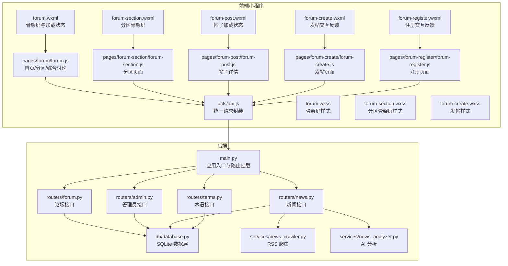

**图表来源**
- [backend/main.py:18-41](file://backend/main.py#L18-L41)
- [backend/routers/forum.py:33](file://backend/routers/forum.py#L33)
- [backend/routers/admin.py:25](file://backend/routers/admin.py#L25)
- [backend/routers/news.py:20](file://backend/routers/news.py#L20)
- [backend/routers/terms.py:6](file://backend/routers/terms.py#L6)
- [backend/db/database.py:10](file://backend/db/database.py#L10)
- [backend/services/news_crawler.py:15](file://backend/services/news_crawler.py#L15)
- [backend/services/news_analyzer.py:12](file://backend/services/news_analyzer.py#L12)
- [miniprogram/utils/api.js:123](file://miniprogram/utils/api.js#L123)
- [miniprogram/pages/forum/forum.js:4](file://miniprogram/pages/forum/forum.js#L4)
- [miniprogram/pages/forum/forum.wxml:1](file://miniprogram/pages/forum/forum.wxml#L1)
- [miniprogram/pages/forum/forum.wxss:92](file://miniprogram/pages/forum/forum.wxss#L92)
- [miniprogram/pages/forum-section/forum-section.js:1](file://miniprogram/pages/forum-section/forum-section.js#L1)
- [miniprogram/pages/forum-section/forum-section.wxml:6](file://miniprogram/pages/forum-section/forum-section.wxml#L6)
- [miniprogram/pages/forum-section/forum-section.wxss:36](file://miniprogram/pages/forum-section/forum-section.wxss#L36)
- [miniprogram/pages/forum-post/forum-post.js:1](file://miniprogram/pages/forum-post/forum-post.js#L1)
- [miniprogram/pages/forum-post/forum-post.wxml:6](file://miniprogram/pages/forum-post/forum-post.wxml#L6)
- [miniprogram/pages/forum-create/forum-create.js:1](file://miniprogram/pages/forum-create/forum-create.js#L1)
- [miniprogram/pages/forum-create/forum-create.wxml:56](file://miniprogram/pages/forum-create/forum-create.wxml#L56)
- [miniprogram/pages/forum-create/forum-create.wxss:58](file://miniprogram/pages/forum-create/forum-create.wxss#L58)
- [miniprogram/pages/forum-register/forum-register.js:1](file://miniprogram/pages/forum-register/forum-register.js#L1)
- [miniprogram/pages/forum-register/forum-register.wxml:28](file://miniprogram/pages/forum-register/forum-register.wxml#L28)

**章节来源**
- [backend/main.py:18-41](file://backend/main.py#L18-L41)

## 核心组件
- 应用入口与路由挂载：集中注册论坛、新闻、管理员、术语、驱动等路由，初始化数据库与定时任务。
- 论坛接口：用户注册/登录、分区查询、帖子列表/详情/创建/删除/点赞、评论列表/创建。
- 管理员接口：内容审核（帖子/评论/术语）、触发爬虫与 AI 分析、清空分析记录。
- 新闻接口：资讯列表/详情、按车队过滤、关联帖子、AI 分析触发。
- 术语接口：术语查询、按新闻匹配、用户提交术语。
- 数据库层：建表与默认分区、用户/分区/帖子/评论/点赞/术语/车手评分/车手评论等 CRUD。
- 服务层：RSS 爬虫、AI 分析（含 RAG 上下文注入）。
- 前端 API 封装：统一 GET/POST、缓存策略、管理员鉴权头。
- **新增** 骨架屏系统：实现页面加载时的视觉反馈，提升弱网络环境下的用户体验。
- **新增** 交互反馈机制：提供即时的操作状态提示和用户引导。

**章节来源**
- [backend/main.py:18-41](file://backend/main.py#L18-L41)
- [backend/routers/forum.py:33](file://backend/routers/forum.py#L33)
- [backend/routers/admin.py:25](file://backend/routers/admin.py#L25)
- [backend/routers/news.py:20](file://backend/routers/news.py#L20)
- [backend/routers/terms.py:6](file://backend/routers/terms.py#L6)
- [backend/db/database.py:26](file://backend/db/database.py#L26)
- [backend/services/news_crawler.py:15](file://backend/services/news_crawler.py#L15)
- [backend/services/news_analyzer.py:12](file://backend/services/news_analyzer.py#L12)
- [miniprogram/utils/api.js:123](file://miniprogram/utils/api.js#L123)

## 架构总览
系统采用"后端 API + SQLite + 前端小程序"的三层架构。后端通过 FastAPI 提供 REST 接口，数据库层负责持久化与索引，服务层负责外部数据采集与 AI 分析。前端通过统一 API 封装与后端交互，内置缓存与重试逻辑，并实现了完整的骨架屏和交互反馈体系。

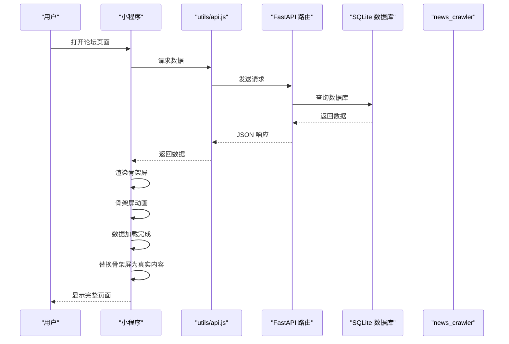

**图表来源**
- [miniprogram/utils/api.js:183](file://miniprogram/utils/api.js#L183)
- [backend/routers/news.py:128](file://backend/routers/news.py#L128)
- [backend/services/news_crawler.py:119](file://backend/services/news_crawler.py#L119)
- [backend/services/news_analyzer.py:169](file://backend/services/news_analyzer.py#L169)
- [backend/db/database.py:314](file://backend/db/database.py#L314)

## 详细组件分析

### 论坛页面骨架屏实现
**更新** 新增完整的骨架屏实现机制，提供流畅的加载体验

论坛页面实现了多层次的骨架屏系统，确保用户在弱网络环境下也能获得良好的视觉反馈：

- **首页骨架屏**：综合讨论、赛事分区、车队分区三个 Tab 页面均实现骨架屏
- **分区页面骨架屏**：支持热门帖子推荐区域和帖子列表的骨架屏
- **动画效果**：使用 CSS 动画实现闪烁效果，模拟真实内容加载过程
- **响应式布局**：不同屏幕尺寸下保持一致的骨架屏体验

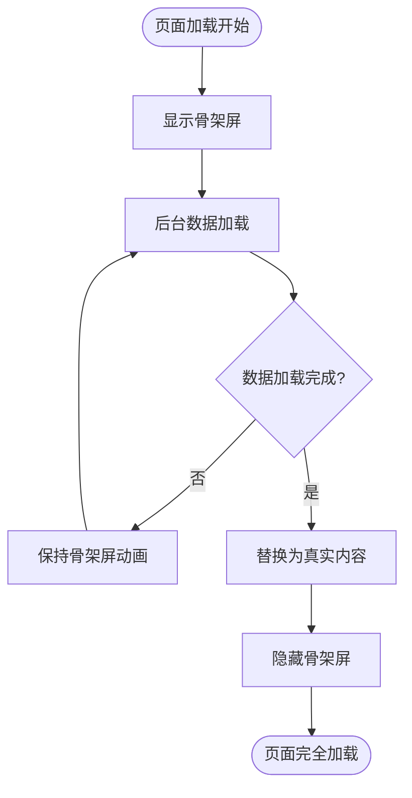

**图表来源**
- [miniprogram/pages/forum/forum.wxml:28](file://miniprogram/pages/forum/forum.wxml#L28)
- [miniprogram/pages/forum/forum.wxss:92](file://miniprogram/pages/forum/forum.wxss#L92)
- [miniprogram/pages/forum-section/forum-section.wxml:6](file://miniprogram/pages/forum-section/forum-section.wxml#L6)
- [miniprogram/pages/forum-section/forum-section.wxss:36](file://miniprogram/pages/forum-section/forum-section.wxss#L36)

**章节来源**
- [miniprogram/pages/forum/forum.wxml:28-34](file://miniprogram/pages/forum/forum.wxml#L28-L34)
- [miniprogram/pages/forum/forum.wxss:92-99](file://miniprogram/pages/forum/forum.wxss#L92-L99)
- [miniprogram/pages/forum-section/forum-section.wxml:6-13](file://miniprogram/pages/forum-section/forum-section.wxml#L6-L13)
- [miniprogram/pages/forum-section/forum-section.wxss:36-51](file://miniprogram/pages/forum-section/forum-section.wxss#L36-L51)

### 交互反馈机制增强
**更新** 完善用户操作的即时反馈和状态提示

系统实现了多层次的交互反馈机制，确保用户能够及时了解操作状态：

- **发帖反馈**：标题和内容长度实时监控，提交状态防重复点击
- **注册反馈**：昵称长度验证，登录状态处理，成功后的页面跳转
- **操作提示**：统一的 Toast 提示，包括成功、失败、警告等不同类型
- **状态指示**：loading 状态、错误状态、空状态的清晰区分

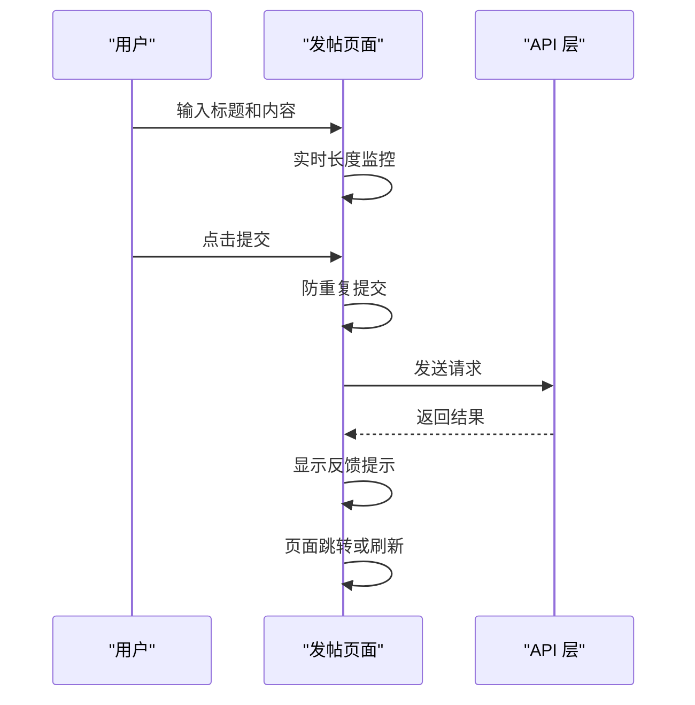

**图表来源**
- [miniprogram/pages/forum-create/forum-create.js:71](file://miniprogram/pages/forum-create/forum-create.js#L71)
- [miniprogram/pages/forum-create/forum-create.wxml:56](file://miniprogram/pages/forum-create/forum-create.wxml#L56)
- [miniprogram/pages/forum-register/forum-register.js:16](file://miniprogram/pages/forum-register/forum-register.js#L16)

**章节来源**
- [miniprogram/pages/forum-create/forum-create.js:71-87](file://miniprogram/pages/forum-create/forum-create.js#L71-L87)
- [miniprogram/pages/forum-create/forum-create.wxml:56-59](file://miniprogram/pages/forum-create/forum-create.wxml#L56-L59)
- [miniprogram/pages/forum-register/forum-register.js:16-52](file://miniprogram/pages/forum-register/forum-register.js#L16-L52)
- [miniprogram/pages/forum-register/forum-register.wxml:28-33](file://miniprogram/pages/forum-register/forum-register.wxml#L28-L33)

### 论坛帖子管理
- 帖子创建：校验用户、标题/内容长度，创建后状态直接批准（开发期），支持关联新闻。
- 帖子列表：支持按分区过滤、分页、按最新/热度排序；热度模式使用预计算分数。
- 帖子详情：浏览数自动 +1；仅批准或种子内容可见。
- 帖子删除：仅作者本人可删，级联删除评论与点赞。
- 点赞/点踩：同类型再点取消，切换类型替换；返回统计与我的投票。

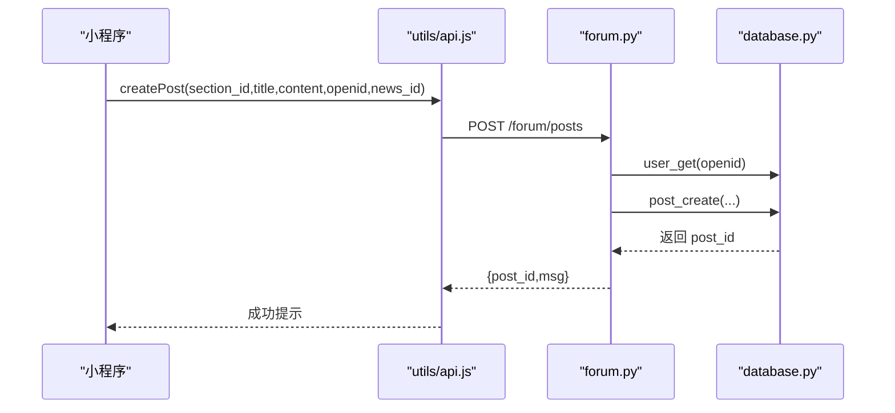

**图表来源**
- [miniprogram/utils/api.js:189](file://miniprogram/utils/api.js#L189)
- [backend/routers/forum.py:195](file://backend/routers/forum.py#L195)
- [backend/db/database.py:371](file://backend/db/database.py#L371)

**章节来源**
- [backend/routers/forum.py:153-247](file://backend/routers/forum.py#L153-L247)
- [backend/db/database.py:371-453](file://backend/db/database.py#L371-L453)

### 用户认证与权限控制
- 登录流程：前端传 wx.login 的 code，后端换取 openid（生产环境需配置 AppID/AppSecret），校验昵称格式后创建/更新用户。
- 权限控制：管理员接口通过请求头 X-Admin-Token 鉴权；帖子删除仅作者可操作；评论审核与术语审核仅管理员可用。

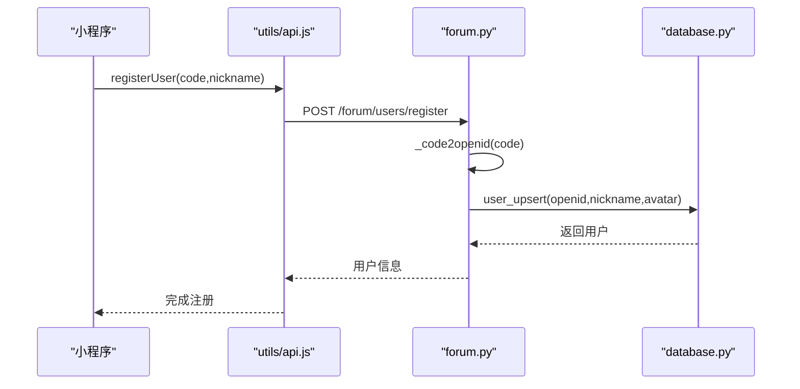

**图表来源**
- [miniprogram/utils/api.js:172](file://miniprogram/utils/api.js#L172)
- [backend/routers/forum.py:95](file://backend/routers/forum.py#L95)
- [backend/db/database.py:352](file://backend/db/database.py#L352)

**章节来源**
- [backend/routers/forum.py:57-118](file://backend/routers/forum.py#L57-L118)
- [backend/routers/admin.py:30-81](file://backend/routers/admin.py#L30-L81)

### 板块与分区管理
- 分区查询：按类型 race/team 分组返回，含排序字段；内存缓存 1 小时。
- 默认分区：内置 2026 赛季主要分站与车队分区，幂等插入。
- 分区归类：AI 分析时根据新闻内容关键词自动归类到对应分区（如 general、bahrain、redbull 等）。

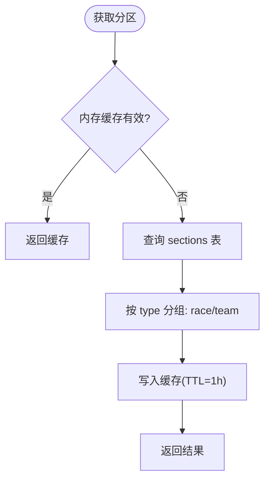

**图表来源**
- [backend/routers/forum.py:125-139](file://backend/routers/forum.py#L125-L139)
- [backend/db/database.py:50-56](file://backend/db/database.py#L50-L56)

**章节来源**
- [backend/routers/forum.py:125-139](file://backend/routers/forum.py#L125-L139)
- [backend/db/database.py:161-201](file://backend/db/database.py#L161-L201)

### 评论与回复功能
- 评论创建：校验帖子与用户存在，内容长度限制，状态直接批准（开发期），同步更新帖子评论计数。
- 评论列表：按时间正序返回已批准评论。
- 回复机制：当前数据库结构为一级评论，未见嵌套回复实现；如需扩展，建议新增 parent_id 字段与树形查询。

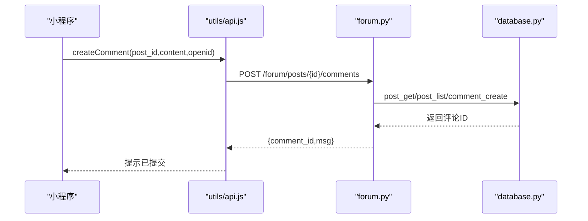

**图表来源**
- [miniprogram/utils/api.js:223](file://miniprogram/utils/api.js#L223)
- [backend/routers/forum.py:295-327](file://backend/routers/forum.py#L295-L327)
- [backend/db/database.py:464-490](file://backend/db/database.py#L464-L490)

**章节来源**
- [backend/routers/forum.py:285-327](file://backend/routers/forum.py#L285-L327)
- [backend/db/database.py:464-522](file://backend/db/database.py#L464-L522)

### 管理员后台功能
- 内容审核：待审帖子/评论列表，通过/拒绝操作，评论通过后同步更新帖子评论计数。
- 爬虫与分析：触发爬取、仅爬取、单条分析、清空分析记录；支持强制重新分析。
- 术语审核：用户提交术语进入待审，管理员批准/拒绝。

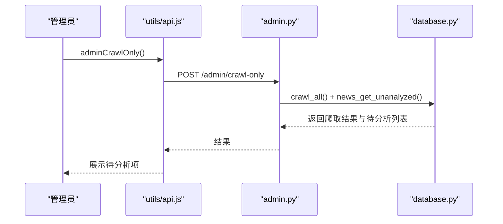

**图表来源**
- [miniprogram/utils/api.js:248](file://miniprogram/utils/api.js#L248)
- [backend/routers/admin.py:148-165](file://backend/routers/admin.py#L148-L165)

**章节来源**
- [backend/routers/admin.py:40-128](file://backend/routers/admin.py#L40-L128)
- [backend/routers/admin.py:134-208](file://backend/routers/admin.py#L134-L208)

### 与新闻系统的关联
- 新闻爬取：RSS 源聚合，去重入库，过滤非 F1 内容。
- AI 分析：按需注入积分榜上下文，生成三段式解读；分析完成后自动同步为论坛种子帖子。
- 论坛关联：帖子可关联新闻；新闻详情页可查看关联帖子列表。
- 术语匹配：根据新闻原始内容匹配术语标签，避免 AI 文本干扰。

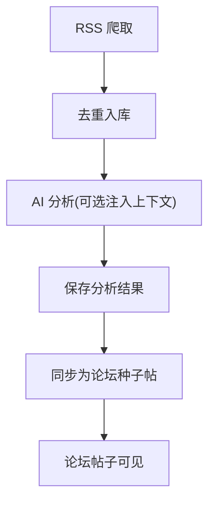

**图表来源**
- [backend/services/news_crawler.py:119](file://backend/services/news_crawler.py#L119)
- [backend/services/news_analyzer.py:169](file://backend/services/news_analyzer.py#L169)
- [backend/db/database.py:314](file://backend/db/database.py#L314)

**章节来源**
- [backend/routers/news.py:68-125](file://backend/routers/news.py#L68-L125)
- [backend/services/news_crawler.py:119-148](file://backend/services/news_crawler.py#L119-L148)
- [backend/services/news_analyzer.py:169-200](file://backend/services/news_analyzer.py#L169-L200)

### 数据模型与关系设计
- 用户：以微信 openid 为主键，昵称、头像、创建时间。
- 分区：type=race/team，name/slug/sort_order，用于组织帖子。
- 帖子：关联分区与作者，状态（pending/approved/rejected），视图/评论计数，可关联新闻。
- 评论：关联帖子与作者，状态（pending/approved/rejected）。
- 点赞：post_id+openid 唯一，type=like/dislike。
- 术语：slug 唯一，支持分类/级别/相关术语/适用年份，状态（approved/pending/rejected）。
- 车手评分/评论：车手维度的评分与评论，支持点赞。

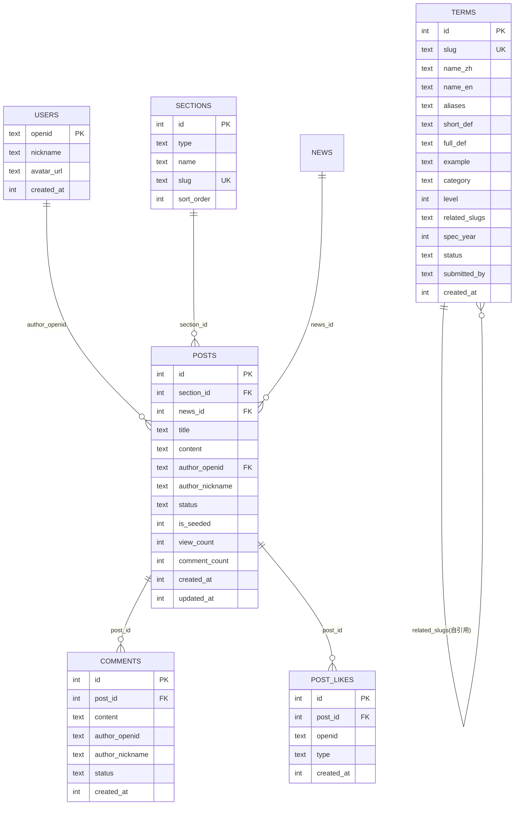

**图表来源**
- [backend/db/database.py:26-159](file://backend/db/database.py#L26-L159)

**章节来源**
- [backend/db/database.py:26-159](file://backend/db/database.py#L26-L159)

## 依赖分析
- 路由依赖：main.py 统一 include 各模块路由，避免循环导入。
- 数据层依赖：各路由通过 db/database.py 的函数进行 CRUD，保证一致性。
- 服务层依赖：news.py 依赖 news_crawler 与 news_analyzer，admin.py 依赖 db 与服务模块。
- 前端依赖：api.js 封装请求与缓存，统一管理管理员鉴权头。
- **新增** 骨架屏依赖：各页面组件依赖统一的骨架屏样式和动画效果。
- **新增** 交互反馈依赖：页面组件依赖全局的状态管理和提示系统。

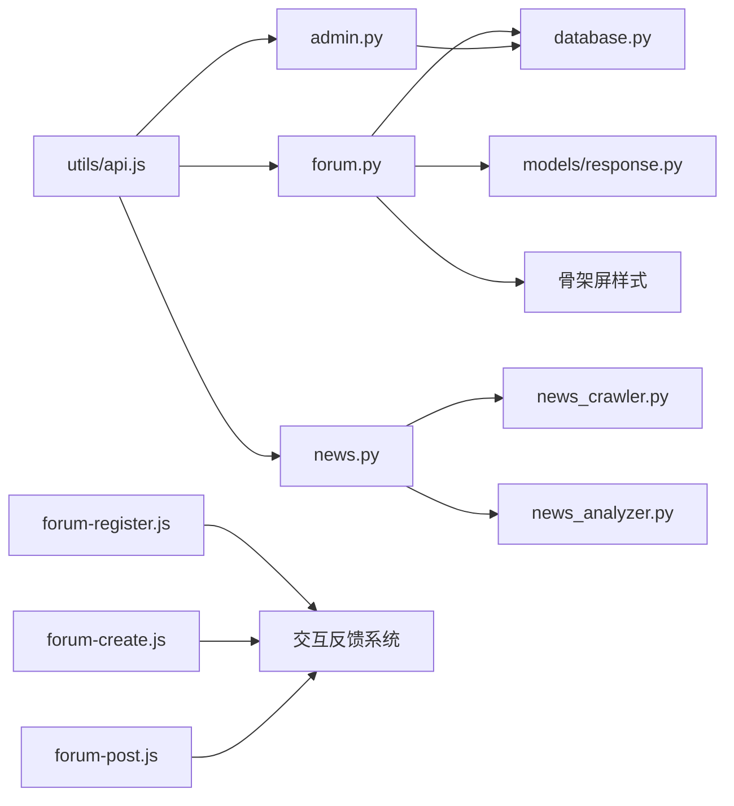

**图表来源**
- [backend/routers/forum.py:24-31](file://backend/routers/forum.py#L24-L31)
- [backend/routers/admin.py:19-23](file://backend/routers/admin.py#L19-L23)
- [backend/routers/news.py:14](file://backend/routers/news.py#L14)
- [backend/models/response.py:1-14](file://backend/models/response.py#L1-L14)
- [miniprogram/utils/api.js:123-299](file://miniprogram/utils/api.js#L123-L299)

**章节来源**
- [backend/routers/forum.py:24-31](file://backend/routers/forum.py#L24-L31)
- [backend/routers/admin.py:19-23](file://backend/routers/admin.py#L19-L23)
- [backend/routers/news.py:14](file://backend/routers/news.py#L14)
- [backend/models/response.py:1-14](file://backend/models/response.py#L1-L14)
- [miniprogram/utils/api.js:123-299](file://miniprogram/utils/api.js#L123-L299)

## 性能考量
- 数据库并发：启用 WAL 模式与外键约束，提升并发写入安全性。
- 索引优化：帖子/评论/点赞/术语等常用查询建立索引，减少排序与过滤成本。
- 缓存策略：分区列表内存缓存（1h）、新闻术语匹配缓存（10min）、前端接口缓存（5-60min）。
- 热度计算：帖子热度基于评论数、浏览数与时效衰减，避免全表扫描。
- 爬虫与分析：RSS 爬取与 AI 分析异步执行，避免阻塞请求。
- **新增** 骨架屏性能：使用 CSS 动画而非 JavaScript 动画，减少 CPU 占用。
- **新增** 交互反馈性能：Toast 提示使用原生组件，避免额外的渲染开销。

**章节来源**
- [backend/db/database.py:14-19](file://backend/db/database.py#L14-L19)
- [backend/db/database.py:94-131](file://backend/db/database.py#L94-L131)
- [backend/routers/forum.py:35-46](file://backend/routers/forum.py#L35-L46)
- [backend/routers/news.py:24-35](file://backend/routers/news.py#L24-L35)
- [miniprogram/utils/api.js:3-15](file://miniprogram/utils/api.js#L3-L15)
- [backend/db/database.py:536-551](file://backend/db/database.py#L536-L551)

## 故障排查指南
- 用户注册失败：检查微信 AppID/AppSecret 是否配置；确认昵称格式校验（2-12 字，不含特殊字符）。
- 帖子/评论未显示：确认状态为 approved 或 is_seeded；检查审核流程与权限。
- 管理员接口 403：核对 X-Admin-Token 是否正确；确认环境变量 ADMIN_TOKEN 设置。
- 爬虫失败：查看 RSS 源可用性与解析异常日志；关注非 F1 关键词过滤。
- AI 分析异常：检查 LLM 客户端可用性与上下文注入；必要时清理旧分析记录后重试。
- **新增** 骨架屏问题：检查 CSS 动画是否正常加载；确认 wxml 中的条件渲染逻辑。
- **新增** 交互反馈问题：检查 Toast 组件是否正确引入；确认事件绑定是否生效。

**章节来源**
- [backend/routers/forum.py:57-118](file://backend/routers/forum.py#L57-L118)
- [backend/routers/admin.py:30-34](file://backend/routers/admin.py#L30-L34)
- [backend/services/news_crawler.py:90-116](file://backend/services/news_crawler.py#L90-L116)
- [backend/services/news_analyzer.py:169-200](file://backend/services/news_analyzer.py#L169-L200)

## 结论
本论坛系统以 SQLite 为基础，结合 FastAPI 路由与服务层，构建了从内容采集、AI 解读到社区互动的闭环。本次更新重点加强了用户体验，通过完整的骨架屏实现和交互反馈机制，使系统在弱网络环境下也能提供流畅的操作体验。系统具备良好的扩展性与可维护性，适合在 F1 赛季期间承载活跃的社区讨论与知识沉淀。后续可在评论嵌套、权限分级、举报与风控等方面进一步完善。

## 附录
- 前端页面与接口映射：小程序通过 utils/api.js 统一调用后端接口，实现用户、分区、帖子、评论、管理员等功能。
- 热门推荐：支持热门帖子与热门新闻的聚合展示，提升用户参与度。
- **新增** 骨架屏规范：所有页面组件遵循统一的骨架屏设计规范，确保视觉一致性。
- **新增** 交互反馈标准：统一的 Toast 提示风格和操作反馈机制，提升用户操作体验。

**章节来源**
- [miniprogram/pages/forum/forum.js:1-125](file://miniprogram/pages/forum/forum.js#L1-L125)
- [miniprogram/pages/forum-post/forum-post.js:1-160](file://miniprogram/pages/forum-post/forum-post.js#L1-L160)
- [miniprogram/utils/api.js:165-169](file://miniprogram/utils/api.js#L165-L169)