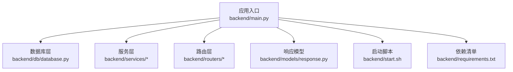
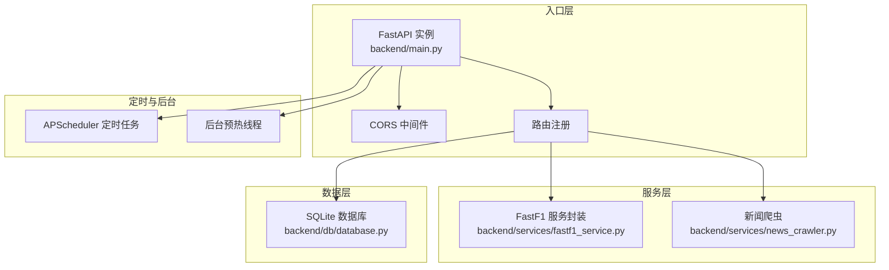
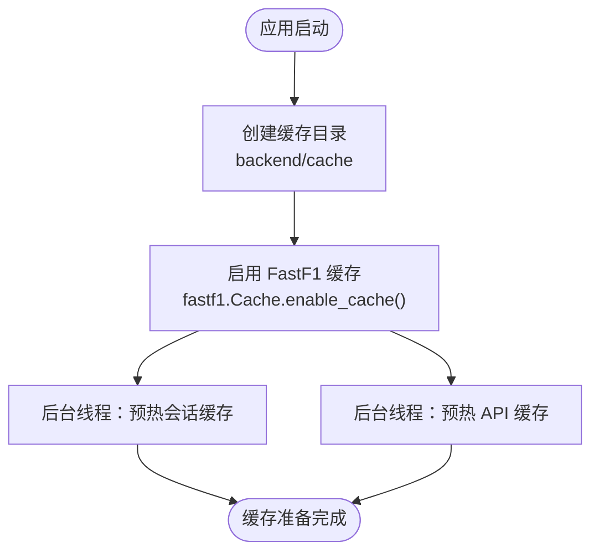
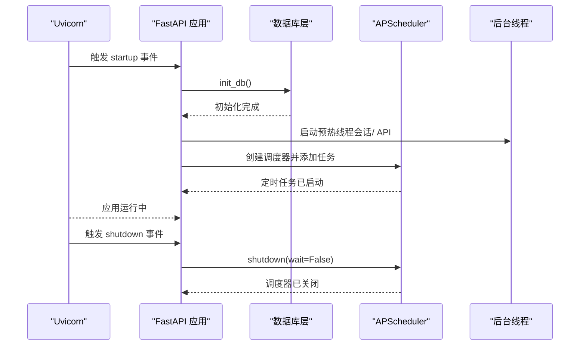
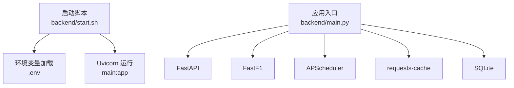

# FastAPI 应用初始化

<cite>
**本文档引用的文件**
- [backend/main.py](file://backend/main.py)
- [backend/db/database.py](file://backend/db/database.py)
- [backend/start.sh](file://backend/start.sh)
- [backend/requirements.txt](file://backend/requirements.txt)
- [backend/services/fastf1_service.py](file://backend/services/fastf1_service.py)
- [backend/services/news_crawler.py](file://backend/services/news_crawler.py)
- [backend/routers/events.py](file://backend/routers/events.py)
- [backend/routers/standings.py](file://backend/routers/standings.py)
- [backend/models/response.py](file://backend/models/response.py)
</cite>

## 目录
1. [简介](#简介)
2. [项目结构](#项目结构)
3. [核心组件](#核心组件)
4. [架构总览](#架构总览)
5. [详细组件分析](#详细组件分析)
6. [依赖分析](#依赖分析)
7. [性能考虑](#性能考虑)
8. [故障排除指南](#故障排除指南)
9. [结论](#结论)
10. [附录](#附录)

## 简介
本文件面向 FastAPI 应用初始化流程，系统性阐述以下主题：
- 应用实例创建与基础配置（标题、版本号、文档元信息）
- CORS 中间件配置（允许来源、方法与头部）
- 缓存系统初始化（本地缓存目录与 FastF1 缓存集成）
- 启动与关闭事件处理（数据库初始化、定时任务调度、后台线程管理）
- 完整配置示例与最佳实践建议

## 项目结构
后端采用模块化组织，核心入口位于 backend/main.py，数据库层在 backend/db/database.py，服务层在 backend/services，路由层在 backend/routers，响应模型在 backend/models/response.py。启动脚本 backend/start.sh 提供 uvicorn 启动与环境变量加载。

图表来源
- [backend/main.py:1-157](file://backend/main.py#L1-L157)
- [backend/db/database.py:1-800](file://backend/db/database.py#L1-L800)
- [backend/start.sh:1-25](file://backend/start.sh#L1-L25)
- [backend/requirements.txt:1-15](file://backend/requirements.txt#L1-L15)

章节来源
- [backend/main.py:1-157](file://backend/main.py#L1-L157)
- [backend/start.sh:1-25](file://backend/start.sh#L1-L25)
- [backend/requirements.txt:1-15](file://backend/requirements.txt#L1-L15)

## 核心组件
- 应用实例与基础配置
  - 应用标题与版本：通过 FastAPI 构造函数设置标题与版本号。
  - 文档路径：默认启用 openapi.json 与 /docs。
- CORS 中间件
  - 允许来源：通配符（开发环境常用，生产需收紧）。
  - 允许方法：通配符。
  - 允许头部：通配符。
- 缓存系统
  - 本地缓存目录：在 backend/cache 下创建并启用 FastF1 缓存。
  - 进程内内存缓存：服务层对 FastF1 会话进行 LRU 缓存。
- 启动与关闭事件
  - startup：初始化数据库、后台预热、定时任务调度。
  - shutdown：优雅关闭定时任务调度器。

章节来源
- [backend/main.py:14-25](file://backend/main.py#L14-L25)
- [backend/main.py:117-145](file://backend/main.py#L117-L145)
- [backend/services/fastf1_service.py:11-21](file://backend/services/fastf1_service.py#L11-L21)

## 架构总览
应用初始化涉及多个层次的协作：入口层负责中间件与路由注册，服务层负责数据获取与缓存，数据库层负责持久化，定时任务与后台线程负责异步维护。

图表来源
- [backend/main.py:18-41](file://backend/main.py#L18-L41)
- [backend/main.py:117-145](file://backend/main.py#L117-L145)
- [backend/services/fastf1_service.py:14-21](file://backend/services/fastf1_service.py#L14-L21)
- [backend/services/news_crawler.py:119-129](file://backend/services/news_crawler.py#L119-L129)
- [backend/db/database.py:204-214](file://backend/db/database.py#L204-L214)

## 详细组件分析

### 应用实例创建与基础配置
- 标题与版本：通过 FastAPI 构造函数设置应用标题与版本号，便于文档展示与客户端识别。
- 文档配置：默认启用 openapi.json 与 /docs，便于调试与联调。
- 路由注册：集中注册 events、qualifying、laptimes、telemetry、analysis、standings、news、forum、admin、terms、driver、hot 等路由，统一前缀与标签。

章节来源
- [backend/main.py:18](file://backend/main.py#L18)
- [backend/main.py:27-41](file://backend/main.py#L27-L41)

### CORS 中间件配置
- 允许来源：["*"]（开发环境常用，生产需明确来源域名）。
- 允许方法：["*"]（GET、POST、PUT、DELETE 等）。
- 允许头部：["*"]（包含自定义头部）。
- 注意事项：在生产环境中应限定来源、方法与头部，避免安全风险。

章节来源
- [backend/main.py:20-25](file://backend/main.py#L20-L25)

### 缓存系统初始化
- 本地缓存目录
  - 在 backend/cache 下创建缓存目录，确保 FastAPI 启动时可用。
  - 启动脚本 start.sh 会创建 cache 与 cache/analysis 目录。
- FastF1 缓存集成
  - 启动时启用 fastf1.Cache.enable_cache(CACHE_DIR)，将 FastF1 数据缓存到本地目录。
  - 服务层提供进程内内存缓存（LRU），避免重复加载相同会话数据。
- 后台预热
  - 启动后通过后台线程预热已有缓存的会话数据，减少首次请求延迟。
  - 同时预热 events 与 standings API 的内存缓存。

图表来源
- [backend/main.py:14-16](file://backend/main.py#L14-L16)
- [backend/main.py:55-96](file://backend/main.py#L55-L96)
- [backend/main.py:99-114](file://backend/main.py#L99-L114)
- [backend/start.sh:12-14](file://backend/start.sh#L12-L14)
- [backend/services/fastf1_service.py:11-21](file://backend/services/fastf1_service.py#L11-L21)

章节来源
- [backend/main.py:14-16](file://backend/main.py#L14-L16)
- [backend/main.py:55-96](file://backend/main.py#L55-L96)
- [backend/main.py:99-114](file://backend/main.py#L99-L114)
- [backend/start.sh:12-14](file://backend/start.sh#L12-L14)
- [backend/services/fastf1_service.py:11-21](file://backend/services/fastf1_service.py#L11-L21)

### 启动与关闭事件处理
- startup 事件
  - 初始化数据库：创建表与默认分区，幂等可重复调用。
  - 启动后台线程：预热 FastF1 会话与 API 缓存。
  - 启动定时任务：每小时执行新闻爬取，每两小时刷新 standings 缓存。
- shutdown 事件
  - 优雅关闭 APScheduler，确保定时任务资源释放。

图表来源
- [backend/main.py:117-145](file://backend/main.py#L117-L145)
- [backend/db/database.py:204-214](file://backend/db/database.py#L204-L214)

章节来源
- [backend/main.py:117-145](file://backend/main.py#L117-L145)
- [backend/db/database.py:204-214](file://backend/db/database.py#L204-L214)

### 定时任务与后台线程
- 自动爬虫任务
  - 每小时执行一次新闻爬取，统计新增数量并打印日志。
- API 缓存预热
  - 启动后短暂延时，随后拉取 events 与 standings，填充内存缓存。
- 线程池与并发
  - standings 路由使用线程池并行拉取多个 Ergast 接口，提升响应速度。

章节来源
- [backend/main.py:44-53](file://backend/main.py#L44-L53)
- [backend/main.py:99-114](file://backend/main.py#L99-L114)
- [backend/routers/standings.py:51-61](file://backend/routers/standings.py#L51-L61)

### 数据库初始化与表结构
- 数据库路径：在 db 层内部确定 SQLite 文件路径。
- 建表与索引：DDL 脚本包含资讯、AI 分析、论坛分区、用户、帖子、评论、点赞、术语、车手评分与评论等表。
- 默认分区：初始化时插入默认分区数据，支持幂等插入。
- 术语种子：初始化后调用术语种子函数，确保术语表具备基础数据。

章节来源
- [backend/db/database.py:10](file://backend/db/database.py#L10)
- [backend/db/database.py:26-159](file://backend/db/database.py#L26-L159)
- [backend/db/database.py:204-214](file://backend/db/database.py#L204-L214)

### FastF1 服务封装
- 进程内内存缓存：以 (year, round_or_name, session_type) 为键，避免重复加载相同会话。
- 时间格式化与遥测转换：提供通用的时间格式化与遥测数据序列化工具。

章节来源
- [backend/services/fastf1_service.py:11-21](file://backend/services/fastf1_service.py#L11-L21)
- [backend/services/fastf1_service.py:24-34](file://backend/services/fastf1_service.py#L24-L34)
- [backend/services/fastf1_service.py:55-63](file://backend/services/fastf1_service.py#L55-L63)

### 新闻爬虫与分析
- RSS 源配置：包含多个权威 F1 新闻源，自动去除非 F1 内容。
- 爬取流程：解析 RSS 条目、清洗摘要、提取发布时间，入库去重。
- 分析触发：定时任务可联动 AI 分析模块（延迟导入避免循环依赖）。

章节来源
- [backend/services/news_crawler.py:15-36](file://backend/services/news_crawler.py#L15-L36)
- [backend/services/news_crawler.py:90-116](file://backend/services/news_crawler.py#L90-L116)
- [backend/services/news_crawler.py:119-129](file://backend/services/news_crawler.py#L119-L129)

## 依赖分析
- 启动脚本依赖
  - start.sh 依赖 python-dotenv 加载 .env，依赖 uvicorn 运行应用。
- 应用依赖
  - FastAPI、uvicorn、fastf1、pandas、numpy、openai、requests、requests-cache、apscheduler、scipy、feedparser、trafilatura 等。

图表来源
- [backend/start.sh:16-24](file://backend/start.sh#L16-L24)
- [backend/requirements.txt:1-15](file://backend/requirements.txt#L1-L15)
- [backend/main.py:1-12](file://backend/main.py#L1-L12)

章节来源
- [backend/start.sh:16-24](file://backend/start.sh#L16-L24)
- [backend/requirements.txt:1-15](file://backend/requirements.txt#L1-L15)
- [backend/main.py:1-12](file://backend/main.py#L1-L12)

## 性能考虑
- 缓存策略
  - 本地磁盘缓存：减少外部 API 与文件 IO 延迟。
  - 进程内内存缓存：避免重复加载相同会话数据，显著降低响应时间。
  - API 内存缓存：events 与 standings 设置 TTL，平衡新鲜度与性能。
- 并发优化
  - standings 路由使用线程池并行拉取多个接口，缩短整体等待时间。
- 启动优化
  - 后台线程预热会话与 API 缓存，降低首次请求冷启动成本。
- 定时任务
  - 合理设置任务间隔，避免频繁爬取造成外部服务压力与自身资源消耗。

## 故障排除指南
- CORS 相关问题
  - 现象：跨域请求被拒绝。
  - 排查：检查 CORS 配置中的 allow_origins、allow_methods、allow_headers 是否符合前端需求。
- 缓存相关问题
  - 现象：FastF1 数据未命中缓存或缓存失效。
  - 排查：确认 CACHE_DIR 路径存在且可写，FastF1 缓存已启用；检查服务层内存缓存键是否正确。
- 定时任务异常
  - 现象：定时爬取未执行或报错。
  - 排查：查看调度器启动日志与异常捕获；确认 APScheduler 版本与时区配置。
- 启动失败
  - 现象：应用无法启动或数据库初始化失败。
  - 排查：检查 .env 中的环境变量，确认 SQLite 文件权限与路径；查看数据库 DDL 执行日志。

章节来源
- [backend/main.py:20-25](file://backend/main.py#L20-L25)
- [backend/main.py:117-145](file://backend/main.py#L117-L145)
- [backend/services/fastf1_service.py:11-21](file://backend/services/fastf1_service.py#L11-L21)
- [backend/db/database.py:204-214](file://backend/db/database.py#L204-L214)

## 结论
本文档系统梳理了 FastAPI 应用初始化的关键环节：应用实例创建、CORS 配置、缓存系统（本地与 FastF1）、启动与关闭事件处理、定时任务与后台线程，以及数据库初始化与表结构。通过合理的缓存策略、并发优化与定时任务调度，应用能够在保证性能的同时，提供稳定可靠的 API 服务。建议在生产环境中收紧 CORS 配置、合理设置缓存 TTL 与任务间隔，并完善监控与日志记录。

## 附录
- 配置示例（基于现有实现）
  - CORS 配置：允许来源、方法与头部均为通配符，适用于开发环境；生产需明确来源域名。
  - 缓存目录：backend/cache，FastF1 缓存启用；启动脚本会创建 cache 与 cache/analysis 目录。
  - 定时任务：每小时爬取新闻，每两小时刷新 standings 缓存。
  - 启动命令：通过 start.sh 启动，监听 0.0.0.0:8000。
- 最佳实践建议
  - 生产环境收紧 CORS，仅允许必要来源与方法。
  - 将缓存目录挂载到持久化存储，避免容器重启丢失数据。
  - 对外部 API 请求设置超时与重试策略，增强健壮性。
  - 使用环境变量管理敏感配置，避免硬编码。
  - 对定时任务与后台线程增加健康检查与告警机制。