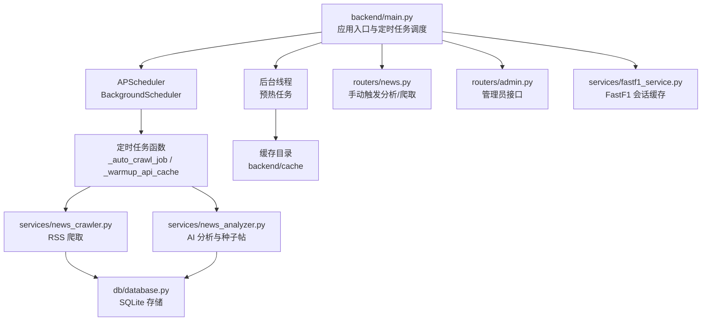
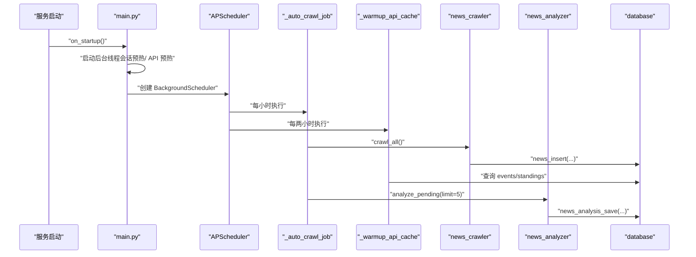
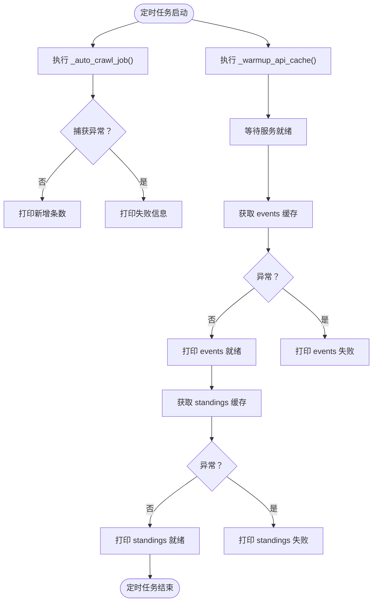
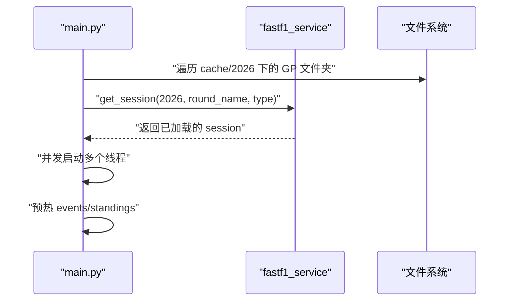
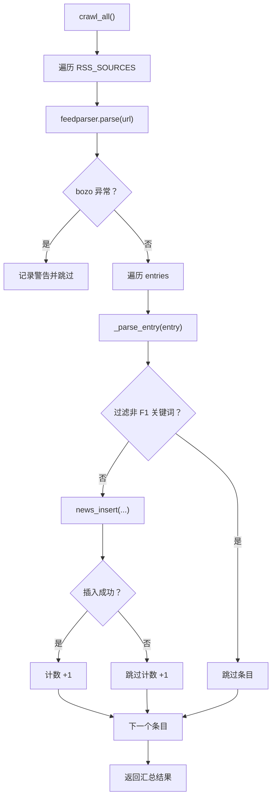
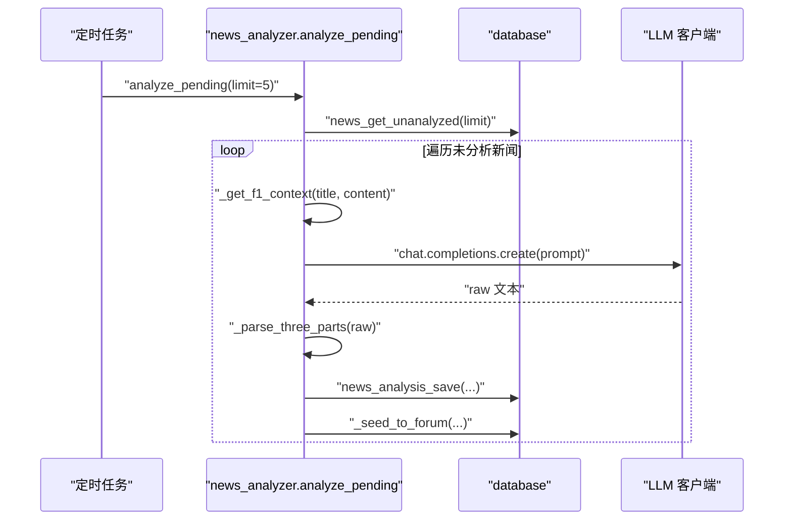
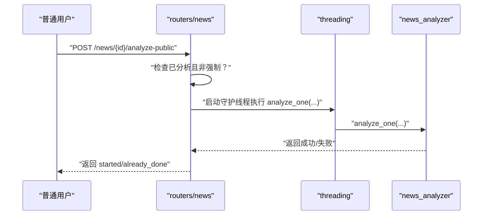
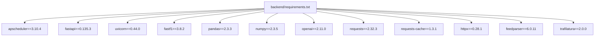

# 后台任务

<cite>
**本文引用的文件**
- [backend/main.py](file://backend/main.py)
- [backend/services/news_crawler.py](file://backend/services/news_crawler.py)
- [backend/services/news_analyzer.py](file://backend/services/news_analyzer.py)
- [backend/services/fastf1_service.py](file://backend/services/fastf1_service.py)
- [backend/db/database.py](file://backend/db/database.py)
- [backend/routers/news.py](file://backend/routers/news.py)
- [backend/routers/admin.py](file://backend/routers/admin.py)
- [backend/requirements.txt](file://backend/requirements.txt)
- [backend/start.sh](file://backend/start.sh)
</cite>

## 目录
1. [简介](#简介)
2. [项目结构](#项目结构)
3. [核心组件](#核心组件)
4. [架构总览](#架构总览)
5. [详细组件分析](#详细组件分析)
6. [依赖关系分析](#依赖关系分析)
7. [性能考量](#性能考量)
8. [故障排查指南](#故障排查指南)
9. [结论](#结论)
10. [附录](#附录)

## 简介
本文件系统性梳理并文档化后台任务系统，覆盖定时任务（新闻爬取）、缓存预热、数据刷新与后台线程管理。重点说明 APScheduler 的配置与使用、任务调度策略、错误处理机制、线程安全与资源清理、任务状态监控与日志记录，并提供任务扩展与自定义的开发指南。

## 项目结构
后台任务相关代码集中在 backend 目录，包含应用入口、服务模块、数据库层、路由器以及启动脚本。定时任务与后台线程均在应用启动阶段初始化，分别通过 APScheduler 与 Python 原生线程实现。

图表来源
- [backend/main.py:117-145](file://backend/main.py#L117-L145)
- [backend/services/news_crawler.py:119-129](file://backend/services/news_crawler.py#L119-L129)
- [backend/services/news_analyzer.py:287-297](file://backend/services/news_analyzer.py#L287-L297)
- [backend/db/database.py:204-214](file://backend/db/database.py#L204-L214)
- [backend/services/fastf1_service.py:14-21](file://backend/services/fastf1_service.py#L14-L21)

章节来源
- [backend/main.py:117-145](file://backend/main.py#L117-L145)
- [backend/requirements.txt:1-15](file://backend/requirements.txt#L1-15)
- [backend/start.sh:1-25](file://backend/start.sh#L1-L25)

## 核心组件
- 定时任务调度器：基于 APScheduler 的 BackgroundScheduler，负责周期性执行新闻爬取与 API 缓存刷新。
- 后台线程：服务启动时异步执行缓存预热，加载已有会话数据与常用 API 结果至内存。
- 新闻爬取服务：解析多个 RSS 源，去重入库，支持失败与过滤逻辑。
- AI 分析服务：抽取上下文、构造提示词、调用 LLM、解析三段式解读并生成论坛种子帖。
- 数据持久化：SQLite 表结构覆盖资讯、分析、分区、帖子、评论、术语等，提供插入、查询与索引。
- FastF1 会话缓存：进程级内存缓存，避免重复加载相同会话，提升遥测与分析性能。
- 手动触发接口：管理员与普通用户可手动触发爬取与分析，支持强制重算与异步执行。

章节来源
- [backend/main.py:44-115](file://backend/main.py#L44-L115)
- [backend/services/news_crawler.py:119-147](file://backend/services/news_crawler.py#L119-L147)
- [backend/services/news_analyzer.py:287-297](file://backend/services/news_analyzer.py#L287-L297)
- [backend/db/database.py:26-159](file://backend/db/database.py#L26-L159)
- [backend/services/fastf1_service.py:14-64](file://backend/services/fastf1_service.py#L14-L64)
- [backend/routers/news.py:127-189](file://backend/routers/news.py#L127-L189)
- [backend/routers/admin.py:134-207](file://backend/routers/admin.py#L134-L207)

## 架构总览
后台任务系统围绕“定时调度 + 后台线程 + 数据持久化”的闭环展开。定时任务负责周期性抓取与刷新，后台线程负责冷启动时的缓存预热，手动接口提供即时控制能力。所有任务均通过日志输出状态，便于监控与排障。

图表来源
- [backend/main.py:117-136](file://backend/main.py#L117-L136)
- [backend/main.py:44-53](file://backend/main.py#L44-L53)
- [backend/main.py:99-115](file://backend/main.py#L99-L115)
- [backend/services/news_crawler.py:119-129](file://backend/services/news_crawler.py#L119-L129)
- [backend/services/news_analyzer.py:287-297](file://backend/services/news_analyzer.py#L287-L297)
- [backend/db/database.py:221-324](file://backend/db/database.py#L221-L324)

## 详细组件分析

### 定时任务：新闻爬取与缓存刷新
- 任务一：每小时执行一次的自动爬取，调用爬虫服务并打印新增条数。
- 任务二：每两小时执行一次的 API 缓存刷新，预热 events 与 standings。
- 调度器：BackgroundScheduler，时区设置为 Asia/Shanghai，启动后挂载到 app.state.scheduler，优雅关闭时通过 wait=False 立即停止。

图表来源
- [backend/main.py:44-53](file://backend/main.py#L44-L53)
- [backend/main.py:99-115](file://backend/main.py#L99-L115)
- [backend/main.py:127-136](file://backend/main.py#L127-L136)

章节来源
- [backend/main.py:44-53](file://backend/main.py#L44-L53)
- [backend/main.py:99-115](file://backend/main.py#L99-L115)
- [backend/main.py:127-136](file://backend/main.py#L127-L136)

### 缓存预热：会话与 API
- 会话预热：扫描本地缓存目录中的 2026 赛季会话，按 Qualifying/Race/Sprint 类型并发加载，使用守护线程避免阻塞。
- API 预热：服务启动后短暂休眠，随后拉取 events 与 standings，填充内存缓存，提升首次请求响应速度。

图表来源
- [backend/main.py:55-97](file://backend/main.py#L55-L97)
- [backend/services/fastf1_service.py:14-21](file://backend/services/fastf1_service.py#L14-L21)

章节来源
- [backend/main.py:55-97](file://backend/main.py#L55-L97)
- [backend/services/fastf1_service.py:14-21](file://backend/services/fastf1_service.py#L14-L21)

### 新闻爬取：RSS 解析与入库
- 多源 RSS：支持 The Race、Motorsport.com、Crash.net、F1i.com。
- 内容清洗：去除 HTML 标签、清理截断词，摘要长度限制，发布时间转换为 Unix 时间戳。
- 去重策略：以 URL 唯一性约束，避免重复入库。
- 失败处理：单源异常不影响其他源，bozo 异常记录警告。

图表来源
- [backend/services/news_crawler.py:119-129](file://backend/services/news_crawler.py#L119-L129)
- [backend/services/news_crawler.py:90-116](file://backend/services/news_crawler.py#L90-L116)
- [backend/services/news_crawler.py:39-87](file://backend/services/news_crawler.py#L39-L87)
- [backend/db/database.py:221-231](file://backend/db/database.py#L221-L231)

章节来源
- [backend/services/news_crawler.py:119-129](file://backend/services/news_crawler.py#L119-L129)
- [backend/services/news_crawler.py:90-116](file://backend/services/news_crawler.py#L90-L116)
- [backend/services/news_crawler.py:39-87](file://backend/services/news_crawler.py#L39-L87)
- [backend/db/database.py:221-231](file://backend/db/database.py#L221-L231)

### AI 分析：上下文抽取与三段式解读
- 上下文注入：仅当新闻涉及积分/排名/冠军争夺时，注入 2026 赛季车手/车队积分榜，30 分钟 TTL 缓存。
- 提示词模板：严格限定时间范围与禁止项，确保分析聚焦 2026 赛季。
- 输出解析：按 “技术要点/通俗解释/赛况影响” 三段式解析，失败时记录错误日志。
- 种子帖生成：将分析结果写入论坛分区，按标题关键字自动分类。

图表来源
- [backend/services/news_analyzer.py:287-297](file://backend/services/news_analyzer.py#L287-L297)
- [backend/services/news_analyzer.py:39-79](file://backend/services/news_analyzer.py#L39-L79)
- [backend/services/news_analyzer.py:220-256](file://backend/services/news_analyzer.py#L220-L256)
- [backend/services/news_analyzer.py:259-284](file://backend/services/news_analyzer.py#L259-L284)
- [backend/db/database.py:302-311](file://backend/db/database.py#L302-L311)
- [backend/db/database.py:314-324](file://backend/db/database.py#L314-L324)

章节来源
- [backend/services/news_analyzer.py:287-297](file://backend/services/news_analyzer.py#L287-L297)
- [backend/services/news_analyzer.py:39-79](file://backend/services/news_analyzer.py#L39-L79)
- [backend/services/news_analyzer.py:220-256](file://backend/services/news_analyzer.py#L220-L256)
- [backend/services/news_analyzer.py:259-284](file://backend/services/news_analyzer.py#L259-L284)
- [backend/db/database.py:302-311](file://backend/db/database.py#L302-L311)
- [backend/db/database.py:314-324](file://backend/db/database.py#L314-L324)

### 手动触发与管理员接口
- 普通用户：可对单条新闻触发 AI 分析（支持强制重算），异步执行，立即返回状态。
- 管理员：提供爬取、单条分析、批量分析、清空分析等接口，支持强制删除旧分析并重新生成。

图表来源
- [backend/routers/news.py:127-156](file://backend/routers/news.py#L127-L156)
- [backend/services/news_analyzer.py:220-256](file://backend/services/news_analyzer.py#L220-L256)

章节来源
- [backend/routers/news.py:127-156](file://backend/routers/news.py#L127-L156)
- [backend/routers/admin.py:134-207](file://backend/routers/admin.py#L134-L207)

## 依赖关系分析
- APScheduler：版本 3.10.4，用于定时任务调度。
- FastAPI/uvicorn：应用框架与 ASGI 服务器。
- fastf1/pandas/numpy/scipy：遥测与数据分析基础库。
- feedparser/trafilatura：RSS 解析与网页正文抓取。
- openai/requests/httpx/requests-cache：LLM 客户端与网络请求缓存。
- python-dotenv：环境变量加载。

图表来源
- [backend/requirements.txt:1-15](file://backend/requirements.txt#L1-L15)

章节来源
- [backend/requirements.txt:1-15](file://backend/requirements.txt#L1-L15)

## 性能考量
- 进程级会话缓存：FastF1 会话加载成本高，通过内存缓存避免重复加载，显著降低延迟。
- 线程并发：会话预热与 API 预热采用守护线程并发执行，缩短启动时间。
- 数据库 WAL 模式：启用 WAL 提升并发写入稳定性；合理索引（按时间、状态、分区）优化查询。
- RSS 抓取降级：trafilatura 抓取失败时降级使用 RSS 摘要，保证分析可用性。
- TTL 上下文：RAG 积分榜缓存 30 分钟，平衡准确性与成本。

章节来源
- [backend/services/fastf1_service.py:14-21](file://backend/services/fastf1_service.py#L14-L21)
- [backend/main.py:78-96](file://backend/main.py#L78-L96)
- [backend/db/database.py:17-19](file://backend/db/database.py#L17-L19)
- [backend/services/news_analyzer.py:202-217](file://backend/services/news_analyzer.py#L202-L217)
- [backend/services/news_analyzer.py:21-22](file://backend/services/news_analyzer.py#L21-L22)

## 故障排查指南
- 定时任务未启动
  - 检查 APScheduler 是否创建成功，确认时区与间隔参数。
  - 查看启动日志中“定时爬虫已启动”字样，若无则定位 on_startup 异常。
- 爬取失败
  - RSS 源异常：关注 feedparser 的 bozo 异常与 warning 日志。
  - 网络问题：requests/httpx/requests-cache 可能导致超时或缓存异常。
- AI 分析失败
  - LLM 客户端异常：检查模型名称与 API Key 配置。
  - 上下文获取失败：关注 Ergast 请求与缓存命中情况。
- 线程阻塞
  - 守护线程不应阻塞主进程，若发现主线程卡住，检查线程启动与异常捕获。
- 数据库锁/死锁
  - WAL 模式与索引设计可缓解写入冲突；避免在高频事务中执行长耗时操作。

章节来源
- [backend/main.py:127-136](file://backend/main.py#L127-L136)
- [backend/services/news_crawler.py:96-116](file://backend/services/news_crawler.py#L96-L116)
- [backend/services/news_analyzer.py:254-256](file://backend/services/news_analyzer.py#L254-L256)

## 结论
后台任务系统通过 APScheduler 与守护线程实现了稳定的定时爬取、缓存预热与数据刷新。结合 SQLite 的高效查询与 FastF1 的进程级缓存，整体具备良好的吞吐与响应表现。建议后续增强任务状态监控（如任务执行时间、失败率统计）与告警机制，进一步提升可观测性与可维护性。

## 附录

### 启动与环境
- 启动脚本会创建 cache 目录并加载 .env 环境变量，然后通过 uvicorn 启动服务。
- 后台任务在应用启动时初始化，无需额外进程。

章节来源
- [backend/start.sh:12-24](file://backend/start.sh#L12-L24)

### 开发扩展指南
- 新增定时任务
  - 在应用入口添加任务函数，并通过 scheduler.add_job 注册。
  - 注意异常捕获与日志输出，避免影响调度器运行。
- 自定义爬取源
  - 在爬虫服务中扩展 RSS_SOURCES，遵循现有解析与过滤逻辑。
- 自定义分析策略
  - 调整提示词模板与关键词注入逻辑，必要时扩展上下文来源。
- 线程安全与资源清理
  - 使用守护线程避免阻塞；在 on_shutdown 中确保调度器关闭。
  - 对外部资源（网络、文件）做好超时与重试策略。

章节来源
- [backend/main.py:127-145](file://backend/main.py#L127-L145)
- [backend/services/news_crawler.py:15-36](file://backend/services/news_crawler.py#L15-L36)
- [backend/services/news_analyzer.py:82-124](file://backend/services/news_analyzer.py#L82-L124)