# 后端服务架构

<cite>
**本文档引用的文件**
- [backend/main.py](file://backend/main.py)
- [backend/db/database.py](file://backend/db/database.py)
- [backend/models/response.py](file://backend/models/response.py)
- [backend/routers/events.py](file://backend/routers/events.py)
- [backend/routers/telemetry.py](file://backend/routers/telemetry.py)
- [backend/routers/analysis.py](file://backend/routers/analysis.py)
- [backend/routers/news.py](file://backend/routers/news.py)
- [backend/routers/forum.py](file://backend/routers/forum.py)
- [backend/routers/admin.py](file://backend/routers/admin.py)
- [backend/routers/terms.py](file://backend/routers/terms.py)
- [backend/routers/driver.py](file://backend/routers/driver.py)
- [backend/routers/hot.py](file://backend/routers/hot.py)
- [backend/routers/curated.py](file://backend/routers/curated.py)
- [backend/routers/chat.py](file://backend/routers/chat.py)
- [backend/services/fastf1_service.py](file://backend/services/fastf1_service.py)
- [backend/services/rule_engine.py](file://backend/services/rule_engine.py)
- [backend/services/llm_client.py](file://backend/services/llm_client.py)
- [backend/services/news_analyzer.py](file://backend/services/news_analyzer.py)
- [backend/services/news_crawler.py](file://backend/services/news_crawler.py)
- [backend/requirements.txt](file://backend/requirements.txt)
- [backend/start.sh](file://backend/start.sh)
</cite>

## 目录
1. [简介](#简介)
2. [项目结构](#项目结构)
3. [核心组件](#核心组件)
4. [架构总览](#架构总览)
5. [详细组件分析](#详细组件分析)
6. [依赖关系分析](#依赖关系分析)
7. [性能考虑](#性能考虑)
8. [故障排查指南](#故障排查指南)
9. [结论](#结论)
10. [附录](#附录)

## 简介
本项目为 Fast-F1 后端服务，基于 FastAPI 构建，提供 Formula 1 数据查询、遥测对比分析、AI 新闻解读与论坛生态能力。系统包含应用初始化、CORS 中间件、路由模块、服务层封装（FastF1、规则引擎、LLM 客户端）、数据库层（SQLite）、缓存策略与定时任务，以及部署脚本。

## 项目结构
后端代码位于 backend 目录，采用按功能分层的组织方式：
- 应用入口与中间件：backend/main.py
- 路由模块：backend/routers/*（事件、遥测、分析、新闻、论坛、管理员、术语、车手、热门、精选、聊天等）
- 服务层：backend/services/*（FastF1 封装、规则引擎、LLM 客户端、新闻爬虫与分析）
- 数据库层：backend/db/database.py（SQLite DDL、CRUD）
- 模型与响应：backend/models/response.py
- 依赖与启动：backend/requirements.txt、backend/start.sh

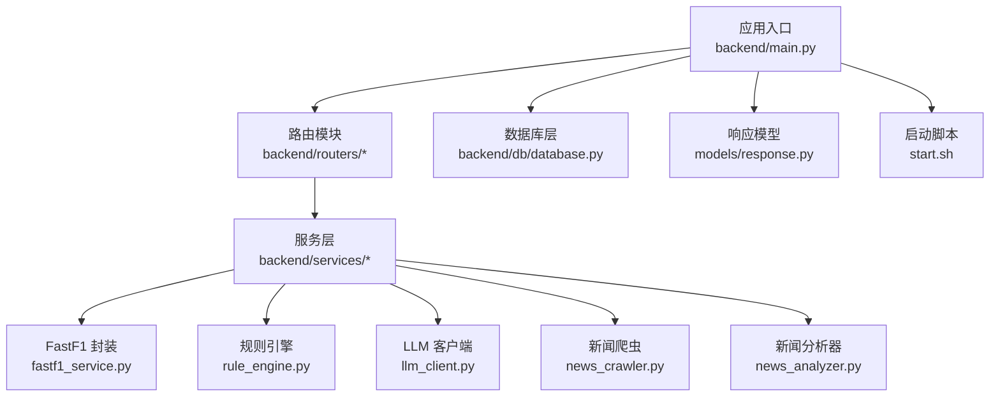

图表来源
- [backend/main.py:1-185](file://backend/main.py#L1-L185)
- [backend/routers/events.py:1-200](file://backend/routers/events.py#L1-L200)
- [backend/routers/telemetry.py:1-85](file://backend/routers/telemetry.py#L1-L85)
- [backend/routers/analysis.py:1-126](file://backend/routers/analysis.py#L1-L126)
- [backend/routers/news.py:1-200](file://backend/routers/news.py#L1-L200)
- [backend/routers/forum.py:1-200](file://backend/routers/forum.py#L1-L200)
- [backend/services/fastf1_service.py:1-92](file://backend/services/fastf1_service.py#L1-L92)
- [backend/services/rule_engine.py:1-800](file://backend/services/rule_engine.py#L1-L800)
- [backend/services/llm_client.py:1-325](file://backend/services/llm_client.py#L1-L325)
- [backend/services/news_crawler.py:1-250](file://backend/services/news_crawler.py#L1-L250)
- [backend/services/news_analyzer.py:1-586](file://backend/services/news_analyzer.py#L1-L586)
- [backend/db/database.py:1-800](file://backend/db/database.py#L1-L800)
- [backend/models/response.py:1-14](file://backend/models/response.py#L1-L14)
- [backend/start.sh:1-25](file://backend/start.sh#L1-L25)

章节来源
- [backend/main.py:1-185](file://backend/main.py#L1-L185)
- [backend/requirements.txt:1-18](file://backend/requirements.txt#L1-L18)

## 核心组件
- 应用初始化与中间件
  - 初始化 SQLite 数据库、启用 FastF1 本地缓存目录、设置 CORS 允许跨域、注册所有路由。
  - 启动时后台线程预热 FastF1 会话与常用 API 缓存，并启动 APScheduler 定时任务（自动爬取新闻、定期刷新缓存）。
- 路由系统
  - 事件路由：提供 2026 赛季赛程与赛道静态信息缓存。
  - 遥测路由：获取两车最快圈遥测数据，计算圈速差与弯角标注。
  - 分析路由：整合规则引擎与 LLM，生成结构化指标与中文分析报告，并带本地磁盘缓存。
  - 新闻路由：提供新闻列表、详情、AI 分析触发、爬虫触发等。
  - 论坛路由：用户注册/登录、分区、帖子、评论、点赞等。
  - 管理员路由：后台管理接口。
  - 术语路由：术语词典管理。
  - 车手路由：车手信息与评分。
  - 热门路由：热门内容推荐。
  - 精选路由：精选内容管理。
  - 聊天路由：匿名聊天室。
- 服务层
  - FastF1 服务封装：统一获取会话、内存缓存、时间格式化、弯角距离与标签处理、遥测序列化。
  - 规则引擎：按弯角、赛段、直线、轮胎稳定性等维度计算对比指标。
  - LLM 客户端：DeepSeek API 调用，构建提示词模板，生成中文分析报告。
  - 新闻爬虫与分析：RSS 爬取、去噪、入库、按需触发 AI 分析并生成论坛种子帖。
- 数据库层（SQLite）
  - 资讯、AI 分析、论坛分区、用户、帖子、评论、点赞、术语、车手评分与评论、精选内容、聊天消息等表，含索引与默认分区。
- 响应模型
  - 统一 API 响应结构，包含状态、数据与可选备注。
- 缓存策略
  - FastF1 本地缓存目录、进程内内存缓存、路由级 TTL 缓存、分析结果磁盘缓存、RAG 上下文缓存。
- 定时任务与预热
  - 启动后预热 FastF1 会话与热点 API；定时任务每小时爬取新闻，每两小时刷新缓存。
- 部署与运行
  - 启动脚本加载 .env，创建 cache 目录，使用 uvicorn 启动服务。

章节来源
- [backend/main.py:1-185](file://backend/main.py#L1-L185)
- [backend/routers/events.py:1-200](file://backend/routers/events.py#L1-L200)
- [backend/routers/telemetry.py:1-85](file://backend/routers/telemetry.py#L1-L85)
- [backend/routers/analysis.py:1-126](file://backend/routers/analysis.py#L1-L126)
- [backend/routers/news.py:1-200](file://backend/routers/news.py#L1-L200)
- [backend/routers/forum.py:1-200](file://backend/routers/forum.py#L1-L200)
- [backend/services/fastf1_service.py:1-92](file://backend/services/fastf1_service.py#L1-L92)
- [backend/services/rule_engine.py:1-800](file://backend/services/rule_engine.py#L1-L800)
- [backend/services/llm_client.py:1-325](file://backend/services/llm_client.py#L1-L325)
- [backend/services/news_crawler.py:1-250](file://backend/services/news_crawler.py#L1-L250)
- [backend/services/news_analyzer.py:1-586](file://backend/services/news_analyzer.py#L1-L586)
- [backend/db/database.py:1-800](file://backend/db/database.py#L1-L800)
- [backend/models/response.py:1-14](file://backend/models/response.py#L1-L14)
- [backend/start.sh:1-25](file://backend/start.sh#L1-L25)

## 架构总览
系统采用"路由-服务-数据"三层结构，FastAPI 提供统一入口与中间件，服务层封装外部依赖与业务逻辑，数据库层持久化结构化数据，缓存层贯穿多处以提升性能。

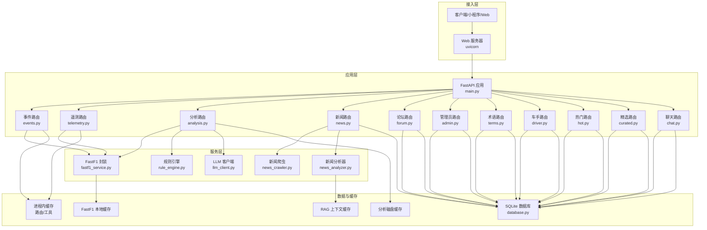

图表来源
- [backend/main.py:1-185](file://backend/main.py#L1-L185)
- [backend/routers/events.py:1-200](file://backend/routers/events.py#L1-L200)
- [backend/routers/telemetry.py:1-85](file://backend/routers/telemetry.py#L1-L85)
- [backend/routers/analysis.py:1-126](file://backend/routers/analysis.py#L1-L126)
- [backend/routers/news.py:1-200](file://backend/routers/news.py#L1-L200)
- [backend/routers/forum.py:1-200](file://backend/routers/forum.py#L1-L200)
- [backend/services/fastf1_service.py:1-92](file://backend/services/fastf1_service.py#L1-L92)
- [backend/services/rule_engine.py:1-800](file://backend/services/rule_engine.py#L1-L800)
- [backend/services/llm_client.py:1-325](file://backend/services/llm_client.py#L1-L325)
- [backend/services/news_crawler.py:1-250](file://backend/services/news_crawler.py#L1-L250)
- [backend/services/news_analyzer.py:1-586](file://backend/services/news_analyzer.py#L1-L586)
- [backend/db/database.py:1-800](file://backend/db/database.py#L1-L800)

## 详细组件分析

### 应用初始化与中间件
- 初始化
  - 创建并启用 FastF1 本地缓存目录，设置缓存根路径。
  - 初始化 SQLite 数据库（建表、索引、默认分区）。
  - 注册所有路由模块，按功能划分前缀与标签。
- 中间件
  - 配置 CORS，允许任意来源、方法与头，便于跨域访问。
- 启动事件
  - 后台线程预热 FastF1 会话与热点 API（events、standings）。
  - 启动 APScheduler，定时任务：
    - 每小时自动爬取新闻。
    - 每两小时刷新热点 API 缓存。
- 关闭事件
  - 优雅关闭调度器。

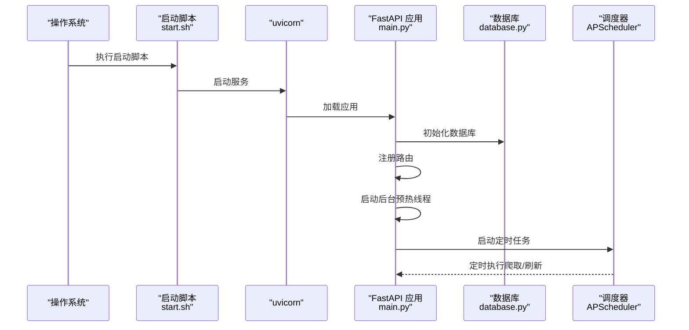

图表来源
- [backend/start.sh:1-25](file://backend/start.sh#L1-L25)
- [backend/main.py:141-161](file://backend/main.py#L141-L161)
- [backend/db/database.py:250-310](file://backend/db/database.py#L250-L310)

章节来源
- [backend/main.py:1-185](file://backend/main.py#L1-L185)
- [backend/start.sh:1-25](file://backend/start.sh#L1-L25)

### 路由系统

#### 事件路由（events）
- 功能
  - 获取 2026 赛季赛程列表，按年份缓存。
  - 获取指定轮次的赛道静态信息，内置中文映射与缓存。
- 缓存
  - 进程内内存缓存，TTL 6 小时。

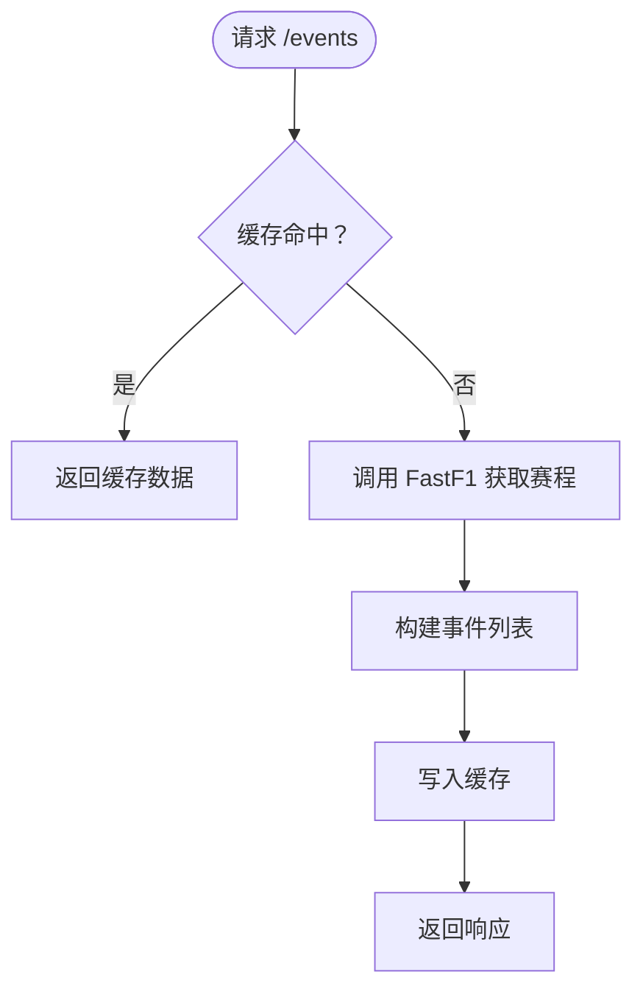

图表来源
- [backend/routers/events.py:21-53](file://backend/routers/events.py#L21-L53)

章节来源
- [backend/routers/events.py:1-200](file://backend/routers/events.py#L1-L200)

#### 遥测路由（telemetry）
- 功能
  - 对两车在指定会话的最快圈进行遥测对比，计算圈速差与弯角标注。
  - 获取车组颜色、团队信息与遥测序列化。
- 数据质量
  - 检测遥测长度截断并返回备注。

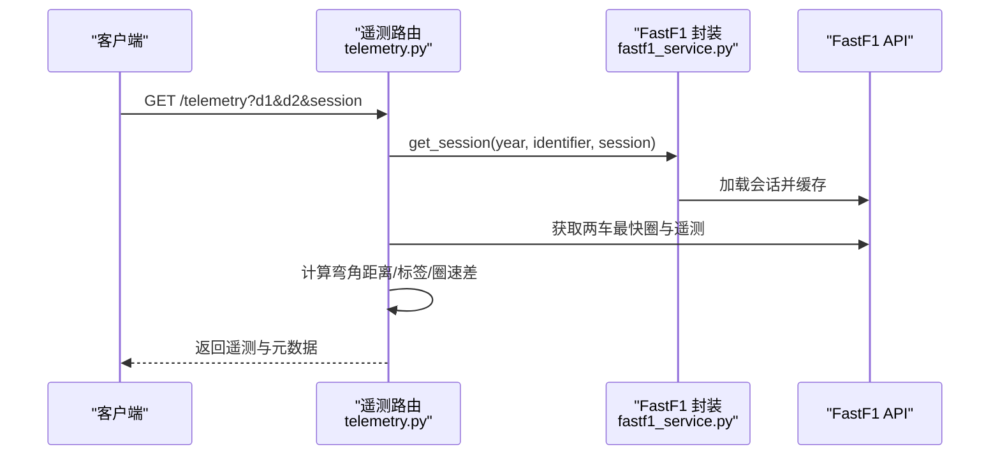

图表来源
- [backend/routers/telemetry.py:12-85](file://backend/routers/telemetry.py#L12-L85)
- [backend/services/fastf1_service.py:17-40](file://backend/services/fastf1_service.py#L17-L40)

章节来源
- [backend/routers/telemetry.py:1-85](file://backend/routers/telemetry.py#L1-L85)
- [backend/services/fastf1_service.py:1-92](file://backend/services/fastf1_service.py#L1-L92)

#### 分析路由（analysis）
- 功能
  - 聚合规则引擎指标与 LLM 报告，支持强制刷新。
  - 结果写入磁盘缓存，下次直接命中。
- 缓存
  - 基于参数生成 MD5 文件名，命中返回 cached 标记。

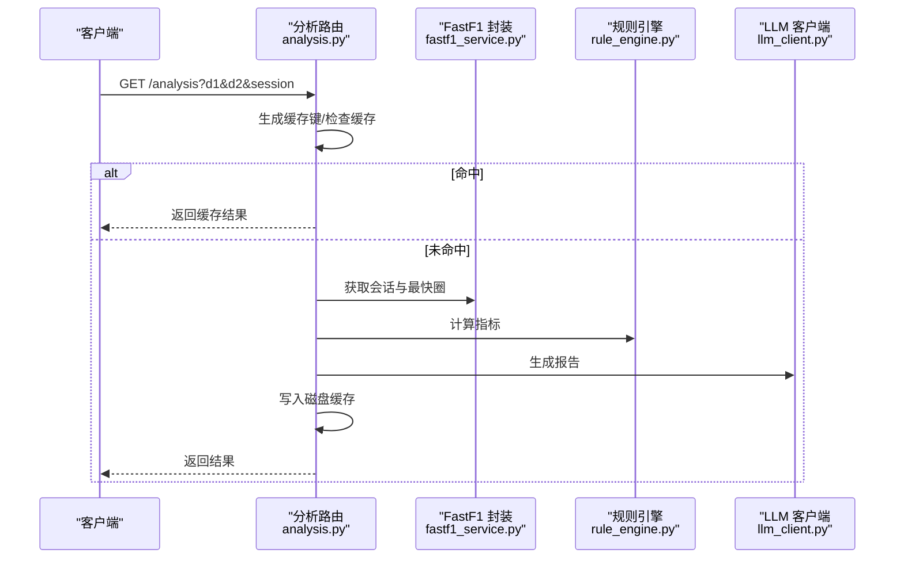

图表来源
- [backend/routers/analysis.py:35-126](file://backend/routers/analysis.py#L35-L126)
- [backend/services/rule_engine.py:1-800](file://backend/services/rule_engine.py#L1-L800)
- [backend/services/llm_client.py:235-325](file://backend/services/llm_client.py#L235-L325)

章节来源
- [backend/routers/analysis.py:1-126](file://backend/routers/analysis.py#L1-L126)
- [backend/services/rule_engine.py:1-800](file://backend/services/rule_engine.py#L1-L800)
- [backend/services/llm_client.py:1-325](file://backend/services/llm_client.py#L1-L325)

#### 新闻路由（news）
- 功能
  - 列表/详情/关联帖子/车队标签。
  - 用户触发 AI 分析（公共接口，异步执行）。
  - 管理员触发爬虫与单条分析。
- 安全
  - 管理员接口需携带令牌校验。

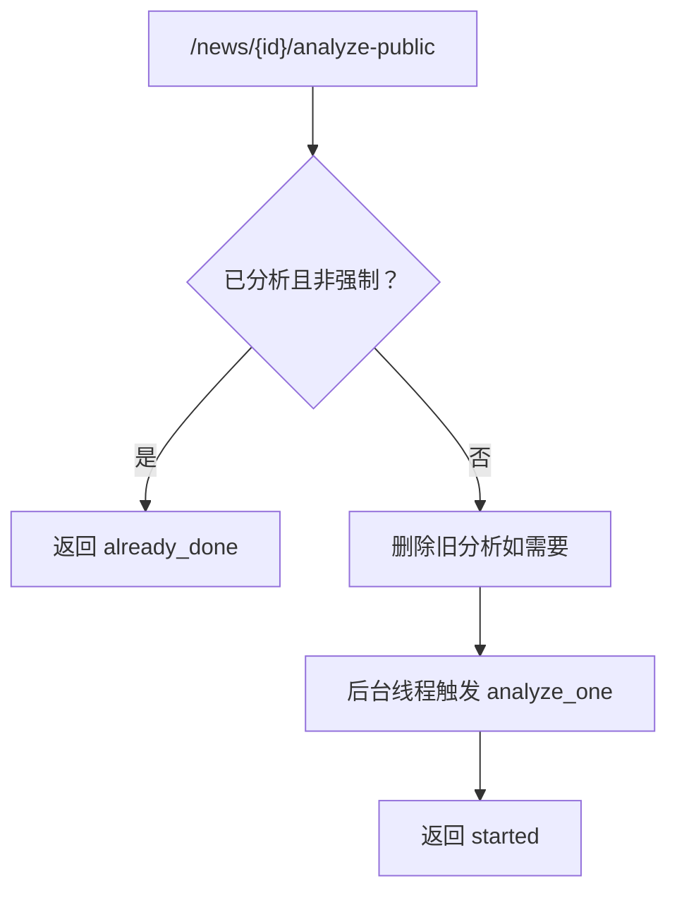

图表来源
- [backend/routers/news.py:132-161](file://backend/routers/news.py#L132-L161)
- [backend/services/news_analyzer.py:401-450](file://backend/services/news_analyzer.py#L401-L450)

章节来源
- [backend/routers/news.py:1-200](file://backend/routers/news.py#L1-L200)
- [backend/services/news_analyzer.py:1-586](file://backend/services/news_analyzer.py#L1-L586)

#### 论坛路由（forum）
- 功能
  - 用户注册/登录（微信 code 换 openid）、个人信息。
  - 分区列表（含缓存）。
  - 帖子列表/详情/发帖/删帖。
  - 评论列表/发评论。
  - 点赞/点踩。
- 安全
  - 微信 AppID/AppSecret 从环境变量读取；开发模式可用 code 当 openid。

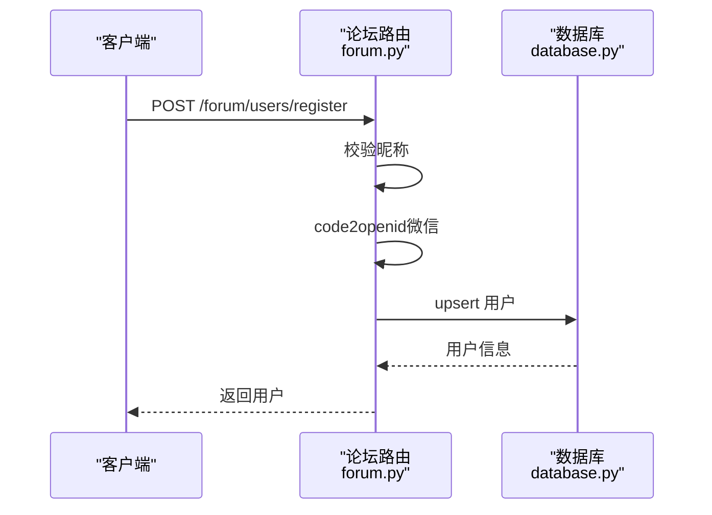

图表来源
- [backend/routers/forum.py:95-119](file://backend/routers/forum.py#L95-L119)
- [backend/db/database.py:448-469](file://backend/db/database.py#L448-L469)

章节来源
- [backend/routers/forum.py:1-200](file://backend/routers/forum.py#L1-L200)
- [backend/db/database.py:1-800](file://backend/db/database.py#L1-L800)

### 服务层设计

#### FastF1 服务封装（fastf1_service.py）
- 统一封装 FastF1 会话加载与缓存，避免重复网络请求。
- 提供时间格式化、弯角距离/标签计算、遥测序列化等工具函数。

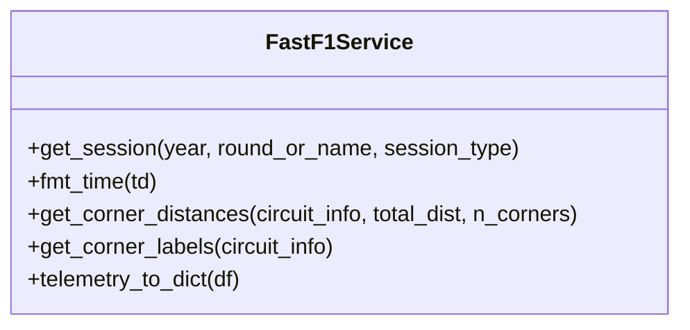

图表来源
- [backend/services/fastf1_service.py:17-92](file://backend/services/fastf1_service.py#L17-L92)

章节来源
- [backend/services/fastf1_service.py:1-92](file://backend/services/fastf1_service.py#L1-L92)

#### 规则引擎（rule_engine.py）
- 指标维度
  - 弯角：刹车点、最低速、出弯速差异。
  - 赛段：S1/S2/S3 圈时间差。
  - 直线：最高速、油门全开占比。
  - 轮胎：圈时标准差与衰退斜率。
- 输出
  - 汇总为结构化指标，供 LLM 生成报告。

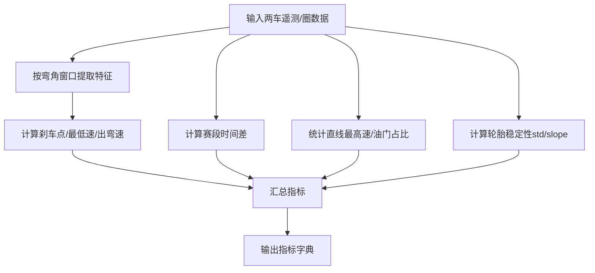

图表来源
- [backend/services/rule_engine.py:14-800](file://backend/services/rule_engine.py#L14-L800)

章节来源
- [backend/services/rule_engine.py:1-800](file://backend/services/rule_engine.py#L1-L800)

#### LLM 客户端（llm_client.py）
- 角色与提示词
  - 限定 2026 赛季事实，禁止引用历史赛季。
  - 按结构化指标生成中文报告，包含总体结论、赛段分析、弯道攻略、直线与油门效率、轮胎管理。
- 实现
  - 读取 .env 中 DeepSeek API Key，调用 chat.completions。

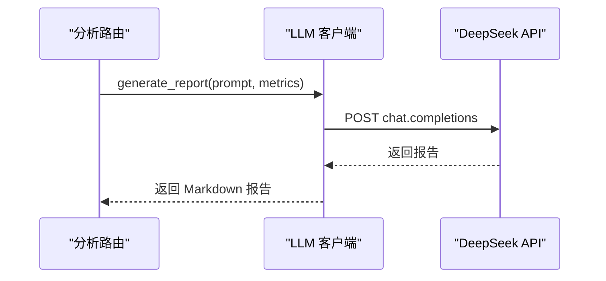

图表来源
- [backend/services/llm_client.py:235-325](file://backend/services/llm_client.py#L235-L325)

章节来源
- [backend/services/llm_client.py:1-325](file://backend/services/llm_client.py#L1-L325)

#### 新闻爬虫与分析（news_crawler.py / news_analyzer.py）
- 爬虫
  - RSS 源：The Race、Motorsport.com、Crash.net、F1i.com。
  - 去噪与过滤非 F1 内容，入库去重。
- 分析
  - 选择性注入 2026 赛季积分榜上下文（RAG），按三段式生成解读并写入数据库。
  - 自动将 AI 结果写为论坛种子帖。

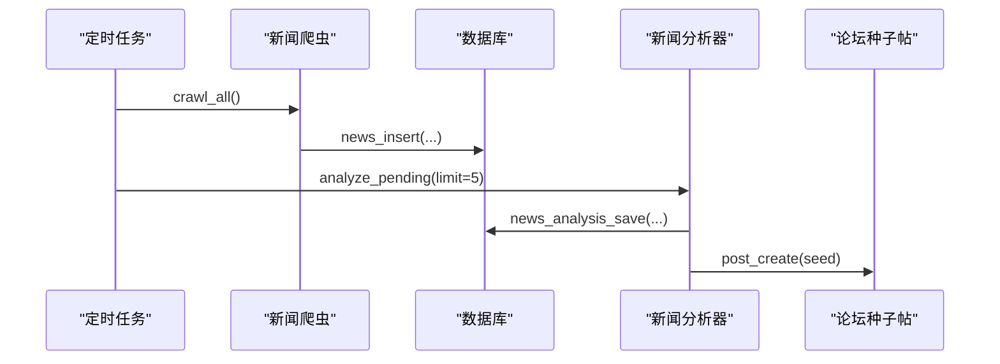

图表来源
- [backend/services/news_crawler.py:133-144](file://backend/services/news_crawler.py#L133-L144)
- [backend/services/news_analyzer.py:479-490](file://backend/services/news_analyzer.py#L479-L490)

章节来源
- [backend/services/news_crawler.py:1-250](file://backend/services/news_crawler.py#L1-L250)
- [backend/services/news_analyzer.py:1-586](file://backend/services/news_analyzer.py#L1-L586)

### 数据库设计与数据模型
- 表结构概览
  - 资讯（news）、AI 分析（news_analysis）、分区（sections）、用户（users）、帖子（posts）、评论（comments）、点赞（post_likes）、术语（terms）、车手评分（driver_ratings）、车手评论（driver_comments）、精选内容（curated_content）、聊天消息（chat_messages）。
- 索引与约束
  - 关键查询建立索引（如资讯发布时间、帖子状态与分区、评论状态等）。
  - 外键约束与唯一约束保证数据一致性。
- 默认分区
  - 2026 赛季主要分站与车队分区，幂等插入。

```mermaid
erDiagram
NEWS {
int id PK
text title
text summary
text url UK
text source
int published_at
int created_at
}
NEWS_ANALYSIS {
int id PK
int news_id UK FK
text tech_points
text plain_explain
text race_impact
text raw_report
int created_at
}
SECTIONS {
int id PK
text type
text name
text slug UK
int sort_order
}
USERS {
text openid PK
text nickname
text avatar_url
int created_at
}
POSTS {
int id PK
int section_id FK
int news_id FK
text title
text content
text author_openid
text author_nickname
text status
int is_seeded
int view_count
int comment_count
int created_at
int updated_at
}
COMMENTS {
int id PK
int post_id FK
text content
text author_openid
text author_nickname
text status
int created_at
}
POST_LIKES {
int id PK
int post_id FK
text openid
text type
int created_at
}
TERMS {
int id PK
text slug UK
text name_zh
text name_en
text aliases
text short_def
text full_def
text example
text category
int level
text related_slugs
int spec_year
text status
text submitted_by
int created_at
}
DRIVER_RATINGS {
int id PK
text driver_code
text openid
int speed
int consist
int defend
int wet
int mental
int created_at
}
DRIVER_COMMENTS {
int id PK
text driver_code
text content
text author_openid
text author_nickname
int likes
int created_at
}
CURATED_CONTENT {
int id PK
text url UK
text title
text summary
text cover_image
text platform
text content_type
text tags
text note
text submitted_by
text archived_html
text snapshot_image
int published_at
int created_at
text tech_points
text plain_explain
text race_impact
text analyzed_at
}
CHAT_MESSAGES {
int id PK
text nickname
text content
timestamp created_at
}
NEWS ||--|| NEWS_ANALYSIS : "1:1"
SECTIONS ||--o{ POSTS : "contains"
USERS ||--o{ POSTS : "author"
POSTS ||--o{ COMMENTS : "comments"
POSTS ||--o{ POST_LIKES : "likes"
```

图表来源
- [backend/db/database.py:30-205](file://backend/db/database.py#L30-L205)
- [backend/db/database.py:250-310](file://backend/db/database.py#L250-L310)

章节来源
- [backend/db/database.py:1-800](file://backend/db/database.py#L1-L800)

### 缓存策略与性能优化
- FastF1 本地缓存
  - 启动时设置缓存目录，避免重复下载数据。
- 进程内内存缓存
  - 事件/遥测/论坛分区等路由使用内存缓存，TTL 控制。
- 分析结果磁盘缓存
  - 分析路由按参数生成缓存文件，命中直接返回。
- RAG 上下文缓存
  - 仅在涉及积分/排名新闻时注入，30 分钟 TTL。
- 预热策略
  - 启动后预热 FastF1 会话与热点 API，降低首请求延迟。
- SQLite 优化
  - WAL 模式、外键开启、索引优化查询。

章节来源
- [backend/main.py:29-31](file://backend/main.py#L29-L31)
- [backend/routers/events.py:9-20](file://backend/routers/events.py#L9-L20)
- [backend/routers/news.py:24-35](file://backend/routers/news.py#L24-L35)
- [backend/routers/analysis.py:12-18](file://backend/routers/analysis.py#L12-L18)
- [backend/services/news_analyzer.py:21-24](file://backend/services/news_analyzer.py#L21-L24)
- [backend/db/database.py:17-23](file://backend/db/database.py#L17-L23)

### 部署配置与生产建议
- 环境变量
  - DEEPSEEK_API_KEY：LLM API 密钥。
  - ADMIN_TOKEN：管理员触发爬虫/分析所需令牌。
  - WX_APPID/WX_SECRET：微信登录配置（生产环境必填）。
- 启动
  - 使用 start.sh 启动，自动创建 cache 目录并加载 .env。
  - 生产环境建议使用反向代理与 HTTPS。
- 定时任务
  - 每小时爬取新闻，每两小时刷新热点缓存。
- 数据持久化
  - SQLite 文件位于数据库层目录，建议备份与监控。

章节来源
- [backend/services/llm_client.py:17-28](file://backend/services/llm_client.py#L17-L28)
- [backend/routers/news.py:22](file://backend/routers/news.py#L22)
- [backend/routers/forum.py:48-51](file://backend/routers/forum.py#L48-L51)
- [backend/start.sh:16-24](file://backend/start.sh#L16-L24)
- [backend/main.py:151-161](file://backend/main.py#L151-L161)

### API 端点文档与使用示例
- 通用响应
  - 成功：{"status": "ok", "data": ..., "note": null}
  - 失败：{"status": "error", "data": null, "note": "错误信息"}

- 事件
  - GET /events?year=2026
  - GET /events/{round_num}/circuit?year=2026

- 遥测
  - GET /telemetry?year=2026&round_num=|event=&d1=ALB&d2=ALO&session=Q

- 分析
  - GET /analysis?year=2026&round_num=|event=...&d1=ALB&d2=ALO&session=Q&force=false

- 新闻
  - GET /news?page=1&page_size=20&team=|keyword=
  - GET /news/{id}
  - GET /news/{id}/teams
  - GET /news/{id}/posts
  - POST /news/{id}/analyze-public?force=false
  - POST /news/crawl（管理员）
  - POST /news/{id}/analyze（管理员）

- 论坛
  - POST /forum/users/register
  - GET /forum/users/me?openid=
  - GET /forum/sections
  - GET /forum/posts?section_id=&page=&sort=latest|hot
  - GET /forum/posts/{id}
  - POST /forum/posts
  - DELETE /forum/posts/{id}
  - POST /forum/posts/{post_id}/like
  - GET /forum/posts/{post_id}/like?openid=
  - GET /forum/posts/{post_id}/comments
  - POST /forum/posts/{post_id}/comments

- 管理员
  - GET /admin/stats
  - POST /admin/rebuild-index

- 术语
  - GET /terms
  - GET /terms/{slug}

- 车手
  - GET /driver/{code}
  - POST /driver/{code}/rating
  - GET /driver/{code}/comments

- 热门
  - GET /hot/posts
  - GET /hot/news

- 精选
  - GET /curated
  - POST /curated
  - POST /curated/{id}/analyze

- 聊天
  - GET /chat
  - POST /chat

章节来源
- [backend/models/response.py:1-14](file://backend/models/response.py#L1-L14)
- [backend/routers/events.py:21-53](file://backend/routers/events.py#L21-L53)
- [backend/routers/telemetry.py:12-85](file://backend/routers/telemetry.py#L12-L85)
- [backend/routers/analysis.py:35-126](file://backend/routers/analysis.py#L35-L126)
- [backend/routers/news.py:68-200](file://backend/routers/news.py#L68-L200)
- [backend/routers/forum.py:95-200](file://backend/routers/forum.py#L95-L200)

## 依赖关系分析
- 外部依赖
  - FastAPI、uvicorn、fastf1、pandas、numpy、openai、python-dotenv、requests、requests-cache、httpx、apscheduler、scipy、feedparser、trafilatura、beautifulsoup4、lxml、playwright。
- 内部依赖
  - 路由依赖服务层；服务层依赖数据库层；分析路由依赖规则引擎与 LLM 客户端；新闻模块依赖爬虫与分析器。

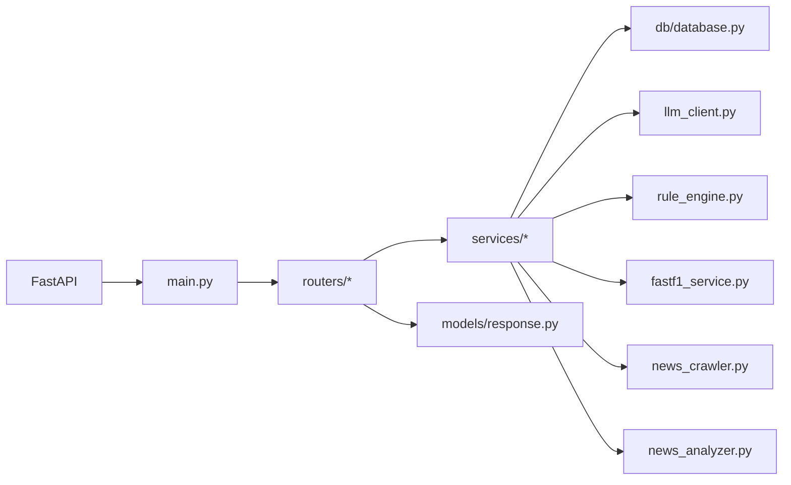

图表来源
- [backend/requirements.txt:1-18](file://backend/requirements.txt#L1-L18)
- [backend/main.py:1-11](file://backend/main.py#L1-L11)

章节来源
- [backend/requirements.txt:1-18](file://backend/requirements.txt#L1-L18)
- [backend/main.py:1-185](file://backend/main.py#L1-L185)

## 性能考虑
- 缓存优先：多层缓存（本地文件、进程内、路由级）降低重复计算与外部请求。
- 预热策略：启动即加载热点数据，缩短首请求延迟。
- 数据库优化：WAL 模式、索引、外键，提升并发与一致性。
- LLM 调用：控制温度与 token 数，必要时注入上下文，减少无效输出。
- 爬虫与分析：批量处理、降级策略（RSS 摘要），避免单点失败影响整体。

## 故障排查指南
- CORS 问题
  - 确认已启用 CORS 中间件，允许来源与方法。
- 微信登录失败
  - 检查 WX_APPID/WX_SECRET 是否正确配置；开发模式下可使用 code 当 openid。
- LLM 调用失败
  - 检查 DEEPSEEK_API_KEY 是否存在；确认网络可达与模型名称正确。
- 新闻分析未生成
  - 确认定时任务正常运行；查看服务端日志；检查 RSS 源可访问性。
- 数据库异常
  - 检查 f1.db 是否存在与可写；确认索引与 DDL 已执行。

章节来源
- [backend/main.py:35-40](file://backend/main.py#L35-L40)
- [backend/routers/forum.py:57-73](file://backend/routers/forum.py#L57-L73)
- [backend/services/llm_client.py:17-28](file://backend/services/llm_client.py#L17-L28)
- [backend/services/news_crawler.py:104-131](file://backend/services/news_crawler.py#L104-L131)
- [backend/db/database.py:17-23](file://backend/db/database.py#L17-L23)

## 结论
本后端服务以 FastAPI 为核心，结合 FastF1、规则引擎与 LLM，构建了从数据获取、结构化分析到智能解读的完整链路。通过多层缓存与预热策略，系统在性能与用户体验上取得平衡；SQLite 数据模型清晰，支持论坛与术语扩展。建议在生产环境中完善监控、日志与备份策略，并持续优化 LLM 提示词与 RAG 上下文注入。

## 附录
- 启动命令
  - bash start.sh
- 环境变量
  - DEEPSEEK_API_KEY、ADMIN_TOKEN、WX_APPID、WX_SECRET
- 版本与依赖
  - 参考 requirements.txt