# 增强数据服务

<cite>
**本文档引用的文件**
- [backend/main.py](file://backend/main.py)
- [backend/db/database.py](file://backend/db/database.py)
- [backend/models/response.py](file://backend/models/response.py)
- [backend/services/fastf1_service.py](file://backend/services/fastf1_service.py)
- [backend/services/knowledge_loader.py](file://backend/services/knowledge_loader.py)
- [backend/routers/analysis.py](file://backend/routers/analysis.py)
- [backend/routers/news.py](file://backend/routers/news.py)
- [backend/routers/forum.py](file://backend/routers/forum.py)
- [backend/services/news_crawler.py](file://backend/services/news_crawler.py)
- [backend/services/news_analyzer.py](file://backend/services/news_analyzer.py)
- [backend/services/llm_client.py](file://backend/services/llm_client.py)
- [backend/services/rule_engine.py](file://backend/services/rule_engine.py)
- [backend/knowledge/decision_rules/strategy_rules.json](file://backend/knowledge/decision_rules/strategy_rules.json)
- [backend/knowledge/reference_data/tire_compounds_2026.json](file://backend/knowledge/reference_data/tire_compounds_2026.json)
- [backend/knowledge/tracks/track_characteristics.json](file://backend/knowledge/tracks/track_characteristics.json)
</cite>

## 目录
1. [项目简介](#项目简介)
2. [项目结构](#项目结构)
3. [核心组件](#核心组件)
4. [架构概览](#架构概览)
5. [详细组件分析](#详细组件分析)
6. [依赖关系分析](#依赖关系分析)
7. [性能考虑](#性能考虑)
8. [故障排除指南](#故障排除指南)
9. [结论](#结论)

## 项目简介

增强数据服务是Fast-F1项目的核心后端服务，专注于为F1数据分析提供全面的增强服务。该项目基于FastAPI构建，集成了实时数据获取、AI分析、知识库管理和社区互动等功能。

主要功能包括：
- **实时数据获取**：通过FastF1库获取最新的F1赛事数据
- **AI智能分析**：提供新闻分析、遥测数据解读、策略建议
- **知识库管理**：维护F1相关的知识库，包括轮胎数据、策略规则、赛道特性
- **社区互动**：支持论坛、评论、点赞等社交功能
- **多语言支持**：支持中英文内容的分析和展示

## 项目结构

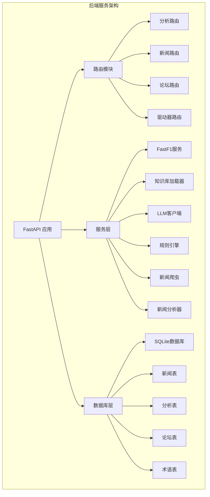

**图表来源**
- [backend/main.py:1-185](file://backend/main.py#L1-L185)
- [backend/db/database.py:1-2121](file://backend/db/database.py#L1-L2121)

**章节来源**
- [backend/main.py:1-185](file://backend/main.py#L1-L185)
- [backend/db/database.py:1-2121](file://backend/db/database.py#L1-L2121)

## 核心组件

### 数据库层 (Database Layer)

数据库采用SQLite设计，支持多种F1相关内容的存储：

```mermaid
erDiagram
NEWS {
integer id PK
string title
string summary
string url UK
string source
string language
integer published_at
integer created_at
}
NEWS_ANALYSIS {
integer id PK
integer news_id UK FK
string tech_points
string plain_explain
string race_impact
string raw_report
integer created_at
}
POSTS {
integer id PK
integer section_id FK
integer news_id FK
integer curated_id FK
string title
string content
string author_openid
string author_nickname
string status
integer is_seeded
integer view_count
integer comment_count
integer created_at
integer updated_at
}
USERS {
string openid PK
string nickname
string avatar_url
integer created_at
}
SECTIONS {
integer id PK
string type
string name
string slug UK
integer sort_order
}
NEWS ||--|| NEWS_ANALYSIS : "1:1关联"
SECTIONS ||--o{ POSTS : "包含"
USERS ||--o{ POSTS : "作者"
```

**图表来源**
- [backend/db/database.py:30-206](file://backend/db/database.py#L30-L206)

### 服务层架构

服务层采用模块化设计，每个服务负责特定的功能领域：

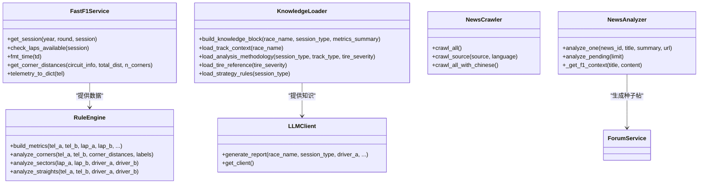

**图表来源**
- [backend/services/fastf1_service.py:1-92](file://backend/services/fastf1_service.py#L1-L92)
- [backend/services/knowledge_loader.py:432-483](file://backend/services/knowledge_loader.py#L432-L483)
- [backend/services/llm_client.py:235-325](file://backend/services/llm_client.py#L235-L325)
- [backend/services/rule_engine.py:1-800](file://backend/services/rule_engine.py#L1-L800)
- [backend/services/news_crawler.py:133-250](file://backend/services/news_crawler.py#L133-L250)
- [backend/services/news_analyzer.py:401-586](file://backend/services/news_analyzer.py#L401-L586)

**章节来源**
- [backend/db/database.py:17-310](file://backend/db/database.py#L17-L310)
- [backend/services/fastf1_service.py:1-92](file://backend/services/fastf1_service.py#L1-L92)
- [backend/services/knowledge_loader.py:1-483](file://backend/services/knowledge_loader.py#L1-L483)
- [backend/services/llm_client.py:1-325](file://backend/services/llm_client.py#L1-L325)
- [backend/services/rule_engine.py:1-800](file://backend/services/rule_engine.py#L1-L800)
- [backend/services/news_crawler.py:1-250](file://backend/services/news_crawler.py#L1-L250)
- [backend/services/news_analyzer.py:1-586](file://backend/services/news_analyzer.py#L1-L586)

## 架构概览

增强数据服务采用分层架构设计，确保系统的可扩展性和可维护性：

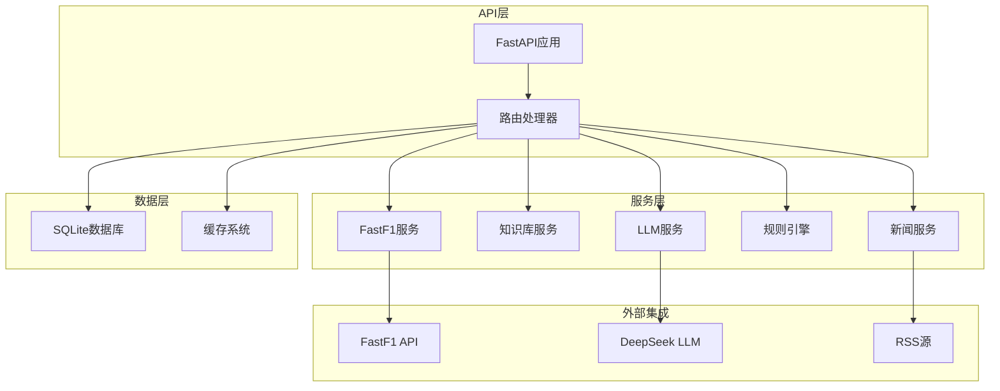

**图表来源**
- [backend/main.py:33-58](file://backend/main.py#L33-L58)
- [backend/routers/analysis.py:1-126](file://backend/routers/analysis.py#L1-L126)
- [backend/routers/news.py:1-205](file://backend/routers/news.py#L1-L205)
- [backend/routers/forum.py:1-329](file://backend/routers/forum.py#L1-L329)

### 启动流程

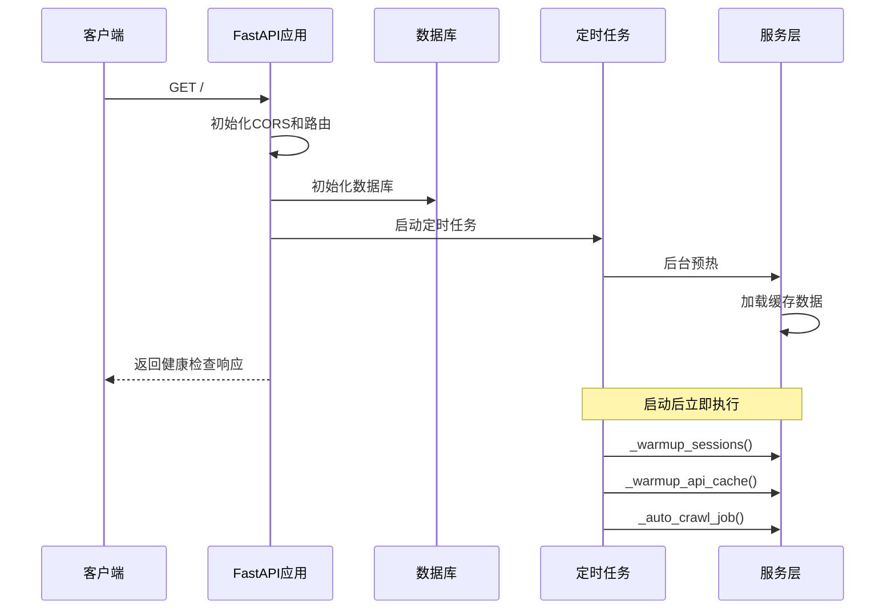

**图表来源**
- [backend/main.py:141-161](file://backend/main.py#L141-L161)
- [backend/main.py:61-132](file://backend/main.py#L61-L132)

**章节来源**
- [backend/main.py:141-161](file://backend/main.py#L141-L161)
- [backend/main.py:61-132](file://backend/main.py#L61-L132)

## 详细组件分析

### 分析服务 (Analysis Service)

分析服务是增强数据服务的核心组件，提供F1赛车对比分析功能：

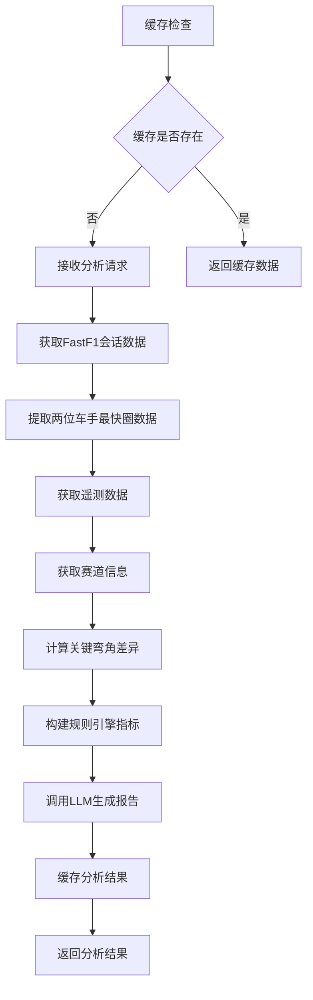

**图表来源**
- [backend/routers/analysis.py:35-126](file://backend/routers/analysis.py#L35-L126)
- [backend/services/rule_engine.py:14-79](file://backend/services/rule_engine.py#L14-L79)
- [backend/services/llm_client.py:235-325](file://backend/services/llm_client.py#L235-L325)

#### 关键弯角分析算法

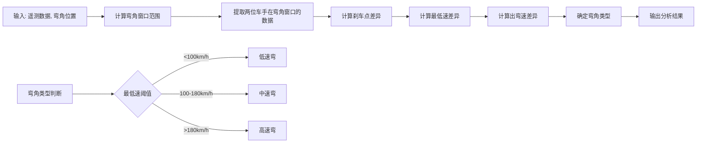

**图表来源**
- [backend/services/rule_engine.py:14-79](file://backend/services/rule_engine.py#L14-L79)

**章节来源**
- [backend/routers/analysis.py:35-126](file://backend/routers/analysis.py#L35-L126)
- [backend/services/rule_engine.py:14-79](file://backend/services/rule_engine.py#L14-L79)

### 新闻分析服务 (News Analysis Service)

新闻分析服务提供AI驱动的F1相关新闻分析：

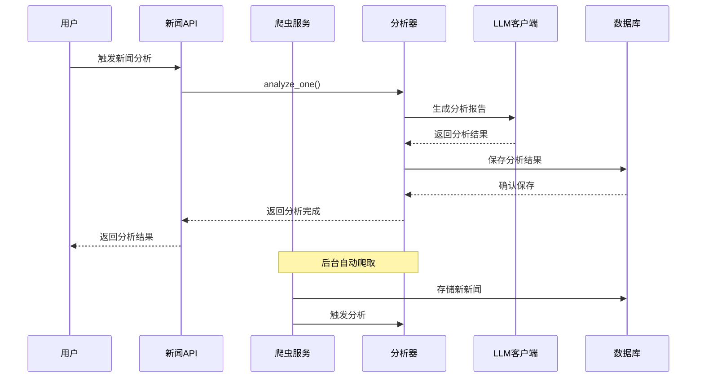

**图表来源**
- [backend/routers/news.py:132-161](file://backend/routers/news.py#L132-L161)
- [backend/services/news_analyzer.py:401-449](file://backend/services/news_analyzer.py#L401-L449)
- [backend/services/news_crawler.py:133-250](file://backend/services/news_crawler.py#L133-L250)

#### RAG上下文注入机制

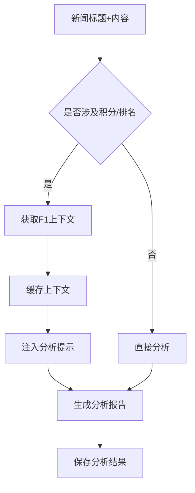

**图表来源**
- [backend/services/news_analyzer.py:26-102](file://backend/services/news_analyzer.py#L26-L102)

**章节来源**
- [backend/routers/news.py:132-161](file://backend/routers/news.py#L132-L161)
- [backend/services/news_analyzer.py:26-102](file://backend/services/news_analyzer.py#L26-L102)
- [backend/services/news_crawler.py:133-250](file://backend/services/news_crawler.py#L133-L250)

### 论坛服务 (Forum Service)

论坛服务提供F1社区互动功能：

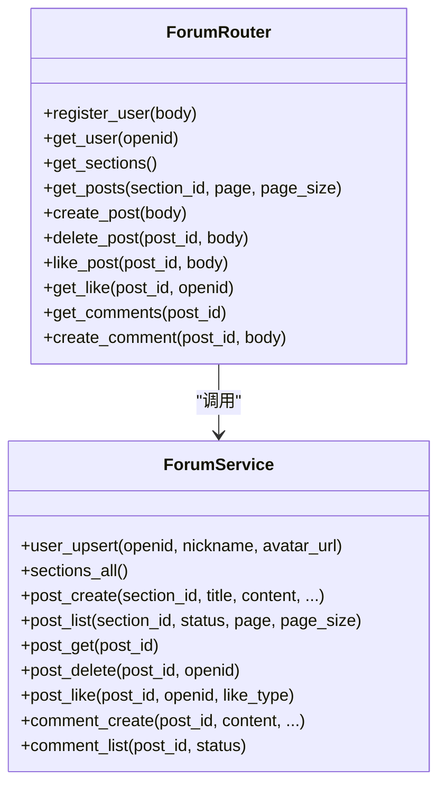

**图表来源**
- [backend/routers/forum.py:95-329](file://backend/routers/forum.py#L95-L329)

**章节来源**
- [backend/routers/forum.py:95-329](file://backend/routers/forum.py#L95-L329)

### 知识库服务 (Knowledge Base Service)

知识库服务提供动态知识注入功能：

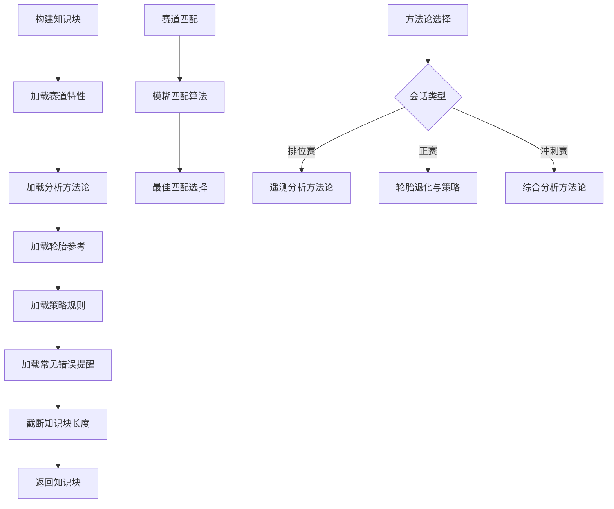

**图表来源**
- [backend/services/knowledge_loader.py:432-483](file://backend/services/knowledge_loader.py#L432-L483)
- [backend/services/knowledge_loader.py:157-204](file://backend/services/knowledge_loader.py#L157-L204)
- [backend/services/knowledge_loader.py:206-253](file://backend/services/knowledge_loader.py#L206-L253)

**章节来源**
- [backend/services/knowledge_loader.py:432-483](file://backend/services/knowledge_loader.py#L432-L483)
- [backend/services/knowledge_loader.py:157-204](file://backend/services/knowledge_loader.py#L157-L204)
- [backend/services/knowledge_loader.py:206-253](file://backend/services/knowledge_loader.py#L206-L253)

## 依赖关系分析

### 外部依赖

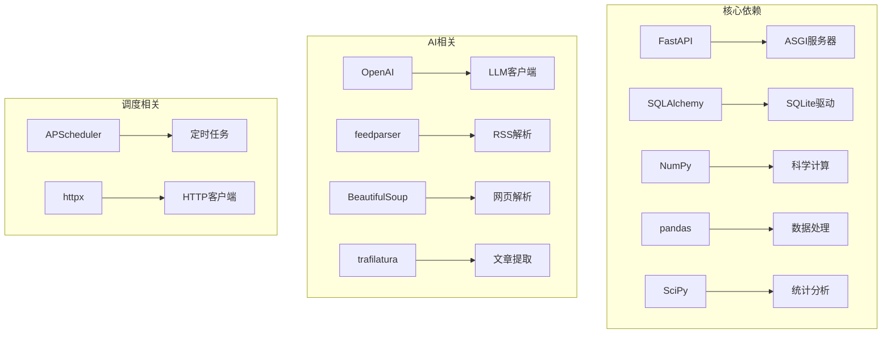

**图表来源**
- [backend/main.py:1-15](file://backend/main.py#L1-L15)
- [backend/services/news_crawler.py:8-15](file://backend/services/news_crawler.py#L8-L15)
- [backend/services/news_analyzer.py:8-17](file://backend/services/news_analyzer.py#L8-L17)

### 内部模块依赖

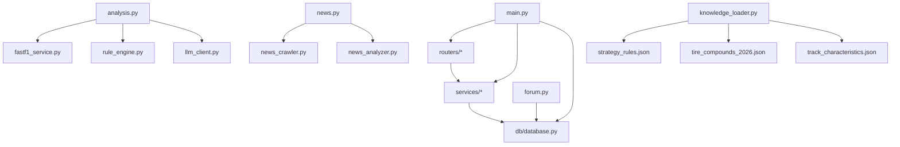

**图表来源**
- [backend/main.py:6-11](file://backend/main.py#L6-L11)
- [backend/routers/analysis.py:3-8](file://backend/routers/analysis.py#L3-L8)
- [backend/routers/news.py:14](file://backend/routers/news.py#L14)
- [backend/routers/forum.py:24-31](file://backend/routers/forum.py#L24-L31)

**章节来源**
- [backend/main.py:6-11](file://backend/main.py#L6-L11)
- [backend/routers/analysis.py:3-8](file://backend/routers/analysis.py#L3-L8)
- [backend/routers/news.py:14](file://backend/routers/news.py#L14)
- [backend/routers/forum.py:24-31](file://backend/routers/forum.py#L24-L31)

## 性能考虑

### 缓存策略

系统采用多层次缓存策略以提升性能：

1. **FastF1会话缓存**：进程级内存缓存，避免重复加载相同会话数据
2. **分析结果缓存**：文件系统缓存，支持跨进程共享
3. **数据库查询缓存**：针对热点查询结果的缓存
4. **知识库缓存**：JSON文件的内存缓存

### 性能优化措施

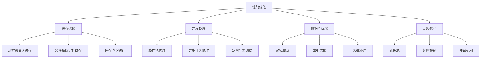

**图表来源**
- [backend/services/fastf1_service.py:14-41](file://backend/services/fastf1_service.py#L14-L41)
- [backend/routers/analysis.py:12-33](file://backend/routers/analysis.py#L12-L33)
- [backend/db/database.py:21](file://backend/db/database.py#L21)

### 数据库性能

数据库采用SQLite并启用WAL模式以提升并发性能：

- **WAL模式**：支持多读写并发，减少锁竞争
- **外键约束**：确保数据完整性
- **索引优化**：为常用查询字段建立索引
- **事务批处理**：批量操作提升写入性能

**章节来源**
- [backend/services/fastf1_service.py:14-41](file://backend/services/fastf1_service.py#L14-L41)
- [backend/routers/analysis.py:12-33](file://backend/routers/analysis.py#L12-L33)
- [backend/db/database.py:21](file://backend/db/database.py#L21)

## 故障排除指南

### 常见问题及解决方案

#### FastF1数据获取失败

**问题症状**：分析服务无法获取F1数据，返回会话加载失败

**解决方案**：
1. 检查FastF1 API连接状态
2. 验证缓存目录权限
3. 查看会话缓存是否过期
4. 确认网络连接稳定

#### AI分析失败

**问题症状**：新闻分析或遥测分析返回错误

**解决方案**：
1. 检查DeepSeek API密钥配置
2. 验证网络连接和API可用性
3. 查看LLM客户端错误日志
4. 确认知识库文件完整性

#### 数据库连接问题

**问题症状**：数据库操作失败，返回连接错误

**解决方案**：
1. 检查数据库文件权限
2. 验证SQLite版本兼容性
3. 查看WAL文件状态
4. 确认磁盘空间充足

### 日志监控

系统提供详细的日志记录机制：

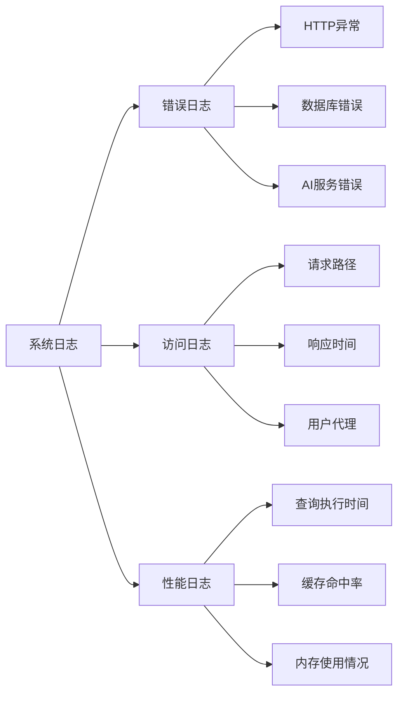

**图表来源**
- [backend/main.py:16](file://backend/main.py#L16)
- [backend/services/news_analyzer.py:19](file://backend/services/news_analyzer.py#L19)

**章节来源**
- [backend/main.py:16](file://backend/main.py#L16)
- [backend/services/news_analyzer.py:19](file://backend/services/news_analyzer.py#L19)

## 结论

增强数据服务是一个功能完整、架构清晰的F1数据分析平台。通过模块化设计和多层次缓存策略，系统能够高效处理大量的F1数据和用户请求。

### 主要优势

1. **模块化架构**：清晰的服务分离便于维护和扩展
2. **高性能设计**：多层缓存和并发处理提升响应速度
3. **智能化分析**：AI驱动的新闻分析和遥测解读
4. **社区功能**：完整的论坛和互动功能
5. **知识管理**：结构化的F1知识库和规则引擎

### 技术特色

- **实时数据集成**：与FastF1 API深度集成，提供最新赛事数据
- **AI智能分析**：基于DeepSeek的LLM分析能力
- **多语言支持**：中英文内容的统一处理
- **社区驱动**：用户生成内容和专家分析相结合
- **可扩展性**：模块化设计支持功能扩展

该系统为F1爱好者和专业人士提供了全面的数据分析和社区交流平台，具有良好的可维护性和扩展性。