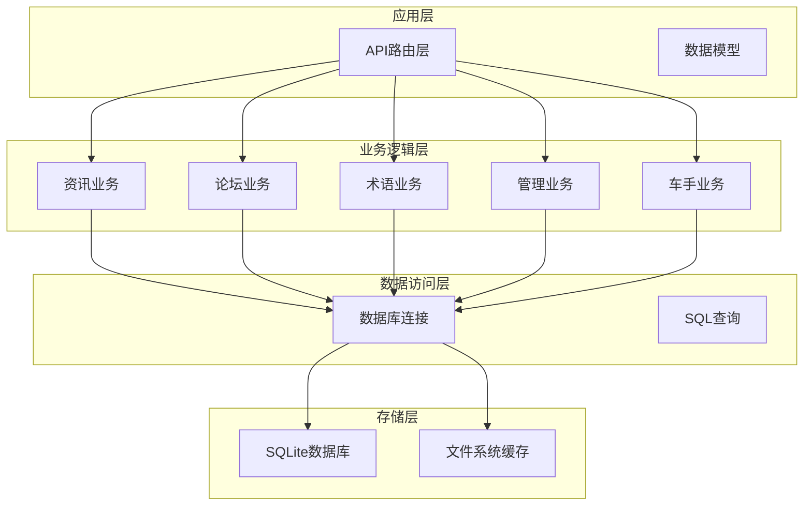
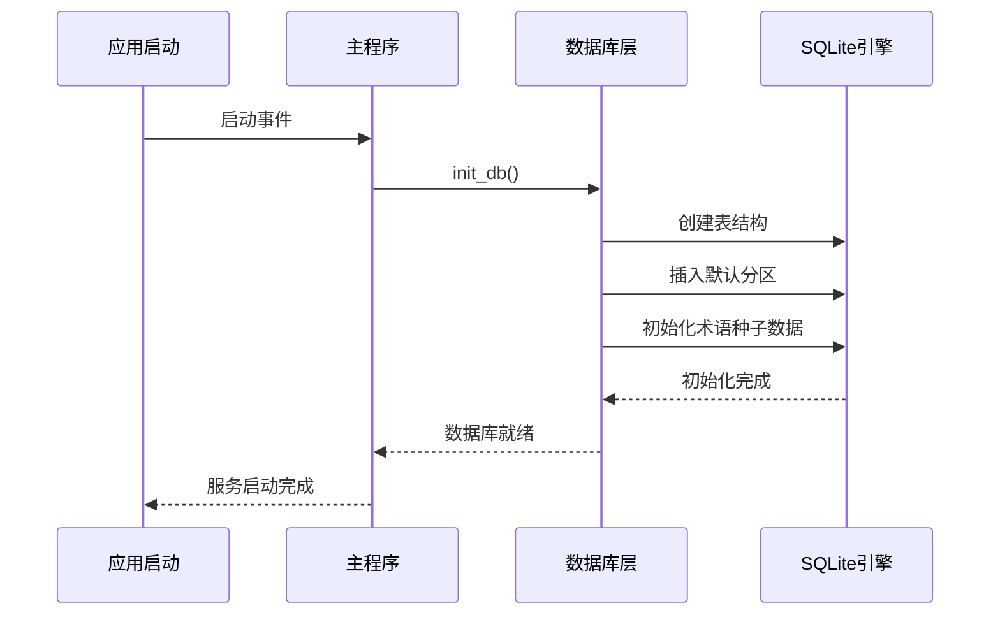
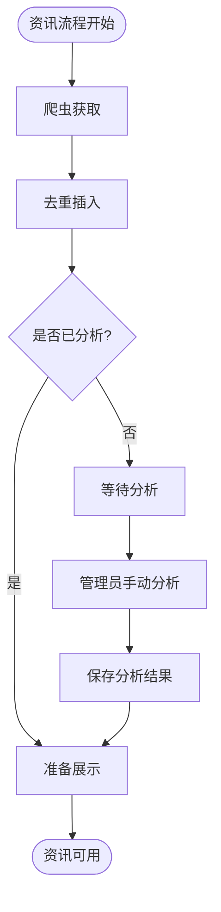
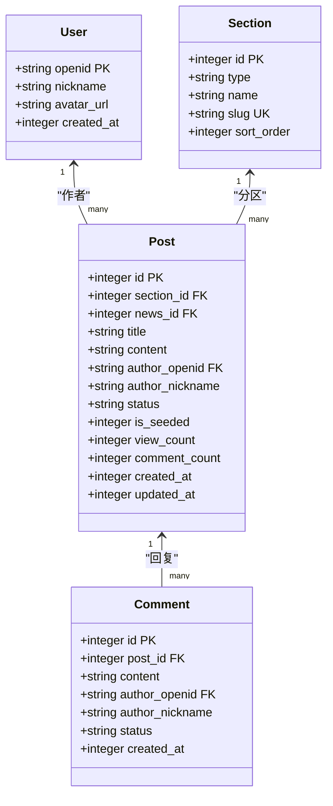
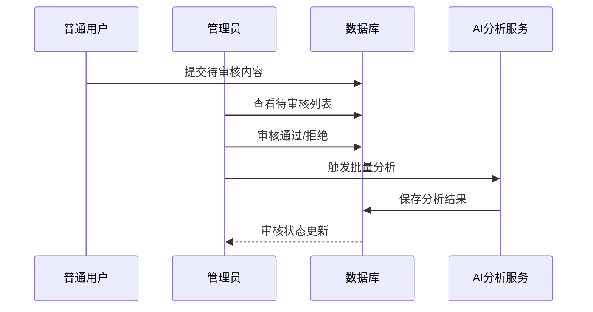
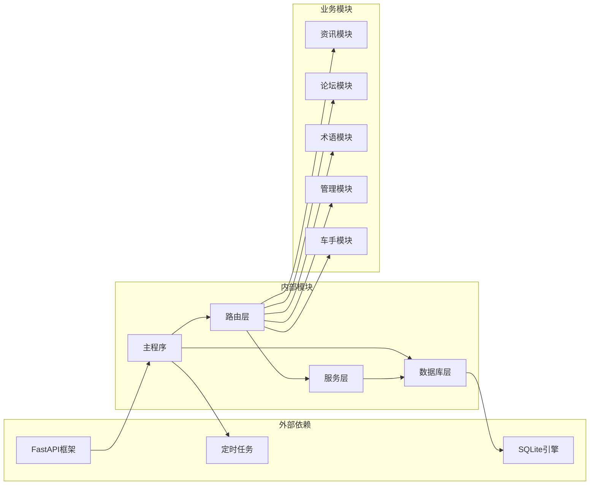
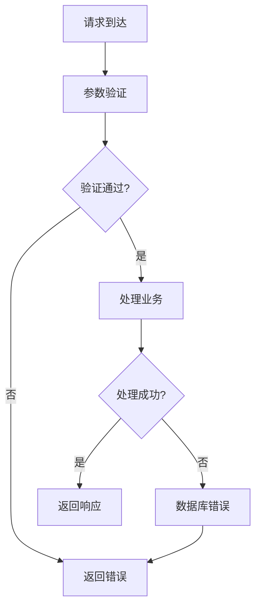

# 数据库设计

<cite>
**本文档引用的文件**
- [database.py](file://backend/db/database.py)
- [main.py](file://backend/main.py)
- [news.py](file://backend/routers/news.py)
- [forum.py](file://backend/routers/forum.py)
- [terms.py](file://backend/routers/terms.py)
- [admin.py](file://backend/routers/admin.py)
- [driver.py](file://backend/routers/driver.py)
- [response.py](file://backend/models/response.py)
</cite>

## 目录
1. [简介](#简介)
2. [项目结构](#项目结构)
3. [核心组件](#核心组件)
4. [架构概览](#架构概览)
5. [详细组件分析](#详细组件分析)
6. [依赖分析](#依赖分析)
7. [性能考虑](#性能考虑)
8. [故障排除指南](#故障排除指南)
9. [结论](#结论)
10. [附录](#附录)

## 简介

本项目采用SQLite作为数据库引擎，构建了一个完整的F1赛车数据服务平台。数据库设计围绕四大核心业务模块：资讯管理、论坛社区、术语知识库和车手互动，形成了一个功能完备的数据存储体系。

系统采用"资讯-分析-社区-知识"的完整数据流设计，通过AI分析模块为静态资讯注入动态解读，结合论坛社区实现用户生成内容，通过术语系统建立知识关联，最终形成一个多层次的F1数据生态系统。

## 项目结构

项目采用典型的三层架构设计：



**图表来源**
- [main.py:117-125](file://backend/main.py#L117-L125)
- [database.py:13-19](file://backend/db/database.py#L13-L19)

**章节来源**
- [main.py:1-157](file://backend/main.py#L1-157)
- [database.py:1-160](file://backend/db/database.py#L1-L160)

## 核心组件

### 数据库初始化与连接

系统采用集中式的数据库初始化机制，确保应用启动时自动完成数据库结构创建和初始数据填充。



**图表来源**
- [main.py:117-125](file://backend/main.py#L117-L125)
- [database.py:204-214](file://backend/db/database.py#L204-L214)

### 核心数据表设计

系统包含以下核心数据表：

| 表名 | 用途 | 主要字段 | 约束 |
|------|------|----------|------|
| news | 资讯原文 | id, title, summary, url, source, published_at | 唯一URL, 时间戳索引 |
| news_analysis | AI分析结果 | id, news_id, tech_points, plain_explain, race_impact | 外键引用news |
| sections | 论坛分区 | id, type, name, slug, sort_order | 唯一slug |
| users | 用户信息 | openid, nickname, avatar_url | 主键openid |
| posts | 帖子内容 | id, section_id, title, content, author_openid | 外键引用sections/users |
| comments | 评论内容 | id, post_id, content, author_openid | 外键引用posts/users |

**章节来源**
- [database.py:26-159](file://backend/db/database.py#L26-L159)

## 架构概览

系统采用"单机SQLite + 多表关联"的架构设计，通过精心设计的索引策略和约束机制，确保在单机环境下实现高性能的数据访问。

```mermaid
erDiagram
NEWS {
integer id PK
text title
text summary
text url UK
text source
integer published_at
integer created_at
}
NEWS_ANALYSIS {
integer id PK
integer news_id UK FK
text tech_points
text plain_explain
text race_impact
text raw_report
integer created_at
}
SECTIONS {
integer id PK
text type
text name
text slug UK
integer sort_order
}
USERS {
text openid PK
text nickname
text avatar_url
integer created_at
}
POSTS {
integer id PK
integer section_id FK
integer news_id FK
text title
text content
text author_openid FK
text author_nickname
text status
integer is_seeded
integer view_count
integer comment_count
integer created_at
integer updated_at
}
COMMENTS {
integer id PK
integer post_id FK
text content
text author_openid FK
text author_nickname
text status
integer created_at
}
NEWS_ANALYSIS }o--|| NEWS : "1:1关联"
POSTS }o--|| SECTIONS : "多对一"
POSTS }o--|| USERS : "多对一"
COMMENTS }o--|| POSTS : "多对一"
COMMENTS }o--|| USERS : "多对一"
```

**图表来源**
- [database.py:26-159](file://backend/db/database.py#L26-L159)

## 详细组件分析

### 资讯管理系统

资讯系统是整个平台的核心数据源，采用"爬取-存储-分析-展示"的完整流程。



**图表来源**
- [news.py:127-156](file://backend/routers/news.py#L127-L156)
- [database.py:302-325](file://backend/db/database.py#L302-L325)

#### 资讯表结构详解

资讯表采用宽表设计，包含完整的新闻元数据和AI分析结果：

- **基础字段**：标题、摘要、URL、来源、发布时间
- **分析字段**：技术要点、通俗解释、赛况影响、原始报告
- **时间戳字段**：创建时间、更新时间
- **索引策略**：按发布时间倒序索引，支持高效分页查询

**章节来源**
- [database.py:27-47](file://backend/db/database.py#L27-L47)
- [news.py:68-82](file://backend/routers/news.py#L68-L82)

### 论坛社区系统

论坛系统实现了完整的UGC（用户生成内容）生态，包含用户管理、分区组织、帖子管理和评论系统。



**图表来源**
- [database.py:58-92](file://backend/db/database.py#L58-L92)

#### 用户认证与权限

系统采用微信小程序授权模式，通过临时code换取用户openid，实现无密码用户认证。

**章节来源**
- [forum.py:57-73](file://backend/routers/forum.py#L57-L73)
- [forum.py:95-119](file://backend/routers/forum.py#L95-L119)

### 术语知识库系统

术语系统为F1专业术语建立了完整的知识图谱，支持多语言、多级别、多分类的术语管理。

```mermaid
erDiagram
TERMS {
integer id PK
text slug UK
text name_zh
text name_en
text aliases
text short_def
text full_def
text example
text category
integer level
text related_slugs
integer spec_year
text status
text submitted_by
integer created_at
}
DRIVER_COMMENTS {
integer id PK
text driver_code
text content
text author_openid FK
text author_nickname
integer likes
integer created_at
}
DRIVER_RATINGS {
integer id PK
text driver_code
text openid
integer speed
integer consist
integer defend
integer wet
integer mental
integer created_at
unique(driver_code, openid)
}
TERMS ||--o{ DRIVER_COMMENTS : "相关术语"
DRIVER_RATINGS }o--|| DRIVER_COMMENTS : "车手互动"
```

**图表来源**
- [database.py:111-158](file://backend/db/database.py#L111-L158)

#### 术语匹配算法

系统实现了智能术语匹配算法，能够从新闻内容中自动识别相关的F1术语：

**章节来源**
- [database.py:1268-1316](file://backend/db/database.py#L1268-L1316)
- [terms.py:52-59](file://backend/routers/terms.py#L52-L59)

### 管理员审核系统

管理员系统提供了完整的审核机制，确保平台内容的质量和合规性。



**图表来源**
- [admin.py:40-81](file://backend/routers/admin.py#L40-L81)
- [admin.py:134-191](file://backend/routers/admin.py#L134-L191)

**章节来源**
- [admin.py:16-34](file://backend/routers/admin.py#L16-L34)
- [admin.py:214-244](file://backend/routers/admin.py#L214-L244)

## 依赖分析

系统采用松耦合的模块化设计，各组件间通过清晰的接口进行交互。



**图表来源**
- [main.py:1-157](file://backend/main.py#L1-L157)
- [database.py:1-160](file://backend/db/database.py#L1-L160)

### 数据访问模式

系统实现了多种数据访问模式以满足不同的业务需求：

1. **CRUD模式**：标准的增删改查操作
2. **聚合查询模式**：复杂统计和聚合计算
3. **事务模式**：保证数据一致性
4. **缓存模式**：热点数据缓存优化

**章节来源**
- [database.py:221-325](file://backend/db/database.py#L221-L325)
- [database.py:1205-1220](file://backend/db/database.py#L1205-L1220)

## 性能考虑

### 索引策略

系统采用了针对性的索引策略来优化查询性能：

| 索引名称 | 目标表 | 字段组合 | 查询场景 |
|----------|--------|----------|----------|
| idx_news_published | news | published_at DESC | 资讯列表分页 |
| idx_posts_section | posts | section_id, status, created_at DESC | 分区帖子查询 |
| idx_posts_status | posts | status, created_at DESC | 审核状态查询 |
| idx_comments_post | comments | post_id, status, created_at | 帖子评论查询 |
| idx_likes_post | post_likes | post_id | 点赞统计查询 |
| idx_terms_category | terms | category | 术语分类查询 |
| idx_terms_level | terms | level | 术语级别查询 |
| idx_terms_status | terms | status | 术语审核查询 |
| idx_driver_ratings | driver_ratings | driver_code | 车手评分查询 |
| idx_driver_comments | driver_comments | driver_code, created_at DESC | 车手评论查询 |

### 查询优化建议

1. **分页查询优化**：使用LIMIT和OFFSET配合索引
2. **模糊查询优化**：避免LIKE '%keyword%'模式
3. **JOIN查询优化**：确保关联字段建立索引
4. **批量操作优化**：使用executemany进行批量插入

**章节来源**
- [database.py:94-158](file://backend/db/database.py#L94-L158)

## 故障排除指南

### 常见问题及解决方案

#### 数据库连接问题
- **症状**：应用启动时报数据库连接错误
- **原因**：数据库文件路径配置错误或权限不足
- **解决**：检查DB_PATH配置和文件权限

#### 索引缺失问题
- **症状**：查询响应时间过长
- **原因**：缺少必要的索引
- **解决**：运行init_db()重新创建索引

#### 数据重复问题
- **症状**：插入相同URL的资讯失败
- **原因**：URL字段唯一约束
- **解决**：使用INSERT OR IGNORE模式

**章节来源**
- [database.py:13-19](file://backend/db/database.py#L13-L19)
- [database.py:221-231](file://backend/db/database.py#L221-L231)

### 错误处理机制

系统实现了完善的错误处理机制：



**图表来源**
- [response.py:4-14](file://backend/models/response.py#L4-L14)

## 结论

本数据库设计方案体现了以下特点：

1. **完整性**：覆盖了资讯、社区、知识、互动等核心业务场景
2. **扩展性**：模块化设计便于功能扩展和维护
3. **性能**：合理的索引策略和查询优化确保了良好的响应性能
4. **可靠性**：完善的约束机制和错误处理保障了数据质量

通过SQLite单机部署，系统在保证数据一致性的同时，实现了较低的运维成本和较高的开发效率。整体设计既满足了当前业务需求，又为未来的功能扩展预留了充足空间。

## 附录

### 数据库初始化脚本

系统提供完整的数据库初始化机制，确保应用启动时自动完成数据库结构创建和初始数据填充。

**章节来源**
- [database.py:204-214](file://backend/db/database.py#L204-L214)

### 迁移策略

系统采用版本化的数据库迁移策略：

1. **DDL脚本**：集中管理表结构变更
2. **种子数据**：初始化默认配置和基础数据
3. **幂等操作**：支持重复执行的安全变更
4. **备份机制**：定期备份重要数据

**章节来源**
- [database.py:161-201](file://backend/db/database.py#L161-L201)