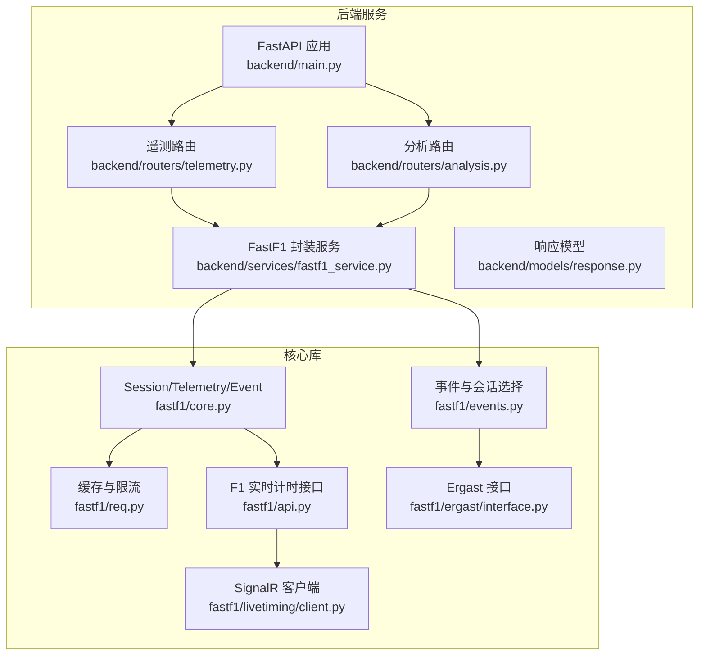
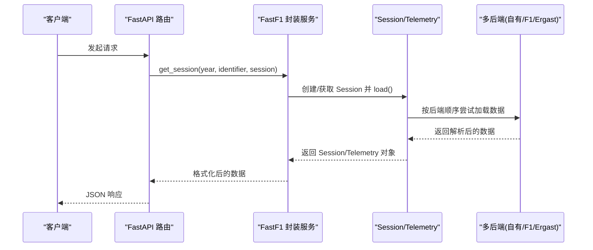
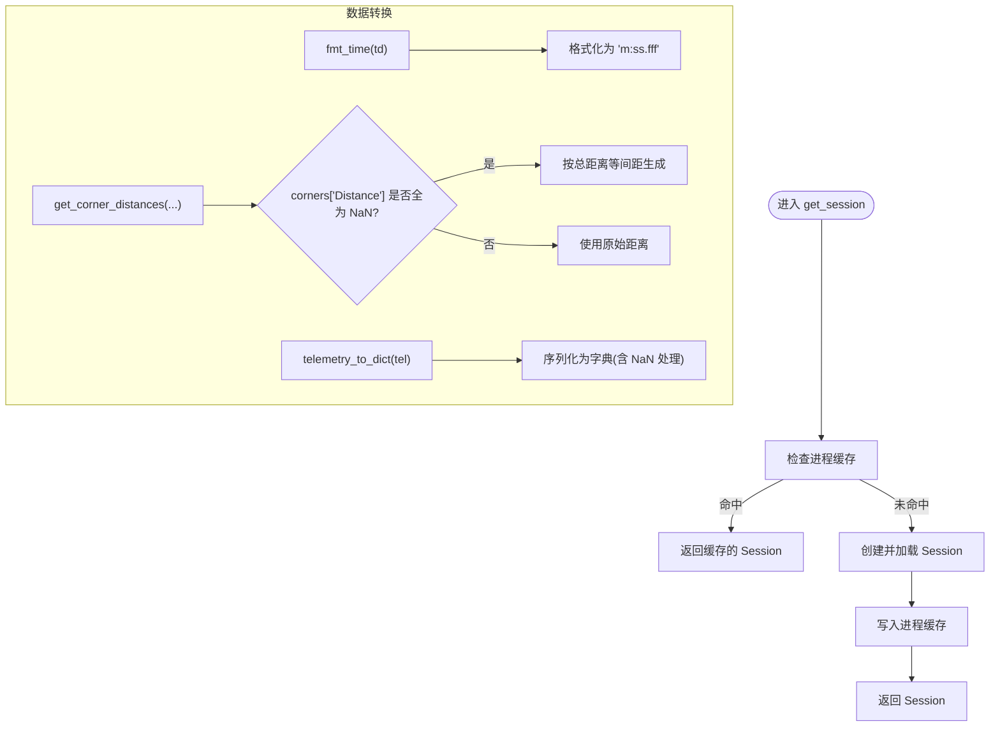
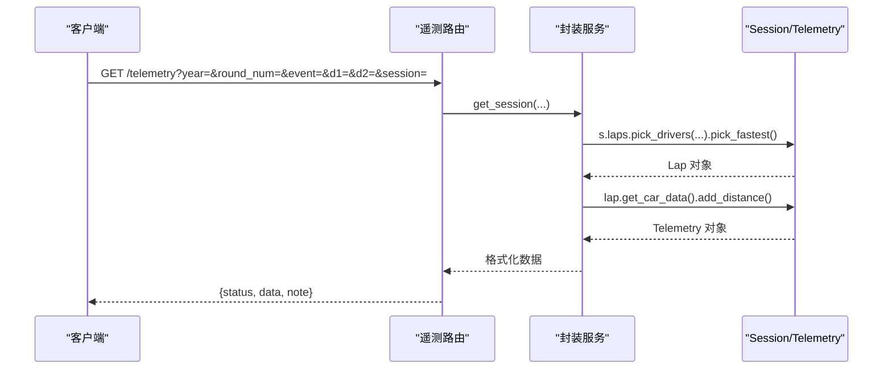
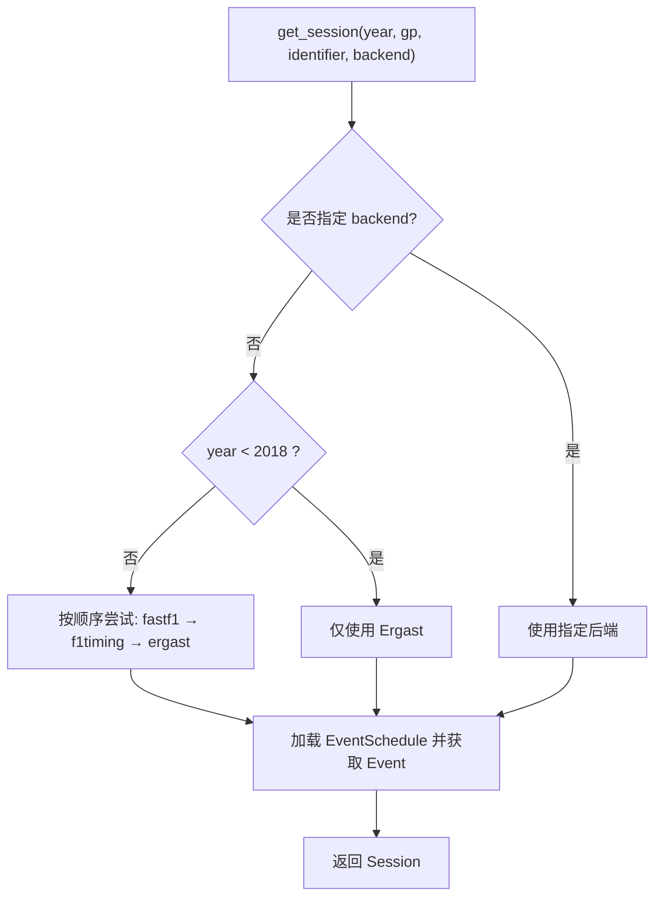
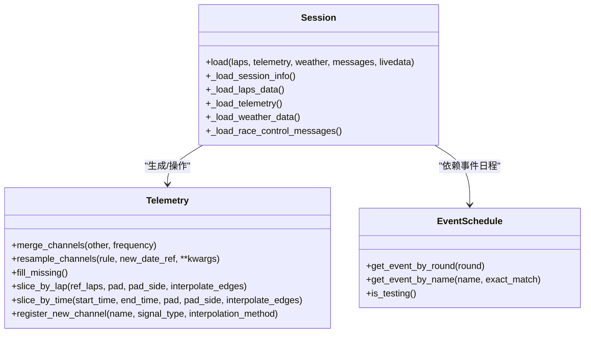
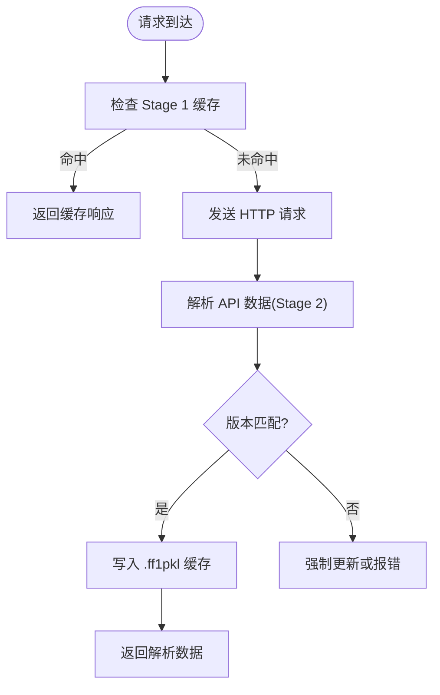
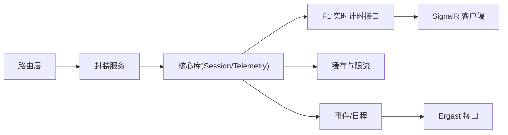

# FastF1 数据服务

<cite>
**本文档引用的文件**
- [fastf1/__init__.py](file://fastf1/__init__.py)
- [fastf1/api.py](file://fastf1/api.py)
- [fastf1/core.py](file://fastf1/core.py)
- [fastf1/events.py](file://fastf1/events.py)
- [fastf1/req.py](file://fastf1/req.py)
- [fastf1/exceptions.py](file://fastf1/exceptions.py)
- [fastf1/livetiming/client.py](file://fastf1/livetiming/client.py)
- [fastf1/ergast/interface.py](file://fastf1/ergast/interface.py)
- [backend/main.py](file://backend/main.py)
- [backend/services/fastf1_service.py](file://backend/services/fastf1_service.py)
- [backend/routers/telemetry.py](file://backend/routers/telemetry.py)
- [backend/routers/analysis.py](file://backend/routers/analysis.py)
- [backend/models/response.py](file://backend/models/response.py)
</cite>

## 目录
1. [简介](#简介)
2. [项目结构](#项目结构)
3. [核心组件](#核心组件)
4. [架构总览](#架构总览)
5. [详细组件分析](#详细组件分析)
6. [依赖关系分析](#依赖关系分析)
7. [性能考虑](#性能考虑)
8. [故障排除指南](#故障排除指南)
9. [结论](#结论)

## 简介
本文件面向 FastF1 数据服务的技术文档，系统性阐述服务的封装机制、多后端数据源（FastF1自有后端、F1 实时计时 API、Ergast）、数据转换流程、初始化与配置、错误处理策略，以及与核心库 Session、Telemetry、Event 对象的集成方式。同时覆盖缓存策略（本地缓存与远程数据源协调）、性能优化建议与故障排除方法，帮助开发者快速理解并高效使用该服务。

## 项目结构
后端采用 FastAPI 提供 REST 接口，核心数据访问通过封装的 FastF1 服务模块完成；前端路由按功能划分，分别处理遥测、分析、事件、车手、积分榜等接口；缓存目录用于存放分析结果与 FastF1 请求缓存。

**图表来源**
- [backend/main.py:1-157](file://backend/main.py#L1-L157)
- [backend/routers/telemetry.py:1-79](file://backend/routers/telemetry.py#L1-L79)
- [backend/routers/analysis.py:1-121](file://backend/routers/analysis.py#L1-L121)
- [backend/services/fastf1_service.py:1-64](file://backend/services/fastf1_service.py#L1-L64)
- [fastf1/core.py:1350-1549](file://fastf1/core.py#L1350-L1549)
- [fastf1/events.py:50-138](file://fastf1/events.py#L50-L138)
- [fastf1/req.py:132-686](file://fastf1/req.py#L132-L686)
- [fastf1/api.py:1-800](file://fastf1/_api.py#L1-L800)
- [fastf1/ergast/interface.py:1-800](file://fastf1/ergast/interface.py#L1-L800)
- [fastf1/livetiming/client.py:1-232](file://fastf1/livetiming/client.py#L1-L232)

**章节来源**
- [backend/main.py:1-157](file://backend/main.py#L1-L157)
- [backend/routers/telemetry.py:1-79](file://backend/routers/telemetry.py#L1-L79)
- [backend/routers/analysis.py:1-121](file://backend/routers/analysis.py#L1-L121)
- [backend/services/fastf1_service.py:1-64](file://backend/services/fastf1_service.py#L1-L64)

## 核心组件
- FastAPI 应用与路由
  - 应用启动时启用 CORS、挂载各路由模块，并初始化数据库。
  - 后台线程进行“预热”：加载历史缓存的 Session 至内存、预取事件与积分榜数据以提升首次访问性能。
- FastF1 封装服务
  - 统一入口：按年份、轮次/名称、会话类型获取 Session 并加载数据，进程内缓存避免重复加载。
  - 数据格式化：时间格式化、弯角距离与标签提取、遥测数据序列化等。
- 路由层
  - 遥测路由：获取两位车手最快圈遥测，计算差距与赛道信息，返回可序列化数据。
  - 分析路由：基于规则引擎构建指标，结合 LLM 生成报告，本地 JSON 缓存分析结果。
- 核心库集成
  - Session.load 控制加载范围（圈速、遥测、天气、消息），内部混合多源数据并做一致性修正。
  - Telemetry 提供多通道时间序列合并、重采样、缺失值插补等能力。
  - Event/EventSchedule 支持多后端（FastF1 自有、F1 实时计时、Ergast）回退策略。

**章节来源**
- [backend/main.py:117-136](file://backend/main.py#L117-L136)
- [backend/services/fastf1_service.py:14-64](file://backend/services/fastf1_service.py#L14-L64)
- [backend/routers/telemetry.py:11-79](file://backend/routers/telemetry.py#L11-L79)
- [backend/routers/analysis.py:35-121](file://backend/routers/analysis.py#L35-L121)
- [fastf1/core.py:1358-1444](file://fastf1/core.py#L1358-L1444)
- [fastf1/core.py:64-1149](file://fastf1/core.py#L64-L1149)
- [fastf1/events.py:50-138](file://fastf1/events.py#L50-L138)

## 架构总览
服务采用“路由 → 封装服务 → 核心库”的分层设计。封装服务负责：
- 会话获取与加载（统一入口）
- 数据转换与序列化
- 与核心库对象（Session、Telemetry、Event）的交互

**图表来源**
- [backend/routers/telemetry.py:11-79](file://backend/routers/telemetry.py#L11-L79)
- [backend/services/fastf1_service.py:14-21](file://backend/services/fastf1_service.py#L14-L21)
- [fastf1/core.py:1358-1444](file://fastf1/core.py#L1358-L1444)
- [fastf1/events.py:50-138](file://fastf1/events.py#L50-L138)

## 详细组件分析

### FastF1 封装服务（进程级缓存与数据转换）
- 进程级内存缓存：同一进程内对相同参数的 Session 只加载一次，避免重复网络请求与解析开销。
- 数据转换：
  - 时间格式化：将 timedelta 转换为“分:秒.毫秒”字符串。
  - 弯角距离：当电路信息中的弯角距离为空时，按总距离等间距回退。
  - 遥测序列化：将 DataFrame 中的关键列（距离、速度、油门、刹车、档位）转换为列表，NaN 填充为默认值，便于 JSON 序列化。

**图表来源**
- [backend/services/fastf1_service.py:14-21](file://backend/services/fastf1_service.py#L14-L21)
- [backend/services/fastf1_service.py:24-34](file://backend/services/fastf1_service.py#L24-L34)
- [backend/services/fastf1_service.py:37-45](file://backend/services/fastf1_service.py#L37-L45)
- [backend/services/fastf1_service.py:55-64](file://backend/services/fastf1_service.py#L55-L64)

**章节来源**
- [backend/services/fastf1_service.py:1-64](file://backend/services/fastf1_service.py#L1-L64)

### 路由层（遥测与分析）
- 遥测路由
  - 输入：年份、轮次或赛事名称、两位车手代码、会话类型。
  - 流程：获取 Session → 选取两位车手最快圈 → 计算距离列 → 获取弯角信息 → 计算差距与颜色 → 序列化返回。
  - 错误处理：捕获异常并返回错误状态。
- 分析路由
  - 输入：年份、轮次或赛事名称、两位车手代码、会话类型、强制刷新标志。
  - 流程：生成缓存键 → 读取本地 JSON 缓存（若未强制刷新）→ 未命中则计算指标与报告 → 写入本地缓存 → 返回结果。
  - 错误处理：捕获异常并返回错误状态。

**图表来源**
- [backend/routers/telemetry.py:11-79](file://backend/routers/telemetry.py#L11-L79)
- [backend/services/fastf1_service.py:14-21](file://backend/services/fastf1_service.py#L14-L21)
- [fastf1/core.py:1358-1444](file://fastf1/core.py#L1358-L1444)

**章节来源**
- [backend/routers/telemetry.py:1-79](file://backend/routers/telemetry.py#L1-L79)
- [backend/routers/analysis.py:1-121](file://backend/routers/analysis.py#L1-L121)

### 事件与会话选择（多后端支持）
- get_session 支持指定后端：'fastf1'、'f1timing'、'ergast'，默认优先使用自有后端并在不可用时回退。
- get_event_schedule 根据年份与后端顺序尝试加载，若失败抛出异常。
- EventSchedule 提供模糊匹配与严格匹配两种查询方式，支持测试赛事过滤。

**图表来源**
- [fastf1/events.py:50-138](file://fastf1/events.py#L50-L138)
- [fastf1/events.py:285-342](file://fastf1/events.py#L285-L342)
- [fastf1/events.py:780-800](file://fastf1/events.py#L780-L800)

**章节来源**
- [fastf1/events.py:50-138](file://fastf1/events.py#L50-L138)
- [fastf1/events.py:285-342](file://fastf1/events.py#L285-L342)

### 核心库集成（Session、Telemetry、Event）
- Session.load
  - 默认加载全部数据（laps、telemetry、weather、messages），内部混合多源数据并进行一致性修正。
  - 支持传入 LiveTimingData 作为本地数据源替代在线请求。
- Telemetry
  - 多通道时间序列合并、重采样、缺失值插补，支持按圈/时间切片。
  - 提供注册自定义通道与距离相关派生列的工具方法。
- Event/EventSchedule
  - 提供按轮次/名称查询、模糊匹配、测试赛事筛选等功能。

**图表来源**
- [fastf1/core.py:1358-1444](file://fastf1/core.py#L1358-L1444)
- [fastf1/core.py:64-1149](file://fastf1/core.py#L64-L1149)
- [fastf1/events.py:640-700](file://fastf1/events.py#L640-L700)

**章节来源**
- [fastf1/core.py:1358-1444](file://fastf1/core.py#L1358-L1444)
- [fastf1/core.py:64-1149](file://fastf1/core.py#L64-L1149)
- [fastf1/events.py:640-700](file://fastf1/events.py#L640-L700)

### 缓存策略（本地缓存与远程数据源协调）
- FastF1 请求缓存（Stage 1）
  - 使用 requests-cache 存储原始 HTTP 请求，SQLite 后端，带过期控制与错误缓存回退。
  - 支持最小间隔限制与每小时调用上限限制，避免超出第三方 API 速率限制。
- FastF1 解析缓存（Stage 2）
  - 将解析后的 API 数据以 pickle 文件形式缓存，按 API 路径与函数名组织目录结构。
  - 支持版本校验、强制更新、CI 模式禁用解析缓存等特性。
- 后端本地分析缓存
  - 分析路由使用 MD5 缓存键存储 JSON 结果，支持强制刷新。

**图表来源**
- [fastf1/req.py:216-257](file://fastf1/req.py#L216-L257)
- [fastf1/req.py:396-469](file://fastf1/req.py#L396-L469)
- [backend/routers/analysis.py:16-33](file://backend/routers/analysis.py#L16-L33)

**章节来源**
- [fastf1/req.py:132-686](file://fastf1/req.py#L132-L686)
- [backend/routers/analysis.py:16-33](file://backend/routers/analysis.py#L16-L33)

### 初始化过程与配置参数
- 应用启动
  - 初始化数据库、启用 CORS、挂载路由。
  - 启动后台线程进行“预热”：加载历史缓存的 Session 至内存、预取事件与积分榜数据。
- 缓存配置
  - 后端通过 FastAPI 应用启动时设置本地缓存目录并启用 FastF1 缓存。
  - 可通过环境变量或显式调用配置缓存目录、忽略版本、强制更新等。

**章节来源**
- [backend/main.py:117-136](file://backend/main.py#L117-L136)
- [backend/main.py:14-16](file://backend/main.py#L14-L16)
- [fastf1/req.py:216-257](file://fastf1/req.py#L216-L257)

### 错误处理机制
- 路由层
  - 所有路由均使用 try/except 捕获异常并返回标准化错误响应。
- 核心库
  - 使用软异常装饰器在数据加载过程中捕获异常并发出警告，尽量返回可用数据。
  - 速率限制超过硬阈值时抛出不可恢复异常，终止流程。
- 第三方 API
  - Ergast 解析错误、无效请求错误等均有明确异常类型，便于区分处理。

**章节来源**
- [backend/routers/telemetry.py:77-79](file://backend/routers/telemetry.py#L77-L79)
- [backend/routers/analysis.py:119-121](file://backend/routers/analysis.py#L119-L121)
- [fastf1/core.py:1446-1448](file://fastf1/core.py#L1446-L1448)
- [fastf1/exceptions.py:74-86](file://fastf1/exceptions.py#L74-L86)
- [fastf1/ergast/interface.py:514-531](file://fastf1/ergast/interface.py#L514-L531)

## 依赖关系分析
- 组件耦合
  - 路由层仅依赖封装服务，封装服务再依赖核心库与 FastF1 后端，保持清晰的单向依赖。
- 外部依赖
  - requests-cache、SignalR 客户端、Ergast API、F1 实时计时 API。
- 潜在循环依赖
  - 当前结构无明显循环依赖；路由 → 服务 → 核心库 → 后端的调用链为单向。

**图表来源**
- [backend/routers/telemetry.py:1-79](file://backend/routers/telemetry.py#L1-L79)
- [backend/routers/analysis.py:1-121](file://backend/routers/analysis.py#L1-L121)
- [backend/services/fastf1_service.py:1-64](file://backend/services/fastf1_service.py#L1-L64)
- [fastf1/core.py:1358-1444](file://fastf1/core.py#L1358-L1444)
- [fastf1/api.py:1-800](file://fastf1/_api.py#L1-L800)
- [fastf1/req.py:132-686](file://fastf1/req.py#L132-L686)
- [fastf1/events.py:50-138](file://fastf1/events.py#L50-L138)
- [fastf1/ergast/interface.py:1-800](file://fastf1/ergast/interface.py#L1-L800)
- [fastf1/livetiming/client.py:1-232](file://fastf1/livetiming/client.py#L1-L232)

**章节来源**
- [backend/routers/telemetry.py:1-79](file://backend/routers/telemetry.py#L1-L79)
- [backend/routers/analysis.py:1-121](file://backend/routers/analysis.py#L1-L121)
- [backend/services/fastf1_service.py:1-64](file://backend/services/fastf1_service.py#L1-L64)
- [fastf1/core.py:1358-1444](file://fastf1/core.py#L1358-L1444)

## 性能考虑
- 进程级 Session 缓存：避免重复加载，显著降低延迟与带宽消耗。
- FastF1 缓存（Stage 1/2）：减少对外部 API 的重复请求，提高整体吞吐量。
- 合理的重采样与插值：Telemetry 合并时默认使用“原采样频率”，避免不必要的重采样导致精度损失。
- 预热策略：启动时加载历史缓存的 Session 与常用 API，缩短首次请求响应时间。
- 速率限制：内置最小间隔与每小时调用上限，避免触发硬限制导致失败。

[本节为通用指导，无需特定文件引用]

## 故障排除指南
- 无法加载会话数据
  - 检查后端可用性与回退逻辑；确认年份与会话类型正确。
  - 查看软异常日志，定位具体加载阶段的问题。
- 速率限制错误
  - 观察速率限制装饰器输出；优化调用频率或增加最小间隔。
  - 如确需突破限制，评估风险并优化代码以减少请求数。
- Ergast 解析错误
  - 检查返回状态码与 JSON 解析；必要时清理缓存后重试。
- 缓存问题
  - 清理 Stage 1/2 缓存或强制更新；确认缓存目录权限与磁盘空间。
- 遥测数据截断
  - 检查数据质量提示，确认是否因 F1 API 数据包丢失导致。

**章节来源**
- [fastf1/core.py:1446-1448](file://fastf1/core.py#L1446-L1448)
- [fastf1/req.py:46-81](file://fastf1/req.py#L46-L81)
- [fastf1/ergast/interface.py:514-531](file://fastf1/ergast/interface.py#L514-L531)
- [backend/routers/telemetry.py:36-44](file://backend/routers/telemetry.py#L36-L44)

## 结论
本服务通过“路由 → 封装服务 → 核心库”的分层设计，实现了对 FastF1 多后端数据源的统一接入与高效缓存。封装服务提供进程级 Session 缓存与数据转换工具，路由层聚焦业务场景（遥测与分析），核心库负责数据加载与对象管理。配合 FastF1 内置缓存与限流机制，可在保证稳定性的同时获得良好的性能表现。建议在生产环境中启用缓存、合理规划调用频率，并利用预热策略提升首屏体验。