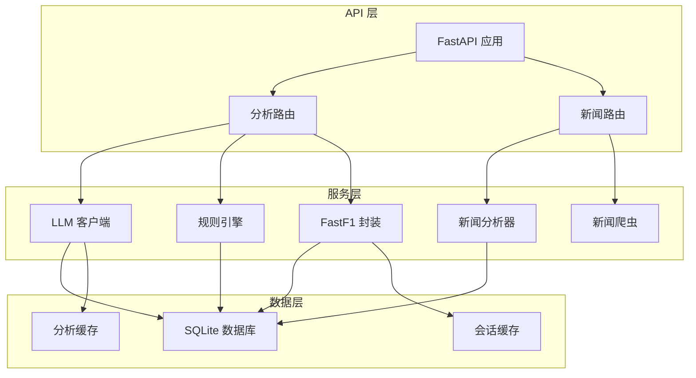
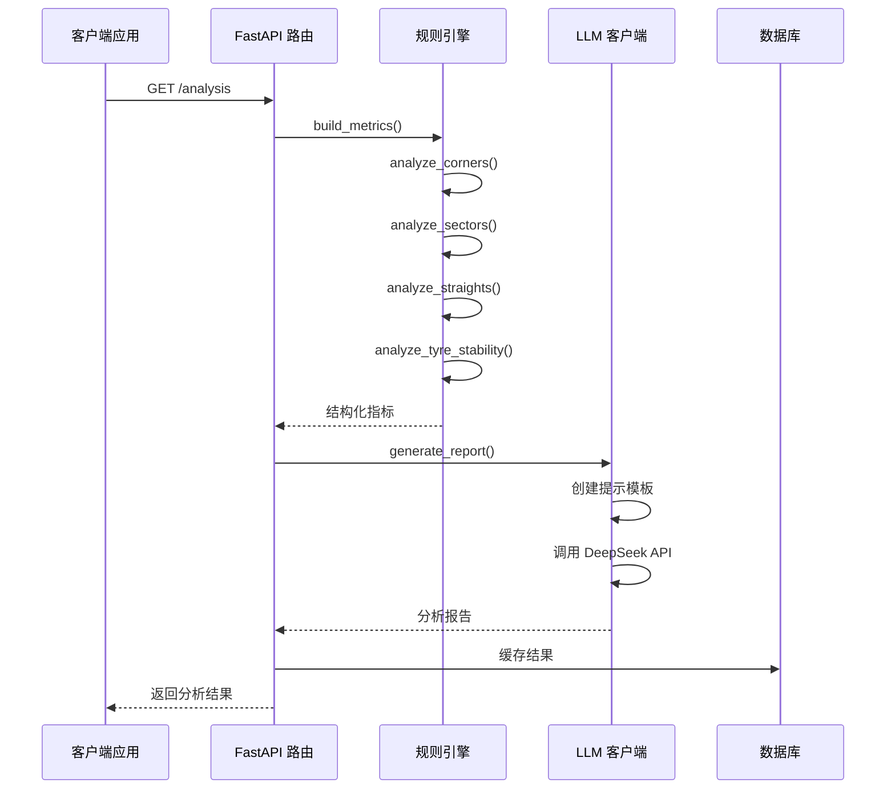
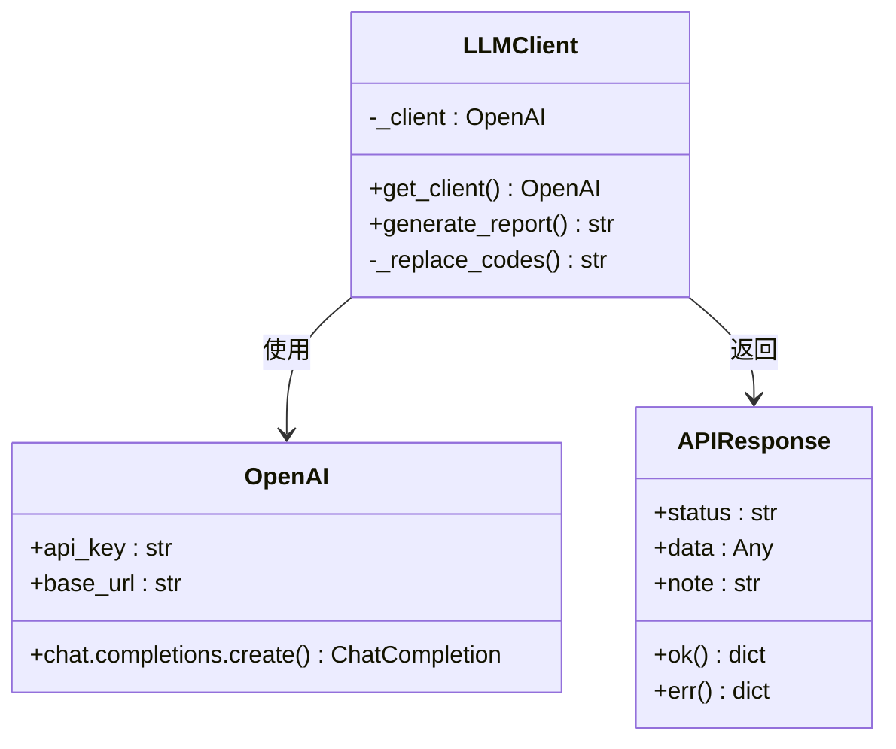
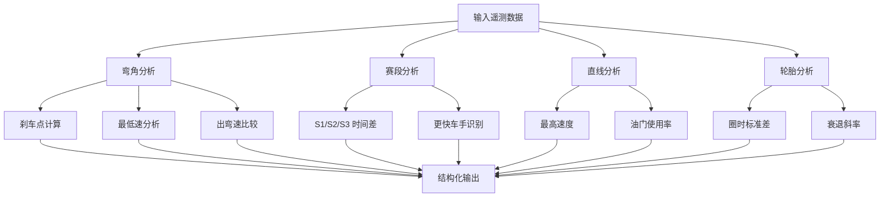
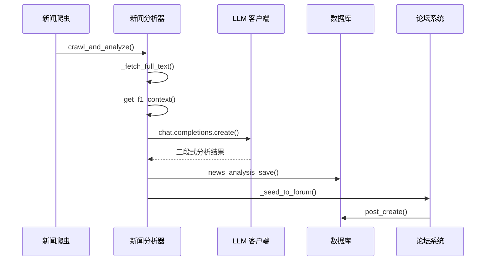
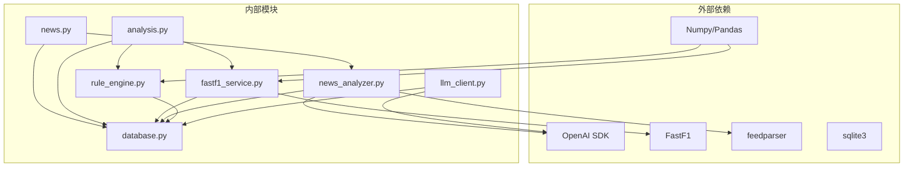

# LLM 客户端服务

<cite>
**本文档引用的文件**
- [llm_client.py](file://backend/services/llm_client.py)
- [rule_engine.py](file://backend/services/rule_engine.py)
- [news_analyzer.py](file://backend/services/news_analyzer.py)
- [analysis.py](file://backend/routers/analysis.py)
- [news.py](file://backend/routers/news.py)
- [fastf1_service.py](file://backend/services/fastf1_service.py)
- [database.py](file://backend/db/database.py)
- [response.py](file://backend/models/response.py)
- [main.py](file://backend/main.py)
- [news_crawler.py](file://backend/services/news_crawler.py)
- [llm_api.md](file://memory/llm_api.md)
</cite>

## 目录
1. [简介](#简介)
2. [项目结构](#项目结构)
3. [核心组件](#核心组件)
4. [架构概览](#架构概览)
5. [详细组件分析](#详细组件分析)
6. [依赖关系分析](#依赖关系分析)
7. [性能考虑](#性能考虑)
8. [故障排除指南](#故障排除指南)
9. [结论](#结论)

## 简介

LLM 客户端服务是 Fast-F1 项目中的核心 AI 分析模块，负责将 F1 赛车运动的专业数据转换为易于理解的中文分析报告。该服务集成了深度学习模型（DeepSeek）来处理结构化数据，为用户提供专业的赛车数据分析和新闻解读功能。

该系统主要包含两大功能模块：
- **赛车数据分析**：基于遥测数据生成车手对比分析报告
- **新闻 AI 分析**：对 F1 相关新闻进行智能解读和分类

## 项目结构

Fast-F1 项目采用典型的三层架构设计，LLM 客户端服务位于后端服务层，与数据获取层和 API 层紧密集成。

**图表来源**
- [main.py:18-41](file://backend/main.py#L18-L41)
- [analysis.py:10-10](file://backend/routers/analysis.py#L10-L10)
- [news.py:20-20](file://backend/routers/news.py#L20-L20)

**章节来源**
- [main.py:1-157](file://backend/main.py#L1-L157)
- [analysis.py:1-121](file://backend/routers/analysis.py#L1-L121)
- [news.py:1-190](file://backend/routers/news.py#L1-L190)

## 核心组件

### LLM 客户端服务

LLM 客户端是整个系统的核心，负责与外部 LLM API 进行交互，处理请求格式和响应解析。

**主要特性：**
- 支持 DeepSeek API（兼容 OpenAI SDK）
- 单例模式管理客户端连接
- 自定义提示模板（Prompt Template）
- 参数化报告生成

**章节来源**
- [llm_client.py:1-136](file://backend/services/llm_client.py#L1-L136)

### 规则引擎

规则引擎负责从原始遥测数据中提取结构化指标，为 LLM 提供高质量的输入数据。

**核心功能：**
- 弯角分析（刹车点、最低速、出弯速）
- 赛段时间差分析（S1/S2/S3）
- 直线效率分析（最高速、油门使用率）
- 轮胎稳定性分析（标准差、衰退斜率）

**章节来源**
- [rule_engine.py:1-146](file://backend/services/rule_engine.py#L1-L146)

### 新闻分析器

新闻分析器专门处理 F1 相关新闻的 AI 分析，提供三段式解读。

**分析流程：**
1. 新闻内容抓取和清理
2. 积分榜上下文注入
3. AI 模型分析生成
4. 结果存储和种子帖创建

**章节来源**
- [news_analyzer.py:1-298](file://backend/services/news_analyzer.py#L1-L298)

## 架构概览

系统采用微服务架构，各个组件通过清晰的接口进行通信。

**图表来源**
- [analysis.py:35-120](file://backend/routers/analysis.py#L35-L120)
- [llm_client.py:77-135](file://backend/services/llm_client.py#L77-L135)
- [rule_engine.py:136-145](file://backend/services/rule_engine.py#L136-L145)

## 详细组件分析

### LLM 客户端组件分析

LLM 客户端实现了完整的 API 封装，提供了统一的接口来调用外部 LLM 服务。

**图表来源**
- [llm_client.py:13-20](file://backend/services/llm_client.py#L13-L20)
- [llm_client.py:77-135](file://backend/services/llm_client.py#L77-L135)
- [response.py:4-14](file://backend/models/response.py#L4-L14)

**章节来源**
- [llm_client.py:1-136](file://backend/services/llm_client.py#L1-L136)
- [response.py:1-14](file://backend/models/response.py#L1-L14)

### 规则引擎组件分析

规则引擎采用模块化设计，每个分析函数专注于特定的数据维度。

**图表来源**
- [rule_engine.py:10-61](file://backend/services/rule_engine.py#L10-L61)
- [rule_engine.py:64-85](file://backend/services/rule_engine.py#L64-L85)
- [rule_engine.py:88-108](file://backend/services/rule_engine.py#L88-L108)
- [rule_engine.py:111-133](file://backend/services/rule_engine.py#L111-L133)

**章节来源**
- [rule_engine.py:1-146](file://backend/services/rule_engine.py#L1-L146)

### 新闻分析器组件分析

新闻分析器实现了完整的 AI 分析流水线，从数据获取到结果输出。

**图表来源**
- [news_crawler.py:132-147](file://backend/services/news_crawler.py#L132-L147)
- [news_analyzer.py:220-256](file://backend/services/news_analyzer.py#L220-L256)
- [news_analyzer.py:259-284](file://backend/services/news_analyzer.py#L259-L284)

**章节来源**
- [news_analyzer.py:1-298](file://backend/services/news_analyzer.py#L1-L298)
- [news_crawler.py:1-148](file://backend/services/news_crawler.py#L1-L148)

## 依赖关系分析

系统采用松耦合设计，通过清晰的接口定义组件间的依赖关系。

**图表来源**
- [llm_client.py:6-6](file://backend/services/llm_client.py#L6-L6)
- [news_analyzer.py:11-11](file://backend/services/news_analyzer.py#L11-L11)
- [fastf1_service.py:5-5](file://backend/services/fastf1_service.py#L5-L5)
- [rule_engine.py:5-7](file://backend/services/rule_engine.py#L5-L7)

**章节来源**
- [llm_client.py:1-136](file://backend/services/llm_client.py#L1-L136)
- [rule_engine.py:1-146](file://backend/services/rule_engine.py#L1-L146)
- [news_analyzer.py:1-298](file://backend/services/news_analyzer.py#L1-L298)

## 性能考虑

### 缓存策略

系统实现了多层次的缓存机制来优化性能：

1. **会话缓存**：进程级内存缓存，避免重复加载相同会话数据
2. **分析缓存**：磁盘缓存分析结果，支持强制刷新
3. **RAG 缓存**：积分榜上下文缓存，30分钟 TTL
4. **车队标签缓存**：10分钟 TTL 的内存缓存

### 性能优化建议

1. **并发处理**：使用线程池处理多个 AI 分析请求
2. **批量处理**：定时任务批量处理新闻分析
3. **连接复用**：LLM 客户端采用单例模式
4. **数据预热**：启动时预加载常用数据

**章节来源**
- [analysis.py:16-33](file://backend/routers/analysis.py#L16-L33)
- [news_analyzer.py:21-22](file://backend/services/news_analyzer.py#L21-L22)
- [news.py:24-35](file://backend/routers/news.py#L24-L35)

## 故障排除指南

### 常见问题及解决方案

1. **LLM API 连接失败**
   - 检查 DEEPSEEK_API_KEY 环境变量
   - 验证网络连接和防火墙设置
   - 确认 API 密钥有效性

2. **FastF1 数据获取失败**
   - 检查本地缓存目录权限
   - 验证网络连接
   - 确认赛事数据可用性

3. **数据库连接问题**
   - 检查 SQLite 文件权限
   - 验证数据库文件完整性
   - 确认数据库版本兼容性

4. **新闻分析失败**
   - 检查 trafilatura 依赖安装
   - 验证 RSS 源可访问性
   - 查看日志获取详细错误信息

### 错误处理机制

系统实现了完善的错误处理和日志记录机制：

- **HTTP 异常处理**：403 权限错误、404 资源不存在
- **数据库异常处理**：连接失败、事务回滚
- **网络异常处理**：超时重试、降级策略
- **AI 分析异常处理**：降级为简单文本输出

**章节来源**
- [news.py:62-64](file://backend/routers/news.py#L62-L64)
- [news_analyzer.py:14-18](file://backend/services/news_analyzer.py#L14-L18)
- [database.py:13-19](file://backend/db/database.py#L13-L19)

## 结论

LLM 客户端服务为 Fast-F1 项目提供了强大的 AI 分析能力，通过精心设计的架构和优化策略，实现了高性能、高可靠性的数据分析服务。

**主要优势：**
- 模块化设计，职责清晰
- 多层次缓存优化性能
- 完善的错误处理机制
- 支持多种 LLM 服务提供商
- 面向 2026 赛季的专用优化

**未来发展方向：**
- 支持更多 LLM 模型
- 增强实时数据分析能力
- 优化成本控制策略
- 扩展分析维度和深度

该系统为 F1 赛车爱好者和专业人士提供了专业的数据分析工具，通过 AI 技术降低了专业分析的门槛，提升了用户体验。