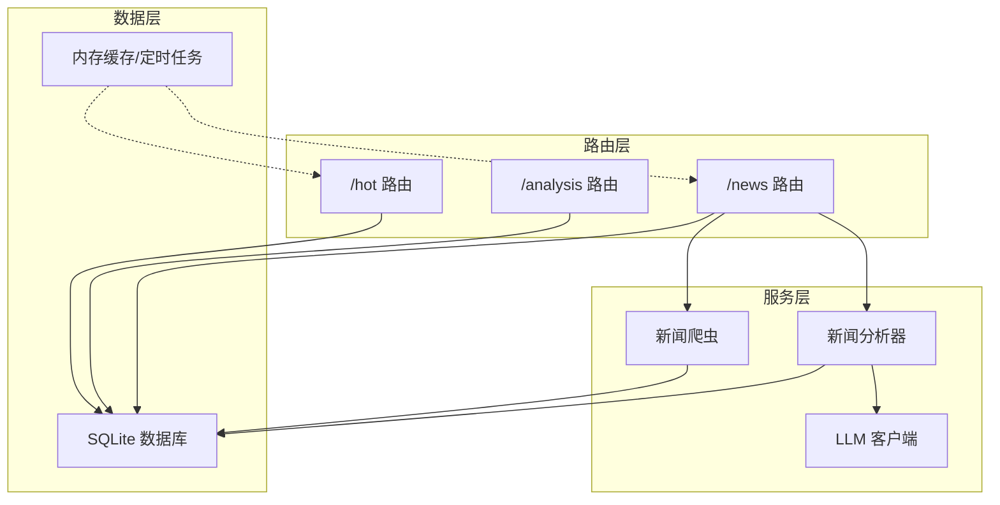
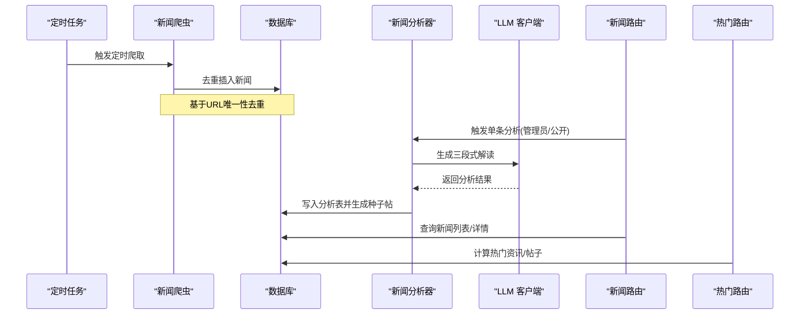
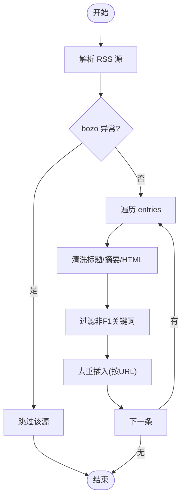
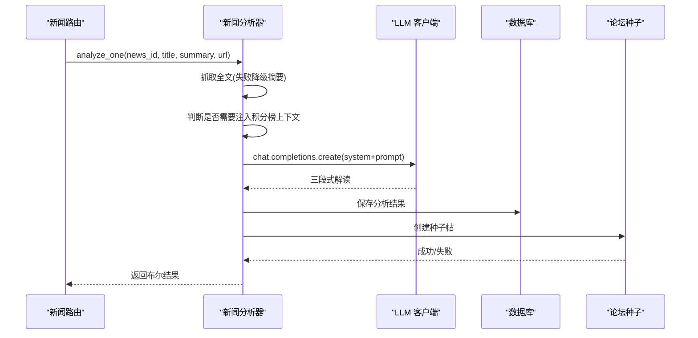
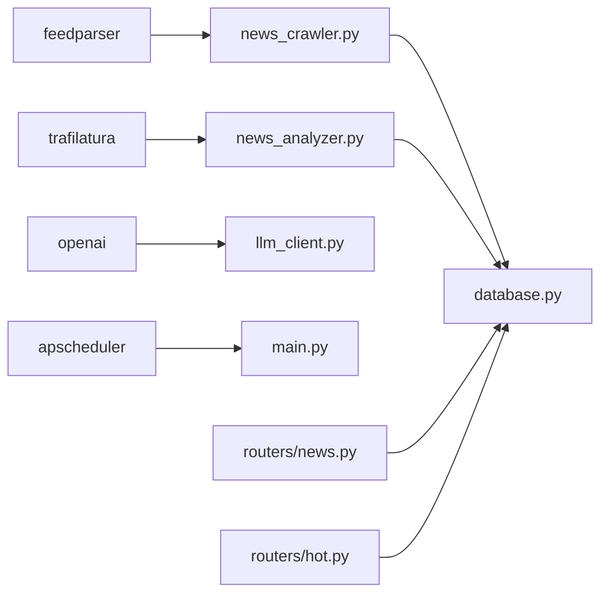

# 新闻服务组件

<cite>
**本文档引用的文件**
- [backend/main.py](file://backend/main.py)
- [backend/routers/news.py](file://backend/routers/news.py)
- [backend/routers/hot.py](file://backend/routers/hot.py)
- [backend/routers/analysis.py](file://backend/routers/analysis.py)
- [backend/services/news_crawler.py](file://backend/services/news_crawler.py)
- [backend/services/news_analyzer.py](file://backend/services/news_analyzer.py)
- [backend/services/llm_client.py](file://backend/services/llm_client.py)
- [backend/db/database.py](file://backend/db/database.py)
- [backend/models/response.py](file://backend/models/response.py)
- [backend/requirements.txt](file://backend/requirements.txt)
</cite>

## 目录
1. [简介](#简介)
2. [项目结构](#项目结构)
3. [核心组件](#核心组件)
4. [架构总览](#架构总览)
5. [详细组件分析](#详细组件分析)
6. [依赖关系分析](#依赖关系分析)
7. [性能考量](#性能考量)
8. [故障排查指南](#故障排查指南)
9. [结论](#结论)
10. [附录](#附录)

## 简介
本文件面向新闻服务组件，系统性阐述新闻爬取系统、数据提取与去重机制、新闻分析模块（情感分析、关键词提取、内容分类）、推荐与热度计算模型、与新闻路由的集成方式及数据流转过程，并提供爬虫配置指南、反爬虫应对策略与数据质量保证措施，以及内容管理最佳实践与性能优化建议。目标读者既包括开发者，也包括运维与产品人员。

## 项目结构
新闻服务组件位于后端目录，采用“路由-服务-数据库”三层架构：
- 路由层：提供 REST API，负责请求接入与响应封装
- 服务层：实现爬虫、AI 分析、LLM 客户端、热点计算等业务逻辑
- 数据层：SQLite 存储，包含资讯、分析结果、分区、帖子、评论等表

图表来源
- [backend/routers/news.py:1-190](file://backend/routers/news.py#L1-L190)
- [backend/routers/hot.py:1-84](file://backend/routers/hot.py#L1-L84)
- [backend/routers/analysis.py:1-121](file://backend/routers/analysis.py#L1-L121)
- [backend/services/news_crawler.py:1-148](file://backend/services/news_crawler.py#L1-L148)
- [backend/services/news_analyzer.py:1-298](file://backend/services/news_analyzer.py#L1-L298)
- [backend/services/llm_client.py:1-136](file://backend/services/llm_client.py#L1-L136)
- [backend/db/database.py:1-800](file://backend/db/database.py#L1-L800)

章节来源
- [backend/main.py:1-157](file://backend/main.py#L1-L157)
- [backend/requirements.txt:1-15](file://backend/requirements.txt#L1-L15)

## 核心组件
- 新闻爬虫：基于 RSS 的多源采集，内置内容筛选与去重，支持定时任务与手动触发
- 新闻分析器：基于 LLM 的三段式解读（技术要点/通俗解释/赛况影响），并自动生成论坛种子帖
- 热度计算：基于帖子的评论数/浏览数与发布时间的衰减函数，支持资讯的“有分析优先”排序
- 路由与集成：提供列表、详情、分析触发、爬取触发、热门推荐等接口，与数据库与缓存协同

章节来源
- [backend/services/news_crawler.py:1-148](file://backend/services/news_crawler.py#L1-L148)
- [backend/services/news_analyzer.py:1-298](file://backend/services/news_analyzer.py#L1-L298)
- [backend/routers/news.py:1-190](file://backend/routers/news.py#L1-L190)
- [backend/routers/hot.py:1-84](file://backend/routers/hot.py#L1-L84)
- [backend/db/database.py:221-324](file://backend/db/database.py#L221-L324)

## 架构总览
新闻服务整体流程：
- 爬虫定时任务从多个 RSS 源抓取，解析并去重入库
- 用户或管理员触发 AI 分析，LLM 输出三段式解读并写入分析表
- 路由层提供列表、详情、热门推荐接口，内部使用内存缓存与数据库查询
- 分析器可选择性注入积分榜上下文，提高分析准确性

图表来源
- [backend/main.py:44-53](file://backend/main.py#L44-L53)
- [backend/services/news_crawler.py:119-147](file://backend/services/news_crawler.py#L119-L147)
- [backend/services/news_analyzer.py:220-256](file://backend/services/news_analyzer.py#L220-L256)
- [backend/routers/news.py:127-189](file://backend/routers/news.py#L127-L189)
- [backend/routers/hot.py:32-83](file://backend/routers/hot.py#L32-L83)

## 详细组件分析

### 新闻爬取系统
- 数据源：支持 The Race、Motorsport.com、Crash.net、F1i.com 四个 RSS 源
- 内容筛选：过滤非 F1 关键词（如 Formula E、IndyCar、MotoGP 等），避免无关内容污染
- 文本清洗：去除 HTML 标签、清理 RSS 常见截断词，摘要长度限制
- 去重机制：以 URL 为主键唯一性约束，避免重复入库
- 时间戳：使用 RSS 的发布/更新时间转换为 Unix 时间
- 错误处理：对单条解析失败与源解析异常进行日志记录与跳过

图表来源
- [backend/services/news_crawler.py:90-116](file://backend/services/news_crawler.py#L90-L116)
- [backend/services/news_crawler.py:39-87](file://backend/services/news_crawler.py#L39-L87)
- [backend/db/database.py:221-231](file://backend/db/database.py#L221-L231)

章节来源
- [backend/services/news_crawler.py:1-148](file://backend/services/news_crawler.py#L1-L148)
- [backend/db/database.py:221-231](file://backend/db/database.py#L221-L231)

### 数据提取与去重机制
- 去重依据：URL 唯一性约束，避免重复新闻入库
- 提取字段：标题、摘要、链接、来源、发布时间
- 摘要处理：优先 summary，其次 content，去除 HTML 与截断词，限制长度
- 时间处理：将 struct_time 转换为 Unix 时间

章节来源
- [backend/services/news_crawler.py:39-87](file://backend/services/news_crawler.py#L39-L87)
- [backend/db/database.py:221-231](file://backend/db/database.py#L221-L231)

### 新闻分析模块
- 输入：新闻标题 + 摘要（可选原文全文）
- 输出：三段式解读（技术要点/通俗解释/赛况影响），并生成论坛种子帖
- 上下文注入：仅在涉及积分/排名/冠军争夺时注入 2026 赛季积分榜，30 分钟 TTL 缓存
- LLM 调用：DeepSeek API，系统提示限定时间与领域，避免跨赛季错误
- 分类与种子帖：根据标题关键词映射到分区，生成 AI 资讯种子帖

图表来源
- [backend/services/news_analyzer.py:220-256](file://backend/services/news_analyzer.py#L220-L256)
- [backend/services/news_analyzer.py:259-284](file://backend/services/news_analyzer.py#L259-L284)
- [backend/services/llm_client.py:77-135](file://backend/services/llm_client.py#L77-L135)
- [backend/db/database.py:314-324](file://backend/db/database.py#L314-L324)

章节来源
- [backend/services/news_analyzer.py:1-298](file://backend/services/news_analyzer.py#L1-L298)
- [backend/services/llm_client.py:1-136](file://backend/services/llm_client.py#L1-L136)
- [backend/db/database.py:314-324](file://backend/db/database.py#L314-L324)

### 内容分类与关键词映射
- 分类维度：赛事（24 场分站）+ 车队（11 支）+ 综合讨论
- 映射策略：标题关键词命中即归类，未命中归类为 general
- 分类结果用于生成论坛种子帖的分区选择

章节来源
- [backend/services/news_analyzer.py:127-163](file://backend/services/news_analyzer.py#L127-L163)
- [backend/services/news_analyzer.py:259-284](file://backend/services/news_analyzer.py#L259-L284)

### 热度计算与推荐算法
- 帖子热度：(评论数×0.5 + 浏览数×0.3) / (小时衰减系数 + 1)，内存缓存 10 分钟
- 资讯热度：有 AI 解读的优先，再按发布时间倒序，内存缓存 10 分钟
- 管理员入口：支持手动触发爬取与分析，便于运营干预

章节来源
- [backend/routers/hot.py:1-84](file://backend/routers/hot.py#L1-L84)
- [backend/db/database.py:536-566](file://backend/db/database.py#L536-L566)
- [backend/routers/news.py:159-189](file://backend/routers/news.py#L159-L189)

### 与新闻路由的集成与数据流转
- 列表/详情：查询新闻与分析结果，标记是否已分析
- 车队标签：从标题与摘要匹配车队关键词，内存缓存 10 分钟
- 关联帖子：查询某条新闻关联的论坛帖子
- 分析触发：公开触发与管理员触发两种路径，支持强制重分析

章节来源
- [backend/routers/news.py:1-190](file://backend/routers/news.py#L1-L190)
- [backend/db/database.py:289-324](file://backend/db/database.py#L289-L324)

## 依赖关系分析
- 外部依赖：feedparser（RSS）、trafilatura（网页正文抽取）、openai（LLM）、apscheduler（定时任务）
- 内部耦合：路由依赖服务层；服务层依赖数据库与 LLM 客户端；定时任务调度爬取与缓存预热

图表来源
- [backend/requirements.txt:1-15](file://backend/requirements.txt#L1-L15)
- [backend/main.py:117-136](file://backend/main.py#L117-L136)
- [backend/services/news_crawler.py:1-148](file://backend/services/news_crawler.py#L1-L148)
- [backend/services/news_analyzer.py:1-298](file://backend/services/news_analyzer.py#L1-L298)
- [backend/services/llm_client.py:1-136](file://backend/services/llm_client.py#L1-L136)
- [backend/db/database.py:1-800](file://backend/db/database.py#L1-L800)
- [backend/routers/news.py:1-190](file://backend/routers/news.py#L1-L190)
- [backend/routers/hot.py:1-84](file://backend/routers/hot.py#L1-L84)

章节来源
- [backend/requirements.txt:1-15](file://backend/requirements.txt#L1-L15)
- [backend/main.py:1-157](file://backend/main.py#L1-L157)

## 性能考量
- 爬取频率：定时任务每小时执行一次，避免频繁访问外部源
- 缓存策略：内存缓存热门数据（帖子/资讯/车队标签），TTL 10 分钟
- 数据库：WAL 模式提升并发写入稳定性；索引覆盖常用查询字段
- LLM 调用：控制 token 数与温度参数，必要时注入有限上下文，避免过度消耗
- 前端交互：公开分析触发采用异步线程，避免阻塞请求

章节来源
- [backend/main.py:44-53](file://backend/main.py#L44-L53)
- [backend/routers/hot.py:15-30](file://backend/routers/hot.py#L15-L30)
- [backend/routers/news.py:24-34](file://backend/routers/news.py#L24-L34)
- [backend/db/database.py:17-18](file://backend/db/database.py#L17-L18)
- [backend/db/database.py:94-98](file://backend/db/database.py#L94-L98)
- [backend/services/news_analyzer.py:21-22](file://backend/services/news_analyzer.py#L21-L22)
- [backend/services/news_analyzer.py:236-244](file://backend/services/news_analyzer.py#L236-L244)

## 故障排查指南
- 爬取失败
  - 现象：RSS 源解析异常或无 entries
  - 排查：检查 RSS URL 可达性、feedparser bozo 异常日志
  - 处理：关注日志警告，必要时切换备用源或调整解析策略
- 分析失败
  - 现象：LLM 调用异常或解析三段式失败
  - 排查：查看 LLM 客户端日志、网络连通性、API 密钥配置
  - 处理：降级使用摘要文本；检查系统提示与温度参数
- 去重异常
  - 现象：重复新闻入库
  - 排查：确认 URL 唯一性约束是否生效、URL 是否规范化
  - 处理：在入库前统一 URL 格式，避免同源不同链接导致的重复
- 热度计算异常
  - 现象：热门数据不更新或计算偏差
  - 排查：检查内存缓存 TTL、数据库字段值（评论数/浏览数/创建时间）
  - 处理：缩短 TTL 或强制刷新缓存键

章节来源
- [backend/services/news_crawler.py:96-115](file://backend/services/news_crawler.py#L96-L115)
- [backend/services/news_analyzer.py:254-256](file://backend/services/news_analyzer.py#L254-L256)
- [backend/db/database.py:221-231](file://backend/db/database.py#L221-L231)
- [backend/routers/hot.py:20-29](file://backend/routers/hot.py#L20-L29)

## 结论
新闻服务组件通过 RSS 爬取、智能去重、LLM 三段式分析与热度推荐，构建了完整的 F1 资讯生态闭环。系统具备良好的扩展性与可维护性：路由层清晰、服务层职责单一、数据库结构完整、缓存与定时任务协同保障性能。建议持续监控外部源可用性与 LLM 质量，逐步引入更细粒度的反爬虫与数据质量治理策略。

## 附录

### 爬虫配置指南
- 数据源配置：在爬虫模块中维护 RSS 源列表，包含名称、URL 与 slug
- 内容筛选：通过关键词白名单/黑名单过滤非 F1 内容
- 去重策略：以 URL 为唯一键，入库前进行规范化处理
- 定时任务：每小时执行一次，可在启动时注册 APScheduler

章节来源
- [backend/services/news_crawler.py:15-36](file://backend/services/news_crawler.py#L15-L36)
- [backend/services/news_crawler.py:119-129](file://backend/services/news_crawler.py#L119-L129)
- [backend/main.py:127-136](file://backend/main.py#L127-L136)

### 反爬虫应对策略
- 请求频率控制：合理设置定时任务间隔，避免过于频繁访问
- 失败降级：RSS 解析异常时记录日志并跳过，保证系统稳定
- 文本清洗：去除 HTML 与截断词，减少噪声干扰
- 备用源：多源并行，任一源失败不影响整体采集

章节来源
- [backend/services/news_crawler.py:96-115](file://backend/services/news_crawler.py#L96-L115)
- [backend/services/news_crawler.py:64-72](file://backend/services/news_crawler.py#L64-L72)

### 数据质量保证措施
- 去重：URL 唯一性约束
- 字段校验：标题与链接必填，摘要清洗与长度限制
- 日志监控：对解析失败与 LLM 异常进行记录
- 降级策略：全文抓取失败时使用摘要作为输入

章节来源
- [backend/db/database.py:221-231](file://backend/db/database.py#L221-L231)
- [backend/services/news_crawler.py:42-72](file://backend/services/news_crawler.py#L42-L72)
- [backend/services/news_analyzer.py:202-217](file://backend/services/news_analyzer.py#L202-L217)

### 新闻内容管理最佳实践
- 分类规范：基于标题关键词映射到赛事/车队/综合分区
- 种子帖生成：AI 三段式解读自动转化为论坛种子帖，便于社区讨论
- 权限控制：分析与爬取接口需管理员令牌，保障内容安全
- 缓存策略：热门数据与车队标签使用内存缓存，提升响应速度

章节来源
- [backend/services/news_analyzer.py:127-163](file://backend/services/news_analyzer.py#L127-L163)
- [backend/services/news_analyzer.py:259-284](file://backend/services/news_analyzer.py#L259-L284)
- [backend/routers/news.py:22-22](file://backend/routers/news.py#L22-L22)
- [backend/routers/news.py:24-34](file://backend/routers/news.py#L24-L34)

### 性能优化建议
- 爬取与分析分离：定时任务仅爬取，分析由用户触发或批量处理
- 上下文缓存：积分榜上下文 30 分钟 TTL，减少重复拉取
- 数据库索引：为常用查询字段建立索引，提升查询性能
- LLM 参数：控制温度与最大 token，平衡质量与成本

章节来源
- [backend/services/news_crawler.py:132-147](file://backend/services/news_crawler.py#L132-L147)
- [backend/services/news_analyzer.py:21-22](file://backend/services/news_analyzer.py#L21-L22)
- [backend/db/database.py:94-98](file://backend/db/database.py#L94-L98)
- [backend/services/news_analyzer.py:242-244](file://backend/services/news_analyzer.py#L242-L244)