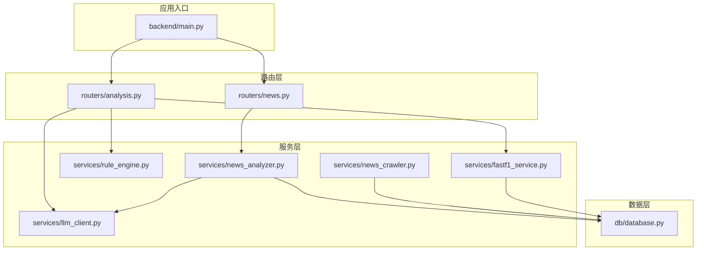
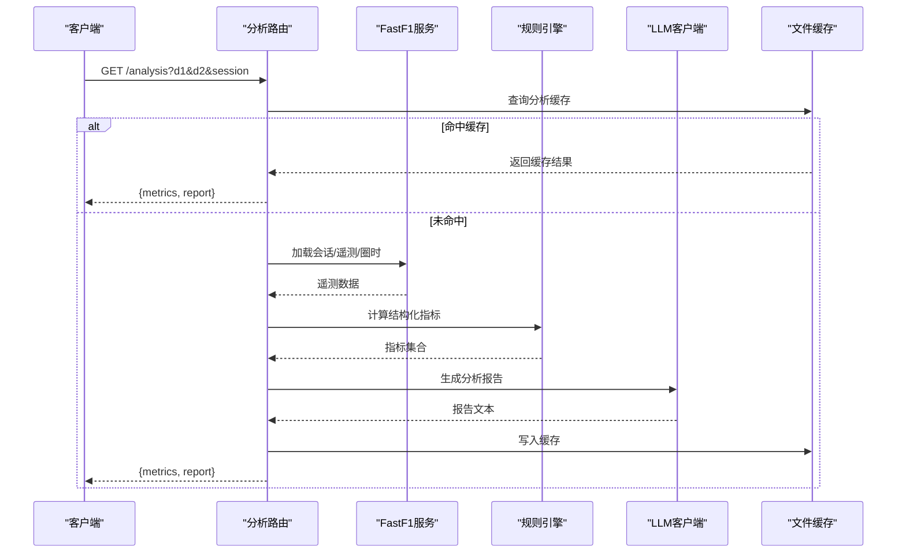
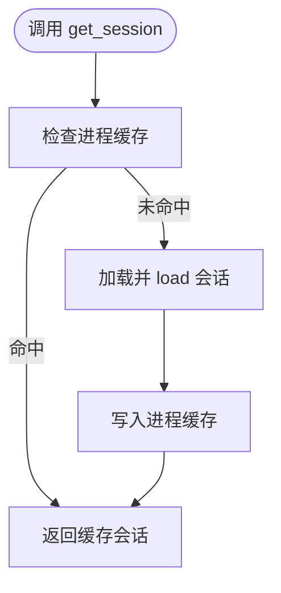
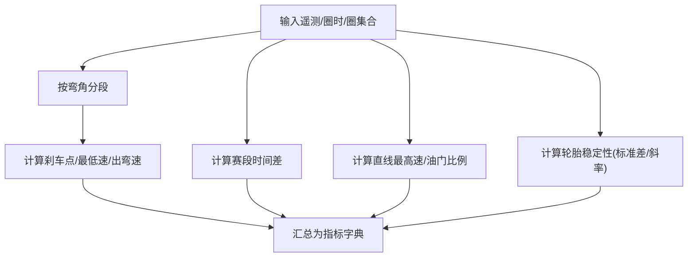
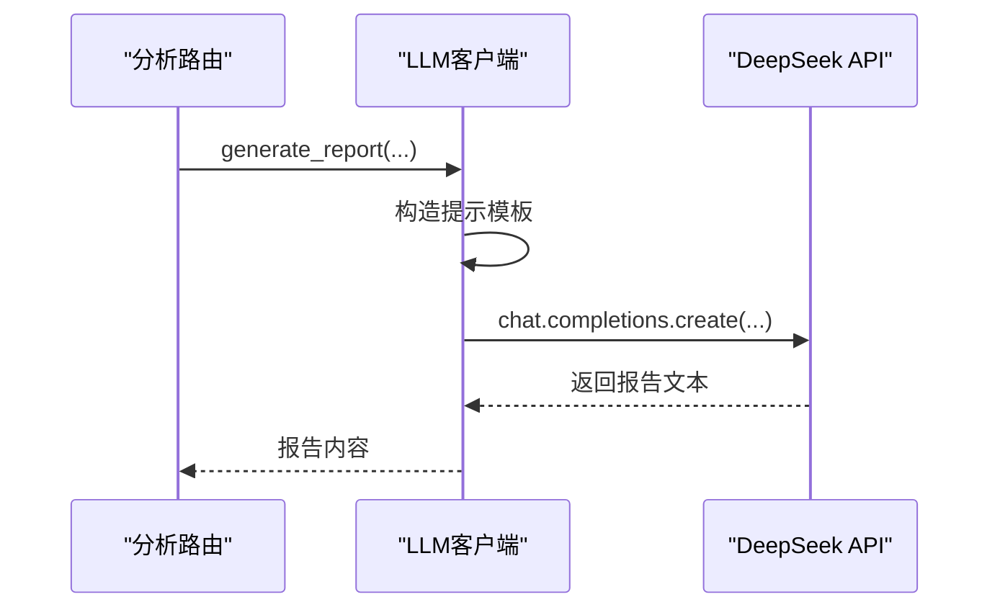
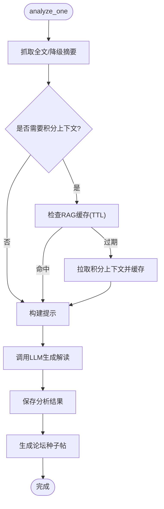
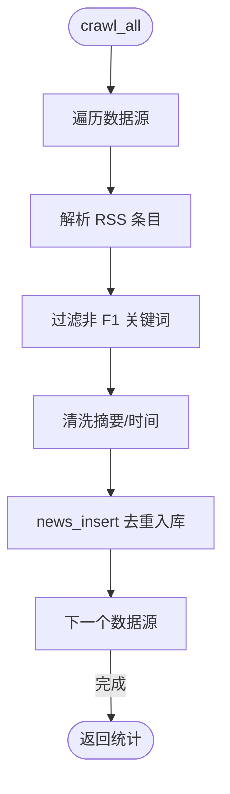
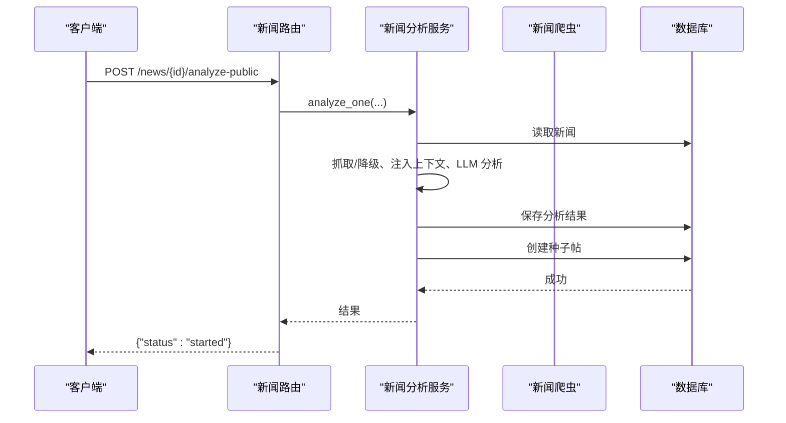
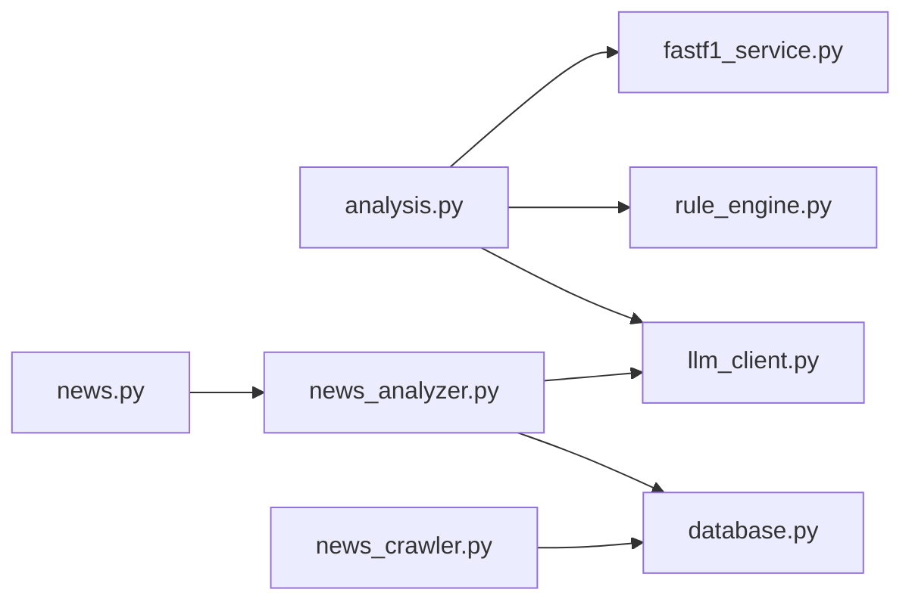

# 服务层设计

<cite>
**本文档引用的文件**
- [backend/main.py](file://backend/main.py)
- [backend/models/response.py](file://backend/models/response.py)
- [backend/db/database.py](file://backend/db/database.py)
- [backend/routers/analysis.py](file://backend/routers/analysis.py)
- [backend/routers/news.py](file://backend/routers/news.py)
- [backend/services/fastf1_service.py](file://backend/services/fastf1_service.py)
- [backend/services/rule_engine.py](file://backend/services/rule_engine.py)
- [backend/services/llm_client.py](file://backend/services/llm_client.py)
- [backend/services/news_analyzer.py](file://backend/services/news_analyzer.py)
- [backend/services/news_crawler.py](file://backend/services/news_crawler.py)
</cite>

## 目录
1. [简介](#简介)
2. [项目结构](#项目结构)
3. [核心组件](#核心组件)
4. [架构总览](#架构总览)
5. [详细组件分析](#详细组件分析)
6. [依赖关系分析](#依赖关系分析)
7. [性能考量](#性能考量)
8. [故障排查指南](#故障排查指南)
9. [结论](#结论)
10. [附录](#附录)

## 简介
本文件面向服务层设计，系统化阐述 Fast-F1 项目中服务层的职责分离、设计模式与实现细节。重点覆盖：
- FastF1 服务封装：统一数据获取、缓存与格式化
- 规则引擎：基于遥测数据的结构化指标计算
- LLM 客户端：基于 DeepSeek API 的分析报告生成
- 服务间交互与数据流：从遥测到报告的完整链路
- 缓存策略与性能优化：进程级内存缓存、文件系统缓存、RAG 上下文缓存
- 依赖注入与生命周期管理：应用启动时的预热与定时任务
- 扩展与定制最佳实践：如何在现有框架上扩展新服务

## 项目结构
服务层位于 backend/services 目录，围绕“数据获取 → 规则计算 → LLM 报告”的流水线组织。与之配套的是：
- 路由层（routers）：对外暴露 API，协调服务层与数据库层
- 数据层（db/database.py）：SQLite 持久化与 CRUD
- 应用入口（main.py）：FastAPI 应用、中间件、定时任务与启动预热

图表来源
- [backend/main.py:18-41](file://backend/main.py#L18-L41)
- [backend/routers/analysis.py:10-10](file://backend/routers/analysis.py#L10-L10)
- [backend/routers/news.py:20-20](file://backend/routers/news.py#L20-L20)
- [backend/services/fastf1_service.py:1-64](file://backend/services/fastf1_service.py#L1-L64)
- [backend/services/rule_engine.py:1-146](file://backend/services/rule_engine.py#L1-L146)
- [backend/services/llm_client.py:1-136](file://backend/services/llm_client.py#L1-L136)
- [backend/services/news_analyzer.py:1-298](file://backend/services/news_analyzer.py#L1-L298)
- [backend/services/news_crawler.py:1-148](file://backend/services/news_crawler.py#L1-L148)
- [backend/db/database.py:1-1416](file://backend/db/database.py#L1-L1416)

章节来源
- [backend/main.py:18-41](file://backend/main.py#L18-L41)
- [backend/routers/analysis.py:10-10](file://backend/routers/analysis.py#L10-L10)
- [backend/routers/news.py:20-20](file://backend/routers/news.py#L20-L20)

## 核心组件
- FastF1 服务封装：提供统一的会话加载、格式化工具与遥测转换函数，内置进程级内存缓存，避免重复加载相同会话。
- 规则引擎：按弯角、赛段、直线与轮胎稳定性四个维度计算结构化指标，输出供 LLM 使用的提示输入。
- LLM 客户端：封装 DeepSeek API 调用，提供统一的报告生成接口，并包含提示模板与三字码替换逻辑。
- 新闻分析服务：整合爬虫、RAG 上下文注入、LLM 分析与论坛种子帖生成，具备 TTL 缓存与错误处理。
- 新闻爬虫：多源 RSS 抓取，内容清洗与去噪，入库去重。

章节来源
- [backend/services/fastf1_service.py:14-64](file://backend/services/fastf1_service.py#L14-L64)
- [backend/services/rule_engine.py:10-146](file://backend/services/rule_engine.py#L10-L146)
- [backend/services/llm_client.py:13-136](file://backend/services/llm_client.py#L13-L136)
- [backend/services/news_analyzer.py:25-298](file://backend/services/news_analyzer.py#L25-L298)
- [backend/services/news_crawler.py:15-148](file://backend/services/news_crawler.py#L15-L148)

## 架构总览
服务层遵循“单一职责 + 可组合”的设计原则，通过路由层编排服务层与数据层，形成如下数据流：
- 遥测分析：路由层接收参数 → 加载 FastF1 会话 → 提取遥测与圈时 → 规则引擎计算指标 → LLM 生成报告 → 结果缓存
- 新闻分析：路由层触发爬虫或分析 → 爬虫入库 → 分析器读取并调用 LLM → 结果持久化 → 自动生成论坛种子帖

图表来源
- [backend/routers/analysis.py:35-120](file://backend/routers/analysis.py#L35-L120)
- [backend/services/fastf1_service.py:14-64](file://backend/services/fastf1_service.py#L14-L64)
- [backend/services/rule_engine.py:136-146](file://backend/services/rule_engine.py#L136-L146)
- [backend/services/llm_client.py:77-136](file://backend/services/llm_client.py#L77-L136)

## 详细组件分析

### FastF1 服务封装
- 设计原则
  - 单一职责：集中处理 FastF1 数据获取与格式化
  - 缓存优先：进程级内存缓存同一会话，避免重复 IO
  - 类型安全：对时间、速度、遥测字段进行统一格式化与 NaN 处理
- 关键能力
  - 会话加载：按年份、轮次/名称、会话类型加载并缓存
  - 时间格式化：将 timedelta 转为“分:秒.毫秒”字符串
  - 弯角距离与标签：从电路信息提取弯角距离，缺失时等间距回退
  - 遥测序列化：将 DataFrame 转为字典，处理 NaN 与类型转换
- 生命周期
  - 进程启动时由应用层预热，加载已有缓存目录中的会话
  - 应用关闭时释放资源

图表来源
- [backend/services/fastf1_service.py:14-21](file://backend/services/fastf1_service.py#L14-L21)

章节来源
- [backend/services/fastf1_service.py:14-64](file://backend/services/fastf1_service.py#L14-L64)
- [backend/main.py:55-97](file://backend/main.py#L55-L97)

### 规则引擎
- 设计原则
  - 指标解耦：每个分析维度独立函数，便于扩展与测试
  - 数据稳健：对空窗口、NaN、异常值进行保护
  - 输出标准化：统一返回字典结构，便于 LLM prompt 组装
- 分析维度
  - 弯角：刹车点、最低速、出弯速差异
  - 赛段：S1/S2/S3 时间差与更快车手
  - 直线：最高速与油门全开比例
  - 轮胎：圈时标准差与衰减速率
- 聚合输出
  - 将各维度指标合并为统一结构，供 LLM 使用

图表来源
- [backend/services/rule_engine.py:10-146](file://backend/services/rule_engine.py#L10-L146)

章节来源
- [backend/services/rule_engine.py:10-146](file://backend/services/rule_engine.py#L10-L146)

### LLM 客户端
- 设计原则
  - 单例客户端：全局懒加载，避免重复初始化
  - 提示模板：结构化模板 + 动态注入，保证输出格式一致性
  - 三字码防护：在指标字符串中将三字码替换为“全名(三字码)”避免混淆
- 关键流程
  - 生成提示：拼装车手身份、比赛信息、计算指标
  - 调用 API：DeepSeek chat completion
  - 返回报告：Markdown 格式的分析报告

图表来源
- [backend/services/llm_client.py:77-136](file://backend/services/llm_client.py#L77-L136)

章节来源
- [backend/services/llm_client.py:13-136](file://backend/services/llm_client.py#L13-L136)

### 新闻分析服务
- 设计原则
  - RAG 上下文按需注入：仅在涉及积分/排名/冠军时拉取，避免浪费 token
  - TTL 缓存：30 分钟缓存积分上下文，降低外部 API 调用频率
  - 安全系统角色：限定 2026 赛季事实，禁止历史信息干扰
  - 多源抓取与降级：Trafilatura 抓取正文失败时降级为 RSS 摘要
- 关键流程
  - 抓取全文或摘要 → 注入积分上下文 → LLM 生成三段式解读 → 保存分析结果 → 自动创建论坛种子帖

图表来源
- [backend/services/news_analyzer.py:220-298](file://backend/services/news_analyzer.py#L220-L298)

章节来源
- [backend/services/news_analyzer.py:25-298](file://backend/services/news_analyzer.py#L25-L298)

### 新闻爬虫
- 设计原则
  - 多源聚合：支持 The Race、Motorsport.com、Crash.net、F1i.com
  - 内容清洗：去除 HTML 标签、清理截断词、限制摘要长度
  - 去重入库：按 URL 去重，避免重复分析
- 关键流程
  - 解析 RSS → 过滤非 F1 内容 → 标准化字段 → 插入数据库

图表来源
- [backend/services/news_crawler.py:119-148](file://backend/services/news_crawler.py#L119-L148)

章节来源
- [backend/services/news_crawler.py:15-148](file://backend/services/news_crawler.py#L15-L148)

### 路由层与服务层交互
- 分析路由
  - 参数校验与缓存：MD5 缓存键、文件系统缓存
  - 服务编排：调用 FastF1 服务、规则引擎、LLM 客户端
  - 结果封装：统一响应模型
- 新闻路由
  - 管理员鉴权：ADMIN_TOKEN 校验
  - 异步分析：公共触发与管理员触发两种路径
  - 车队标签缓存：10 分钟 TTL 内存缓存

图表来源
- [backend/routers/news.py:127-157](file://backend/routers/news.py#L127-L157)
- [backend/services/news_analyzer.py:220-298](file://backend/services/news_analyzer.py#L220-L298)

章节来源
- [backend/routers/analysis.py:35-120](file://backend/routers/analysis.py#L35-L120)
- [backend/routers/news.py:67-190](file://backend/routers/news.py#L67-L190)

## 依赖关系分析
- 组件耦合
  - 分析路由依赖 FastF1 服务、规则引擎、LLM 客户端
  - 新闻分析服务依赖 LLM 客户端与数据库层
  - 新闻爬虫依赖数据库层
- 外部依赖
  - FastAPI、FastF1、OpenAI SDK、APScheduler、SciPy、feedparser、trafilatura
- 循环依赖规避
  - 路由层延迟导入服务模块，避免循环依赖

图表来源
- [backend/routers/analysis.py:3-7](file://backend/routers/analysis.py#L3-L7)
- [backend/routers/news.py:14-14](file://backend/routers/news.py#L14-L14)
- [backend/services/news_analyzer.py:12-16](file://backend/services/news_analyzer.py#L12-L16)

章节来源
- [backend/requirements.txt:1-15](file://backend/requirements.txt#L1-L15)

## 性能考量
- 缓存策略
  - 进程级内存缓存：FastF1 会话缓存，避免重复 load
  - 文件系统缓存：分析结果缓存，按 MD5 键存储
  - TTL 缓存：RAG 积分上下文缓存 30 分钟
  - 内存缓存：新闻车队标签缓存 10 分钟
- 预热机制
  - 应用启动时扫描本地缓存目录，预加载会话
  - 启动后预热 events 与 standings API 缓存
- 异步与并发
  - 新闻分析采用后台线程异步执行，避免阻塞请求
  - SQLite WAL 模式提升并发写入稳定性
- 优化建议
  - 对大型遥测数据进行分段处理，避免一次性转换
  - LLM 调用参数（temperature、max_tokens）按场景调优
  - RSS 抓取失败时快速降级，减少等待时间

章节来源
- [backend/services/fastf1_service.py:11-21](file://backend/services/fastf1_service.py#L11-L21)
- [backend/routers/analysis.py:16-33](file://backend/routers/analysis.py#L16-L33)
- [backend/services/news_analyzer.py:20-22](file://backend/services/news_analyzer.py#L20-L22)
- [backend/routers/news.py:24-35](file://backend/routers/news.py#L24-L35)
- [backend/main.py:55-115](file://backend/main.py#L55-L115)

## 故障排查指南
- FastF1 会话加载失败
  - 检查缓存目录是否存在对应年份/轮次/会话
  - 确认网络可用，必要时禁用本地缓存重试
- LLM 调用异常
  - 校验 DEEPSEEK_API_KEY 是否正确设置
  - 检查提示模板拼装是否包含必要字段
- 新闻分析失败
  - 查看 Trafilatura 抓取日志，确认 URL 可访问
  - 检查 RAG 上下文拉取是否报错
- 数据库写入失败
  - 检查 WAL 模式与外键约束是否生效
  - 确认唯一索引冲突（URL 去重）

章节来源
- [backend/services/llm_client.py:9-20](file://backend/services/llm_client.py#L9-L20)
- [backend/services/news_analyzer.py:77-79](file://backend/services/news_analyzer.py#L77-L79)
- [backend/db/database.py:13-19](file://backend/db/database.py#L13-L19)

## 结论
服务层通过清晰的职责划分与可组合的设计，实现了从数据获取到智能分析的完整闭环。FastF1 服务封装提供稳定的数据基础，规则引擎将复杂遥测转化为结构化指标，LLM 客户端将指标转化为可读报告。配合多级缓存与预热机制，系统在性能与可靠性方面表现良好。未来可在指标维度扩展、提示模板优化与异步任务调度方面持续演进。

## 附录
- 依赖注入与生命周期
  - 应用启动时初始化数据库、启动定时任务、后台预热
  - LLM 客户端懒加载，避免不必要的初始化
- 扩展与定制最佳实践
  - 新增分析维度：在规则引擎中添加独立函数，保持聚合函数不变
  - 新增提示模板：在 LLM 客户端中新增模板常量，统一入口调用
  - 新增数据源：在新闻爬虫中新增 RSS 源配置，复用现有清洗逻辑
  - 新增服务：在 routers 中新增路由，按需注入服务层与数据层

章节来源
- [backend/main.py:117-136](file://backend/main.py#L117-L136)
- [backend/services/llm_client.py:23-67](file://backend/services/llm_client.py#L23-L67)
- [backend/services/news_crawler.py:15-36](file://backend/services/news_crawler.py#L15-L36)
- [backend/routers/analysis.py:3-7](file://backend/routers/analysis.py#L3-L7)