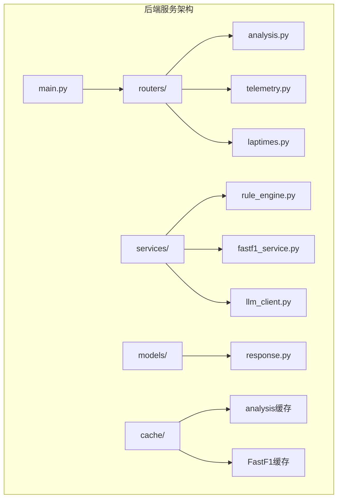
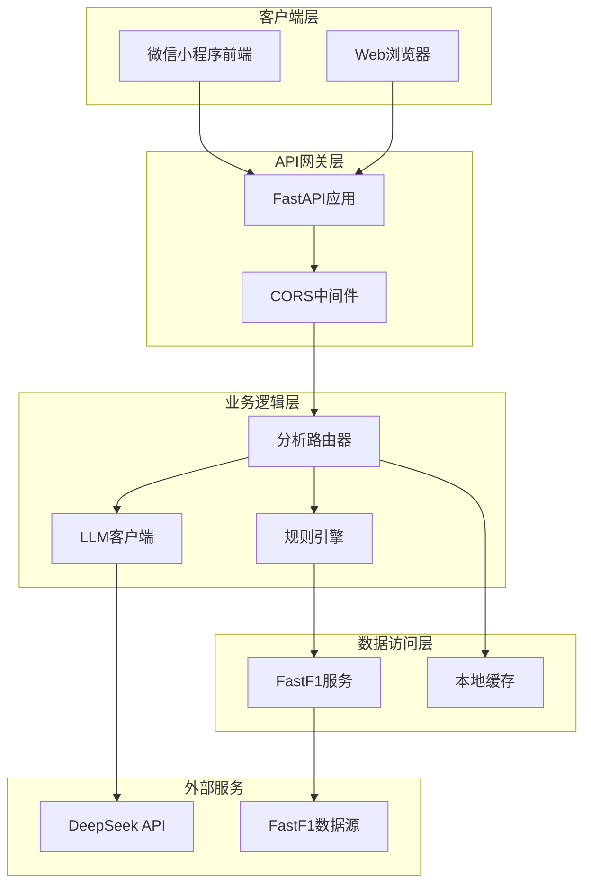
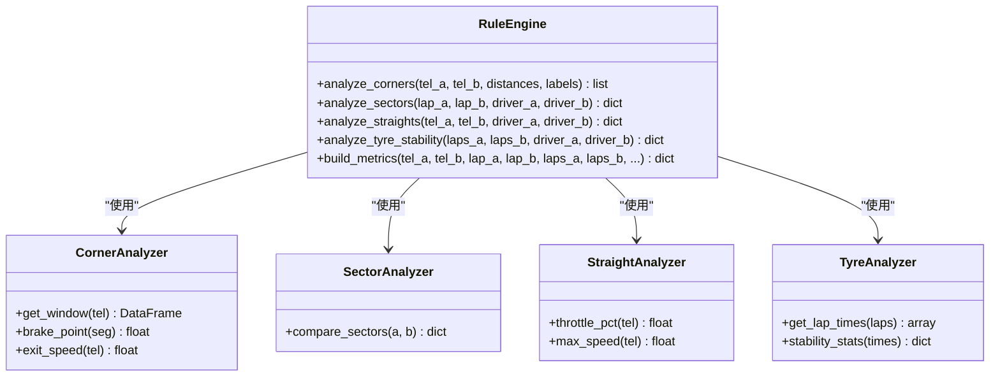
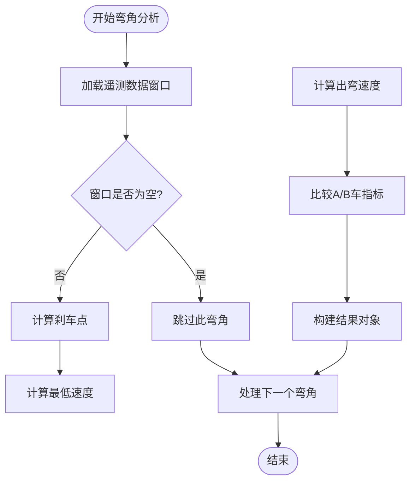
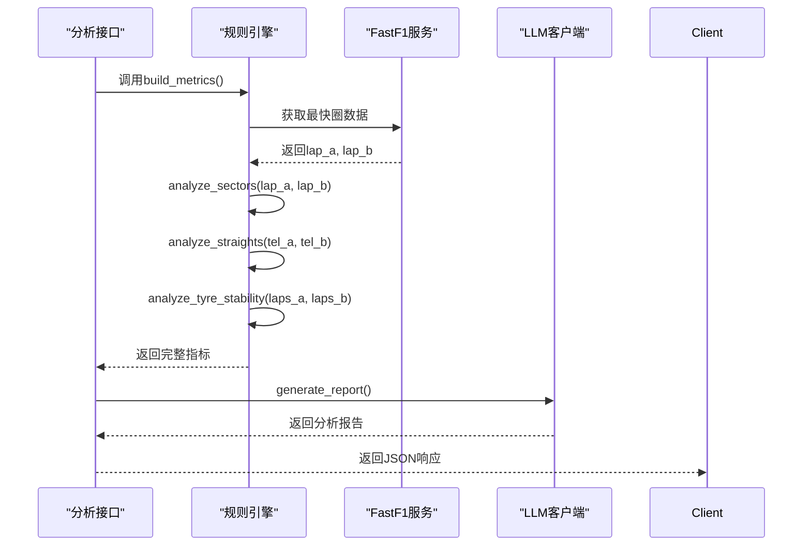
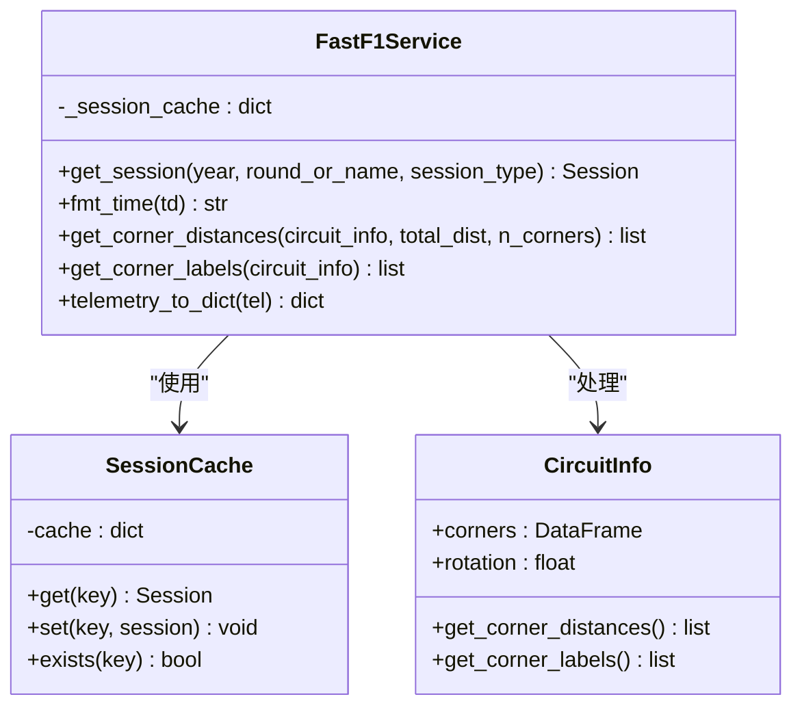
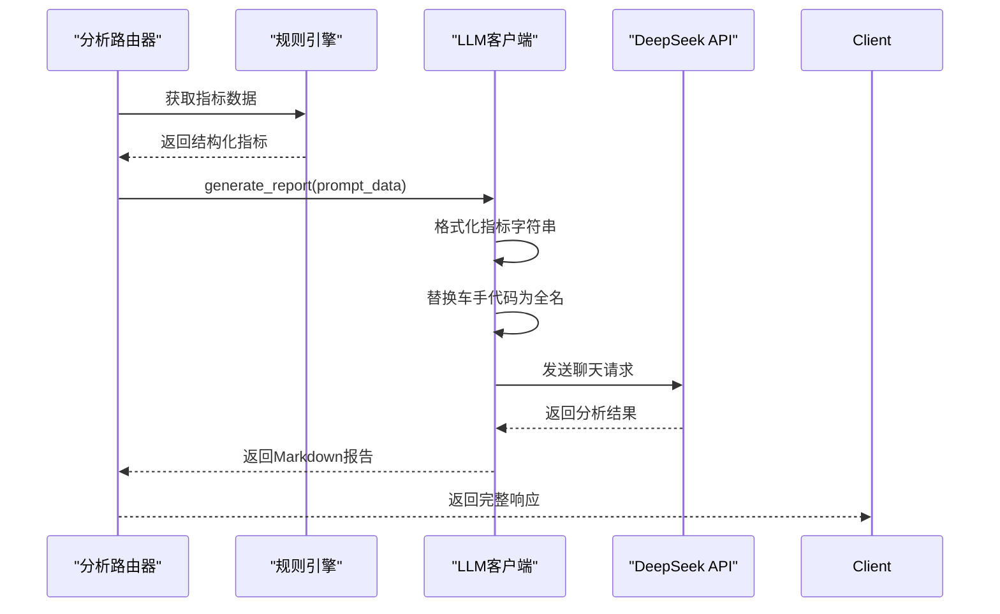
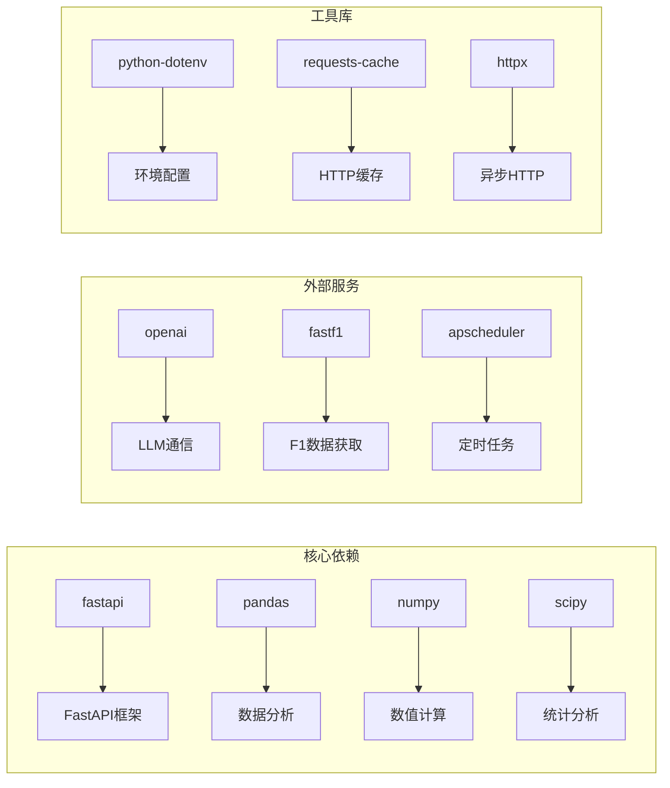
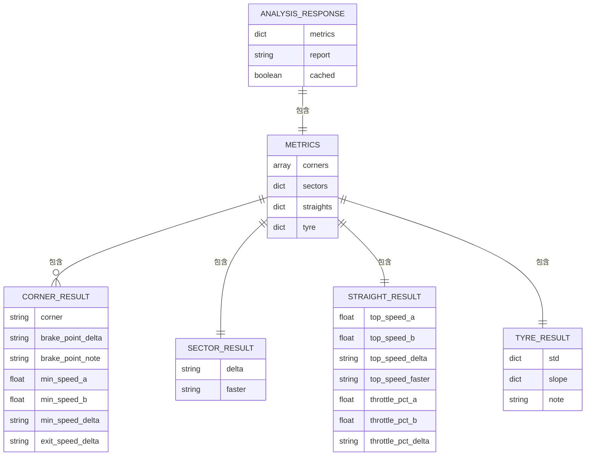

# 规则引擎服务

<cite>
**本文档引用的文件**
- [backend/services/rule_engine.py](file://backend/services/rule_engine.py)
- [backend/routers/analysis.py](file://backend/routers/analysis.py)
- [backend/services/fastf1_service.py](file://backend/services/fastf1_service.py)
- [backend/services/llm_client.py](file://backend/services/llm_client.py)
- [backend/main.py](file://backend/main.py)
- [backend/models/response.py](file://backend/models/response.py)
- [memory/architecture.md](file://memory/architecture.md)
- [backend/requirements.txt](file://backend/requirements.txt)
</cite>

## 目录
1. [简介](#简介)
2. [项目结构](#项目结构)
3. [核心组件](#核心组件)
4. [架构概览](#架构概览)
5. [详细组件分析](#详细组件分析)
6. [依赖分析](#依赖分析)
7. [性能考虑](#性能考虑)
8. [故障排除指南](#故障排除指南)
9. [结论](#结论)
10. [附录](#附录)

## 简介
本项目实现了一个基于FastF1数据的规则引擎服务，专门用于F1赛车数据分析。该系统通过规则引擎对遥测数据进行结构化分析，生成可被LLM使用的指标数据，最终输出专业的中文分析报告。系统支持多种分析维度，包括弯角策略分析、赛段时间对比、直线效率评估和轮胎稳定性分析。

## 项目结构
规则引擎服务位于后端项目的services目录中，采用模块化设计，主要包含以下核心文件：

**图表来源**
- [backend/main.py:1-157](file://backend/main.py#L1-L157)
- [backend/services/rule_engine.py:1-146](file://backend/services/rule_engine.py#L1-L146)
- [backend/routers/analysis.py:1-121](file://backend/routers/analysis.py#L1-L121)

**章节来源**
- [backend/main.py:1-157](file://backend/main.py#L1-L157)
- [memory/architecture.md:1-197](file://memory/architecture.md#L1-L197)

## 核心组件
规则引擎服务由四个主要组件构成，每个组件负责特定的数据处理功能：

### 规则引擎核心
规则引擎是整个系统的核心，负责将原始遥测数据转换为结构化的分析指标。它包含四个主要分析函数：
- **弯角分析**：计算每个弯角的刹车点、最低速和出弯速差异
- **赛段分析**：对比两车在不同赛段的时间表现
- **直线效率分析**：评估最高速度和油门使用效率
- **轮胎稳定性分析**：分析圈时标准差和衰退趋势

### FastF1服务封装
提供统一的FastF1数据访问接口，包含会话缓存、时间格式化和弯角信息处理功能。

### LLM客户端
集成DeepSeek API，将结构化指标转换为专业的中文分析报告。

### API路由器
提供RESTful接口，处理HTTP请求并协调各个服务组件。

**章节来源**
- [backend/services/rule_engine.py:1-146](file://backend/services/rule_engine.py#L1-L146)
- [backend/services/fastf1_service.py:1-64](file://backend/services/fastf1_service.py#L1-L64)
- [backend/services/llm_client.py:1-136](file://backend/services/llm_client.py#L1-L136)
- [backend/routers/analysis.py:1-121](file://backend/routers/analysis.py#L1-L121)

## 架构概览
系统采用分层架构设计，实现了清晰的关注点分离：

**图表来源**
- [backend/main.py:18-42](file://backend/main.py#L18-L42)
- [backend/routers/analysis.py:35-121](file://backend/routers/analysis.py#L35-L121)
- [backend/services/llm_client.py:13-21](file://backend/services/llm_client.py#L13-L21)

## 详细组件分析

### 规则引擎组件分析

规则引擎采用函数式编程模式，每个分析函数都专注于特定的数据处理任务：

**图表来源**
- [backend/services/rule_engine.py:10-146](file://backend/services/rule_engine.py#L10-L146)

#### 弯角分析算法流程

弯角分析是规则引擎中最复杂的组件，采用滑动窗口技术来分析每个弯角的表现：

**图表来源**
- [backend/services/rule_engine.py:10-61](file://backend/services/rule_engine.py#L10-L61)

#### 赛段时间分析流程

赛段分析采用直接对比法，利用FastF1提供的原生数据：

**图表来源**
- [backend/routers/analysis.py:96-117](file://backend/routers/analysis.py#L96-L117)
- [backend/services/rule_engine.py:136-146](file://backend/services/rule_engine.py#L136-L146)

**章节来源**
- [backend/services/rule_engine.py:10-146](file://backend/services/rule_engine.py#L10-L146)

### FastF1服务组件分析

FastF1服务提供了统一的数据访问接口，实现了多层缓存机制：

**图表来源**
- [backend/services/fastf1_service.py:14-64](file://backend/services/fastf1_service.py#L14-L64)

**章节来源**
- [backend/services/fastf1_service.py:14-64](file://backend/services/fastf1_service.py#L14-L64)

### LLM客户端组件分析

LLM客户端负责将结构化指标转换为专业的中文分析报告：

**图表来源**
- [backend/services/llm_client.py:77-136](file://backend/services/llm_client.py#L77-L136)

**章节来源**
- [backend/services/llm_client.py:77-136](file://backend/services/llm_client.py#L77-L136)

## 依赖分析

系统依赖关系清晰，遵循单一职责原则：

**图表来源**
- [backend/requirements.txt:1-15](file://backend/requirements.txt#L1-L15)

**章节来源**
- [backend/requirements.txt:1-15](file://backend/requirements.txt#L1-L15)

## 性能考虑

系统在多个层面实现了性能优化：

### 缓存策略
- **进程级会话缓存**：避免重复加载相同会话数据
- **本地文件缓存**：分析结果持久化存储
- **FastF1缓存**：利用FastF1内置的两级缓存机制

### 内存优化
- **惰性加载**：仅在需要时加载数据
- **数据类型优化**：使用适当的数据类型减少内存占用
- **批量处理**：避免不必要的数据复制

### 网络优化
- **CDN加速**：静态资源通过CDN分发
- **连接复用**：减少TCP握手开销
- **压缩传输**：启用GZIP压缩

**章节来源**
- [memory/architecture.md:105-129](file://memory/architecture.md#L105-L129)
- [backend/main.py:14-16](file://backend/main.py#L14-L16)

## 故障排除指南

### 常见问题及解决方案

#### 规则引擎异常
- **症状**：分析结果为空或异常
- **原因**：遥测数据缺失或格式不正确
- **解决**：检查FastF1数据获取状态，验证数据完整性

#### LLM调用失败
- **症状**：API调用超时或返回错误
- **原因**：网络连接问题或API密钥配置错误
- **解决**：检查网络连接，验证DEEPSEEK_API_KEY配置

#### 缓存问题
- **症状**：缓存数据过期或损坏
- **原因**：缓存文件格式变更或权限问题
- **解决**：清理缓存目录，重新生成缓存文件

**章节来源**
- [backend/routers/analysis.py:119-121](file://backend/routers/analysis.py#L119-L121)
- [backend/services/llm_client.py:13-21](file://backend/services/llm_client.py#L13-L21)

## 结论

规则引擎服务通过模块化设计和清晰的架构分离，成功实现了F1数据分析的自动化。系统具备以下优势：

1. **可扩展性**：模块化设计便于添加新的分析规则
2. **性能优化**：多层缓存机制确保高效运行
3. **可靠性**：完善的错误处理和故障恢复机制
4. **可维护性**：清晰的代码结构和文档

未来可以考虑的功能增强包括：
- 动态规则加载机制
- 更丰富的分析维度
- 实时数据流处理能力
- 规则版本管理和热更新

## 附录

### API接口规范

系统提供RESTful API接口，支持以下操作：

| 接口 | 方法 | 参数 | 功能 |
|------|------|------|------|
| `/analysis` | GET | year, round_num, event, d1, d2, session, force | 获取AI分析报告 |
| `/telemetry` | GET | year, round_num, event, d1, d2, session | 获取遥测数据对比 |
| `/laptimes` | GET | year, round_num, event, session | 获取圈时分析 |

### 数据模型

**图表来源**
- [backend/routers/analysis.py:56-117](file://backend/routers/analysis.py#L56-L117)
- [backend/services/rule_engine.py:140-145](file://backend/services/rule_engine.py#L140-L145)