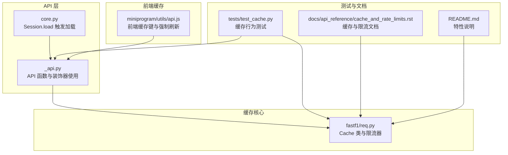
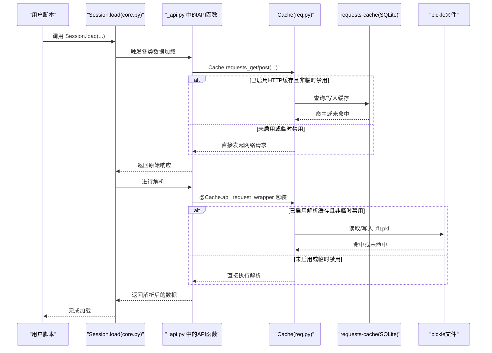
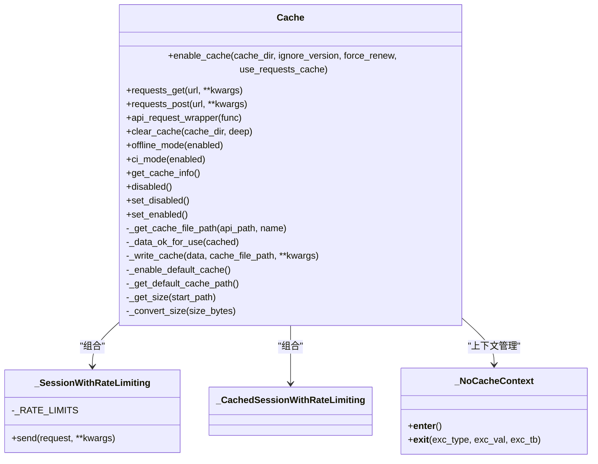
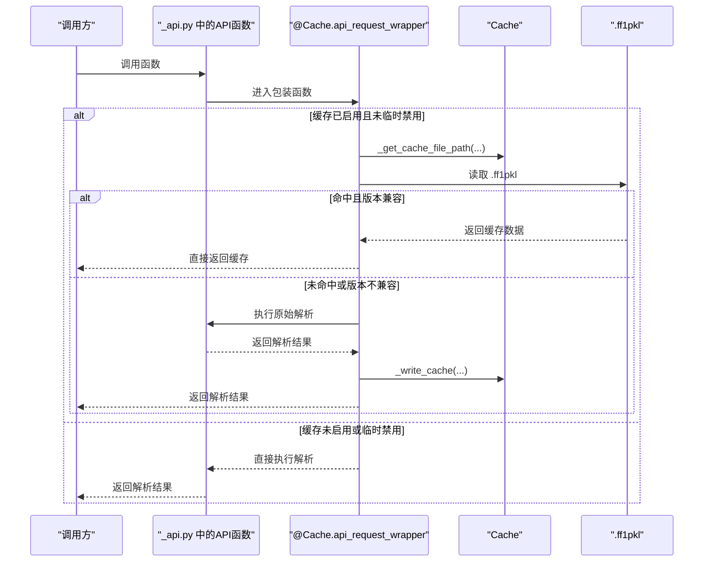
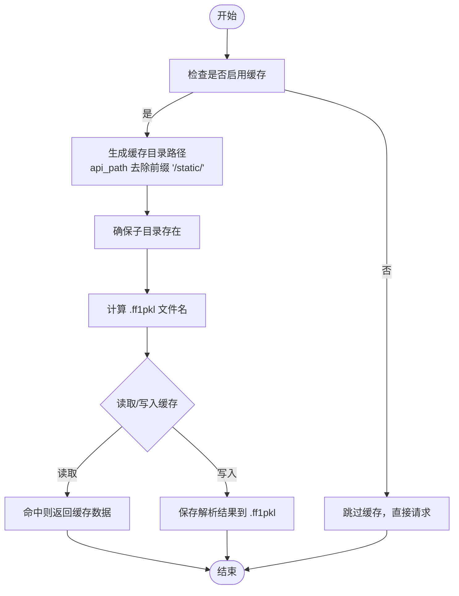
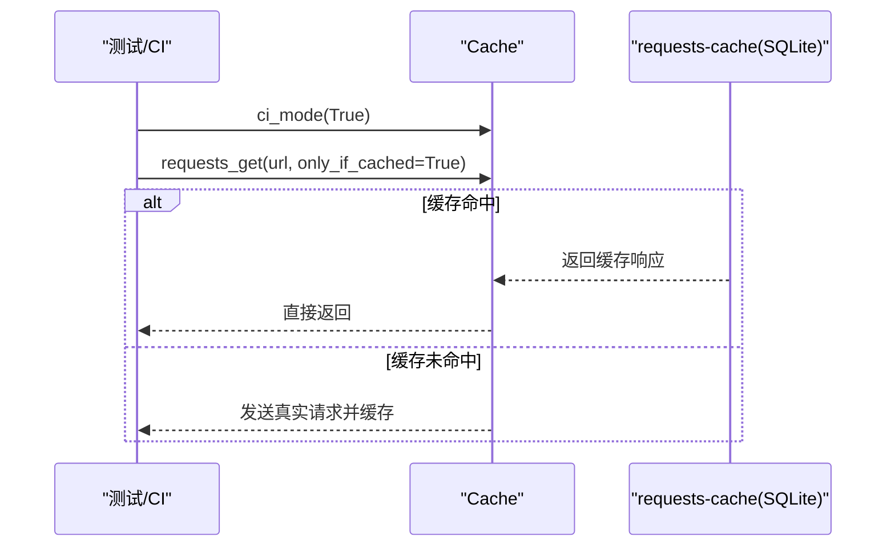
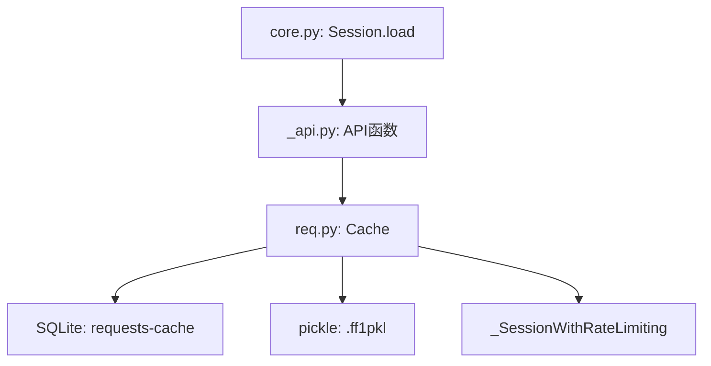

# 缓存机制

<cite>
**本文引用的文件**
- [fastf1/req.py](file://fastf1/req.py)
- [fastf1/_api.py](file://fastf1/_api.py)
- [fastf1/core.py](file://fastf1/core.py)
- [fastf1/tests/test_cache.py](file://fastf1/tests/test_cache.py)
- [docs/api_reference/cache_and_rate_limits.rst](file://docs/api_reference/cache_and_rate_limits.rst)
- [README.md](file://README.md)
- [miniprogram/utils/api.js](file://miniprogram/utils/api.js)
</cite>

## 目录
1. [简介](#简介)
2. [项目结构](#项目结构)
3. [核心组件](#核心组件)
4. [架构总览](#架构总览)
5. [详细组件分析](#详细组件分析)
6. [依赖关系分析](#依赖关系分析)
7. [性能考量](#性能考量)
8. [故障排除指南](#故障排除指南)
9. [结论](#结论)
10. [附录](#附录)

## 简介
本文件系统性阐述 FastF1 的多层缓存机制设计与实现，覆盖以下方面：
- 多层缓存策略：HTTP 请求缓存（阶段 1）、解析数据缓存（阶段 2）与默认缓存启用策略
- 缓存目录结构与文件组织：按年份/周末/会期分层的 pickle 文件组织方式
- 缓存预热与后台管理：CI 模式下的缓存预热与请求复用策略
- 失效与清理：版本控制、强制更新、缓存清理与 SQLite 请求缓存的删除
- 配置参数与调优：环境变量、缓存目录、过期时间、过滤规则等
- 监控与排障：缓存大小统计、日志信息、常见问题定位

## 项目结构
与缓存相关的关键模块与文件如下：
- 缓存核心：fastf1/req.py 中的 Cache 类与请求限流器
- API 使用缓存：fastf1/_api.py 中对关键 API 函数应用缓存装饰器
- 会话加载流程：fastf1/core.py 中 Session.load 触发各类 API 加载
- 文档与示例：docs/api_reference/cache_and_rate_limits.rst、README.md
- 测试验证：fastf1/tests/test_cache.py 对缓存行为进行断言
- 小程序前端缓存：miniprogram/utils/api.js 展示了前端侧缓存键与强制刷新逻辑

**图表来源**
- [fastf1/req.py:132-686](file://fastf1/req.py#L132-L686)
- [fastf1/_api.py:185-200](file://fastf1/_api.py#L185-L200)
- [fastf1/core.py:1358-1444](file://fastf1/core.py#L1358-L1444)
- [fastf1/tests/test_cache.py:19-122](file://fastf1/tests/test_cache.py#L19-L122)
- [docs/api_reference/cache_and_rate_limits.rst:1-42](file://docs/api_reference/cache_and_rate_limits.rst#L1-L42)
- [README.md:17-17](file://README.md#L17-L17)
- [miniprogram/utils/api.js:128-151](file://miniprogram/utils/api.js#L128-L151)

**章节来源**
- [fastf1/req.py:132-686](file://fastf1/req.py#L132-L686)
- [fastf1/_api.py:185-200](file://fastf1/_api.py#L185-L200)
- [fastf1/core.py:1358-1444](file://fastf1/core.py#L1358-L1444)
- [fastf1/tests/test_cache.py:19-122](file://fastf1/tests/test_cache.py#L19-L122)
- [docs/api_reference/cache_and_rate_limits.rst:1-42](file://docs/api_reference/cache_and_rate_limits.rst#L1-L42)
- [README.md:17-17](file://README.md#L17-L17)
- [miniprogram/utils/api.js:128-151](file://miniprogram/utils/api.js#L128-L151)

## 核心组件
- Cache 类：提供 HTTP 请求缓存（阶段 1）与解析数据缓存（阶段 2），支持默认缓存启用、禁用、离线模式、CI 模式、缓存清理等能力
- 限流器：基于最小间隔与固定周期请求数量的软/硬限流策略，统一应用于 requests.Session
- API 装饰器：对特定 API 函数使用缓存装饰器，实现“解析数据”阶段的二级缓存

关键职责与接口（节选）：
- 启用/禁用缓存、设置缓存目录、版本控制与强制更新
- HTTP 请求包装：requests_get/requests_post，支持 only-if-cached、CI 模式
- 解析数据缓存：api_request_wrapper 装饰器，pickle 文件按 API 函数名存储
- 缓存清理：按扩展名删除 pickle 文件，可选择同时清理 SQLite 请求缓存
- 默认缓存启用：优先环境变量，其次平台默认路径

**章节来源**
- [fastf1/req.py:216-258](file://fastf1/req.py#L216-L258)
- [fastf1/req.py:260-332](file://fastf1/req.py#L260-L332)
- [fastf1/req.py:396-469](file://fastf1/req.py#L396-L469)
- [fastf1/req.py:350-394](file://fastf1/req.py#L350-L394)
- [fastf1/req.py:517-552](file://fastf1/req.py#L517-L552)

## 架构总览
多层缓存的整体交互流程如下：

**图表来源**
- [fastf1/core.py:1358-1444](file://fastf1/core.py#L1358-L1444)
- [fastf1/_api.py:185-200](file://fastf1/_api.py#L185-L200)
- [fastf1/req.py:260-332](file://fastf1/req.py#L260-L332)
- [fastf1/req.py:396-469](file://fastf1/req.py#L396-L469)

## 详细组件分析

### 组件一：Cache 类与两级缓存策略
- 阶段 1：HTTP 请求缓存（requests-cache + SQLite）
  - 启用方式：enable_cache(..., use_requests_cache=True)
  - 存储介质：SQLite 数据库文件（默认名称）
  - 过期策略：expire_after 设置为 12 小时，cache_control=True 支持条件刷新
  - 过滤规则：自定义过滤函数，避免错误状态文本的响应被缓存
  - 访问方式：requests_get/requests_post 包装；CI 模式下支持 only-if-cached
- 阶段 2：解析数据缓存（pickle）
  - 启用方式：通过 api_request_wrapper 装饰器包裹 API 函数
  - 存储介质：pickle 文件，扩展名为 .ff1pkl
  - 目录结构：按 api_path 分目录，路径去除前缀 '/static/' 后拼接
  - 版本控制：缓存文件包含版本号，与当前 API 解析版本不一致时拒绝使用
  - 强制更新：FORCE_RENEW 忽略现有缓存，强制重新下载并更新

**图表来源**
- [fastf1/req.py:132-686](file://fastf1/req.py#L132-L686)

**章节来源**
- [fastf1/req.py:216-258](file://fastf1/req.py#L216-L258)
- [fastf1/req.py:260-332](file://fastf1/req.py#L260-L332)
- [fastf1/req.py:396-469](file://fastf1/req.py#L396-L469)
- [fastf1/req.py:471-500](file://fastf1/req.py#L471-L500)
- [fastf1/req.py:502-552](file://fastf1/req.py#L502-L552)

### 组件二：API 函数与缓存装饰器
- 关键 API 函数通过 @Cache.api_request_wrapper 装饰，实现解析数据的二级缓存
- 典型函数：_extended_timing_data 等，返回解析后的 DataFrame 或复合结果
- 缓存文件命名：以函数名为基础，扩展名为 .ff1pkl
- 目录组织：按 api_path 分目录，自动创建缺失子目录

**图表来源**
- [fastf1/_api.py:185-200](file://fastf1/_api.py#L185-L200)
- [fastf1/req.py:396-469](file://fastf1/req.py#L396-L469)
- [fastf1/req.py:471-500](file://fastf1/req.py#L471-L500)

**章节来源**
- [fastf1/_api.py:185-200](file://fastf1/_api.py#L185-L200)
- [fastf1/req.py:396-469](file://fastf1/req.py#L396-L469)
- [fastf1/req.py:471-500](file://fastf1/req.py#L471-L500)

### 组件三：缓存目录结构与文件组织
- HTTP 请求缓存：SQLite 文件位于缓存根目录，文件名可配置，默认名称为 fastf1_http_cache.sqlite
- 解析数据缓存：按 api_path 分目录，去除前缀 '/static/' 后的剩余路径作为子目录名
- 文件命名：函数名 + .ff1pkl
- 示例（测试断言）：缓存目录下存在多个 .ff1pkl 文件，如 car_data.ff1pkl、position_data.ff1pkl 等

**图表来源**
- [fastf1/req.py:471-500](file://fastf1/req.py#L471-L500)
- [fastf1/tests/test_cache.py:98-112](file://fastf1/tests/test_cache.py#L98-L112)

**章节来源**
- [fastf1/req.py:471-500](file://fastf1/req.py#L471-L500)
- [fastf1/tests/test_cache.py:98-112](file://fastf1/tests/test_cache.py#L98-L112)

### 组件四：缓存预热与后台管理（CI 模式）
- CI 模式：ci_mode(enabled=True) 启用后，仅在缓存未命中时才实际发送请求，并复用已缓存响应
- 预热策略：CI 模式下，所有请求只在首次运行时发出一次，后续复用，从而减少并发测试对上游 API 的压力
- 解析缓存禁用：CI 模式下禁用 stage 2（pickle）缓存，确保解析代码始终被执行
- 离线模式：offline_mode(enabled=True) 仅返回缓存数据，不发送任何真实请求

**图表来源**
- [fastf1/req.py:626-648](file://fastf1/req.py#L626-L648)
- [fastf1/req.py:260-332](file://fastf1/req.py#L260-L332)

**章节来源**
- [fastf1/req.py:626-648](file://fastf1/req.py#L626-L648)
- [fastf1/req.py:260-332](file://fastf1/req.py#L260-L332)

### 组件五：缓存失效策略与清理机制
- 版本控制：缓存文件包含版本号，若与当前 API 解析版本不一致则拒绝使用
- 强制更新：FORCE_RENEW=True 时忽略现有缓存，强制重新下载并更新
- 缓存清理：clear_cache 可按扩展名删除 .ff1pkl 文件；deep=True 时同时删除 SQLite 请求缓存
- 过滤规则：自定义过滤函数避免错误响应被缓存
- 默认缓存启用：若未显式配置，优先环境变量 FASTF1_CACHE，否则使用平台默认路径

**章节来源**
- [fastf1/req.py:484-491](file://fastf1/req.py#L484-L491)
- [fastf1/req.py:216-258](file://fastf1/req.py#L216-L258)
- [fastf1/req.py:350-394](file://fastf1/req.py#L350-L394)
- [fastf1/req.py:342-347](file://fastf1/req.py#L342-L347)
- [fastf1/req.py:502-552](file://fastf1/req.py#L502-L552)

### 组件六：前端缓存键与强制刷新（小程序）
- 前端缓存键：以特定前缀标识不同资源，如 analysis、telemetry 等
- 强制刷新：当 force=true 时，移除本地缓存键并直接请求后端接口
- 与后端缓存的关系：前端缓存键与后端缓存互不影响，但可配合后端缓存提升整体性能

**章节来源**
- [miniprogram/utils/api.js:128-151](file://miniprogram/utils/api.js#L128-L151)

## 依赖关系分析
- 会话加载触发 API 请求：Session.load 在内部调用多个 API 函数，这些函数均通过 Cache 进行缓存
- 缓存装饰器依赖：@Cache.api_request_wrapper 依赖 Cache 的文件路径计算与版本校验
- 限流器集成：_SessionWithRateLimiting 统一封装在 _CachedSessionWithRateLimiting 中，确保请求受控

**图表来源**
- [fastf1/core.py:1358-1444](file://fastf1/core.py#L1358-L1444)
- [fastf1/_api.py:185-200](file://fastf1/_api.py#L185-L200)
- [fastf1/req.py:132-686](file://fastf1/req.py#L132-L686)

**章节来源**
- [fastf1/core.py:1358-1444](file://fastf1/core.py#L1358-L1444)
- [fastf1/_api.py:185-200](file://fastf1/_api.py#L185-L200)
- [fastf1/req.py:132-686](file://fastf1/req.py#L132-L686)

## 性能考量
- 两级缓存显著降低重复请求与解析开销：HTTP 缓存减少网络往返，解析缓存避免重复解析
- 限流策略保障稳定性：软/硬限流防止超出上游 API 速率限制，避免阻断
- CI 模式减少并发测试压力：仅在首次运行时请求，其余复用缓存
- 缓存目录与文件组织清晰：按 api_path 分层，便于清理与维护
- 建议：
  - 在开发与测试环境中启用缓存，生产脚本中保持默认启用
  - 合理设置 expire_after 与 cache_control，平衡新鲜度与性能
  - 使用 FORCE_RENEW 进行版本切换或修复性更新
  - 定期清理过期缓存，避免磁盘占用过大

[本节为通用指导，无需具体文件分析]

## 故障排除指南
- 缓存未生效
  - 检查是否显式禁用了缓存或临时禁用
  - 确认缓存目录存在且可写
  - 查看默认缓存启用日志提示
- 缓存版本不匹配
  - 若出现版本不兼容导致的缓存拒绝，考虑使用 ignore_version 或 FORCE_RENEW
- 请求频繁失败或超时
  - 检查限流策略是否触发，适当调整请求频率
  - 使用 offline_mode 仅使用缓存数据进行离线调试
- 缓存清理无效
  - 确认清理范围：仅删除 .ff1pkl 文件或同时删除 SQLite 请求缓存
- 日志与监控
  - 关注 INFO 级日志中的“Using cached data for ...”、“Cache updated!”等提示
  - 使用 get_cache_info 获取缓存路径与大小，辅助容量规划

**章节来源**
- [fastf1/req.py:517-552](file://fastf1/req.py#L517-L552)
- [fastf1/req.py:484-491](file://fastf1/req.py#L484-L491)
- [fastf1/req.py:350-394](file://fastf1/req.py#L350-L394)
- [fastf1/tests/test_cache.py:114-122](file://fastf1/tests/test_cache.py#L114-L122)

## 结论
FastF1 的缓存体系通过两级缓存与统一限流策略，在保证数据新鲜度的同时显著提升了运行效率与稳定性。HTTP 请求缓存与解析数据缓存相互补充，结合 CI 模式与离线模式，满足从开发到生产的多样化场景需求。通过合理的配置与清理策略，可在性能与可靠性之间取得良好平衡。

[本节为总结性内容，无需具体文件分析]

## 附录

### A. 缓存配置参数与调优建议
- 缓存目录
  - 显式设置：enable_cache(cache_dir, ...)
  - 环境变量：FASTF1_CACHE
  - 平台默认：Linux ~/.cache/fastf1 或 ~/.fastf1；macOS ~/Library/Caches/fastf1；Windows %LOCALAPPDATA%\Temp\fastf1
- HTTP 缓存
  - expire_after：默认 12 小时
  - cache_control：启用条件刷新
  - 过滤规则：自定义过滤函数避免错误响应
- 解析缓存
  - 文件扩展名：.ff1pkl
  - 目录结构：按 api_path 分层
  - 版本控制：与 API 解析版本一致才可用
- 调优建议
  - 开发/测试：启用缓存，必要时使用 FORCE_RENEW
  - 生产脚本：保持默认启用，定期清理过期缓存
  - 并发测试：启用 CI 模式，减少上游 API 压力

**章节来源**
- [fastf1/req.py:191-197](file://fastf1/req.py#L191-L197)
- [fastf1/req.py:246-255](file://fastf1/req.py#L246-L255)
- [fastf1/req.py:484-491](file://fastf1/req.py#L484-L491)
- [fastf1/req.py:502-552](file://fastf1/req.py#L502-L552)

### B. 缓存监控与可观测性
- 缓存大小统计：get_cache_info 返回路径与大小
- 日志信息：INFO 级别输出缓存命中/更新/清理等关键事件
- 测试验证：测试用例断言缓存文件的存在与复用行为

**章节来源**
- [fastf1/req.py:651-664](file://fastf1/req.py#L651-L664)
- [fastf1/tests/test_cache.py:98-122](file://fastf1/tests/test_cache.py#L98-L122)