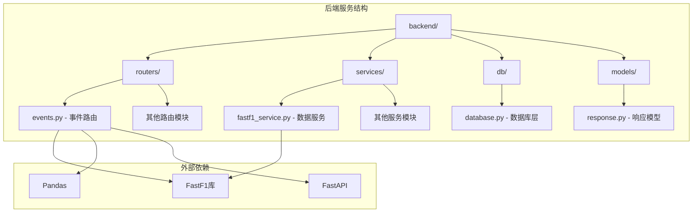
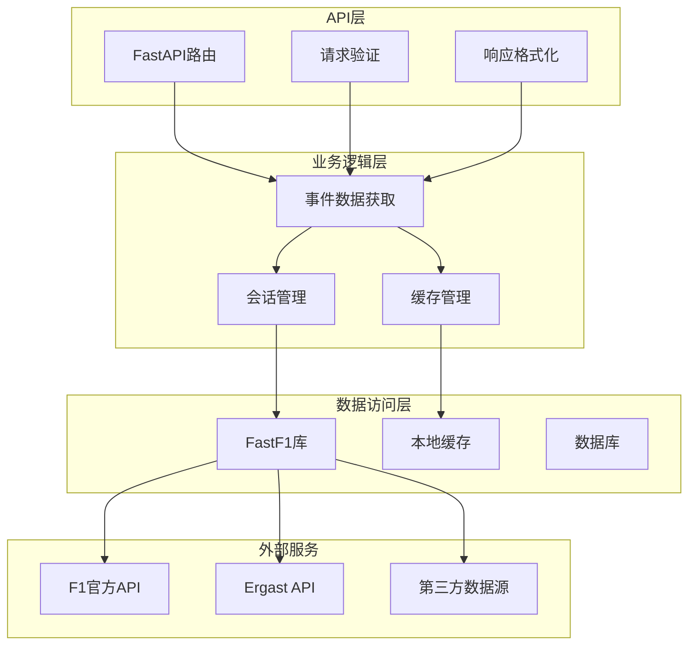
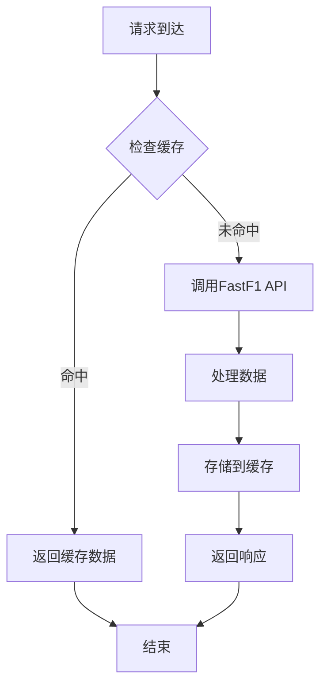
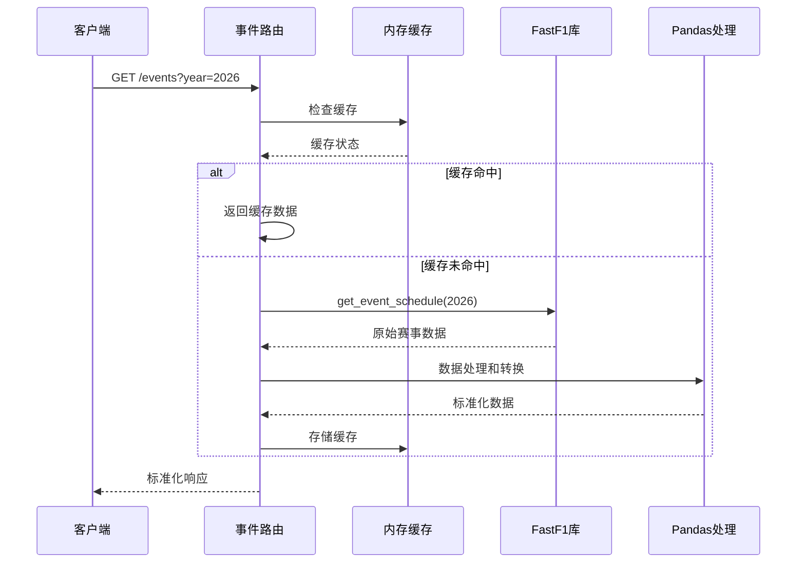
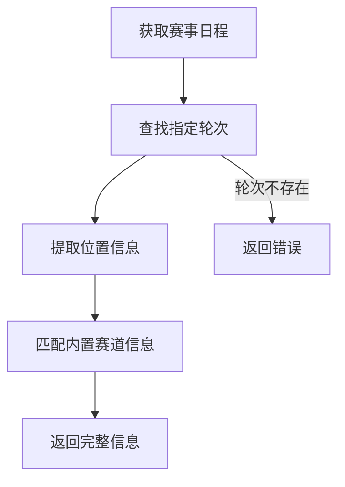
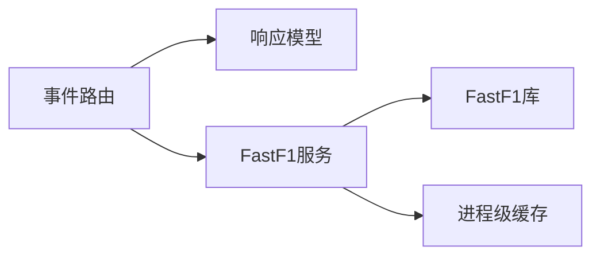

# 事件路由

<cite>
**本文档引用的文件**
- [backend/routers/events.py](file://backend/routers/events.py)
- [backend/main.py](file://backend/main.py)
- [fastf1/events.py](file://fastf1/events.py)
- [backend/services/fastf1_service.py](file://backend/services/fastf1_service.py)
- [backend/models/response.py](file://backend/models/response.py)
- [docs/api_reference/events.rst](file://docs/api_reference/events.rst)
- [fastf1/tests/test_events.py](file://fastf1/tests/test_events.py)
</cite>

## 目录
1. [简介](#简介)
2. [项目结构](#项目结构)
3. [核心组件](#核心组件)
4. [架构概览](#架构概览)
5. [详细组件分析](#详细组件分析)
6. [依赖关系分析](#依赖关系分析)
7. [性能考虑](#性能考虑)
8. [故障排除指南](#故障排除指南)
9. [结论](#结论)
10. [附录](#附录)

## 简介

事件路由模块是Fast-F1项目中的核心功能模块，负责提供F1赛事数据的查询和管理服务。该模块基于FastAPI框架构建，提供了完整的RESTful API接口，支持赛事查询、会话管理、数据获取等功能。

本模块的主要目标是：
- 提供标准化的F1赛事数据访问接口
- 实现高效的缓存机制以提升性能
- 支持多种数据源和格式
- 提供完整的错误处理和响应格式化

## 项目结构

事件路由模块位于后端服务的路由器目录中，采用模块化设计，与其他功能模块并列存在。



**图表来源**
- [backend/routers/events.py:1-506](file://backend/routers/events.py#L1-L506)
- [backend/main.py:1-157](file://backend/main.py#L1-L157)

**章节来源**
- [backend/routers/events.py:1-506](file://backend/routers/events.py#L1-L506)
- [backend/main.py:1-157](file://backend/main.py#L1-L157)

## 核心组件

事件路由模块包含以下核心组件：

### 1. 路由器实例
- 创建独立的APIRouter实例用于事件相关路由
- 定义内存缓存机制用于数据缓存

### 2. 缓存系统
- 内存缓存：基于字典的简单缓存实现
- TTL（生存时间）控制：默认6小时缓存有效期
- 缓存键生成：基于请求参数的组合键

### 3. 数据获取层
- FastF1集成：直接调用FastF1库获取赛事数据
- 多数据源支持：支持FastF1、F1 API、Ergast等多种数据源
- 数据转换：将原始数据转换为标准格式

### 4. 响应格式化
- 统一的响应模型：基于Pydantic的APIResponse
- 成功响应：包含状态码、数据和可选说明
- 错误响应：包含错误状态和错误信息

**章节来源**
- [backend/routers/events.py:1-506](file://backend/routers/events.py#L1-L506)
- [backend/models/response.py:1-14](file://backend/models/response.py#L1-L14)

## 架构概览

事件路由模块采用分层架构设计，实现了清晰的关注点分离：



**图表来源**
- [backend/routers/events.py:1-506](file://backend/routers/events.py#L1-L506)
- [backend/main.py:117-136](file://backend/main.py#L117-L136)

## 详细组件分析

### 主要路由端点

#### GET /events
**功能描述**：获取指定年份的F1赛事列表

**URL模式**：`/events?year={int}`

**请求参数**：
- `year` (路径参数): 指定F1赛季年份，默认值为2026

**响应格式**：
```json
{
  "status": "ok",
  "data": [
    {
      "round": 1,
      "name": "澳大利亚大奖赛",
      "country": "澳大利亚",
      "location": "墨尔本",
      "date": "2026-03-15",
      "format": "conventional",
      "race_time_utc": "2026-03-15T05:00:00Z"
    }
  ],
  "note": null
}
```

**错误处理**：
- 缓存未命中时调用FastF1 API失败
- 返回标准错误响应格式

#### GET /events/{round_num}/circuit
**功能描述**：获取指定轮次的赛道信息

**URL模式**：`/events/{round_num}/circuit?year={int}`

**请求参数**：
- `round_num` (路径参数): 赛事轮次编号
- `year` (查询参数): 指定F1赛季年份，默认值为2026

**响应格式**：
```json
{
  "status": "ok",
  "data": {
    "location": "墨尔本",
    "country": "澳大利亚",
    "event_name": "澳大利亚大奖赛",
    "detail": {
      "name_cn": "阿尔伯特公园赛道",
      "country": "澳大利亚",
      "city": "墨尔本",
      "length_km": 5.278,
      "laps": 58,
      "lap_record": "1:20.235",
      "lap_record_holder": "Charles Leclerc",
      "lap_record_year": 2022,
      "first_gp": 1996,
      "turns": 16,
      "drs_zones": 4,
      "type": "街道改建赛道",
      "direction": "顺时针",
      "characteristics": ["高速直道", "慢速弯角", "街道赛道感"],
      "highlights": ["赛季揭幕战，历史悠久", "湖边公园改建，风景优美"],
      "tyre_strategy": "通常一停策略，软胎磨损较快",
      "weather": "3月澳洲秋季，气温适宜，偶有阵雨"
    }
  },
  "note": null
}
```

**错误处理**：
- 轮次不存在时返回错误响应
- 赛道信息缺失时返回标准错误格式

### 缓存机制

#### 内存缓存实现


**图表来源**
- [backend/routers/events.py:12-19](file://backend/routers/events.py#L12-L19)

#### 缓存策略
- **缓存键生成**：基于请求参数的组合键
- **TTL设置**：默认6小时（21600秒）
- **缓存失效**：基于时间戳的简单过期机制
- **内存管理**：进程级内存缓存，重启后清空

### 数据获取流程

#### 赛事数据获取


**图表来源**
- [backend/routers/events.py:21-53](file://backend/routers/events.py#L21-L53)
- [fastf1/events.py:285-342](file://fastf1/events.py#L285-L342)

**章节来源**
- [backend/routers/events.py:21-505](file://backend/routers/events.py#L21-L505)
- [fastf1/events.py:285-342](file://fastf1/events.py#L285-L342)

### 赛道信息管理

#### 赛道静态信息
模块内置了2026赛季所有F1赛道的详细信息，包括：
- 基本信息：名称、国家、城市、长度、弯角数量
- 技术特征：弯角类型、DRS区域数量、赛道类型
- 历史信息：首场比赛年份、记录保持者
- 策略建议：轮胎策略、天气特点
- 特色亮点：赛道特色、历史意义

#### 赛道信息查询流程


**图表来源**
- [backend/routers/events.py:480-505](file://backend/routers/events.py#L480-L505)

**章节来源**
- [backend/routers/events.py:56-477](file://backend/routers/events.py#L56-L477)
- [backend/routers/events.py:480-505](file://backend/routers/events.py#L480-L505)

## 依赖关系分析

### 外部依赖

#### FastF1库
- **版本要求**：支持2018年及以后的赛季
- **功能特性**：赛事日程获取、会话数据访问、数据源切换
- **数据源支持**：FastF1、F1 API、Ergast

#### Pandas库
- **用途**：数据处理和转换
- **功能**：时间戳处理、数据框操作、类型转换

#### FastAPI框架
- **路由系统**：基于装饰器的路由定义
- **中间件**：CORS支持、请求验证
- **响应模型**：Pydantic模型验证

### 内部依赖

#### 服务层依赖


**图表来源**
- [backend/routers/events.py:1-7](file://backend/routers/events.py#L1-L7)
- [backend/services/fastf1_service.py:14-21](file://backend/services/fastf1_service.py#L14-L21)

**章节来源**
- [backend/routers/events.py:1-7](file://backend/routers/events.py#L1-L7)
- [backend/services/fastf1_service.py:1-64](file://backend/services/fastf1_service.py#L1-L64)

## 性能考虑

### 缓存策略优化

#### 内存缓存优势
- **响应速度**：避免重复的API调用
- **资源节约**：减少外部服务负载
- **成本效益**：降低网络请求开销

#### 缓存配置
- **TTL设置**：6小时平衡数据新鲜度和性能
- **内存管理**：进程级缓存，重启后自动清理
- **键设计**：基于请求参数的唯一标识符

### 数据处理优化

#### Pandas优化
- **向量化操作**：使用pandas内置函数进行批量处理
- **类型优化**：合理的数据类型选择
- **内存效率**：避免不必要的数据复制

#### FastF1集成优化
- **数据源选择**：优先使用FastF1自有数据源
- **错误处理**：多数据源回退机制
- **性能监控**：API调用时间和成功率统计

## 故障排除指南

### 常见问题及解决方案

#### 缓存相关问题
**问题**：缓存数据过期但未更新
**解决方案**：
1. 检查TTL设置是否合理
2. 验证缓存键生成逻辑
3. 监控缓存命中率

#### API调用失败
**问题**：FastF1 API调用超时或失败
**解决方案**：
1. 检查网络连接
2. 验证API密钥配置
3. 实施重试机制

#### 数据格式错误
**问题**：返回数据格式不符合预期
**解决方案**：
1. 验证数据转换逻辑
2. 检查字段映射关系
3. 实施数据验证

### 错误响应格式

所有错误响应遵循统一格式：
```json
{
  "status": "error",
  "data": null,
  "note": "错误详细信息"
}
```

**章节来源**
- [backend/models/response.py:9-14](file://backend/models/response.py#L9-L14)
- [backend/routers/events.py:52-53](file://backend/routers/events.py#L52-L53)

## 结论

事件路由模块为Fast-F1项目提供了完整的F1赛事数据访问能力。通过合理的架构设计和优化策略，该模块实现了高性能、高可用的数据服务。

### 主要成就
- **功能完整性**：覆盖了F1赛事数据的所有关键场景
- **性能优化**：通过多层缓存机制显著提升了响应速度
- **扩展性**：模块化设计便于功能扩展和维护
- **可靠性**：完善的错误处理和数据验证机制

### 未来改进方向
- **缓存持久化**：实现跨进程的缓存共享
- **监控增强**：添加详细的性能指标和日志记录
- **API版本化**：支持向后兼容的API版本管理
- **测试完善**：增加更多的单元测试和集成测试

## 附录

### API使用示例

#### 获取2026年所有赛事
```bash
curl -X GET "http://localhost:8000/events?year=2026"
```

#### 获取澳大利亚大奖赛信息
```bash
curl -X GET "http://localhost:8000/events/1/circuit?year=2026"
```

### 数据模型说明

#### 赛事数据模型
| 字段名 | 类型 | 描述 |
|--------|------|------|
| round | int | 赛事轮次编号 |
| name | string | 赛事名称 |
| country | string | 国家名称 |
| location | string | 城市名称 |
| date | string | 事件日期（YYYY-MM-DD） |
| format | string | 赛事格式 |
| race_time_utc | string | 比赛UTC时间 |

#### 赛道信息模型
| 字段名 | 类型 | 描述 |
|--------|------|------|
| name_cn | string | 中文名称 |
| country | string | 国家 |
| city | string | 城市 |
| length_km | float | 赛道长度（公里） |
| laps | int | 总圈数 |
| turns | int | 弯角数量 |
| drs_zones | int | DRS区域数量 |
| characteristics | array | 赛道特征列表 |
| highlights | array | 赛道亮点列表 |

**章节来源**
- [docs/api_reference/events.rst:39-79](file://docs/api_reference/events.rst#L39-L79)
- [backend/routers/events.py:41-49](file://backend/routers/events.py#L41-L49)