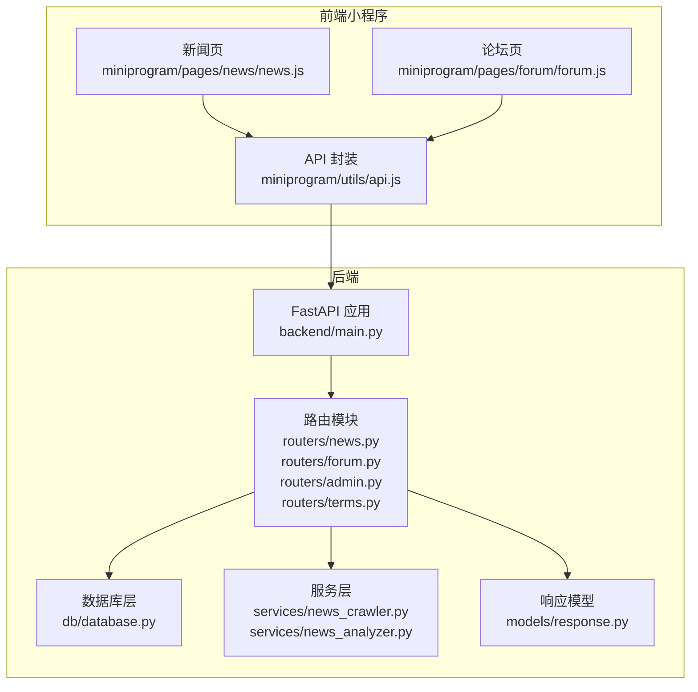
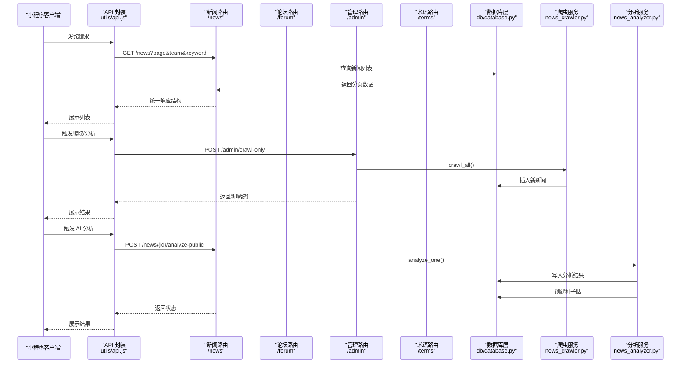
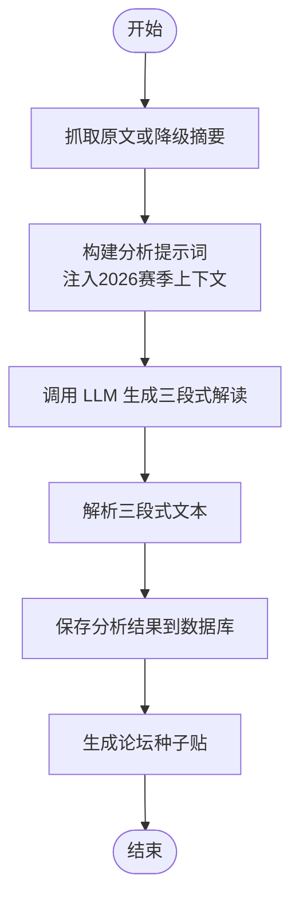
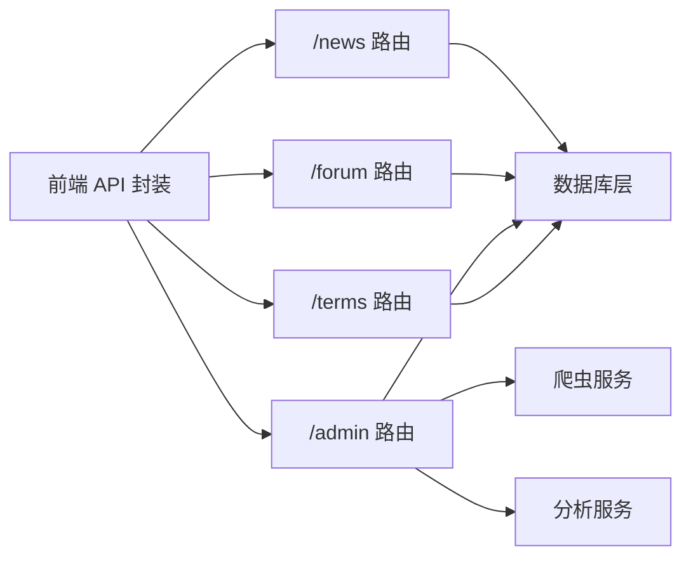

# 内容路由

<cite>
**本文档引用的文件**
- [backend/main.py](file://backend/main.py)
- [backend/routers/news.py](file://backend/routers/news.py)
- [backend/routers/forum.py](file://backend/routers/forum.py)
- [backend/routers/admin.py](file://backend/routers/admin.py)
- [backend/routers/terms.py](file://backend/routers/terms.py)
- [backend/db/database.py](file://backend/db/database.py)
- [backend/services/news_crawler.py](file://backend/services/news_crawler.py)
- [backend/services/news_analyzer.py](file://backend/services/news_analyzer.py)
- [backend/models/response.py](file://backend/models/response.py)
- [miniprogram/utils/api.js](file://miniprogram/utils/api.js)
- [miniprogram/pages/news/news.js](file://miniprogram/pages/news/news.js)
- [miniprogram/pages/forum/forum.js](file://miniprogram/pages/forum/forum.js)
</cite>

## 目录
1. [简介](#简介)
2. [项目结构](#项目结构)
3. [核心组件](#核心组件)
4. [架构总览](#架构总览)
5. [详细组件分析](#详细组件分析)
6. [依赖关系分析](#依赖关系分析)
7. [性能考虑](#性能考虑)
8. [故障排除指南](#故障排除指南)
9. [结论](#结论)
10. [附录](#附录)

## 简介
本文件面向内容路由模块，系统性文档化 /news、/forum、/admin、/terms 四大路由的功能与实现，覆盖新闻资讯、论坛社区、内容管理、术语管理等核心能力。文档包含：
- 端点 URL 模式、请求参数、响应格式与权限控制
- 完整 API 使用示例（新闻爬取、帖子发布、用户管理等）
- 内容系统的架构设计与数据流说明
- 前后端交互流程与缓存策略

## 项目结构
内容路由模块位于后端的 routers 子目录，配合数据库层、服务层与前端小程序页面共同构成完整的内容生态。

**图表来源**
- [backend/main.py:36-41](file://backend/main.py#L36-L41)
- [backend/routers/news.py:20](file://backend/routers/news.py#L20)
- [backend/routers/forum.py:33](file://backend/routers/forum.py#L33)
- [backend/routers/admin.py:25](file://backend/routers/admin.py#L25)
- [backend/routers/terms.py:6](file://backend/routers/terms.py#L6)
- [backend/db/database.py:26-159](file://backend/db/database.py#L26-L159)
- [backend/services/news_crawler.py:15](file://backend/services/news_crawler.py#L15)
- [backend/services/news_analyzer.py:13](file://backend/services/news_analyzer.py#L13)
- [backend/models/response.py:4](file://backend/models/response.py#L4)
- [miniprogram/utils/api.js:123](file://miniprogram/utils/api.js#L123)
- [miniprogram/pages/news/news.js:4](file://miniprogram/pages/news/news.js#L4)
- [miniprogram/pages/forum/forum.js:4](file://miniprogram/pages/forum/forum.js#L4)

**章节来源**
- [backend/main.py:36-41](file://backend/main.py#L36-L41)
- [backend/routers/news.py:20](file://backend/routers/news.py#L20)
- [backend/routers/forum.py:33](file://backend/routers/forum.py#L33)
- [backend/routers/admin.py:25](file://backend/routers/admin.py#L25)
- [backend/routers/terms.py:6](file://backend/routers/terms.py#L6)
- [backend/db/database.py:26-159](file://backend/db/database.py#L26-L159)

## 核心组件
- 路由器：news、forum、admin、terms，分别提供资讯、论坛、管理、术语相关接口
- 数据库层：统一的 SQLite 模式，涵盖 news、news_analysis、posts、comments、users、sections、terms 等表
- 服务层：news_crawler（RSS 爬虫）、news_analyzer（AI 分析与种子贴生成）
- 响应模型：统一的 ok/err 返回结构
- 前端封装：miniprogram/utils/api.js 提供缓存与重试机制，简化调用

**章节来源**
- [backend/routers/news.py:12-25](file://backend/routers/news.py#L12-L25)
- [backend/routers/forum.py:21-33](file://backend/routers/forum.py#L21-L33)
- [backend/routers/admin.py:17-27](file://backend/routers/admin.py#L17-L27)
- [backend/routers/terms.py:1-11](file://backend/routers/terms.py#L1-L11)
- [backend/db/database.py:26-159](file://backend/db/database.py#L26-L159)
- [backend/models/response.py:4](file://backend/models/response.py#L4)

## 架构总览
内容路由模块采用“路由器 + 数据库 + 服务层”的分层设计，结合定时任务与前端缓存，形成完整的资讯采集、分析与展示闭环。

**图表来源**
- [backend/routers/news.py:68-82](file://backend/routers/news.py#L68-L82)
- [backend/routers/admin.py:148-165](file://backend/routers/admin.py#L148-L165)
- [backend/services/news_crawler.py:119-129](file://backend/services/news_crawler.py#L119-L129)
- [backend/services/news_analyzer.py:220-257](file://backend/services/news_analyzer.py#L220-L257)
- [miniprogram/utils/api.js:154-169](file://miniprogram/utils/api.js#L154-L169)

## 详细组件分析

### 新闻路由 /news
- 功能概览
  - 列表分页与过滤（支持按车队与关键词）
  - 详情展示（含 AI 三段式分析）
  - 车队标签匹配（基于标题/摘要关键词）
  - 关联帖子查询
  - AI 分析触发（公开与管理员两种入口）
  - 管理员手动触发爬虫与分析

- 权限控制
  - 爬虫与分析触发需管理员 Token（Header: X-Admin-Token）

- 端点定义
  - GET /news?page&page_size&team&keyword
  - GET /news/{id}
  - GET /news/{id}/teams
  - GET /news/{id}/posts
  - POST /news/{id}/analyze-public?force
  - POST /news/crawl（管理员）
  - POST /news/{id}/analyze（管理员）

- 响应格式
  - 统一使用 ok(data)/err(msg) 结构
  - 列表返回 items、page、page_size
  - 详情返回完整新闻对象（含 analyzed 标记）

- 关键实现要点
  - 车队标签缓存（10 分钟 TTL）
  - AI 分析异步执行，支持强制重算
  - 管理员 Token 校验

**章节来源**
- [backend/routers/news.py:12-25](file://backend/routers/news.py#L12-L25)
- [backend/routers/news.py:68-82](file://backend/routers/news.py#L68-L82)
- [backend/routers/news.py:86-102](file://backend/routers/news.py#L86-L102)
- [backend/routers/news.py:105-114](file://backend/routers/news.py#L105-L114)
- [backend/routers/news.py:118-124](file://backend/routers/news.py#L118-L124)
- [backend/routers/news.py:128-157](file://backend/routers/news.py#L128-L157)
- [backend/routers/news.py:160-169](file://backend/routers/news.py#L160-L169)
- [backend/routers/news.py:172-189](file://backend/routers/news.py#L172-L189)

#### 新闻 AI 分析流程

**图表来源**
- [backend/services/news_analyzer.py:220-257](file://backend/services/news_analyzer.py#L220-L257)
- [backend/services/news_analyzer.py:259-284](file://backend/services/news_analyzer.py#L259-L284)

### 论坛路由 /forum
- 功能概览
  - 用户注册/登录（微信 code → openid）
  - 分区列表（按赛事/车队分类）
  - 帖子列表（支持最新/热门排序）
  - 帖子详情与浏览计数
  - 发帖（支持关联新闻）
  - 删除帖子（仅作者）
  - 点赞/点踩
  - 评论列表与发表

- 权限控制
  - 用户操作需提供 openid
  - 删除帖子需验证作者身份
  - 管理员审核接口独立于 /forum

- 端点定义
  - POST /forum/users/register
  - GET /forum/users/me?openid
  - GET /forum/sections
  - GET /forum/posts?section_id&page&sort
  - GET /forum/posts/{id}
  - POST /forum/posts
  - DELETE /forum/posts/{id}
  - POST /forum/posts/{id}/like
  - GET /forum/posts/{id}/like
  - GET /forum/posts/{id}/comments
  - POST /forum/posts/{id}/comments

- 响应格式
  - 统一 ok(data)/err(msg)
  - 列表返回 items、page、page_size、total

- 关键实现要点
  - 分区缓存（1 小时 TTL）
  - 内容长度与字符合法性校验
  - 审核状态控制（pending/approved/rejected）

**章节来源**
- [backend/routers/forum.py:89-119](file://backend/routers/forum.py#L89-L119)
- [backend/routers/forum.py:125-139](file://backend/routers/forum.py#L125-L139)
- [backend/routers/forum.py:153-179](file://backend/routers/forum.py#L153-L179)
- [backend/routers/forum.py:181-193](file://backend/routers/forum.py#L181-L193)
- [backend/routers/forum.py:195-230](file://backend/routers/forum.py#L195-L230)
- [backend/routers/forum.py:237-247](file://backend/routers/forum.py#L237-L247)
- [backend/routers/forum.py:255-274](file://backend/routers/forum.py#L255-L274)
- [backend/routers/forum.py:285-327](file://backend/routers/forum.py#L285-L327)

### 管理路由 /admin
- 功能概览
  - 待审核帖子/评论列表
  - 帖子/评论审核（通过/拒绝）
  - 爬虫触发（一键爬取 + 分析）
  - 单条新闻分析（支持强制重算）
  - 清空所有分析记录
  - 术语审核（待审核列表、通过/拒绝）

- 权限控制
  - 所有端点需管理员 Token（Header: X-Admin-Token）

- 端点定义
  - GET /admin/posts?page&page_size
  - POST /admin/posts/{id}/approve
  - POST /admin/posts/{id}/reject
  - GET /admin/comments?page&page_size
  - POST /admin/comments/{id}/approve
  - POST /admin/comments/{id}/reject
  - POST /admin/crawl
  - POST /admin/crawl-only
  - POST /admin/analyze-one/{news_id}?force
  - DELETE /admin/analyses
  - GET /admin/terms
  - POST /admin/terms/{term_id}/approve
  - POST /admin/terms/{term_id}/reject

- 响应格式
  - 统一 ok(data)/err(msg)

**章节来源**
- [backend/routers/admin.py:40-81](file://backend/routers/admin.py#L40-L81)
- [backend/routers/admin.py:87-128](file://backend/routers/admin.py#L87-L128)
- [backend/routers/admin.py:134-192](file://backend/routers/admin.py#L134-L192)
- [backend/routers/admin.py:194-208](file://backend/routers/admin.py#L194-L208)
- [backend/routers/admin.py:214-245](file://backend/routers/admin.py#L214-L245)

### 术语路由 /terms
- 功能概览
  - 术语全量查询（支持分类与难度过滤）
  - 按新闻关联查询术语
  - 术语详情查询
  - 术语提交（用户提交待审核）

- 权限控制
  - 查询与详情为公开
  - 提交需提供 openid（可选）

- 端点定义
  - GET /terms?category&level
  - GET /terms/news/{news_id}
  - GET /terms/{slug}
  - POST /terms/submit

- 响应格式
  - 直接返回 {status, data}

- 关键实现要点
  - 术语全量与按新闻查询均带缓存（10 分钟 TTL）
  - 支持分类枚举校验

**章节来源**
- [backend/routers/terms.py:35-49](file://backend/routers/terms.py#L35-L49)
- [backend/routers/terms.py:52-59](file://backend/routers/terms.py#L52-L59)
- [backend/routers/terms.py:62-67](file://backend/routers/terms.py#L62-L67)
- [backend/routers/terms.py:78-91](file://backend/routers/terms.py#L78-L91)

## 依赖关系分析
- 路由器依赖数据库层提供的 CRUD 接口
- 管理路由依赖服务层的爬虫与分析服务
- 前端通过 API 封装统一调用后端接口，内置缓存与重试

**图表来源**
- [backend/routers/news.py:14](file://backend/routers/news.py#L14)
- [backend/routers/forum.py:24-31](file://backend/routers/forum.py#L24-L31)
- [backend/routers/admin.py:19-23](file://backend/routers/admin.py#L19-L23)
- [backend/routers/terms.py:3](file://backend/routers/terms.py#L3)
- [backend/services/news_crawler.py:10](file://backend/services/news_crawler.py#L10)
- [backend/services/news_analyzer.py:13-16](file://backend/services/news_analyzer.py#L13-L16)
- [miniprogram/utils/api.js:123](file://miniprogram/utils/api.js#L123)

**章节来源**
- [backend/db/database.py:26-159](file://backend/db/database.py#L26-L159)
- [backend/services/news_crawler.py:10](file://backend/services/news_crawler.py#L10)
- [backend/services/news_analyzer.py:13-16](file://backend/services/news_analyzer.py#L13-L16)
- [miniprogram/utils/api.js:123](file://miniprogram/utils/api.js#L123)

## 性能考虑
- 缓存策略
  - 新闻/术语查询默认缓存 5 分钟（小程序侧）
  - 车队标签与分区信息缓存（10 分钟与 1 小时 TTL）
- 并发与索引
  - SQLite WAL 模式提升并发写入稳定性
  - 关键查询建立索引（如新闻发布时间、帖子状态等）
- 异步处理
  - AI 分析与爬取采用后台线程/定时任务，避免阻塞请求
- 前端缓存
  - API 封装提供本地缓存与静默刷新，减少重复请求

**章节来源**
- [backend/routers/news.py:24-35](file://backend/routers/news.py#L24-L35)
- [backend/routers/forum.py:35-46](file://backend/routers/forum.py#L35-L46)
- [backend/db/database.py:94-109](file://backend/db/database.py#L94-L109)
- [miniprogram/utils/api.js:4](file://miniprogram/utils/api.js#L4)

## 故障排除指南
- 常见错误
  - 403 无权限：检查 X-Admin-Token 是否正确传递
  - 404 资讯/术语不存在：确认 ID 或 slug 是否有效
  - 爬取失败：查看服务端日志，确认 RSS 源可用性
  - AI 分析失败：检查 LLM 客户端配置与网络连通性
- 建议排查步骤
  - 核对请求头与参数格式
  - 查看后端日志与定时任务状态
  - 在小程序端清除缓存后重试
  - 管理员端检查待审核列表与审核状态

**章节来源**
- [backend/routers/admin.py:30-34](file://backend/routers/admin.py#L30-L34)
- [backend/routers/news.py:62-65](file://backend/routers/news.py#L62-L65)
- [backend/services/news_crawler.py:119-129](file://backend/services/news_crawler.py#L119-L129)
- [backend/services/news_analyzer.py:220-257](file://backend/services/news_analyzer.py#L220-L257)

## 结论
内容路由模块以清晰的分层设计实现了从资讯采集、AI 分析到社区互动的完整闭环。通过合理的缓存策略与权限控制，既保证了用户体验，也确保了内容质量与安全性。建议后续持续优化 LLM 上下文注入与前端缓存命中率，进一步提升系统性能与稳定性。

## 附录

### API 使用示例（基于前端封装）
- 获取新闻列表（分页、按车队、关键词）
  - 调用：api.getNews(page, team, keyword)
  - 示例：api.getNews(1, 'redbull', 'engine')
- 获取新闻详情
  - 调用：api.getNewsDetail(id)
- 获取新闻关联帖子
  - 调用：api.getNewsPosts(id)
- 触发 AI 分析（公开入口）
  - 调用：api.triggerAnalyzePublic(id, force)
- 用户注册（微信登录）
  - 调用：api.registerUser(code, nickname)
- 获取论坛分区
  - 调用：api.getForumSections()
- 发布帖子
  - 调用：api.createPost(section_id, title, content, openid, news_id)
- 管理员操作（需携带 X-Admin-Token）
  - 触发爬取：api.adminCrawlOnly()
  - 单条分析：api.adminAnalyzeOne(news_id)
  - 审核帖子：api.adminApprovePost(id) / api.adminRejectPost(id)
  - 审核评论：api.adminApproveComment(id) / api.adminRejectComment(id)
  - 术语审核：api.adminApproveTerm(id) / api.adminRejectTerm(id)

**章节来源**
- [miniprogram/utils/api.js:154-169](file://miniprogram/utils/api.js#L154-L169)
- [miniprogram/utils/api.js:172-177](file://miniprogram/utils/api.js#L172-L177)
- [miniprogram/utils/api.js:179-181](file://miniprogram/utils/api.js#L179-L181)
- [miniprogram/utils/api.js:183-191](file://miniprogram/utils/api.js#L183-L191)
- [miniprogram/utils/api.js:227-256](file://miniprogram/utils/api.js#L227-L256)
- [miniprogram/utils/api.js:258-269](file://miniprogram/utils/api.js#L258-L269)
- [miniprogram/utils/api.js:271-279](file://miniprogram/utils/api.js#L271-L279)