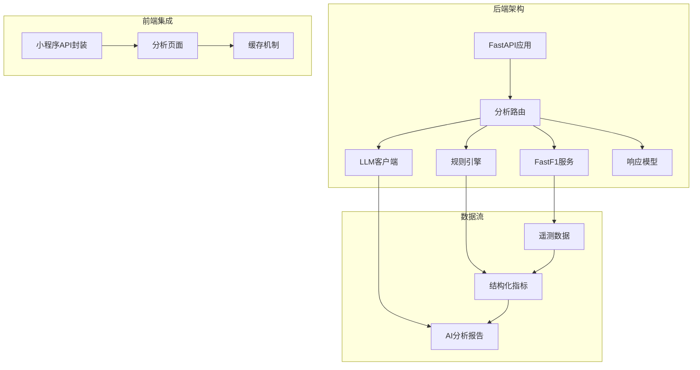
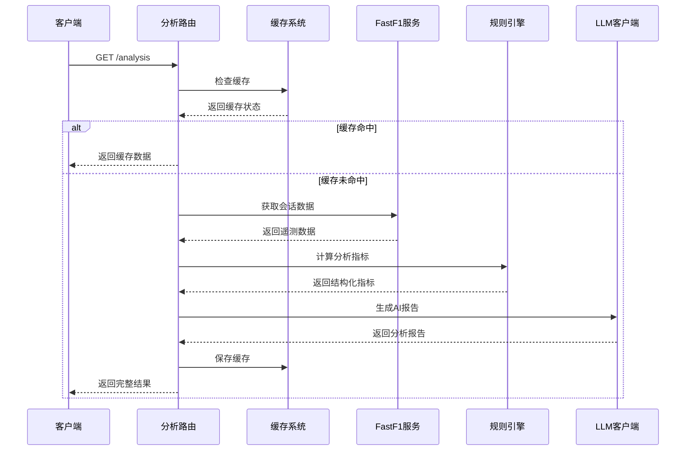
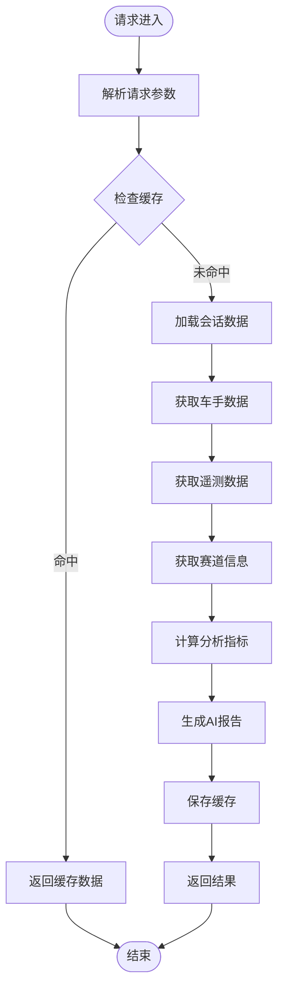
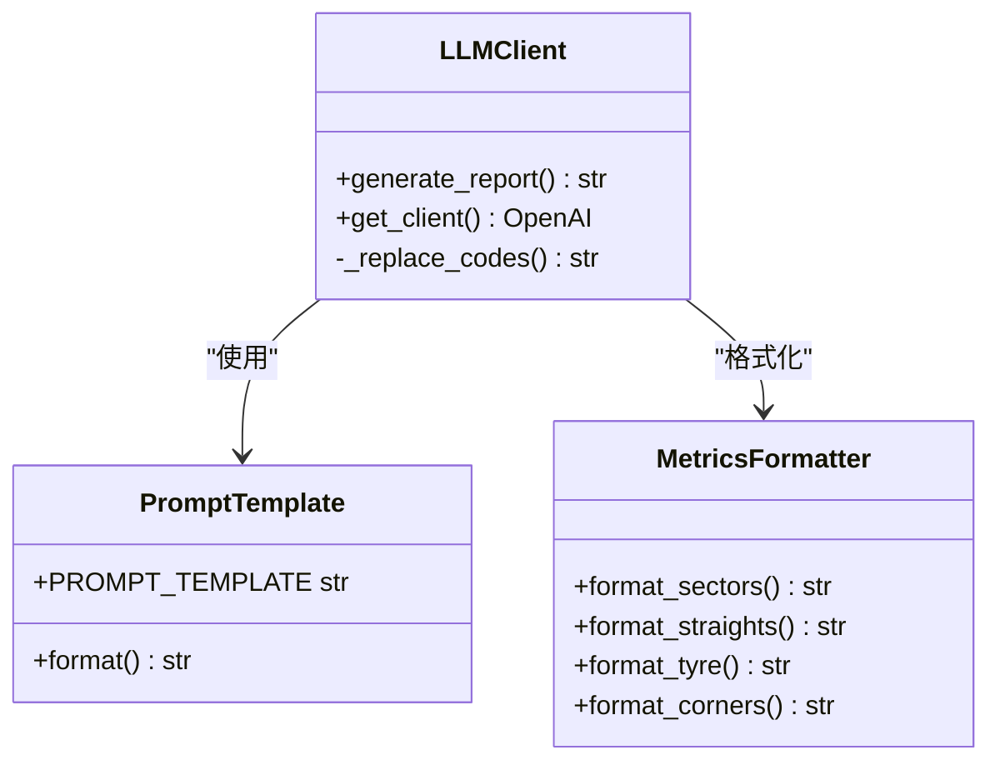
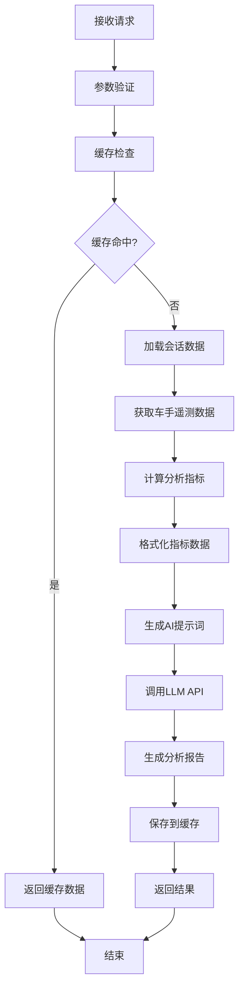
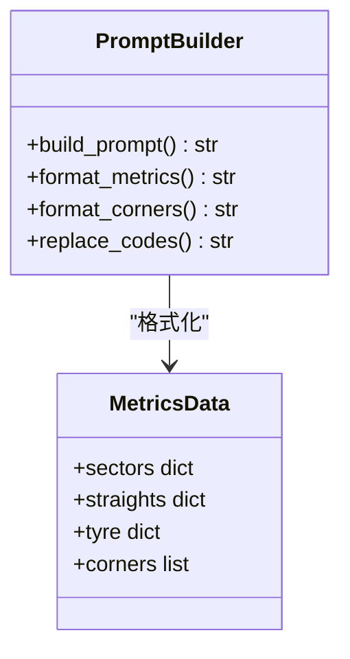
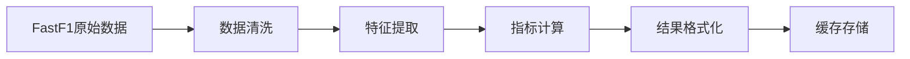

# 分析路由

<cite>
**本文档引用的文件**
- [analysis.py](file://backend/routers/analysis.py)
- [main.py](file://backend/main.py)
- [fastf1_service.py](file://backend/services/fastf1_service.py)
- [rule_engine.py](file://backend/services/rule_engine.py)
- [llm_client.py](file://backend/services/llm_client.py)
- [response.py](file://backend/models/response.py)
- [api.js](file://miniprogram/utils/api.js)
- [analysis.js](file://miniprogram/pages/analysis/analysis.js)
- [architecture.md](file://memory/architecture.md)
</cite>

## 目录
1. [简介](#简介)
2. [项目结构](#项目结构)
3. [核心组件](#核心组件)
4. [架构概览](#架构概览)
5. [详细组件分析](#详细组件分析)
6. [API规范](#api规范)
7. [AI分析工作流程](#ai分析工作流程)
8. [数据处理逻辑](#数据处理逻辑)
9. [性能考虑](#性能考虑)
10. [故障排除指南](#故障排除指南)
11. [结论](#结论)

## 简介

分析路由模块是Fast-F1项目的核心功能模块之一，专门负责生成F1赛车手之间的AI智能分析报告。该模块通过整合FastF1数据获取、规则引擎分析和大语言模型生成，为用户提供深度的赛车技术分析和比较报告。

该模块支持多种分析维度，包括弯角策略分析、赛段时间差对比、直线加速效率评估、轮胎管理稳定性分析等，为F1爱好者和专业人士提供全面的数据驱动洞察。

## 项目结构

分析路由模块位于后端项目的路由系统中，采用清晰的分层架构设计：



**图表来源**
- [main.py:32](file://backend/main.py#L32)
- [analysis.py:10](file://backend/routers/analysis.py#L10)

**章节来源**
- [main.py:1-157](file://backend/main.py#L1-L157)
- [analysis.py:1-121](file://backend/routers/analysis.py#L1-L121)

## 核心组件

分析路由模块由以下核心组件构成：

### 主要路由组件
- **分析路由器** (`/analysis`): 主要的HTTP路由处理器
- **FastF1服务封装**: 提供统一的数据获取接口
- **规则引擎**: 实现多维度数据分析算法
- **LLM客户端**: 调用DeepSeek API生成分析报告
- **响应模型**: 标准化的API响应格式

### 缓存系统
- **服务端文件缓存**: 基于MD5哈希的分析结果缓存
- **前端本地缓存**: 小程序端的stale-while-revalidate缓存策略
- **FastF1本地缓存**: 30分钟TTL的外部API缓存

**章节来源**
- [analysis.py:12-33](file://backend/routers/analysis.py#L12-L33)
- [api.js:4-15](file://miniprogram/utils/api.js#L4-L15)

## 架构概览

分析路由模块采用事件驱动的异步架构，实现了高效的并发处理和智能缓存机制：



**图表来源**
- [analysis.py:45-120](file://backend/routers/analysis.py#L45-L120)
- [fastf1_service.py:14-21](file://backend/services/fastf1_service.py#L14-L21)

## 详细组件分析

### 分析路由核心实现

分析路由的核心功能集中在单个函数中，实现了完整的分析流程：



**图表来源**
- [analysis.py:35-120](file://backend/routers/analysis.py#L35-L120)

### 规则引擎分析算法

规则引擎实现了四个核心分析维度：

#### 弯角分析算法


**图表来源**
- [rule_engine.py:10-61](file://backend/services/rule_engine.py#L10-L61)

#### 赛段时间差分析
- 使用FastF1的Sector时间字段进行精确对比
- 支持S1、S2、S3三个赛段的独立分析
- 自动识别更快的一方并计算时间差

#### 直线效率分析
- 计算最高速度对比
- 统计油门全开时间占比（Throttle > 98%）
- 识别直线加速优势

#### 轮胎稳定性分析
- 计算圈时标准差
- 使用线性回归拟合衰退趋势
- 评估轮胎磨损和性能衰减

**章节来源**
- [rule_engine.py:64-145](file://backend/services/rule_engine.py#L64-L145)

### LLM客户端集成

LLM客户端负责将结构化数据转换为可读的中文分析报告：



**图表来源**
- [llm_client.py:77-135](file://backend/services/llm_client.py#L77-L135)

**章节来源**
- [llm_client.py:1-136](file://backend/services/llm_client.py#L1-L136)

## API规范

### URL模式和端点

分析路由模块提供单一的GET端点：

- **基础URL**: `/analysis`
- **HTTP方法**: `GET`
- **路由前缀**: `/analysis`（在主应用中注册）

### 请求参数

| 参数名 | 类型 | 必需 | 默认值 | 描述 |
|--------|------|------|--------|------|
| year | int | 否 | 2026 | 赛季年份 |
| round_num | int | 否 | None | 轮次编号 |
| event | str | 否 | None | 赛事名称 |
| d1 | str | 否 | "ALB" | 第一个车手代码 |
| d2 | str | 否 | "ALO" | 第二个车手代码 |
| session | str | 否 | "Q" | 会话类型（Q/R/S/FP1/FP2/FP3） |
| force | bool | 否 | False | 是否强制刷新缓存 |

### 响应格式

分析路由返回标准化的JSON响应：

```json
{
  "status": "ok",
  "data": {
    "metrics": {
      "corners": [
        {
          "corner": "T1",
          "min_speed_a": 120.5,
          "min_speed_b": 122.3,
          "min_speed_delta": "-1.8 km/h"
        }
      ],
      "sectors": {
        "S1": {
          "delta": "+0.123s",
          "faster": "ALB"
        }
      },
      "straights": {
        "top_speed_a": 345.2,
        "top_speed_b": 342.8,
        "throttle_pct_a": 65.4,
        "throttle_pct_b": 62.1
      },
      "tyre": {
        "ALB": {
          "std": 0.845,
          "slope": 0.0123
        },
        "ALO": {
          "std": 0.921,
          "slope": 0.0156
        }
      }
    },
    "report": "## 总体结论\n...\n## 赛段分析\n...",
    "cached": false
  },
  "note": null
}
```

### 错误处理

分析路由提供统一的错误处理机制：

- **成功响应**: `status = "ok"`
- **错误响应**: `status = "error"`，包含错误描述
- **异常捕获**: 所有内部异常被捕获并转换为标准错误格式

**章节来源**
- [analysis.py:35-120](file://backend/routers/analysis.py#L35-L120)
- [response.py:9-13](file://backend/models/response.py#L9-L13)

## AI分析工作流程

分析路由的AI分析工作流程是一个多步骤的复杂过程：



**图表来源**
- [analysis.py:45-120](file://backend/routers/analysis.py#L45-L120)
- [llm_client.py:77-135](file://backend/services/llm_client.py#L77-L135)

### 数据准备阶段

在AI分析之前，系统需要准备充分的数据：

1. **会话数据加载**: 使用FastF1库获取指定年份、轮次和会话类型的完整数据
2. **车手数据提取**: 获取两个指定车手的最快圈时间和完整遥测数据
3. **赛道信息获取**: 获取赛道布局、弯角位置和距离信息
4. **指标计算**: 通过规则引擎计算所有分析维度的量化指标

### LLM提示词构建

AI分析报告的生成基于精心设计的提示词模板：



**图表来源**
- [llm_client.py:115-126](file://backend/services/llm_client.py#L115-L126)

**章节来源**
- [llm_client.py:23-67](file://backend/services/llm_client.py#L23-L67)

## 数据处理逻辑

### 数据获取和预处理

分析路由的数据处理遵循严格的流程：



**图表来源**
- [fastf1_service.py:14-63](file://backend/services/fastf1_service.py#L14-L63)

### 缓存策略

系统实现了多层次的缓存策略：

#### 服务端缓存
- **缓存目录**: `backend/cache/analysis/`
- **缓存键**: 基于参数的MD5哈希
- **缓存内容**: 完整的分析结果（指标+报告）
- **缓存失效**: 文件系统层面的持久化

#### 前端缓存
- **缓存TTL**: 30分钟
- **缓存策略**: stale-while-revalidate
- **缓存介质**: 小程序本地存储
- **缓存键**: URL参数组合

#### FastF1缓存
- **缓存目录**: 项目根目录下的FastF1缓存
- **缓存类型**: 外部API响应缓存
- **缓存策略**: 30分钟TTL

**章节来源**
- [analysis.py:16-33](file://backend/routers/analysis.py#L16-L33)
- [api.js:140-148](file://miniprogram/utils/api.js#L140-L148)

## 性能考虑

### 缓存优化

分析路由实现了多层缓存机制来确保高性能：

1. **文件系统缓存**: 基于MD5哈希的持久化缓存
2. **内存缓存**: FastF1库的进程级内存缓存
3. **前端缓存**: 小程序端的本地存储缓存

### 并发处理

系统支持高并发请求处理：

- **异步处理**: LLM调用采用异步非阻塞方式
- **连接池**: HTTP客户端使用连接池复用
- **超时控制**: 20秒请求超时，自动重试机制

### 内存管理

- **进程级缓存**: 避免重复加载相同会话数据
- **数据清理**: 及时释放不再使用的中间数据
- **垃圾回收**: 定期清理无用对象

**章节来源**
- [architecture.md:131-175](file://memory/architecture.md#L131-L175)

## 故障排除指南

### 常见问题和解决方案

#### 缓存相关问题
- **问题**: 缓存数据过期但未更新
- **解决**: 使用`force=true`参数强制刷新
- **预防**: 定期检查缓存目录空间

#### LLM调用失败
- **问题**: AI分析生成失败
- **解决**: 检查DEEPSEEK_API_KEY配置
- **预防**: 实施重试机制和降级策略

#### 数据获取超时
- **问题**: FastF1数据加载超时
- **解决**: 检查网络连接和API可用性
- **预防**: 实施超时重试和错误降级

### 调试工具

#### 日志记录
- **请求日志**: 记录所有API请求和响应
- **性能日志**: 监控缓存命中率和响应时间
- **错误日志**: 捕获和记录所有异常

#### 性能监控
- **缓存命中率**: 监控缓存使用效率
- **响应时间**: 统计平均响应时间和峰值
- **错误率**: 跟踪API调用成功率

**章节来源**
- [analysis.py:119-120](file://backend/routers/analysis.py#L119-L120)

## 结论

分析路由模块是Fast-F1项目中最具技术复杂性的组件之一，它成功地将多个技术栈整合在一起，为用户提供高质量的AI分析服务。

### 主要成就

1. **完整的分析体系**: 实现了从数据获取到报告生成的全流程自动化
2. **高性能架构**: 通过多层缓存和优化策略确保快速响应
3. **可扩展设计**: 模块化架构便于功能扩展和维护
4. **用户体验优化**: 前后端协同的缓存策略提供流畅的使用体验

### 技术亮点

- **智能缓存机制**: 文件系统、内存和前端三层缓存协同工作
- **多维度分析**: 四个核心分析维度提供全面的技术洞察
- **AI集成**: DeepSeek LLM的自然语言生成能力
- **错误处理**: 完善的异常捕获和降级机制

### 未来发展方向

1. **分析维度扩展**: 可以添加更多专业的技术分析指标
2. **个性化定制**: 支持用户自定义分析参数和报告格式
3. **实时分析**: 实现更接近实时的数据分析能力
4. **多语言支持**: 扩展到其他语言的分析报告生成

分析路由模块不仅展示了现代Web应用的最佳实践，也为F1数据分析领域提供了创新的解决方案。