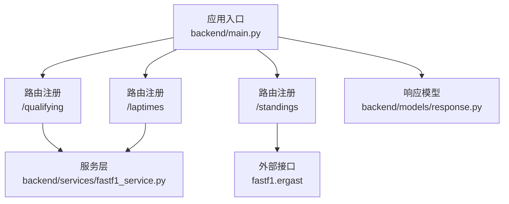
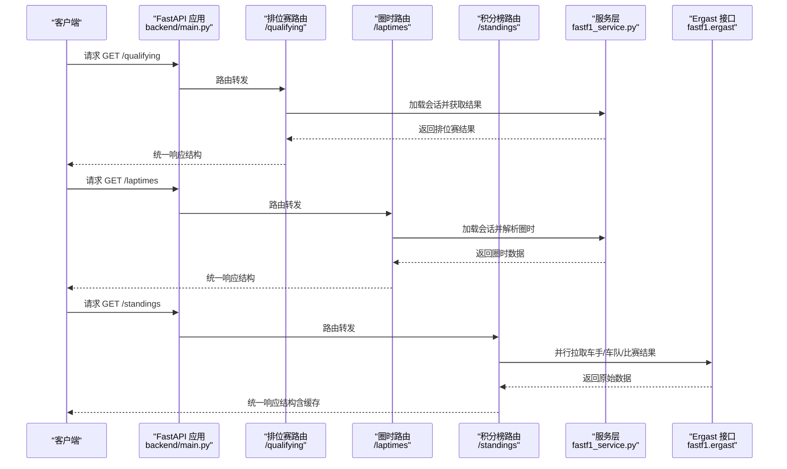
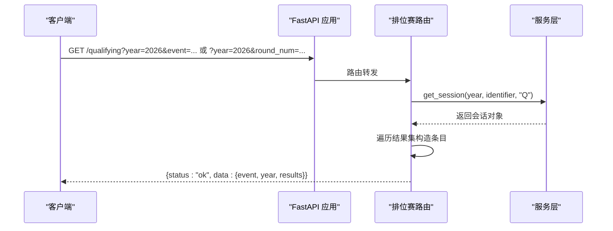
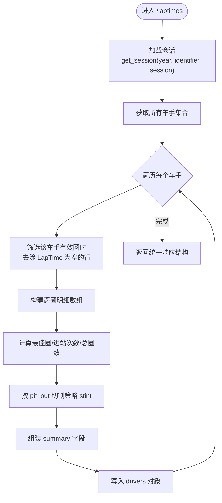
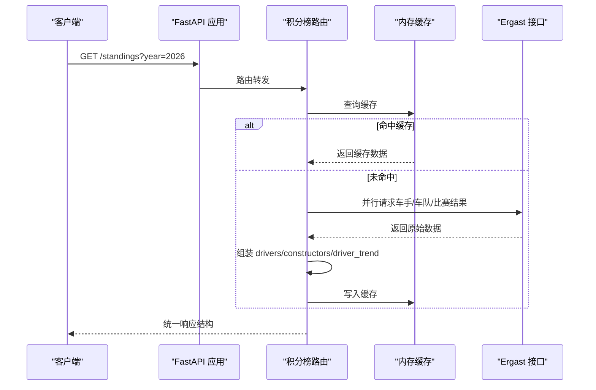
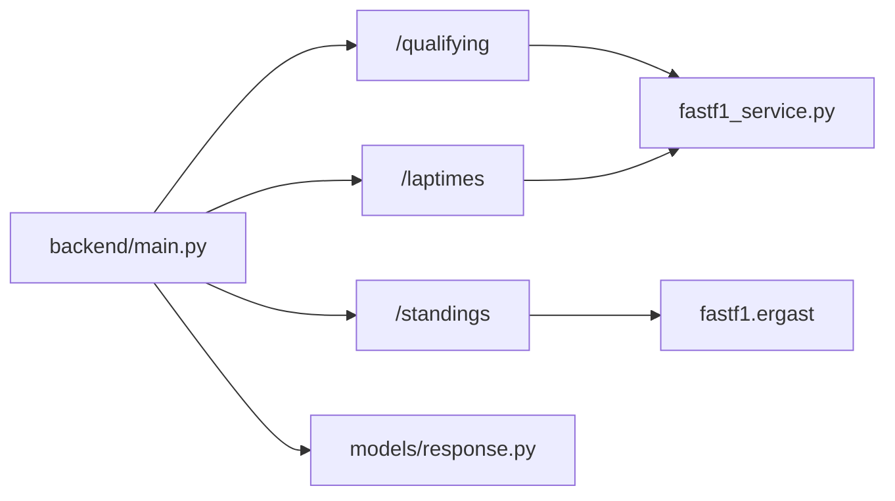

# 排位赛、圈时与积分榜路由

<cite>
**本文引用的文件**
- [backend/main.py](file://backend/main.py)
- [backend/routers/qualifying.py](file://backend/routers/qualifying.py)
- [backend/routers/laptimes.py](file://backend/routers/laptimes.py)
- [backend/routers/standings.py](file://backend/routers/standings.py)
- [backend/services/fastf1_service.py](file://backend/services/fastf1_service.py)
- [backend/models/response.py](file://backend/models/response.py)
- [examples/results_strategy/plot_qualifying_results.py](file://examples/results_strategy/plot_qualifying_results.py)
- [examples/lap_times/plot_driver_laptimes.py](file://examples/lap_times/plot_driver_laptimes.py)
- [examples/standings/plot_season_summary.py](file://examples/standings/plot_season_summary.py)
</cite>

## 目录
1. [简介](#简介)
2. [项目结构](#项目结构)
3. [核心组件](#核心组件)
4. [架构概览](#架构概览)
5. [详细组件分析](#详细组件分析)
6. [依赖分析](#依赖分析)
7. [性能考虑](#性能考虑)
8. [故障排查指南](#故障排查指南)
9. [结论](#结论)
10. [附录](#附录)

## 简介
本文件聚焦于 Fast-F1 后端的三类核心路由：排位赛（/qualifying）、圈时（/laptimes）、积分榜（/standings）。文档覆盖以下内容：
- 路由功能与实现要点
- URL 模式、请求参数、响应格式与数据结构
- 数据获取流程与缓存/预热机制
- 实际使用示例（结果查询、圈时对比、积分统计）
- 错误处理与常见问题排查

## 项目结构
后端采用 FastAPI 架构，路由通过 include_router 注册到根应用。排位赛、圈时与积分榜路由分别位于独立模块，统一由响应模型封装返回。

图表来源
- [backend/main.py:28-41](file://backend/main.py#L28-L41)
- [backend/routers/qualifying.py:1-30](file://backend/routers/qualifying.py#L1-L30)
- [backend/routers/laptimes.py:1-121](file://backend/routers/laptimes.py#L1-L121)
- [backend/routers/standings.py:1-145](file://backend/routers/standings.py#L1-L145)
- [backend/services/fastf1_service.py:14-35](file://backend/services/fastf1_service.py#L14-L35)
- [backend/models/response.py:4-14](file://backend/models/response.py#L4-L14)

章节来源
- [backend/main.py:28-41](file://backend/main.py#L28-L41)

## 核心组件
- 应用入口与路由挂载：在应用启动时注册 /qualifying、/laptimes、/standings 等路由，并启用 CORS、缓存与定时任务。
- 服务层封装：统一管理 FastF1 会话加载、时间格式化、遥测数据转换等。
- 响应模型：统一返回结构包含状态、数据与说明，便于前端解析与错误提示。

章节来源
- [backend/main.py:18-41](file://backend/main.py#L18-L41)
- [backend/services/fastf1_service.py:14-35](file://backend/services/fastf1_service.py#L14-L35)
- [backend/models/response.py:4-14](file://backend/models/response.py#L4-L14)

## 架构概览
下图展示请求从客户端到各路由、服务层与外部数据源的交互路径。

图表来源
- [backend/main.py:28-41](file://backend/main.py#L28-L41)
- [backend/routers/qualifying.py:7-29](file://backend/routers/qualifying.py#L7-L29)
- [backend/routers/laptimes.py:38-110](file://backend/routers/laptimes.py#L38-L110)
- [backend/routers/standings.py:64-144](file://backend/routers/standings.py#L64-L144)
- [backend/services/fastf1_service.py:14-35](file://backend/services/fastf1_service.py#L14-L35)

## 详细组件分析

### 排位赛路由（/qualifying）
- 功能概述
  - 提供指定年份与分站或事件名称的排位赛结果，包含每名车手的 Q1/Q2/Q3 时间与队伍信息。
- URL 模式与参数
  - 方法：GET
  - 路径：/qualifying
  - 查询参数：
    - year: 年份（默认 2026）
    - round_num: 分站轮次编号（可选）
    - event: 事件名称（可选，与 round_num 二选一）
- 响应结构
  - 字段：
    - event: 事件名称
    - year: 年份
    - results: 列表，每项包含 position、driver、team、q1、q2、q3
- 数据来源与处理
  - 通过服务层加载指定会话（类型 Q），遍历结果集构造响应。
  - 时间字段使用统一格式化函数输出。
- 错误处理
  - 异常捕获并以统一错误响应返回。

图表来源
- [backend/routers/qualifying.py:7-29](file://backend/routers/qualifying.py#L7-L29)
- [backend/services/fastf1_service.py:14-35](file://backend/services/fastf1_service.py#L14-L35)

章节来源
- [backend/routers/qualifying.py:7-29](file://backend/routers/qualifying.py#L7-L29)
- [backend/services/fastf1_service.py:24-35](file://backend/services/fastf1_service.py#L24-L35)

### 圈时路由（/laptimes）
- 功能概述
  - 提供指定年份、分站或事件名称的圈时数据，支持按会话类型（默认 R）查询；返回每位车手的逐圈时间、最佳圈、进站次数、轮胎策略等汇总信息。
- URL 模式与参数
  - 方法：GET
  - 路径：/laptimes
  - 查询参数：
    - year: 年份（默认 2026）
    - round_num: 分站轮次编号（可选）
    - event: 事件名称（可选，与 round_num 二选一）
    - session: 会话类型（默认 R，可选 Q/R/S 等）
- 响应结构
  - 字段：
    - event: 事件名称
    - year: 年份
    - session: 会话类型
    - drivers: 对象，键为车号/车手标识，值包含 team、laps（逐圈明细）、summary（汇总统计）
  - 汇总统计字段：
    - final_position: 最终排名
    - best_lap_s: 最佳圈（秒）
    - best_lap_fmt: 最佳圈（格式化字符串）
    - pit_count: 进站次数
    - total_laps: 总圈数
    - stints: 轮胎策略（compound、laps）
- 数据处理逻辑
  - 逐车过滤有效圈时，计算最佳圈、进站次数、按 pit_out 切割策略 stint。
  - 对 NaN/NaT 做安全处理，确保可序列化。
- 错误处理
  - 异常捕获并以统一错误响应返回。

图表来源
- [backend/routers/laptimes.py:38-110](file://backend/routers/laptimes.py#L38-L110)
- [backend/services/fastf1_service.py:14-35](file://backend/services/fastf1_service.py#L14-L35)

章节来源
- [backend/routers/laptimes.py:38-121](file://backend/routers/laptimes.py#L38-L121)
- [backend/services/fastf1_service.py:24-35](file://backend/services/fastf1_service.py#L24-L35)

### 积分榜路由（/standings）
- 功能概述
  - 提供指定年份的车手积分榜、车队积分榜及前五车手的累计积分趋势；内部包含内存缓存与 TTL 控制。
- URL 模式与参数
  - 方法：GET
  - 路径：/standings
  - 查询参数：
    - year: 年份（默认 2026）
- 响应结构
  - 字段：
    - year: 年份
    - drivers: 车手积分榜列表（position、driver、name、team、points、wins、color）
    - constructors: 车队积分榜列表（position、team、points、wins、color）
    - driver_trend: 前五车手累计积分序列（code、color、series）
- 数据来源与处理
  - 并行拉取 Ergast 的车手/车队积分与每轮比赛结果，合并生成趋势序列。
  - 车队颜色映射基于团队名称模糊匹配。
  - 内置内存缓存（TTL=2小时），命中则直接返回。
- 错误处理
  - 异常捕获并以统一错误响应返回；趋势计算失败不影响主数据返回。

图表来源
- [backend/routers/standings.py:64-144](file://backend/routers/standings.py#L64-L144)
- [backend/main.py:100-114](file://backend/main.py#L100-L114)

章节来源
- [backend/routers/standings.py:64-145](file://backend/routers/standings.py#L64-L145)
- [backend/main.py:100-114](file://backend/main.py#L100-L114)

## 依赖分析
- 路由到服务层
  - /qualifying 与 /laptimes 依赖服务层的会话加载与时间格式化。
  - /standings 依赖 fastf1.ergast 并行接口与内存缓存。
- 应用层集成
  - 主应用在启动时启用 CORS、缓存目录、定时任务与后台预热，保障路由可用性与性能。

图表来源
- [backend/main.py:28-41](file://backend/main.py#L28-L41)
- [backend/routers/qualifying.py:1-3](file://backend/routers/qualifying.py#L1-L3)
- [backend/routers/laptimes.py:1-4](file://backend/routers/laptimes.py#L1-L4)
- [backend/routers/standings.py:1-8](file://backend/routers/standings.py#L1-L8)
- [backend/models/response.py:1-14](file://backend/models/response.py#L1-L14)

章节来源
- [backend/main.py:28-41](file://backend/main.py#L28-L41)
- [backend/routers/qualifying.py:1-3](file://backend/routers/qualifying.py#L1-L3)
- [backend/routers/laptimes.py:1-4](file://backend/routers/laptimes.py#L1-L4)
- [backend/routers/standings.py:1-8](file://backend/routers/standings.py#L1-L8)
- [backend/models/response.py:1-14](file://backend/models/response.py#L1-L14)

## 性能考虑
- 进程级会话缓存：同一进程内对相同会话仅加载一次，减少重复 IO。
- 内存缓存：积分榜数据按年份缓存，TTL=2小时，降低外部接口压力。
- 后台预热：启动后异步加载已有缓存的会话与关键 API，缩短首次请求延迟。
- 并行拉取：积分榜内部并行请求多个 Ergast 接口，提升聚合效率。
- 安全数值处理：对 NaN/NaT 做显式判断与默认值处理，避免序列化异常。

章节来源
- [backend/services/fastf1_service.py:11-21](file://backend/services/fastf1_service.py#L11-L21)
- [backend/routers/standings.py:27-42](file://backend/routers/standings.py#L27-L42)
- [backend/main.py:55-115](file://backend/main.py#L55-L115)

## 故障排查指南
- 通用错误
  - 所有路由均通过统一错误响应返回，检查 note 字段获取具体错误信息。
- 排位赛
  - 若传入的 year/round_num/event 不匹配或会话不可用，将返回错误响应。
- 圈时
  - 当某车手无有效圈时数据或会话加载失败，将跳过该车手并继续处理其他车手。
  - NaN/NaT 字段会被安全处理为默认值，确保响应可序列化。
- 积分榜
  - 外部接口异常或趋势计算失败不会影响主数据返回；可检查缓存是否命中或清理缓存后重试。

章节来源
- [backend/routers/qualifying.py:28-29](file://backend/routers/qualifying.py#L28-L29)
- [backend/routers/laptimes.py:109-110](file://backend/routers/laptimes.py#L109-L110)
- [backend/routers/standings.py:143-144](file://backend/routers/standings.py#L143-L144)
- [backend/models/response.py:9-13](file://backend/models/response.py#L9-L13)

## 结论
- /qualifying、/laptimes、/standings 三路由围绕 FastF1 会话与 Ergast 数据进行聚合，提供稳定的 API 输出。
- 通过进程级缓存、内存缓存与后台预热，显著提升响应速度与稳定性。
- 统一的响应模型与错误处理使前端对接更简单可靠。

## 附录

### API 使用示例（概念性说明）
- 排位赛结果查询
  - 示例：GET /qualifying?year=2026&event=摩纳哥大奖赛
  - 用途：获取排位赛 Q1/Q2/Q3 成绩与车手/车队信息。
- 圈时对比分析
  - 示例：GET /laptimes?year=2026&event=摩纳哥大奖赛&session=R
  - 用途：对比不同车手的逐圈时间、最佳圈、进站与轮胎策略。
- 积分统计与趋势
  - 示例：GET /standings?year=2026
  - 用途：获取车手/车队当前积分、胜场与前五车手累计积分趋势。

### 数据结构参考（来自示例与实现）
- 排位赛结果条目
  - 字段：position、driver、team、q1、q2、q3
- 圈时明细与汇总
  - 明细：lap、time、time_s、compound、tyre_life、pit_in、pit_out、position
  - 汇总：final_position、best_lap_s、best_lap_fmt、pit_count、total_laps、stints
- 积分榜条目
  - 车手：position、driver、name、team、points、wins、color
  - 车队：position、team、points、wins、color
  - 趋势：code、color、series（轮次累积）

章节来源
- [examples/results_strategy/plot_qualifying_results.py:21-60](file://examples/results_strategy/plot_qualifying_results.py#L21-L60)
- [examples/lap_times/plot_driver_laptimes.py:22-47](file://examples/lap_times/plot_driver_laptimes.py#L22-L47)
- [examples/standings/plot_season_summary.py:17-70](file://examples/standings/plot_season_summary.py#L17-L70)