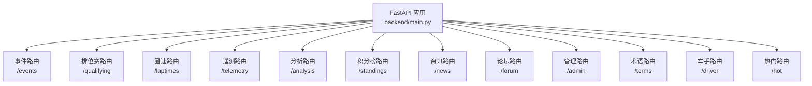
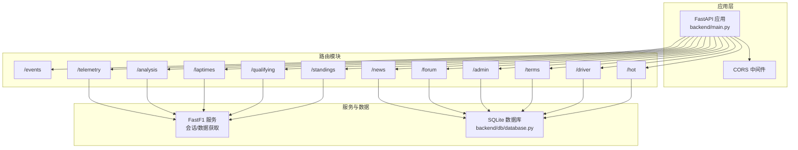
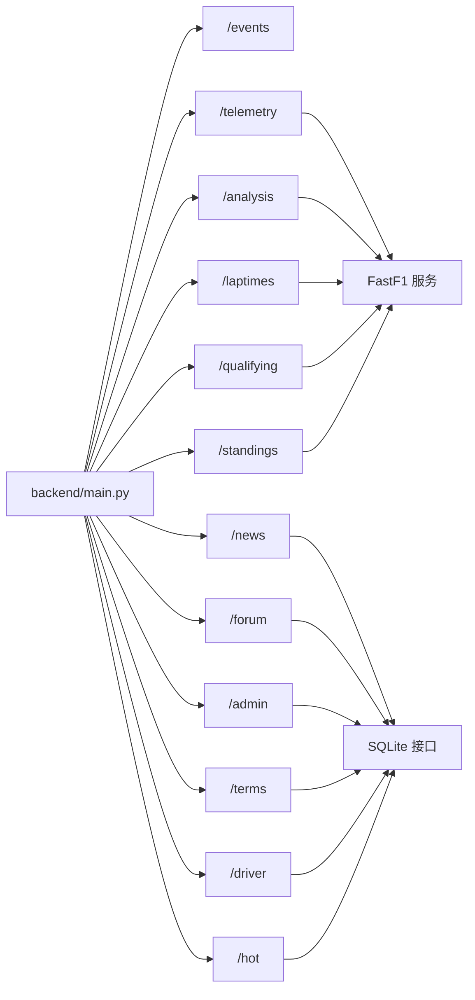

# 路由系统

<cite>
**本文引用的文件**
- [backend/main.py](file://backend/main.py)
- [backend/routers/events.py](file://backend/routers/events.py)
- [backend/routers/telemetry.py](file://backend/routers/telemetry.py)
- [backend/routers/analysis.py](file://backend/routers/analysis.py)
- [backend/routers/news.py](file://backend/routers/news.py)
- [backend/routers/forum.py](file://backend/routers/forum.py)
- [backend/routers/admin.py](file://backend/routers/admin.py)
- [backend/routers/terms.py](file://backend/routers/terms.py)
- [backend/routers/driver.py](file://backend/routers/driver.py)
- [backend/routers/hot.py](file://backend/routers/hot.py)
- [backend/routers/standings.py](file://backend/routers/standings.py)
- [backend/routers/laptimes.py](file://backend/routers/laptimes.py)
- [backend/routers/qualifying.py](file://backend/routers/qualifying.py)
- [backend/models/response.py](file://backend/models/response.py)
- [backend/db/database.py](file://backend/db/database.py)
</cite>

## 目录
1. [简介](#简介)
2. [项目结构](#项目结构)
3. [核心组件](#核心组件)
4. [架构总览](#架构总览)
5. [详细组件分析](#详细组件分析)
6. [依赖关系分析](#依赖关系分析)
7. [性能考量](#性能考量)
8. [故障排查指南](#故障排查指南)
9. [结论](#结论)
10. [附录](#附录)

## 简介
本文件系统化梳理 FastAPI 路由系统的组织与实现，覆盖事件路由(/events)、遥测路由(/telemetry)、分析路由(/analysis)、内容路由(/news, /forum, /admin, /terms, /driver, /hot, /standings, /laptimes, /qualifying)等模块。文档说明各模块功能职责、URL 模式与标签分类，解释路由注册流程与前缀配置，总结设计原则与命名约定，并提供完整端点清单与使用示例。

## 项目结构
后端采用“按功能域划分”的路由模块组织方式，入口文件集中注册所有子路由，统一挂载 CORS 中间件与基础根路径响应。数据库层以 SQLite 为核心，提供资讯、论坛、术语、车手评分与评论等表结构与常用查询接口。

图表来源
- [backend/main.py:27-41](file://backend/main.py#L27-L41)

章节来源
- [backend/main.py:1-157](file://backend/main.py#L1-L157)

## 核心组件
- 应用与中间件
  - 创建 FastAPI 实例，启用 CORS，设置标题与版本。
  - 在应用启动时初始化数据库，启动后台预热与定时任务。
- 路由注册
  - 通过 include_router 按模块注册，统一设置前缀与标签，便于 OpenAPI 文档分类与客户端识别。
- 响应模型
  - 统一返回结构 APIResponse(ok/err)，简化错误与提示传递。

章节来源
- [backend/main.py:18-41](file://backend/main.py#L18-L41)
- [backend/models/response.py:1-14](file://backend/models/response.py#L1-L14)

## 架构总览
路由系统遵循“入口集中注册 + 功能域独立模块”的分层设计。每个模块内部封装：
- 路由器定义与端点函数
- 参数校验与业务逻辑
- 缓存策略与异常处理
- 对数据库层的调用与事务控制

图表来源
- [backend/main.py:27-41](file://backend/main.py#L27-L41)
- [backend/routers/telemetry.py:1-79](file://backend/routers/telemetry.py#L1-L79)
- [backend/routers/analysis.py:1-121](file://backend/routers/analysis.py#L1-L121)
- [backend/routers/laptimes.py:1-121](file://backend/routers/laptimes.py#L1-L121)
- [backend/routers/qualifying.py:1-30](file://backend/routers/qualifying.py#L1-L30)
- [backend/routers/standings.py:1-145](file://backend/routers/standings.py#L1-L145)
- [backend/db/database.py:1-200](file://backend/db/database.py#L1-L200)

## 详细组件分析

### 事件路由 (/events)
- 功能职责
  - 提供 F1 赛历列表与按轮次的赛道静态信息。
  - 内置内存缓存，降低 FastF1 查询开销。
- URL 模式与标签
  - GET /events → 返回指定年份的完整赛历
  - GET /events/{round_num}/circuit → 返回指定轮次的赛道信息
- 设计要点
  - 使用缓存键“events:year”与“circuit:year:round”，TTL 6 小时。
  - 赛道信息来自内置字典，包含中英文名称、地理与特性描述、轮胎策略等。

章节来源
- [backend/routers/events.py:21-53](file://backend/routers/events.py#L21-L53)
- [backend/routers/events.py:480-505](file://backend/routers/events.py#L480-L505)

### 遥测路由 (/telemetry)
- 功能职责
  - 获取两位车手在指定比赛/练习会话中的遥测数据，计算最快圈时间差与关键弯角标注。
- URL 模式与标签
  - GET /telemetry → 支持 year、round_num/event、d1、d2、session 等参数
- 设计要点
  - 自动选择 round_num 或 event 作为标识；默认 Q 会话。
  - 数据质量检查：若最大距离小于预期阈值，返回 note 提示数据截断。
  - 车队颜色与团队信息通过绘图模块解析。

章节来源
- [backend/routers/telemetry.py:11-79](file://backend/routers/telemetry.py#L11-L79)

### 分析路由 (/analysis)
- 功能职责
  - 结合规则引擎与 LLM 生成技术分析报告，支持缓存与强制刷新。
- URL 模式与标签
  - GET /analysis → 支持 year、round_num/event、d1、d2、session、force
- 设计要点
  - 缓存目录位于 analysis 子目录，缓存键基于参数组合的 MD5。
  - 强制刷新(force=true)可绕过缓存；LLM 报告包含车手全名、会话类型映射等上下文。

章节来源
- [backend/routers/analysis.py:35-121](file://backend/routers/analysis.py#L35-L121)

### 圈速路由 (/laptimes)
- 功能职责
  - 返回指定轮次/事件的车手圈速明细与汇总统计（最佳圈、进站次数、轮胎策略等）。
- URL 模式与标签
  - GET /laptimes → 支持 year、round_num/event、session
- 设计要点
  - 清洗 NaN/NaT，统一字符串与数值格式。
  - 轮胎策略按进站分割 stint，统计每段 compound 与圈数。

章节来源
- [backend/routers/laptimes.py:38-110](file://backend/routers/laptimes.py#L38-L110)

### 排位赛路由 (/qualifying)
- 功能职责
  - 返回排位赛 Q1/Q2/Q3 成绩。
- URL 模式与标签
  - GET /qualifying → 支持 year、round_num/event
- 设计要点
  - 会话固定为 Q；缺失阶段显示“N/A”。

章节来源
- [backend/routers/qualifying.py:7-29](file://backend/routers/qualifying.py#L7-L29)

### 积分榜路由 (/standings)
- 功能职责
  - 并行抓取车手/车队积分榜与前五车手累计积分趋势。
- URL 模式与标签
  - GET /standings → 支持 year
- 设计要点
  - 使用线程池并发请求 Ergast 接口，缓存 TTL 2 小时。
  - 车队颜色映射，趋势计算忽略异常。

章节来源
- [backend/routers/standings.py:64-144](file://backend/routers/standings.py#L64-L144)

### 资讯路由 (/news)
- 功能职责
  - 资讯列表、详情、关联帖子、车队标签匹配；支持管理员触发爬虫与 AI 分析；普通用户可触发公开分析。
- URL 模式与标签
  - GET /news → 列表（分页、team/keyword 过滤）
  - GET /news/{id} → 详情（含 AI 三段式）
  - GET /news/{id}/teams → 车队标签
  - GET /news/{id}/posts → 关联帖子
  - POST /news/{id}/analyze-public → 公开触发分析
  - POST /news/crawl → 管理员触发爬虫
  - POST /news/{id}/analyze → 管理员触发单条分析
- 设计要点
  - 车队关键词映射与正则匹配；内存缓存 TTL 10 分钟。
  - 管理员鉴权通过 Header X-Admin-Token；默认令牌来自环境变量。
  - 公开分析异步执行，立即返回状态，支持强制重算。

章节来源
- [backend/routers/news.py:68-82](file://backend/routers/news.py#L68-L82)
- [backend/routers/news.py:86-101](file://backend/routers/news.py#L86-L101)
- [backend/routers/news.py:105-114](file://backend/routers/news.py#L105-L114)
- [backend/routers/news.py:118-124](file://backend/routers/news.py#L118-L124)
- [backend/routers/news.py:128-156](file://backend/routers/news.py#L128-L156)
- [backend/routers/news.py:160-169](file://backend/routers/news.py#L160-L169)
- [backend/routers/news.py:172-189](file://backend/routers/news.py#L172-L189)

### 论坛路由 (/forum)
- 功能职责
  - 用户注册/信息查询；分区列表；帖子列表/详情/发帖/删帖；点赞/点踩；评论列表/发评论。
- URL 模式与标签
  - POST /forum/users/register → 注册或更新昵称（需 wx.code）
  - GET /forum/users/me → 获取用户信息
  - GET /forum/sections → 分区列表（按 race/team 分组）
  - GET /forum/posts → 帖子列表（支持 latest/hot 排序）
  - GET /forum/posts/{id} → 帖子详情
  - POST /forum/posts → 发帖（status=pending，等待审核）
  - DELETE /forum/posts/{id} → 删除帖子（仅作者）
  - POST /forum/posts/{id}/like → 点赞/点踩
  - GET /forum/posts/{id}/like → 获取点赞数据
  - GET /forum/posts/{id}/comments → 评论列表
  - POST /forum/posts/{id}/comments → 发评论（status=pending）
- 设计要点
  - 微信登录换取 openid，避免暴露 AppSecret。
  - 内容长度与字符合法性校验；分区缓存 TTL 1 小时。
  - 热度排序基于数据库提供的热点函数。

章节来源
- [backend/routers/forum.py:95-118](file://backend/routers/forum.py#L95-L118)
- [backend/routers/forum.py:125-138](file://backend/routers/forum.py#L125-L138)
- [backend/routers/forum.py:153-178](file://backend/routers/forum.py#L153-L178)
- [backend/routers/forum.py:181-192](file://backend/routers/forum.py#L181-L192)
- [backend/routers/forum.py:195-229](file://backend/routers/forum.py#L195-L229)
- [backend/routers/forum.py:237-246](file://backend/routers/forum.py#L237-L246)
- [backend/routers/forum.py:255-273](file://backend/routers/forum.py#L255-L273)
- [backend/routers/forum.py:285-292](file://backend/routers/forum.py#L285-L292)
- [backend/routers/forum.py:295-326](file://backend/routers/forum.py#L295-L326)

### 管理路由 (/admin)
- 功能职责
  - 审核帖子/评论；爬虫与 AI 分析控制；术语审核；清空分析记录。
- URL 模式与标签
  - GET /admin/posts → 待审核帖子列表
  - POST /admin/posts/{id}/approve → 通过
  - POST /admin/posts/{id}/reject → 拒绝
  - GET /admin/comments → 待审核评论列表
  - POST /admin/comments/{id}/approve → 通过
  - POST /admin/comments/{id}/reject → 拒绝
  - POST /admin/crawl → 爬取 + 批量分析
  - POST /admin/crawl-only → 仅爬取
  - POST /admin/analyze-one/{news_id} → 单条分析
  - DELETE /admin/analyses → 清空所有分析
  - GET /admin/terms → 待审核术语
  - POST /admin/terms/{term_id}/approve → 通过
  - POST /admin/terms/{term_id}/reject → 拒绝
- 设计要点
  - 管理员鉴权通过 Header X-Admin-Token；默认令牌来自环境变量。
  - 提供“仅爬取/单条分析/清空分析”等细粒度控制。

章节来源
- [backend/routers/admin.py:40-81](file://backend/routers/admin.py#L40-L81)
- [backend/routers/admin.py:87-127](file://backend/routers/admin.py#L87-L127)
- [backend/routers/admin.py:134-164](file://backend/routers/admin.py#L134-L164)
- [backend/routers/admin.py:167-191](file://backend/routers/admin.py#L167-L191)
- [backend/routers/admin.py:194-207](file://backend/routers/admin.py#L194-L207)
- [backend/routers/admin.py:214-244](file://backend/routers/admin.py#L214-L244)

### 术语路由 (/terms)
- 功能职责
  - 术语列表、按新闻聚合、按 slug 查询、提交术语。
- URL 模式与标签
  - GET /terms → 支持 category/level 过滤
  - GET /terms/news/{news_id} → 该新闻匹配的术语
  - GET /terms/{slug} → 术语详情
  - POST /terms/submit → 提交术语（需 openid）
- 设计要点
  - 术语缓存按 news_id 与全量列表分别缓存，TTL 10 分钟。
  - 分类集合限定，非法分类返回 400。

章节来源
- [backend/routers/terms.py:35-48](file://backend/routers/terms.py#L35-L48)
- [backend/routers/terms.py:52-59](file://backend/routers/terms.py#L52-L59)
- [backend/routers/terms.py:62-67](file://backend/routers/terms.py#L62-L67)
- [backend/routers/terms.py:78-91](file://backend/routers/terms.py#L78-L91)

### 车手路由 (/driver)
- 功能职责
  - 车手评论列表/点赞；车手评分聚合与个人评分。
- URL 模式与标签
  - GET /driver/{code}/comments → 评论列表（分页）
  - POST /driver/{code}/comments → 发评论（需 openid/nickname）
  - POST /driver/comments/{id}/like → 点赞
  - GET /driver/{code}/rating → 聚合评分 + 个人评分
  - POST /driver/{code}/rating → 提交/更新评分
- 设计要点
  - 车手代码白名单校验；评分范围 1-5。
  - 评论时间人性化格式化。

章节来源
- [backend/routers/driver.py:44-62](file://backend/routers/driver.py#L44-L62)
- [backend/routers/driver.py:65-82](file://backend/routers/driver.py#L65-L82)
- [backend/routers/driver.py:85-88](file://backend/routers/driver.py#L85-L88)
- [backend/routers/driver.py:91-98](file://backend/routers/driver.py#L91-L98)
- [backend/routers/driver.py:101-115](file://backend/routers/driver.py#L101-L115)

### 热门路由 (/hot)
- 功能职责
  - 热门帖子与热门资讯 Top N。
- URL 模式与标签
  - GET /hot/posts → 热门帖子 Top N
  - GET /hot/news → 热门资讯 Top N
- 设计要点
  - 内存缓存 TTL 10 分钟；帖子热度公式包含评论与浏览权重。

章节来源
- [backend/routers/hot.py:32-57](file://backend/routers/hot.py#L32-L57)
- [backend/routers/hot.py:60-83](file://backend/routers/hot.py#L60-L83)

## 依赖关系分析
- 路由注册与前缀
  - 主入口集中注册各模块，统一设置 tags，便于文档与客户端识别。
- 服务与数据依赖
  - 遥测/分析/圈速/排位/积分榜依赖 FastF1 服务获取会话与数据。
  - 资讯/论坛/术语/车手/热门依赖 SQLite 数据库层接口。
- 缓存与并发
  - 多模块采用内存缓存与 TTL 控制；积分榜使用线程池并发请求外部接口。

图表来源
- [backend/main.py:27-41](file://backend/main.py#L27-L41)
- [backend/routers/telemetry.py:1-79](file://backend/routers/telemetry.py#L1-L79)
- [backend/routers/analysis.py:1-121](file://backend/routers/analysis.py#L1-L121)
- [backend/routers/laptimes.py:1-121](file://backend/routers/laptimes.py#L1-L121)
- [backend/routers/qualifying.py:1-30](file://backend/routers/qualifying.py#L1-L30)
- [backend/routers/standings.py:1-145](file://backend/routers/standings.py#L1-L145)
- [backend/db/database.py:1-200](file://backend/db/database.py#L1-L200)

## 性能考量
- 缓存策略
  - 事件/资讯/论坛/术语/热门等模块普遍采用内存缓存与 TTL 控制，显著降低数据库与外部 API 压力。
- 并发优化
  - 积分榜使用线程池并发拉取多个 Ergast 接口，缩短响应时间。
- 数据清洗与格式化
  - 圈速/遥测等模块对 NaN/NaT 做安全转换，避免异常传播。
- I/O 与索引
  - 数据库层建立必要索引，提升查询效率。

## 故障排查指南
- 常见错误与定位
  - 参数校验失败：检查 URL 参数与 Body 字段长度/范围限制。
  - 管理员鉴权失败：确认 Header X-Admin-Token 是否正确。
  - 外部 API 获取失败：关注遥测/分析/圈速/排位/积分榜的异常分支与返回消息。
  - 数据库连接问题：确认 SQLite 文件路径与权限。
- 建议排查步骤
  - 查看统一返回结构中的 status 与 note 字段。
  - 检查对应模块的缓存是否命中，必要时清理缓存或调整 TTL。
  - 对外部接口调用增加重试与降级策略（当前实现以返回错误为主）。

章节来源
- [backend/models/response.py:9-13](file://backend/models/response.py#L9-L13)
- [backend/routers/admin.py:30-33](file://backend/routers/admin.py#L30-L33)
- [backend/routers/news.py:128-156](file://backend/routers/news.py#L128-L156)

## 结论
该路由系统以清晰的模块边界与统一的响应模型实现了 F1 数据与社区内容的完整 API 能力。通过缓存与并发优化，兼顾性能与可维护性；通过严格的参数校验与鉴权机制，保障安全性与稳定性。建议后续在外部依赖失败时引入重试与降级策略，并完善统一的错误码与日志体系。

## 附录

### 路由注册与前缀配置
- 事件、排位、圈速、遥测、分析、积分榜：带前缀与标签
- 资讯、论坛、管理、术语、车手、热门：带前缀与标签
- 驱动路由：无前缀，直接使用 /driver

章节来源
- [backend/main.py:27-41](file://backend/main.py#L27-L41)

### 设计原则与命名约定
- 命名约定
  - 模块文件名与路由前缀一致，便于识别。
  - URL 使用名词复数形式（如 /posts），端点使用动词短语（如 get_posts）。
- 设计原则
  - 单一职责：每个模块聚焦一个领域。
  - 统一响应：统一 ok/err 返回结构。
  - 缓存优先：对高频读取接口添加缓存。
  - 安全可控：管理员接口严格鉴权，用户输入严格校验。

### 完整端点清单与使用示例
- 事件
  - GET /events?year=2026
  - GET /events/{round_num}/circuit?year=2026
- 遥测
  - GET /telemetry?year=2026&round_num=1&d1=VER&d2=HAM&session=Q
- 分析
  - GET /analysis?year=2026&round_num=1&d1=VER&d2=HAM&session=Q&force=false
- 圈速
  - GET /laptimes?year=2026&round_num=1&session=R
- 排位
  - GET /qualifying?year=2026&round_num=1
- 积分榜
  - GET /standings?year=2026
- 资讯
  - GET /news?page=1&page_size=20&team=ferrari
  - GET /news/{id}
  - GET /news/{id}/teams
  - GET /news/{id}/posts
  - POST /news/{id}/analyze-public?force=false
  - POST /news/crawl（管理员）
  - POST /news/{id}/analyze（管理员）
- 论坛
  - POST /forum/users/register
  - GET /forum/users/me?openid=...
  - GET /forum/sections
  - GET /forum/posts?section_id=1&page=1&sort=latest
  - GET /forum/posts/{id}
  - POST /forum/posts
  - DELETE /forum/posts/{id}
  - POST /forum/posts/{id}/like
  - GET /forum/posts/{id}/like
  - GET /forum/posts/{id}/comments
  - POST /forum/posts/{id}/comments
- 管理
  - GET /admin/posts?page=1&page_size=50（管理员）
  - POST /admin/posts/{id}/approve（管理员）
  - POST /admin/posts/{id}/reject（管理员）
  - GET /admin/comments?page=1&page_size=50（管理员）
  - POST /admin/comments/{id}/approve（管理员）
  - POST /admin/comments/{id}/reject（管理员）
  - POST /admin/crawl（管理员）
  - POST /admin/crawl-only（管理员）
  - POST /admin/analyze-one/{news_id}?force=false（管理员）
  - DELETE /admin/analyses（管理员）
  - GET /admin/terms（管理员）
  - POST /admin/terms/{term_id}/approve（管理员）
  - POST /admin/terms/{term_id}/reject（管理员）
- 术语
  - GET /terms?category=power_unit&level=1
  - GET /terms/news/{news_id}
  - GET /terms/{slug}
  - POST /terms/submit
- 车手
  - GET /driver/{code}/comments?page=1
  - POST /driver/{code}/comments
  - POST /driver/comments/{id}/like
  - GET /driver/{code}/rating?openid=...
  - POST /driver/{code}/rating
- 热门
  - GET /hot/posts?limit=5
  - GET /hot/news?limit=5