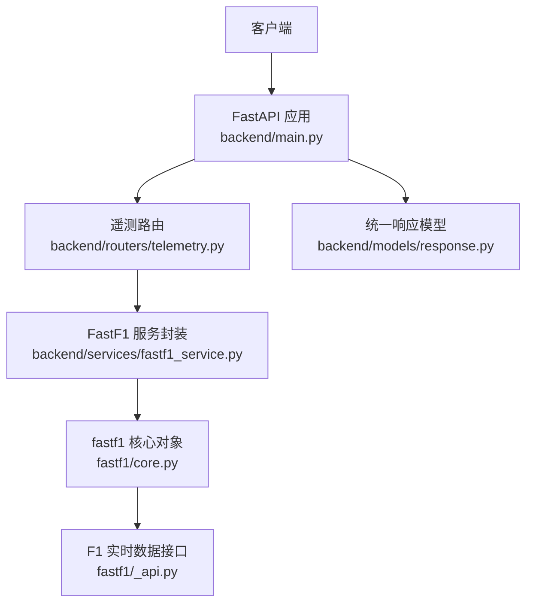
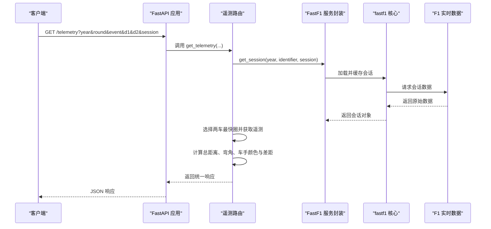
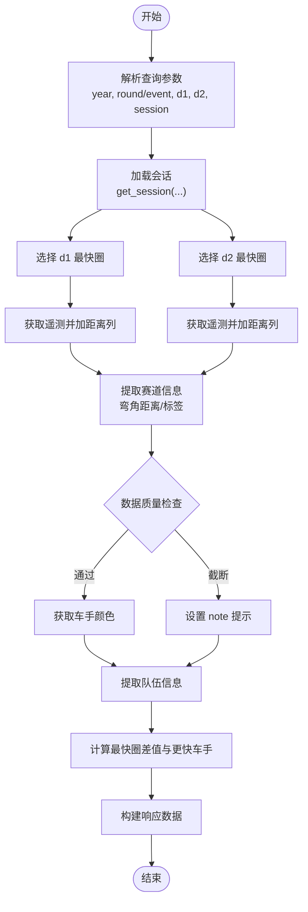
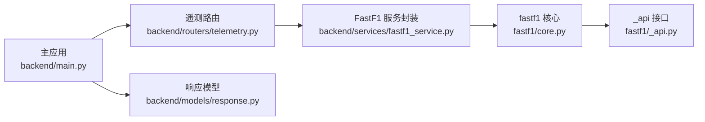
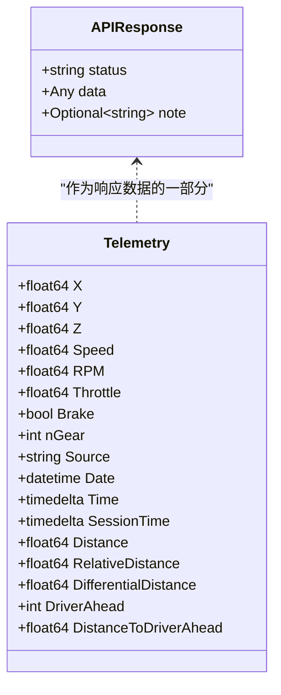

# 遥测路由

<cite>
**本文引用的文件**
- [backend/routers/telemetry.py](file://backend/routers/telemetry.py)
- [backend/services/fastf1_service.py](file://backend/services/fastf1_service.py)
- [backend/main.py](file://backend/main.py)
- [backend/models/response.py](file://backend/models/response.py)
- [fastf1/core.py](file://fastf1/core.py)
- [fastf1/_api.py](file://fastf1/_api.py)
- [examples/telemetry/plot_speed_traces.py](file://examples/telemetry/plot_speed_traces.py)
- [examples/telemetry/plot_speed_on_track.py](file://examples/telemetry/plot_speed_on_track.py)
- [examples/telemetry/plot_annotate_speed_trace.py](file://examples/telemetry/plot_annotate_speed_trace.py)
- [examples/telemetry/plot_gear_shifts_on_track.py](file://examples/telemetry/plot_gear_shifts_on_track.py)
- [miniprogram/pages/telemetry/telemetry.js](file://miniprogram/pages/telemetry/telemetry.js)
</cite>

## 目录
1. [简介](#简介)
2. [项目结构](#项目结构)
3. [核心组件](#核心组件)
4. [架构总览](#架构总览)
5. [详细组件分析](#详细组件分析)
6. [依赖关系分析](#依赖关系分析)
7. [性能考虑](#性能考虑)
8. [故障排查指南](#故障排查指南)
9. [结论](#结论)
10. [附录](#附录)

## 简介
本文件系统性地文档化了 Fast-F1 项目的遥测路由模块，重点覆盖以下内容：
- /telemetry 路由的功能与实现，包括遥测数据获取、车手对比分析、速度分析等核心能力
- 所有端点的 URL 模式、请求参数、响应格式与数据结构
- 完整的 API 使用示例，涵盖 GET /telemetry 端点的典型用法
- 遥测数据的获取流程、数据处理与可视化支持说明

该模块通过 FastAPI 提供 REST 接口，内部基于 fastf1 库访问 F1 实时数据源，结合本地缓存与内存会话缓存提升性能与稳定性。

## 项目结构
遥测路由位于后端目录 backend/routers/telemetry.py，配合服务层 backend/services/fastf1_service.py 与统一响应模型 backend/models/response.py。主应用 backend/main.py 将遥测路由挂载到 /telemetry 前缀下，并启用 CORS 与缓存。

图表来源
- [backend/main.py:27-31](file://backend/main.py#L27-L31)
- [backend/routers/telemetry.py:1-79](file://backend/routers/telemetry.py#L1-L79)
- [backend/services/fastf1_service.py:1-64](file://backend/services/fastf1_service.py#L1-L64)
- [fastf1/core.py:120-319](file://fastf1/core.py#L120-L319)
- [fastf1/_api.py:1-800](file://fastf1/_api.py#L1-L800)

章节来源
- [backend/main.py:18-41](file://backend/main.py#L18-L41)
- [backend/routers/telemetry.py:1-79](file://backend/routers/telemetry.py#L1-L79)

## 核心组件
- 遥测路由处理器：负责解析查询参数、加载会话、获取两辆赛车的最快圈遥测数据、计算车手信息与差距、标注弯角并返回统一响应。
- FastF1 服务封装：提供会话缓存、时间格式化、弯角距离与标签生成、遥测数据字典化等工具函数。
- 统一响应模型：以标准结构返回状态、数据与可选提示信息，便于前端消费。

章节来源
- [backend/routers/telemetry.py:11-79](file://backend/routers/telemetry.py#L11-L79)
- [backend/services/fastf1_service.py:14-64](file://backend/services/fastf1_service.py#L14-L64)
- [backend/models/response.py:4-14](file://backend/models/response.py#L4-L14)

## 架构总览
遥测路由的调用链路如下：

图表来源
- [backend/main.py:27-31](file://backend/main.py#L27-L31)
- [backend/routers/telemetry.py:20-76](file://backend/routers/telemetry.py#L20-L76)
- [backend/services/fastf1_service.py:14-21](file://backend/services/fastf1_service.py#L14-L21)
- [fastf1/core.py:120-319](file://fastf1/core.py#L120-L319)
- [fastf1/_api.py:185-248](file://fastf1/_api.py#L185-L248)

## 详细组件分析

### 端点定义与参数
- 端点路径：GET /telemetry
- 查询参数
  - year: 年份（整数，默认 2026）
  - round: 轮次编号（整数，可选）
  - event: 赛事名称（字符串，可选；与 round 二选一）
  - d1: 车手代码 A（字符串，默认 ALB）
  - d2: 车手代码 B（字符串，默认 ALO）
  - session: 会话类型（字符串，默认 Q，如 Qualifying）

章节来源
- [backend/routers/telemetry.py:11-19](file://backend/routers/telemetry.py#L11-L19)

### 响应格式与数据结构
统一响应体包含 status、data、note 三个字段：
- status: 字符串，成功时为 "ok"，失败时为 "error"
- data: 对象或 null（错误时）
- note: 字符串或 null（可选提示信息）

data 内容结构（成功时）：
- driver_a: 对象
  - code: 车手代码（字符串）
  - team: 车队名称（字符串）
  - color: 车手颜色（十六进制或名称，字符串）
  - lap_time: 最快圈时间（字符串，格式为分:秒.毫秒）
- driver_b: 对象（同上）
- gap: 差速信息（字符串，形如 "Δt.sss（更快车手）"）
- corner_labels: 弯角标签数组（字符串数组）
- corner_distances: 弯角距离数组（数值数组）
- telemetry: 对象
  - d1: 遥测数据对象（见下节）
  - d2: 遥测数据对象（见下节）

telemetry 对象（d1/d2）：
- distance: 距离数组（米，保留一位小数）
- speed: 速度数组（公里/小时，NaN 填充为 0，保留一位小数）
- throttle: 油门数组（百分比，NaN 填充为 0，保留一位小数）
- brake: 刹车布尔数组（NaN 填充为 false，转换为整型）
- gear: 档位数组（整型，NaN 填充为 0）

章节来源
- [backend/models/response.py:4-14](file://backend/models/response.py#L4-L14)
- [backend/routers/telemetry.py:66-76](file://backend/routers/telemetry.py#L66-L76)
- [backend/services/fastf1_service.py:55-64](file://backend/services/fastf1_service.py#L55-L64)

### 数据获取流程与处理逻辑
- 会话加载与缓存
  - 依据 year、identifier（round 或 event）、session 类型加载会话
  - 使用进程级内存缓存避免重复加载
- 最快圈与遥测
  - 分别选取 d1、d2 的最快圈
  - 获取车手数据并添加距离列，用于横向对齐
- 弯角信息
  - 从会话的 circuit_info 中提取弯角距离与标签
  - 当弯角距离为空时，按总距离等间距回退
- 数据质量检查
  - 比较最大距离，若任一车手数据截断（小于阈值），返回 note 提示
- 车手颜色与队伍
  - 尝试获取车手颜色；失败则使用默认颜色
  - 提取队伍字符串表示
- 圈速与差距
  - 解析两车最快圈时间差，输出 Δt 与更快车手标识
- 响应构建
  - 将遥测数据转换为字典并序列化

图表来源
- [backend/routers/telemetry.py:20-76](file://backend/routers/telemetry.py#L20-L76)
- [backend/services/fastf1_service.py:14-21](file://backend/services/fastf1_service.py#L14-L21)
- [backend/services/fastf1_service.py:37-64](file://backend/services/fastf1_service.py#L37-L64)

章节来源
- [backend/routers/telemetry.py:20-76](file://backend/routers/telemetry.py#L20-L76)
- [backend/services/fastf1_service.py:14-64](file://backend/services/fastf1_service.py#L14-L64)

### API 使用示例
- 基本用法
  - GET /telemetry?year=2026&round=1&d1=ALB&d2=ALO&session=Q
  - GET /telemetry?year=2026&event=Japanese+Grand+Prix&d1=VER&d2=HAM&session=Q
- 参数说明
  - year: 年份（整数）
  - round: 轮次编号（整数，可选）
  - event: 赛事名称（字符串，可选；与 round 二选一）
  - d1/d2: 车手代码（字符串，如 VER、HAM 等）
  - session: 会话类型（字符串，如 Q、R、S 等）
- 响应要点
  - 成功时 status 为 "ok"，data 包含对比信息与遥测数据
  - 失败时 status 为 "error"，note 为错误描述

章节来源
- [backend/routers/telemetry.py:11-19](file://backend/routers/telemetry.py#L11-L19)
- [backend/routers/telemetry.py:77-79](file://backend/routers/telemetry.py#L77-L79)

### 可视化支持
- 前端小程序
  - 支持在 ECharts 中绘制速度、油门、刹车、档位等通道
  - 自动标注弯角位置与标签
- 示例脚本
  - 速度叠加图、弯角标注、轨迹速度着色、档位沿赛道分布等
- 与 fastf1 绘图工具的集成
  - 使用 get_team_color/get_driver_color 获取颜色
  - add_distance/add_driver_ahead 等方法增强可视化

章节来源
- [miniprogram/pages/telemetry/telemetry.js:1-23](file://miniprogram/pages/telemetry/telemetry.js#L1-L23)
- [examples/telemetry/plot_speed_traces.py:1-53](file://examples/telemetry/plot_speed_traces.py#L1-L53)
- [examples/telemetry/plot_annotate_speed_trace.py:1-69](file://examples/telemetry/plot_annotate_speed_trace.py#L1-L69)
- [examples/telemetry/plot_speed_on_track.py:1-84](file://examples/telemetry/plot_speed_on_track.py#L1-L84)
- [examples/telemetry/plot_gear_shifts_on_track.py:1-71](file://examples/telemetry/plot_gear_shifts_on_track.py#L1-L71)

## 依赖关系分析
- 路由依赖服务层：遥测路由通过 get_session、fmt_time、get_corner_distances、get_corner_labels、telemetry_to_dict 等函数完成数据获取与转换
- 服务层依赖 fastf1 核心：会话加载、遥测数据结构、时间与距离计算
- fastf1 核心依赖实时数据接口：从 livetiming.formula1.com 获取原始数据流
- 主应用挂载路由并启用缓存与 CORS

图表来源
- [backend/routers/telemetry.py:1-9](file://backend/routers/telemetry.py#L1-L9)
- [backend/services/fastf1_service.py:1-8](file://backend/services/fastf1_service.py#L1-L8)
- [fastf1/core.py:120-319](file://fastf1/core.py#L120-L319)
- [fastf1/_api.py:1-800](file://fastf1/_api.py#L1-L800)
- [backend/main.py:27-31](file://backend/main.py#L27-L31)
- [backend/models/response.py:1-14](file://backend/models/response.py#L1-L14)

章节来源
- [backend/routers/telemetry.py:1-9](file://backend/routers/telemetry.py#L1-L9)
- [backend/services/fastf1_service.py:1-8](file://backend/services/fastf1_service.py#L1-L8)
- [fastf1/core.py:120-319](file://fastf1/core.py#L120-L319)
- [fastf1/_api.py:1-800](file://fastf1/_api.py#L1-L800)
- [backend/main.py:27-31](file://backend/main.py#L27-L31)
- [backend/models/response.py:1-14](file://backend/models/response.py#L1-L14)

## 性能考虑
- 会话缓存
  - 进程级内存缓存避免重复加载同一会话，显著降低延迟
- 数据序列化
  - telemetry_to_dict 将 NaN 填充为 0/false，减少前端处理复杂度
- 时间格式化
  - fmt_time 将 timedelta 转换为紧凑字符串，便于展示与排序
- 前端渲染优化
  - 仅传输必要字段（distance、speed、throttle、brake、gear），避免冗余数据

章节来源
- [backend/services/fastf1_service.py:11-21](file://backend/services/fastf1_service.py#L11-L21)
- [backend/services/fastf1_service.py:24-34](file://backend/services/fastf1_service.py#L24-L34)
- [backend/services/fastf1_service.py:55-64](file://backend/services/fastf1_service.py#L55-L64)
- [miniprogram/pages/telemetry/telemetry.js:4-11](file://miniprogram/pages/telemetry/telemetry.js#L4-L11)

## 故障排查指南
- 常见错误
  - 会话不可用：当 F1 实时数据接口无响应或未生成数据时，抛出异常并返回错误响应
  - 数据截断：若任一车手遥测最大距离低于预期阈值，返回 note 提示“F1 API packet loss”
  - 颜色获取失败：无法获取车手颜色时，使用默认颜色并继续返回
- 排查步骤
  - 检查 year、round/event、session 是否正确
  - 确认 d1/d2 为有效车手代码
  - 查看 note 字段是否包含数据质量提示
  - 在本地缓存目录确认会话数据是否已加载

章节来源
- [backend/routers/telemetry.py:36-44](file://backend/routers/telemetry.py#L36-L44)
- [backend/routers/telemetry.py:46-50](file://backend/routers/telemetry.py#L46-L50)
- [backend/routers/telemetry.py:77-79](file://backend/routers/telemetry.py#L77-L79)

## 结论
遥测路由模块通过统一的接口对外提供 F1 车手对比分析能力，具备完善的会话缓存、数据质量检查与可视化支持。其响应结构清晰、字段明确，便于前端快速集成与二次开发。建议在生产环境中结合缓存策略与错误监控，确保稳定与高性能。

## 附录

### 数据模型类图（代码级）

图表来源
- [backend/models/response.py:4-14](file://backend/models/response.py#L4-L14)
- [fastf1/core.py:154-199](file://fastf1/core.py#L154-L199)