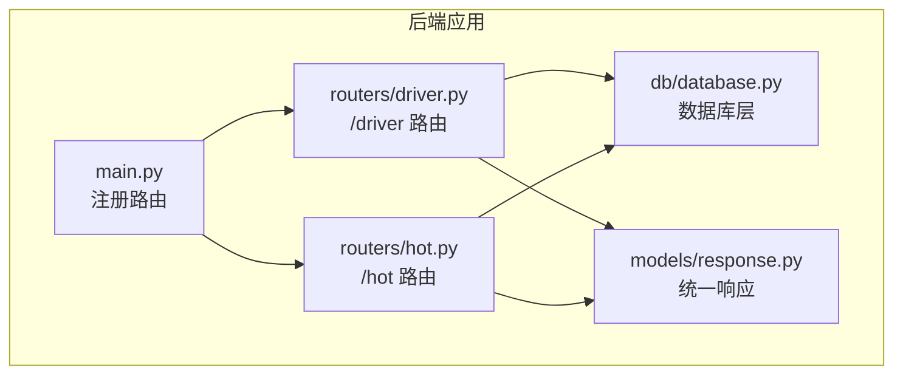
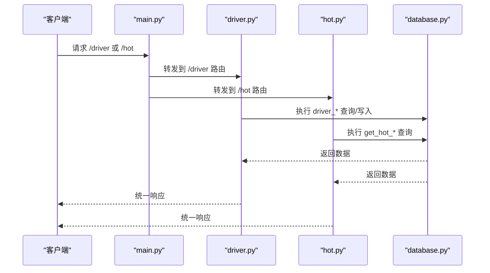
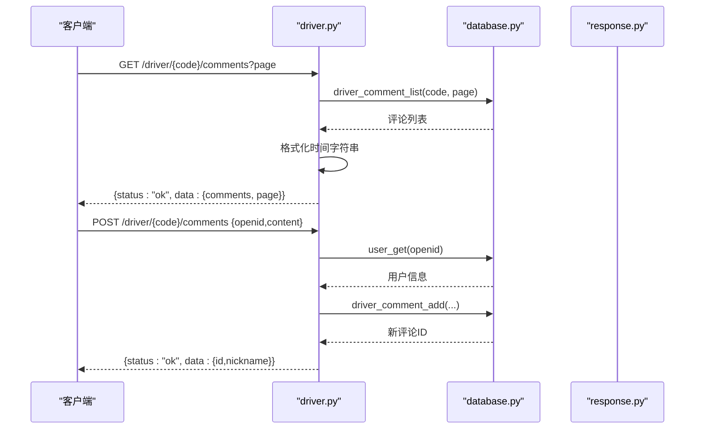
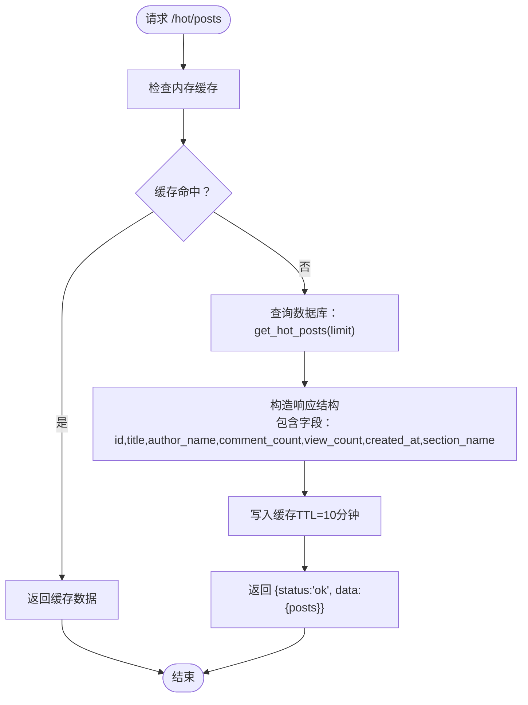
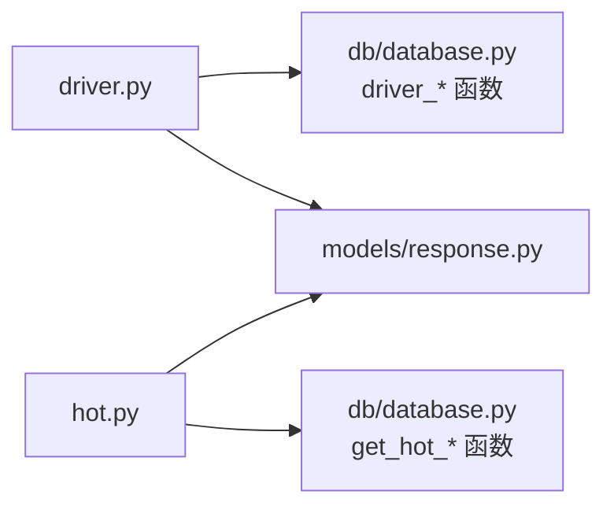

# 驾驶员与热门路由

<cite>
**本文引用的文件**
- [backend/routers/driver.py](file://backend/routers/driver.py)
- [backend/routers/hot.py](file://backend/routers/hot.py)
- [backend/main.py](file://backend/main.py)
- [backend/models/response.py](file://backend/models/response.py)
- [backend/db/database.py](file://backend/db/database.py)
</cite>

## 目录
1. [简介](#简介)
2. [项目结构](#项目结构)
3. [核心组件](#核心组件)
4. [架构总览](#架构总览)
5. [详细组件分析](#详细组件分析)
6. [依赖分析](#依赖分析)
7. [性能考虑](#性能考虑)
8. [故障排查指南](#故障排查指南)
9. [结论](#结论)
10. [附录](#附录)

## 简介
本文件面向“驾驶员”和“热门内容”两个后端路由模块，系统性说明其功能、端点定义、请求参数、响应格式、数据结构以及推荐/热度计算逻辑。读者可据此快速集成前端或客户端，实现车手信息互动与热门内容展示。

## 项目结构
- 驾驶员路由位于 backend/routers/driver.py，提供车手评论与评分相关接口。
- 热门路由位于 backend/routers/hot.py，提供热门帖子与热门资讯的Top-N排行。
- 主应用入口 backend/main.py 注册上述路由，并统一挂载到 /hot 与根路径下的 /driver。
- 响应模型 backend/models/response.py 提供统一的响应封装。
- 数据访问层 backend/db/database.py 实现热门内容与驾驶员相关数据的查询与聚合。

图表来源
- [backend/main.py:40-41](file://backend/main.py#L40-L41)
- [backend/routers/driver.py:11-21](file://backend/routers/driver.py#L11-L21)
- [backend/routers/hot.py:8-13](file://backend/routers/hot.py#L8-L13)
- [backend/models/response.py:4-14](file://backend/models/response.py#L4-L14)
- [backend/db/database.py:13-19](file://backend/db/database.py#L13-L19)

章节来源
- [backend/main.py:40-41](file://backend/main.py#L40-L41)
- [backend/routers/driver.py:11-21](file://backend/routers/driver.py#L11-L21)
- [backend/routers/hot.py:8-13](file://backend/routers/hot.py#L8-L13)
- [backend/models/response.py:4-14](file://backend/models/response.py#L4-L14)
- [backend/db/database.py:13-19](file://backend/db/database.py#L13-L19)

## 核心组件
- 驾驶员路由模块
  - 功能：车手评论列表、发表评论、点赞、评分聚合与个人评分。
  - 关键端点：/driver/{code}/comments、/driver/comments/{id}/like、/driver/{code}/rating、POST /driver/{code}/rating。
- 热门路由模块
  - 功能：热门帖子Top-N、热门资讯Top-N。
  - 关键端点：/hot/posts、/hot/news。
- 数据库层
  - 提供 get_hot_posts、get_hot_news、driver_* 系列查询与聚合方法。
- 统一响应模型
  - ok(data, note) 与 err(msg) 封装标准响应结构。

章节来源
- [backend/routers/driver.py:44-115](file://backend/routers/driver.py#L44-L115)
- [backend/routers/hot.py:32-83](file://backend/routers/hot.py#L32-L83)
- [backend/db/database.py:536-566](file://backend/db/database.py#L536-L566)
- [backend/db/database.py:1323-1414](file://backend/db/database.py#L1323-L1414)
- [backend/models/response.py:9-13](file://backend/models/response.py#L9-L13)

## 架构总览
- 应用启动时注册 /driver 与 /hot 路由，分别挂载至根路径与 /hot 前缀。
- 每个路由模块通过数据库层执行查询与写入，返回统一响应模型。
- 热门路由内置内存缓存（TTL=10分钟），减轻数据库压力。

图表来源
- [backend/main.py:40-41](file://backend/main.py#L40-L41)
- [backend/routers/driver.py:44-115](file://backend/routers/driver.py#L44-L115)
- [backend/routers/hot.py:32-83](file://backend/routers/hot.py#L32-L83)
- [backend/db/database.py:536-566](file://backend/db/database.py#L536-L566)

## 详细组件分析

### 驾驶员路由模块（/driver）
- 支持的车手代码集合：包含多支车手的两位/三位代号。
- 接口一览
  - GET /driver/{code}/comments?page=1
    - 参数：code（车手代号，不区分大小写）、page（页码，默认1）
    - 行为：列出该车手的评论，按创建时间格式化显示“刚刚/分钟前/小时前/天前”
    - 响应：包含 comments 列表与当前页码
  - POST /driver/{code}/comments
    - 请求体：{ openid, content }
    - 行为：校验 openid 对应用户存在，校验评论长度，插入评论并返回评论ID与昵称
  - POST /driver/comments/{id}/like
    - 行为：对指定评论点赞，返回新的点赞数
  - GET /driver/{code}/rating?openid=
    - 行为：返回该车手评分聚合统计与当前用户个人评分（若提供 openid）
  - POST /driver/{code}/rating
    - 请求体：{ openid, speed, consist, defend, wet, mental }（均为1-5整数）
    - 行为：提交或更新评分，返回聚合统计与本次评分

- 数据结构与复杂度
  - 评论列表：按车手代号与时间排序，分页查询，时间复杂度 O(logN + M)，N为索引，M为分页大小
  - 评分聚合：对单个车手执行AVG与COUNT，时间复杂度 O(N)，N为评分总数
  - 评分写入：UPSERT，唯一约束保证每人每车手仅一次评分，时间复杂度 O(logN)

- 错误处理
  - 无效车手代码、评论为空或超长、openid不存在、评分范围非法等均返回错误响应

图表来源
- [backend/routers/driver.py:44-82](file://backend/routers/driver.py#L44-L82)
- [backend/db/database.py:1335-1346](file://backend/db/database.py#L1335-L1346)
- [backend/db/database.py:344-349](file://backend/db/database.py#L344-L349)
- [backend/db/database.py:1323-1332](file://backend/db/database.py#L1323-L1332)
- [backend/models/response.py:9-13](file://backend/models/response.py#L9-L13)

章节来源
- [backend/routers/driver.py:23-27](file://backend/routers/driver.py#L23-L27)
- [backend/routers/driver.py:44-82](file://backend/routers/driver.py#L44-L82)
- [backend/routers/driver.py:85-88](file://backend/routers/driver.py#L85-L88)
- [backend/routers/driver.py:91-115](file://backend/routers/driver.py#L91-L115)
- [backend/db/database.py:1335-1346](file://backend/db/database.py#L1335-L1346)
- [backend/db/database.py:1323-1332](file://backend/db/database.py#L1323-L1332)
- [backend/db/database.py:1349-1360](file://backend/db/database.py#L1349-L1360)
- [backend/db/database.py:1396-1414](file://backend/db/database.py#L1396-L1414)
- [backend/db/database.py:1370-1383](file://backend/db/database.py#L1370-L1383)
- [backend/models/response.py:9-13](file://backend/models/response.py#L9-L13)

### 热门路由模块（/hot）
- 热门帖子（/hot/posts）
  - 参数：limit（默认5）
  - 算法：热度分 = (comment_count×0.5 + view_count×0.3) / (hours_since/24 + 1)
  - 缓存：内存缓存，TTL=10分钟，命中直接返回
  - 响应：包含 posts 列表，每项含 id、title、author_name、comment_count、view_count、created_at、section_name
- 热门资讯（/hot/news）
  - 参数：limit（默认5）
  - 算法：优先有AI解读的资讯，再按发布时间倒序
  - 缓存：内存缓存，TTL=10分钟，命中直接返回
  - 响应：包含 news 列表，每项含 id、title、source、has_analysis、published_at

图表来源
- [backend/routers/hot.py:32-57](file://backend/routers/hot.py#L32-L57)
- [backend/db/database.py:536-551](file://backend/db/database.py#L536-L551)

章节来源
- [backend/routers/hot.py:32-83](file://backend/routers/hot.py#L32-L83)
- [backend/db/database.py:536-566](file://backend/db/database.py#L536-L566)

## 依赖分析
- 路由到数据库
  - /driver 路由依赖 driver_comment_list、driver_comment_add、driver_comment_like、driver_rating_upsert、driver_rating_get_mine、driver_rating_aggregate 等
  - /hot 路由依赖 get_hot_posts、get_hot_news
- 统一响应
  - 所有路由均通过 ok()/err() 返回统一结构
- 缓存策略
  - 热门路由内置内存缓存，避免重复查询

图表来源
- [backend/routers/driver.py:15-19](file://backend/routers/driver.py#L15-L19)
- [backend/routers/hot.py:10-11](file://backend/routers/hot.py#L10-L11)
- [backend/models/response.py:9-13](file://backend/models/response.py#L9-L13)
- [backend/db/database.py:1323-1414](file://backend/db/database.py#L1323-L1414)
- [backend/db/database.py:536-566](file://backend/db/database.py#L536-L566)

章节来源
- [backend/routers/driver.py:15-19](file://backend/routers/driver.py#L15-L19)
- [backend/routers/hot.py:10-11](file://backend/routers/hot.py#L10-L11)
- [backend/models/response.py:9-13](file://backend/models/response.py#L9-L13)
- [backend/db/database.py:1323-1414](file://backend/db/database.py#L1323-L1414)
- [backend/db/database.py:536-566](file://backend/db/database.py#L536-L566)

## 性能考虑
- 热门内容
  - 内存缓存（TTL=10分钟）显著降低热点查询的数据库负载
  - 热度公式对时间衰减，避免旧内容长期霸榜
- 驱动员评论
  - 评论列表按时间降序分页，索引优化查询
  - 评分聚合使用数据库聚合函数，避免应用层遍历
- 建议
  - 适当调整 limit 与缓存 TTL
  - 在高并发场景下可考虑引入Redis等持久化缓存

## 故障排查指南
- 常见错误
  - 无效车手代码：检查 code 是否在允许集合内
  - 评论为空或超长：content 长度限制为200字符
  - openid 未注册：需先在论坛注册昵称
  - 评分不在1-5范围内：确保所有维度均为1-5整数
- 排查步骤
  - 确认路由前缀：/driver 与 /hot 已在 main.py 中注册
  - 查看数据库连接与表结构是否完整
  - 检查缓存是否命中（/hot 路由）

章节来源
- [backend/routers/driver.py:47-48](file://backend/routers/driver.py#L47-L48)
- [backend/routers/driver.py:70-74](file://backend/routers/driver.py#L70-L74)
- [backend/routers/driver.py:76-79](file://backend/routers/driver.py#L76-L79)
- [backend/routers/driver.py:106-108](file://backend/routers/driver.py#L106-L108)
- [backend/main.py:40-41](file://backend/main.py#L40-L41)

## 结论
- 驾驶员路由提供了完整的车手互动能力（评论、点赞、评分），数据结构清晰，错误处理完备。
- 热门路由通过简单有效的热度公式与内存缓存，实现了高性能的Top-N推荐。
- 建议在生产环境中结合Redis进行缓存扩展，并持续监控数据库索引与查询性能。

## 附录

### API 端点与参数总览
- /driver/{code}/comments
  - 方法：GET
  - 参数：code（必填）、page（可选，默认1）
  - 响应：{ comments: [...], page }
- /driver/{code}/comments
  - 方法：POST
  - 请求体：{ openid, content }
  - 响应：{ id, nickname }
- /driver/comments/{id}/like
  - 方法：POST
  - 响应：{ likes }
- /driver/{code}/rating
  - 方法：GET
  - 参数：code（必填）、openid（可选）
  - 响应：{ aggregate, mine }
- /driver/{code}/rating
  - 方法：POST
  - 请求体：{ openid, speed, consist, defend, wet, mental }
  - 响应：{ aggregate, mine }

- /hot/posts
  - 方法：GET
  - 参数：limit（可选，默认5）
  - 响应：{ posts: [{ id, title, author_name, comment_count, view_count, created_at, section_name }] }
- /hot/news
  - 方法：GET
  - 参数：limit（可选，默认5）
  - 响应：{ news: [{ id, title, source, has_analysis, published_at }] }

章节来源
- [backend/routers/driver.py:44-115](file://backend/routers/driver.py#L44-L115)
- [backend/routers/hot.py:32-83](file://backend/routers/hot.py#L32-L83)

### 数据结构参考
- 统一响应模型
  - 字段：status（ok/error）、data（任意）、note（可选）
- 热门帖子项
  - 字段：id、title、author_name、comment_count、view_count、created_at、section_name
- 热门资讯项
  - 字段：id、title、source、has_analysis、published_at
- 评分聚合
  - 字段：count（评分人数）、avgs（各维度均值，保留两位小数）

章节来源
- [backend/models/response.py:4-14](file://backend/models/response.py#L4-L14)
- [backend/db/database.py:536-566](file://backend/db/database.py#L536-L566)
- [backend/db/database.py:1396-1414](file://backend/db/database.py#L1396-L1414)