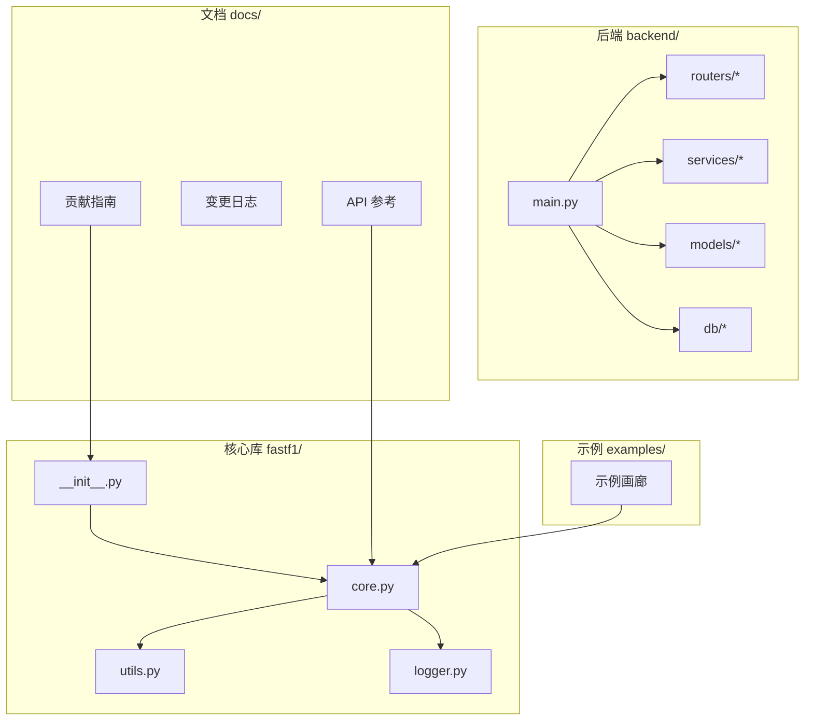
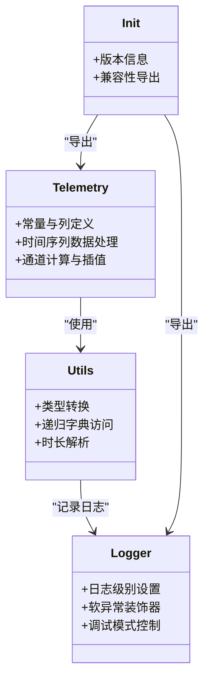

# 代码规范

<cite>
**本文引用的文件**
- [.pre-commit-config.yaml](file://.pre-commit-config.yaml)
- [pyproject.toml](file://pyproject.toml)
- [CODE_OF_CONDUCT.md](file://CODE_OF_CONDUCT.md)
- [.github/PULL_REQUEST_TEMPLATE.md](file://.github/PULL_REQUEST_TEMPLATE.md)
- [docs/contributing/coding_guide.rst](file://docs/contributing/coding_guide.rst)
- [docs/contributing/ai_policy.rst](file://docs/contributing/ai_policy.rst)
- [docs/contributing/contributing.rst](file://docs/contributing/contributing.rst)
- [fastf1/__init__.py](file://fastf1/__init__.py)
- [fastf1/core.py](file://fastf1/core.py)
- [fastf1/utils.py](file://fastf1/utils.py)
- [fastf1/logger.py](file://fastf1/logger.py)
- [pytest.ini](file://pytest.ini)
- [conftest.py](file://conftest.py)
- [fastf1/tests/test_core.py](file://fastf1/tests/test_core.py)
</cite>

## 目录
1. 引言
2. 项目结构
3. 核心组件
4. 架构总览
5. 详细组件分析
6. 依赖分析
7. 性能考量
8. 故障排查指南
9. 结论
10. 附录

## 引言
本文件为 Fast-F1 的代码规范与工程实践指南，面向贡献者与维护者，系统阐述 Python 编码标准、代码结构与组织原则、代码审查流程、静态分析与质量工具、AI 辅助开发政策、以及重构与演进策略。内容基于仓库中现有配置与文档提炼，并结合核心源码与测试实践进行说明。

## 项目结构
Fast-F1 采用以功能域为中心的模块化组织方式：
- 核心库位于 fastf1/，按领域拆分模块（如 core、utils、logger、internals 等），便于职责清晰与可维护性。
- 后端服务位于 backend/，采用路由-服务-模型分层，支持独立部署与扩展。
- 文档位于 docs/，遵循 Sphinx 风格，包含 API 参考、变更日志与贡献指南。
- 示例位于 examples/，通过 Sphinx-Gallery 生成示例画廊。
- 测试位于 fastf1/tests/，配合 pytest 与自定义夹具实现稳定可重复的测试环境。

图表来源
- [fastf1/core.py](file://fastf1/core.py)
- [fastf1/utils.py](file://fastf1/utils.py)
- [fastf1/logger.py](file://fastf1/logger.py)
- [fastf1/__init__.py](file://fastf1/__init__.py)
- [backend/main.py](file://backend/main.py)
- [docs/contributing/contributing.rst](file://docs/contributing/contributing.rst)

章节来源
- [docs/contributing/contributing.rst:70-122](file://docs/contributing/contributing.rst#L70-L122)

## 核心组件
- 模块导出与兼容：通过包级 __init__.py 导出常用接口，并对历史兼容属性进行延迟导入与弃用警告，确保平滑迁移。
- 数据与计算：core.py 定义核心数据结构（如 Telemetry）与数据处理方法，强调类型注解与可读性。
- 实用工具：utils.py 提供通用转换与辅助函数，注重错误处理与日志记录。
- 日志与健壮性：logger.py 提供统一日志管理与“软异常”装饰器，支持调试模式与可选失败的稳健加载策略。

章节来源
- [fastf1/__init__.py:15-40](file://fastf1/__init__.py#L15-L40)
- [fastf1/core.py:64-200](file://fastf1/core.py#L64-L200)
- [fastf1/utils.py:16-200](file://fastf1/utils.py#L16-L200)
- [fastf1/logger.py:9-125](file://fastf1/logger.py#L9-L125)

## 架构总览
下图展示核心库内部组件交互与职责边界，体现“数据结构-工具-日志”的分层关系。

图表来源
- [fastf1/core.py:64-200](file://fastf1/core.py#L64-L200)
- [fastf1/utils.py:16-200](file://fastf1/utils.py#L16-L200)
- [fastf1/logger.py:9-125](file://fastf1/logger.py#L9-L125)
- [fastf1/__init__.py:15-40](file://fastf1/__init__.py#L15-L40)

## 详细组件分析

### 命名约定与文档字符串
- 命名与可见性
  - 公共 API：不以单下划线前缀；新增公共函数/参数需谨慎评估稳定性。
  - 内部/私有：以单下划线前缀标识；避免在 __all__ 中暴露内部细节。
  - 模块与包：小写、简洁，避免复数或多余后缀。
- 文档字符串
  - 使用 Google 风格（参见贡献指南），包含参数、返回值、示例与注意事项。
  - 高层函数应提供最小示例，复杂示例放入 examples 目录并通过 Sphinx-Gallery 渲染。
- 版本与兼容
  - 通过包级 __init__.py 的 __getattr__ 机制实现向后兼容与弃用提示，避免破坏性变更。

章节来源
- [docs/contributing/contributing.rst:134-140](file://docs/contributing/contributing.rst#L134-L140)
- [docs/contributing/contributing.rst:221-323](file://docs/contributing/contributing.rst#L221-L323)
- [fastf1/__init__.py:29-40](file://fastf1/__init__.py#L29-L40)

### 缩进与格式化
- 统一使用空格缩进，行宽不超过 79 字符（Ruff 配置）。
- 导入排序与格式化由 pre-commit 钩子自动执行，确保一致性。
- 代码风格检查在提交前运行，编辑器可集成 Ruff 以即时反馈。

章节来源
- [pyproject.toml:89-136](file://pyproject.toml#L89-L136)
- [.pre-commit-config.yaml:1-20](file://.pre-commit-config.yaml#L1-L20)

### 注释规范与日志使用
- 注释用于解释复杂逻辑、边界条件与设计权衡；避免显而易懂的重复注释。
- 日志分级建议：
  - critical/error：非预期终止但不崩溃的严重问题。
  - warning：可能影响使用的潜在问题。
  - info：用户可能关心的运行信息。
  - debug：开发调试所需细节。
- 使用软异常装饰器包装可选功能，保证稳健性；调试模式下可禁用自动捕获以便定位问题。

章节来源
- [docs/contributing/contributing.rst:359-381](file://docs/contributing/contributing.rst#L359-L381)
- [fastf1/logger.py:86-125](file://fastf1/logger.py#L86-L125)

### 代码审查流程与标准
- PR 概要
  - 遵循编码规范，更新相关文档与变更日志。
  - 尽量保持“随时可合”状态；必要时使用草稿 PR 获取早期反馈。
  - 更新历史时优先使用 amend + force push，保持提交历史整洁。
- 文档与示例
  - 新功能需配套文档与示例；高层函数提供最小示例，复杂示例放入 examples。
  - 构建文档并解决格式警告。
- 自动化测试
  - 所有受支持 Python 版本均需通过自动化测试。
- AI 政策
  - 禁止完全由 AI 生成的 PR；必须披露所用工具与生成内容；沟通须以人类语言为主。

章节来源
- [docs/contributing/coding_guide.rst:26-47](file://docs/contributing/coding_guide.rst#L26-L47)
- [docs/contributing/coding_guide.rst:56-85](file://docs/contributing/coding_guide.rst#L56-L85)
- [.github/PULL_REQUEST_TEMPLATE.md:10-20](file://.github/PULL_REQUEST_TEMPLATE.md#L10-L20)
- [docs/contributing/ai_policy.rst:22-63](file://docs/contributing/ai_policy.rst#L22-L63)

### 静态分析与代码质量工具
- 预提交钩子
  - Ruff：语法与风格检查。
  - isort：导入排序。
  - codespell：拼写检查。
- 本地检查
  - 使用 Ruff 检查并修复风格问题；编辑器可集成以获得即时反馈。
- 文档与示例检查
  - pytest 集成 doctest 与 Sphinx 文档校验，确保示例可运行且格式正确。

章节来源
- [.pre-commit-config.yaml:1-20](file://.pre-commit-config.yaml#L1-L20)
- [pyproject.toml:89-136](file://pyproject.toml#L89-L136)
- [pytest.ini:14-20](file://pytest.ini#L14-L20)

### AI 辅助开发政策与限制
- 责任与理解
  - 贡献者需能理解自身代码及与现有代码的关系，确保质量达标。
- 沟通与披露
  - 使用 AI 进行翻译或语法修正时，尽量贴近原文；必须披露所用工具、用途与生成内容。
- 行为边界
  - 禁止完全由 AI 生成的 PR 或描述；不得仅充当 AI 代理。
- 版权与侵权
  - 由 AI 生成的代码若涉及第三方版权，责任由贡献者承担。

章节来源
- [docs/contributing/ai_policy.rst:22-63](file://docs/contributing/ai_policy.rst#L22-L63)

### 代码重构与维护性考虑
- API 稳定性
  - 变更需遵循弃用流程：先公告、再警告、最后移除；新 API 应尽量关键字化、向后兼容。
- 技术债务管理
  - 逐步清理历史兼容与过时实现；对大改动进行分阶段发布与充分测试。
- 演进策略
  - 以用户收益为衡量，尽量减少破坏性变更；对依赖外部 API 的变化保持快速适配能力。

章节来源
- [docs/contributing/contributing.rst:248-305](file://docs/contributing/contributing.rst#L248-L305)

## 依赖分析
- 依赖管理
  - Python 最低版本与依赖范围在 pyproject.toml 中集中声明，确保构建与打包一致性。
- 测试与质量
  - pytest 配置覆盖核心库、文档与示例；过滤警告以提升问题可见性。
  - conftest 提供测试标记、缓存与请求计数统计，辅助性能与稳定性评估。

图表来源
- [pyproject.toml:26-45](file://pyproject.toml#L26-L45)
- [pytest.ini:1-53](file://pytest.ini#L1-L53)
- [conftest.py:14-86](file://conftest.py#L14-L86)
- [.pre-commit-config.yaml:1-20](file://.pre-commit-config.yaml#L1-L20)

章节来源
- [pyproject.toml:26-45](file://pyproject.toml#L26-L45)
- [pytest.ini:14-20](file://pytest.ini#L14-L20)
- [conftest.py:14-86](file://conftest.py#L14-L86)

## 性能考量
- 数据加载稳健性
  - 对可选数据加载使用软异常装饰器，避免因部分数据缺失导致整体失败。
- 日志与调试
  - 默认仅显示 INFO 及以上日志；调试模式下可启用详细追踪，但会关闭自动捕获以暴露异常。
- 测试缓存与请求统计
  - 测试夹具启用缓存并统计未命中请求数，帮助识别潜在性能退化。

章节来源
- [fastf1/logger.py:86-125](file://fastf1/logger.py#L86-L125)
- [conftest.py:90-121](file://conftest.py#L90-L121)

## 故障排查指南
- 日志分级与输出
  - 使用合适的日志级别传达信息；必要时临时提升级别以获取更多上下文。
- 软异常与调试模式
  - 在调试模式下禁用自动捕获，可直接定位异常；生产默认启用软异常以增强鲁棒性。
- 测试与缓存
  - 利用测试夹具中的请求计数报告，识别未命中缓存导致的性能问题；必要时调整缓存策略。

章节来源
- [fastf1/logger.py:86-125](file://fastf1/logger.py#L86-L125)
- [conftest.py:90-121](file://conftest.py#L90-L121)

## 结论
本规范以现有配置与文档为基础，明确了 Fast-F1 的编码风格、结构组织、审查流程与质量工具使用方式，并对 AI 辅助开发提出明确边界。建议在日常开发中：
- 严格遵守命名与文档规范；
- 使用预提交工具与 Ruff 保持一致风格；
- 通过 pytest 与软异常策略保障稳健性；
- 在 PR 中完整披露 AI 使用情况并遵循贡献指南。

## 附录
- 行为准则
  - 社区互动应遵循行为准则，营造开放、包容与协作的环境。
- 贡献入口
  - 通过 Fork 与 PR 参与贡献，遵循贡献指南与 PR 模板。

章节来源
- [CODE_OF_CONDUCT.md:18-87](file://CODE_OF_CONDUCT.md#L18-L87)
- [docs/contributing/contributing.rst:75-122](file://docs/contributing/contributing.rst#L75-L122)