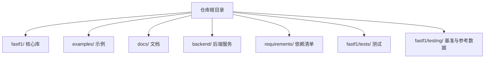
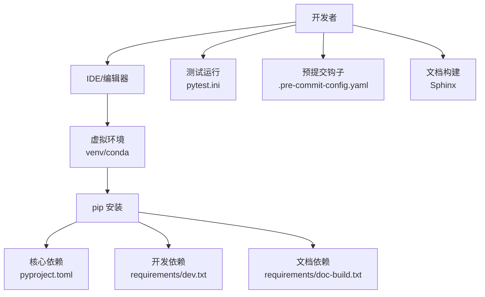
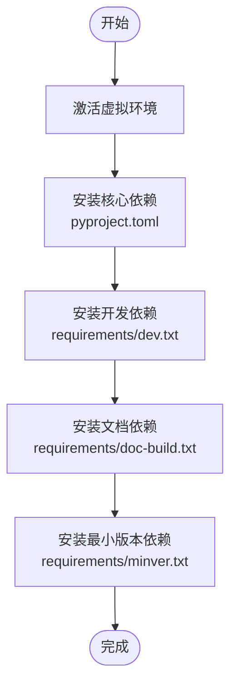
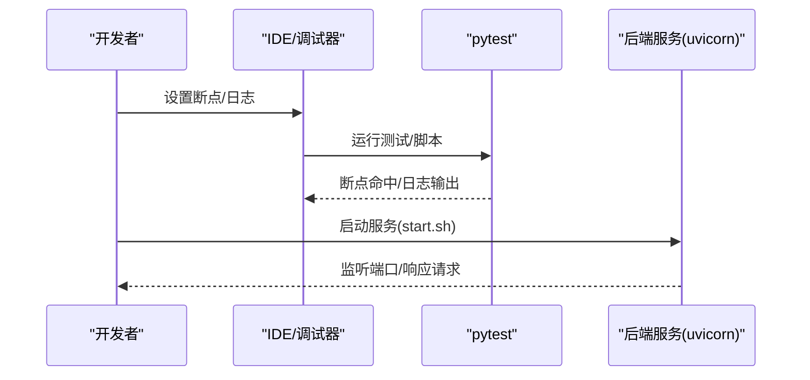
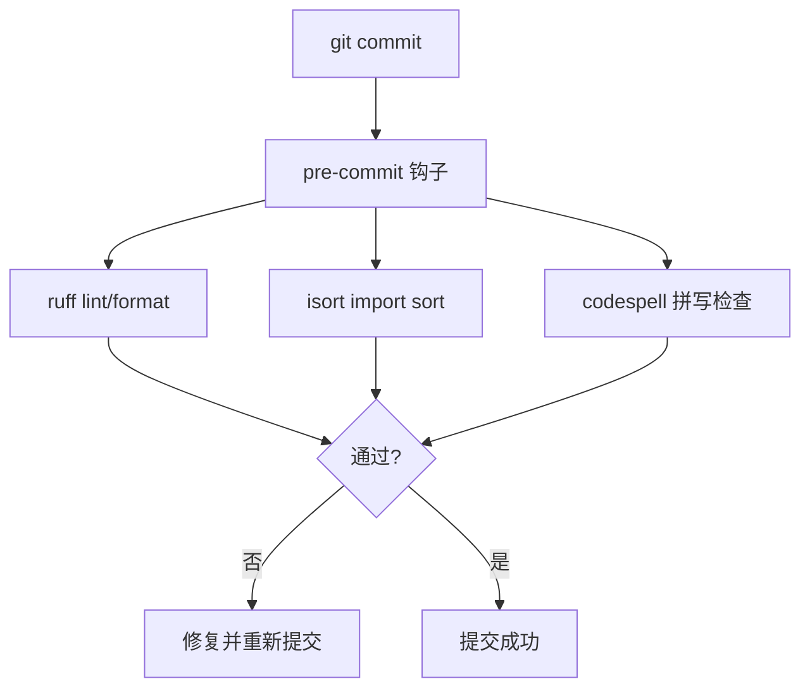
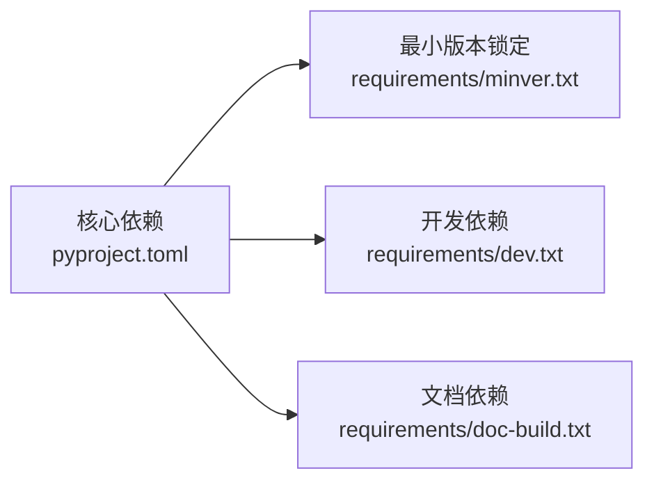

# 开发环境搭建

<cite>
**本文引用的文件**
- [README.md](file://README.md)
- [pyproject.toml](file://pyproject.toml)
- [docs/getting_started/installation.rst](file://docs/getting_started/installation.rst)
- [docs/contributing/devenv_setup.rst](file://docs/contributing/devenv_setup.rst)
- [requirements/dev.txt](file://requirements/dev.txt)
- [requirements/doc-build.txt](file://requirements/doc-build.txt)
- [requirements/minver.txt](file://requirements/minver.txt)
- [.pre-commit-config.yaml](file://.pre-commit-config.yaml)
- [pytest.ini](file://pytest.ini)
- [backend/requirements.txt](file://backend/requirements.txt)
- [backend/start.sh](file://backend/start.sh)
- [memory/MEMORY.md](file://memory/MEMORY.md)
</cite>

## 目录
1. [简介](#简介)
2. [项目结构](#项目结构)
3. [核心组件](#核心组件)
4. [架构总览](#架构总览)
5. [详细组件分析](#详细组件分析)
6. [依赖分析](#依赖分析)
7. [性能考虑](#性能考虑)
8. [故障排除指南](#故障排除指南)
9. [结论](#结论)
10. [附录](#附录)

## 简介
本指南面向希望参与 Fast-F1 项目开发的工程师与研究者，提供从系统要求、虚拟环境、依赖安装、IDE/编辑器配置、调试与性能分析，到代码格式化与静态分析工具的完整开发环境搭建流程。内容基于仓库中的配置文件与文档，确保与项目实际要求保持一致。

## 项目结构
Fast-F1 仓库采用多模块组织方式，包含核心库、示例、测试、文档与后端服务等部分。与开发环境相关的关键位置如下：
- 核心库与源码：fastf1/
- 示例与画廊：examples/
- 测试与基准：fastf1/tests/、fastf1/testing/
- 文档：docs/
- 后端服务：backend/
- 开发依赖与版本约束：requirements/

[无图示来源——此图为概念性结构示意，不直接映射具体源码文件]

**章节来源**
- [pyproject.toml:1-136](file://pyproject.toml#L1-L136)
- [docs/getting_started/installation.rst:1-27](file://docs/getting_started/installation.rst#L1-L27)

## 核心组件
- Python 版本与系统要求
  - 最低 Python 版本：3.10
  - 支持 Python 3.10 至 3.14
- 核心依赖（来自构建配置）
  - matplotlib、numpy、pandas、requests、scipy、websockets 等
  - 依赖版本范围在构建配置中明确声明
- 开发依赖
  - 包括测试框架、绘图基准、代码检查与排序、文档构建等
- 文档构建依赖
  - Sphinx 生态链与绘图相关扩展
- 最小版本锁定
  - 通过独立清单固定关键依赖的最小版本，便于一致性与回归测试

**章节来源**
- [pyproject.toml:26-45](file://pyproject.toml#L26-L45)
- [requirements/minver.txt:1-8](file://requirements/minver.txt#L1-L8)
- [requirements/dev.txt:1-10](file://requirements/dev.txt#L1-L10)
- [requirements/doc-build.txt:1-9](file://requirements/doc-build.txt#L1-L9)

## 架构总览
下图展示了开发环境的核心组成与交互关系：开发者在本地环境中运行编辑器/IDE，通过包管理器安装依赖，借助测试与文档工具链完成质量保障与交付。

[无图示来源——此图为概念性架构示意，不直接映射具体源码文件]

## 详细组件分析

### 系统要求与前置条件
- Python 版本
  - 最低版本：3.10
  - 推荐使用 3.10–3.13 以获得最佳兼容性
- 操作系统
  - 通用 Unix/Linux 与 macOS 可用；Windows 亦可使用（PowerShell/命令提示符）
- 硬件要求
  - 无特殊硬件限制；若进行大规模绘图或数据处理，建议具备足够的内存与磁盘空间
- 环境隔离
  - 强烈建议使用独立虚拟环境，避免与系统或其他项目冲突

**章节来源**
- [pyproject.toml:14-24](file://pyproject.toml#L14-L24)
- [pyproject.toml:26-27](file://pyproject.toml#L26-L27)
- [docs/getting_started/installation.rst:4-5](file://docs/getting_started/installation.rst#L4-L5)

### 虚拟环境创建与管理
- 使用 venv（官方模块）
  - 创建：python -m venv <路径>
  - 激活：Linux/macOS 使用 source <路径>/bin/activate；Windows 使用 Activate.ps1 或 activate.bat
- 使用 conda
  - 可通过 conda-forge 安装包，便于管理科学计算生态
- 使用 Docker
  - 可基于 Python 官方镜像构建容器，挂载项目目录并在容器内安装依赖
  - 注意：本仓库未提供 Dockerfile，建议依据上述依赖清单自行编写

**章节来源**
- [docs/contributing/devenv_setup.rst:18-29](file://docs/contributing/devenv_setup.rst#L18-L29)

### 依赖安装流程
- 步骤一：在虚拟环境中安装核心依赖
  - 使用 pip 安装项目自身（可选可编辑模式）
  - 安装核心依赖（pyproject.toml 中声明）
- 步骤二：安装开发依赖
  - 安装 requirements/dev.txt 中的工具与测试相关依赖
- 步骤三：可选安装文档构建依赖
  - 安装 requirements/doc-build.txt 中的 Sphinx 生态链
- 步骤四：安装最小版本锁定依赖（用于一致性与回归测试）
  - 安装 requirements/minver.txt 中的固定版本依赖

**图示来源**
- [pyproject.toml:29-44](file://pyproject.toml#L29-L44)
- [requirements/dev.txt:1-10](file://requirements/dev.txt#L1-L10)
- [requirements/doc-build.txt:1-9](file://requirements/doc-build.txt#L1-L9)
- [requirements/minver.txt:1-8](file://requirements/minver.txt#L1-L8)

**章节来源**
- [docs/contributing/devenv_setup.rst:45-70](file://docs/contributing/devenv_setup.rst#L45-L70)

### IDE 与编辑器配置
- VS Code
  - 推荐启用 Python 解释器选择、自动格式化与导入排序
  - 配合 pre-commit 钩子与 ruff/isort/codespell 等工具
- PyCharm
  - 设置项目解释器为虚拟环境中的 Python
  - 配置 pytest 为默认测试运行器
  - 若使用 matplotlib 进行绘图，注意后端设置（见“故障排除指南”）
- 其他编辑器
  - 保持与上述工具链一致即可

**章节来源**
- [.pre-commit-config.yaml:1-20](file://.pre-commit-config.yaml#L1-L20)
- [pyproject.toml:89-136](file://pyproject.toml#L89-L136)
- [pytest.ini:1-53](file://pytest.ini#L1-L53)

### 调试环境配置
- 断点与日志
  - 使用 IDE 断点配合 pytest 运行器进行交互式调试
  - 日志配置可参考项目日志模块与后端服务日志脚本
- 性能分析
  - 可结合 cProfile 或其他性能分析工具定位瓶颈
- 后端服务调试
  - 后端服务使用 uvicorn 启动，可通过 start.sh 加载 .env 并监听 8000 端口

**图示来源**
- [backend/start.sh:1-25](file://backend/start.sh#L1-L25)
- [pytest.ini:14-20](file://pytest.ini#L14-L20)

**章节来源**
- [backend/start.sh:16-24](file://backend/start.sh#L16-L24)
- [pytest.ini:14-20](file://pytest.ini#L14-L20)

### 代码格式化与静态分析
- 工具链
  - ruff：lint 与格式化
  - isort：导入排序
  - codespell：拼写检查
- 配置
  - ruff 行宽、忽略规则、文件级忽略等在 pyproject.toml 中定义
  - isort 多行输出风格与跳过目录在 pyproject.toml 中定义
  - codespell 规则与忽略路径在 pyproject.toml 中定义
- 预提交钩子
  - 通过 .pre-commit-config.yaml 配置钩子，提交时自动检查与修复

**图示来源**
- [.pre-commit-config.yaml:1-20](file://.pre-commit-config.yaml#L1-L20)
- [pyproject.toml:89-136](file://pyproject.toml#L89-L136)

**章节来源**
- [.pre-commit-config.yaml:1-20](file://.pre-commit-config.yaml#L1-L20)
- [pyproject.toml:89-136](file://pyproject.toml#L89-L136)

### 测试与文档构建
- 测试
  - 测试路径包含 fastf1、docs、examples
  - 使用 doctest 与 xdoctest，Matplotlib 基准路径与结果路径已配置
- 文档
  - 使用 Sphinx 生态链与绘图扩展构建文档
  - 文档构建依赖在 requirements/doc-build.txt 中声明

**章节来源**
- [pytest.ini:4-20](file://pytest.ini#L4-L20)
- [requirements/doc-build.txt:1-9](file://requirements/doc-build.txt#L1-L9)

## 依赖分析
- 核心依赖与版本范围
  - matplotlib、numpy、pandas、requests、scipy、websockets 等均有明确版本范围
- 最小版本锁定
  - 通过 requirements/minver.txt 固定关键依赖的最小版本，保证一致性
- 开发与文档依赖
  - 开发依赖与文档依赖分别在 requirements/dev.txt 与 requirements/doc-build.txt 中声明

**图示来源**
- [pyproject.toml:29-44](file://pyproject.toml#L29-L44)
- [requirements/minver.txt:1-8](file://requirements/minver.txt#L1-L8)
- [requirements/dev.txt:1-10](file://requirements/dev.txt#L1-L10)
- [requirements/doc-build.txt:1-9](file://requirements/doc-build.txt#L1-L9)

**章节来源**
- [pyproject.toml:29-44](file://pyproject.toml#L29-L44)
- [requirements/minver.txt:1-8](file://requirements/minver.txt#L1-L8)
- [requirements/dev.txt:1-10](file://requirements/dev.txt#L1-L10)
- [requirements/doc-build.txt:1-9](file://requirements/doc-build.txt#L1-L9)

## 性能考虑
- 后端性能优化模式
  - 提供并行请求与缓存模板，减少首查延迟
- 网络延迟
  - 大陆至香港网络握手约 3 秒，需前端缓存兜底
- 服务器部署
  - systemd 服务的工作目录与 venv 路径需正确配置，避免定时任务静默失败

**章节来源**
- [memory/MEMORY.md:29-37](file://memory/MEMORY.md#L29-L37)
- [memory/MEMORY.md:92-95](file://memory/MEMORY.md#L92-L95)

## 故障排除指南
- matplotlib 后端问题（PyCharm）
  - 现象：PyCharm 后端报错
  - 解决：在脚本中设置 matplotlib 后端为 Agg
- 保存图片路径
  - 现象：图片无法显示或找不到
  - 解决：将图片保存到仓库根目录
- 2026 赛季 corner 距离为 NaN
  - 现象：circuit_info.corners['Distance'] 全为 NaN
  - 解决：采用等间距回退策略
- 遥测数据截断
  - 现象：偶发截断（如铃鹿最快圈）
  - 解决：按原样展示并添加注释说明
- LapTime 时间格式
  - 现象：显示 "0 days"
  - 解决：使用自定义格式化函数避免显示天数
- 后端定时任务静默失败
  - 现象：日志显示缺少 APScheduler
  - 解决：在服务器 venv 中安装 APScheduler
- 后端服务工作目录错误
  - 现象：服务启动失败或路径错误
  - 解决：确认 systemd 工作目录为 backend/，并正确 rsync

**章节来源**
- [memory/MEMORY.md:14-20](file://memory/MEMORY.md#L14-L20)
- [memory/MEMORY.md:67-95](file://memory/MEMORY.md#L67-L95)

## 结论
按照本指南完成系统要求确认、虚拟环境创建、依赖安装与工具链配置后，即可在本地高效开展 Fast-F1 的开发与测试工作。建议在提交前运行预提交钩子与测试，确保代码风格与功能符合项目标准。

## 附录
- 安装与使用
  - 推荐使用 pip 或 conda 安装
  - WASM 环境（如 Pyodide、JupyterLite）需要额外步骤
- 后端服务
  - 使用 uvicorn 启动，支持 .env 环境变量加载
  - 默认监听 0.0.0.0:8000

**章节来源**
- [README.md:20-44](file://README.md#L20-L44)
- [backend/start.sh:16-24](file://backend/start.sh#L16-L24)