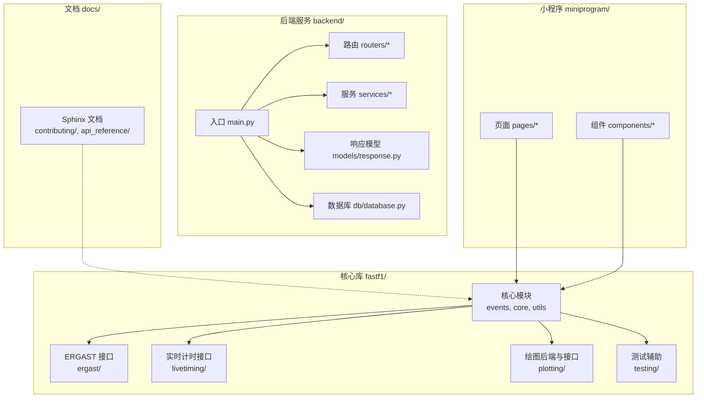
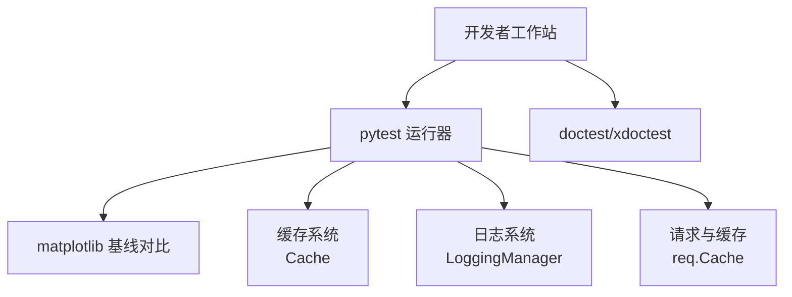
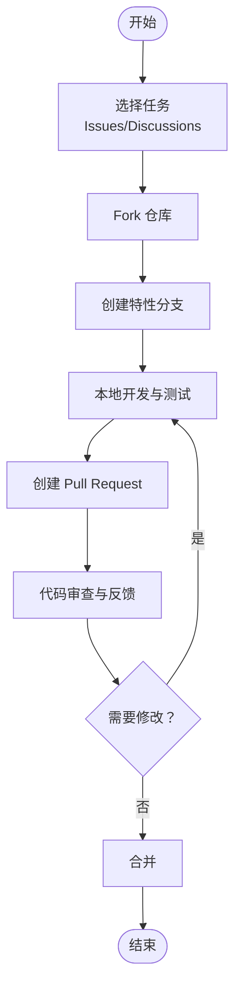
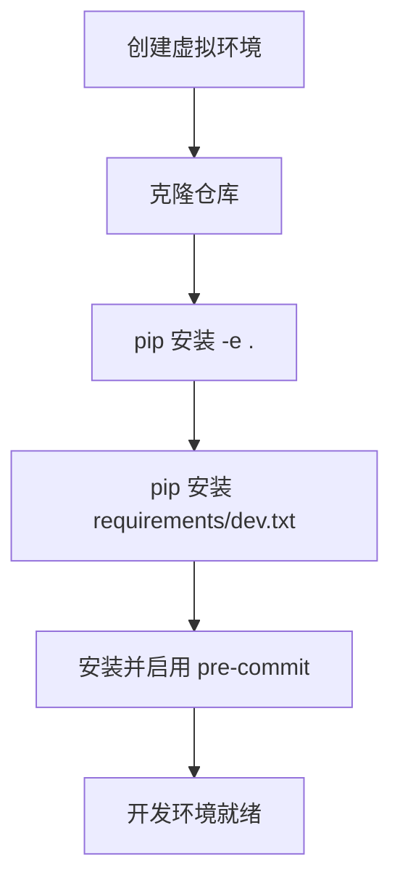
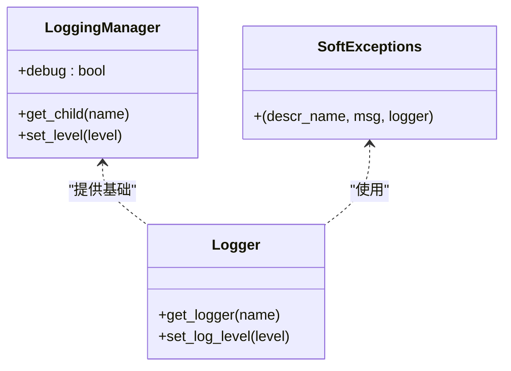
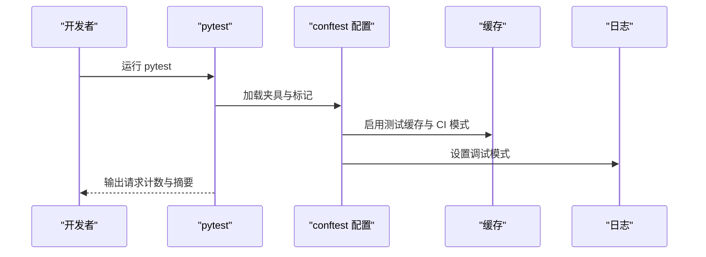
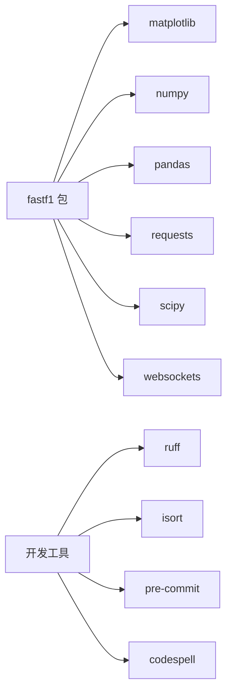

# 开发者指南

<cite>
**本文引用的文件**
- [README.md](file://README.md)
- [.github/CONTRIBUTING.md](file://.github/CONTRIBUTING.md)
- [.github/PULL_REQUEST_TEMPLATE.md](file://.github/PULL_REQUEST_TEMPLATE.md)
- [CODE_OF_CONDUCT.md](file://CODE_OF_CONDUCT.md)
- [docs/contributing/index.rst](file://docs/contributing/index.rst)
- [docs/contributing/contributing.rst](file://docs/contributing/contributing.rst)
- [docs/contributing/coding_guide.rst](file://docs/contributing/coding_guide.rst)
- [docs/contributing/devenv_setup.rst](file://docs/contributing/devenv_setup.rst)
- [docs/contributing/testing.rst](file://docs/contributing/testing.rst)
- [pyproject.toml](file://pyproject.toml)
- [requirements/dev.txt](file://requirements/dev.txt)
- [requirements/minver.txt](file://requirements/minver.txt)
- [.pre-commit-config.yaml](file://.pre-commit-config.yaml)
- [pytest.ini](file://pytest.ini)
- [conftest.py](file://conftest.py)
- [fastf1/__init__.py](file://fastf1/__init__.py)
- [fastf1/logger.py](file://fastf1/logger.py)
</cite>

## 目录
1. [简介](#简介)
2. [项目结构](#项目结构)
3. [核心组件](#核心组件)
4. [架构总览](#架构总览)
5. [详细组件分析](#详细组件分析)
6. [依赖关系分析](#依赖关系分析)
7. [性能考虑](#性能考虑)
8. [故障排查指南](#故障排查指南)
9. [结论](#结论)
10. [附录](#附录)

## 简介
本指南面向希望为 Fast-F1 做出贡献的开发者，覆盖从环境搭建、代码贡献、测试与质量保障到文档与社区治理的全流程。内容基于仓库中的贡献文档、配置文件与核心模块整理而成，帮助你快速上手并高质量地参与项目。

## 项目结构
Fast-F1 是一个围绕 Formula 1 数据访问与可视化的 Python 包，采用分层与模块化组织：
- 核心库位于 fastf1/，包含事件、数据加载、绘图、内部工具等子模块
- 文档位于 docs/，使用 Sphinx 构建，涵盖贡献、测试、示例等主题
- 后端服务位于 backend/，提供数据分析与新闻聚合等服务
- 小程序（miniprogram/）用于前端展示
- 示例位于 examples/，通过 Sphinx-Gallery 生成示例画廊
- 测试位于 fastf1/tests/，配合 fastf1.testing 提供参考数据与测试夹具
- 开发与质量工具：pyproject.toml、pytest.ini、.pre-commit-config.yaml、requirements/*.txt

**图表来源**
- [fastf1/__init__.py:1-40](file://fastf1/__init__.py#L1-L40)
- [docs/contributing/index.rst:1-43](file://docs/contributing/index.rst#L1-L43)

**章节来源**
- [docs/contributing/index.rst:1-43](file://docs/contributing/index.rst#L1-L43)

## 核心组件
- 版本与导出：包版本由 _version 生成；对外导出常用 API（如 get_session、get_event 等），并通过 __getattr__ 兼容旧路径导入
- 日志系统：统一的 LoggingManager 管理根日志器与子日志器，支持设置级别、调试模式与软异常处理装饰器
- 缓存与请求：通过 req.Cache 控制缓存行为，CI 模式下仅允许未缓存请求，便于测试稳定性
- 测试夹具：conftest.py 提供缓存启用、日志调试开关、请求计数汇总与终端摘要输出

**章节来源**
- [fastf1/__init__.py:1-40](file://fastf1/__init__.py#L1-L40)
- [fastf1/logger.py:1-125](file://fastf1/logger.py#L1-L125)
- [conftest.py:1-162](file://conftest.py#L1-L162)

## 架构总览
Fast-F1 的核心运行时由 Python 包实现，外部数据源包括 ERGAST、实时计时与第三方 API。测试框架使用 pytest，结合 doctest 与 matplotlib 图形基线验证。开发工具链通过 pre-commit 钩子与 ruff/isort/codespell 确保风格一致与拼写正确。

**图表来源**
- [pytest.ini:1-53](file://pytest.ini#L1-L53)
- [conftest.py:124-162](file://conftest.py#L124-L162)
- [fastf1/logger.py:9-125](file://fastf1/logger.py#L9-L125)

## 详细组件分析

### 贡献流程与社区治理
- 提交 Bug 报告：在 GitHub Issues 中按模板填写摘要、最小可复现代码、实际/期望结果、版本信息
- 功能请求：在 Issues 或 Discussions 中提出，并鼓励自行实现
- 代码贡献：fork -> 分支开发 -> 可选草稿 PR -> 提交 PR -> 审查与迭代
- AI 使用披露：PR 描述中需如实披露 AI 工具使用情况
- 行为准则：尊重、包容、协作、同理心，违规将按流程处理

**图表来源**
- [docs/contributing/contributing.rst:15-122](file://docs/contributing/contributing.rst#L15-L122)
- [CODE_OF_CONDUCT.md:1-183](file://CODE_OF_CONDUCT.md#L1-L183)

**章节来源**
- [docs/contributing/contributing.rst:15-122](file://docs/contributing/contributing.rst#L15-L122)
- [.github/PULL_REQUEST_TEMPLATE.md:1-20](file://.github/PULL_REQUEST_TEMPLATE.md#L1-L20)
- [CODE_OF_CONDUCT.md:1-183](file://CODE_OF_CONDUCT.md#L1-L183)

### 开发环境搭建
- 建议使用虚拟环境隔离开发依赖
- 克隆仓库后以可编辑模式安装包
- 安装开发依赖与可选文档构建依赖
- 安装并启用 pre-commit 钩子，自动执行 ruff、isort、codespell

**图表来源**
- [docs/contributing/devenv_setup.rst:18-83](file://docs/contributing/devenv_setup.rst#L18-L83)
- [.pre-commit-config.yaml:1-20](file://.pre-commit-config.yaml#L1-L20)

**章节来源**
- [docs/contributing/devenv_setup.rst:1-83](file://docs/contributing/devenv_setup.rst#L1-L83)
- [requirements/dev.txt:1-10](file://requirements/dev.txt#L1-L10)
- [.pre-commit-config.yaml:1-20](file://.pre-commit-config.yaml#L1-L20)

### 代码规范与最佳实践
- 代码风格：遵循 PEP8，使用 ruff 检查；最大行长 79；导入顺序用 isort
- 文档字符串：采用 Google 风格（示例见贡献指南）
- API 稳定性：新增/变更 API 需遵循弃用流程，保证向后兼容
- 日志使用：统一通过 fastf1.logger 获取子日志器；按级别区分错误/警告/信息/调试
- 可选功能优雅失败：使用 soft_exceptions 装饰器包裹可能失败的可选处理逻辑
- 依赖版本：遵循项目支持的 Python 与主要依赖范围

**图表来源**
- [fastf1/logger.py:9-125](file://fastf1/logger.py#L9-L125)
- [docs/contributing/contributing.rst:134-178](file://docs/contributing/contributing.rst#L134-L178)

**章节来源**
- [docs/contributing/contributing.rst:134-178](file://docs/contributing/contributing.rst#L134-L178)
- [pyproject.toml:89-136](file://pyproject.toml#L89-L136)
- [fastf1/logger.py:86-125](file://fastf1/logger.py#L86-L125)

### 测试策略
- 测试框架：pytest，启用 doctest 与 matplotlib 基线对比
- 夹具与配置：conftest.py 统一启用缓存、CI 模式、日志调试、请求计数与终端摘要
- 参数化控制：支持跳过慢测试、禁用真实 Telemetry API、仅运行项目结构/文档测试
- 质量门禁：CI 中运行所有测试；可通过特定注释跳过部分检查

**图表来源**
- [pytest.ini:1-53](file://pytest.ini#L1-L53)
- [conftest.py:124-162](file://conftest.py#L124-L162)

**章节来源**
- [docs/contributing/testing.rst:1-96](file://docs/contributing/testing.rst#L1-L96)
- [pytest.ini:1-53](file://pytest.ini#L1-L53)
- [conftest.py:1-162](file://conftest.py#L1-L162)

### 扩展开发指南
- 插件与扩展点：当前结构以模块化为主，建议在 fastf1/ 下新增子模块或在现有接口上扩展
- API 扩展：新增公共函数/参数需遵循命名与参数设计原则；避免破坏既有 API
- 第三方集成：通过独立服务（backend/）或外部接口适配器接入，保持核心库稳定
- 文档与示例：新增功能需配套文档与示例脚本，纳入 Sphinx-Gallery

**章节来源**
- [docs/contributing/contributing.rst:306-323](file://docs/contributing/contributing.rst#L306-L323)
- [docs/contributing/index.rst:28-36](file://docs/contributing/index.rst#L28-L36)

### 部署与运维
- 版本与打包：使用 hatchling 构建；wheel/sdist 包含 fastf1/ 并排除测试目录
- 最低版本约束：在 requirements/minver.txt 中声明核心依赖最低版本
- 生产环境建议：使用受支持的 Python 版本与依赖范围；在 CI 中验证多版本兼容性

**章节来源**
- [pyproject.toml:51-88](file://pyproject.toml#L51-L88)
- [requirements/minver.txt:1-8](file://requirements/minver.txt#L1-L8)

## 依赖关系分析
- 语言与平台：Python >= 3.10，支持多个次要版本
- 主要依赖：matplotlib、numpy、pandas、requests、scipy、websockets 等
- 开发与质量：pytest、ruff、isort、pre-commit、codespell
- 文档：Sphinx 相关工具（见 requirements/doc-build.txt）

**图表来源**
- [pyproject.toml:29-45](file://pyproject.toml#L29-L45)
- [requirements/dev.txt:1-10](file://requirements/dev.txt#L1-L10)

**章节来源**
- [pyproject.toml:29-45](file://pyproject.toml#L29-L45)
- [requirements/dev.txt:1-10](file://requirements/dev.txt#L1-L10)

## 性能考虑
- 缓存优先：启用 Cache 以减少重复网络请求；CI 模式仅允许未缓存请求，确保测试一致性
- 可选处理降级：对可选数据加载与校验使用软异常包装，避免整体失败
- 日志级别：默认 INFO，必要时提升至 DEBUG 以辅助定位性能瓶颈
- 测试并行：pytest-xdist 支持多进程并行，缩短测试时间（按需使用）

**章节来源**
- [conftest.py:135-149](file://conftest.py#L135-L149)
- [fastf1/logger.py:86-125](file://fastf1/logger.py#L86-L125)
- [docs/contributing/testing.rst:36-44](file://docs/contributing/testing.rst#L36-L44)

## 故障排查指南
- 日志与调试：通过 set_log_level 调整可见级别；开启调试模式可暴露未捕获异常
- 请求计数：测试结束后可在终端看到未命中缓存的请求数，辅助识别缓存命中问题
- 软异常：对可选功能使用装饰器包装，出现异常会记录警告与调试堆栈，便于定位但不中断主流程
- 常见问题：确认已安装开发依赖与 pre-commit 钩子；在 CI 环境中注意缓存目录存在性

**章节来源**
- [fastf1/logger.py:71-125](file://fastf1/logger.py#L71-L125)
- [conftest.py:90-121](file://conftest.py#L90-L121)

## 结论
本指南总结了 Fast-F1 的贡献流程、开发环境、代码规范、测试策略与扩展方向。建议在提交前完成本地测试与风格检查，遵循弃用与 API 设计原则，并在 PR 描述中清晰说明变更动机与影响范围。通过社区行为准则与协作流程，共同维护高质量的开源生态。

## 附录
- 快速链接
  - 贡献指南索引：[docs/contributing/index.rst:1-43](file://docs/contributing/index.rst#L1-L43)
  - 代码贡献流程：[docs/contributing/contributing.rst:75-122](file://docs/contributing/contributing.rst#L75-L122)
  - 开发环境设置：[docs/contributing/devenv_setup.rst:1-83](file://docs/contributing/devenv_setup.rst#L1-L83)
  - 测试与质量：[docs/contributing/testing.rst:1-96](file://docs/contributing/testing.rst#L1-L96)
  - 行为准则：[CODE_OF_CONDUCT.md:1-183](file://CODE_OF_CONDUCT.md#L1-L183)
  - GitHub 贡献入口：[.github/CONTRIBUTING.md:1-1](file://.github/CONTRIBUTING.md#L1-L1)
  - PR 模板：[.github/PULL_REQUEST_TEMPLATE.md:1-20](file://.github/PULL_REQUEST_TEMPLATE.md#L1-L20)